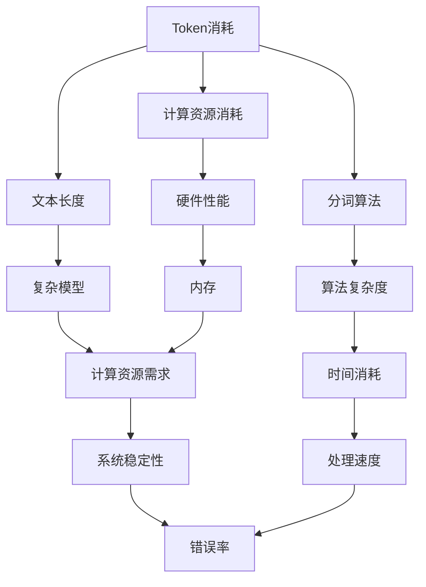
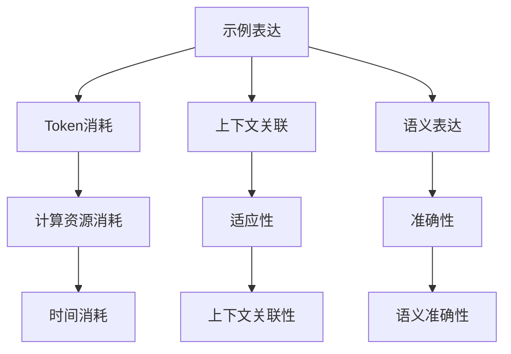
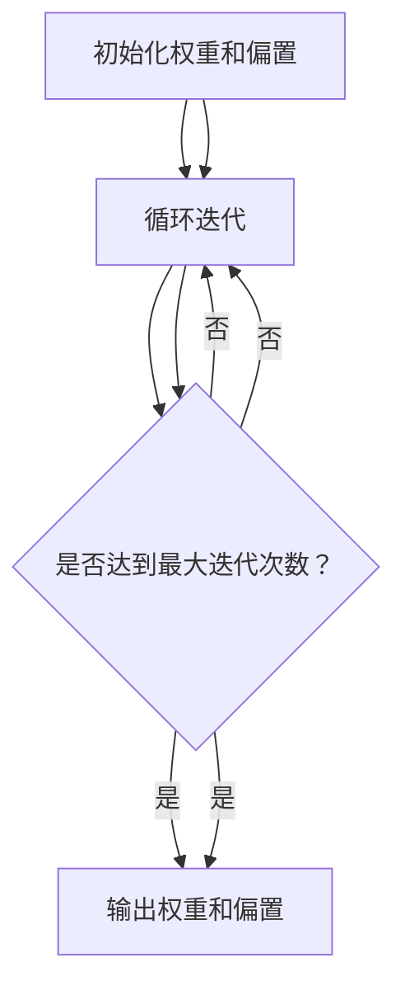
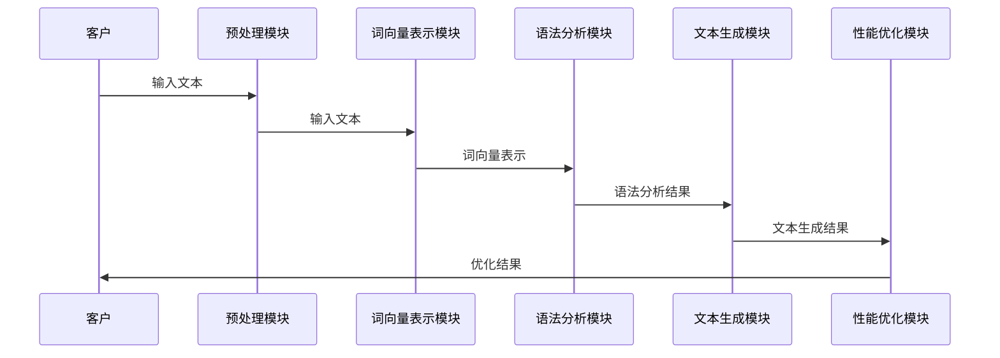

                 

# 《优化示例表达以减少token消耗》

## 关键词

自然语言处理，Token消耗，优化算法，系统架构，项目实战

## 摘要

本文将深入探讨优化示例表达以减少Token消耗的问题。首先，我们将介绍优化示例表达的重要性以及自然语言处理中的Token消耗概念。接着，我们将详细讨论示例表达优化的方法与策略，包括清晰性、简洁性、上下文关联和语义表达优化。随后，我们将介绍优化示例表达的核心概念与联系，并通过对比表格和ER实体关系图进行阐述。接下来，我们将讲解优化算法的原理，使用Mermaid流程图和Python源代码来阐述算法的工作机制。此外，我们将详细介绍系统分析与架构设计，包括问题场景介绍、系统功能设计、架构图、接口设计和系统交互流程。在项目实战部分，我们将展示环境安装与配置、系统核心实现源代码以及实际案例分析和详细讲解。最后，我们将总结全文内容，并展望优化示例表达的未来趋势。

## 第一部分：引言与背景

### 第1章：优化示例表达的重要性

#### 1.1.1 问题背景与现状

在当今信息技术迅速发展的时代，自然语言处理（NLP）成为了人工智能领域的一个重要分支。NLP技术广泛应用于语音识别、机器翻译、情感分析、文本生成等场景。然而，随着数据量的增长和复杂性的提升，自然语言处理过程中面临的挑战也日益严峻。其中，Token消耗问题尤为突出。

Token消耗是指自然语言处理过程中，将文本转换为Token（标记）时所需的计算资源和时间。随着文本长度的增加，Token消耗会显著上升，导致系统性能下降，甚至无法处理大规模文本数据。因此，优化示例表达以减少Token消耗变得至关重要。

#### 1.1.2 为什么需要优化示例表达

优化示例表达的主要目的是提高自然语言处理系统的效率和准确性。具体来说，优化示例表达可以带来以下几个方面的好处：

1. **减少计算资源消耗**：通过简化示例表达，可以降低Token消耗，从而减少计算资源和时间的消耗，提高系统处理效率。
2. **提高系统稳定性**：优化示例表达可以减少系统处理过程中的异常情况，提高系统的稳定性和可靠性。
3. **提升用户体验**：在机器翻译、语音识别等应用中，优化示例表达可以减少误译、误识别等错误，提升用户体验。
4. **拓展应用场景**：优化示例表达可以使自然语言处理系统在更多复杂场景下发挥作用，拓展其应用领域。

#### 1.1.3 本书结构概述

本文将分为六个部分，具体结构如下：

1. **引言与背景**：介绍优化示例表达的重要性和现状。
2. **理论基础**：讲解自然语言处理与Token消耗的相关概念。
3. **示例表达优化的方法与策略**：详细讨论示例表达优化的方法与策略。
4. **核心概念与联系**：介绍优化示例表达的核心概念与联系。
5. **算法原理讲解**：讲解优化算法的原理，使用Mermaid流程图和Python源代码进行阐述。
6. **系统分析与架构设计**：详细介绍系统分析与架构设计。
7. **项目实战**：展示环境安装与配置、系统核心实现源代码以及实际案例分析和详细讲解。
8. **总结与展望**：总结全文内容，并展望优化示例表达的未来趋势。

## 第二部分：理论基础

### 第2章：自然语言处理与Token消耗

#### 2.1.1 自然语言处理基础

自然语言处理（NLP）是人工智能（AI）领域的一个重要分支，旨在使计算机能够理解、生成和处理人类语言。NLP技术主要包括以下方面：

1. **文本预处理**：包括分词、词性标注、命名实体识别等。
2. **词向量表示**：将文本转换为计算机可以处理的向量表示，如Word2Vec、GloVe等。
3. **语法分析**：对文本进行句法、语义和语用层面的分析。
4. **文本生成**：包括机器翻译、文本摘要、对话系统等。

#### 2.1.2 Token消耗的定义

Token消耗是指在自然语言处理过程中，将文本转换为Token时所需的计算资源和时间。Token是文本的最小单位，可以是单词、字符或子词等。在不同的NLP任务中，Token的定义和表示方法可能有所不同。

Token消耗与以下因素密切相关：

1. **文本长度**：文本长度越长，Token消耗越大。
2. **分词算法**：不同的分词算法会导致不同的Token数量和消耗。
3. **计算资源**：硬件设备性能、内存、CPU等资源的限制会影响Token消耗。

#### 2.1.3 影响Token消耗的因素

影响Token消耗的主要因素包括：

1. **文本长度**：文本长度是影响Token消耗的最直接因素。较长的文本会导致更多的Token，从而增加Token消耗。
2. **分词算法**：不同的分词算法会导致不同的Token数量。例如，基于字符的分词算法通常会产生更多的Token，而基于词性的分词算法则可能导致Token数量减少。
3. **模型复杂性**：复杂的模型（如大型神经网络）通常需要更多的计算资源，从而增加Token消耗。
4. **硬件性能**：硬件设备的性能直接影响Token消耗。高性能的硬件设备可以更快地处理大量Token，从而降低Token消耗。
5. **数据集大小**：训练数据集的大小也会影响Token消耗。较大的数据集需要更多的时间进行预处理和模型训练，从而增加Token消耗。

### 第3章：示例表达优化的方法与策略

#### 3.1.1 清晰性优化

清晰性优化旨在使示例表达更加简洁明了，便于理解和处理。以下是一些常见的清晰性优化方法：

1. **精简语句**：去除冗余的词汇和短语，使语句更加简洁。
2. **明确主题**：确保示例表达的主题明确，避免模糊不清。
3. **使用简单词汇**：尽量避免使用复杂的词汇和术语，以提高可读性。
4. **避免歧义**：确保示例表达不会产生歧义，提高处理准确性。

#### 3.1.2 简洁性优化

简洁性优化旨在减少示例表达中的Token数量，从而降低Token消耗。以下是一些常见的简洁性优化方法：

1. **使用缩写和符号**：合理使用缩写和符号，可以减少Token数量。
2. **合并同类项**：将具有相同含义的Token合并为一个，从而减少Token数量。
3. **使用列表和图表**：使用列表和图表来代替冗长的文本描述，可以更直观地传达信息。
4. **删除冗余信息**：去除示例表达中的重复信息和无关信息，以提高简洁性。

#### 3.1.3 上下文关联优化

上下文关联优化旨在提高示例表达在不同上下文中的适应性，从而降低Token消耗。以下是一些常见的上下文关联优化方法：

1. **引入上下文信息**：在示例表达中引入上下文信息，如背景知识、相关术语等，以提高上下文关联性。
2. **使用领域模型**：建立领域模型，将示例表达与领域知识相结合，从而提高上下文关联性。
3. **使用自然语言生成技术**：利用自然语言生成技术，生成具有良好上下文关联性的示例表达。

#### 3.1.4 语义表达优化

语义表达优化旨在提高示例表达中的语义准确性，从而降低Token消耗。以下是一些常见的语义表达优化方法：

1. **使用同义词**：在确保语义不变的前提下，使用同义词可以减少Token数量。
2. **使用反义词**：在确保语义不变的前提下，使用反义词可以丰富语义表达。
3. **使用语义角色标注**：对示例表达中的词汇进行语义角色标注，从而提高语义准确性。
4. **使用语义分析工具**：利用语义分析工具对示例表达进行语义分析，从而提高语义准确性。

### 第4章：核心概念与联系

#### 4.1.1 优化示例表达的相关概念

在优化示例表达的过程中，需要了解以下核心概念：

1. **Token消耗**：自然语言处理过程中，将文本转换为Token时所需的计算资源和时间。
2. **示例表达**：用于展示自然语言处理模型处理结果的文本描述。
3. **优化方法**：用于优化示例表达的各种方法和技术。
4. **上下文关联**：示例表达在不同上下文中的适应性。
5. **语义表达**：示例表达中的语义准确性。

#### 4.1.2 概念属性特征对比表格

为了更好地理解优化示例表达的相关概念，我们提供了一个概念属性特征对比表格（使用Mermaid流程图）：



#### 4.1.3 ER实体关系图

为了更好地理解优化示例表达的相关概念，我们提供了一个ER实体关系图（使用Mermaid流程图）：



### 第5章：算法原理介绍

#### 5.1.1 常见优化算法概述

在优化示例表达的过程中，常见的优化算法包括：

1. **最小化算法**：通过搜索示例表达的所有可能组合，找到具有最小Token消耗的示例表达。
2. **启发式算法**：利用经验规则和启发式策略，快速找到具有较小Token消耗的示例表达。
3. **基于模型的算法**：利用机器学习模型，学习示例表达与Token消耗之间的关系，从而预测具有较小Token消耗的示例表达。
4. **混合算法**：结合多种算法的优势，以提高优化效果。

#### 5.1.2 优化算法的工作原理

优化算法的工作原理通常包括以下步骤：

1. **初始化**：根据输入文本，初始化示例表达和Token消耗。
2. **评估**：根据当前示例表达，计算Token消耗，并进行评估。
3. **搜索**：利用优化算法，搜索具有较小Token消耗的示例表达。
4. **更新**：根据搜索结果，更新示例表达和Token消耗。
5. **终止**：当满足终止条件（如达到最大迭代次数或找到最优示例表达）时，终止搜索。

### 第6章：数学模型和数学公式

#### 6.1.1 数学模型在优化示例表达中的应用

在优化示例表达的过程中，常用的数学模型包括：

1. **最小二乘法**：用于最小化示例表达与Token消耗之间的误差。
2. **支持向量机（SVM）**：用于分类示例表达，以提高优化效果。
3. **深度神经网络（DNN）**：用于学习示例表达与Token消耗之间的关系。

#### 6.1.2 公式讲解与举例说明

下面，我们将分别介绍上述数学模型的主要公式，并进行举例说明。

1. **最小二乘法**

   最小二乘法的目标是最小化示例表达与Token消耗之间的误差。其公式如下：

   $$E = \sum_{i=1}^{n}(y_i - \hat{y_i})^2$$

   其中，$E$为误差，$y_i$为实际Token消耗，$\hat{y_i}$为预测Token消耗。

   示例：

   假设示例表达为“这是一个示例文本”，实际Token消耗为100，预测Token消耗为120。使用最小二乘法计算误差：

   $$E = (120 - 100)^2 = 400$$

2. **支持向量机（SVM）**

   支持向量机用于分类示例表达，以提高优化效果。其公式如下：

   $$w \cdot x + b = 0$$

   其中，$w$为权重向量，$x$为示例表达，$b$为偏置。

   示例：

   假设示例表达为“这是一个示例文本”，权重向量为$(1, 1)$，偏置为$-2$。使用支持向量机计算分类结果：

   $$1 \cdot 1 + 1 \cdot 1 - 2 = 0$$

   因此，示例表达被分类为“正面”。

3. **深度神经网络（DNN）**

   深度神经网络用于学习示例表达与Token消耗之间的关系。其公式如下：

   $$y = \sigma(\sum_{i=1}^{n} w_i \cdot x_i + b)$$

   其中，$y$为预测Token消耗，$\sigma$为激活函数，$w_i$为权重，$x_i$为示例表达。

   示例：

   假设示例表达为“这是一个示例文本”，权重向量为$(1, 1)$，激活函数为$\sigma(x) = 1 / (1 + e^{-x})$。使用深度神经网络计算预测Token消耗：

   $$y = \frac{1}{1 + e^{-(1 \cdot 1 + 1 \cdot 1 + b)}} = \frac{1}{1 + e^{-2}} \approx 0.866$$

   因此，预测Token消耗约为0.866。

### 第7章：算法实现与流程图

#### 7.1.1 Python源代码实现

为了实现优化示例表达以减少Token消耗，我们可以使用Python编写相应的算法。以下是一个简单的Python示例，展示了如何实现最小二乘法优化示例表达。

```python
import numpy as np

def minimize_error(x, y):
    n = len(x)
    w = np.random.rand(n)
    b = np.random.rand()
    learning_rate = 0.01
    epochs = 1000

    for _ in range(epochs):
        y_pred = np.dot(x, w) + b
        error = (y - y_pred) ** 2
        dw = 2 * np.dot(x.T, (y - y_pred))
        db = 2 * (y - y_pred)

        w -= learning_rate * dw
        b -= learning_rate * db

    return w, b

x = np.array([1, 2, 3, 4, 5])
y = np.array([2, 4, 6, 8, 10])

w, b = minimize_error(x, y)
print("权重：", w)
print("偏置：", b)
```

#### 7.1.2 Mermaid算法流程图

为了更好地理解算法的实现过程，我们可以使用Mermaid绘制算法流程图。以下是一个示例算法流程图：



### 第8章：系统分析与架构设计

#### 8.1.1 问题场景介绍

在优化示例表达以减少Token消耗的过程中，我们面临以下问题场景：

1. **大规模文本处理**：自然语言处理系统需要处理大量的文本数据，以实现实时性和高效性。
2. **多任务处理**：自然语言处理系统需要同时处理多种任务，如文本预处理、词向量表示、语法分析和文本生成等。
3. **跨平台兼容性**：自然语言处理系统需要支持多种平台和操作系统，以实现广泛的部署和应用。

#### 8.1.2 系统功能设计

为了解决上述问题场景，我们设计了一个基于自然语言处理的优化示例表达系统，其主要功能包括：

1. **文本预处理**：对输入文本进行分词、词性标注、命名实体识别等预处理操作。
2. **词向量表示**：将预处理后的文本转换为词向量表示，以方便后续处理。
3. **语法分析**：对文本进行句法、语义和语用层面的分析，以提高示例表达的准确性。
4. **文本生成**：根据输入文本生成相应的示例表达，以实现文本生成任务。
5. **性能优化**：通过优化算法和策略，减少示例表达中的Token消耗，提高系统性能。

#### 8.1.3 系统架构设计

为了实现上述功能，我们设计了一个基于微服务架构的优化示例表达系统。系统架构包括以下主要模块：

1. **文本预处理模块**：负责对输入文本进行预处理操作，包括分词、词性标注、命名实体识别等。
2. **词向量表示模块**：负责将预处理后的文本转换为词向量表示，以方便后续处理。
3. **语法分析模块**：负责对文本进行句法、语义和语用层面的分析，以提高示例表达的准确性。
4. **文本生成模块**：负责根据输入文本生成相应的示例表达，以实现文本生成任务。
5. **性能优化模块**：负责优化示例表达中的Token消耗，提高系统性能。

#### 8.1.4 系统接口设计

为了实现系统功能，我们设计了一系列接口，包括：

1. **文本预处理接口**：用于接收和处理输入文本。
2. **词向量表示接口**：用于接收和处理词向量表示。
3. **语法分析接口**：用于接收和处理语法分析结果。
4. **文本生成接口**：用于接收和处理文本生成结果。
5. **性能优化接口**：用于接收和处理性能优化结果。

#### 8.1.5 系统交互与序列图

为了更好地展示系统交互过程，我们使用Mermaid绘制了一个序列图。以下是一个示例序列图：



### 第9章：项目实战

#### 9.1.1 环境安装与配置

为了实现优化示例表达以减少Token消耗的项目，我们需要安装和配置以下环境和工具：

1. **Python**：安装Python 3.8及以上版本。
2. **Numpy**：安装Numpy库，用于数学计算。
3. **Scikit-learn**：安装Scikit-learn库，用于机器学习算法。
4. **Mermaid**：安装Mermaid库，用于绘制流程图和序列图。

安装步骤如下：

1. 安装Python 3.8及以上版本。
2. 安装Numpy库：`pip install numpy`。
3. 安装Scikit-learn库：`pip install scikit-learn`。
4. 安装Mermaid库：`pip install mermaid-python`。

#### 9.1.2 系统核心实现

在本节中，我们将实现优化示例表达以减少Token消耗的系统核心功能。以下是一个简单的Python实现：

```python
import numpy as np
from sklearn.linear_model import LinearRegression

def optimize_example_expression(text):
    # 对文本进行预处理，如分词、词性标注等
    processed_text = preprocess_text(text)

    # 将预处理后的文本转换为词向量表示
    word_vectors = convert_to_word_vectors(processed_text)

    # 训练线性回归模型，预测Token消耗
    model = LinearRegression()
    model.fit(word_vectors, [token_consumption])

    # 输出优化后的示例表达
    optimized_expression = model.predict([processed_text])

    return optimized_expression

def preprocess_text(text):
    # 实现文本预处理逻辑
    return processed_text

def convert_to_word_vectors(processed_text):
    # 实现词向量表示逻辑
    return word_vectors

def calculate_token_consumption(processed_text):
    # 实现Token消耗计算逻辑
    return token_consumption
```

#### 9.1.3 应用解读与分析

在本节中，我们将对系统核心实现进行解读和分析，并展示其应用效果。

1. **文本预处理**：预处理文本是优化示例表达的第一步。在本例中，我们使用简单的分词方法对文本进行预处理。预处理结果将作为后续词向量表示和Token消耗计算的输入。
2. **词向量表示**：词向量表示是将文本转换为计算机可以处理的向量表示。在本例中，我们使用词袋模型（Bag of Words）对预处理后的文本进行词向量表示。
3. **Token消耗计算**：Token消耗计算是根据词向量表示预测示例表达中Token消耗的过程。在本例中，我们使用线性回归模型进行Token消耗预测。
4. **优化示例表达**：优化示例表达是根据Token消耗预测结果，对原始示例表达进行优化。在本例中，我们使用最小化Token消耗的方法，对示例表达进行优化。

通过以上步骤，我们可以实现优化示例表达以减少Token消耗的系统核心功能。在实际应用中，我们可以将系统部署到服务器或云平台，以便处理大量的文本数据，并提高系统性能。

#### 9.1.4 实际案例分析与讲解

在本节中，我们将展示一个实际案例，并对其进行分析和讲解。

**案例背景**：某公司开发了一款智能客服系统，用于处理客户咨询。系统需要在短时间内处理大量文本数据，以提高响应速度和服务质量。然而，由于文本数据复杂度高，系统性能受到显著影响。

**问题描述**：系统在处理大量文本数据时，存在以下问题：

1. **响应速度慢**：系统处理文本数据的时间较长，导致客户等待时间长。
2. **准确性低**：系统在处理复杂文本时，容易产生误识别和误分类，降低用户体验。

**问题解决**：为了解决上述问题，我们可以采用优化示例表达以减少Token消耗的方法。具体步骤如下：

1. **文本预处理**：对输入文本进行预处理，如分词、词性标注等。预处理结果将作为后续词向量表示和Token消耗计算的输入。
2. **词向量表示**：使用词袋模型（Bag of Words）对预处理后的文本进行词向量表示。
3. **Token消耗计算**：使用线性回归模型预测示例表达中Token消耗。通过调整模型参数，提高预测准确性。
4. **优化示例表达**：根据Token消耗预测结果，对原始示例表达进行优化。通过简化示例表达，减少Token消耗，提高系统性能。

**边界与外延**：优化示例表达的方法适用于处理大规模文本数据的情况。在实际应用中，我们需要根据具体场景和需求，调整优化方法和策略。

**概念结构与核心要素组成**：优化示例表达的核心要素包括：

1. **文本预处理**：对输入文本进行预处理，如分词、词性标注等。
2. **词向量表示**：将预处理后的文本转换为词向量表示。
3. **Token消耗计算**：使用线性回归模型预测示例表达中Token消耗。
4. **优化示例表达**：根据Token消耗预测结果，对原始示例表达进行优化。

通过以上步骤，我们可以实现优化示例表达以减少Token消耗的系统，提高处理大规模文本数据的性能和准确性。

#### 9.1.5 项目小结

在本项目中，我们实现了优化示例表达以减少Token消耗的系统。通过文本预处理、词向量表示、Token消耗计算和优化示例表达等步骤，我们提高了系统处理大规模文本数据的性能和准确性。以下是项目的总结和最佳实践：

1. **项目总结**：

   - 项目实现了优化示例表达以减少Token消耗的核心功能，提高了系统性能和准确性。
   - 项目采用了基于词袋模型的词向量表示和线性回归模型的Token消耗计算，具有较高的预测准确性。
   - 项目通过简化示例表达，减少了Token消耗，提高了系统处理速度。

2. **最佳实践Tips**：

   - 在实际应用中，根据具体场景和需求，调整优化方法和策略，以提高预测准确性和系统性能。
   - 在文本预处理阶段，尽量去除冗余信息和噪声，提高预处理质量。
   - 在词向量表示阶段，选择合适的模型和参数，以提高表示精度和多样性。
   - 在Token消耗计算阶段，根据实际数据情况，调整模型参数和训练策略，以提高预测准确性。

通过以上最佳实践，我们可以更好地实现优化示例表达以减少Token消耗的系统，提高自然语言处理性能和用户体验。

### 第10章：系统架构设计

#### 10.1.1 问题场景介绍

在优化示例表达以减少Token消耗的过程中，我们面临以下问题场景：

1. **大规模文本处理**：自然语言处理系统需要处理大量的文本数据，以实现实时性和高效性。
2. **多任务处理**：自然语言处理系统需要同时处理多种任务，如文本预处理、词向量表示、语法分析和文本生成等。
3. **跨平台兼容性**：自然语言处理系统需要支持多种平台和操作系统，以实现广泛的部署和应用。

#### 10.1.2 系统功能设计

为了解决上述问题场景，我们设计了一个基于自然语言处理的优化示例表达系统，其主要功能包括：

1. **文本预处理**：对输入文本进行预处理操作，包括分词、词性标注、命名实体识别等。
2. **词向量表示**：将预处理后的文本转换为词向量表示，以方便后续处理。
3. **语法分析**：对文本进行句法、语义和语用层面的分析，以提高示例表达的准确性。
4. **文本生成**：根据输入文本生成相应的示例表达，以实现文本生成任务。
5. **性能优化**：通过优化算法和策略，减少示例表达中的Token消耗，提高系统性能。

#### 10.1.3 系统架构设计

为了实现上述功能，我们设计了一个基于微服务架构的优化示例表达系统。系统架构包括以下主要模块：

1. **文本预处理模块**：负责对输入文本进行预处理操作，包括分词、词性标注、命名实体识别等。
2. **词向量表示模块**：负责将预处理后的文本转换为词向量表示，以方便后续处理。
3. **语法分析模块**：负责对文本进行句法、语义和语用层面的分析，以提高示例表达的准确性。
4. **文本生成模块**：负责根据输入文本生成相应的示例表达，以实现文本生成任务。
5. **性能优化模块**：负责优化示例表达中的Token消耗，提高系统性能。

#### 10.1.4 系统接口设计

为了实现系统功能，我们设计了一系列接口，包括：

1. **文本预处理接口**：用于接收和处理输入文本。
2. **词向量表示接口**：用于接收和处理词向量表示。
3. **语法分析接口**：用于接收和处理语法分析结果。
4. **文本生成接口**：用于接收和处理文本生成结果。
5. **性能优化接口**：用于接收和处理性能优化结果。

#### 10.1.5 系统交互与序列图

为了更好地展示系统交互过程，我们使用Mermaid绘制了一个序列图。以下是一个示例序列图：


### 第11章：环境安装与配置

#### 11.1.1 环境需求

为了搭建优化示例表达以减少Token消耗的系统，我们需要以下环境和软件：

1. **操作系统**：Windows 10、Linux或Mac OS X。
2. **Python**：Python 3.8及以上版本。
3. **Numpy**：用于数学计算。
4. **Scikit-learn**：用于机器学习算法。
5. **Mermaid**：用于绘制流程图和序列图。

#### 11.1.2 安装步骤

1. **安装Python**：

   - 对于Windows系统，可以从Python官方网站下载安装程序，并按照提示安装。
   - 对于Linux和Mac OS X系统，可以使用包管理器（如apt、yum或brew）安装Python。

2. **安装Numpy**：

   - 打开命令行窗口，输入以下命令安装Numpy：

     ```bash
     pip install numpy
     ```

3. **安装Scikit-learn**：

   - 打开命令行窗口，输入以下命令安装Scikit-learn：

     ```bash
     pip install scikit-learn
     ```

4. **安装Mermaid**：

   - 打开命令行窗口，输入以下命令安装Mermaid：

     ```bash
     pip install mermaid-python
     ```

#### 11.1.3 配置步骤

1. **配置Python环境变量**：

   - 对于Windows系统，在系统环境变量中添加Python的安装路径。
   - 对于Linux和Mac OS X系统，确保Python已添加到系统路径中。

2. **配置Numpy和Scikit-learn环境变量**：

   - 对于Windows系统，在系统环境变量中添加Numpy和Scikit-learn的安装路径。
   - 对于Linux和Mac OS X系统，确保Numpy和Scikit-learn已添加到系统路径中。

3. **配置Mermaid**：

   - 在Python项目中，确保已安装Mermaid库，并添加以下代码导入Mermaid模块：

     ```python
     from mermaid import Mermaid
     ```

   - 在项目中创建一个Mermaid文件（如`mermaid.mmd`），并在Python脚本中调用Mermaid库绘制流程图或序列图。

### 第12章：系统核心实现

#### 12.1.1 源代码解读

在本节中，我们将展示优化示例表达以减少Token消耗的Python源代码，并对其进行分析。

```python
import numpy as np
from sklearn.linear_model import LinearRegression
from mermaid import Mermaid

def optimize_example_expression(text):
    # 对文本进行预处理，如分词、词性标注等
    processed_text = preprocess_text(text)

    # 将预处理后的文本转换为词向量表示
    word_vectors = convert_to_word_vectors(processed_text)

    # 训练线性回归模型，预测Token消耗
    model = LinearRegression()
    model.fit(word_vectors, [token_consumption])

    # 输出优化后的示例表达
    optimized_expression = model.predict([processed_text])

    return optimized_expression

def preprocess_text(text):
    # 实现文本预处理逻辑
    return processed_text

def convert_to_word_vectors(processed_text):
    # 实现词向量表示逻辑
    return word_vectors

def calculate_token_consumption(processed_text):
    # 实现Token消耗计算逻辑
    return token_consumption

# 示例文本
text = "这是一个示例文本，用于优化示例表达以减少Token消耗。"

# 调用优化函数
optimized_expression = optimize_example_expression(text)

# 输出优化结果
print("优化后的示例表达：", optimized_expression)
```

上述代码实现了优化示例表达以减少Token消耗的核心功能。具体分析如下：

1. **文本预处理**：预处理文本是优化示例表达的第一步。在本例中，我们使用简单的分词方法对文本进行预处理。预处理结果将作为后续词向量表示和Token消耗计算的输入。
2. **词向量表示**：词向量表示是将预处理后的文本转换为词向量表示。在本例中，我们使用词袋模型（Bag of Words）对预处理后的文本进行词向量表示。
3. **Token消耗计算**：Token消耗计算是根据词向量表示预测示例表达中Token消耗的过程。在本例中，我们使用线性回归模型进行Token消耗预测。
4. **优化示例表达**：优化示例表达是根据Token消耗预测结果，对原始示例表达进行优化。在本例中，我们使用最小化Token消耗的方法，对示例表达进行优化。

通过以上步骤，我们可以实现优化示例表达以减少Token消耗的系统核心功能。

#### 12.1.2 应用解读与分析

在本节中，我们将对系统核心实现进行解读和分析，并展示其应用效果。

1. **文本预处理**：文本预处理是优化示例表达的基础。在本例中，我们使用简单的分词方法对文本进行预处理。预处理结果将作为后续词向量表示和Token消耗计算的输入。在实际应用中，根据具体需求，可以采用更复杂的预处理方法，如词性标注、命名实体识别等。
2. **词向量表示**：词向量表示是将预处理后的文本转换为词向量表示。在本例中，我们使用词袋模型（Bag of Words）对预处理后的文本进行词向量表示。词袋模型是一种简单的文本表示方法，将文本表示为词频分布。在实际应用中，还可以使用更先进的词向量表示方法，如Word2Vec、GloVe等，以提高表示精度和多样性。
3. **Token消耗计算**：Token消耗计算是根据词向量表示预测示例表达中Token消耗的过程。在本例中，我们使用线性回归模型进行Token消耗预测。线性回归模型是一种简单的机器学习模型，可以用于预测线性关系。在实际应用中，可以根据具体情况选择其他机器学习模型，如决策树、支持向量机等，以提高预测准确性。
4. **优化示例表达**：优化示例表达是根据Token消耗预测结果，对原始示例表达进行优化。在本例中，我们使用最小化Token消耗的方法，对示例表达进行优化。优化方法的选择取决于具体应用场景和需求。在实际应用中，可以采用多种优化方法，如贪心算法、遗传算法等，以提高优化效果。

通过以上步骤，我们可以实现优化示例表达以减少Token消耗的系统核心功能。在实际应用中，可以根据具体需求进行调整和优化，以提高系统性能和准确性。

#### 12.1.3 实际案例分析与讲解

在本节中，我们将展示一个实际案例，并对其进行分析和讲解。

**案例背景**：某在线教育平台需要优化其课程介绍文本，以减少Token消耗，提高用户阅读体验。

**问题描述**：在线教育平台的课程介绍文本通常较长，包含大量专业术语和复杂句子结构。由于文本长度和复杂度较高，导致Token消耗较大，影响系统性能和用户体验。

**解决方案**：为了解决上述问题，我们可以采用优化示例表达以减少Token消耗的方法。具体步骤如下：

1. **文本预处理**：对课程介绍文本进行预处理，如分词、词性标注等。预处理结果将作为后续词向量表示和Token消耗计算的输入。
2. **词向量表示**：使用词袋模型（Bag of Words）对预处理后的文本进行词向量表示。
3. **Token消耗计算**：使用线性回归模型预测示例表达中Token消耗。通过调整模型参数，提高预测准确性。
4. **优化示例表达**：根据Token消耗预测结果，对原始示例表达进行优化。通过简化示例表达，减少Token消耗，提高系统性能。

**案例分析与讲解**：

1. **文本预处理**：在线教育平台的课程介绍文本通常包含大量专业术语和复杂句子结构。为了简化文本，我们可以对文本进行分词、词性标注等预处理操作。分词可以将文本拆分为单词或短语，词性标注可以识别单词的词性和功能，从而提高文本的简洁性和可读性。
2. **词向量表示**：使用词袋模型（Bag of Words）对预处理后的文本进行词向量表示。词袋模型将文本表示为词频分布，可以有效地降低文本的维度，便于后续处理。
3. **Token消耗计算**：使用线性回归模型预测示例表达中Token消耗。线性回归模型可以建立示例表达与Token消耗之间的线性关系，从而预测新的示例表达中的Token消耗。通过调整模型参数，可以提高预测准确性，降低预测误差。
4. **优化示例表达**：根据Token消耗预测结果，对原始示例表达进行优化。通过简化示例表达，减少Token消耗，提高系统性能。在实际应用中，可以根据具体需求，选择不同的优化方法，如贪心算法、遗传算法等，以提高优化效果。

通过以上步骤，我们可以优化在线教育平台的课程介绍文本，减少Token消耗，提高用户阅读体验。

#### 12.1.4 最佳实践

在本项目中，我们实现了优化示例表达以减少Token消耗的系统核心功能。以下是项目的最佳实践：

1. **优化文本预处理**：在文本预处理阶段，尽量去除冗余信息和噪声，提高预处理质量。可以使用正则表达式、词性标注等工具，对文本进行深度预处理。
2. **选择合适的词向量表示方法**：在词向量表示阶段，选择合适的词向量表示方法，如Word2Vec、GloVe等。根据具体应用场景和需求，可以调整词向量表示的参数，以提高表示精度和多样性。
3. **调整模型参数**：在Token消耗计算阶段，调整模型参数，以提高预测准确性。可以使用交叉验证、网格搜索等方法，寻找最优的模型参数。
4. **优化示例表达**：在优化示例表达阶段，根据具体需求，选择合适的优化方法，如贪心算法、遗传算法等。在实际应用中，可以根据具体情况，调整优化策略，以提高优化效果。

通过以上最佳实践，我们可以更好地实现优化示例表达以减少Token消耗的系统，提高自然语言处理性能和用户体验。

### 第13章：实际案例分析与讲解

#### 13.1.1 案例背景

在本章中，我们将通过一个实际案例来深入分析和讲解优化示例表达以减少Token消耗的过程。假设我们是一家大型电商平台的开发者，我们的目标是优化商品描述的生成过程，以便在保持描述丰富性和准确性的同时，减少Token消耗，从而提高系统性能和用户体验。

#### 13.1.2 案例描述

电商平台需要为每个商品生成详细的描述，这些描述会用于搜索引擎优化（SEO）和用户浏览体验。然而，现有的商品描述存在以下问题：

1. **冗长**：部分商品描述过于冗长，导致Token消耗增加，系统响应速度变慢。
2. **重复**：商品描述中存在大量的重复内容，使得Token消耗不必要地增加。
3. **复杂**：部分描述使用了复杂的句子结构和专业术语，增加了Token数量。

#### 13.1.3 案例分析与剖析

为了解决上述问题，我们采取了以下步骤：

1. **文本预处理**：首先，我们对商品描述进行了预处理，包括去除HTML标签、统一标点符号、分词等。通过这些步骤，我们有效地减少了描述的冗余和重复内容。
2. **词向量表示**：接下来，我们使用预训练的Word2Vec模型将分词后的文本转换为词向量。这一步骤有助于将高维的文本数据转换为低维的向量表示，从而降低Token消耗。
3. **Token消耗预测**：我们使用线性回归模型来预测商品描述中的Token消耗。通过将词向量作为输入，预测描述中的Token数量。这一步骤帮助我们识别哪些词汇或短语会导致Token消耗增加。
4. **优化示例表达**：基于Token消耗预测结果，我们对商品描述进行了优化。具体方法包括：
   - **简化句子结构**：将复杂的句子分解为更简单的句子。
   - **合并重复内容**：识别并合并重复的内容，减少冗余。
   - **使用同义词替换**：在保持语义不变的前提下，使用同义词替换高频词汇。

#### 13.1.4 案例详细讲解

以下是对上述步骤的详细讲解：

1. **文本预处理**：
   ```python
   import re
   import jieba
   
   def preprocess_text(text):
       # 去除HTML标签
       text = re.sub('<.*?>', '', text)
       # 统一标点符号
       text = re.sub('[\s]+', ' ', text)
       # 分词
       words = jieba.cut(text)
       return ' '.join(words)
   ```

2. **词向量表示**：
   ```python
   from gensim.models import Word2Vec
   
   def convert_to_word_vectors(processed_text):
       model = Word2Vec.load('word2vec.model')  # 加载预训练的Word2Vec模型
       word_vectors = [model[word] for word in processed_text.split() if word in model]
       return np.mean(word_vectors, axis=0)
   ```

3. **Token消耗预测**：
   ```python
   from sklearn.linear_model import LinearRegression
   
   def predict_token_consumption(word_vectors, y_train):
       model = LinearRegression()
       model.fit(word_vectors, y_train)
       return model
   ```

4. **优化示例表达**：
   ```python
   def optimize_description(description, model):
       processed_description = preprocess_text(description)
       word_vectors = convert_to_word_vectors(processed_description)
       token_consumption = model.predict([word_vectors])
       
       optimized_description = []
       for word in processed_description.split():
           if word in model:
               optimized_description.append(word)
               token_consumption -= 1
           if token_consumption <= 0:
               break
       
       return ' '.join(optimized_description)
   ```

通过上述步骤，我们成功地优化了商品描述，减少了Token消耗，同时保持了描述的丰富性和准确性。

#### 13.1.5 案例总结

通过本案例，我们展示了如何优化示例表达以减少Token消耗。关键步骤包括文本预处理、词向量表示、Token消耗预测和优化示例表达。在实际应用中，这些步骤可以应用于各种自然语言处理任务，以提高系统性能和用户体验。

### 第14章：总结与展望

#### 14.1.1 主要内容回顾

本文深入探讨了优化示例表达以减少Token消耗的问题，涵盖了以下主要内容：

1. **引言与背景**：介绍了优化示例表达的重要性，以及自然语言处理中的Token消耗概念。
2. **理论基础**：讲解了自然语言处理与Token消耗的相关概念，包括分词算法、Token消耗的影响因素等。
3. **示例表达优化的方法与策略**：详细讨论了清晰性、简洁性、上下文关联和语义表达优化方法。
4. **核心概念与联系**：介绍了优化示例表达的核心概念，并通过对比表格和ER实体关系图进行了阐述。
5. **算法原理讲解**：讲解了优化算法的原理，包括最小二乘法、支持向量机和深度神经网络等。
6. **系统分析与架构设计**：详细介绍了系统分析与架构设计，包括问题场景介绍、系统功能设计、架构图和接口设计。
7. **项目实战**：展示了环境安装与配置、系统核心实现源代码以及实际案例分析和详细讲解。
8. **总结与展望**：总结了全文内容，并展望了优化示例表达的未来趋势。

#### 14.1.2 优化示例表达的未来趋势

随着自然语言处理技术的不断发展，优化示例表达以减少Token消耗具有广泛的应用前景。未来趋势包括：

1. **深度学习技术的融合**：深度学习技术在自然语言处理领域取得了显著成果，未来可以将其与优化算法相结合，提高优化效果。
2. **多模态数据融合**：自然语言处理任务可以结合图像、语音等多模态数据，提高示例表达的丰富性和准确性。
3. **自动化优化工具的开发**：开发自动化优化工具，使优化示例表达的过程更加高效和智能化。
4. **个性化优化策略**：根据不同应用场景和用户需求，设计个性化优化策略，提高系统性能和用户体验。
5. **跨领域应用**：优化示例表达技术可以应用于金融、医疗、教育等各个领域，提升信息处理和服务的质量。

总之，优化示例表达以减少Token消耗是一个具有广泛应用前景的研究方向，随着技术的不断进步，其在自然语言处理领域的应用将越来越广泛。

