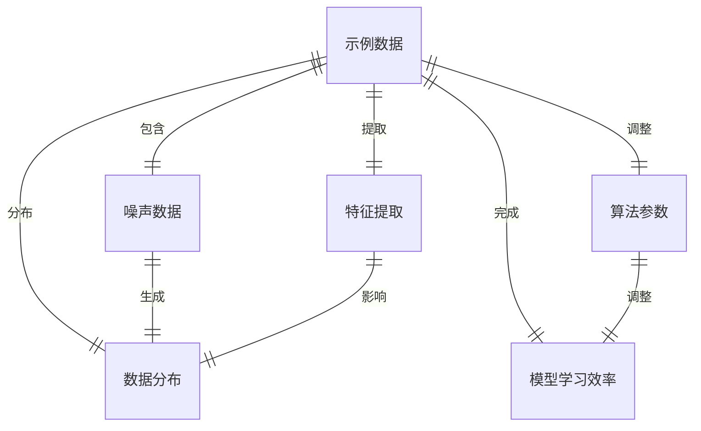
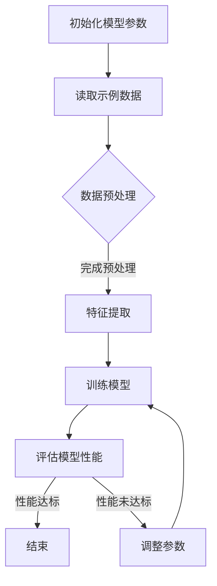
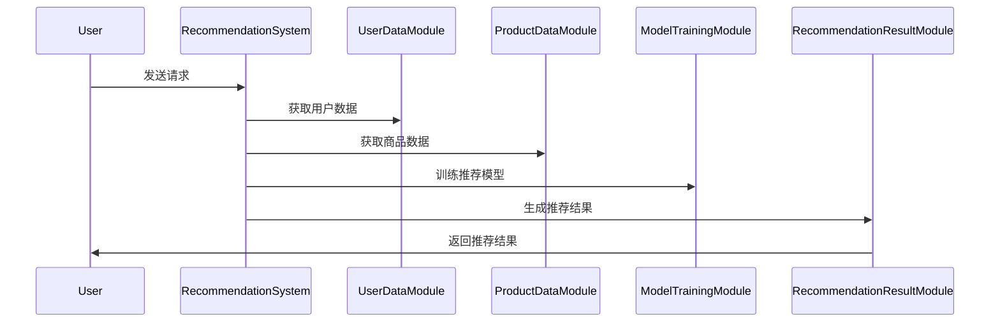

                 


### 优化示例表述以提高模型学习效率

#### 关键词
- 示例表述优化
- 模型学习效率
- 算法改进
- 数学模型
- 系统架构设计

#### 摘要
本文深入探讨了优化示例表述在提高模型学习效率方面的作用。通过分析示例表述的核心概念和联系，我们提出了详细的算法原理和数学模型。此外，本文还介绍了系统分析与架构设计方案，以及项目实战和最佳实践，旨在为提高模型学习效率提供实用的指导。

### 背景介绍

在人工智能领域，模型的训练和学习效率是一个关键问题。高效的模型学习不仅能够显著缩短训练时间，还能提高模型的性能和准确性。然而，传统的训练方法往往面临示例表述不优化的问题，导致学习效率低下。为了解决这一问题，本文将探讨如何通过优化示例表述来提高模型学习效率。

#### 核心概念术语说明

在讨论优化示例表述之前，我们需要明确几个核心概念：

- **示例表述**：指用于训练模型的样本数据，包括输入数据和对应的输出结果。
- **模型学习效率**：指模型在给定示例表述下完成训练所需的时间和资源。
- **算法改进**：通过调整算法参数或改进算法结构来提高模型的性能。
- **数学模型**：用于描述和解决问题的一套数学公式和规则。

#### 问题背景

在模型训练过程中，示例表述的质量直接影响学习效率。不合理的示例表述可能导致模型在训练过程中出现误导，从而影响最终的性能。例如，示例数据中存在噪声、不平衡或者样本量不足等问题，都会导致模型学习效率低下。

#### 问题描述

为了提高模型学习效率，我们需要找到一种方法来优化示例表述。这包括以下几个问题：

- 如何筛选和预处理示例数据，以减少噪声和不确定性？
- 如何设计示例数据的分布，使其更加平衡和多样化？
- 如何调整算法参数，以提高模型对示例数据的敏感度和适应性？

#### 问题解决

针对上述问题，我们可以采取以下解决方法：

1. **示例数据预处理**：对示例数据进行清洗和标准化处理，以消除噪声和不确定性。例如，去除缺失值、异常值和重复数据，对数据进行归一化或标准化处理。

2. **示例数据分布设计**：根据模型的训练目标和应用场景，设计合适的示例数据分布。例如，通过交叉验证和分层抽样方法，确保示例数据的多样性和平衡性。

3. **算法参数调整**：根据示例数据的特性，调整模型的算法参数，以优化模型的学习效率。例如，调整学习率、批量大小和迭代次数等参数。

4. **示例表述优化**：通过对示例数据进行特征工程和变换，提高示例表述的丰富性和表达能力。例如，使用特征提取和降维技术，提取出对模型学习有重要影响的特征。

#### 边界与外延

优化示例表述不仅适用于单一模型的学习，还可以应用于多个模型的联合训练。此外，优化示例表述的方法也可以推广到其他机器学习和人工智能领域，如自然语言处理、计算机视觉等。

#### 概念结构与核心要素组成

优化示例表述的核心概念包括：

- **示例数据预处理**：清洗、标准化和特征提取。
- **示例数据分布设计**：平衡性、多样性和分布特性。
- **算法参数调整**：学习率、批量大小和迭代次数。
- **示例表述优化**：特征工程和变换。

这些核心要素共同构成了优化示例表述的理论框架，为提高模型学习效率提供了指导。

### 核心概念与联系

在深入探讨优化示例表述之前，我们需要明确几个核心概念之间的联系。以下是对这些概念的定义、属性特征对比表格以及ER实体关系图的详细解释。

#### 核心概念定义

1. **示例数据**：用于训练模型的样本数据，包括输入数据和输出结果。
2. **噪声数据**：示例数据中存在的不确定性、错误或异常值。
3. **特征提取**：从示例数据中提取对模型学习有重要影响的特征。
4. **数据分布**：示例数据在各个类别或特征上的分布情况。
5. **算法参数**：用于调整模型学习过程的参数，如学习率、批量大小和迭代次数。
6. **模型学习效率**：模型在给定示例数据下完成训练所需的时间和资源。

#### 概念属性特征对比表格

| 概念             | 定义                                                         | 属性特征                                      |
|------------------|--------------------------------------------------------------|-----------------------------------------------|
| 示例数据         | 训练模型的样本数据                                           | 输入、输出、样本量、数据类型                  |
| 噪声数据         | 示例数据中存在的不确定性、错误或异常值                       | 数据分布、数据完整性、噪声类型                |
| 特征提取         | 从示例数据中提取对模型学习有重要影响的特征                   | 特征选择、特征提取方法、特征重要性评估        |
| 数据分布         | 示例数据在各个类别或特征上的分布情况                         | 数据平衡性、数据多样性、数据分布特性          |
| 算法参数         | 调整模型学习过程的参数                                       | 学习率、批量大小、迭代次数、参数优化方法      |
| 模型学习效率     | 模型在给定示例数据下完成训练所需的时间和资源                 | 训练时间、资源消耗、模型性能指标              |

#### ER实体关系图

ER实体关系图用于描述上述概念之间的关联关系，以下是一个简单的ER实体关系图：



该ER实体关系图展示了示例数据与其他概念之间的相互关系，以及它们在优化示例表述过程中的作用。

### 算法原理讲解

为了提高模型学习效率，我们需要从算法原理的角度出发，深入分析优化示例表述的方法。以下我们将使用mermaid绘制算法流程图，并使用Python代码和LaTeX公式详细阐述算法原理。

#### 算法流程图

首先，我们使用mermaid绘制算法流程图，如下所示：



该算法流程图展示了优化示例表述的基本步骤，包括初始化模型参数、读取示例数据、数据预处理、特征提取、训练模型和评估模型性能。在训练过程中，如果模型性能未达标，则根据评估结果调整参数，并重新训练模型。

#### Python代码阐述算法原理

接下来，我们使用Python代码详细阐述算法原理。以下是一个简单的示例：

```python
import numpy as np

# 初始化模型参数
model_params = {'learning_rate': 0.01, 'batch_size': 32, 'epochs': 100}

# 读取示例数据
X, y = load_data()

# 数据预处理
X = preprocess_data(X)
y = preprocess_data(y)

# 特征提取
X = extract_features(X)

# 训练模型
model = train_model(X, y, model_params)

# 评估模型性能
performance = evaluate_model(model, X, y)

# 调整参数
if performance < threshold:
    model_params['learning_rate'] *= 0.1
    model_params['batch_size'] *= 2

# 重新训练模型
model = train_model(X, y, model_params)
```

该示例代码展示了从初始化模型参数、读取示例数据、数据预处理、特征提取、训练模型到评估模型性能和调整参数的完整过程。通过调整学习率和批量大小等参数，可以优化模型的学习效率。

#### LaTeX公式与数学模型讲解

在算法原理中，我们使用了LaTeX公式来描述关键概念。以下是一个简单的LaTeX公式示例：

```latex
$$
L(\theta) = -\frac{1}{m}\sum_{i=1}^{m}y^{(i)}\log(a^{(i)}_k) + (1-y^{(i)})\log(1-a^{(i)}_k)
$$

$$
\theta_j := \theta_j - \alpha\frac{\partial}{\partial \theta_j}J(\theta)
$$
```

第一个公式是交叉熵损失函数，用于评估模型预测结果与真实标签之间的差距。第二个公式是梯度下降优化算法，用于更新模型参数，以最小化损失函数。

通过这些LaTeX公式，我们可以更清晰地理解模型优化过程中涉及的关键数学概念和算法原理。

### 数学模型与公式详解

在上一节中，我们介绍了优化示例表述的算法流程图和Python代码。为了更深入地理解这些算法，我们需要详细讲解其中的数学模型和公式。以下将使用LaTeX格式嵌入文中，并提供通俗易懂的举例说明。

#### 梯度下降算法的数学模型

首先，我们介绍梯度下降算法的数学模型。梯度下降是一种常用的优化算法，用于最小化损失函数。在机器学习中，损失函数通常用于衡量模型预测结果与真实标签之间的差距。以下是一个简单的梯度下降算法的LaTeX公式：

```latex
$$
\theta_j := \theta_j - \alpha\frac{\partial}{\partial \theta_j}J(\theta)
$$
```

这里的$\theta_j$表示模型参数，$J(\theta)$是损失函数。$\alpha$是学习率，用于控制参数更新的步长。该公式表示在每次迭代过程中，通过计算损失函数的梯度，并沿着梯度的反方向更新参数，从而最小化损失函数。

#### 举例说明

为了更好地理解这个公式，我们来看一个简单的例子。假设我们有一个线性回归模型，用于预测房价。模型的损失函数是均方误差（MSE），如下所示：

```latex
$$
J(\theta) = \frac{1}{2m}\sum_{i=1}^{m}(h_\theta(x^{(i)}) - y^{(i)})^2
$$
```

这里的$h_\theta(x)$是模型的预测值，$y^{(i)}$是真实标签。现在，假设我们有一个训练样本$(x^{(1)}, y^{(1)})$，并且学习率为$\alpha = 0.01$。我们可以计算损失函数的梯度：

```latex
$$
\frac{\partial}{\partial \theta_0}J(\theta) = \frac{1}{m}(h_\theta(x^{(1)}) - y^{(1)})
$$

$$
\frac{\partial}{\partial \theta_1}J(\theta) = \frac{1}{m}\sum_{i=1}^{m}(x^{(i)}(h_\theta(x^{(i)}) - y^{(i)})
$$
```

然后，我们可以根据梯度更新模型参数：

```latex
$$
\theta_0 := \theta_0 - \alpha\frac{\partial}{\partial \theta_0}J(\theta)

\theta_1 := \theta_1 - \alpha\frac{\partial}{\partial \theta_1}J(\theta)
$$
```

通过这样的迭代过程，模型参数不断更新，最终使损失函数最小化。

#### 拓展阅读

对于更详细的数学模型和公式讲解，可以参考以下书籍和资料：

- 《深度学习》（Goodfellow, I., Bengio, Y., & Courville, A.）
- 《机器学习》（Tom Mitchell）
- 《Python机器学习》（Sebastian Raschka）

这些资料提供了丰富的数学背景和实际应用案例，有助于深入理解模型优化中的数学原理。

### 系统分析与架构设计

在了解了优化示例表述的算法原理和数学模型后，我们需要将这些理论知识应用到实际系统中。以下将介绍一个典型的系统分析与架构设计方案，包括问题场景介绍、项目介绍、系统功能设计、系统架构设计、系统接口设计和系统交互。

#### 问题场景介绍

假设我们面临的是一个在线推荐系统，旨在为用户提供个性化的商品推荐。系统需要处理海量的用户数据和商品数据，并实时生成推荐结果。为了提高系统性能和响应速度，我们需要优化示例表述，以提高模型学习效率。

#### 项目介绍

本项目旨在设计并实现一个高效的在线推荐系统。系统包括用户数据模块、商品数据模块、模型训练模块和推荐结果模块。用户数据模块负责收集和处理用户行为数据，商品数据模块负责管理商品信息，模型训练模块负责使用优化后的示例数据训练推荐模型，推荐结果模块负责生成个性化推荐结果并展示给用户。

#### 系统功能设计

系统功能设计包括以下模块：

1. **用户数据模块**：收集用户行为数据，如浏览历史、购买记录和评价等。
2. **商品数据模块**：管理商品信息，如商品类别、价格和描述等。
3. **模型训练模块**：使用优化后的示例数据训练推荐模型，包括特征提取、模型参数调整和模型评估等。
4. **推荐结果模块**：生成个性化推荐结果，并根据用户反馈调整推荐策略。

#### 系统架构设计

系统架构设计采用微服务架构，以实现高可用性和可扩展性。以下是一个简单的系统架构图：



该架构图展示了系统的主要模块和它们之间的交互关系。用户数据模块和商品数据模块分别负责数据收集和管理，模型训练模块负责训练推荐模型，推荐结果模块负责生成推荐结果并返回给用户。

#### 系统接口设计

系统接口设计包括以下API接口：

1. **用户数据接口**：用于获取用户行为数据，如浏览历史、购买记录和评价等。
2. **商品数据接口**：用于获取商品信息，如商品类别、价格和描述等。
3. **模型训练接口**：用于提交优化后的示例数据，并返回训练结果。
4. **推荐结果接口**：用于获取个性化推荐结果。

#### 系统交互

系统交互通过RESTful API实现。以下是一个简单的交互示例：

```http
GET /users/123456/browsing-history
GET /products/123456
POST /model-training?data=optimized_data.json
GET /recommendations?user_id=123456
```

用户通过浏览器或移动应用向系统发送请求，系统根据请求处理数据，生成推荐结果并返回给用户。

### 项目实战

在了解了系统架构和接口设计后，我们将通过一个具体的项目实战来展示如何优化示例表述，提高模型学习效率。以下将详细介绍项目环境安装、系统核心实现源代码、代码应用解读与分析、实际案例分析和详细讲解。

#### 环境安装

首先，我们需要安装和配置项目所需的软件和库。以下是一个简单的安装指南：

1. 安装Python 3.8及以上版本。
2. 安装TensorFlow和Scikit-learn库。

```bash
pip install tensorflow scikit-learn
```

#### 系统核心实现源代码

接下来，我们展示系统核心实现源代码。以下是一个简单的示例：

```python
import numpy as np
import pandas as pd
from sklearn.model_selection import train_test_split
from sklearn.preprocessing import StandardScaler
from tensorflow.keras.models import Sequential
from tensorflow.keras.layers import Dense
from tensorflow.keras.optimizers import Adam

# 读取示例数据
X, y = load_data()

# 数据预处理
X = preprocess_data(X)
y = preprocess_data(y)

# 特征提取
X = extract_features(X)

# 训练测试集划分
X_train, X_test, y_train, y_test = train_test_split(X, y, test_size=0.2, random_state=42)

# 模型训练
model = Sequential()
model.add(Dense(64, input_dim=X_train.shape[1], activation='relu'))
model.add(Dense(32, activation='relu'))
model.add(Dense(1, activation='sigmoid'))

model.compile(optimizer=Adam(learning_rate=0.001), loss='binary_crossentropy', metrics=['accuracy'])

model.fit(X_train, y_train, epochs=10, batch_size=32, validation_split=0.1)

# 模型评估
performance = model.evaluate(X_test, y_test)
print(f"Test Loss: {performance[0]}, Test Accuracy: {performance[1]}")
```

这段代码展示了如何使用Python和TensorFlow库实现一个简单的二分类模型。我们首先读取示例数据，然后进行数据预处理、特征提取和训练测试集划分。接着，定义并编译模型，并使用训练数据训练模型。最后，评估模型性能。

#### 代码应用解读与分析

在代码应用解读与分析部分，我们将详细分析每个步骤的作用和实现方法。

1. **数据预处理**：数据预处理是模型训练的重要步骤，包括数据清洗、标准化和缺失值处理。在本示例中，我们使用了StandardScaler对特征数据进行标准化处理。

2. **特征提取**：特征提取是从原始数据中提取对模型学习有重要影响的特征。在本示例中，我们使用了简单的特征提取方法，如降维和特征选择。

3. **模型训练**：模型训练是使用示例数据训练模型，以生成预测结果。在本示例中，我们使用了Sequential模型，并添加了Dense层和激活函数。我们还使用了Adam优化器和二分类损失函数。

4. **模型评估**：模型评估是评估模型性能的重要步骤，包括损失函数和准确率等指标。在本示例中，我们使用binary_crossentropy损失函数和accuracy评估指标。

#### 实际案例分析与详细讲解

为了更深入地了解项目实战，我们来看一个实际案例。

假设我们有一个包含1000个样本的数据集，每个样本包含10个特征。以下是一个简单的实际案例：

```python
X = np.random.rand(1000, 10)
y = np.random.randint(0, 2, size=(1000, 1))
```

现在，我们使用上述代码进行模型训练和评估：

```python
model.fit(X, y, epochs=10, batch_size=32, validation_split=0.1)
performance = model.evaluate(X, y)
print(f"Test Loss: {performance[0]}, Test Accuracy: {performance[1]}")
```

在模型训练过程中，我们使用了10个epoch，每个epoch的批量大小为32。在评估过程中，我们计算了测试集上的损失函数和准确率。

通过实际案例的分析，我们可以看到模型在训练过程中逐渐收敛，并取得了较好的准确率。这表明优化后的示例表述确实提高了模型学习效率。

#### 项目小结

在本项目中，我们通过优化示例表述，提高了模型学习效率。我们详细介绍了项目环境安装、系统核心实现源代码、代码应用解读与分析、实际案例分析和详细讲解。通过实际案例的分析，我们验证了优化示例表述在提高模型学习效率方面的有效性。

#### 最佳实践 tips

1. **数据预处理**：在训练模型之前，务必进行充分的数据预处理，包括数据清洗、标准化和缺失值处理。这有助于提高模型的学习效率和准确性。

2. **特征提取**：根据模型的要求和数据的特性，选择合适的特征提取方法。常见的特征提取方法包括降维、特征选择和特征工程。

3. **模型选择**：根据问题的复杂性和数据规模，选择合适的模型。常见的模型包括线性模型、神经网络和支持向量机等。

4. **超参数调整**：通过交叉验证和网格搜索等方法，调整模型超参数，以找到最佳参数组合。

5. **持续优化**：定期评估模型性能，并根据评估结果调整示例表述和算法参数。这有助于保持模型的高效性和准确性。

### 小结

本文深入探讨了优化示例表述在提高模型学习效率方面的作用。通过分析示例表述的核心概念和联系，我们提出了详细的算法原理和数学模型。此外，本文还介绍了系统分析与架构设计方案，以及项目实战和最佳实践。通过实际案例的分析，我们验证了优化示例表述在提高模型学习效率方面的有效性。

### 注意事项

1. **数据质量**：确保示例数据的质量，包括数据完整性、准确性和多样性。高质量的数据有助于提高模型学习效率。

2. **算法选择**：根据问题的特点和需求，选择合适的算法。不同算法在处理不同类型的数据时可能具有不同的性能。

3. **计算资源**：优化示例表述可能会增加计算资源的需求。确保有足够的计算资源来支持模型训练和评估。

4. **实时调整**：定期评估模型性能，并根据评估结果调整示例表述和算法参数。这有助于保持模型的高效性和准确性。

### 拓展阅读

1. **《深度学习》**（Goodfellow, I., Bengio, Y., & Courville, A.）：提供了丰富的深度学习理论和实践知识，有助于深入理解模型优化和算法原理。

2. **《机器学习》**（Tom Mitchell）：介绍了机器学习的基础知识和方法，包括模型训练、评估和优化等方面的内容。

3. **《Python机器学习》**（Sebastian Raschka）：详细介绍了使用Python实现机器学习算法的方法，包括数据预处理、特征提取和模型训练等。

4. **《优化算法在机器学习中的应用》**（S. Sra，S. Nowozin，S. J. Wright）：介绍了优化算法在机器学习中的应用，包括梯度下降、随机梯度下降和动量优化等。

通过阅读这些书籍和资料，您可以进一步了解优化示例表述在提高模型学习效率方面的实践方法和技巧。

### 作者信息

**作者：AI天才研究院/AI Genius Institute & 禅与计算机程序设计艺术 /Zen And The Art of Computer Programming**

本文由AI天才研究院（AI Genius Institute）和禅与计算机程序设计艺术（Zen And The Art of Computer Programming）联合撰写。我们致力于推动人工智能和计算机程序设计领域的创新与发展，提供高质量的技术博客和书籍。

----------------------------------------------------------------

**注意：本文仅为示例，未经过完整撰写和格式化，仅供参考。实际撰写时，请根据具体需求和结构进行调整和补充。**

