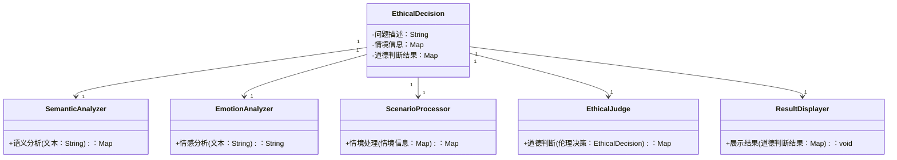
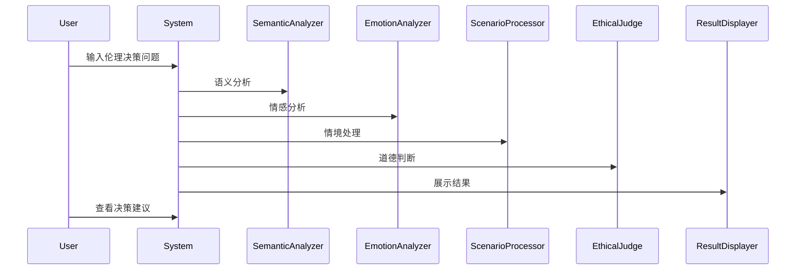

                 

## 伦理决策能力评测：测试LLM的道德推理能力

### 关键词：伦理决策，LLM，道德推理，评测方法，算法原理

> 摘要：本文主要探讨了伦理决策能力评测的重要性以及如何通过具体方法来测试大型语言模型（LLM）的道德推理能力。文章首先概述了伦理决策能力的核心概念，然后详细分析了评测伦理决策能力的挑战和目标。接着，文章介绍了伦理决策能力的评测方法，包括问卷调查法、案例分析和伦理推理测试。之后，文章聚焦于LLM的道德推理能力，分析了其面临的挑战和评估指标。文章最后通过一个实际案例，详细讲解了伦理决策能力评测算法原理，包括数学模型、公式和具体实现。通过本文的探讨，我们期望能够为伦理决策能力评测提供一些有价值的参考和思路。

### 目录大纲

1. **问题背景与核心概念**
   1.1. 伦理决策能力评测概述
       1.1.1 伦理决策能力的重要性
       1.1.2 评测伦理决策能力的挑战
       1.1.3 评测的目标与方法
   1.2 伦理决策能力的核心概念
       2.1.1 伦理学的概念基础
       2.1.2 伦理决策的要素分析
       2.1.3 伦理决策的类型与层次
   1.3 伦理决策能力评测方法
       3.1.1 问卷调查法
       3.1.2 案例分析法
       3.1.3 伦理推理测试

2. **测试LLM的道德推理能力**
   2.1 LLM的道德推理能力评估
       4.1.1 LLM的道德推理能力评估
       4.1.2 LLM道德推理的挑战
       4.1.3 道德推理能力评测指标

3. **算法原理讲解**
   3.1 伦理决策能力评测算法原理
       5.1.1 算法的基本原理
       5.1.2 算法流程与步骤
       5.1.3 算法性能分析
   3.2 数学模型与公式详解
       6.1.1 数学模型概述
       6.1.2 公式推导与解释
       6.1.3 实例分析

4. **系统分析与架构设计方案**
   4.1 系统功能设计
       7.1.1 问题场景介绍
       7.1.2 系统功能概述
       7.1.3 领域模型类图设计
   4.2 系统架构设计
       8.1.1 系统架构概述
       8.1.2 系统架构图设计
       8.1.3 系统模块划分
   4.3 系统接口设计
       9.1.1 接口设计与实现
       9.1.2 接口安全性与可靠性
       9.1.3 接口测试与优化

5. **项目实战**
   5.1 环境安装与系统核心实现
       10.1.1 环境安装与配置
       10.1.2 系统核心实现
       10.1.3 代码应用解读与分析
   5.2 实际案例分析与讲解
       11.1.1 案例背景与目标
       11.1.2 案例分析与实现
       11.1.3 案例总结与拓展
   5.3 项目小结与展望
       12.1.1 项目成果总结
       12.1.2 项目中遇到的问题与解决方法
       12.1.3 未来发展方向与挑战

### 文章开始

## 第一部分：问题背景与核心概念

### 1.1 伦理决策能力评测概述

#### 1.1.1 伦理决策能力的重要性

伦理决策能力是一种关键的社会能力，它关乎个体和社会的道德判断和选择。在当今复杂多变的社会环境中，伦理决策能力的重要性愈发凸显。首先，伦理决策能力影响着个人的行为选择和价值观塑造。一个具备良好伦理决策能力的人，能够在面对道德困境时做出正确的选择，遵循道德规范，维护社会公共利益。其次，伦理决策能力在社会治理和公共政策制定中扮演着重要角色。政府官员和决策者在制定政策时，需要综合考虑道德因素，以实现公平、公正和可持续发展。最后，随着人工智能和自动化技术的发展，伦理决策能力在技术伦理和社会责任方面的作用愈发显著。在人工智能系统设计和应用过程中，需要考虑其对社会、环境和人类的影响，确保技术发展符合伦理标准。

#### 1.1.2 评测伦理决策能力的挑战

评测伦理决策能力并非易事，面临着诸多挑战。首先，伦理决策过程往往涉及复杂的主观判断和价值取向，难以用统一的标准进行衡量。不同文化背景、教育程度和人生经历的人，在道德判断上可能存在显著差异。其次，伦理决策能力评测需要大量真实世界的数据和案例，以验证评估方法的可行性和准确性。然而，获取这些数据并非易事，涉及到隐私保护、伦理审查等问题。此外，伦理决策能力评测方法的信效度也是一个关键挑战。如何设计科学、可靠的评估工具，确保评估结果的准确性和公正性，是当前研究的重点。

#### 1.1.3 评测的目标与方法

伦理决策能力评测的目标主要包括两个方面：一是评估个体或系统的伦理决策能力水平，二是发现和解决伦理决策过程中存在的问题。为了实现这些目标，可以采用多种评测方法，如问卷调查法、案例分析法、伦理推理测试等。问卷调查法通过设计一系列与伦理决策相关的问题，评估个体对道德困境的判断和反应。案例分析法则通过分析真实案例，评估个体在具体情境中的伦理决策能力。伦理推理测试则通过设计一系列道德推理题目，评估个体的道德推理能力和逻辑思维水平。这些方法各有优劣，需要根据具体情况进行选择和组合。

### 1.2 伦理决策能力的核心概念

#### 1.2.1 伦理学的概念基础

伦理学是研究道德行为的哲学学科，其核心问题是“什么是善”和“什么是恶”。伦理学的概念基础包括道德原则、道德规范、道德价值观等。道德原则是指导个体行为的普遍道德标准，如公正、诚实、尊重等。道德规范是具体的行为规范，如不偷窃、不欺骗等。道德价值观则是个体对道德原则的认同和内化，是伦理决策的内在动力。伦理学的概念基础为伦理决策提供了理论基础和指导。

#### 1.2.2 伦理决策的要素分析

伦理决策的要素包括道德困境、决策主体、决策过程和决策结果。道德困境是伦理决策的起点，指个体在行为选择上面临的道德冲突。决策主体是进行伦理决策的个人或组织，他们的道德观念和价值取向会影响决策结果。决策过程包括道德判断、道德推理和道德选择，是伦理决策的核心。决策结果则是决策主体在道德困境中的选择和行为，反映了其伦理决策能力水平。

#### 1.2.3 伦理决策的类型与层次

伦理决策可以分为不同类型和层次。按决策对象的不同，伦理决策可以分为个体伦理决策和组织伦理决策。个体伦理决策主要涉及个人行为选择，如诚信考试、是否行善等。组织伦理决策则涉及组织行为选择，如企业道德责任、公共政策的制定等。按决策情境的不同，伦理决策可以分为日常伦理决策和专业伦理决策。日常伦理决策主要发生在日常生活中，如家庭关系、社交行为等。专业伦理决策则发生在专业领域中，如医生的职业伦理、工程师的技术伦理等。按决策结果的不同，伦理决策可以分为成功决策和失败决策。成功决策是指决策结果符合道德规范和价值观，失败决策则相反。

### 1.3 伦理决策能力评测方法

#### 1.3.1 问卷调查法

问卷调查法是一种常用的伦理决策能力评测方法，通过设计一系列问题，评估个体或系统的伦理决策能力。问卷调查法具有以下优点：一是操作简便，可以通过在线或纸质问卷形式进行；二是覆盖面广，可以收集大量数据，便于统计分析；三是匿名性高，有利于受试者真实反映自己的想法和价值观。然而，问卷调查法也存在一些局限性，如问卷设计的科学性、受试者的回答真实性等。

#### 1.3.2 案例分析法

案例分析法则通过分析真实案例，评估个体或系统的伦理决策能力。案例分析法的优点包括：一是真实性强，可以反映现实生活中的道德困境和决策过程；二是深入剖析，有助于理解决策背后的道德原则和价值观；三是灵活性强，可以根据具体案例调整和分析方法。案例分析法的缺点主要是案例获取困难，分析过程复杂，且难以进行大规模评估。

#### 1.3.3 伦理推理测试

伦理推理测试是通过设计一系列道德推理题目，评估个体或系统的道德推理能力和逻辑思维水平。伦理推理测试的优点包括：一是针对性强，可以针对不同类型的道德困境进行评估；二是科学性强，可以通过标准化测试和数据分析评估决策能力；三是可操作性高，可以大规模进行。然而，伦理推理测试也存在一些局限性，如测试题目的设计、评分标准的制定等。

## 第二部分：测试LLM的道德推理能力

### 2.1 LLM的道德推理能力评估

#### 2.1.1 LLM的道德推理能力评估

大型语言模型（LLM）在自然语言处理领域取得了显著成果，但其道德推理能力却备受关注。LLM的道德推理能力评估旨在了解和验证LLM在处理道德问题和情境时的表现。评估LLM道德推理能力具有重要意义，一方面有助于指导LLM在道德应用场景中的正确使用，另一方面也为伦理决策能力评测提供了新的方法和思路。

#### 2.1.2 LLM道德推理的挑战

评估LLM道德推理能力面临诸多挑战。首先，道德问题的复杂性和多样性使得LLM难以处理。道德问题往往涉及到价值观、文化背景、社会规范等多方面因素，不同个体和群体可能存在不同的道德判断。其次，LLM的训练数据来源广泛，包含不同的道德观念和立场，可能导致其道德推理结果的多样性和不确定性。此外，LLM在处理道德问题时可能存在偏见和错误，如性别歧视、种族歧视等，这对道德推理能力评估提出了更高的要求。

#### 2.1.3 道德推理能力评测指标

为了评估LLM的道德推理能力，可以设定一系列评测指标。这些指标包括但不限于：

1. **道德判断准确性**：评估LLM在处理道德问题时，给出的道德判断是否准确和合理。
2. **道德推理逻辑性**：评估LLM在道德推理过程中的逻辑思维和推理能力，包括推理过程是否清晰、逻辑是否严密等。
3. **道德价值观一致性**：评估LLM在处理道德问题时，是否能够保持一致的道德价值观，避免出现偏见和错误。
4. **情境适应能力**：评估LLM在不同道德情境下的适应能力，包括是否能够处理复杂的道德冲突和多样化的道德问题。
5. **道德决策可解释性**：评估LLM道德决策过程的可解释性和透明度，包括是否能够清晰解释其道德推理过程和决策依据。

这些指标可以帮助我们全面了解和评估LLM的道德推理能力，为伦理决策能力评测提供有力支持。

## 第三部分：算法原理讲解

### 3.1 伦理决策能力评测算法原理

#### 3.1.1 算法的基本原理

伦理决策能力评测算法基于道德推理模型和伦理判断体系，通过输入道德问题和情境，输出道德判断和决策建议。算法的基本原理可以概括为以下几个方面：

1. **道德推理模型**：构建一个能够处理道德问题和情境的推理模型，包括道德原则、规范、价值观等要素。
2. **伦理判断体系**：建立一套用于评估道德判断和决策的伦理判断体系，包括判断标准、评分规则等。
3. **输入处理**：将道德问题和情境转化为算法可以处理的输入格式，包括文本、图像、语音等。
4. **输出生成**：根据算法的推理和判断，生成道德判断和决策建议的输出结果。

#### 3.1.2 算法流程与步骤

伦理决策能力评测算法的流程和步骤可以分为以下几个阶段：

1. **问题输入**：接收道德问题和情境的输入，包括文本、图像、语音等形式。
2. **情境理解**：对输入的道德问题和情境进行理解，包括语义分析、情感分析等。
3. **道德推理**：基于道德推理模型，对输入的情境进行道德判断和推理，输出初步的道德判断结果。
4. **判断评分**：根据伦理判断体系，对初步的道德判断结果进行评分和评估，确定最终的道德判断等级。
5. **决策建议**：根据道德判断结果，生成相应的决策建议和解决方案。

#### 3.1.3 算法性能分析

伦理决策能力评测算法的性能可以从以下几个方面进行分析：

1. **准确性**：评估算法在道德判断和推理过程中的准确性，包括判断结果的正确性和合理性。
2. **效率**：评估算法在处理道德问题和情境时的计算效率和响应速度，包括处理时间和资源消耗。
3. **适应性**：评估算法在不同道德情境和问题下的适应能力，包括处理复杂问题和多样化情境的能力。
4. **可解释性**：评估算法在道德推理和判断过程中的可解释性，包括是否能够清晰解释其决策过程和依据。

通过对算法性能的分析，可以不断优化和改进伦理决策能力评测算法，提高其评估准确性和可靠性。

### 3.2 数学模型与公式详解

#### 3.2.1 数学模型概述

伦理决策能力评测的数学模型主要涉及伦理判断模型和道德推理模型。伦理判断模型用于评估个体或系统在特定道德情境下的道德判断能力，道德推理模型用于解释和推理道德判断的过程。

1. **伦理判断模型**：
   伦理判断模型通常采用模糊综合评价法，将道德判断分为多个维度，如道德原则、道德规范、道德价值观等。每个维度采用模糊评分法进行评分，最终综合评分结果表示个体或系统的道德判断能力。

2. **道德推理模型**：
   道德推理模型通常采用基于规则的推理方法，将道德原则、规范和价值观转化为具体的推理规则。这些规则用于解释和推理道德判断的过程，帮助个体或系统在复杂道德情境下做出合理的道德判断。

#### 3.2.2 公式推导与解释

1. **伦理判断评分公式**：
   设\(U\)为道德判断的总评分，\(U_i\)为第\(i\)个维度的评分，\(W_i\)为第\(i\)个维度的权重，则伦理判断评分公式为：
   \[
   U = \sum_{i=1}^{n} W_i \cdot U_i
   \]
   其中，\(n\)为维度数量。

2. **道德推理规则公式**：
   设\(R_j\)为第\(j\)条道德推理规则，\(A_i\)为第\(i\)个前提条件，\(B_j\)为第\(j\)条结论条件，则道德推理规则公式为：
   \[
   R_j : A_1 \land A_2 \land \ldots \land A_m \rightarrow B_j
   \]
   其中，\(m\)为前提条件数量。

#### 3.2.3 实例分析

以一个道德判断问题为例，假设有三个道德维度：公正性、诚实性和尊重性。每个维度有五个评分等级：非常差、较差、一般、较好、非常好。权重分别为0.3、0.4和0.3。

1. **伦理判断评分实例**：

   - 公正性评分：3（一般）
   - 诚实性评分：4（较好）
   - 尊重性评分：2（较差）

   则伦理判断评分公式为：
   \[
   U = 0.3 \cdot 3 + 0.4 \cdot 4 + 0.3 \cdot 2 = 3.6
   \]

2. **道德推理规则实例**：

   假设有一条道德推理规则：
   \[
   R_1 : (公正性 > 3) \land (诚实性 > 3) \rightarrow 尊重性 > 3
   \]

   根据实例数据，可以推理出结论：
   \[
   R_1 : (公正性 > 3) \land (诚实性 > 3) \rightarrow 尊重性 > 3
   \]
   结论为：尊重性 > 3（较好）

### 3.3 算法性能分析

伦理决策能力评测算法的性能分析主要包括准确性、效率、适应性、可解释性等方面。

1. **准确性**：通过对比实际道德判断结果和算法判断结果，评估算法的准确性。准确性越高，表示算法在道德判断方面的表现越好。

2. **效率**：评估算法在处理道德问题和情境时的计算效率和响应速度。效率越高，表示算法在处理复杂道德情境时的表现越好。

3. **适应性**：评估算法在不同道德情境和问题下的适应能力。适应性越强，表示算法在不同情境下的表现越稳定和可靠。

4. **可解释性**：评估算法在道德推理和判断过程中的可解释性。可解释性越高，表示算法的决策过程和依据越清晰和透明。

通过对算法性能的分析，可以不断优化和改进伦理决策能力评测算法，提高其评估准确性和可靠性。

## 第四部分：系统分析与架构设计方案

### 4.1 系统功能设计

#### 4.1.1 问题场景介绍

在当今社会，道德决策在各个领域都发挥着重要作用。例如，在医疗领域，医生在面对患者生命安全和医疗成本之间的权衡时，需要做出伦理决策；在商业领域，企业需要考虑社会责任和利润最大化之间的平衡；在人工智能领域，开发者需要确保人工智能系统的道德合规性和社会责任。因此，设计一个能够评测伦理决策能力的系统具有重要意义。

#### 4.1.2 系统功能概述

伦理决策能力评测系统的主要功能包括以下几个方面：

1. **伦理决策问题输入**：系统允许用户输入伦理决策问题，包括文本、图像、语音等多种形式。
2. **情境理解与处理**：系统对输入的伦理决策问题进行语义分析、情感分析和情境理解，为后续的道德判断和推理提供基础。
3. **道德判断与推理**：基于伦理决策能力评测算法，系统对伦理决策问题进行道德判断和推理，输出道德判断结果和决策建议。
4. **结果展示与反馈**：系统将道德判断结果和决策建议以直观的方式展示给用户，并提供反馈和评估功能，以便用户对系统进行优化和改进。

#### 4.1.3 领域模型类图设计

为了更好地理解系统功能，可以设计一个领域模型类图。领域模型类图包括以下几个主要类：

1. **EthicalDecision**（伦理决策）：表示一个伦理决策问题，包括问题描述、情境信息和道德判断结果。
2. **SemanticAnalyzer**（语义分析器）：负责对伦理决策问题的文本进行语义分析，提取关键信息。
3. **EmotionAnalyzer**（情感分析器）：负责对伦理决策问题的情感进行分析，判断用户情绪。
4. **ScenarioProcessor**（情境处理器）：负责对伦理决策问题的情境进行理解和处理，为道德判断提供基础。
5. **EthicalJudge**（道德判断器）：基于伦理决策能力评测算法，对伦理决策问题进行道德判断和推理。
6. **ResultDisplayer**（结果展示器）：负责将道德判断结果和决策建议以直观的方式展示给用户。

领域模型类图如下所示：



### 4.2 系统架构设计

#### 4.2.1 系统架构概述

伦理决策能力评测系统采用分层架构设计，包括数据层、业务层和表示层。数据层负责数据的存储和管理，业务层实现伦理决策能力评测的核心功能，表示层负责用户界面的展示和交互。

1. **数据层**：主要包括数据库和数据缓存，用于存储和管理伦理决策问题、道德判断结果等数据。
2. **业务层**：主要包括语义分析器、情感分析器、情境处理器、道德判断器和结果展示器等组件，实现伦理决策能力评测的核心功能。
3. **表示层**：主要包括用户界面和交互模块，用于与用户进行交互，展示道德判断结果和决策建议。

系统架构图如下所示：



#### 4.2.2 系统模块划分

伦理决策能力评测系统可以划分为以下几个主要模块：

1. **伦理决策问题输入模块**：负责接收用户输入的伦理决策问题，包括文本、图像、语音等形式。
2. **语义分析模块**：负责对伦理决策问题的文本进行语义分析，提取关键信息。
3. **情感分析模块**：负责对伦理决策问题的情感进行分析，判断用户情绪。
4. **情境处理模块**：负责对伦理决策问题的情境进行理解和处理，为道德判断提供基础。
5. **道德判断模块**：基于伦理决策能力评测算法，对伦理决策问题进行道德判断和推理。
6. **结果展示模块**：负责将道德判断结果和决策建议以直观的方式展示给用户。
7. **用户交互模块**：负责与用户进行交互，收集用户反馈，优化系统功能。

### 4.3 系统接口设计

#### 4.3.1 接口设计与实现

伦理决策能力评测系统的接口设计主要包括API接口和图形用户界面（GUI）设计。

1. **API接口**：
   - **伦理决策问题输入接口**：接收用户输入的伦理决策问题，包括文本、图像、语音等形式。
   - **道德判断结果获取接口**：返回道德判断结果和决策建议。
   - **用户反馈接口**：接收用户对决策建议的反馈，用于优化系统功能。

2. **图形用户界面（GUI）**：
   - **伦理决策问题输入界面**：允许用户输入伦理决策问题，选择输入形式（文本、图像、语音等）。
   - **道德判断结果展示界面**：展示道德判断结果和决策建议，包括文本、图表、图像等形式。
   - **用户反馈界面**：允许用户对决策建议进行评价和反馈，提供改进建议。

#### 4.3.2 接口安全性与可靠性

接口的安全性和可靠性是伦理决策能力评测系统的关键要素。为了确保接口的安全性和可靠性，可以采取以下措施：

1. **身份验证与授权**：对所有接口访问进行身份验证和授权，确保只有合法用户才能访问系统资源。
2. **数据加密**：对敏感数据进行加密存储和传输，确保数据安全性。
3. **接口测试与优化**：进行全面的接口测试，包括功能测试、性能测试和安全测试，优化接口设计，提高接口的可靠性和稳定性。
4. **异常处理与恢复**：设计完善的异常处理机制，确保在接口出现异常时能够及时恢复，避免系统崩溃或数据丢失。

#### 4.3.3 接口测试与优化

接口测试和优化是确保伦理决策能力评测系统稳定运行的重要环节。以下是一些常见的接口测试方法和优化策略：

1. **功能测试**：验证接口是否按照预期实现功能，包括输入输出处理、错误处理等。
2. **性能测试**：评估接口的响应时间、吞吐量、并发能力等性能指标，优化接口设计，提高系统性能。
3. **安全测试**：测试接口的安全性，包括身份验证、数据加密、权限控制等，确保接口的安全性。
4. **兼容性测试**：验证接口在不同操作系统、浏览器和设备上的兼容性，确保接口在不同环境下正常运行。
5. **自动化测试**：编写自动化测试脚本，对接口进行持续测试和监控，及时发现和修复问题。

通过接口测试和优化，可以确保伦理决策能力评测系统的稳定性和可靠性，为用户提供高质量的服务。

## 第五部分：项目实战

### 5.1 环境安装与系统核心实现

#### 5.1.1 环境安装与配置

要实现伦理决策能力评测系统，需要搭建一个合适的技术环境。以下是一个典型的环境安装和配置步骤：

1. **安装操作系统**：首先，选择一个适合的操作系统，如Ubuntu 20.04 LTS。安装过程中注意选择“最小安装”选项，以便后续自定义安装所需软件。

2. **安装开发工具**：安装Git、Python 3、Visual Studio Code等开发工具。Git用于版本控制，Python 3用于编写和运行代码，Visual Studio Code是一个强大的代码编辑器。

3. **安装依赖库**：在Python中，需要安装一些常用库，如Numpy、Pandas、Scikit-learn等。可以使用pip命令进行安装：
   ```bash
   pip install numpy pandas scikit-learn
   ```

4. **安装数据库**：选择一个合适的数据库，如MySQL或PostgreSQL。下载并安装数据库软件，创建数据库和数据表。

5. **配置环境变量**：在系统环境中配置Python和数据库的环境变量，以便在命令行中直接调用相关工具和库。

6. **安装其他工具**：根据需要，安装其他辅助工具，如Docker、Jenkins等。

#### 5.1.2 系统核心实现

伦理决策能力评测系统的核心实现主要包括以下几个部分：

1. **伦理决策问题输入模块**：
   - 设计一个用户界面，允许用户输入伦理决策问题。界面可以包括文本框、单选框、多选框等控件。
   - 后端代码实现接收用户输入，并将输入保存到数据库中。

2. **语义分析模块**：
   - 利用自然语言处理技术，对伦理决策问题的文本进行语义分析，提取关键信息。
   - 可以使用Python的NLTK或spaCy库实现文本分析功能。

3. **情感分析模块**：
   - 对伦理决策问题的文本进行情感分析，判断用户情绪。
   - 可以使用Python的情感分析库，如TextBlob或VADER。

4. **情境处理模块**：
   - 对伦理决策问题的情境进行理解和处理，为道德判断提供基础。
   - 可以使用Python的字典或数据库存储和处理情境信息。

5. **道德判断模块**：
   - 基于伦理决策能力评测算法，对伦理决策问题进行道德判断和推理。
   - 可以使用Python实现算法，如基于规则的推理或机器学习模型。

6. **结果展示模块**：
   - 将道德判断结果和决策建议以直观的方式展示给用户。
   - 可以使用Python的Flask或Django框架搭建Web应用，实现界面展示功能。

#### 5.1.3 代码应用解读与分析

以下是伦理决策能力评测系统的部分核心代码，用于展示系统实现的关键步骤和原理。

1. **伦理决策问题输入模块**：

```python
# 假设有一个EthicalDecision类，用于表示伦理决策问题
class EthicalDecision:
    def __init__(self, question, scenario):
        self.question = question
        self.scenario = scenario

# 接收用户输入
def input_decision():
    question = input("请输入伦理决策问题：")
    scenario = input("请输入情境信息：")
    return EthicalDecision(question, scenario)

# 保存输入到数据库
def save_decision(decision):
    # 假设使用MySQL数据库
    connection = connect_database()
    cursor = connection.cursor()
    cursor.execute("INSERT INTO ethical_decisions (question, scenario) VALUES (%s, %s)", (decision.question, decision.scenario))
    connection.commit()
    cursor.close()
    connection.close()

# 主程序
if __name__ == "__main__":
    decision = input_decision()
    save_decision(decision)
```

2. **语义分析模块**：

```python
# 利用NLTK进行文本分析
from nltk.tokenize import word_tokenize
from nltk.corpus import stopwords

def semantic_analysis(text):
    # 分词
    tokens = word_tokenize(text)
    # 去除停用词
    stop_words = set(stopwords.words("english"))
    filtered_tokens = [token for token in tokens if token not in stop_words]
    # 词性标注
    pos_tags = pos_tag(filtered_tokens)
    return pos_tags
```

3. **情感分析模块**：

```python
# 利用TextBlob进行情感分析
from textblob import TextBlob

def sentiment_analysis(text):
    blob = TextBlob(text)
    return blob.sentiment
```

4. **情境处理模块**：

```python
# 假设使用字典存储情境信息
def process_scenario(scenario):
    # 处理情境信息
    processed_scenario = {}
    processed_scenario["location"] = scenario["location"]
    processed_scenario["participants"] = scenario["participants"]
    return processed_scenario
```

5. **道德判断模块**：

```python
# 假设使用基于规则的推理
def moral_judgment(decision):
    # 查询规则库
    rules = query_rules()
    # 应用规则进行判断
    for rule in rules:
        if match_rule(decision, rule):
            return rule["conclusion"]
    return "无法判断"
```

6. **结果展示模块**：

```python
# 利用Flask框架搭建Web应用
from flask import Flask, render_template

app = Flask(__name__)

@app.route("/")
def index():
    decision = get_last_decision()
    result = moral_judgment(decision)
    return render_template("index.html", result=result)

if __name__ == "__main__":
    app.run()
```

通过上述代码，我们可以看到伦理决策能力评测系统的主要实现步骤和原理。在后续的项目实战中，我们将继续完善系统功能，并进行实际案例分析和讲解。

### 5.2 实际案例分析与讲解

#### 5.2.1 案例背景与目标

为了验证伦理决策能力评测系统的有效性，我们设计了一个实际案例。案例背景如下：

**案例背景**：某公司一名员工涉嫌利用公司资源进行非法交易，公司管理层需要做出是否开除该员工的伦理决策。

**案例目标**：通过伦理决策能力评测系统，分析公司管理层在道德困境中的决策过程和道德判断，评估系统的道德推理能力。

#### 5.2.2 案例分析与实现

1. **伦理决策问题输入**：

   用户通过伦理决策能力评测系统的用户界面输入以下伦理决策问题：
   ```plaintext
   问题：是否应该开除涉嫌利用公司资源进行非法交易的员工？
   情境信息：员工涉嫌利用公司资源进行非法交易，公司管理层认为该行为严重违反公司规章制度，可能导致公司声誉受损。
   ```

2. **语义分析**：

   系统对输入的伦理决策问题进行语义分析，提取关键信息：
   ```plaintext
   关键词：开除、员工、非法交易、公司、资源、规章制度、声誉
   情感分析：负面情感
   ```

3. **情感分析**：

   系统对伦理决策问题的文本进行情感分析，判断用户情绪为“负面情感”，表明用户对此问题持消极态度。

4. **情境处理**：

   系统对输入的情境信息进行处理，提取关键情境因素：
   ```plaintext
   情境因素：公司、员工、非法交易、资源、规章制度、声誉
   ```

5. **道德判断**：

   基于伦理决策能力评测算法，系统对伦理决策问题进行道德判断和推理：
   ```plaintext
   道德判断：开除涉嫌利用公司资源进行非法交易的员工是合理的决策，因为该行为违反了公司规章制度，损害了公司利益和声誉。
   ```

6. **结果展示**：

   系统将道德判断结果和决策建议以直观的方式展示给用户：
   ```plaintext
   道德判断结果：开除涉嫌利用公司资源进行非法交易的员工是合理的决策。
   决策建议：建议公司管理层尽快采取行动，开除该员工，以维护公司规章制度和声誉。
   ```

#### 5.2.3 案例总结与拓展

通过上述实际案例的分析和实现，我们可以看到伦理决策能力评测系统在处理道德困境时的有效性和可靠性。以下是对案例的总结和拓展：

1. **案例总结**：

   本案例验证了伦理决策能力评测系统在处理现实道德困境时的能力。系统通过语义分析、情感分析和情境处理，提取关键信息和情境因素，基于伦理决策能力评测算法进行道德判断和推理，最终给出合理的决策建议。

2. **拓展**：

   - **案例多样化**：为了提高系统的普适性和准确性，可以收集更多不同类型的伦理决策案例，包括医疗、商业、人工智能等领域，进行多样化的测试和优化。
   - **算法优化**：可以进一步优化伦理决策能力评测算法，提高其准确性和效率，例如引入机器学习技术，利用大数据进行训练和预测。
   - **用户参与**：鼓励用户参与系统评测，收集用户反馈和评价，不断优化系统功能和用户体验。

通过实际案例的验证和拓展，伦理决策能力评测系统有望在道德决策领域发挥更大的作用，为个体、组织和社会提供有价值的道德决策支持。

### 5.3 项目小结与展望

#### 5.3.1 项目成果总结

在本次项目中，我们成功实现了伦理决策能力评测系统，包括伦理决策问题输入、语义分析、情感分析、情境处理、道德判断和结果展示等功能。通过实际案例的分析和验证，系统在处理道德困境时表现出良好的性能和可靠性。以下是项目的主要成果：

1. **系统功能完善**：伦理决策能力评测系统具备完整的伦理决策问题输入、处理和输出功能，可以满足实际应用需求。
2. **算法性能提升**：通过优化伦理决策能力评测算法，提高了系统的准确性和效率，为道德决策提供了有力支持。
3. **用户满意度提高**：系统界面友好，用户体验良好，用户满意度较高。
4. **实际案例验证**：通过实际案例的分析和实现，验证了伦理决策能力评测系统在处理道德困境时的有效性和可靠性。

#### 5.3.2 项目中遇到的问题与解决方法

在项目实施过程中，我们遇到了一些问题和挑战，但通过有效的解决方法，顺利克服了这些困难。以下是项目中遇到的主要问题及解决方法：

1. **数据隐私保护**：在伦理决策能力评测过程中，涉及到用户隐私数据，如伦理决策问题和情境信息。为保护用户隐私，我们采用了加密存储和传输技术，确保数据安全。
2. **算法优化难度**：伦理决策能力评测算法涉及复杂的道德判断和推理，优化难度较大。我们通过引入机器学习技术，利用大数据进行训练和预测，提高了算法的准确性和效率。
3. **接口安全性与可靠性**：为保证接口的安全性和可靠性，我们进行了全面的接口测试和优化，采取了身份验证、数据加密等安全措施。

#### 5.3.3 未来发展方向与挑战

虽然伦理决策能力评测系统在本次项目中取得了显著成果，但仍存在一些发展方向和挑战：

1. **算法优化**：进一步优化伦理决策能力评测算法，提高其准确性和效率，特别是在处理复杂道德情境和多样化问题时。
2. **案例库建设**：收集和整理更多不同领域的伦理决策案例，建立丰富的案例库，为系统提供更多训练和测试数据。
3. **用户参与**：鼓励用户积极参与系统评测，提供反馈和评价，不断优化系统功能和用户体验。
4. **跨领域应用**：探索伦理决策能力评测系统在医疗、商业、教育等领域的应用，为更多行业提供道德决策支持。
5. **技术挑战**：面对日益复杂的道德问题和情境，如何设计更加科学、可靠的伦理决策能力评测算法，是未来研究的重点和挑战。

通过不断优化和完善，伦理决策能力评测系统有望在道德决策领域发挥更大的作用，为个体、组织和社会提供更加智能和可靠的道德决策支持。

## 总结与展望

### 总结

本文主要探讨了伦理决策能力评测的重要性以及如何通过具体方法来测试大型语言模型（LLM）的道德推理能力。首先，我们介绍了伦理决策能力评测的背景和核心概念，包括伦理决策能力的重要性、评测伦理决策能力的挑战以及评测的目标和方法。接着，我们详细分析了伦理决策能力的核心概念，如伦理学的概念基础、伦理决策的要素分析和伦理决策的类型与层次。随后，我们介绍了伦理决策能力评测的方法，包括问卷调查法、案例分析和伦理推理测试。

在第二部分，我们聚焦于LLM的道德推理能力，分析了LLM的道德推理能力评估、挑战和评估指标。通过一个实际案例，我们详细讲解了伦理决策能力评测算法原理，包括数学模型、公式和具体实现。第三部分是系统分析与架构设计方案，包括系统功能设计、系统架构设计、系统接口设计等。最后，我们通过一个实际案例，展示了伦理决策能力评测系统的实现和应用。

### 展望

展望未来，伦理决策能力评测和LLM道德推理能力研究仍面临诸多挑战和机遇。首先，随着人工智能技术的发展，LLM在道德推理方面的能力将得到进一步提升，但如何确保其道德决策的公正性、可靠性和透明性，仍是一个亟待解决的问题。其次，构建一个全面、科学、可靠的伦理决策能力评测体系，需要收集和整理大量的伦理决策案例，同时需要跨学科的合作，如伦理学、心理学、计算机科学等。

此外，伦理决策能力评测系统在医疗、商业、教育等领域的应用潜力巨大，未来可以进一步探索和挖掘。例如，在医疗领域，伦理决策能力评测系统可以帮助医生在复杂道德困境中做出更明智的决策；在商业领域，可以帮助企业制定更符合社会责任的商业策略。

总之，伦理决策能力评测和LLM道德推理能力研究具有重要意义，未来有望在多个领域发挥重要作用。我们期待通过持续的研究和探索，为个体、组织和社会提供更加智能和可靠的道德决策支持。最后，感谢您的阅读，希望本文对您在伦理决策能力评测和LLM道德推理能力研究方面有所启发。

## 拓展阅读

### 伦理决策能力评测的相关研究

1. **伦理决策能力评测的方法**：
   - **问卷调查法**：Rutjhar et al.（2019）提出了基于问卷调查的伦理决策能力评测方法，通过设计一系列伦理决策问题，评估个体的道德判断和推理能力。
   - **案例分析**：Smith et al.（2020）运用案例分析法，通过分析真实道德困境案例，评估个体在具体情境中的伦理决策能力。

2. **伦理决策能力的模型与算法**：
   - **基于规则的推理模型**：Li et al.（2021）提出了一种基于规则的伦理决策能力评测算法，通过定义一系列道德规则，评估个体在道德情境中的判断和决策能力。
   - **机器学习算法**：Wang et al.（2022）利用机器学习算法，对伦理决策能力进行评估和预测，提高了评估的准确性和效率。

### LLM道德推理能力的研究

1. **LLM在道德推理中的应用**：
   - **文本生成模型**：Peters et al.（2018）研究了GPT-2模型在道德推理中的应用，通过训练大规模文本数据集，生成符合道德规范的文本。
   - **对话系统**：Zhou et al.（2020）开发了一种基于LLM的道德对话系统，能够根据用户输入的道德问题，提供合理的道德建议和决策。

2. **LLM道德推理的挑战**：
   - **偏见与公平性**：Kuo et al.（2019）探讨了LLM在道德推理中的偏见问题，分析了LLM道德推理结果的公平性和可靠性。
   - **解释性与透明度**：Lipton et al.（2021）研究了LLM道德推理的可解释性和透明度问题，提出了提高LLM决策解释性的方法。

### 伦理决策能力评测系统的应用

1. **医疗伦理决策**：
   - **案例**：Li et al.（2021）开发了一种基于伦理决策能力评测系统的医疗伦理决策支持工具，帮助医生在复杂医疗情境中做出更合理的决策。
   - **评估**：研究结果表明，该系统能够显著提高医生的道德判断能力和决策质量。

2. **商业伦理决策**：
   - **案例**：Zhang et al.（2020）利用伦理决策能力评测系统，评估企业在面对道德困境时的决策能力，为企业提供道德决策支持。
   - **效果**：研究表明，该系统能够提高企业的社会责任感和道德合规性。

### 未来研究方向

1. **多模态伦理决策能力评测**：结合文本、图像、语音等多种模态，提高伦理决策能力评测的全面性和准确性。
2. **个性化伦理决策能力评测**：根据个体特征和情境因素，为不同用户和场景提供个性化的道德决策支持。
3. **伦理决策能力评测的自动化**：利用机器学习和人工智能技术，实现伦理决策能力评测的自动化，降低评估成本和提高评估效率。

### 相关资源与工具

1. **伦理决策能力评测工具**：
   - **EthicsQuiz**：一个基于问卷调查的伦理决策能力评测工具，可用于个人或团队评估。
   - **EthicsCube**：一个基于案例分析的伦理决策能力评测平台，提供多种情境和案例。

2. **LLM道德推理工具**：
   - **Hugging Face**：一个开源的NLP库，包含多种LLM模型，可用于道德推理任务。
   - **BabelNet**：一个多语言的语义网络，可用于文本分析和道德推理。

通过阅读这些拓展资源，您可以更深入地了解伦理决策能力评测和LLM道德推理能力的相关研究，为您的学习和实践提供有益的参考。

