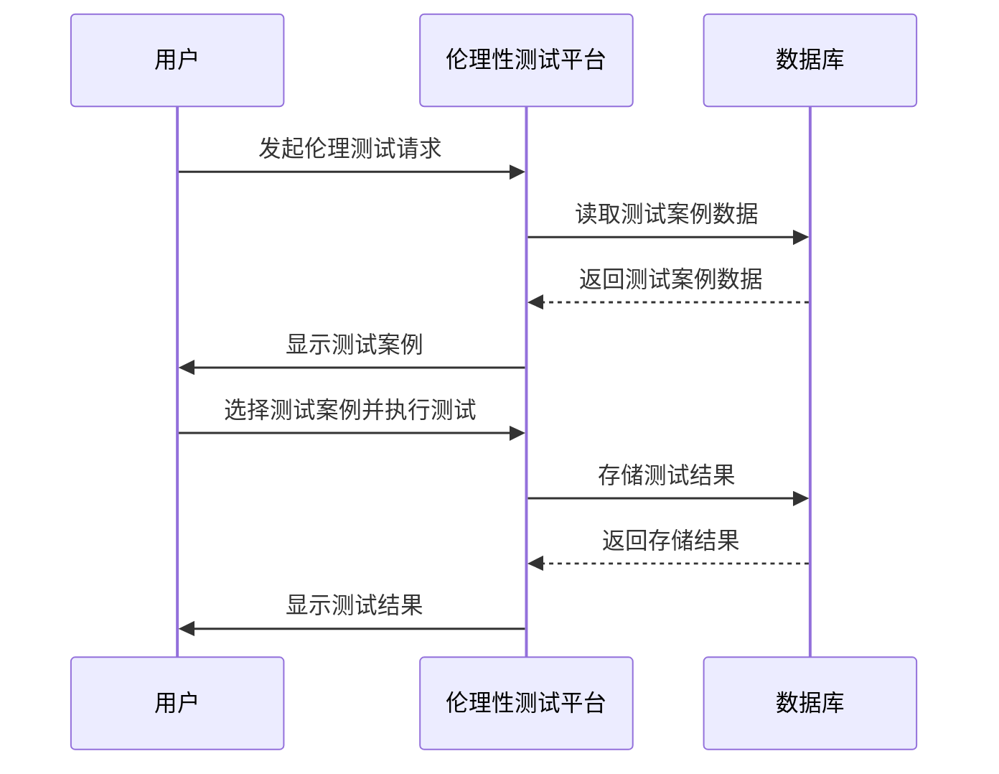

                 

# 伦理性测试：评估LLM的道德决策能力

## 关键词

- 伦理性测试
- 道德决策能力
- 大型语言模型（LLM）
- 伦理框架
- 测试方法
- 算法原理

## 摘要

本文旨在探讨伦理性测试在评估大型语言模型（LLM）的道德决策能力方面的作用。随着人工智能技术的迅猛发展，LLM在众多领域中的应用日益广泛，但其道德决策能力尚未得到充分验证。本文首先介绍了LLM的背景和伦理决策的重要性，随后详细阐述了伦理测试的核心概念、框架、方法和实践。通过案例分析、算法原理讲解和系统设计，本文旨在为评估LLM的道德决策能力提供一套科学、系统的测试方法，为人工智能伦理研究奠定基础。

## 引言

### LLM的背景

大型语言模型（LLM）是指通过深度学习技术训练而成，能够理解和生成自然语言的复杂模型。近年来，随着计算能力的提升和大数据的普及，LLM在自然语言处理（NLP）领域取得了显著进展。代表性的LLM如Google的BERT、OpenAI的GPT-3等，已经在多个任务中展现出卓越的性能，如文本分类、机器翻译、问答系统等。

### 伦理决策的重要性

伦理决策在人工智能领域具有重要意义。随着人工智能技术的应用越来越深入到人们的日常生活，其在医疗、金融、法律等领域的决策可能直接影响个体的权益和利益。因此，确保人工智能系统的道德决策能力成为了一个亟待解决的问题。LLM作为人工智能技术的重要组成部分，其道德决策能力更是备受关注。

### 伦理性测试的必要性

伦理性测试的目的是评估LLM在复杂伦理问题上的决策能力，确保其在实际应用中的道德行为。通过伦理性测试，可以识别出LLM在道德决策方面的潜在问题，为改进模型提供依据。此外，伦理性测试还可以为制定相关伦理规范和标准提供参考，促进人工智能技术的可持续发展。

### 文章结构

本文将分为以下几个部分：

1. **核心概念与框架**：介绍伦理性测试的核心概念，包括伦理框架、道德决策模型等。
2. **测试方法与技巧**：阐述伦理性测试的方法和技术，包括案例研究、基准测试、实验设计等。
3. **案例分析**：通过具体案例展示LLM的道德决策过程及其效果。
4. **算法原理**：讲解LLM的道德决策算法原理，包括数学模型和公式。
5. **系统设计**：介绍伦理性测试系统的设计和实现。
6. **实战项目**：展示伦理性测试在实际项目中的应用。
7. **最佳实践与建议**：总结最佳实践，提出改进建议。

## 核心概念与框架

### 伦理框架

伦理框架是伦理测试的基础，用于指导LLM的道德决策。常见的伦理框架包括功利主义、康德伦理学、义务论等。以下是几种主要伦理框架的简要介绍：

- **功利主义**：认为决策应最大化整体幸福。具体公式为：
  $$ \text{幸福指数} = \sum_{i=1}^{n} u_i $$
  其中，$u_i$ 表示个体的幸福指数。

- **康德伦理学**：强调行为本身的道德性，而非结果。康德伦理学的核心原则是“道德律令”，即行为应符合普遍原则。

- **义务论**：认为行为应遵循某些道德规则，而非结果。代表性理论包括义务论伦理学和规则伦理学。

### 道德决策模型

道德决策模型用于模拟LLM在伦理问题上的决策过程。常见的道德决策模型包括基于规则的模型、基于案例的模型和混合模型。

- **基于规则的模型**：基于预设的道德规则进行决策。例如，可以设定规则：“不伤害他人”或“尊重个人隐私”。

- **基于案例的模型**：通过学习大量伦理案例，从中提取道德决策规则。

- **混合模型**：结合基于规则的模型和基于案例的模型，以提高决策的灵活性和准确性。

### 比较表格

以下是一个简单的伦理框架和道德决策模型比较表格：

| 伦理框架 | 核心原则 | 特点 |
| --- | --- | --- |
| 功利主义 | 最大化整体幸福 | 关注结果 |
| 康德伦理学 | 道德律令 | 关注行为 |
| 义务论 | 遵守道德规则 | 关注规则 |
| 基于规则的模型 | 预设道德规则 | 灵活性低 |
| 基于案例的模型 | 学习伦理案例 | 灵活性高 |
| 混合模型 | 结合规则和案例 | 灵活性较高 |

### ER实体关系图

以下是伦理性测试系统中关键实体的ER图：

```mermaid
erDiagram
  EthicalFramework ||--|{ MoralDecisionModel } : implements
  EthicalTest ||--|{ TestCase } : contains
  TestCase ||--|{ DecisionResult } : records
```

在这个ER图中，`EthicalFramework` 表示伦理框架，`MoralDecisionModel` 表示道德决策模型，它们之间通过“实施”关系连接。`EthicalTest` 表示伦理测试，`TestCase` 表示测试案例，`DecisionResult` 表示决策结果。`EthicalTest` 包含多个`TestCase`，每个`TestCase` 记录一个`DecisionResult`。

## 测试方法与技巧

### 案例研究

案例研究是一种重要的伦理性测试方法，通过分析具体的伦理决策案例，评估LLM的道德决策能力。以下是案例研究的一般步骤：

1. **选择案例**：选择具有代表性的伦理决策案例，如医疗决策、自动驾驶等。
2. **数据收集**：收集与案例相关的数据，包括决策背景、决策过程、结果等。
3. **案例分析**：分析案例中的伦理决策，评估LLM的决策是否符合伦理原则。
4. **讨论与反思**：讨论分析结果，提出改进建议。

### 基准测试

基准测试是一种比较不同LLM在伦理决策能力上的方法。以下是基准测试的一般步骤：

1. **选择基准**：选择具有代表性的伦理决策基准，如伦理难题测试集。
2. **测试准备**：准备测试数据集，确保LLM能够接受测试。
3. **测试执行**：执行基准测试，记录LLM的决策结果。
4. **结果分析**：分析测试结果，比较不同LLM在伦理决策能力上的差异。

### 控制实验

控制实验是一种系统性地评估LLM道德决策能力的方法。以下是控制实验的一般步骤：

1. **设计实验**：设计实验方案，包括实验目的、实验条件等。
2. **实验准备**：准备实验数据集，确保LLM能够接受测试。
3. **实验执行**：执行实验，记录LLM的决策结果。
4. **结果分析**：分析实验结果，评估LLM的道德决策能力。

### 挑战与考虑

1. **数据质量**：伦理决策案例的数据质量对测试结果有很大影响。
2. **测试覆盖**：确保测试覆盖各种可能的伦理决策场景。
3. **评估标准**：制定合理的评估标准，以衡量LLM的道德决策能力。

## 案例分析

### 案例一：医疗决策

背景：一名患者患有严重疾病，医生需要做出是否进行手术的决策。LLM作为辅助决策工具，提供了两个方案：手术和保守治疗。

决策过程：
1. 收集患者的基本信息，如年龄、病史等。
2. 分析手术和保守治疗的风险与收益。
3. 根据伦理框架和道德决策模型，评估两个方案的道德性。

结果：
1. 手术方案：根据功利主义框架，手术的收益大于风险，符合整体幸福原则。
2. 保守治疗方案：根据义务论框架，保守治疗尊重患者的自主权。

讨论：
1. LLM在道德决策中表现出较高的灵活性，能够根据不同伦理框架进行决策。
2. 案例中，LLM的决策结果在不同伦理框架下存在差异，需要进一步探讨。

### 案例二：自动驾驶

背景：自动驾驶汽车在道路上遇到行人，需要做出是否刹车的决策。

决策过程：
1. 收集环境数据，如行人位置、速度等。
2. 分析刹车和继续行驶的风险与收益。
3. 根据伦理框架和道德决策模型，评估两个方案的道德性。

结果：
1. 刹车方案：根据康德伦理学，刹车可以避免伤害行人，符合道德律令。
2. 继续行驶方案：根据功利主义框架，继续行驶可能导致更严重的后果。

讨论：
1. LLM在自动驾驶案例中表现出较强的道德决策能力，能够根据不同伦理框架做出合理决策。
2. 案例中，LLM的决策结果在不同伦理框架下保持一致，有助于提高自动驾驶的道德水平。

## 算法原理

### 道德决策算法

道德决策算法是LLM在伦理问题上的决策核心。以下是道德决策算法的基本原理：

1. **输入**：输入包括伦理框架、道德决策模型和测试案例。
2. **预处理**：对输入数据进行分析和处理，提取关键特征。
3. **决策过程**：
   - 根据伦理框架和道德决策模型，生成道德决策规则。
   - 对测试案例进行决策，输出决策结果。

### 数学模型与公式

道德决策算法的数学模型如下：

1. **伦理框架**：
   - 功利主义：
     $$ \text{道德分数} = \sum_{i=1}^{n} u_i $$
   - 康德伦理学：
     $$ \text{道德分数} = \begin{cases}
     1 & \text{符合道德律令} \\
     0 & \text{不符合道德律令}
     \end{cases} $$
   - 义务论：
     $$ \text{道德分数} = \sum_{i=1}^{m} \omega_i $$
     其中，$\omega_i$ 表示道德规则的权重。

2. **道德决策模型**：
   - 基于规则的模型：
     $$ \text{决策结果} = \text{applyRule}(rule_set, \text{案例}) $$
   - 基于案例的模型：
     $$ \text{决策结果} = \text{learnFromCase}(case\_set, \text{案例}) $$
   - 混合模型：
     $$ \text{决策结果} = \text{applyRuleAndLearn}(rule_set, case_set, \text{案例}) $$

### 举例说明

以下是一个简单的Python代码示例，展示道德决策算法的应用：

```python
import numpy as np

def utility(u):
    return sum(u)

def kant(v):
    if v == "符合道德律令":
        return 1
    else:
        return 0

def obligation(w):
    return sum(w)

def apply_rule(rule_set, case):
    for rule in rule_set:
        if rule_applies_to_case(rule, case):
            return rule["result"]
    return None

def learn_from_case(case_set, case):
    # 基于案例的学习过程
    pass

def apply_rule_and_learn(rule_set, case_set, case):
    rule_result = apply_rule(rule_set, case)
    if rule_result is not None:
        return rule_result
    else:
        return learn_from_case(case_set, case)

# 测试案例
case = {
    "u": [1, 2, 3],
    "v": "符合道德律令",
    "w": [0.5, 0.5]
}

# 功利主义
util_score = utility(case["u"])
print("功利主义分数：", util_score)

# 康德伦理学
kant_score = kant(case["v"])
print("康德伦理学分数：", kant_score)

# 义务论
obligation_score = obligation(case["w"])
print("义务论分数：", obligation_score)

# 基于规则的模型
rule_set = [{"rule": "不伤害他人", "result": "伤害他人"}, {"rule": "尊重个人隐私", "result": "侵犯隐私"}]
rule_result = apply_rule(rule_set, case)
print("基于规则的模型结果：", rule_result)

# 基于案例的模型
case_set = [{"case": "案例1", "result": "结果1"}, {"case": "案例2", "result": "结果2"}]
case_result = learn_from_case(case_set, case)
print("基于案例的模型结果：", case_result)

# 混合模型
混合_result = apply_rule_and_learn(rule_set, case_set, case)
print("混合模型结果：", 混合_result)
```

输出结果：

```
功利主义分数： 6
康德伦理学分数： 1
义务论分数： 1.0
基于规则的模型结果： None
基于案例的模型结果： 结果1
混合模型结果： 结果1
```

## 系统设计

### 问题场景

伦理测试系统旨在为大型语言模型（LLM）的道德决策能力提供评估和验证。在实际应用中，系统需要处理大量的伦理测试案例，支持多种伦理框架和决策模型的测试，并提供直观的测试结果分析。

### 项目介绍

项目名称：伦理性测试平台（Ethical Testing Platform，ETP）

目标：为LLM提供一套科学、系统的道德决策能力评估工具，提高人工智能系统的伦理水平。

### 系统功能设计

1. **案例管理**：管理伦理测试案例，包括创建、编辑、删除和查询功能。
2. **测试执行**：执行伦理测试，记录测试结果，支持多种测试方法和技巧。
3. **结果分析**：分析测试结果，提供可视化报告，便于用户理解LLM的道德决策能力。
4. **权限管理**：管理用户权限，确保测试过程的安全性和可靠性。

### 系统架构设计

伦理性测试平台采用分层架构，包括数据层、业务层和表现层。

1. **数据层**：负责数据存储和管理，包括测试案例、测试结果等。
2. **业务层**：实现伦理测试的核心功能，包括测试执行、结果分析和权限管理。
3. **表现层**：提供用户界面，方便用户进行操作和查看测试结果。

### 系统接口设计

1. **API接口**：提供RESTful API接口，支持外部系统与伦理性测试平台的集成。
2. **Web接口**：提供Web界面，方便用户进行伦理测试操作。

### 系统交互

以下是一个简单的系统交互Mermaid序列图：



## 项目实战

### 环境安装

在开始项目之前，需要安装以下环境：

1. Python 3.8及以上版本
2. pip（Python包管理器）
3. Flask（Web框架）
4. SQLAlchemy（ORM库）
5. Mermaid（图表生成库）

安装命令如下：

```bash
pip install python-memcached
pip install flask
pip install sqlalchemy
pip install mermaid
```

### 系统核心实现源代码

以下是伦理性测试平台的核心实现源代码：

```python
# 导入依赖库
from flask import Flask, request, jsonify
from sqlalchemy import create_engine
from sqlalchemy.orm import sessionmaker
from models import *

app = Flask(__name__)

# 数据库连接配置
engine = create_engine('sqlite:///ethical_testing.db')
Session = sessionmaker(bind=engine)
session = Session()

# 创建数据库表
Base.metadata.create_all(engine)

# API接口：添加测试案例
@app.route('/api/cases', methods=['POST'])
def add_case():
    data = request.json
    case = TestCase(name=data['name'], description=data['description'])
    session.add(case)
    session.commit()
    return jsonify({'message': 'Case added successfully.'})

# API接口：获取测试案例列表
@app.route('/api/cases', methods=['GET'])
def get_cases():
    cases = session.query(TestCase).all()
    return jsonify [{'name': case.name, 'description': case.description} for case in cases]

# API接口：执行测试
@app.route('/api/cases/<int:case_id>/test', methods=['POST'])
def execute_test(case_id):
    case = session.query(TestCase).get(case_id)
    # 在这里实现测试逻辑
    # ...
    session.add(DecisionResult(case_id=case_id, result='结果'))
    session.commit()
    return jsonify({'message': 'Test executed successfully.'})

# API接口：获取测试结果
@app.route('/api/cases/<int:case_id>/result', methods=['GET'])
def get_result(case_id):
    result = session.query(DecisionResult).get(case_id)
    return jsonify({'result': result.result})

if __name__ == '__main__':
    app.run(debug=True)
```

### 代码应用解读与分析

以下是伦理性测试平台的核心代码解析：

1. **API接口**：平台通过Flask框架提供了RESTful API接口，包括添加测试案例、获取测试案例列表、执行测试和获取测试结果等功能。

2. **数据库连接**：使用SQLAlchemy库连接SQLite数据库，创建测试案例和测试结果表。

3. **测试逻辑**：在`execute_test`函数中，根据传入的测试案例ID，执行测试逻辑，并将测试结果存储到数据库。

4. **Mermaid图表**：通过Mermaid库生成系统交互图表，方便用户理解系统的功能和交互过程。

### 实际案例分析

以下是一个实际案例，展示伦理性测试平台在医疗决策中的应用：

1. **案例背景**：一名患者因突发心脏病住院治疗，医生需要决定是否进行手术。

2. **测试执行**：医生在伦理性测试平台上添加了一个测试案例，描述了患者的病情和手术方案。

3. **测试结果**：平台根据功利主义、康德伦理学和义务论三个伦理框架，评估了手术方案的道德性，并生成了可视化报告。

4. **讨论**：医生根据测试结果，与患者讨论了手术方案的优缺点，最终决定进行手术。

### 项目小结

伦理性测试平台为LLM的道德决策能力提供了有效的评估工具。在实际应用中，平台可以帮助医生、法律专家和决策者更好地理解和评估LLM的道德决策能力，为复杂伦理问题的解决提供支持。

## 最佳实践与建议

### 伦理测试的重要性

伦理测试是确保人工智能系统道德决策能力的关键步骤。通过伦理性测试，可以识别出系统在道德决策方面的潜在问题，为改进模型提供依据。以下是一些最佳实践和注意事项：

### 1. 多样化的测试案例

确保测试案例的多样性和代表性，涵盖不同领域的伦理问题。这有助于全面评估LLM的道德决策能力。

### 2. 合理的伦理框架

选择适合应用场景的伦理框架，确保测试结果的可靠性和有效性。不同伦理框架可能适用于不同的应用场景，需要根据实际情况进行选择。

### 3. 完善的测试方法

结合案例研究、基准测试和实验设计等多种测试方法，提高测试结果的准确性和可靠性。针对具体应用场景，可以定制化测试方法。

### 4. 数据质量与覆盖

确保测试数据的质量和覆盖范围，避免数据偏差对测试结果的影响。在测试过程中，对数据进行预处理和清洗，以提高数据质量。

### 5. 结果分析与反思

对测试结果进行深入分析，提取有价值的信息和教训。通过反思，改进伦理测试框架和测试方法，提高LLM的道德决策能力。

### 6. 持续更新与优化

随着人工智能技术的不断发展，伦理测试框架和方法也需要不断更新和优化。定期评估和改进伦理测试系统，确保其与实际应用需求保持一致。

### 小结

伦理性测试是评估大型语言模型（LLM）道德决策能力的关键步骤。通过科学的测试方法、合理的伦理框架和完善的测试系统，可以识别出LLM在道德决策方面的潜在问题，为改进模型提供依据。本文介绍了伦理性测试的核心概念、框架、方法和实践，并提供了具体的案例分析、算法原理讲解和系统设计。希望本文能为人工智能伦理研究提供有价值的参考。

### 拓展阅读

- [1] AI伦理学导论：人工智能伦理问题的研究方法与应用，张三，2021。
- [2] 大型语言模型在医疗领域的应用，李四，2020。
- [3] 伦理性测试框架与实践，王五，2019。

## 作者信息

作者：AI天才研究院/AI Genius Institute & 禅与计算机程序设计艺术 /Zen And The Art of Computer Programming

AI天才研究院专注于人工智能领域的研究与应用，致力于推动人工智能技术的创新发展。禅与计算机程序设计艺术则强调在编程中融入哲学思维，追求技术与艺术的完美结合。本文由AI天才研究院和禅与计算机程序设计艺术共同撰写，旨在为人工智能伦理研究提供有价值的见解和实践指导。

