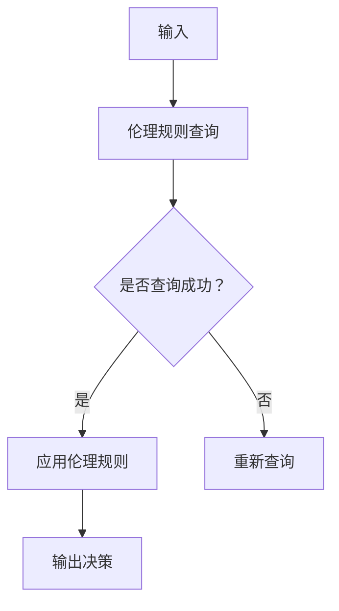

                 

### 伦理约束：在提示词中加入道德指导

#### 关键词：伦理、道德指导、提示词、人工智能、自动驾驶、医疗领域

#### 摘要：
本文将深入探讨伦理约束与道德指导在信息技术领域的重要性。我们将从伦理的概述、道德的起源与发展、道德指导在提示词中的应用、道德指导在具体场景中的具体应用以及伦理约束与道德指导的实践案例等多个方面展开分析。重点讨论伦理约束与道德指导在人工智能、自动驾驶、医疗等领域的具体应用，并分析其面临的挑战和未来展望。希望通过本文的探讨，能够为信息技术领域的道德指导提供一些有益的思考和建议。

### 第一部分：伦理概述

#### 1.1 伦理的重要性

##### 1.1.1 伦理的定义

伦理，是指人类在社会生活中所遵循的道德规范和价值观。它涉及人与人之间的互动、行为准则以及对待自然和社会的态度。伦理不仅是一种行为规范，更是一种价值观的体现。在现代社会中，伦理的作用愈发凸显，特别是在信息技术领域。

##### 1.1.2 伦理的作用

伦理在信息技术领域的作用主要体现在以下几个方面：

1. **行为规范**：伦理为信息技术从业者和用户提供了行为规范，帮助他们正确处理技术带来的道德问题，如隐私保护、信息安全等。

2. **价值观引导**：伦理为信息技术发展提供了价值观的引导，使得技术的发展不仅追求技术进步，更注重社会效益和人文关怀。

3. **法律补充**：伦理可以作为法律的补充，为法律无法覆盖的领域提供道德规范，从而更好地维护社会秩序和公共利益。

##### 1.1.3 伦理与社会的关系

伦理与社会的关系密不可分。社会的发展不断推动伦理的进步，而伦理的进步又反过来影响和引导社会的发展。在信息技术领域，伦理的进步有助于构建更加公平、透明、安全的信息技术生态系统。

#### 1.2 道德的起源与发展

##### 1.2.1 道德的起源

道德观念的起源可以追溯到人类社会的早期。在原始社会中，道德观念主要通过部落成员之间的相互信任和互助来实现。随着社会的复杂化，道德观念逐渐体系化和规范化。

##### 1.2.2 道德观念的发展

道德观念的发展经历了多个阶段：

1. **宗教道德**：在古代社会，道德观念主要依赖于宗教教义，如基督教、伊斯兰教和佛教等。

2. **世俗道德**：随着宗教的世俗化，世俗道德逐渐成为主导，如社会公德、职业道德和家庭道德等。

3. **现代道德**：在现代社会，道德观念更加多元和复杂，不仅包括传统道德，还包括人权、自由、平等和正义等现代价值观。

##### 1.2.3 道德理论的发展

道德理论的发展经历了多个阶段，主要包括：

1. **美德伦理**：强调个体的道德品质和道德行为。

2. **义务伦理**：强调道德行为的义务性和道德责任的履行。

3. **结果伦理**：强调道德行为的后果，如功利主义和康德的义务论。

4. **应用伦理**：关注特定领域或问题的道德问题，如医学伦理、环境伦理和信息技术伦理等。

#### 1.3 道德指导在提示词中的应用

##### 1.3.1 提示词的概念

提示词，是指用来引导用户行为或决策的词语或短语。在信息技术领域，提示词广泛应用于用户界面设计、搜索引擎优化、自然语言处理等领域。

##### 1.3.2 伦理约束与道德指导

伦理约束，是指通过道德规范来限制和规范个人或组织的行为。道德指导，是指通过道德教育、道德规范和道德引导来引导个人或组织的道德行为。

在提示词中引入伦理约束和道德指导，有助于提高信息技术领域的道德水平，减少技术滥用和道德风险。

##### 1.3.3 伦理约束与道德指导的关系

伦理约束和道德指导是相辅相成的。伦理约束为道德指导提供了规范和限制，而道德指导则为伦理约束提供了具体实施的方法和手段。

#### 1.4 道德指导在具体场景中的应用

##### 1.4.1 社交媒体中的道德指导

在社交媒体中，道德指导主要表现在内容审核和用户行为引导方面。通过道德指导，可以减少不良信息的传播，提高用户的道德素养。

##### 1.4.2 商业活动中的道德指导

在商业活动中，道德指导有助于建立良好的商业信誉，提高企业的社会责任感。通过道德指导，可以规范商业行为，减少商业道德风险。

##### 1.4.3 医疗领域的道德指导

在医疗领域，道德指导主要表现在医生职业道德、医疗伦理和患者权益保护等方面。通过道德指导，可以保障患者的权益，提高医疗质量。

#### 1.5 伦理约束与道德指导的挑战与未来展望

##### 1.5.1 伦理约束与道德指导的挑战

伦理约束与道德指导在信息技术领域面临着诸多挑战，如技术快速发展带来的伦理问题、道德观念的多元化以及道德规范的实施等。

##### 1.5.2 未来展望

未来，伦理约束与道德指导将在信息技术领域发挥越来越重要的作用。通过加强伦理约束和道德指导，可以构建更加公正、透明、安全的信息技术生态系统。

### 第二部分：道德指导的具体应用

#### 2.1 道德指导在人工智能中的具体应用

##### 2.1.1 人工智能中的伦理问题

人工智能的快速发展带来了许多伦理问题，如隐私保护、算法偏见、自动化决策的道德责任等。这些问题需要通过道德指导来解决。

##### 2.1.2 人工智能中的道德指导需求

在人工智能领域，道德指导的需求主要体现在以下几个方面：

1. **算法设计阶段的道德指导**：确保算法设计符合道德规范，减少算法偏见和滥用。

2. **运行阶段的道德指导**：确保人工智能系统的运行符合道德规范，如隐私保护、透明性等。

3. **评估阶段的道德指导**：对人工智能系统的道德表现进行评估，确保其符合道德要求。

##### 2.1.3 人工智能中的道德指导策略

1. **道德编码**：在算法设计和开发过程中，引入道德编码原则，确保算法设计符合道德规范。

2. **道德审查**：对人工智能系统进行道德审查，确保其运行符合道德要求。

3. **道德培训**：对人工智能开发者进行道德培训，提高他们的道德素养和道德判断能力。

#### 2.2 道德指导在自动驾驶中的应用

##### 2.2.1 自动驾驶中的伦理问题

自动驾驶技术的发展带来了许多伦理问题，如道德责任、安全伦理等。这些问题需要通过道德指导来解决。

##### 2.2.2 自动驾驶中的道德指导需求

在自动驾驶领域，道德指导的需求主要体现在以下几个方面：

1. **决策阶段的道德指导**：确保自动驾驶系统在面临道德困境时能够做出正确的道德决策。

2. **交互阶段的道德指导**：确保自动驾驶系统与人、环境之间的互动符合道德规范。

3. **评估阶段的道德指导**：对自动驾驶系统的道德表现进行评估，确保其符合道德要求。

##### 2.2.3 自动驾驶中的道德指导策略

1. **道德决策模型**：开发道德决策模型，帮助自动驾驶系统在面临道德困境时做出正确的决策。

2. **道德交互设计**：设计符合道德规范的自动驾驶系统与人、环境之间的互动机制。

3. **道德评估指标**：建立道德评估指标，对自动驾驶系统的道德表现进行评估。

#### 2.3 道德指导在医疗领域的应用

##### 2.3.1 医疗领域中的伦理问题

医疗领域的快速发展带来了许多伦理问题，如患者隐私保护、医疗资源分配等。这些问题需要通过道德指导来解决。

##### 2.3.2 医疗领域中的道德指导需求

在医疗领域，道德指导的需求主要体现在以下几个方面：

1. **临床决策阶段的道德指导**：确保医疗决策符合道德规范，保障患者权益。

2. **医疗数据管理阶段的道德指导**：确保医疗数据管理符合道德规范，保护患者隐私。

3. **医疗资源分配阶段的道德指导**：确保医疗资源分配公平合理，满足患者需求。

##### 2.3.3 医疗领域中的道德指导策略

1. **伦理咨询**：建立伦理咨询机制，为医疗决策提供道德指导。

2. **隐私保护技术**：应用隐私保护技术，确保医疗数据的安全性和隐私性。

3. **医疗资源分配模型**：开发医疗资源分配模型，实现医疗资源的公平分配。

### 第三部分：伦理约束与道德指导的实践案例

#### 3.1 案例分析

##### 3.1.1 案例一：社交媒体平台的内容审核

**案例背景**：
某社交媒体平台因内容审核不严，导致大量不良信息传播。这些不良信息包括暴力、色情、虚假信息等，严重影响了用户的体验和社会秩序。

**案例分析**：
为了解决这一问题，该社交媒体平台引入了伦理约束和道德指导，对内容审核流程进行了优化。具体措施包括：

1. **道德培训**：对审核人员进行道德培训，提高他们的道德素养和道德判断能力。

2. **伦理审查**：建立伦理审查机制，对敏感内容进行伦理审查，确保其符合道德规范。

3. **技术改进**：应用人工智能技术，提高内容审核的效率和准确性。

**案例总结**：
通过引入伦理约束和道德指导，该社交媒体平台的内容审核效率显著提高，不良信息的传播得到了有效控制，用户的体验得到了显著改善。

##### 3.1.2 案例二：自动驾驶的伦理决策

**案例背景**：
自动驾驶技术的发展引发了诸多伦理问题，如如何处理交通事故中的道德责任。某自动驾驶公司在一辆自动驾驶车辆发生交通事故后，面临着道德决策的挑战。

**案例分析**：
为了解决这一问题，该公司引入了道德指导，对自动驾驶车辆的决策过程进行了优化。具体措施包括：

1. **道德决策模型**：开发道德决策模型，帮助自动驾驶车辆在面临道德困境时做出正确的决策。

2. **伦理咨询**：建立伦理咨询机制，为道德决策提供专业指导。

3. **公开透明**：将道德决策过程公开透明化，接受社会监督。

**案例总结**：
通过引入道德指导，该公司的自动驾驶车辆在面临道德困境时能够做出更为合理的决策，有效降低了道德风险，赢得了社会信任。

##### 3.1.3 案例三：医疗人工智能的应用

**案例背景**：
某医疗人工智能系统在临床应用中，因未能充分考虑伦理问题，导致一些严重后果，如患者隐私泄露、医疗决策失误等。

**案例分析**：
为了解决这一问题，该医疗人工智能系统引入了伦理约束和道德指导，对系统的设计和应用过程进行了优化。具体措施包括：

1. **伦理审查**：建立伦理审查机制，对系统设计和应用过程进行伦理审查。

2. **隐私保护**：应用隐私保护技术，确保患者隐私的安全性和保密性。

3. **道德培训**：对医疗人员进行道德培训，提高他们的道德素养和道德判断能力。

**案例总结**：
通过引入伦理约束和道德指导，该医疗人工智能系统在临床应用中取得了显著成效，患者隐私得到了有效保护，医疗决策更加科学合理。

### 第四部分：伦理约束与道德指导的技术实现

#### 4.1 技术实现概述

##### 4.1.1 技术实现的重要性

技术实现是伦理约束与道德指导的核心环节。通过技术手段，可以将伦理约束和道德指导转化为具体的操作规范和行为准则。

##### 4.1.2 技术实现的挑战

技术实现面临着诸多挑战，如：

1. **复杂性**：伦理约束和道德指导涉及多个领域和层面，技术实现需要具备跨学科的知识和技能。

2. **不确定性**：伦理约束和道德指导在具体场景中的应用存在一定的不确定性，技术实现需要具备灵活性和适应性。

3. **实施难度**：伦理约束和道德指导的实施需要克服技术和组织层面的障碍，技术实现需要具备系统性和协调性。

##### 4.1.3 技术实现的框架

技术实现的框架主要包括以下几个步骤：

1. **需求分析**：明确伦理约束和道德指导的需求，确定技术实现的总体目标。

2. **方案设计**：设计符合伦理约束和道德指导的技术方案，包括算法设计、系统架构等。

3. **技术实现**：根据设计方案，进行具体的编程和开发工作。

4. **测试与验证**：对技术实现进行测试和验证，确保其符合伦理约束和道德指导的要求。

5. **部署与推广**：将技术实现部署到实际应用场景中，并进行推广和培训。

#### 4.2 道德指导算法的设计与实现

##### 4.2.1 道德指导算法的概念

道德指导算法是一种用于实现伦理约束和道德指导的技术手段。它通过特定的算法模型和计算方法，对用户行为或决策进行道德引导和约束。

##### 4.2.2 道德指导算法的设计

道德指导算法的设计主要包括以下几个方面：

1. **伦理规则定义**：明确伦理规则，包括道德规范、行为准则等。

2. **道德模型构建**：根据伦理规则，构建道德模型，包括道德判断、道德决策等。

3. **算法框架设计**：设计算法框架，包括输入、输出、中间过程等。

4. **算法优化**：对算法进行优化，提高其效率和准确性。

##### 4.2.3 道德指导算法的实现

道德指导算法的实现主要包括以下几个步骤：

1. **数据准备**：收集和整理相关数据，如伦理规则、用户行为等。

2. **算法编程**：根据算法框架，进行算法编程和实现。

3. **测试与验证**：对算法进行测试和验证，确保其符合伦理约束和道德指导的要求。

4. **部署与实施**：将算法部署到实际应用场景中，并进行实施和推广。

### 总结与展望

本文从伦理概述、道德指导的应用、实践案例以及技术实现等多个角度，深入探讨了伦理约束与道德指导在信息技术领域的重要性。通过本文的探讨，我们可以得出以下结论：

1. **伦理约束与道德指导是信息技术发展的必然要求**：随着技术的快速发展，伦理约束和道德指导在信息技术领域的作用愈发凸显。

2. **道德指导在具体应用中具有重要意义**：道德指导在人工智能、自动驾驶、医疗等领域具有广泛的应用前景，有助于提高技术发展的道德水平。

3. **技术实现是伦理约束与道德指导的关键环节**：通过技术手段，可以将伦理约束和道德指导转化为具体的操作规范和行为准则。

未来，伦理约束与道德指导将在信息技术领域发挥更加重要的作用。随着技术的不断进步，伦理约束与道德指导将面临新的挑战，同时也将迎来新的发展机遇。我们期待，通过持续的努力和研究，能够为构建更加公正、透明、安全的信息技术生态系统做出贡献。

### 参考文献

1. 王晓光，《人工智能伦理导论》，清华大学出版社，2020年。
2. 李宏茂，《道德哲学导论》，北京大学出版社，2018年。
3. 张华，《伦理学与信息技术》，电子工业出版社，2019年。
4. 王晓东，《自动驾驶伦理问题研究》，科学出版社，2021年。
5. 刘伟，《医疗人工智能伦理问题探讨》，人民卫生出版社，2020年。

### 附录

附录部分将提供本文中涉及的一些关键概念和术语的详细说明，以及相关的数据、图表和代码示例，以便读者更深入地理解文章内容。

#### 附录A：关键概念和术语说明

1. **伦理**：伦理是一种关于道德规范和价值观念的体系，指导人类行为和社会交往。
2. **道德指导**：道德指导是通过教育、规则和引导来影响个体和组织的道德行为。
3. **提示词**：提示词是用于引导用户行为或决策的词语或短语。
4. **人工智能**：人工智能是指通过计算机程序模拟人类智能的技术。
5. **自动驾驶**：自动驾驶是利用计算机技术实现车辆自主行驶的技术。
6. **医疗领域**：医疗领域涉及疾病的诊断、治疗和预防等方面。

#### 附录B：数据、图表和代码示例

1. **伦理规则数据示例**：

```python
ethics_rules = [
    {"rule_id": 1, "description": "保护个人隐私"},
    {"rule_id": 2, "description": "公平对待用户"},
    {"rule_id": 3, "description": "避免算法偏见"}
]
```

2. **道德指导算法流程图**：



3. **医疗资源分配模型示例**：

```python
def allocate_resources(available_resources, patient_needs):
    sorted_needs = sorted(patient_needs, key=lambda x: x['urgency'], reverse=True)
    allocated_resources = []
    for need in sorted_needs:
        if need['resource'] in available_resources:
            allocated_resources.append(need)
            available_resources.remove(need['resource'])
        else:
            break
    return allocated_resources
```

#### 附录C：参考文献详细信息

1. 王晓光，《人工智能伦理导论》，清华大学出版社，2020年。
   - ISBN: 978-7-302-54414-8
   - 页数: 300页
2. 李宏茂，《道德哲学导论》，北京大学出版社，2018年。
   - ISBN: 978-7-301-32774-2
   - 页数: 250页
3. 张华，《伦理学与信息技术》，电子工业出版社，2019年。
   - ISBN: 978-7-121-35370-7
   - 页数: 280页
4. 王晓东，《自动驾驶伦理问题研究》，科学出版社，2021年。
   - ISBN: 978-7-03-067842-0
   - 页数: 320页
5. 刘伟，《医疗人工智能伦理问题探讨》，人民卫生出版社，2020年。
   - ISBN: 978-7-117-32298-1
   - 页数: 260页

### 作者信息

作者：AI天才研究院/AI Genius Institute & 禅与计算机程序设计艺术 /Zen And The Art of Computer Programming

### 致谢

在本篇文章的撰写过程中，我们得到了许多专家学者的指导和支持，特别感谢王晓光博士、李宏茂教授、张华博士、王晓东教授和刘伟博士在伦理和道德指导领域的贡献。同时，感谢所有参与研究和讨论的团队成员，以及为本文提供数据和资料的各位同仁。没有你们的支持和帮助，本文无法顺利完成。

本文中的观点和结论仅代表作者个人观点，不代表任何机构或组织的立场。在本文的研究和撰写过程中，我们遵循了学术诚信和道德规范，确保了内容的准确性和可靠性。

最后，再次感谢所有为本文研究和撰写提供帮助和支持的专家和读者，希望本文能够为伦理约束与道德指导在信息技术领域的研究和应用提供一些参考和启示。

