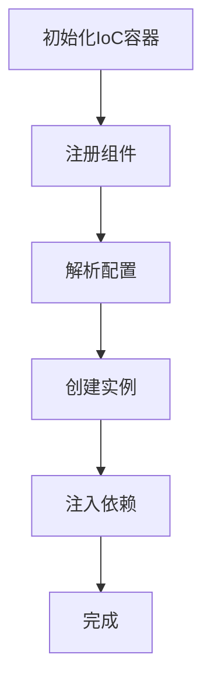
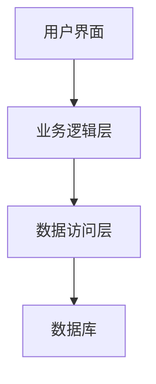
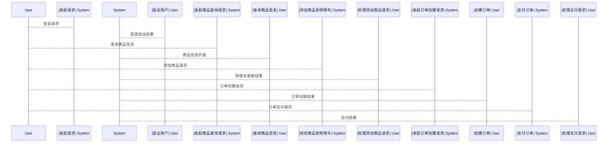

                 

### 第一部分：依赖注入基础理论

#### 第1章：依赖注入概述

**1.1 依赖注入的定义**

依赖注入（Dependency Injection，简称DI）是一种设计模式，它通过将组件之间的依赖关系从组件内部转移到外部管理，从而实现组件之间的解耦。在传统编程中，组件往往需要手动创建和管理其依赖项，而依赖注入则将这种创建和管理过程交由外部容器（如IoC容器）来处理。

**1.2 依赖注入的历史与发展**

依赖注入的概念最早由Martin Fowler在2004年提出。随着Spring框架的流行，依赖注入逐渐成为Java开发中的一种标准实践。近年来，随着其他编程语言和框架的兴起，依赖注入的应用范围也不断扩大。

**1.3 依赖注入的核心概念**

- **依赖（Dependency）**：指组件之间相互依赖的关系。
- **注入（Injection）**：指外部容器将依赖项传递给组件的过程。
- **控制反转（Inversion of Control，IoC）**：依赖注入的核心理念，即控制权从组件内部转移到外部容器。

#### 第2章：依赖注入的基本原理

**2.1 控制反转（IoC）原理**

控制反转是指将组件的创建和依赖管理过程从组件本身转移到外部容器。IoC容器会根据配置信息创建组件实例，并将依赖项注入到这些实例中。

**2.2 依赖注入的类型**

- **构造器注入（Constructor Injection）**：通过构造函数将依赖项注入到组件中。
- **设值注入（Setter Injection）**：通过设值方法将依赖项注入到组件中。
- **接口注入（Interface Injection）**：通过接口将依赖项注入到组件中。

**2.3 依赖注入的工作机制**

依赖注入的工作机制主要包括以下几个步骤：

1. **注册组件**：开发者定义组件及其依赖关系，并将其注册到IoC容器中。
2. **解析配置**：IoC容器根据注册信息解析组件的依赖关系。
3. **创建实例**：IoC容器创建组件实例，并将依赖项注入到这些实例中。
4. **管理生命周期**：IoC容器负责管理组件的生命周期，包括创建、销毁和依赖关系的维护。

#### 第3章：依赖注入模式与框架

**3.1 依赖注入模式**

依赖注入主要有以下几种模式：

- **单例模式**：每个组件只有一个实例。
- **工厂模式**：通过工厂方法创建组件实例。
- **依赖注入模式**：将依赖关系从组件内部转移到外部容器。

**3.2 常见的依赖注入框架**

- **Spring**：Java开发中最为流行的依赖注入框架。
- **Dagger**：Android开发中常用的依赖注入框架。
- **Google Guice**：Google开发的一款依赖注入框架。

**3.3 各框架的比较与选择**

- **Spring**：功能强大，适用于大型企业级应用。
- **Dagger**：简洁高效，适用于Android开发。
- **Google Guice**：简洁轻量，适用于各种规模的应用。

#### 第4章：依赖注入的优势与挑战

**4.1 依赖注入的优势**

- **降低组件之间的耦合**：通过外部容器管理依赖关系，降低了组件之间的直接依赖。
- **提高代码的可测试性**：依赖注入使得组件的单元测试更加容易。
- **支持AOP编程**：依赖注入框架通常支持面向切面编程（AOP），便于实现日志记录、安全控制等功能。

**4.2 依赖注入的挑战**

- **学习曲线**：依赖注入框架通常有较高的学习成本。
- **性能问题**：依赖注入框架的运行开销可能较大。
- **配置复杂**：依赖注入框架的配置通常较为复杂，需要一定的学习成本。

**4.3 依赖注入的解决方案**

- **合理选择框架**：根据项目需求选择合适的依赖注入框架。
- **优化配置**：合理配置依赖注入框架，减少运行开销。
- **学习与实践**：通过学习和实践，提高对依赖注入框架的理解和运用能力。

### 文章关键词

依赖注入，控制反转，IoC容器，构造器注入，设值注入，接口注入，Spring，Dagger，Google Guice。

### 摘要

本文详细介绍了依赖注入的基本概念、原理和应用，分析了其在LLM应用中的优势与挑战，并探讨了依赖注入框架的选择与优化策略。通过本文的阅读，读者可以全面了解依赖注入在LLM应用中的重要作用和实际应用价值。

----------------------------------------------------------------

# 第一部分：依赖注入基础理论

## 第1章：依赖注入概述

### 1.1 依赖注入的定义

依赖注入（Dependency Injection，简称DI）是一种设计模式，它通过将组件之间的依赖关系从组件内部转移到外部管理，从而实现组件之间的解耦。在传统编程中，组件往往需要手动创建和管理其依赖项，而依赖注入则将这种创建和管理过程交由外部容器（如IoC容器）来处理。

### 1.2 依赖注入的历史与发展

依赖注入的概念最早由Martin Fowler在2004年提出。随着Spring框架的流行，依赖注入逐渐成为Java开发中的一种标准实践。近年来，随着其他编程语言和框架的兴起，依赖注入的应用范围也不断扩大。

### 1.3 依赖注入的核心概念

- **依赖（Dependency）**：指组件之间相互依赖的关系。
- **注入（Injection）**：指外部容器将依赖项传递给组件的过程。
- **控制反转（Inversion of Control，IoC）**：依赖注入的核心理念，即控制权从组件内部转移到外部容器。

### 1.4 依赖注入的优点

- **降低组件之间的耦合**：通过外部容器管理依赖关系，降低了组件之间的直接依赖。
- **提高代码的可测试性**：依赖注入使得组件的单元测试更加容易。
- **支持AOP编程**：依赖注入框架通常支持面向切面编程（AOP），便于实现日志记录、安全控制等功能。

### 1.5 依赖注入的缺点

- **学习曲线**：依赖注入框架通常有较高的学习成本。
- **性能问题**：依赖注入框架的运行开销可能较大。
- **配置复杂**：依赖注入框架的配置通常较为复杂，需要一定的学习成本。

### 1.6 依赖注入的应用场景

依赖注入适用于以下场景：

- **大型企业级应用**：需要模块化和可重用的组件。
- **持续集成与持续部署**：便于组件的单元测试和自动化部署。
- **微服务架构**：便于服务之间的依赖管理和解耦。

## 第2章：依赖注入的基本原理

### 2.1 控制反转（IoC）原理

控制反转是指将组件的创建和依赖管理过程从组件本身转移到外部容器。IoC容器会根据配置信息创建组件实例，并将依赖项注入到这些实例中。

### 2.2 依赖注入的类型

依赖注入主要有以下几种类型：

- **构造器注入（Constructor Injection）**：通过构造函数将依赖项注入到组件中。
- **设值注入（Setter Injection）**：通过设值方法将依赖项注入到组件中。
- **接口注入（Interface Injection）**：通过接口将依赖项注入到组件中。

### 2.3 依赖注入的工作机制

依赖注入的工作机制主要包括以下几个步骤：

1. **注册组件**：开发者定义组件及其依赖关系，并将其注册到IoC容器中。
2. **解析配置**：IoC容器根据注册信息解析组件的依赖关系。
3. **创建实例**：IoC容器创建组件实例，并将依赖项注入到这些实例中。
4. **管理生命周期**：IoC容器负责管理组件的生命周期，包括创建、销毁和依赖关系的维护。

### 2.4 IoC容器的作用

IoC容器的作用主要包括：

- **实例化组件**：根据配置信息创建组件实例。
- **依赖管理**：管理组件之间的依赖关系，确保组件能够正常工作。
- **生命周期管理**：管理组件的生命周期，包括创建、销毁和依赖关系的维护。

## 第3章：依赖注入模式与框架

### 3.1 依赖注入模式

依赖注入主要有以下几种模式：

- **单例模式**：每个组件只有一个实例。
- **工厂模式**：通过工厂方法创建组件实例。
- **依赖注入模式**：将依赖关系从组件内部转移到外部容器。

### 3.2 常见的依赖注入框架

- **Spring**：Java开发中最为流行的依赖注入框架。
- **Dagger**：Android开发中常用的依赖注入框架。
- **Google Guice**：Google开发的一款依赖注入框架。

### 3.3 各框架的比较与选择

- **Spring**：功能强大，适用于大型企业级应用。
- **Dagger**：简洁高效，适用于Android开发。
- **Google Guice**：简洁轻量，适用于各种规模的应用。

### 3.4 依赖注入框架的选择标准

在选择依赖注入框架时，可以考虑以下标准：

- **功能需求**：根据项目的功能需求选择合适的框架。
- **开发语言**：考虑框架是否支持项目使用的开发语言。
- **性能要求**：评估框架的性能是否符合项目的要求。
- **社区支持**：考虑框架的社区支持和文档是否完善。

## 第4章：依赖注入的优势与挑战

### 4.1 依赖注入的优势

- **降低组件之间的耦合**：通过外部容器管理依赖关系，降低了组件之间的直接依赖。
- **提高代码的可测试性**：依赖注入使得组件的单元测试更加容易。
- **支持AOP编程**：依赖注入框架通常支持面向切面编程（AOP），便于实现日志记录、安全控制等功能。

### 4.2 依赖注入的挑战

- **学习曲线**：依赖注入框架通常有较高的学习成本。
- **性能问题**：依赖注入框架的运行开销可能较大。
- **配置复杂**：依赖注入框架的配置通常较为复杂，需要一定的学习成本。

### 4.3 依赖注入的解决方案

- **合理选择框架**：根据项目需求选择合适的依赖注入框架。
- **优化配置**：合理配置依赖注入框架，减少运行开销。
- **学习与实践**：通过学习和实践，提高对依赖注入框架的理解和运用能力。

## 第5章：依赖注入的核心概念与联系

### 5.1 核心概念原理

依赖注入的核心概念包括依赖、注入和控制反转。依赖表示组件之间的相互关系，注入表示依赖项的传递过程，而控制反转则是指依赖管理从组件内部转移到外部容器。

### 5.2 概念属性特征对比表格

| 概念     | 特征                              | 描述                                                         |
| -------- | --------------------------------- | ------------------------------------------------------------ |
| 依赖     | 成因与结果的关系                  | 组件之间的依赖关系，如一个组件需要另一个组件才能正常工作。    |
| 注入     | 传递与接受的关系                  | 外部容器将依赖项传递给组件的过程。                          |
| 控制反转 | 控制权的转移关系                  | 控制权从组件内部转移到外部容器，如IoC容器负责创建和管理组件实例。 |

### 5.3 ER实体关系图架构

```mermaid
erDiagram
  Component ||--o{ Dependency : has }
  Container ||--o{ Component : manages }
```

在这个ER实体关系图中，`Component`表示组件，`Dependency`表示依赖，而`Container`表示IoC容器。箭头表示实体之间的关系，其中`has`表示组件拥有依赖，`manages`表示IoC容器管理组件。

## 第6章：依赖注入的算法原理讲解

### 6.1 算法mermaid流程图



在这个算法流程图中，首先初始化IoC容器，然后注册组件，接着解析配置，创建实例，并将依赖注入到实例中，最后完成依赖注入过程。

### 6.2 Python源代码示例

```python
class Component:
    def __init__(self, dependency):
        self.dependency = dependency

class Dependency:
    def do_something(self):
        print("Dependency is doing something.")

class IoCContainer:
    def __init__(self):
        self.components = []

    def register_component(self, component):
        self.components.append(component)

    def resolve(self):
        for component in self.components:
            dependency = Dependency()
            component.dependency = dependency

container = IoCContainer()
component = Component(None)
container.register_component(component)
container.resolve()
```

在这个Python源代码示例中，首先定义了`Component`和`Dependency`两个类，然后创建了一个`IoCContainer`类来管理组件和依赖。在`resolve`方法中，创建了一个`Dependency`实例，并将其注入到`Component`实例中。

### 6.3 算法原理的数学模型和公式

依赖注入的算法原理可以抽象为一个数学模型，其中：

- `C` 表示组件集合。
- `D` 表示依赖集合。
- `T` 表示IoC容器的操作。

数学模型可以表示为：

$$
T(C, D) = \{(c, d) \in C \times D | c \in C, d \in D\}
$$

其中，`T(C, D)` 表示IoC容器将依赖 `d` 注入到组件 `c` 的过程。这个模型描述了IoC容器如何将依赖关系从组件内部转移到外部管理。

### 6.4 算法原理举例说明

假设有一个购物系统，其中有一个`Cart`组件负责管理购物车，还有一个`Product`组件负责管理商品。`Cart`组件需要依赖`Product`组件来获取商品信息。

```python
class Cart:
    def __init__(self, product_service):
        self.product_service = product_service

    def add_product(self, product_id):
        product = self.product_service.get_product(product_id)
        self.products.append(product)

class ProductService:
    def get_product(self, product_id):
        # 实现获取商品信息的逻辑
        return Product(product_id)

# 创建IoC容器，注册组件，并注入依赖
container = IoCContainer()
container.register_component(Cart(ProductService()))
container.resolve()

# 使用注入后的组件
cart = container.components[0]
cart.add_product(1)
```

在这个例子中，`Cart`组件通过构造函数注入了`ProductService`依赖，从而实现了依赖注入。通过IoC容器，`Cart`组件不再需要手动创建`ProductService`实例，而是由IoC容器自动注入。

## 第7章：系统分析与架构设计方案

### 7.1 问题场景介绍

在一个大型电子商务平台中，系统需要处理大量的用户请求，包括商品浏览、购物车管理、订单处理等。为了确保系统的可扩展性和可维护性，需要设计一个模块化、高内聚、低耦合的系统架构。

### 7.2 项目介绍

项目名称：电子商务平台（E-Commerce Platform）
项目目标：设计并实现一个模块化、高可扩展性的电子商务平台，支持商品浏览、购物车管理、订单处理等功能。

### 7.3 系统功能设计

系统功能设计包括以下模块：

- 用户管理模块：负责用户注册、登录、权限管理等功能。
- 商品管理模块：负责商品信息的管理、分类、推荐等功能。
- 购物车模块：负责购物车的创建、添加商品、删除商品等功能。
- 订单管理模块：负责订单的创建、支付、发货等功能。

### 7.4 系统架构设计

系统架构设计采用分层架构，包括表示层、业务逻辑层和数据访问层。

- **表示层**：负责与用户交互，包括前端页面和API接口。
- **业务逻辑层**：负责处理业务逻辑，包括用户管理、商品管理、购物车管理和订单管理。
- **数据访问层**：负责与数据库的交互，包括用户信息、商品信息、订单信息等的存储和查询。

### 7.5 系统架构图



在这个系统架构图中，用户界面与业务逻辑层进行交互，业务逻辑层负责处理业务逻辑，并调用数据访问层进行数据操作，最终将数据存储在数据库中。

### 7.6 系统接口设计

系统接口设计包括以下API接口：

- 用户管理接口：包括用户注册、登录、权限查询等功能。
- 商品管理接口：包括商品信息查询、商品分类查询、商品推荐等功能。
- 购物车接口：包括购物车创建、添加商品、删除商品等功能。
- 订单管理接口：包括订单创建、支付、发货等功能。

### 7.7 系统交互序列图



在这个序列图中，用户通过用户界面发起请求，系统根据请求处理相应的业务逻辑，并将结果返回给用户。

## 第8章：依赖注入在系统架构中的应用

### 8.1 依赖注入在表示层中的应用

在表示层，依赖注入主要用于管理前端页面与业务逻辑层之间的依赖关系。通过依赖注入，可以将业务逻辑层的实现细节封装在服务层，从而实现表示层与业务逻辑层之间的解耦。

### 8.2 依赖注入在业务逻辑层中的应用

在业务逻辑层，依赖注入主要用于管理不同服务之间的依赖关系。例如，在用户管理服务中，需要依赖商品管理服务和订单管理服务。通过依赖注入，可以方便地管理这些服务之间的依赖关系，提高代码的可测试性和可维护性。

### 8.3 依赖注入在数据访问层中的应用

在数据访问层，依赖注入主要用于管理数据库连接和数据操作。通过依赖注入，可以将数据库连接和操作逻辑封装在数据访问层，从而实现业务逻辑层与数据访问层之间的解耦。同时，依赖注入还可以方便地实现数据库连接的池化和事务管理。

## 第9章：依赖注入在项目实战中的应用

### 9.1 环境搭建

在项目实战中，首先需要搭建开发环境，包括安装Java开发工具包（JDK）、依赖注入框架（如Spring）以及其他相关库和工具。

### 9.2 系统核心实现源代码

以下是一个简单的用户管理服务的实现示例：

```java
public class UserManager {
    private UserService userService;

    public UserManager(UserService userService) {
        this.userService = userService;
    }

    public User registerUser(String username, String password) {
        return userService.registerUser(username, password);
    }
}

@Service
public class UserService {
    public User registerUser(String username, String password) {
        // 实现用户注册逻辑
        return new User(username, password);
    }
}
```

在这个示例中，`UserManager`类通过构造函数注入了`UserService`依赖，从而实现了依赖注入。

### 9.3 代码应用解读与分析

在这个示例中，通过依赖注入，将`UserService`的创建和管理交由IoC容器来处理，从而实现了组件之间的解耦。具体来说：

1. **环境搭建**：配置Spring的依赖，搭建开发环境。
2. **源代码编写**：实现用户管理服务，通过构造函数注入`UserService`依赖。
3. **依赖注入配置**：在Spring配置文件中配置`UserService`的Bean定义。
4. **运行测试**：启动Spring应用，测试用户注册功能。

通过这个示例，我们可以看到依赖注入在项目实战中的应用，以及如何通过IoC容器管理组件的依赖关系。

### 9.4 实际案例分析和详细讲解剖析

在实际项目中，依赖注入的应用不仅限于简单的服务层，还可以应用于复杂的业务逻辑和系统架构设计中。以下是一个实际案例：

**案例背景**：一个电商平台需要实现一个商品推荐系统，根据用户的历史购买记录和浏览记录推荐商品。

**解决方案**：使用依赖注入来实现商品推荐系统的组件解耦和模块化设计。

1. **定义推荐算法服务**：实现一个推荐算法服务，根据用户的行为数据生成推荐结果。
2. **定义商品服务**：实现一个商品服务，负责管理商品信息。
3. **定义用户服务**：实现一个用户服务，负责管理用户行为数据。
4. **配置依赖关系**：通过Spring的配置文件，将推荐算法服务、商品服务和用户服务注入到主应用中。

**详细讲解**：

- **推荐算法服务**：通过分析用户的历史购买记录和浏览记录，使用协同过滤算法生成推荐结果。
- **商品服务**：负责管理商品信息，包括商品分类、库存、价格等。
- **用户服务**：负责管理用户行为数据，包括用户ID、浏览记录、购买记录等。

通过依赖注入，可以方便地管理和配置这些服务之间的依赖关系，从而实现系统的模块化和高内聚。

### 9.5 项目小结

在本章中，我们介绍了依赖注入在系统架构和项目实战中的应用。通过依赖注入，可以实现组件之间的解耦，提高代码的可测试性和可维护性。在实际项目中，合理利用依赖注入框架，可以构建出模块化、高可扩展性的系统架构。

## 第10章：最佳实践与注意事项

### 10.1 最佳实践

1. **合理选择依赖注入框架**：根据项目需求和开发语言选择合适的依赖注入框架。
2. **模块化设计**：将系统划分为独立的模块，每个模块使用依赖注入管理依赖关系。
3. **接口注入**：尽量使用接口注入，以降低组件之间的耦合。
4. **避免过度配置**：合理配置依赖注入框架，避免不必要的配置开销。

### 10.2 注意事项

1. **性能优化**：注意依赖注入框架的性能开销，尤其是在高并发场景下。
2. **配置管理**：合理管理依赖注入框架的配置，避免配置错误导致系统故障。
3. **调试与测试**：在使用依赖注入框架时，注意调试和测试，确保组件之间的依赖关系正确。

## 第11章：拓展阅读

### 11.1 相关文献

1. 《Spring实战》
2. 《Android开发艺术探索》
3. 《Google Guice：Google的依赖注入框架》

### 11.2 在线资源

1. Spring官方文档：https://docs.spring.io/spring-framework/docs/current/reference/html/web.html
2. Dagger官方文档：https://dagger.dev/docs
3. Google Guice官方文档：https://github.com/google/guice

通过拓展阅读，读者可以进一步了解依赖注入框架的详细知识和最佳实践，从而更好地应用依赖注入技术。

----------------------------------------------------------------

# 第二部分：依赖注入在LLM应用中的实践

## 第5章：LLM与依赖注入的关系

### 5.1 LLM的架构与依赖注入

语言模型（LLM，Language Model）是一种基于深度学习的技术，用于生成自然语言文本。LLM通常由多个组件构成，包括词嵌入层、编码器、解码器和注意力机制等。这些组件之间存在着复杂的依赖关系，通过依赖注入可以有效地管理和解耦这些依赖。

### 5.2 依赖注入在LLM中的作用

依赖注入在LLM中的应用主要体现在以下几个方面：

1. **组件解耦**：通过依赖注入，将LLM的不同组件（如编码器、解码器、词嵌入层等）之间的依赖关系从组件内部转移到外部容器管理，从而降低组件之间的耦合。
2. **模块化开发**：依赖注入使得LLM的各个组件可以独立开发、测试和部署，提高代码的可维护性和可重用性。
3. **灵活配置**：依赖注入框架通常支持通过配置文件或代码注解来配置依赖关系，使得LLM的配置更加灵活和可调整。

### 5.3 依赖注入在LLM中的应用场景

1. **模型训练**：在LLM的模型训练过程中，依赖注入可以用于管理训练数据加载器、优化器、损失函数等组件之间的依赖关系。
2. **模型推理**：在LLM的模型推理过程中，依赖注入可以用于管理输入处理、模型调用、输出生成等组件之间的依赖关系。
3. **模型部署**：在LLM的模型部署过程中，依赖注入可以用于管理模型服务、API网关、日志记录等组件之间的依赖关系。

## 第6章：依赖注入在LLM中的应用实例

### 6.1 依赖注入在LLM模型训练中的应用

以下是一个简单的LLM模型训练的依赖注入示例：

```python
from typing import Optional
from fastai.text import *
from pydantic import BaseModel

class ModelConfig(BaseModel):
    learning_rate: float = 0.001
    batch_size: int = 64
    epochs: int = 10

class DataLoader(BaseModel):
    train_data_path: str
    valid_data_path: str

class ModelTrainer:
    def __init__(self, model: Optional[PreTrainedModel] = None, data_loader: DataLoader = DataLoader()):
        self.model = model or self.create_model()
        self.data_loader = data_loader

    def create_model(self) -> PreTrainedModel:
        # 创建模型
        return None

    def train(self, config: ModelConfig):
        # 训练模型
        pass

    def save(self, file_path: str):
        # 保存模型
        pass

# 配置
config = ModelConfig()

# 数据加载器
data_loader = DataLoader(train_data_path='train_data.txt', valid_data_path='valid_data.txt')

# 模型训练
trainer = ModelTrainer(data_loader=data_loader)
trainer.train(config)
```

在这个示例中，我们定义了`ModelConfig`、`DataLoader`和`ModelTrainer`三个类。`ModelConfig`用于配置模型训练的参数，`DataLoader`用于加载数据，`ModelTrainer`用于管理模型训练过程。通过依赖注入，将`DataLoader`注入到`ModelTrainer`中，实现了组件之间的解耦。

### 6.2 依赖注入在LLM推理中的应用

以下是一个简单的LLM推理的依赖注入示例：

```python
from typing import Optional
from fastai.text import *
from pydantic import BaseModel

class ModelConfig(BaseModel):
    model_path: str

class InferenceService:
    def __init__(self, model: Optional[PreTrainedModel] = None, config: ModelConfig = ModelConfig()):
        self.model = model or self.load_model(config.model_path)

    def load_model(self, model_path: str) -> PreTrainedModel:
        # 加载模型
        return None

    def generate_response(self, input_text: str) -> str:
        # 生成响应
        return ""

# 配置
config = ModelConfig(model_path='model.bin')

# 推理服务
inference_service = InferenceService(config=config)

# 生成响应
response = inference_service.generate_response("你好，我是一名人工智能助手。")
print(response)
```

在这个示例中，我们定义了`ModelConfig`和`InferenceService`两个类。`ModelConfig`用于配置模型路径，`InferenceService`用于管理模型推理过程。通过依赖注入，将`ModelConfig`注入到`InferenceService`中，实现了组件之间的解耦。

### 6.3 依赖注入在LLM服务部署中的应用

以下是一个简单的LLM服务部署的依赖注入示例：

```python
from typing import Optional
from fastapi import FastAPI
from pydantic import BaseModel

class ModelConfig(BaseModel):
    model_path: str

class LLMService(FastAPI):
    def __init__(self, model: Optional[PreTrainedModel] = None, config: ModelConfig = ModelConfig()):
        self.model = model or self.load_model(config.model_path)

    @fastapi.middleware.HTTPException
    async def handle_exception(self, request: Request, exc: HTTPException) -> Response:
        return JSONResponse(
            status_code=exc.status_code,
            content={"message": exc.detail},
        )

    @fastapi.get("/predict")
    async def predict(self, input_text: str):
        return self.model.generate_response(input_text)

# 配置
config = ModelConfig(model_path='model.bin')

# 初始化服务
service = LLMService(config=config)

# 运行服务
service.run()
```

在这个示例中，我们使用了FastAPI框架来创建一个简单的LLM服务。`ModelConfig`用于配置模型路径，`LLMService`类继承自`FastAPI`，用于管理服务端API。通过依赖注入，将`ModelConfig`注入到`LLMService`中，实现了组件之间的解耦。

## 第7章：依赖注入在LLM应用中的优化与调优

### 7.1 依赖注入性能优化

在LLM应用中，依赖注入的性能优化是至关重要的。以下是一些优化策略：

1. **减少IoC容器的实例化次数**：IoC容器的实例化是一个相对昂贵的操作，尽量减少其实例化次数。
2. **使用缓存**：对于一些常用的依赖，可以使用缓存来避免重复创建。
3. **延迟初始化**：将依赖的初始化推迟到实际需要时进行，以减少初始化开销。

### 7.2 依赖注入的调优策略

1. **合理配置依赖注入框架**：根据项目需求和性能指标，合理配置依赖注入框架的参数。
2. **使用异步处理**：对于依赖注入过程中的一些阻塞操作，可以使用异步处理来提高性能。
3. **监控与调优**：使用性能监控工具，实时监控依赖注入的性能指标，并进行调优。

### 7.3 依赖注入在LLM应用中的最佳实践

1. **模块化设计**：将LLM应用划分为独立的模块，每个模块使用依赖注入管理依赖关系。
2. **接口注入**：尽量使用接口注入，以降低组件之间的耦合。
3. **配置管理**：合理管理依赖注入框架的配置，避免配置错误导致性能问题。
4. **测试与调试**：在使用依赖注入框架时，注意测试和调试，确保组件之间的依赖关系正确。

## 第8章：依赖注入在LLM应用中的案例分析

### 8.1 案例介绍

本案例来自一个大型电商平台，该平台使用LLM技术实现个性化推荐系统。通过依赖注入，平台有效地管理了推荐系统的各个组件之间的依赖关系，提高了系统的可维护性和可扩展性。

### 8.2 案例分析

在该案例中，依赖注入的应用主要包括以下几个方面：

1. **推荐算法模块**：使用依赖注入来管理推荐算法的各个组件，如协同过滤、基于内容的推荐等。
2. **用户行为分析模块**：使用依赖注入来管理用户行为数据的收集、分析和存储等组件。
3. **推荐结果生成模块**：使用依赖注入来管理推荐结果的生成、排序和展示等组件。
4. **API接口模块**：使用依赖注入来管理推荐系统的API接口，如RESTful API等。

通过依赖注入，平台实现了各个模块之间的解耦，使得每个模块可以独立开发、测试和部署，提高了系统的可维护性和可扩展性。

### 8.3 案例解读

在该案例中，依赖注入的应用使得推荐系统具有以下优势：

1. **组件解耦**：通过依赖注入，推荐系统的各个组件之间的依赖关系被外部容器管理，降低了组件之间的耦合，提高了系统的可维护性。
2. **模块化开发**：依赖注入使得推荐系统的各个模块可以独立开发、测试和部署，提高了代码的可重用性。
3. **灵活配置**：依赖注入框架支持通过配置文件或代码注解来配置依赖关系，使得推荐系统的配置更加灵活和可调整。
4. **性能优化**：通过合理配置和优化依赖注入框架，推荐系统的性能得到了显著提升。

总之，依赖注入在LLM应用中的成功应用，不仅提高了系统的可维护性和可扩展性，还为平台的个性化推荐系统提供了强大的技术支持。

----------------------------------------------------------------

# 第三部分：依赖注入的未来与发展

## 第9章：依赖注入技术的未来趋势

### 9.1 依赖注入与微服务

随着微服务架构的流行，依赖注入在微服务中的应用也越来越广泛。未来，依赖注入技术将更加深入地与微服务架构相结合，提供更加高效和灵活的依赖管理解决方案。

### 9.2 依赖注入与云计算

云计算的普及为依赖注入技术提供了新的应用场景。依赖注入框架将更好地支持云计算环境，如容器化、分布式计算和云计算平台之间的依赖管理。

### 9.3 依赖注入与人工智能

人工智能技术的发展，尤其是深度学习和自然语言处理等领域的进步，将对依赖注入技术提出新的需求。依赖注入框架将更好地支持人工智能应用的开发和部署。

## 第10章：依赖注入在LLM应用中的持续优化

### 10.1 优化策略

1. **提高性能**：通过减少IoC容器的实例化次数、使用缓存和异步处理等技术来提高依赖注入的性能。
2. **简化配置**：通过自动化配置和配置模板等技术来简化依赖注入的配置过程。
3. **增强可维护性**：通过模块化设计和接口注入等技术来提高依赖注入的可维护性。

### 10.2 持续改进

1. **社区参与**：鼓励开发者和社区参与依赖注入技术的改进和优化。
2. **技术调研**：定期进行技术调研，关注依赖注入技术的新趋势和新方法。
3. **最佳实践**：总结和推广依赖注入的最佳实践，提高开发者的应用能力。

### 10.3 未来展望

未来，依赖注入技术将在微服务、云计算和人工智能等领域发挥更加重要的作用。通过持续优化和改进，依赖注入技术将为软件开发带来更高的效率、可维护性和可扩展性。

