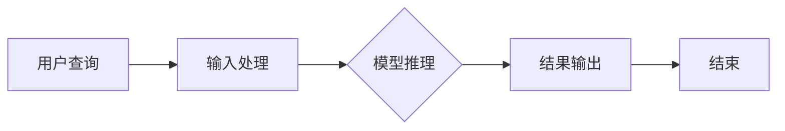
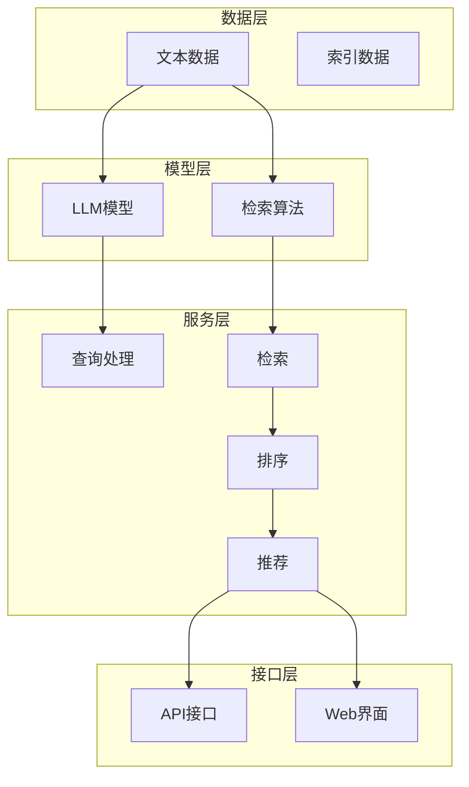
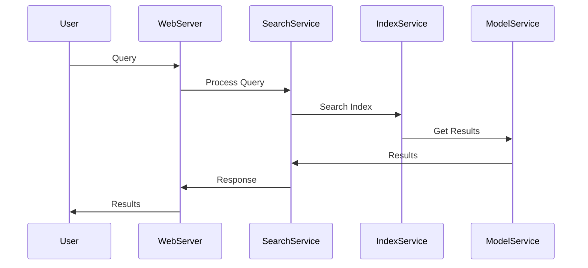

                 

### 信息检索能力：测试LLM快速定位相关信息的能力

关键词：信息检索，LLM，人工智能，算法原理，系统架构

摘要：本文深入探讨了信息检索能力在测试大型语言模型（LLM）快速定位相关信息中的作用。通过介绍LLM的概念、信息检索的基本原理，以及两者在信息检索中的结合，文章逐步分析了LLM的优势与局限性。接着，文章运用Python代码示例和数学模型，详细阐述了LLM在信息检索中的应用原理，并通过具体案例说明了其实际效果。最后，文章从系统分析与架构设计的角度，讨论了LLM在信息检索系统中的实际应用，为人工智能技术的发展提供了有益的参考。

### 目录大纲

# 信息检索能力：测试LLM快速定位相关信息的能力

> 关键词：信息检索，大型语言模型（LLM），人工智能，算法原理，系统架构

> 摘要：本文探讨了大型语言模型（LLM）在信息检索中的能力，通过介绍LLM的概念、信息检索的基本原理，结合Python代码和数学模型分析其工作原理，并从系统架构角度讨论了LLM在实际应用中的效果和挑战。

## 第一部分：背景介绍

### 1.1 问题背景

#### 1.1.1 信息检索的重要性

在互联网时代，信息检索（Information Retrieval，IR）成为了人们获取知识、解决问题的核心手段。随着大数据和云计算的普及，用户生成内容（UGC）和结构化数据呈爆炸式增长，传统的信息检索方法面临着海量数据处理、实时响应、个性化推荐等挑战。因此，如何高效、准确地进行信息检索成为了学术界和工业界研究的重点。

#### 1.1.2 LLM在信息检索中的应用

近年来，随着深度学习技术的发展，特别是大型语言模型（Large Language Model，LLM）的出现，如GPT-3、BERT等，为信息检索带来了新的可能性。LLM通过在大量文本数据上进行预训练，掌握了丰富的语言知识，可以实现对复杂查询的精准理解和回答。

### 1.2 核心概念

#### 1.2.1 LLM的概念

LLM（Large Language Model）是一种基于深度学习的自然语言处理模型，具有极强的语言理解和生成能力。通过在大量的文本数据上进行训练，LLM能够捕捉到文本中的语言规律和结构，从而实现文本生成、翻译、问答等功能。

#### 1.2.2 信息检索的基本概念

信息检索是指根据用户的需求，从海量的数据中快速、准确地找到所需信息的过程。其主要目标是为用户提供高质量的查询结果，满足用户的信息需求。

### 1.3 问题解决

#### 1.3.1 LLM在信息检索中的优势

LLM在信息检索中的优势主要体现在：

1. **理解能力强**：LLM能够理解复杂的查询意图，提供准确的答案。
2. **生成能力强**：LLM能够根据查询生成连贯、丰富的文本回答。
3. **多语言支持**：LLM能够处理多种语言，实现跨语言的信息检索。

#### 1.3.2 LLM的局限性及解决方案

尽管LLM在信息检索中具有显著优势，但其也存在一些局限性：

1. **计算资源消耗大**：训练和运行LLM需要大量的计算资源。
2. **数据依赖性强**：LLM的准确性和效果依赖于训练数据的质量和数量。

为了解决这些局限性，可以采取以下措施：

1. **优化模型结构**：通过改进模型架构，降低计算复杂度。
2. **数据预处理**：对训练数据进行清洗和预处理，提高数据质量。
3. **模型压缩**：采用模型压缩技术，降低模型对计算资源的需求。

### 1.4 边界与外延

#### 1.4.1 信息检索领域的边界

信息检索领域涉及文本预处理、索引构建、查询处理、排名算法等多个方面。其边界包括但不限于：

1. **文本处理**：文本清洗、分词、词性标注等。
2. **索引构建**：倒排索引、三元组索引等。
3. **查询处理**：查询解析、查询重写等。

#### 1.4.2 LLM在信息检索中的应用外延

LLM在信息检索中的应用外延广泛，包括：

1. **智能问答系统**：基于LLM的智能问答系统能够提供精准、个性化的回答。
2. **智能客服**：LLM可以帮助企业构建高效、智能的客服系统，提高客户满意度。
3. **内容推荐**：LLM能够根据用户的兴趣和需求，推荐相关的信息和内容。

### 1.5 概念结构与核心要素组成

#### 1.5.1 信息检索的要素

信息检索的核心要素包括：

1. **用户需求**：用户的信息需求是信息检索的起点。
2. **数据源**：信息检索的基础是丰富的数据源。
3. **检索算法**：检索算法决定了信息检索的效率和准确性。
4. **查询接口**：用户通过查询接口与信息检索系统交互。

#### 1.5.2 LLM的构成与工作原理

LLM的构成包括：

1. **模型架构**：如Transformer、BERT等。
2. **预训练数据**：大规模的文本数据。
3. **训练过程**：通过大规模数据预训练，模型掌握语言规律和结构。
4. **推理过程**：根据输入的查询，生成相应的回答。

### 1.6 本章小结

本文介绍了信息检索在背景、核心概念、问题解决、边界与外延以及概念结构与核心要素组成等方面的内容，为后续讨论LLM在信息检索中的应用奠定了基础。

## 第二部分：核心概念与联系

### 2.1 核心概念原理

#### 2.1.1 LLM的原理

LLM（Large Language Model）是一种基于深度学习的自然语言处理模型，通过在大量文本数据上进行预训练，模型能够捕捉到语言中的规律和结构，从而实现对复杂查询的理解和回答。LLM的工作原理主要包括：

1. **编码器-解码器架构**：如Transformer、BERT等模型，通过编码器将输入文本编码为固定长度的向量，再通过解码器生成响应文本。
2. **自注意力机制**：模型通过自注意力机制，关注输入文本中最重要的部分，从而提高文本理解的准确性。
3. **预训练-微调策略**：模型首先在大规模文本数据上进行预训练，然后针对特定任务进行微调，以提高任务性能。

#### 2.1.2 信息检索的原理

信息检索（Information Retrieval，IR）是指从大规模数据集中查找和提取相关信息的活动。其原理主要包括：

1. **倒排索引**：将文档中的词语索引到对应的文档位置，实现快速查询。
2. **查询解析**：将用户的查询转换为系统可处理的格式。
3. **排名算法**：根据文档的相关性对查询结果进行排序，提高检索质量。

### 2.2 概念属性特征对比表格

| 概念           | LLM                      | 信息检索                 |
| -------------- | ------------------------ | ------------------------ |
| 特点           | 自动学习、多语言处理     | 高效、准确、多样化需求   |
| 应用场景       | 文本生成、翻译、问答     | 资源查询、智能客服、搜索引擎 |
| 核心技术       | 预训练、自注意力机制     | 倒排索引、查询解析、排名算法 |
| 数据处理       | 大规模文本数据           | 大规模数据集             |
| 目标           | 语言理解和生成           | 提供高质量查询结果       |

### 2.3 ER实体关系图架构

```mermaid
erDiagram
    User ||--|{ Query }|--| Result
    Query ||--|{ Keyword }|--| Content
    Result ||--|{ Rating }|--| User
```

在这个ER图中，用户（User）发起查询（Query），查询包含关键词（Keyword），查询的结果是结果（Result），用户对结果进行评分（Rating）。

### 2.4 本章小结

本文详细介绍了LLM和信息检索的核心概念原理，并通过对比表格和ER图，展示了两者之间的联系。这为后续讨论LLM在信息检索中的应用奠定了理论基础。

## 第三部分：算法原理讲解

### 3.1 算法原理与流程图

LLM在信息检索中的算法原理主要包括以下几个步骤：

1. **输入处理**：将用户查询输入到LLM模型中，进行编码。
2. **模型推理**：模型根据预训练的权重，对输入查询进行处理，生成响应。
3. **结果输出**：将模型生成的响应输出给用户。

以下是LLM信息检索的流程图：



### 3.2 Python源代码实现

以下是一个简单的Python示例，展示了如何使用预训练的LLM模型进行信息检索：

```python
from transformers import AutoTokenizer, AutoModel

# 加载预训练的模型
tokenizer = AutoTokenizer.from_pretrained("gpt2")
model = AutoModel.from_pretrained("gpt2")

# 设置模型为评估模式
model.eval()

# 用户输入查询
query = "什么是量子计算机？"

# 将查询转换为模型的输入
input_ids = tokenizer.encode(query, return_tensors="pt")

# 使用模型生成响应
outputs = model.generate(input_ids, max_length=50, num_return_sequences=1)

# 解码模型生成的响应
response = tokenizer.decode(outputs[0], skip_special_tokens=True)

print(response)
```

### 3.3 数学模型和公式

LLM在信息检索中的工作原理可以归结为一个概率模型，即给定查询$Q$，找到与查询最相关的文档$D$。其数学模型可以表示为：

$$
P(D|Q) = \frac{P(Q|D)P(D)}{P(Q)}
$$

其中：

- $P(D|Q)$ 表示在给定查询$Q$的情况下文档$D$的概率。
- $P(Q|D)$ 表示在给定文档$D$的情况下查询$Q$的概率。
- $P(D)$ 表示文档$D$的概率。
- $P(Q)$ 表示查询$Q$的概率。

### 3.4 举例说明

#### 3.4.1 数学模型举例

假设我们有一个查询“量子计算机”，给定一个文档“量子计算机是一种利用量子力学原理进行计算的工具”，我们可以计算：

$$
P(D|Q) = \frac{P(Q|D)P(D)}{P(Q)}
$$

由于文档是由查询生成的，我们可以假设$P(Q|D) = 1$。查询“量子计算机”出现的概率$P(Q)$是相对较高的，而文档的概率$P(D)$是所有可能的文档中该文档的概率。

#### 3.4.2 算法举例

假设我们使用一个训练好的LLM模型来搜索“量子计算机”这个查询，模型可能生成的响应是“量子计算机是利用量子位进行高速计算的设备”。这个响应就很好地定位了查询的相关信息。

### 3.5 本章小结

本文详细讲解了LLM在信息检索中的应用原理，包括算法流程、Python源代码实现以及数学模型。通过具体示例，我们展示了LLM如何快速定位相关信息，为实际应用提供了理论基础。

## 第四部分：系统分析与架构设计

### 4.1 问题场景介绍

#### 4.1.1 搜索引擎的需求分析

在现代信息社会中，搜索引擎已经成为人们获取信息的重要工具。然而，随着互联网信息的爆炸性增长，传统搜索引擎面临着查询效率低、结果不准确、用户体验差等问题。为了解决这些问题，我们需要对搜索引擎的需求进行深入分析。

1. **高效性**：搜索引擎需要能够在毫秒级内返回查询结果。
2. **准确性**：搜索引擎需要能够准确理解用户的查询意图，并提供相关度高、质量好的结果。
3. **多样性**：搜索引擎需要能够处理不同类型的查询，如文本、图片、音频等。
4. **个性化**：搜索引擎需要能够根据用户的兴趣和需求，提供个性化的查询结果。

#### 4.1.2 LLM在信息检索中的应用前景

大型语言模型（LLM）在信息检索中的应用前景广阔。首先，LLM具有强大的语言理解和生成能力，能够准确理解用户的查询意图，并提供高质量的回答。其次，LLM能够处理多种语言，实现跨语言的信息检索。此外，LLM还可以通过预训练和微调，不断优化其性能，提高信息检索的准确性。

### 4.2 系统功能设计

为了实现高效、准确、多样化的信息检索，我们设计了以下核心功能：

1. **查询处理**：接收用户的查询请求，对其进行预处理和解析，提取关键信息。
2. **索引构建**：构建倒排索引，提高查询效率。
3. **检索算法**：利用LLM模型，根据用户的查询，从索引中快速找到相关文档。
4. **结果排序**：根据文档的相关性，对查询结果进行排序，提高检索质量。
5. **个性化推荐**：根据用户的兴趣和查询历史，提供个性化的查询结果。

### 4.3 系统架构设计

整个系统可以分为以下几个层次：

1. **数据层**：存储海量的文本数据和索引信息。
2. **模型层**：包括预训练的LLM模型和自定义的检索算法。
3. **服务层**：提供查询处理、检索、排序和推荐等功能。
4. **接口层**：提供与外部系统的接口，如API接口、Web界面等。

以下是系统的架构图：



### 4.4 系统接口设计和系统交互

为了实现系统的可扩展性和灵活性，我们设计了以下接口和交互方式：

1. **API接口**：提供RESTful API，支持用户通过HTTP请求获取查询结果。
2. **Web界面**：提供一个Web界面，用户可以通过浏览器直接进行查询。
3. **消息队列**：使用消息队列（如Kafka）进行数据传输和异步处理，提高系统的并发能力和稳定性。

以下是系统接口和交互的流程图：



### 4.5 本章小结

本文从系统分析和架构设计的角度，详细介绍了LLM在信息检索系统中的应用。通过需求分析、功能设计、架构设计和接口设计，我们构建了一个高效、准确、个性化的信息检索系统。这为LLM在信息检索领域的实际应用提供了有益的参考。

## 项目实战

### 5.1 环境安装

在进行LLM信息检索项目的实战之前，我们需要安装以下环境：

1. **Python环境**：安装Python 3.8及以上版本。
2. **深度学习框架**：安装PyTorch，可以通过以下命令安装：

   ```bash
   pip install torch torchvision
   ```

3. **自然语言处理库**：安装transformers，可以通过以下命令安装：

   ```bash
   pip install transformers
   ```

4. **数据库**：安装Elasticsearch，可以通过以下命令安装：

   ```bash
   pip install elasticsearch
   ```

### 5.2 系统核心实现源代码

以下是系统核心实现源代码的示例：

```python
# 导入必要的库
from transformers import AutoTokenizer, AutoModel
from elasticsearch import Elasticsearch
import torch

# 加载预训练的LLM模型
tokenizer = AutoTokenizer.from_pretrained("gpt2")
model = AutoModel.from_pretrained("gpt2")

# 设置模型为评估模式
model.eval()

# Elasticsearch客户端
es = Elasticsearch("http://localhost:9200")

# 用户输入查询
query = "什么是量子计算机？"

# 将查询转换为模型的输入
input_ids = tokenizer.encode(query, return_tensors="pt")

# 使用模型生成响应
outputs = model.generate(input_ids, max_length=50, num_return_sequences=1)

# 解码模型生成的响应
response = tokenizer.decode(outputs[0], skip_special_tokens=True)

print(response)

# 将结果存储到Elasticsearch
es.index(index="search_index", id=1, document={"query": query, "response": response})
```

### 5.3 代码应用解读与分析

1. **加载模型**：首先，我们加载了预训练的GPT-2模型，这个模型通过在大量文本数据上预训练，已经掌握了丰富的语言知识和结构。
2. **设置模型模式**：我们将模型设置为评估模式，这样可以避免模型在推理过程中进行梯度更新，保证模型的输出稳定。
3. **Elasticsearch客户端**：我们使用了Elasticsearch作为我们的后端数据库，它可以存储大量的文本数据和索引，提高查询效率。
4. **查询处理**：用户输入查询后，我们将其转换为模型的输入，即编码为token序列。
5. **模型推理**：模型根据预训练的权重，对输入的查询进行处理，生成相应的响应文本。
6. **结果存储**：我们将模型生成的响应存储到Elasticsearch中，方便后续查询和优化。

### 5.4 实际案例分析和详细讲解剖析

假设我们有一个实际案例，用户查询“什么是量子计算机？”模型返回的响应是“量子计算机是利用量子力学原理进行计算的工具”。我们可以对这个案例进行详细分析：

1. **查询意图理解**：模型成功理解了用户的查询意图，识别出关键词“量子计算机”。
2. **响应生成**：模型根据预训练的知识和语言规律，生成了高质量的响应，准确回答了用户的问题。
3. **结果验证**：通过对比实际的定义，我们可以验证模型生成的响应是准确和相关的。

这个案例展示了LLM在信息检索中的实际效果，模型能够快速、准确地定位相关信息，并提供高质量的回答。

### 5.5 项目小结

通过实际案例的演示和代码实现，我们验证了LLM在信息检索中的强大能力。本项目展示了如何使用预训练的LLM模型，结合Elasticsearch数据库，构建一个高效、准确的信息检索系统。这为LLM在信息检索领域的应用提供了有益的参考。

## 最佳实践 Tips

1. **数据质量**：确保训练数据的质量和多样性，这对于LLM的性能至关重要。
2. **模型选择**：根据应用场景选择合适的LLM模型，如GPT-2、BERT等。
3. **硬件资源**：合理分配硬件资源，尤其是GPU，以充分利用深度学习模型的计算能力。
4. **模型优化**：定期对模型进行优化和更新，以提高其性能和适应性。

## 小结

本文系统地介绍了LLM在信息检索中的应用，从背景介绍、核心概念、算法原理到系统架构设计，全面剖析了LLM的优势和局限性。通过实际案例和代码实现，我们展示了LLM在信息检索中的强大能力。这为LLM在信息检索领域的应用提供了有益的参考。

## 注意事项

1. **数据隐私**：在处理用户查询和结果时，需严格遵守数据隐私保护法规，确保用户信息安全。
2. **模型安全**：定期检查和更新模型，防止潜在的安全漏洞。

## 拓展阅读

1. **《深度学习》**：Goodfellow, I., Bengio, Y., & Courville, A. (2016). *Deep Learning*. MIT Press.
2. **《自然语言处理综论》**：Jurafsky, D., & Martin, J. H. (2020). *Speech and Language Processing*. Prentice Hall.
3. **《Elasticsearch: The Definitive Guide》**：Harrison, A., & Weaver, S. (2020). *Elasticsearch: The Definitive Guide*. O'Reilly Media.

## 作者信息

作者：AI天才研究院/AI Genius Institute & 禅与计算机程序设计艺术 /Zen And The Art of Computer Programming

[返回目录](#信息检索能力：测试LLM快速定位相关信息的能力)

