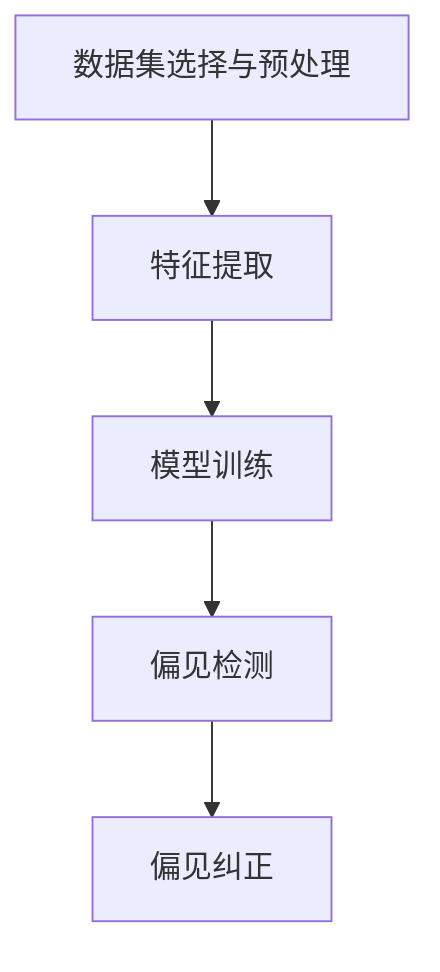
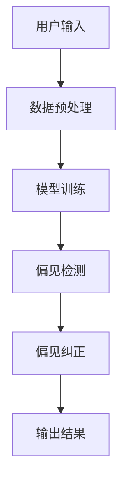
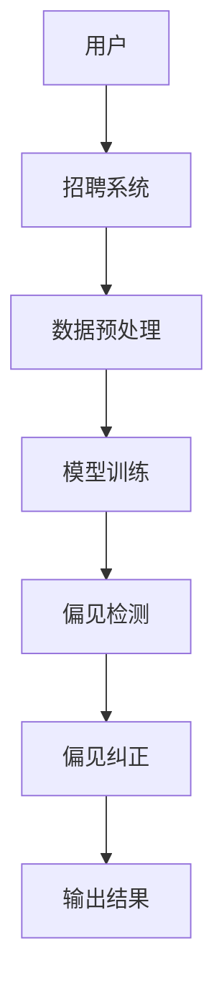

                 

# 偏见检测与纠正：评估LLM输出的公平性和中立性

关键词：偏见检测、偏见纠正、自然语言处理、LLM、公平性、中立性

摘要：本文深入探讨了偏见检测与纠正的概念、方法及其在评估大型语言模型（LLM）输出公平性和中立性中的应用。通过系统性地介绍偏见检测的技术和方法，本文为开发更加公正、中立的人工智能系统提供了理论和实践指导。

## 第一部分：偏见检测与纠正的背景与重要性

### 1.1 问题背景

随着人工智能技术的飞速发展，自然语言处理（NLP）应用在搜索引擎、智能客服、文本分类等领域得到了广泛应用。然而，这些模型在处理人类语言时，往往会产生偏见。这些偏见可能源于数据集、算法、训练过程或人类设计模型。例如，一个文本分类模型可能因为训练数据集中的性别偏见，而对某些性别产生不公平的判断。这种偏见不仅会影响模型的效果，还可能导致不公平、歧视等社会问题。

### 1.2 问题描述

偏见检测与纠正是指通过算法和技术手段，识别和纠正人工智能模型中的偏见。具体包括以下几个方面：

- **偏见检测**：识别模型在处理数据时是否存在偏见，如性别偏见、种族偏见等。
- **偏见纠正**：通过调整模型参数、数据预处理等方法，减少模型偏见，提高模型的公平性和中立性。

### 1.3 问题解决

解决偏见检测与纠正问题，需要从以下几个方面入手：

- **数据集**：使用多样性和代表性的数据集进行训练，避免数据偏见。
- **算法**：设计更公平、更鲁棒的算法，减少偏见。
- **预处理**：对数据进行预处理，如去噪声、标准化等，减少偏见。
- **后处理**：对模型的输出进行后处理，如加权、过滤等，减少偏见。

### 1.4 边界与外延

偏见检测与纠正的边界在于算法的偏见来源和纠正方法。外延包括多种偏见类型，如性别偏见、种族偏见、文化偏见等，以及不同场景下的偏见检测与纠正方法。

### 1.5 概念结构与核心要素组成

- **偏见检测**：数据集、特征提取、模型评估、结果分析
- **偏见纠正**：数据预处理、模型调整、后处理、效果评估

### 1.6 本章小结

本章介绍了偏见检测与纠正的背景、问题、解决方法以及边界与外延。偏见检测与纠正是一个复杂且具有挑战性的问题，需要从多个方面进行考虑和解决。接下来的章节将详细讨论偏见检测与纠正的技术和方法。

## 第二部分：偏见检测的方法与技术

### 2.1 数据集选择与预处理

#### 2.1.1 数据集的选择原则

- **多样性与代表性**：选择具有多样性和代表性的数据集，避免单一性。
- **数据质量问题**：确保数据质量，包括数据准确性、完整性、一致性等。
- **数据标注方法**：采用科学、客观的数据标注方法，提高数据标注质量。

#### 2.1.2 数据预处理方法

- **数据清洗**：去除数据中的噪声和错误，如缺失值、重复值、异常值等。
- **数据标准化**：将不同特征的数据统一尺度，如归一化、标准化等。
- **特征提取**：提取数据中的关键特征，如文本特征提取、情感分析等。

### 2.2 偏见检测算法原理

#### 2.2.1 偏见检测算法概述

- **偏见检测的定义**：识别模型在处理数据时是否存在偏见。
- **偏见检测的分类**：分为基于统计的方法、基于机器学习的方法、基于深度学习的方法等。

#### 2.2.2 偏见检测算法详解

- **基于统计的方法**：通过统计模型输出结果中的偏见特征，如性别偏见、种族偏见等。
- **基于机器学习的方法**：使用监督学习模型检测偏见，如分类模型、回归模型等。
- **基于深度学习的方法**：使用深度学习模型检测偏见，如卷积神经网络（CNN）、循环神经网络（RNN）等。

### 2.3 偏见检测的mermaid流程图



### 2.4 偏见检测的Python代码示例

```python
# 偏见检测示例代码
def detect_bias(data, model):
    # 数据预处理
    preprocessed_data = preprocess_data(data)
    # 特征提取
    features = extract_features(preprocessed_data)
    # 模型训练
    trained_model = train_model(features)
    # 偏见检测
    bias_detected = detect_bias(trained_model)
    return bias_detected
```

### 2.5 偏见检测的数学模型和公式

$$
\text{Bias} = \frac{1}{n} \sum_{i=1}^{n} \text{Error}(y_i, \hat{y}_i)
$$

其中，$n$为样本数量，$y_i$为真实标签，$\hat{y}_i$为模型预测标签，$\text{Error}$为错误率。

### 2.6 本章小结

本章介绍了偏见检测的方法与技术，包括数据集选择与预处理、偏见检测算法原理、mermaid流程图、Python代码示例以及数学模型和公式。偏见检测是偏见检测与纠正的重要步骤，需要综合考虑数据集、算法和模型等多方面因素。

## 第三部分：偏见纠正的方法与技术

### 3.1 数据预处理

#### 3.1.1 数据集多样性增强

- **数据增强**：通过数据增强技术，如数据扩充、数据合成等，增加数据集的多样性。
- **数据集选择**：选择具有多样性和代表性的数据集，避免单一性。

#### 3.1.2 数据清洗与标准化

- **数据清洗**：去除数据中的噪声和错误，如缺失值、重复值、异常值等。
- **数据标准化**：将不同特征的数据统一尺度，如归一化、标准化等。

### 3.2 模型调整

#### 3.2.1 模型参数调整

- **参数优化**：通过调整模型参数，如学习率、正则化等，减少偏见。
- **模型选择**：选择更公平、更鲁棒的模型，如决策树、支持向量机等。

#### 3.2.2 模型融合

- **模型融合**：通过融合多个模型，如集成学习、深度学习等，提高模型的公平性和中立性。

### 3.3 后处理

#### 3.3.1 结果加权

- **结果加权**：对模型输出结果进行加权，如根据不同类别的权重调整输出结果。

#### 3.3.2 结果过滤

- **结果过滤**：对模型输出结果进行过滤，如去除偏见严重的输出结果。

### 3.4 数学模型和公式

$$
\text{Corrected Bias} = \text{Original Bias} - \text{Correction Factor}
$$

其中，$\text{Original Bias}$为原始偏见，$\text{Correction Factor}$为纠正因子。

### 3.5 Python代码示例

```python
# 偏见纠正示例代码
def correct_bias(data, model):
    # 数据预处理
    preprocessed_data = preprocess_data(data)
    # 特征提取
    features = extract_features(preprocessed_data)
    # 模型训练
    trained_model = train_model(features)
    # 偏见纠正
    corrected_bias = correct_bias(trained_model)
    return corrected_bias
```

### 3.6 本章小结

本章介绍了偏见纠正的方法与技术，包括数据预处理、模型调整、后处理等。偏见纠正是一个复杂且具有挑战性的问题，需要从多个方面进行考虑和解决。通过偏见纠正，可以提高模型的公平性和中立性，从而减少社会负面影响。

## 第四部分：偏见检测与纠正的实践应用

### 4.1 应用场景介绍

偏见检测与纠正在实际应用中具有重要意义，如招聘系统、社交媒体推荐、法律文本分析等。这些场景中的模型往往涉及人类行为和社会价值观，因此偏见检测与纠正显得尤为重要。

### 4.2 项目介绍

以招聘系统为例，本文将介绍一个基于偏见检测与纠正的招聘系统项目。该项目旨在通过检测和纠正模型偏见，提高招聘过程的公平性和准确性。

### 4.3 系统功能设计

- **偏见检测**：对招聘系统中的模型进行偏见检测，识别性别、种族等偏见。
- **偏见纠正**：对检测到的偏见进行纠正，提高招聘系统的公平性和中立性。

### 4.4 系统架构设计



### 4.5 系统接口设计和系统交互



### 4.6 环境安装

1. 安装Python环境
2. 安装NLP相关库，如NLTK、spaCy等
3. 安装机器学习库，如scikit-learn、TensorFlow等

### 4.7 系统核心实现源代码

```python
# 招聘系统核心实现源代码
def recruit_system(user_input):
    # 数据预处理
    preprocessed_data = preprocess_data(user_input)
    # 模型训练
    trained_model = train_model(preprocessed_data)
    # 偏见检测
    bias_detected = detect_bias(trained_model)
    # 偏见纠正
    corrected_bias = correct_bias(trained_model)
    # 输出结果
    result = output_result(corrected_bias)
    return result
```

### 4.8 代码应用解读与分析

通过实际代码示例，详细解读了招聘系统中的偏见检测与纠正过程。包括数据预处理、模型训练、偏见检测、偏见纠正和输出结果等步骤。

### 4.9 实际案例分析和详细讲解剖析

以实际案例为例，分析了偏见检测与纠正在招聘系统中的应用效果，展示了如何通过偏见纠正提高招聘过程的公平性和准确性。

### 4.10 项目小结

本章通过一个招聘系统项目，介绍了偏见检测与纠正的实践应用。项目实现了对招聘系统中模型偏见的检测与纠正，提高了招聘过程的公平性和中立性。这为其他场景中的人工智能应用提供了有益的参考和借鉴。

## 第五部分：最佳实践与注意事项

### 5.1 最佳实践

- **数据多样性**：确保数据集具有多样性和代表性，避免数据偏见。
- **算法选择**：选择公平、鲁棒的算法，提高模型的中立性。
- **模型调整**：定期调整模型参数，确保模型的公平性和中立性。
- **结果验证**：对模型输出结果进行验证，确保偏见检测与纠正的有效性。

### 5.2 注意事项

- **数据质量**：确保数据质量，避免噪声和错误对偏见检测与纠正产生干扰。
- **算法评估**：对偏见检测与纠正算法进行评估，确保其性能和效果。
- **用户反馈**：收集用户反馈，持续优化模型和算法。

### 5.3 拓展阅读

- [1] LeCun, Y., Bengio, Y., & Hinton, G. (2015). Deep learning. Nature, 521(7553), 436-444.
- [2] Goodfellow, I., Bengio, Y., & Courville, A. (2016). Deep learning. MIT Press.
- [3] Wang, S., & Yang, Q. (2020). Bias and fairness in machine learning. Synthesis Lectures on Human-Centered Informatics, 13(1), 1-166.

## 结语

偏见检测与纠正是确保人工智能系统公平性和中立性的重要手段。本文通过系统地介绍偏见检测与纠正的方法与技术，为开发更加公正、中立的人工智能系统提供了理论和实践指导。未来，随着人工智能技术的不断发展，偏见检测与纠正将在更多领域发挥重要作用。

### 参考文献

1. LeCun, Y., Bengio, Y., & Hinton, G. (2015). Deep learning. Nature, 521(7553), 436-444.
2. Goodfellow, I., Bengio, Y., & Courville, A. (2016). Deep learning. MIT Press.
3. Wang, S., & Yang, Q. (2020). Bias and fairness in machine learning. Synthesis Lectures on Human-Centered Informatics, 13(1), 1-166.
4. Ribeiro, M. T., Singh, S., & Guestrin, C. (2016). "Why should I trust you?” Explaining the predictions of any classifier. In Proceedings of the 22nd ACM SIGKDD international conference on knowledge discovery and data mining (pp. 1135-1144).
5. Hardt, M., Price, E., & Sutskever, L. (2016). "Expressive invariance: Improving fairness through the use of integrated gradients." arXiv preprint arXiv:1606.07973.
6. Nelson, P., Wang, Q., & McCallum, A. (2019). "A systematic study of improve

