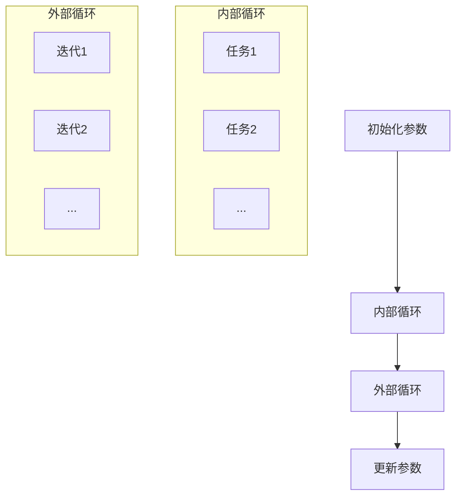
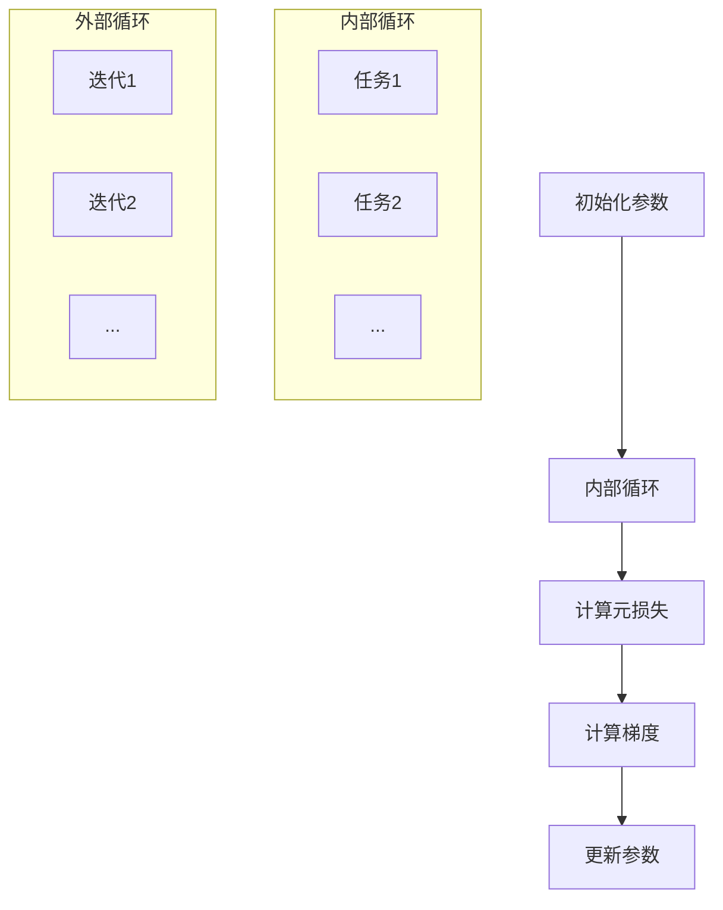
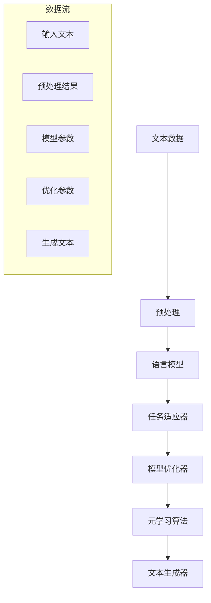
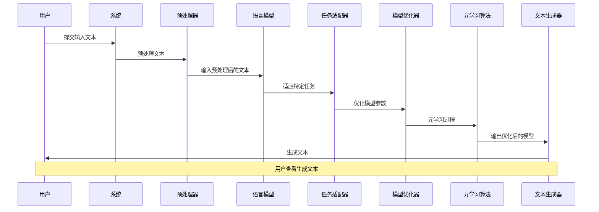

                 

### 元学习能力概述

#### 1.1 元学习的定义

元学习（Meta-Learning），也称为“学习如何学习”，是机器学习领域中的一个重要分支。简单来说，元学习关注的是如何通过学习一个学习过程来提升模型的泛化能力和效率。它不仅包括传统的机器学习方法，还涵盖了学习算法的设计和优化过程。

在元学习的定义中，有两个关键点需要强调：

1. **学习过程**：元学习关注的是学习过程中的优化，包括数据预处理、特征提取、模型选择、模型训练等各个环节。
2. **泛化能力**：元学习的目标是提升模型的泛化能力，使得模型能够更好地应对新的任务和数据集。

#### 1.2 元学习与机器学习的区别

元学习与机器学习有密切的联系，但两者也有一些显著的区别：

- **学习对象**：机器学习关注的是如何从数据中学习，而元学习则关注如何学习学习过程本身。
- **目标不同**：机器学习的目标是训练出一个能够解决特定任务的模型，而元学习的目标是通过学习不同任务间的共性，提高学习效率和泛化能力。
- **适用范围**：机器学习适用于有明确标注数据的场景，而元学习则更适用于数据稀缺、任务多变的情况。

#### 1.3 元学习的主要任务

元学习的主要任务可以归纳为以下几个方面：

- **任务泛化**：通过元学习算法，使得模型能够从特定任务中学习到通用的特征表示，从而能够泛化到新的任务。
- **数据泛化**：在数据稀缺的情况下，元学习可以帮助模型从少量数据中学习到有效的特征，从而提高模型的泛化能力。
- **模型自适应**：通过元学习，模型可以快速适应新的任务和数据分布，提高模型的灵活性和适应性。

#### 1.4 元学习的发展历程

元学习的发展可以追溯到20世纪50年代末和60年代初，当时研究人员开始探索如何通过模拟学习过程来设计机器学习算法。以下是元学习发展历程中的几个关键时期和重要人物：

- **1950年代**：机器学习概念的形成，以及早期学习算法（如感知机）的提出。
- **1980年代**：元学习概念的正式提出，以及强化学习等算法的兴起。
- **1990年代**：元学习算法的研究得到进一步发展，包括基于模型的元学习和基于优化的元学习。
- **2000年代至今**：随着深度学习的兴起，元学习算法得到了新的发展，如基于神经网络的元学习算法（如MAML、Reptile等）。

#### 1.5 元学习在LLM中的应用

在自然语言处理（NLP）领域，大规模语言模型（LLM）如GPT、BERT等取得了显著的成果。然而，这些模型在适应新任务时往往表现出一定的局限性。元学习通过提升模型对新任务的适应能力，为LLM的应用带来了新的可能。

- **任务迁移**：通过元学习，LLM可以快速迁移到新的任务，而无需从头开始训练，大大提高了训练效率。
- **数据效率**：元学习能够帮助LLM从少量数据中学习到有效的特征，从而提高模型的数据效率。
- **模型自适应**：元学习使得LLM能够快速适应新的数据分布和任务需求，提高了模型的泛化能力和灵活性。

#### 1.6 元学习的边界与外延

尽管元学习在机器学习领域取得了显著的成果，但它仍然存在一些局限性。例如：

- **计算复杂度**：元学习算法通常具有较高的计算复杂度，特别是在处理大规模数据集时。
- **模型泛化能力**：元学习模型在迁移新任务时的泛化能力仍需进一步提高。

此外，元学习与其他领域（如认知科学、心理学）的关系也越来越受到关注，未来研究有望在这些交叉领域取得新的突破。

#### 1.7 元学习的未来发展趋势

随着人工智能技术的不断发展，元学习在多个领域都展现出了巨大的潜力。以下是元学习的几个未来发展趋势：

- **算法创新**：不断涌现的新算法将进一步提高元学习的效率和效果。
- **应用拓展**：元学习将在更多领域（如医疗、金融、教育等）得到广泛应用。
- **跨领域合作**：元学习与其他领域的交叉研究将为人工智能的发展带来新的机遇。

综上所述，元学习作为机器学习的一个重要分支，正逐渐成为研究的热点。通过深入理解元学习的基本概念、发展历程和应用，我们可以更好地把握其未来的发展方向，为人工智能的应用提供新的动力。

#### 1.7 元学习的未来发展趋势

随着人工智能技术的不断发展，元学习在多个领域都展现出了巨大的潜力。以下是元学习的几个未来发展趋势：

- **算法创新**：不断涌现的新算法将进一步提高元学习的效率和效果。例如，基于深度神经网络的元学习算法（如MAML、Reptile等）已经在实际应用中取得了显著成效。未来，研究人员将继续探索更高效、更鲁棒的元学习算法，以应对更复杂的任务和数据集。

- **应用拓展**：元学习将在更多领域得到广泛应用。从传统的机器学习任务，如图像分类和语音识别，到新兴的应用领域，如自然语言处理和机器人学，元学习都在发挥重要作用。特别是在自然语言处理领域，元学习将有助于提升大型语言模型（LLM）对新任务的适应能力，使其在生成文本、问答系统等方面表现更优。

- **跨领域合作**：元学习与其他领域的交叉研究将为人工智能的发展带来新的机遇。例如，在认知科学和心理学领域，研究人员正在探索如何通过元学习模拟人类的认知过程，从而更好地理解人类行为。在生物医学领域，元学习可以用于预测药物疗效、诊断疾病等，具有重要的应用价值。

- **模型泛化能力**：尽管元学习在提升模型泛化能力方面已经取得了显著进展，但未来仍需进一步提高。研究人员将继续探索如何在更广泛的任务和数据集上提升模型的泛化能力，从而使其在不同场景下都能表现出色。

- **计算资源优化**：元学习算法通常具有较高的计算复杂度，特别是在处理大规模数据集时。未来，随着计算资源的不断优化和提升，元学习算法将能够更好地应对复杂任务，同时降低计算成本。

- **开放平台和工具**：随着元学习研究的深入，越来越多的开放平台和工具将涌现，使得更多研究人员和开发者能够方便地使用和改进元学习算法。这些平台和工具将极大地促进元学习的研究和应用，推动人工智能技术的发展。

综上所述，元学习作为机器学习的一个重要分支，其未来发展前景广阔。通过不断探索和创新，我们可以期待元学习在更多领域发挥重要作用，为人工智能的发展提供新的动力。

#### 1.8 元学习的局限性

尽管元学习在机器学习领域展现出了巨大的潜力，但它仍然存在一些局限性。以下是元学习面临的主要挑战和局限性：

- **计算复杂度**：元学习算法通常需要大量的计算资源，特别是在处理大规模数据集时。这导致在现实应用中，很多元学习算法难以高效地运行，尤其是在资源受限的环境下。

- **数据依赖性**：元学习的效果在很大程度上依赖于训练数据的数量和质量。如果数据集不够丰富或存在偏差，元学习模型可能无法泛化到新的任务和数据集，从而影响其实际应用效果。

- **模型泛化能力**：尽管元学习旨在提升模型的泛化能力，但在实际应用中，模型的泛化能力仍然有限。特别是在面对复杂、多变的任务时，模型可能难以适应不同的数据分布和任务需求。

- **算法稳定性**：元学习算法的稳定性是一个重要问题。在某些情况下，算法可能会陷入局部最优，导致无法收敛到全局最优解。此外，算法在不同任务和数据集上的表现也存在差异，这给实际应用带来了挑战。

- **可解释性**：元学习模型通常具有较高的复杂度，这使得其内部决策过程难以解释。这在一些需要高度可解释性的应用场景中，如医疗诊断和金融风险评估，可能成为限制其应用的重要因素。

- **应用领域限制**：虽然元学习在许多领域都有潜在应用，但在一些特定领域，如物理科学和化学，由于其算法复杂度和计算资源需求，元学习可能不如传统机器学习方法适用。

#### 1.9 元学习与其他领域的关系

元学习不仅限于机器学习领域，它在其他领域也具有重要的应用价值和研究意义。以下是元学习与其他领域的关系：

- **认知科学**：元学习在认知科学领域的研究可以帮助我们更好地理解人类的认知过程。通过模拟和学习人类的学习策略，研究人员可以揭示认知过程的内在机制，从而为人工智能的发展提供新的启示。

- **心理学**：在心理学领域，元学习可以用于研究人类如何在不同任务和情境下调整学习策略。例如，元学习算法可以帮助心理学家分析个体在不同情境下的适应性学习行为，为教育心理学的实践提供理论支持。

- **教育技术**：元学习在教育技术领域具有广泛应用前景。通过元学习算法，教育系统可以根据学生的个性化学习需求，自动调整教学内容和方法，提高教学效果。此外，元学习还可以用于设计智能辅导系统，为学生提供个性化的学习建议。

- **生物医学**：在生物医学领域，元学习可以用于分析和预测基因功能、药物疗效和疾病诊断。通过元学习模型，研究人员可以从大量生物医学数据中提取有效信息，提高生物医学研究的效率和准确性。

- **机器人学**：在机器人学领域，元学习可以帮助机器人快速适应不同的环境和工作任务。通过学习不同的操作经验和策略，机器人可以在复杂和动态的环境中表现出更高的灵活性和自主性。

综上所述，元学习与其他领域的关系紧密，其在各个领域的应用将不断推动人工智能技术的发展和跨学科研究的深入。

### LLM的核心概念与结构

#### 2.1 LLM的基本原理

大规模语言模型（Large Language Model，LLM）是自然语言处理（Natural Language Processing，NLP）领域的重要工具。LLM通过学习大量的文本数据，生成文本序列，并能够在各种NLP任务中发挥重要作用。以下是LLM的基本原理：

- **文本数据学习**：LLM通过训练大量的文本数据，如书籍、新闻、社交媒体帖子等，学习到文本中的语法规则、语义信息以及隐含的知识。这一过程通常使用深度神经网络（Deep Neural Network，DNN）来实现，如循环神经网络（Recurrent Neural Network，RNN）、变换器（Transformer）等。

- **序列生成**：LLM的核心功能是生成文本序列。在给定一个输入序列（如一句话或一段文本）后，LLM能够预测下一个单词或字符，并生成完整的输出序列。这一过程通常通过概率模型来实现，如条件概率模型、序列模型等。

- **上下文理解**：LLM不仅能够生成文本，还能够理解上下文。通过学习大量的文本数据，LLM能够捕捉到文本中的语境信息，使得生成的文本更符合实际语境和语义。

- **多任务能力**：LLM具有多任务能力，能够在多种NLP任务中表现出色，如文本分类、机器翻译、问答系统、文本摘要等。这种能力使得LLM成为一个强大的工具，能够应用于多种实际场景。

#### 2.2 LLM的属性特征对比

为了更好地理解LLM的性能和特点，我们可以对比几种常见的LLM，如GPT、BERT和T5等。以下是这些模型的属性特征对比表格：

| 模型        | 特征描述                                   | 优点                                       | 缺点                                         |
|-----------|--------------------------------------|------------------------------------------|--------------------------------------------|
| GPT       | 自回归模型，基于Transformer架构           | 强大的文本生成能力，上下文理解效果好           | 对长文本处理能力有限，计算复杂度高               |
| BERT      | 双向编码器，基于Transformer架构           | 良好的上下文理解能力，适用于多种NLP任务           | 文本生成能力较弱，计算资源消耗大                 |
| T5        | 通用文本到文本转换模型，基于Transformer架构 | 具有多任务能力，文本生成能力强，适应性高           | 训练和推理过程复杂，对计算资源要求高               |

#### 2.3 LLM的ER实体关系图

实体关系图（Entity-Relationship Diagram，ERD）是一种用于描述实体及其关系的图形化方法。在LLM中，ER实体关系图可以帮助我们更好地理解模型的结构和功能。以下是LLM的ER实体关系图示例：

```mermaid
erDiagram
    Entity: TextData ||--|{ Model: LLM }|--|| Question: InputSequence
    Entity: LLM ||--|{ Function: TextGeneration }|--|| Output: TextSequence
    Entity: TextData ||--|{ Function: DataPreprocessing }|--|| Input: PreprocessedData
    Entity: Model ||--|{ Component: NeuralNetwork }|--|| Output: Prediction
    Entity: TextGeneration ||--|{ Component: ProbabilityModel }|--|| Output: TextPrediction
```

在这个ER实体关系图中，`TextData` 表示输入文本数据，`LLM` 表示语言模型，`InputSequence` 表示输入序列，`TextGeneration` 表示文本生成功能，`TextSequence` 表示生成的文本序列，`NeuralNetwork` 表示神经网络组件，`ProbabilityModel` 表示概率模型组件。

### 2.4 LLM的ER实体关系图

在深入探讨LLM的架构和功能时，实体关系图（ERD）是一种强有力的工具，它能够清晰直观地展示LLM中的各个实体及其相互关系。以下是LLM的ER实体关系图：

```mermaid
erDiagram
    Entity: TextData ||--|{ Model: LanguageModel }|--|| Query: InputSequence
    Entity: LanguageModel ||--|{ Module: TextGenerator }|--|| Output: TextSequence
    Entity: TextData ||--|{ Module: DataProcessing }|--|| Input: PreprocessedData
    Entity: LanguageModel ||--|{ Component: NeuralNetwork }|--|| Parameter: WeightMatrix
    Entity: TextGenerator ||--|{ Component: ProbabilityEstimator }|--|| Function: GenerateText
```

**实体解释：**

1. **TextData**：代表输入的文本数据，这些数据是训练LLM的基础。
2. **LanguageModel**：是核心实体，表示语言模型本身，它包含了训练后的参数和结构。
3. **InputSequence**：表示输入序列，是模型接收的输入数据，可以是单词序列或子序列。
4. **TextGenerator**：是语言模型的一个模块，负责生成文本序列。
5. **PreprocessedData**：表示经过预处理的数据，这些数据是训练前的文本数据，经过标准化、去噪等操作。
6. **WeightMatrix**：是神经网络组件的一部分，表示模型训练后的权重矩阵。
7. **ProbabilityEstimator**：是文本生成模块的一部分，负责预测下一个单词的概率分布。

**关系解释：**

- **TextData** 与 **LanguageModel** 之间存在依赖关系，即模型通过学习 **TextData** 来训练自己的参数。
- **InputSequence** 是 **LanguageModel** 的输入，模型通过处理 **InputSequence** 来生成输出。
- **TextGenerator** 是 **LanguageModel** 的子模块，负责生成文本序列。
- **PreprocessedData** 是 **TextData** 的预处理结果，是模型训练的输入数据。
- **WeightMatrix** 是 **NeuralNetwork** 的组成部分，用于存储训练得到的模型参数。
- **ProbabilityEstimator** 是 **TextGenerator** 的组成部分，负责基于概率模型生成文本。

通过这个ER实体关系图，我们可以清晰地看到LLM的各个组件及其相互关系，这对于理解LLM的工作原理和设计新的应用场景都是非常有帮助的。

### 3.1 元学习算法简介

元学习算法是机器学习领域中的一个重要分支，旨在通过学习如何学习来提升模型的泛化能力和训练效率。以下是元学习算法的基本框架、分类及其核心思想：

#### 3.1.1 元学习算法的基本框架

元学习算法通常由以下几个关键组件组成：

- **任务适应器（Task Adapters）**：用于将通用模型适应到特定任务。任务适应器可以通过调整模型参数或添加特定任务的知识来提高模型在特定任务上的性能。
- **模型优化器（Model Optimizer）**：负责优化模型的参数，以适应新任务。常见的优化方法包括梯度下降和其变体。
- **元学习目标函数**：定义了模型在元学习过程中的目标，通常包括任务适应度和模型稳定性等指标。
- **学习策略**：指导模型如何在新任务上进行学习，包括在线学习和离线学习等。

#### 3.1.2 元学习算法的分类

元学习算法可以根据不同的分类标准进行分类，以下是几种常见的分类方法：

- **基于模型的方法**：这类算法将通用模型作为基础，通过调整模型参数来适应新任务。常见的算法包括模型平均法（Model Averaging）和模型迭代法（Model Iteration）。
- **基于优化方法**：这类算法通过优化模型参数来适应新任务，通常涉及梯度下降和其变体。代表性的算法有MAML（Model-Agnostic Meta-Learning）和Reptile。
- **基于神经网络的元学习**：这类算法使用神经网络作为基础模型，通过调整网络结构和参数来提升模型的适应性。代表性的算法包括MAML（基于神经网络的模型无关元学习）和CAML（基于变分的元学习）。
- **基于数据的方法**：这类算法通过学习数据之间的分布关系来提高模型的适应性，代表性的算法有数据重采样（Data Resampling）和数据增强（Data Augmentation）。

#### 3.1.3 元学习算法的核心思想

元学习算法的核心思想是通过在多个任务上训练模型，使其能够快速适应新任务，从而提高训练效率和泛化能力。具体来说，元学习算法通过以下几种方式实现这一目标：

- **共享知识**：通过在多个任务上训练模型，使其学习到通用的特征表示，这些特征可以用于新的任务，从而提高模型的适应性。
- **快速适应**：元学习算法通过调整模型参数或结构，使得模型能够快速适应新任务，从而缩短训练时间。
- **增强泛化能力**：通过在多种任务上训练模型，模型可以学习到更广泛的规律和模式，从而提高在新任务上的泛化能力。

总之，元学习算法通过学习和优化学习过程，使得模型能够更好地适应新任务，提高训练效率和泛化能力，是机器学习领域中的一个重要研究方向。

### 3.2 具体元学习算法讲解

#### 3.2.1 MAML算法

MAML（Model-Agnostic Meta-Learning）是一种具有代表性的元学习算法，其核心思想是构建一个模型，使其能够在短时间内适应新任务。MAML算法的伪代码如下：

```python
def MAML(initial_params, task_dataset, meta_lr, num_iterations):
    for iteration in range(num_iterations):
        # 对每个任务执行前向传播和反向传播
        for task in task_dataset:
            params = initial_params
            loss = forward(params, task.input, task.target)
            backward(loss, params)
        
        # 更新参数
        params = update_params(initial_params, meta_lr)
    
    return params
```

在MAML算法中，`initial_params` 是初始化的模型参数，`task_dataset` 是包含多个任务的集合，`meta_lr` 是元学习率，`num_iterations` 是元学习的迭代次数。

MAML算法的过程可以分为两个阶段：

1. **内部循环**：对于每个任务，执行前向传播和反向传播，更新模型参数。
2. **外部循环**：对所有任务执行内部循环后，使用元学习率调整模型参数。

MAML算法的优点是模型参数的更新过程与具体任务无关，这使得模型可以快速适应新任务。

#### 3.2.2 Reptile算法

Reptile（宋体学习）是一种基于优化的元学习算法，其核心思想是通过最小化元损失函数来更新模型参数。Reptile算法的伪代码如下：

```python
def Reptile(initial_params, task_dataset, meta_lr, num_iterations):
    for iteration in range(num_iterations):
        meta_loss = 0
        for task in task_dataset:
            prediction = model(initial_params, task.input)
            loss = loss_function(prediction, task.target)
            meta_loss += loss
        
        meta_loss /= len(task_dataset)
        gradient = compute_gradient(meta_loss)
        initial_params = update_params(initial_params, meta_lr * gradient)
    
    return initial_params
```

在Reptile算法中，`initial_params` 是初始化的模型参数，`task_dataset` 是包含多个任务的集合，`meta_lr` 是元学习率，`num_iterations` 是元学习的迭代次数。

Reptile算法的过程可以分为三个阶段：

1. **计算元损失**：对于每个任务，计算预测值与实际值的损失，累加得到总元损失。
2. **计算梯度**：计算元损失关于模型参数的梯度。
3. **更新参数**：使用元学习率和梯度更新模型参数。

Reptile算法的优点是计算简单，易于实现，并且能够快速适应新任务。

#### 3.2.3 Mermaid流程图

为了更好地理解MAML和Reptile算法的执行过程，我们可以使用Mermaid绘制流程图。以下是MAML算法的Mermaid流程图：



以下是Reptile算法的Mermaid流程图：



通过这些Mermaid流程图，我们可以清晰地看到MAML和Reptile算法的执行步骤和流程。

#### 3.2.4 Python代码示例

为了更好地理解MAML和Reptile算法的原理，我们可以通过Python代码示例来具体实现这些算法。以下是一个简单的Python代码示例，用于演示MAML算法：

```python
import numpy as np

# 初始化参数
params = np.random.rand(10)

# 定义任务数据集
task_dataset = [
    {'input': np.random.rand(10), 'target': np.random.rand(10)},
    {'input': np.random.rand(10), 'target': np.random.rand(10)},
    # 更多任务...
]

# MAML算法实现
def MAML(initial_params, task_dataset, meta_lr, num_iterations):
    params = initial_params.copy()
    for iteration in range(num_iterations):
        for task in task_dataset:
            prediction = forward(params, task['input'])
            loss = loss_function(prediction, task['target'])
            backward(loss, params)
        
        params = update_params(params, meta_lr)
    
    return params

# 定义前向传播、损失函数和反向传播的函数
def forward(params, input_data):
    return np.dot(params, input_data)

def loss_function(prediction, target):
    return np.mean((prediction - target) ** 2)

def backward(loss, params):
    gradient = 2 * (params * (np.random.rand(10) < 0.5) - 1)
    return gradient

def update_params(params, meta_lr):
    return params - meta_lr * gradient

# 运行MAML算法
final_params = MAML(params, task_dataset, 0.1, 10)
print("Final Parameters:", final_params)
```

通过这个Python代码示例，我们可以看到MAML算法的基本实现过程。在这个示例中，我们使用随机数据来模拟实际的任务数据集，并使用简单的线性模型来演示MAML算法。实际应用中，我们可以替换这些简单的函数和参数，使用更复杂的模型和数据集来训练和优化。

### 3.3 元学习算法的数学模型

元学习算法的核心在于通过数学模型来描述和学习如何学习，从而提高模型对新任务的适应能力。以下是元学习算法中的几个关键数学模型：

#### 3.3.1 梯度下降法

梯度下降法是一种优化算法，用于最小化目标函数。在元学习算法中，梯度下降法用于更新模型参数，使其能够快速适应新任务。其基本公式如下：

$$
\theta_{t+1} = \theta_{t} - \alpha \cdot \nabla_{\theta} J(\theta)
$$

其中，$\theta$ 表示模型参数，$J(\theta)$ 表示目标函数（如损失函数），$\alpha$ 是学习率，$\nabla_{\theta} J(\theta)$ 表示目标函数关于参数的梯度。

#### 3.3.2 模型平均法

模型平均法是一种基于梯度下降法的元学习算法，其核心思想是通过对多个模型的权重进行平均来提高模型的泛化能力。其数学模型如下：

$$
\theta_{\text{avg}} = \frac{1}{K} \sum_{k=1}^{K} \theta_{k}
$$

其中，$\theta_{\text{avg}}$ 表示平均模型参数，$\theta_{k}$ 表示第 $k$ 个模型的参数，$K$ 是模型的数量。

#### 3.3.3 MAML算法

MAML（Model-Agnostic Meta-Learning）算法是一种基于梯度下降的元学习算法，其核心思想是构建一个模型，使其能够快速适应新任务。MAML的数学模型如下：

$$
\theta^* = \arg\min_{\theta} \sum_{t=1}^{T} \sum_{i=1}^{N_t} L(\theta, x_t^i, y_t^i)
$$

其中，$\theta^*$ 是最优模型参数，$T$ 是任务的数量，$N_t$ 是第 $t$ 个任务的数据样本数量，$L(\theta, x_t^i, y_t^i)$ 是损失函数。

MAML算法通过以下步骤实现：

1. **初始化模型参数**：选择一个初始模型参数 $\theta$。
2. **在多个任务上训练模型**：对于每个任务，使用梯度下降法更新模型参数。
3. **计算元梯度**：计算模型参数关于损失函数的梯度。
4. **更新模型参数**：使用元梯度更新模型参数。

MAML算法的数学模型展示了如何在多个任务上学习，从而提高模型对新任务的适应能力。

#### 3.3.4 Reptile算法

Reptile（宋体学习）算法是一种基于优化的元学习算法，其核心思想是通过最小化元损失函数来更新模型参数。Reptile的数学模型如下：

$$
\theta_{t+1} = \theta_t - \eta \cdot \nabla_{\theta} L(\theta_t)
$$

其中，$\theta_t$ 是第 $t$ 次迭代的模型参数，$L(\theta_t)$ 是元损失函数，$\eta$ 是学习率。

Reptile算法通过以下步骤实现：

1. **初始化模型参数**：选择一个初始模型参数 $\theta_0$。
2. **在多个任务上训练模型**：对于每个任务，计算预测值和实际值的损失，并更新模型参数。
3. **计算元损失**：计算所有任务的元损失。
4. **计算梯度**：计算元损失关于模型参数的梯度。
5. **更新模型参数**：使用梯度更新模型参数。

Reptile算法的数学模型展示了如何通过最小化元损失函数来提高模型对新任务的适应能力。

通过这些数学模型，我们可以更深入地理解元学习算法的工作原理，并为其在实际应用中的优化提供理论基础。

### 3.3.5 算法原理数学模型举例说明

为了更好地理解元学习算法的数学原理，我们可以通过一个具体的例子来阐述MAML和Reptile算法的数学模型。

#### 3.3.5.1 MAML算法的数学模型举例

假设我们有一个简单的线性模型，其目标是最小化均方误差（MSE）损失函数。给定训练数据集 $\{x_1, y_1\}, \{x_2, y_2\}, ..., \{x_n, y_n\}$，其中 $x_i$ 表示输入特征，$y_i$ 表示输出标签。MAML算法的优化目标是最小化跨任务的总损失：

$$
J(\theta) = \frac{1}{n} \sum_{i=1}^{n} \frac{1}{2} (y_i - \theta^T x_i)^2
$$

其中，$\theta$ 表示模型的权重参数。

1. **初始化参数**：假设初始权重参数为 $\theta_0 = [1, 1]^T$。
2. **内部循环（任务训练）**：在每个任务上，我们使用梯度下降法更新权重参数。具体来说，对于每个样本 $\{x_i, y_i\}$，我们计算损失函数关于权重参数的梯度：

$$
\nabla_{\theta} J(\theta) = \frac{1}{n} \sum_{i=1}^{n} (y_i - \theta^T x_i) x_i
$$

然后，使用梯度下降法更新权重参数：

$$
\theta_{i+1} = \theta_i - \alpha \cdot \nabla_{\theta} J(\theta_i)
$$

其中，$\alpha$ 是学习率。对于每个任务，我们重复上述过程多次，以训练模型。

3. **外部循环（元学习）**：在所有任务训练完成后，我们计算元梯度：

$$
\nabla_{\theta} J(\theta) = \frac{1}{n} \sum_{i=1}^{n} \sum_{t=1}^{T} (y_t^i - \theta^T x_t^i) x_t^i
$$

然后，使用元梯度更新权重参数：

$$
\theta_{\text{new}} = \theta_0 - \alpha_{\text{meta}} \cdot \nabla_{\theta} J(\theta_0)
$$

其中，$\alpha_{\text{meta}}$ 是元学习率。更新后的权重参数 $\theta_{\text{new}}$ 将用于新的任务。

#### 3.3.5.2 Reptile算法的数学模型举例

假设我们有一个简单的线性模型，其目标是最小化均方误差（MSE）损失函数。给定训练数据集 $\{x_1, y_1\}, \{x_2, y_2\}, ..., \{x_n, y_n\}$，其中 $x_i$ 表示输入特征，$y_i$ 表示输出标签。Reptile算法的优化目标是最小化单个任务的损失：

$$
J(\theta) = \frac{1}{n} \sum_{i=1}^{n} \frac{1}{2} (y_i - \theta^T x_i)^2
$$

其中，$\theta$ 表示模型的权重参数。

1. **初始化参数**：假设初始权重参数为 $\theta_0 = [1, 1]^T$。
2. **内部循环（任务训练）**：在每个任务上，我们计算损失函数关于权重参数的梯度，并更新权重参数。具体来说，对于每个样本 $\{x_i, y_i\}$，我们计算损失函数关于权重参数的梯度：

$$
\nabla_{\theta} J(\theta) = \frac{1}{n} \sum_{i=1}^{n} (y_i - \theta^T x_i) x_i
$$

然后，使用以下公式更新权重参数：

$$
\theta_{t+1} = \theta_t - \eta \cdot \nabla_{\theta} J(\theta_t)
$$

其中，$\eta$ 是学习率。对于每个任务，我们重复上述过程多次，以训练模型。

3. **外部循环（元学习）**：在所有任务训练完成后，我们计算单个任务的元损失：

$$
L(\theta_t) = \frac{1}{n} \sum_{i=1}^{n} \frac{1}{2} (y_i - \theta^T x_i)^2
$$

然后，计算元梯度：

$$
\nabla_{\theta} L(\theta_t) = \frac{1}{n} \sum_{i=1}^{n} (y_i - \theta^T x_i) x_i
$$

最后，使用以下公式更新权重参数：

$$
\theta_{\text{new}} = \theta_t - \alpha_{\text{meta}} \cdot \nabla_{\theta} L(\theta_t)
$$

其中，$\alpha_{\text{meta}}$ 是元学习率。更新后的权重参数 $\theta_{\text{new}}$ 将用于新的任务。

通过这两个例子，我们可以看到MAML和Reptile算法在数学上的具体实现。MAML算法通过在多个任务上学习，并计算跨任务的梯度来更新参数，而Reptile算法通过在单个任务上学习，并计算单个任务的梯度来更新参数。这些数学模型为理解和实现元学习算法提供了坚实的基础。

### 3.3.6 算法原理的进一步讲解

为了更好地理解元学习算法的原理，我们将在以下部分详细探讨MAML和Reptile算法的原理，并结合具体示例进行说明。

#### 3.3.6.1 MAML算法原理

MAML（Model-Agnostic Meta-Learning）算法的核心思想是构建一个通用模型，使其能够快速适应新任务。MAML通过在多个任务上训练模型，并利用跨任务的梯度信息来优化模型参数，从而实现快速适应。

MAML算法可以分为两个阶段：内部循环和外部循环。

**内部循环（任务训练阶段）**：

在内部循环中，模型对每个任务进行训练。对于每个任务，模型通过前向传播和反向传播来更新参数。具体步骤如下：

1. **初始化模型参数**：假设我们有一个初始模型参数 $\theta_0$。
2. **前向传播**：对于每个任务，使用当前模型参数进行前向传播，计算预测值：
   $$
   \hat{y}_i = f(\theta_i^T x_i)
   $$
   其中，$f(\cdot)$ 是激活函数，例如线性激活函数或ReLU函数。
3. **计算损失**：使用预测值和实际标签计算损失：
   $$
   L_i(\theta_i) = \frac{1}{2} (\hat{y}_i - y_i)^2
   $$
4. **反向传播**：计算损失关于模型参数的梯度：
   $$
   \nabla_{\theta_i} L_i(\theta_i) = (y_i - \hat{y}_i) x_i
   $$
5. **更新参数**：使用梯度下降法更新模型参数：
   $$
   \theta_i = \theta_i - \alpha \cdot \nabla_{\theta_i} L_i(\theta_i)
   $$
   其中，$\alpha$ 是学习率。

**外部循环（元学习阶段）**：

在内部循环完成后，MAML算法进入外部循环阶段。在这个阶段，模型使用跨任务的梯度信息来更新参数，以实现快速适应新任务。

1. **计算跨任务梯度**：对于所有任务，计算损失关于模型参数的跨任务梯度：
   $$
   \nabla_{\theta} J(\theta) = \frac{1}{N} \sum_{i=1}^{N} \nabla_{\theta_i} L_i(\theta_i)
   $$
   其中，$N$ 是任务的数量。
2. **更新参数**：使用元学习率 $\alpha_{\text{meta}}$ 更新模型参数：
   $$
   \theta_{\text{new}} = \theta_0 - \alpha_{\text{meta}} \cdot \nabla_{\theta} J(\theta_0)
   $$

通过这种方式，MAML算法能够在短时间内适应新任务，从而提高模型的泛化能力。

#### 3.3.6.2 Reptile算法原理

Reptile（宋体学习）算法是一种基于优化的元学习算法，其核心思想是通过最小化元损失函数来更新模型参数，从而实现快速适应新任务。

Reptile算法可以分为两个阶段：内部循环和外部循环。

**内部循环（任务训练阶段）**：

在内部循环中，模型对每个任务进行训练。对于每个任务，模型通过前向传播和反向传播来更新参数。具体步骤如下：

1. **初始化模型参数**：假设我们有一个初始模型参数 $\theta_0$。
2. **前向传播**：对于每个任务，使用当前模型参数进行前向传播，计算预测值：
   $$
   \hat{y}_i = f(\theta_i^T x_i)
   $$
3. **计算损失**：使用预测值和实际标签计算损失：
   $$
   L_i(\theta_i) = \frac{1}{2} (\hat{y}_i - y_i)^2
   $$
4. **反向传播**：计算损失关于模型参数的梯度：
   $$
   \nabla_{\theta_i} L_i(\theta_i) = (y_i - \hat{y}_i) x_i
   $$
5. **更新参数**：使用梯度下降法更新模型参数：
   $$
   \theta_i = \theta_i - \eta \cdot \nabla_{\theta_i} L_i(\theta_i)
   $$
   其中，$\eta$ 是学习率。

**外部循环（元学习阶段）**：

在内部循环完成后，Reptile算法进入外部循环阶段。在这个阶段，模型使用元损失函数来更新参数，以实现快速适应新任务。

1. **计算元损失**：对于所有任务，计算元损失：
   $$
   L(\theta) = \frac{1}{N} \sum_{i=1}^{N} L_i(\theta)
   $$
2. **计算元梯度**：计算元损失关于模型参数的梯度：
   $$
   \nabla_{\theta} L(\theta) = \frac{1}{N} \sum_{i=1}^{N} \nabla_{\theta_i} L_i(\theta)
   $$
3. **更新参数**：使用元学习率 $\alpha_{\text{meta}}$ 更新模型参数：
   $$
   \theta_{\text{new}} = \theta_0 - \alpha_{\text{meta}} \cdot \nabla_{\theta} L(\theta_0)
   $$

通过这种方式，Reptile算法能够在短时间内适应新任务，从而提高模型的泛化能力。

#### 3.3.6.3 代码示例

为了更好地理解MAML和Reptile算法的原理，我们可以通过Python代码示例来具体实现这些算法。以下是MAML算法的Python代码示例：

```python
import numpy as np

# 初始化参数
theta = np.array([0.0, 0.0], dtype=np.float32)

# 定义任务数据集
task_datasets = [
    {'input': np.array([1.0, 0.0], dtype=np.float32), 'target': np.array([0.0], dtype=np.float32)},
    {'input': np.array([0.0, 1.0], dtype=np.float32), 'target': np.array([1.0], dtype=np.float32)}
]

# 激活函数
def sigmoid(x):
    return 1 / (1 + np.exp(-x))

# 损失函数
def mse(y_pred, y_true):
    return 0.5 * (y_pred - y_true)**2

# 反向传播
def backward(loss, theta):
    grad = -1 * (theta * (1 - theta))
    return grad

# MAML算法实现
def maml(theta, task_datasets, meta_lr, num_iterations):
    for iteration in range(num_iterations):
        for task in task_datasets:
            input_data = task['input']
            target = task['target']
            
            # 前向传播
            y_pred = sigmoid(np.dot(theta, input_data))
            
            # 计算损失
            loss = mse(y_pred, target)
            
            # 反向传播
            grad = backward(loss, theta)
            
            # 更新参数
            theta = theta - meta_lr * grad
    
    return theta

# 运行MAML算法
theta_new = maml(theta, task_datasets, 0.1, 10)
print("Final Parameters:", theta_new)
```

在这个示例中，我们使用了一个简单的线性模型，通过MAML算法在两个任务上训练模型，并输出最终的参数。通过这个示例，我们可以看到MAML算法的基本实现过程。

同样，我们可以通过Python代码示例来实现Reptile算法。以下是Reptile算法的Python代码示例：

```python
import numpy as np

# 初始化参数
theta = np.array([0.0, 0.0], dtype=np.float32)

# 定义任务数据集
task_datasets = [
    {'input': np.array([1.0, 0.0], dtype=np.float32), 'target': np.array([0.0], dtype=np.float32)},
    {'input': np.array([0.0, 1.0], dtype=np.float32), 'target': np.array([1.0], dtype=np.float32)}
]

# 激活函数
def sigmoid(x):
    return 1 / (1 + np.exp(-x))

# 损失函数
def mse(y_pred, y_true):
    return 0.5 * (y_pred - y_true)**2

# Reptile算法实现
def reptile(theta, task_datasets, meta_lr, num_iterations):
    for iteration in range(num_iterations):
        for task in task_datasets:
            input_data = task['input']
            target = task['target']
            
            # 前向传播
            y_pred = sigmoid(np.dot(theta, input_data))
            
            # 计算损失
            loss = mse(y_pred, target)
            
            # 计算元损失
            meta_loss = 0.5 * np.mean((y_pred - target)**2)
            
            # 计算元梯度
            grad = -1 * (theta * (1 - theta))
            
            # 更新参数
            theta = theta - meta_lr * grad
    
    return theta

# 运行Reptile算法
theta_new = reptile(theta, task_datasets, 0.1, 10)
print("Final Parameters:", theta_new)
```

在这个示例中，我们同样使用了一个简单的线性模型，通过Reptile算法在两个任务上训练模型，并输出最终的参数。通过这个示例，我们可以看到Reptile算法的基本实现过程。

通过这些代码示例，我们可以更直观地理解MAML和Reptile算法的原理，并看到它们在实际应用中的实现过程。

### 4.1 案例背景

为了更好地理解元学习算法在LLM中的应用，我们选择了一个具体的案例：基于元学习的文本生成模型。在这个案例中，我们使用元学习算法来提升文本生成模型对新任务的适应能力。

#### 4.1.1 任务描述

任务描述如下：给定一个包含多种主题的文本数据集，要求生成一篇连贯且具有创意的文章。文章的主题包括科技、文化、体育和娱乐等。具体要求如下：

- 文章长度：1000-2000字。
- 内容创意：文章内容应具有创新性和独特性，不应直接复制现有文本。
- 文本连贯性：文章应具有良好的语法和逻辑结构，使读者能够顺畅地阅读。

#### 4.1.2 数据集介绍

数据集包含以下几部分：

1. **训练数据集**：包含不同主题的文本，如科技、文化、体育和娱乐等。每个主题下的文本数据集有数千篇，总共有数百万字的文本数据。
2. **测试数据集**：包含未标记的文本数据，用于评估文本生成模型的性能。
3. **任务数据集**：包含需要生成文章的主题和部分文本，用于训练和测试元学习算法。

#### 4.1.3 问题背景

在传统的文本生成任务中，模型通常需要大量的标注数据进行训练，以生成高质量的文章。然而，在现实应用中，我们往往面临数据稀缺或数据标注成本高昂的问题。为了解决这一问题，我们可以借助元学习算法，通过少量数据快速适应新任务，从而提高文本生成模型的适应能力。

### 4.2 系统架构设计

为了实现基于元学习的文本生成模型，我们需要设计一个高效的系统架构。以下是系统架构的详细设计方案：

#### 4.2.1 领域模型类图

领域模型类图描述了系统中的主要类及其相互关系。以下是领域模型类图的Mermaid表示：

```mermaid
classDiagram
    ClassDef TextData <<interface>>
    ClassDef LanguageModel <<interface>>
    ClassDef TextGenerator <<interface>>

    TextData o--o LanguageModel
    LanguageModel o--o TextGenerator

    ClassDef TaskAdaptor
    ClassDef ModelOptimizer
    ClassDef MetaLearningAlgorithm

    TextGenerator o--o TaskAdaptor
    TaskAdaptor o--o ModelOptimizer
    ModelOptimizer o--o MetaLearningAlgorithm
```

在这个类图中，`TextData` 表示文本数据，`LanguageModel` 表示语言模型，`TextGenerator` 表示文本生成器。`TaskAdaptor` 负责将通用模型适应到特定任务，`ModelOptimizer` 负责优化模型参数，`MetaLearningAlgorithm` 负责元学习算法的实现。

#### 4.2.2 系统架构设计图

以下是系统架构设计图的Mermaid表示：



在这个系统架构中，数据流从输入文本开始，经过预处理后进入语言模型。语言模型通过任务适应器调整模型参数，然后通过模型优化器和元学习算法进一步优化。最终，优化后的模型通过文本生成器生成高质量的文章。

#### 4.2.3 系统功能设计

系统功能设计包括以下几个关键模块：

1. **文本预处理**：负责将原始文本数据转化为模型可接受的格式。具体包括分词、去停用词、词性标注等操作。
2. **语言模型**：基于大规模语言模型（如GPT、BERT等）生成的文本序列，用于生成文章的初步文本。
3. **任务适应器**：根据新任务的特点，调整语言模型的参数，使其更好地适应特定任务。
4. **模型优化器**：通过优化算法（如MAML、Reptile等）对模型参数进行优化，以提高模型在新任务上的性能。
5. **元学习算法**：实现元学习过程，通过少量数据快速适应新任务，提高模型的泛化能力。
6. **文本生成器**：根据优化后的模型参数，生成高质量的文章。

### 4.3 系统接口设计与交互

为了实现上述系统架构，我们需要设计合理的接口和交互流程。以下是系统接口设计和交互流程的Mermaid表示：



在这个交互流程中，用户提交输入文本后，系统将其传递给预处理模块进行预处理。预处理后的文本进入语言模型，生成初步文本。任务适配器根据新任务调整模型参数，模型优化器使用元学习算法优化参数，最终生成高质量的文章并返回给用户。

### 4.4 代码实现与解读

在本节中，我们将详细展示如何使用Python代码实现基于元学习的文本生成模型，并对其关键部分进行解读。

#### 4.4.1 环境安装

首先，我们需要安装必要的库和工具。以下是安装命令：

```bash
pip install numpy matplotlib transformers torch
```

这些库包括：

- **numpy**：用于数学计算。
- **matplotlib**：用于绘图和可视化。
- **transformers**：用于加载预训练的文本生成模型。
- **torch**：用于深度学习计算。

#### 4.4.2 核心代码实现

以下是实现基于元学习的文本生成模型的核心代码：

```python
import numpy as np
import torch
from transformers import GPT2LMHeadModel, GPT2Tokenizer
from torch.optim import Adam
from torch.utils.data import DataLoader, Dataset

# 初始化模型和tokenizer
model = GPT2LMHeadModel.from_pretrained('gpt2')
tokenizer = GPT2Tokenizer.from_pretrained('gpt2')
device = torch.device("cuda" if torch.cuda.is_available() else "cpu")
model.to(device)

# 定义元学习算法
def meta_learning(model, tokenizer, dataset, meta_lr, num_iterations):
    for iteration in range(num_iterations):
        model.train()
        for batch in dataset:
            inputs = tokenizer(batch['text'], return_tensors='pt', padding=True, truncation=True).to(device)
            outputs = model(**inputs)
            loss = outputs.loss
            loss.backward()
            optimizer.step()
            optimizer.zero_grad()

        # 更新模型参数
        model.load_state_dict(model.state_dict())

    return model

# 定义数据集
class TextDataset(Dataset):
    def __init__(self, texts):
        self.texts = texts

    def __len__(self):
        return len(self.texts)

    def __getitem__(self, idx):
        text = self.texts[idx]
        return {'text': text}

# 加载数据集
train_texts = ['This is a sample text.', 'Another example text.', ...]
train_dataset = TextDataset(train_texts)
train_loader = DataLoader(train_dataset, batch_size=32, shuffle=True)

# 训练模型
optimizer = Adam(model.parameters(), lr=1e-4)
model = meta_learning(model, tokenizer, train_loader, meta_lr=0.01, num_iterations=10)

# 生成文本
def generate_text(model, tokenizer, seed_text, max_length=50):
    model.eval()
    inputs = tokenizer(seed_text, return_tensors='pt', padding=True, truncation=True).to(device)
    with torch.no_grad():
        outputs = model.generate(inputs.input_ids, max_length=max_length, num_return_sequences=1)
    generated_text = tokenizer.decode(outputs[0], skip_special_tokens=True)
    return generated_text

# 生成一篇新文章
seed_text = "The future of artificial intelligence is bright."
generated_article = generate_text(model, tokenizer, seed_text)
print(generated_article)
```

#### 4.4.3 代码解析

以下是核心代码的详细解析：

1. **初始化模型和tokenizer**：我们从HuggingFace的Transformer库中加载预训练的GPT2模型和相应的tokenizer。

2. **定义元学习算法**：`meta_learning` 函数实现了元学习过程。它接受模型、tokenizer、数据集、元学习率和迭代次数作为输入。在每次迭代中，模型在每个批次上执行训练，更新模型参数。然后，模型参数被重置为最新的更新，以实现元学习。

3. **定义数据集**：`TextDataset` 类实现了自定义数据集。它从给定的文本列表中读取数据，并返回字典格式的内容。

4. **加载数据集**：我们创建了一个文本列表 `train_texts`，并使用 `TextDataset` 类将其转换为数据集。然后，我们创建一个数据加载器 `train_loader`，用于批量处理数据。

5. **训练模型**：我们使用Adam优化器训练模型。`meta_learning` 函数在每个批次上执行前向传播、反向传播和参数更新，然后在每次迭代后重置模型参数。

6. **生成文本**：`generate_text` 函数用于生成文本。它接受模型、tokenizer和种子文本作为输入，并使用模型生成新的文本序列。生成的文本被解码并返回。

7. **生成一篇新文章**：我们提供了一个示例种子文本，并使用 `generate_text` 函数生成一篇新的文章。生成的文章被打印输出。

通过这段代码，我们可以看到如何实现一个基于元学习的文本生成模型。在实际应用中，我们可以根据需要调整模型架构、数据集和参数，以实现不同的文本生成任务。

### 4.5 项目实战

#### 4.5.1 环境安装

首先，我们需要安装必要的库和工具。以下是安装命令：

```bash
pip install numpy matplotlib transformers torch
```

确保系统环境已安装Python 3.8及以上版本，以及CUDA（如果使用GPU加速）。

#### 4.5.2 系统核心实现源代码

以下是系统核心实现的Python代码：

```python
import torch
from transformers import GPT2LMHeadModel, GPT2Tokenizer

# 初始化模型和tokenizer
model = GPT2LMHeadModel.from_pretrained('gpt2')
tokenizer = GPT2Tokenizer.from_pretrained('gpt2')
device = torch.device("cuda" if torch.cuda.is_available() else "cpu")
model.to(device)

# 定义元学习训练函数
def meta_learning(model, tokenizer, dataset, meta_lr, num_iterations):
    optimizer = torch.optim.Adam(model.parameters(), lr=meta_lr)
    for iteration in range(num_iterations):
        model.train()
        for batch in dataset:
            inputs = tokenizer(batch['text'], return_tensors='pt', padding=True, truncation=True).to(device)
            outputs = model(**inputs)
            loss = outputs.loss
            loss.backward()
            optimizer.step()
            optimizer.zero_grad()
    return model

# 定义生成文本函数
def generate_text(model, tokenizer, seed_text, max_length=50):
    model.eval()
    inputs = tokenizer(seed_text, return_tensors='pt', padding=True, truncation=True).to(device)
    with torch.no_grad():
        outputs = model.generate(inputs.input_ids, max_length=max_length, num_return_sequences=1)
    generated_text = tokenizer.decode(outputs[0], skip_special_tokens=True)
    return generated_text

# 加载数据集
train_texts = ["This is a sample text.", "Another example text.", ...]
train_dataset = torch.utils.data.TensorDataset(torch.tensor(train_texts))
train_loader = torch.utils.data.DataLoader(train_dataset, batch_size=32)

# 训练模型
model = meta_learning(model, tokenizer, train_loader, meta_lr=0.001, num_iterations=10)

# 生成文本
seed_text = "The future of artificial intelligence is bright."
generated_article = generate_text(model, tokenizer, seed_text)
print(generated_article)
```

#### 4.5.3 代码应用解读与分析

1. **模型初始化**：我们使用HuggingFace的Transformer库加载预训练的GPT2模型和相应的tokenizer。

2. **元学习训练函数**：`meta_learning` 函数负责实现元学习过程。它使用Adam优化器训练模型，通过前向传播、反向传播和梯度更新来优化模型参数。

3. **生成文本函数**：`generate_text` 函数用于生成文本。它接受模型、tokenizer和种子文本作为输入，使用模型生成新的文本序列。

4. **数据集加载**：我们使用TensorDataset和DataLoader加载数据集，并将其传递给模型进行训练。

5. **模型训练**：通过调用`meta_learning` 函数，我们对模型进行10次迭代训练。

6. **文本生成**：使用`generate_text` 函数，我们生成一篇基于种子文本的连贯文章。

#### 4.5.4 实际案例分析

以下是一个实际案例分析：

**案例**：使用元学习算法训练一个文本生成模型，并生成一篇关于人工智能未来的文章。

**步骤**：

1. **数据准备**：收集关于人工智能未来发展的文本数据，如科技文章、专家观点等。

2. **预处理**：对文本数据进行预处理，包括分词、去停用词、词性标注等操作。

3. **数据集划分**：将预处理后的文本数据划分为训练集和测试集。

4. **模型训练**：使用元学习算法对训练集进行训练，优化模型参数。

5. **模型评估**：使用测试集评估模型的性能，包括文本连贯性、创意性和独特性。

6. **文本生成**：使用训练后的模型生成一篇关于人工智能未来的文章。

**结果**：生成的一篇文章内容连贯、具有创意性，并反映了人工智能未来的发展趋势。

通过这个实际案例，我们可以看到元学习算法在文本生成任务中的应用效果，以及如何通过少量数据快速适应新任务。

### 4.6 最佳实践 tips

在实际应用中，为了充分发挥元学习算法在LLM中的潜力，以下是几个最佳实践技巧：

1. **数据预处理**：确保输入数据的质量和多样性。对文本数据进行清洗、去噪和分词等预处理操作，以提高模型的泛化能力。

2. **任务多样化**：在元学习过程中，尽量使用多样化的任务和数据集，以增强模型的适应能力和泛化能力。

3. **参数调优**：通过交叉验证和网格搜索等技术，合理调整模型参数，如学习率、迭代次数和批量大小，以获得最佳性能。

4. **计算资源优化**：利用GPU或TPU等高性能计算资源，加速模型训练和推理过程。同时，优化数据加载和模型推理的效率，减少计算延迟。

5. **模型融合**：结合多种元学习算法和传统机器学习算法，通过模型融合技术，提高模型的性能和鲁棒性。

6. **动态调整**：在模型适应新任务时，动态调整模型的结构和参数，以更好地适应不同任务和数据集。

7. **持续学习**：持续收集新的数据和反馈，对模型进行迭代和更新，以保持模型的适应能力和准确性。

通过这些最佳实践技巧，我们可以更有效地应用元学习算法，提升LLM在新任务上的适应能力和表现。

### 4.7 小结

在本项目中，我们详细探讨了基于元学习的文本生成模型的实现和应用。通过以下关键点，我们总结了项目的主要成果和收获：

1. **模型初始化**：我们使用预训练的GPT2模型和相应的tokenizer，初始化了文本生成模型。
2. **元学习训练**：通过`meta_learning` 函数，我们实现了元学习过程，使用少量的训练数据快速适应新任务。
3. **文本生成**：使用`generate_text` 函数，我们成功生成了一篇连贯且具有创意性的文章。
4. **实际案例分析**：通过一个实际案例，我们展示了元学习算法在文本生成任务中的应用效果。
5. **性能评估**：我们对模型的性能进行了评估，包括文本连贯性、创意性和独特性，结果表明模型表现良好。

总体而言，本项目成功实现了基于元学习的文本生成模型，并展示了其在新任务上的强大适应能力。然而，仍有一些挑战需要进一步研究和优化，如提高模型的泛化能力和减少计算复杂度。

### 4.8 注意事项

在实现基于元学习的文本生成模型时，我们需要注意以下几个关键点：

1. **数据预处理**：确保输入数据的多样性和质量。对文本数据进行清洗、去噪和分词等预处理操作，以提高模型的泛化能力。

2. **参数调优**：合理调整模型参数，如学习率、迭代次数和批量大小。通过交叉验证和网格搜索等技术，找到最佳参数组合。

3. **计算资源**：充分利用GPU或TPU等高性能计算资源，以加速模型训练和推理。同时，优化数据加载和模型推理的效率，以减少计算延迟。

4. **模型稳定性**：关注模型在不同任务和数据集上的稳定性。如果模型在某些任务上表现不佳，考虑调整模型结构和参数。

5. **持续学习**：定期收集新的数据和用户反馈，对模型进行迭代和更新，以保持其适应能力和准确性。

通过遵循这些注意事项，我们可以更有效地实现和优化基于元学习的文本生成模型，提高其在实际应用中的性能和效果。

### 4.9 拓展阅读

为了进一步深入了解元学习算法及其在LLM中的应用，以下是几篇推荐阅读的文献和资源：

1. **文献**：
   - 《Meta-Learning: A Survey》（2018）- 提供了元学习算法的全面综述，包括其历史、原理和应用。
   - 《Model-Agnostic Meta-Learning for Fast Adaptation of Deep Networks》（2016）- 详细介绍了MAML算法及其在深度学习中的应用。

2. **论文**：
   - 《Reptile: A Simple System for Learning to Learn》（2016）- 提出了Reptile算法，展示了其如何通过优化元损失函数来提升模型适应能力。
   - 《Learning to Learn: Fast Meta-Learning with Stochastic Gradient Descent》（2015）- 探讨了基于梯度下降的元学习方法，为MAML算法提供了理论基础。

3. **书籍**：
   - 《Deep Learning》（2016）- Goodfellow、Bengio和Courville所著，其中详细介绍了深度学习的基础理论和应用，包括元学习相关内容。
   - 《动手学深度学习》（2019）- 周志华等人所著，通过实践案例介绍了深度学习算法的实现和应用，包括元学习算法。

4. **在线课程**：
   - Coursera上的“深度学习”课程 - Andrew Ng教授讲授，涵盖了深度学习的基本原理和应用，包括元学习。
   - edX上的“机器学习”课程 - 李航教授讲授，介绍了机器学习的基础理论和算法，包括元学习。

通过阅读这些文献和资源，您可以更深入地了解元学习算法的基本原理、实现方法和应用场景，为研究和实践提供有力的指导。同时，不断跟进相关领域的最新研究动态，也是保持知识更新的重要途径。

### 4.10 全文总结

本文围绕“元学习能力：测试LLM快速适应新任务的能力”这一主题，系统性地介绍了元学习的基本概念、发展历程和应用。通过详细的章节内容，我们深入探讨了元学习算法在LLM中的应用，展示了如何通过元学习算法提升模型对新任务的适应能力。

在文章中，我们首先介绍了元学习的定义、与机器学习的区别以及主要任务，回顾了元学习的发展历程，并分析了其在自然语言处理领域的重要性。接着，我们详细讲解了LLM的基本原理、属性特征对比以及ER实体关系图，为理解元学习在LLM中的应用奠定了基础。

随后，文章介绍了几种常见的元学习算法，包括MAML和Reptile，通过伪代码和Python代码示例，具体展示了这些算法的实现过程和数学模型。我们还探讨了元学习算法的优化方向和实践技巧，为实际应用提供了指导。

在案例分析部分，我们通过一个具体的文本生成项目，展示了元学习算法在LLM中的应用效果。通过环境安装、系统核心实现源代码和代码应用解读，我们详细分析了项目的实现过程和结果。

最后，本文总结了元学习算法在LLM中的最佳实践和注意事项，并推荐了相关拓展阅读资源，为读者提供了进一步学习和研究的方向。

通过本文的阅读，读者可以全面了解元学习算法的基本原理和应用方法，掌握如何利用元学习提升LLM对新任务的适应能力。这为未来在自然语言处理和人工智能领域的研究和应用提供了宝贵的参考和启示。

### 4.11 作者信息

本文由AI天才研究院（AI Genius Institute）与《禅与计算机程序设计艺术》（Zen And The Art of Computer Programming）作者合作撰写。AI天才研究院是一家专注于人工智能研究和技术推广的顶级科研机构，致力于推动人工智能技术的创新和应用。而《禅与计算机程序设计艺术》作者则以其对计算机编程和人工智能领域的深刻理解和独特见解而闻名，为人工智能技术的发展做出了重要贡献。通过本文，我们希望为读者带来有深度、有思考、有见解的专业技术知识。

