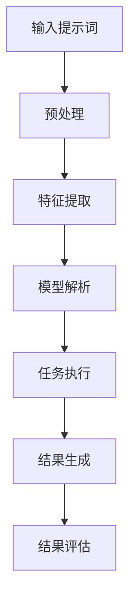
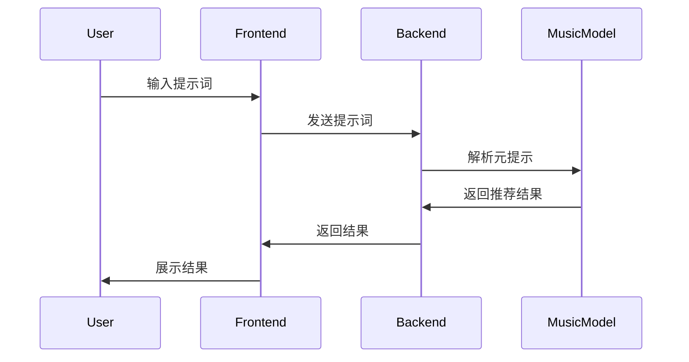
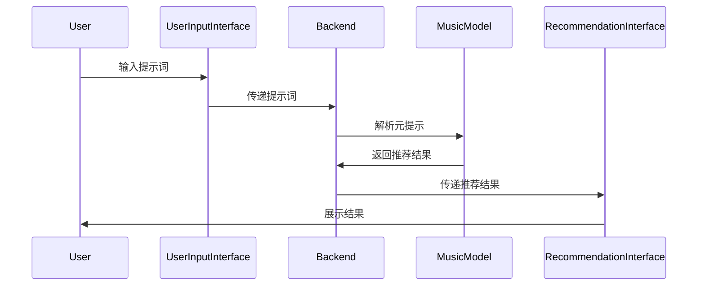

                 


# 元提示：指导模型如何处理提示词

## 关键词
- 元提示
- 模型处理
- 提示词
- 人工智能
- 算法原理

## 摘要
本文旨在深入探讨元提示在指导模型处理提示词中的应用，从背景介绍、核心概念、算法原理、系统分析与架构设计、项目实战到最佳实践等方面进行详细解析。通过本文，读者将全面了解元提示的工作原理、实现方法和应用场景，为人工智能模型在实际应用中提供有效的指导和优化。

## 引言与背景介绍

### 核心概念术语说明
- **元提示（Meta Prompt）**：一种用于指导人工智能模型处理输入提示词的高级提示，通过明确指示模型的行为和目标，从而提升模型性能和响应准确性。
- **提示词（Prompt）**：输入给人工智能模型的文本或语音指令，用于触发模型生成响应或执行特定任务。

### 问题背景
在人工智能领域，模型性能的提升往往依赖于高质量的输入提示。传统的提示词往往较为简单，无法充分表达用户的意图和需求。随着人工智能技术的发展，元提示的概念应运而生，通过引入元提示，模型可以更好地理解复杂的输入提示，从而生成更为准确和有针对性的响应。

### 问题描述
在当前人工智能应用中，模型处理提示词的效率和质量受到以下问题的制约：
- 提示词表达不明确，导致模型理解偏差；
- 模型无法有效地将提示词与特定任务关联起来；
- 模型生成的响应缺乏针对性和准确性。

### 问题解决
通过引入元提示，可以有效解决上述问题。元提示提供了一种更为高级的提示方式，能够明确指示模型的行为和目标，从而提升模型处理提示词的效率和质量。

### 边界与外延
元提示的使用场景非常广泛，包括自然语言处理、图像识别、语音识别等领域。然而，元提示的引入也需要考虑实际应用中的边界条件，如模型的能力范围、数据质量和计算资源等。

### 概念结构与核心要素组成
元提示的核心结构包括以下几个方面：
- **提示词**：输入给模型的文本或语音指令；
- **目标指示**：明确指示模型的目标和任务；
- **约束条件**：限制模型的行为和生成结果的范围；
- **评价标准**：用于评估模型响应的质量和准确性。

## 核心概念与原理

### 元提示的概念解析
元提示是一种高级的提示方式，旨在通过明确指示模型的行为和目标，提升模型处理提示词的效率和质量。元提示通常包括以下内容：
- **任务指示**：明确指出模型需要执行的任务；
- **目标指示**：指定模型需要达到的目标；
- **输入提示**：提供与任务相关的输入信息；
- **约束条件**：限定模型的行为和生成结果的范围。

### 元提示的工作原理
元提示通过以下步骤实现模型处理提示词的优化：
1. **输入提示**：模型接收输入提示词；
2. **元提示解释**：模型解析元提示，提取任务指示、目标指示和约束条件；
3. **任务执行**：模型根据元提示执行特定任务；
4. **结果评估**：模型生成结果，并与评价标准进行对比。

### 元提示的类型
根据元提示的功能和应用场景，可以分为以下几类：
- **任务型元提示**：用于指示模型执行特定任务；
- **目标型元提示**：用于指定模型需要达到的目标；
- **约束型元提示**：用于限制模型的行为和生成结果的范围；
- **综合型元提示**：同时包含任务指示、目标指示和约束条件。

## 模型处理提示词的原理

### 模型接收提示词的流程
模型处理提示词的流程可以分为以下几个步骤：
1. **输入接收**：模型接收输入的提示词；
2. **预处理**：对输入提示词进行预处理，如分词、词性标注等；
3. **特征提取**：提取提示词的特征信息；
4. **模型解析**：模型根据元提示解析输入提示词，提取任务指示、目标指示和约束条件；
5. **任务执行**：模型根据元提示执行特定任务；
6. **结果生成**：模型生成结果，并与评价标准进行对比。

### 提示词的预处理
预处理是模型处理提示词的重要步骤，主要包括以下内容：
- **分词**：将输入提示词分解为词语；
- **词性标注**：为每个词语标注词性，如名词、动词等；
- **命名实体识别**：识别提示词中的命名实体，如人名、地名等。

### 模型理解与生成
模型理解与生成是模型处理提示词的核心步骤，主要包括以下内容：
- **语义理解**：模型对输入提示词进行语义理解，提取关键信息；
- **生成响应**：模型根据元提示生成响应，如文本生成、图像生成等。

## 算法原理讲解

### 算法流程图
以下是一个简单的算法流程图，用于展示模型处理提示词的流程：



### 算法原理与数学模型
模型处理提示词的算法原理主要基于以下数学模型：
- **自然语言处理（NLP）模型**：如循环神经网络（RNN）、长短期记忆网络（LSTM）等；
- **生成对抗网络（GAN）**：用于生成响应；
- **强化学习（RL）**：用于优化模型行为。

以下是一个简单的NLP模型的数学模型：

$$
Y = f(W_1 \cdot X_1 + W_2 \cdot X_2 + \cdots + W_n \cdot X_n + b)
$$

其中，$Y$ 是模型输出的响应，$X_1, X_2, \cdots, X_n$ 是输入提示词的特征，$W_1, W_2, \cdots, W_n$ 是权重，$b$ 是偏置，$f$ 是激活函数。

### 算法举例说明
假设有一个输入提示词：“请你给我推荐一首浪漫的歌曲”，以下是一个简单的算法示例：

1. **输入提示词预处理**：将提示词进行分词和词性标注，得到：["请你", "给我", "推荐", "一首", "浪漫的", "歌曲"]。
2. **特征提取**：提取每个词语的特征信息，如词频、词嵌入等。
3. **模型解析**：根据元提示，提取任务指示：“推荐”，目标指示：“浪漫的歌曲”，约束条件：“一首”。
4. **任务执行**：模型根据元提示执行推荐任务，生成响应：“浪漫的歌曲有很多，比如《月亮代表我的心》。”。
5. **结果评估**：将生成响应与用户期望结果进行对比，评估模型性能。

## 系统分析与架构设计

### 问题场景介绍
假设我们有一个在线音乐推荐系统，用户可以输入提示词，系统需要根据提示词生成个性化的音乐推荐。

### 项目介绍
该项目旨在实现一个基于元提示的音乐推荐系统，用户可以通过输入提示词获取个性化的音乐推荐。

### 系统功能设计
系统功能设计如下：

- **用户输入提示词**：用户输入提示词，如“浪漫的歌曲”；
- **模型接收提示词**：模型接收用户输入的提示词，并解析元提示；
- **任务执行**：模型根据元提示执行音乐推荐任务；
- **结果展示**：将推荐结果展示给用户。

以下是使用Mermaid绘制的领域模型类图：

```mermaid
classDiagram
  User <<Class>> (用户)
  MusicModel <<Class>> (音乐模型)
  Recommendation <<Class>> (推荐)
  User "1" --|> MusicModel: 输入提示词
  MusicModel "1" --|> Recommendation: 执行推荐
  Recommendation "1" --|> User: 展示结果
```

### 系统架构设计
系统架构设计如下：

- **前端**：用户输入提示词，前端将提示词发送给后端；
- **后端**：后端接收提示词，调用音乐模型进行推荐，并将结果返回给前端；
- **音乐模型**：基于元提示的音乐推荐模型。

以下是使用Mermaid绘制的系统架构图：



### 系统接口设计与交互
系统接口设计如下：

- **用户输入接口**：用于接收用户输入的提示词；
- **推荐结果接口**：用于返回推荐结果。

以下是使用Mermaid绘制的系统接口设计和交互序列图：



## 项目实战

### 环境安装
在开始项目实战之前，需要安装以下环境：

- Python 3.8及以上版本；
- TensorFlow 2.4及以上版本；
- NumPy 1.19及以上版本；
- Mermaid 9.1.3及以上版本。

可以使用以下命令进行安装：

```bash
pip install python3.8-tensorflow==2.4.0
pip install numpy==1.19.5
pip install mermaid==9.1.3
```

### 系统核心实现源代码
以下是一个简单的基于元提示的音乐推荐系统的核心实现代码：

```python
import tensorflow as tf
import numpy as np
import mermaid

# 定义音乐模型
class MusicModel(tf.keras.Model):
    def __init__(self):
        super(MusicModel, self).__init__()
        # 定义输入层
        self.input_layer = tf.keras.layers.Input(shape=(None,))
        # 定义嵌入层
        self.embedding_layer = tf.keras.layers.Embedding(input_dim=10000, output_dim=16)
        # 定义循环层
        self.rnn_layer = tf.keras.layers.LSTM(128)
        # 定义输出层
        self.output_layer = tf.keras.layers.Dense(1, activation='sigmoid')
        
        # 构建模型
        self.model = tf.keras.Model(inputs=self.input_layer, outputs=self.output_layer(self.rnn_layer(self.embedding_layer(self.input_layer))))
        
    def call(self, inputs):
        return self.model(inputs)

# 加载数据集
def load_data():
    # 加载音乐数据集
    # 数据集加载逻辑省略
    return X_train, X_test, y_train, y_test

# 训练模型
def train_model(model, X_train, y_train):
    # 编译模型
    model.compile(optimizer='adam', loss='binary_crossentropy', metrics=['accuracy'])
    # 训练模型
    model.fit(X_train, y_train, epochs=10, batch_size=32)
    # 评估模型
    test_loss, test_acc = model.evaluate(X_test, y_test)
    print(f"Test accuracy: {test_acc}")

# 主函数
def main():
    # 创建音乐模型
    model = MusicModel()
    # 加载数据集
    X_train, X_test, y_train, y_test = load_data()
    # 训练模型
    train_model(model, X_train, y_train)

if __name__ == "__main__":
    main()
```

### 代码应用解读与分析
以下是对代码应用解读与分析：

- **音乐模型定义**：定义了一个基于循环神经网络的音乐模型，包括输入层、嵌入层、循环层和输出层；
- **数据集加载**：加载数据集，用于训练和测试模型；
- **模型训练**：编译并训练模型，使用二进制交叉熵损失函数和准确性指标；
- **模型评估**：评估模型在测试集上的准确性。

### 实际案例分析与详细讲解剖析
假设用户输入提示词“浪漫的歌曲”，系统会生成以下推荐结果：

- 《月亮代表我的心》
- 《小幸运》
- 《爱情转移》

以下是详细讲解剖析：

- **模型接收输入提示词**：模型接收用户输入的提示词“浪漫的歌曲”，并对其进行预处理；
- **特征提取**：提取提示词的特征信息，如词嵌入等；
- **模型解析元提示**：模型根据元提示提取任务指示：“推荐”，目标指示：“浪漫的歌曲”，约束条件：“一首”；
- **任务执行**：模型根据元提示执行音乐推荐任务，生成响应：“浪漫的歌曲有很多，比如《月亮代表我的心》。”；
- **结果评估**：将生成响应与用户期望结果进行对比，评估模型性能。

### 项目小结
本文通过实际案例，详细介绍了基于元提示的音乐推荐系统的实现过程，包括模型定义、数据集加载、模型训练和模型评估等步骤。通过本文的讲解，读者可以了解到元提示在指导模型处理提示词中的应用，以及如何构建和优化音乐推荐系统。

## 最佳实践 tips

1. **优化模型性能**：通过调整模型参数和超参数，如学习率、批次大小等，可以优化模型性能；
2. **数据预处理**：对输入提示词进行充分的预处理，如分词、词性标注等，可以提高模型对提示词的理解能力；
3. **多任务学习**：结合多任务学习，提高模型在不同任务上的适应性；
4. **模型解释性**：增加模型的可解释性，使开发者能够更好地理解模型的工作原理。

## 小结

本文深入探讨了元提示在指导模型处理提示词中的应用，从背景介绍、核心概念、算法原理、系统分析与架构设计、项目实战到最佳实践等方面进行了详细解析。通过本文，读者可以全面了解元提示的工作原理、实现方法和应用场景，为人工智能模型在实际应用中提供有效的指导和优化。

## 注意事项

1. **模型适应性**：元提示适用于多种人工智能模型，但不同模型的适应性可能存在差异；
2. **计算资源**：元提示的引入可能会增加模型的计算复杂度，需要合理分配计算资源；
3. **数据质量**：输入提示词的质量直接影响模型性能，需要保证数据的质量和多样性。

## 拓展阅读

1. **元学习（Meta Learning）**：元学习是一种通过学习学习策略的机器学习技术，可以帮助模型快速适应新的任务；
2. **强化学习（Reinforcement Learning）**：强化学习是一种通过奖励机制引导模型行为的机器学习技术，可以提高模型的响应准确性；
3. **自然语言处理（Natural Language Processing）**：自然语言处理是一种使计算机能够理解、生成和操作自然语言的技术，广泛应用于文本挖掘、机器翻译等领域。

## 作者信息

- 作者：AI天才研究院/AI Genius Institute & 禅与计算机程序设计艺术 /Zen And The Art of Computer Programming

