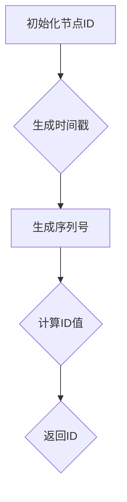
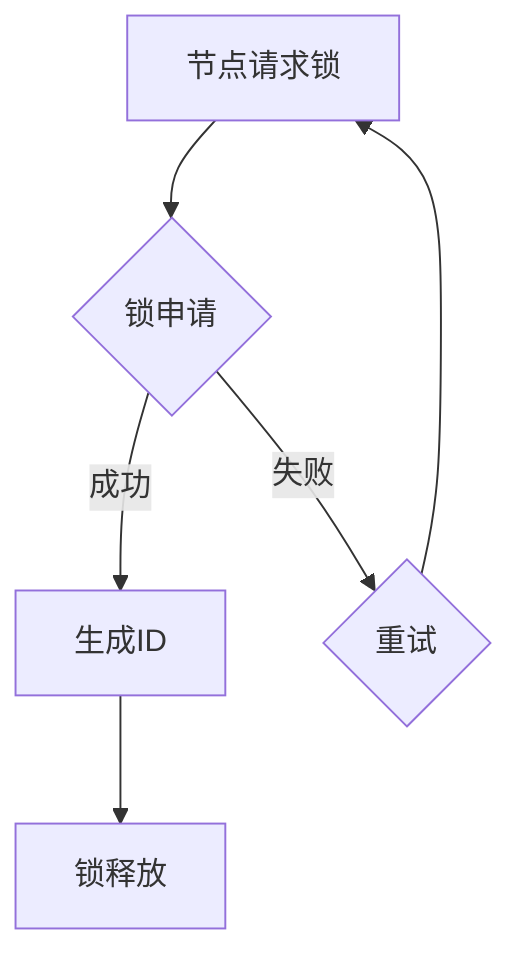
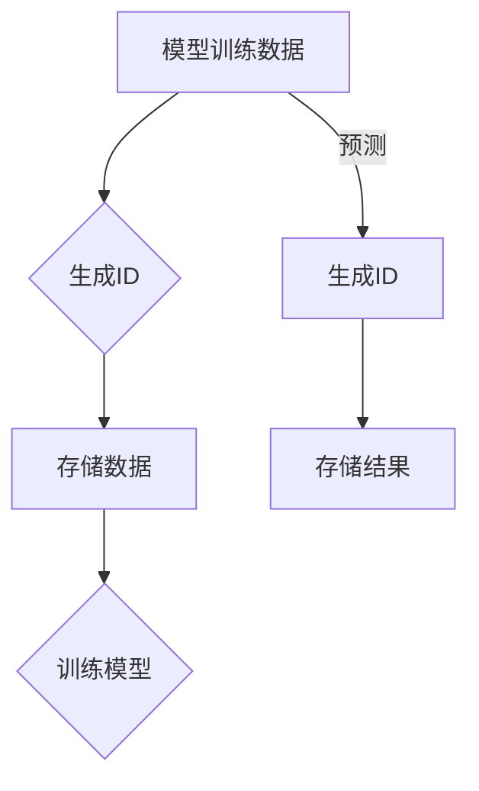
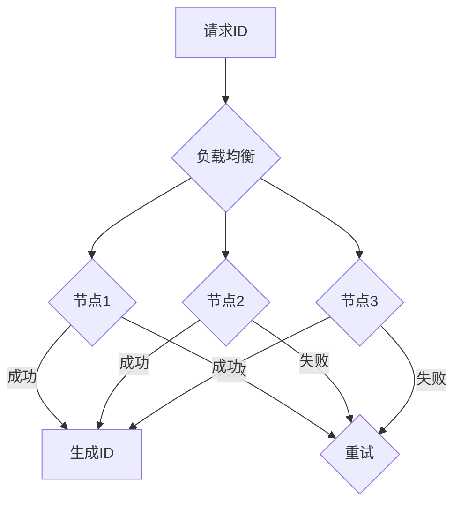

                 

## 文章标题：分布式ID生成器在大规模LLM应用中的实现

> 关键词：分布式ID生成器、大规模LLM应用、设计原理、性能优化、最佳实践

> 摘要：本文从分布式ID生成器的基本概念出发，深入探讨了其在大规模语言模型（LLM）应用中的重要性、设计原理、核心技术以及实现方法。通过具体案例分析，总结了分布式ID生成器的最佳实践，为读者提供了实用的技术指导。

----------------------------------------------------------------

## 目录大纲

1. **分布式ID生成器基础**
   1.1 分布式ID生成器概述
   1.2 分布式ID生成器的设计原理
   1.3 分布式ID生成器的核心技术
   1.4 分布式ID生成器在LLM应用中的实现
   1.5 分布式ID生成器的性能优化
   1.6 分布式ID生成器的最佳实践
   1.7 案例研究

----------------------------------------------------------------

### 第一部分：分布式ID生成器基础

#### 第1章：分布式ID生成器概述

##### 1.1.1 分布式ID生成器的背景与重要性

在互联网时代，数据量的爆炸式增长促使我们寻求分布式系统的解决方案。分布式ID生成器作为分布式系统中的一个重要组件，其重要性不言而喻。它负责为分布式系统中的各个节点生成全局唯一的ID，从而确保数据的一致性和可追溯性。

##### 1.1.2 分布式ID生成器的基本概念

分布式ID生成器，顾名思义，是一种在分布式系统中生成全局唯一ID的机制。它与单机环境下的自增ID不同，能够在多节点环境中保证ID的唯一性。基本概念包括：

- **全局唯一性**：生成的ID在整个分布式系统中都是唯一的。
- **高性能**：能够在高并发场景下快速生成ID。
- **高可用性**：即使在部分节点故障的情况下，系统仍能正常运行。

##### 1.1.3 分布式ID生成器的应用场景

分布式ID生成器的应用场景非常广泛，主要包括以下几个方面：

- **分布式数据库**：在分布式数据库中，为数据行生成唯一的ID，确保数据的唯一性。
- **分布式消息队列**：在消息队列系统中，为消息生成唯一ID，保证消息的顺序性和可追溯性。
- **分布式缓存**：在分布式缓存系统中，为缓存项生成唯一ID，便于管理缓存数据。

##### 1.1.4 问题背景与问题描述

随着大数据和云计算的兴起，分布式系统变得愈发重要。然而，传统的单机ID生成方案已无法满足大规模分布式系统的需求。分布式ID生成器应运而生，旨在解决以下问题：

- **ID冲突**：在多节点环境中，如何避免ID生成时的冲突。
- **性能瓶颈**：在并发量大时，如何快速生成ID。
- **系统可用性**：在部分节点故障时，如何保证系统仍能正常运行。

##### 1.1.5 问题解决与边界与外延

分布式ID生成器通过多种技术手段解决了上述问题，例如：

- **数据一致性**：使用分布式锁、缓存等技术保证数据的一致性。
- **负载均衡**：通过负载均衡策略，将请求均匀分布到各个节点。
- **容错机制**：在部分节点故障时，通过冗余设计确保系统可用性。

然而，分布式ID生成器也存在一定的边界和限制，如：

- **性能瓶颈**：在高并发场景下，仍可能存在性能瓶颈。
- **系统复杂度**：分布式系统的设计和维护相对复杂。

##### 1.1.6 概念结构与核心要素组成

分布式ID生成器的概念结构包括以下几个方面：

- **ID生成算法**：核心算法，负责生成全局唯一的ID。
- **分布式锁机制**：确保ID生成过程的原子性和一致性。
- **缓存技术**：提高ID生成的性能。
- **负载均衡与容错机制**：确保系统的可用性和稳定性。

#### 第2章：分布式ID生成器的设计原理

##### 2.1.1 设计目标

分布式ID生成器的设计目标主要包括：

- **全局唯一性**：保证生成的ID在整个系统中唯一。
- **高性能**：在高并发场景下快速生成ID。
- **高可用性**：在部分节点故障时，系统仍能正常运行。
- **易扩展性**：支持系统规模的扩展。

##### 2.1.2 关键组件

分布式ID生成器的关键组件包括：

- **ID生成模块**：负责生成全局唯一的ID。
- **分布式锁模块**：确保ID生成过程的原子性和一致性。
- **缓存模块**：提高ID生成的性能。
- **负载均衡模块**：实现请求的均匀分布。

##### 2.1.3 生成算法

分布式ID生成器常用的生成算法包括：

- **自增算法**：基于数据库自增序列生成ID。
- **雪花算法**：基于时间戳、节点ID和序列号生成ID。
- **UUID算法**：生成128位唯一的UUID。

##### 2.1.4 算法原理讲解

以雪花算法为例，其原理如下：

1. **时间戳**：使用当前时间的毫秒数作为ID的一部分，确保全局唯一性。
2. **节点ID**：使用节点ID作为ID的一部分，区分不同节点生成的ID。
3. **序列号**：使用序列号作为ID的一部分，确保同一节点连续生成的ID也唯一。

##### 2.1.5 数学模型与公式

雪花算法的数学模型如下：

$$
ID = (timestamp\_ms \& 0xFFFFFFFF) \times 1000000000 + (node\_id \& 0xFFFFFF) \times 10000 + (sequence \& 0xFFFFFF)
$$

其中，$timestamp\_ms$ 为时间戳，$node\_id$ 为节点ID，$sequence$ 为序列号。

##### 2.1.6 Mermaid流程图

#### 第3章：分布式ID生成器的核心技术

##### 3.1.1 数据库序列号生成

数据库序列号生成是分布式ID生成器的一种实现方式。其原理如下：

- **创建序列号表**：在数据库中创建一个序列号表，用于存储生成的ID。
- **自增生成ID**：每次生成ID时，从序列号表中读取一个自增值作为ID。

##### 3.1.2 高位缓存技术

高位缓存技术用于提高ID生成的性能。其原理如下：

- **缓存低位ID**：在内存中缓存一部分低位ID，减少对数据库的访问。
- **动态更新缓存**：根据生成ID的频率和热点数据，动态调整缓存策略。

##### 3.1.3 分布式锁机制

分布式锁机制用于确保ID生成过程的原子性和一致性。其原理如下：

- **锁标识**：为每个节点分配一个唯一的锁标识。
- **锁申请**：在生成ID时，节点需要申请锁标识。
- **锁释放**：生成ID后，释放锁标识。

##### 3.1.4 Mermaid流程图

#### 第4章：分布式ID生成器在LLM应用中的实现

##### 4.1.1 LLM应用场景与ID生成需求

在大规模语言模型（LLM）应用中，分布式ID生成器主要用于以下场景：

- **模型训练数据管理**：为训练数据生成唯一ID，便于数据管理和追踪。
- **模型预测结果管理**：为预测结果生成唯一ID，便于结果存储和统计。
- **模型版本管理**：为不同版本的模型生成唯一ID，便于模型管理和更新。

##### 4.1.2 分布式ID生成器在LLM中的集成

在LLM应用中，分布式ID生成器可以通过以下步骤集成：

1. **配置ID生成策略**：根据应用需求，配置合适的ID生成策略。
2. **集成ID生成模块**：将分布式ID生成模块集成到LLM应用中。
3. **统一ID生成接口**：为应用提供统一的ID生成接口，便于调用。

##### 4.1.3 LLM应用中的ID生成策略

在LLM应用中，常用的ID生成策略包括：

- **自增策略**：适用于数据量较小、生成速度要求不高的场景。
- **雪花策略**：适用于数据量大、生成速度快、全局唯一性的场景。
- **UUID策略**：适用于对ID唯一性要求极高的场景。

##### 4.1.4 Mermaid流程图

#### 第5章：分布式ID生成器的性能优化

##### 5.1.1 性能优化目标

分布式ID生成器的性能优化目标主要包括：

- **提高ID生成速度**：减少ID生成的延迟。
- **提高系统吞吐量**：增加系统处理请求的能力。
- **降低系统资源消耗**：减少系统资源的占用。

##### 5.1.2 数据一致性保证

数据一致性保证是分布式ID生成器性能优化的重要方面。常用的方法包括：

- **分布式锁机制**：确保ID生成过程的原子性和一致性。
- **缓存一致性**：保证缓存中的数据与数据库中的数据一致。

##### 5.1.3 负载均衡与容错机制

负载均衡与容错机制是分布式ID生成器性能优化的重要组成部分。常用的方法包括：

- **负载均衡**：通过负载均衡策略，将请求均匀分布到各个节点。
- **容错机制**：通过冗余设计，确保系统在部分节点故障时仍能正常运行。

##### 5.1.4 Mermaid流程图

#### 第6章：分布式ID生成器的最佳实践

##### 6.1.1 系统设计最佳实践

分布式ID生成器的系统设计最佳实践包括：

- **模块化设计**：将ID生成器拆分为多个模块，便于维护和扩展。
- **配置化**：通过配置文件或参数化方式，灵活调整ID生成器的行为。
- **监控与日志**：实时监控ID生成器的性能和状态，方便问题排查。

##### 6.1.2 运维监控最佳实践

分布式ID生成器的运维监控最佳实践包括：

- **监控指标**：设置关键监控指标，如生成速度、吞吐量、错误率等。
- **报警机制**：当监控指标异常时，自动触发报警，便于快速响应。
- **日志分析**：定期分析日志，发现潜在问题并优化系统。

##### 6.1.3 安全性与稳定性保障

分布式ID生成器的安全性与稳定性保障包括：

- **访问控制**：限制对ID生成器的访问权限，防止未授权访问。
- **数据备份**：定期备份数据，确保数据不丢失。
- **故障恢复**：在节点故障时，快速切换到备用节点，确保系统稳定性。

#### 第7章：案例研究

##### 7.1.1 某大型互联网公司的分布式ID生成器实践

某大型互联网公司在其分布式系统中采用分布式ID生成器，实现了以下效果：

- **高性能**：ID生成速度达到每秒数百万次，满足大规模并发需求。
- **高可用性**：通过负载均衡和容错机制，实现系统稳定运行。
- **高一致性**：通过分布式锁和缓存技术，确保数据一致性。

##### 7.1.2 某人工智能初创公司的分布式ID生成器实践

某人工智能初创公司在其AI模型训练系统中采用分布式ID生成器，实现了以下效果：

- **高效的数据管理**：通过ID生成器，实现对大规模训练数据的统一管理。
- **灵活的ID生成策略**：根据业务需求，灵活调整ID生成策略。
- **稳定的系统运行**：通过负载均衡和容错机制，确保系统稳定运行。

##### 7.1.3 案例分析与总结

通过以上案例，可以看出分布式ID生成器在互联网和人工智能领域的广泛应用。其核心在于：

- **高性能**：满足大规模并发需求。
- **高可用性**：确保系统稳定运行。
- **高一致性**：保证数据一致性。

同时，分布式ID生成器的最佳实践为实际应用提供了宝贵的经验。

## 结束

作者：AI天才研究院/AI Genius Institute & 禅与计算机程序设计艺术 /Zen And The Art of Computer Programming

本文全面介绍了分布式ID生成器在大规模LLM应用中的实现。从基本概念、设计原理、核心技术到实际应用，本文为读者提供了系统的技术指导。同时，通过案例研究，总结了分布式ID生成器的最佳实践，为读者提供了实用的经验。希望本文能为您的分布式系统开发提供有益的启示。感谢您的阅读！

