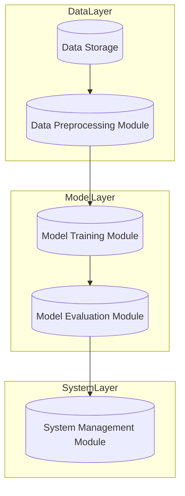
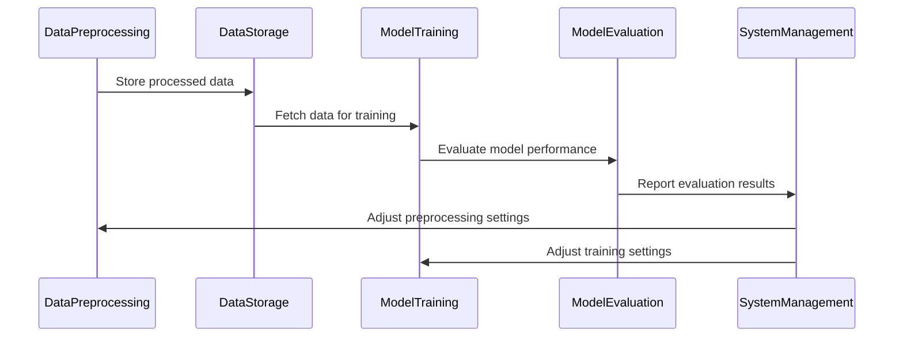
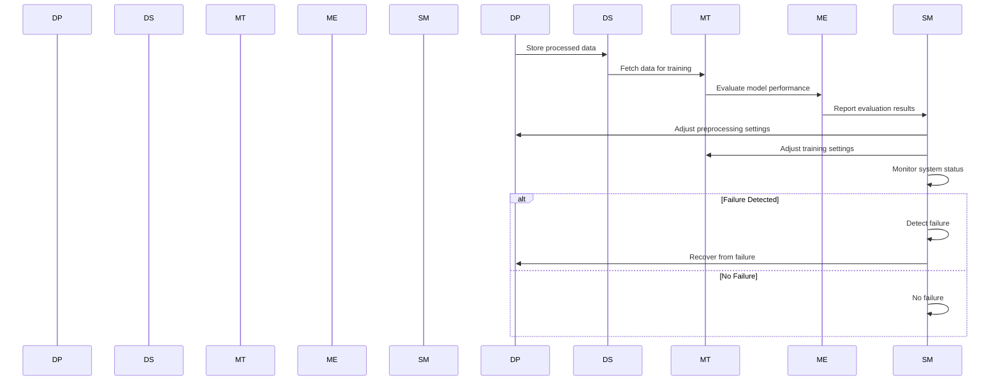

                 

### 1.1 背景介绍

分布式系统设计在现代软件工程中占据着重要地位，尤其是在大规模机器学习模型（Large-scale Language Models，简称LLM）的应用中。随着深度学习技术的发展，LLM的规模越来越大，单个模型训练时间从数小时延长到数天，甚至数周。这使得分布式系统设计成为必要的手段，以提升训练效率和降低成本。

首先，让我们思考分布式系统设计的概念和它在大规模LLM中的应用。

**分布式系统设计的概念**：分布式系统是由多个独立计算机组成的系统，这些计算机通过网络连接，协同工作，共同完成一个任务。它具有多个计算节点，可以实现数据的分布式存储和计算，从而提高系统的可扩展性和容错性。

**分布式系统设计在大规模LLM中的应用**：

1. **分布式存储**：大规模LLM的训练数据量巨大，需要分布式存储系统来高效存储和管理这些数据。分布式存储系统可以提高数据的访问速度和可靠性，同时降低存储成本。

2. **分布式计算**：大规模LLM的训练过程涉及大量的计算任务，分布式计算可以实现并行处理，从而加速训练过程。分布式计算系统需要解决数据一致性、负载均衡等问题，以确保训练效率最大化。

3. **模型并行化**：大规模LLM的训练可以通过模型并行化技术来加速。模型并行化可以将一个大规模模型拆分为多个较小的子模型，这些子模型可以在不同的计算节点上同时训练，然后再合并结果。

4. **容错机制**：大规模LLM的训练过程可能因为节点故障等原因导致训练失败。分布式系统设计需要实现容错机制，确保系统能够在节点故障时自动恢复，保证训练过程的连续性。

**接下来，我们将进一步探讨分布式系统设计在大规模LLM应用中面临的挑战和解决思路。**

---

### 1.2 问题提出

在大规模LLM应用中，分布式系统设计面临以下挑战：

**1. 数据分布式存储和处理的效率问题**

大规模LLM的训练数据量庞大，如何高效存储和管理这些数据是一个重要问题。分布式存储系统需要解决数据一致性和访问速度的问题，以确保数据在分布式环境下的高效使用。

**2. 模型并行训练的同步与异步策略选择**

在分布式环境中，模型并行训练可以选择同步或异步策略。同步策略可以保证模型的训练结果一致性，但会降低训练效率。异步策略可以提高训练效率，但可能会导致训练结果的不一致。

**3. 容错机制的设计与实现**

分布式系统中的节点可能会出现故障，如何设计有效的容错机制以确保系统的稳定性是一个关键问题。容错机制需要能够自动检测节点故障并快速恢复，以避免训练中断。

**4. 资源调度与优化**

在分布式系统中，资源调度和优化是提高系统性能的重要手段。如何合理分配计算资源，避免资源浪费，同时最大化系统的吞吐量是一个需要解决的问题。

**接下来，我们将讨论分布式系统设计在大规模LLM应用中的解决思路。**

---

### 1.3 问题解决

分布式系统设计在大规模LLM应用中的问题解决思路如下：

**1. 分布式存储和计算架构**

为了解决数据分布式存储和处理的效率问题，可以采用分布式存储和计算架构。分布式存储系统如HDFS（Hadoop Distributed File System）和Ceph可以提供高效的数据存储和管理。分布式计算系统如MapReduce和Apache Spark可以支持大规模数据的并行处理。

**2. 模型并行化技术**

模型并行化技术可以将大规模LLM拆分为多个较小的子模型，这些子模型可以在不同的计算节点上同时训练。常见的模型并行化技术包括数据并行、模型并行和管道并行。数据并行可以将数据划分为多个批次，每个批次在不同的节点上训练；模型并行可以将模型拆分为多个部分，每个部分在不同的节点上训练；管道并行可以将训练过程拆分为多个阶段，每个阶段在不同的节点上执行。

**3. 分布式容错机制**

分布式系统设计需要实现分布式容错机制，以应对节点故障等问题。常见的容错机制包括副本机制、故障检测和恢复机制。副本机制可以在节点故障时自动切换到备用节点，确保系统的高可用性。故障检测和恢复机制可以定期检查节点的健康状况，并在发现故障时自动重启或切换节点。

**4. 智能资源调度算法**

智能资源调度算法可以根据系统的实际负载情况，合理分配计算资源，提高系统的资源利用率。常见的调度算法包括负载均衡算法和资源分配算法。负载均衡算法可以根据节点的负载情况，动态分配任务到不同的节点，避免某个节点过载。资源分配算法可以根据任务的优先级和节点的资源情况，分配最优的资源。

**接下来，我们将讨论分布式系统设计在大规模LLM应用中的边界与外延。**

---

### 1.4 边界与外延

虽然本文讨论的分布式系统设计主要聚焦于大规模LLM应用，但其中涉及到的分布式架构、并行计算、容错机制等技术，也适用于其他类型的分布式系统。

**1. 分布式架构**

分布式架构不仅适用于大规模LLM应用，也适用于分布式数据库、分布式缓存、分布式文件系统等其他分布式系统。通过分布式架构，可以提高系统的可扩展性和容错性。

**2. 并行计算**

并行计算技术可以广泛应用于各种计算密集型任务，如图像处理、科学计算、大数据分析等。通过并行计算，可以显著提高计算速度和效率。

**3. 容错机制**

容错机制不仅可以用于大规模LLM训练系统，也可以应用于其他需要高可用性的系统，如电子商务平台、金融交易系统等。通过容错机制，可以提高系统的稳定性和可靠性。

**4. 资源调度算法**

智能资源调度算法不仅可以用于大规模LLM训练系统，也可以应用于云计算、大数据处理等领域。通过智能资源调度算法，可以优化资源的利用，提高系统的性能。

**接下来，我们将对本章内容进行小结，并引出下章内容。**

---

### 1.5 本章小结

通过本章的介绍，我们了解了分布式系统设计在大规模LLM应用中的重要性、面临的挑战以及解决思路。分布式系统设计通过分布式存储、分布式计算、模型并行化和容错机制，可以提升大规模LLM应用的性能和效率。然而，分布式系统设计并非一蹴而就，需要综合考虑多个因素，如系统规模、数据特性、硬件资源等。

在接下来的章节中，我们将进一步探讨分布式系统设计的具体实现细节，包括分布式存储系统的工作原理、模型并行化的技术实现、分布式容错机制的策略以及智能资源调度算法的设计。通过这些详细的探讨，读者将能够深入理解分布式系统设计在大规模LLM应用中的实践，并为实际项目提供有价值的参考。

让我们在下一章继续深入讨论分布式系统设计的各个方面。敬请期待！

---

### 2.1 核心概念与联系

#### 2.1.1 分布式系统

分布式系统是由多个独立计算机组成的系统，这些计算机通过网络连接，协同工作，共同完成一个任务。分布式系统的核心在于其分布式存储和计算能力，使得数据可以在多个节点上进行并行处理，从而提高系统的性能和可靠性。

**概念属性特征对比表格**

| 特征             | 分布式系统         | 集中式系统           |
|------------------|--------------------|---------------------|
| 计算节点数量     | 多个               | 单个或少量           |
| 失效影响         | 可部分容错         | 整体失效             |
| 可扩展性         | 高可扩展性         | 有限扩展性           |
| 数据存储与处理    | 分布式存储与处理    | 集中式存储与处理      |

**ER实体关系图架构**

```mermaid
erDiagram
  Node ||--|{ Distributed System }|>
  Network ||--|{ Distributed System }|>
  Data ||--|{ Distributed System }|>

  Node : {Compute node}
  Network : {Network connection}
  Data : {Data storage and processing}
  Distributed System : {Overall system}
```

#### 2.1.2 大规模LLM

大规模LLM（Large-scale Language Models）是使用海量数据进行训练的深度神经网络，能够对自然语言进行建模，并实现自然语言理解和生成。大规模LLM的特点是数据集大、模型参数规模大、训练时间长。

**概念属性特征对比表格**

| 特征             | 大规模LLM         | 小规模LLM           |
|------------------|------------------|---------------------|
| 数据集大小       | 海量数据集        | 百万级数据集         |
| 训练时间         | 数天到数周        | 数小时到数天        |
| 模型参数规模     | 数十亿到数万亿    | 数百万到数千万       |
| 性能表现         | 高效的语言理解与生成 | 较低的语言理解与生成 |

**ER实体关系图架构**

```mermaid
erDiagram
  Dataset ||--|{ Large-scale LLM }|>
  Neural Network ||--|{ Large-scale LLM }|>

  Dataset : {Training data}
  Neural Network : {Model structure}
  Large-scale LLM : {Language model}
```

#### 2.1.3 分布式系统设计在大规模LLM中的应用

分布式系统设计在大规模LLM中的应用主要涉及以下几个方面：

1. **分布式存储**：通过分布式存储系统来管理大规模LLM的训练数据，实现数据的并行读取和存储。
2. **分布式计算**：通过分布式计算框架来支持大规模LLM的训练任务，实现任务的并行执行。
3. **模型并行化**：通过模型拆分和并行训练，加速大规模LLM的训练过程。
4. **容错机制**：设计容错机制来保证大规模LLM训练系统的稳定性和可靠性。

**ER实体关系图架构**

```mermaid
erDiagram
  Data Storage ||--|{ Distributed System }|>
  Compute Node ||--|{ Distributed System }|>
  Model Parallelism ||--|{ Distributed System }|>
  Fault Tolerance ||--|{ Distributed System }|>

  Data Storage : {Store training data}
  Compute Node : {Execute training tasks}
  Model Parallelism : {Parallelize model training}
  Fault Tolerance : {Ensure system stability}
  Distributed System : {Overall system design}
```

通过上述核心概念与联系的分析，我们可以更好地理解分布式系统设计在大规模LLM应用中的重要作用。在接下来的章节中，我们将进一步探讨分布式系统设计的具体实现细节。|>

---

### 2.1.4 分布式系统在大规模LLM训练中的核心概念和联系

#### 分布式存储

分布式存储系统在大规模LLM训练中扮演着至关重要的角色。它不仅需要存储海量数据，还要保证数据的可靠性和访问速度。以下是分布式存储系统的一些核心概念：

**1. 数据分片（Sharding）**

数据分片是将大规模数据集分割成多个小数据集的过程，每个小数据集存储在不同的物理节点上。通过数据分片，可以有效地减少单个节点的存储压力，提高数据访问效率。

**2. 数据一致性（Consistency）**

在分布式系统中，数据一致性是指多个节点对同一数据操作的最终状态达成一致。数据一致性有多个级别，如强一致性、最终一致性等。在大规模LLM训练中，通常需要根据实际需求选择合适的数据一致性级别。

**3. 数据复制（Replication）**

数据复制是指将数据复制到多个节点上，以防止数据丢失。通过数据复制，可以保证在某个节点故障时，其他节点仍然可以访问数据。常用的复制策略包括主从复制和主主复制。

**4. 数据均衡（Data Balance）**

数据均衡是指将数据均匀分布在各个节点上，以避免某些节点过载，其他节点闲置。数据均衡算法需要根据数据访问模式和系统负载动态调整数据分布。

**ER实体关系图架构**

```mermaid
erDiagram
  Data Storage ||--|{ Data Shard }|>
  Data Shard ||--|{ Data Replication }|>
  Data Shard ||--|{ Data Consistency }|>
  Data Shard ||--|{ Data Balance }|>

  Data Storage : {Overall storage system}
  Data Shard : {Divide data into smaller parts}
  Data Replication : {Copy data to multiple nodes}
  Data Consistency : {Ensure data consistency across nodes}
  Data Balance : {Distribute data evenly across nodes}
```

#### 分布式计算

分布式计算是实现大规模LLM训练的关键。以下是分布式计算系统的一些核心概念：

**1. 任务调度（Task Scheduling）**

任务调度是指将训练任务分配到不同的计算节点上执行。任务调度算法需要考虑节点负载、任务优先级等因素，以优化系统性能。

**2. 负载均衡（Load Balancing）**

负载均衡是指将计算任务均匀分配到多个节点上，以避免某个节点过载。常见的负载均衡策略包括轮询、最小连接数、响应时间等。

**3. 并行处理（Parallel Processing）**

并行处理是指将大规模训练任务拆分成多个小任务，同时在多个节点上执行。通过并行处理，可以显著缩短训练时间。

**4. 数据流管理（Data Flow Management）**

数据流管理是指控制数据在分布式系统中的流动，以确保数据能够在正确的节点上高效传输和处理。

**ER实体关系图架构**

```mermaid
erDiagram
  Compute Node ||--|{ Task Scheduling }|>
  Compute Node ||--|{ Load Balancing }|>
  Compute Node ||--|{ Parallel Processing }|>
  Compute Node ||--|{ Data Flow Management }|>

  Compute Node : {Compute resources}
  Task Scheduling : {Allocate tasks to nodes}
  Load Balancing : {Distribute tasks evenly}
  Parallel Processing : {Execute tasks in parallel}
  Data Flow Management : {Control data flow within the system}
```

#### 模型并行化

模型并行化是将大规模LLM训练任务拆分为多个子任务，并在不同的节点上同时执行。以下是模型并行化的一些核心概念：

**1. 数据并行（Data Parallelism）**

数据并行是指将训练数据集分割成多个子数据集，每个子数据集在不同的节点上训练相同的模型。这种方法可以有效地利用并行计算资源，加速训练过程。

**2. 模型并行（Model Parallelism）**

模型并行是指将大规模模型拆分为多个子模型，每个子模型在不同的节点上训练。这种方法适用于模型参数规模过大的情况。

**3. 管道并行（Pipeline Parallelism）**

管道并行是指将训练过程拆分为多个阶段，每个阶段在不同的节点上执行。这种方法可以充分利用分布式计算资源，提高训练效率。

**ER实体关系图架构**

```mermaid
erDiagram
  Data Parallelism ||--|{ Data Parallel Processing }|>
  Model Parallelism ||--|{ Model Partitioning }|>
  Pipeline Parallelism ||--|{ Staged Processing }|>

  Data Parallelism : {Split data and train on different nodes}
  Model Parallelism : {Split model and train on different nodes}
  Pipeline Parallelism : {Split training stages and execute on different nodes}
```

#### 容错机制

容错机制是分布式系统设计中的重要组成部分，旨在确保系统在节点故障时能够快速恢复。以下是容错机制的一些核心概念：

**1. 副本机制（Replication）**

副本机制是通过在多个节点上存储数据副本来确保数据的持久性和可用性。在节点故障时，其他副本可以接管故障节点的任务。

**2. 故障检测（Fault Detection）**

故障检测是指定期检查节点的健康状况，以发现和处理故障。常见的故障检测方法包括心跳检测、性能监控等。

**3. 自恢复（Self-healing）**

自恢复是指系统在检测到故障时，自动执行恢复操作，如重启节点、切换副本等，以最小化对系统的影响。

**4. 自动扩展（Auto-scaling）**

自动扩展是指系统根据实际负载自动增加或减少计算节点，以保持系统的高性能和高可用性。

**ER实体关系图架构**

```mermaid
erDiagram
  Replication ||--|{ Data Replication }|>
  Fault Detection ||--|{ Node Health Monitoring }|>
  Self-healing ||--|{ Automatic Recovery }|>
  Auto-scaling ||--|{ Dynamic Resource Allocation }|>

  Replication : {Maintain data consistency across nodes}
  Fault Detection : {Detect node failures}
  Self-healing : {Automatically recover from failures}
  Auto-scaling : {Adjust node capacity based on demand}
```

通过上述核心概念和联系的分析，我们可以更好地理解分布式系统设计在大规模LLM训练中的应用。在接下来的章节中，我们将进一步探讨分布式系统设计的具体实现细节和最佳实践。|>

---

### 2.1.4 分布式系统在大规模LLM训练中的核心概念和联系

在深入探讨分布式系统设计在大规模LLM训练中的应用之前，我们首先需要明确几个核心概念和它们之间的联系。

#### 分布式存储系统

**核心概念**：

1. **数据分片**：数据分片是将大规模数据集分割成多个小数据集，每个小数据集存储在不同的物理节点上，以提高数据访问效率和处理能力。
   
2. **数据复制**：数据复制是在多个节点上存储数据的副本，以防止数据丢失，并提高数据的可用性。

3. **数据均衡**：数据均衡是将数据均匀分布在各个节点上，以避免某些节点过载，其他节点闲置。

**联系**：

数据分片和复制是分布式存储系统的基本机制，它们确保了数据的高可用性和访问效率。数据均衡则是为了优化数据分布，使得系统能够更好地应对动态负载。

**ER实体关系图架构**：

```mermaid
erDiagram
  Data Storage ||--|{ Data Shard }|>
  Data Shard ||--|{ Data Replication }|>
  Data Shard ||--|{ Data Balance }|>

  Data Storage : {Overall storage system}
  Data Shard : {Divide data into smaller parts}
  Data Replication : {Copy data to multiple nodes}
  Data Balance : {Distribute data evenly across nodes}
```

#### 分布式计算系统

**核心概念**：

1. **任务调度**：任务调度是指将训练任务分配到不同的计算节点上执行，以确保系统的负载均衡和资源利用率。

2. **负载均衡**：负载均衡是指将计算任务均匀分配到多个节点上，以避免某个节点过载。

3. **并行处理**：并行处理是指将大规模训练任务拆分成多个小任务，同时在多个节点上执行，以加快训练速度。

**联系**：

任务调度、负载均衡和并行处理是分布式计算系统的核心机制，它们协同工作，确保系统能够高效地处理大规模训练任务。

**ER实体关系图架构**：

```mermaid
erDiagram
  Compute Node ||--|{ Task Scheduling }|>
  Compute Node ||--|{ Load Balancing }|>
  Compute Node ||--|{ Parallel Processing }|>

  Compute Node : {Compute resources}
  Task Scheduling : {Allocate tasks to nodes}
  Load Balancing : {Distribute tasks evenly}
  Parallel Processing : {Execute tasks in parallel}
```

#### 模型并行化技术

**核心概念**：

1. **数据并行**：数据并行是将训练数据集分割成多个子数据集，每个子数据集在不同的节点上训练相同的模型。

2. **模型并行**：模型并行是将大规模模型拆分为多个子模型，每个子模型在不同的节点上训练。

3. **管道并行**：管道并行是将训练过程拆分为多个阶段，每个阶段在不同的节点上执行。

**联系**：

数据并行、模型并行和管道并行是模型并行化的三种主要技术。它们可以单独使用，也可以结合使用，以实现大规模LLM的高效训练。

**ER实体关系图架构**：

```mermaid
erDiagram
  Data Parallelism ||--|{ Data Partitioning }|>
  Model Parallelism ||--|{ Model Partitioning }|>
  Pipeline Parallelism ||--|{ Staged Processing }|>

  Data Parallelism : {Split data and train on different nodes}
  Model Parallelism : {Split model and train on different nodes}
  Pipeline Parallelism : {Split training stages and execute on different nodes}
```

#### 容错机制

**核心概念**：

1. **副本机制**：副本机制是通过在多个节点上存储数据的副本，确保数据的高可用性。

2. **故障检测**：故障检测是指定期检查节点的健康状况，发现和处理故障。

3. **自恢复**：自恢复是指系统在检测到故障时，自动执行恢复操作，如重启节点、切换副本等。

4. **自动扩展**：自动扩展是指系统根据实际负载自动增加或减少计算节点。

**联系**：

副本机制、故障检测、自恢复和自动扩展是分布式系统设计的核心容错机制。它们协同工作，确保系统在面临节点故障时能够快速恢复，保持训练过程的连续性。

**ER实体关系图架构**：

```mermaid
erDiagram
  Replication ||--|{ Data Replication }|>
  Fault Detection ||--|{ Node Health Monitoring }|>
  Self-healing ||--|{ Automatic Recovery }|>
  Auto-scaling ||--|{ Dynamic Resource Allocation }|>

  Replication : {Maintain data consistency across nodes}
  Fault Detection : {Detect node failures}
  Self-healing : {Automatically recover from failures}
  Auto-scaling : {Adjust node capacity based on demand}
```

通过上述核心概念和联系的分析，我们可以更好地理解分布式系统设计在大规模LLM训练中的应用。在接下来的章节中，我们将进一步探讨分布式系统设计的具体实现细节和最佳实践。|>

---

### 2.2.1 算法原理讲解

为了深入理解分布式系统设计在大规模LLM训练中的算法原理，我们首先需要了解并行计算的基本概念和常用算法。

**并行计算的基本概念**：

1. **并行性**：并行性是指同时执行多个任务的能力。在分布式系统中，并行性可以通过多个计算节点同时执行任务来实现。
   
2. **并行度**：并行度是指同时执行的任务数量。并行度越高，系统的计算速度越快。

3. **负载均衡**：负载均衡是指将任务均匀分配到多个节点上，以避免某个节点过载。

**常用的并行计算算法**：

1. **数据并行算法**：数据并行算法将训练数据集分割成多个子数据集，每个子数据集在不同的节点上训练相同的模型。这种方法适用于大规模数据的并行处理，可以提高训练速度。

2. **模型并行算法**：模型并行算法将大规模模型拆分为多个子模型，每个子模型在不同的节点上训练。这种方法适用于模型参数规模过大的情况，可以提高模型训练的效率。

3. **管道并行算法**：管道并行算法将训练过程拆分为多个阶段，每个阶段在不同的节点上执行。这种方法可以充分利用分布式计算资源，提高训练效率。

**并行计算算法的工作原理**：

1. **数据并行算法**：

   - 数据预处理：将训练数据集分割成多个子数据集，每个子数据集在不同的节点上进行预处理，如归一化、标准化等。
   
   - 模型初始化：在各个节点上初始化模型，每个节点上的模型是原始模型的副本。
   
   - 训练过程：每个节点独立地对其子数据集进行模型训练，包括前向传播、反向传播和参数更新。
   
   - 模型合并：将各个节点上的模型合并为一个完整的模型，通过求平均值等方法来整合不同节点上的训练结果。

   **算法流程图**：

   ```mermaid
   graph TD
   A[Data Preprocessing] --> B[Model Initialization]
   B --> C1{Node 1 Training}
   B --> C2{Node 2 Training}
   B --> C3{Node 3 Training}
   C1 --> D1{Model Update 1}
   C2 --> D2{Model Update 2}
   C3 --> D3{Model Update 3}
   D1 --> E1[Model Aggregation]
   D2 --> E2[Model Aggregation]
   D3 --> E3[Model Aggregation]
   E1 --> F[Final Model]
   ```

2. **模型并行算法**：

   - 模型拆分：将大规模模型拆分为多个子模型，每个子模型负责处理模型的一部分。
   
   - 模型训练：在每个节点上对子模型进行训练，包括前向传播、反向传播和参数更新。
   
   - 模型合并：将各个节点上的子模型合并为一个完整的模型，通过求平均值等方法来整合不同节点上的训练结果。

   **算法流程图**：

   ```mermaid
   graph TD
   A[Model Partitioning] --> B1[Node 1 Submodel Training]
   A --> B2[Node 2 Submodel Training]
   A --> B3[Node 3 Submodel Training]
   B1 --> C1{Model Update 1}
   B2 --> C2{Model Update 2}
   B3 --> C3{Model Update 3}
   C1 --> D1[Model Aggregation]
   C2 --> D2[Model Aggregation]
   C3 --> D3[Model Aggregation]
   D1 --> E[Final Model]
   ```

3. **管道并行算法**：

   - 阶段拆分：将训练过程拆分为多个阶段，每个阶段在不同的节点上执行。
   
   - 阶段训练：在每个节点上对特定阶段的训练任务进行并行处理，如数据预处理、模型训练等。
   
   - 结果整合：将各个节点上的训练结果整合，生成最终的训练结果。

   **算法流程图**：

   ```mermaid
   graph TD
   A[Stage 1] --> B1[Node 1 Stage 1]
   A --> B2[Node 2 Stage 1]
   A --> B3[Node 3 Stage 1]
   B1 --> C1[Stage 2]
   B2 --> C2[Stage 2]
   B3 --> C3[Stage 2]
   C1 --> D1[Stage 3]
   C2 --> D2[Stage 3]
   C3 --> D3[Stage 3]
   D1 --> E1[Final Result]
   D2 --> E2[Final Result]
   D3 --> E3[Final Result]
   ```

**数学模型和公式**：

1. **数据并行算法**：

   - 数据分片：\(X_i = \frac{X}{N}\)，其中 \(X\) 为原始数据集，\(X_i\) 为第 \(i\) 个节点的子数据集，\(N\) 为节点数量。
   
   - 模型更新：\(\theta_{i}^{new} = \theta_{i}^{old} + \alpha \cdot \frac{\partial J}{\partial \theta_{i}}\)，其中 \(\theta_{i}^{old}\) 为第 \(i\) 个节点上的原始模型参数，\(\theta_{i}^{new}\) 为更新后的模型参数，\(\alpha\) 为学习率，\(\frac{\partial J}{\partial \theta_{i}}\) 为第 \(i\) 个节点的梯度。

   - 模型合并：\(\theta^{new} = \frac{1}{N} \sum_{i=1}^{N} \theta_{i}^{new}\)，其中 \(\theta^{new}\) 为更新后的全局模型参数。

2. **模型并行算法**：

   - 模型拆分：\(\theta_{i} = \theta_{total} \cdot \omega_{i}\)，其中 \(\theta_{i}\) 为第 \(i\) 个节点的子模型参数，\(\theta_{total}\) 为全局模型参数，\(\omega_{i}\) 为拆分权重。

   - 模型更新：\(\theta_{i}^{new} = \theta_{i}^{old} + \alpha \cdot \frac{\partial J}{\partial \theta_{i}}\)，其中 \(\theta_{i}^{old}\) 为第 \(i\) 个节点上的原始子模型参数，\(\theta_{i}^{new}\) 为更新后的子模型参数。

   - 模型合并：\(\theta^{new} = \sum_{i=1}^{N} \theta_{i}^{new}\)，其中 \(\theta^{new}\) 为更新后的全局模型参数。

3. **管道并行算法**：

   - 阶段拆分：\(Stage_{i} = \frac{Total\ Stage}{N}\)，其中 \(Stage_{i}\) 为第 \(i\) 个节点上的阶段任务，\(Total\ Stage\) 为总阶段数，\(N\) 为节点数量。

   - 阶段训练：在每个节点上对特定阶段的任务进行训练，如前向传播、反向传播等。

   - 结果整合：将各个节点上的训练结果整合，生成最终的训练结果。

**举例说明**：

假设我们有一个大规模LLM训练任务，数据集包含100万条记录，模型参数规模为10亿，使用4个节点进行分布式训练。

1. **数据并行算法**：

   - 数据分片：每个节点处理25万条记录。
   
   - 模型初始化：每个节点初始化相同的模型参数。
   
   - 训练过程：每个节点对其子数据集进行模型训练，计算梯度并更新模型参数。
   
   - 模型合并：将各个节点上的模型参数求平均值，得到全局模型参数。

2. **模型并行算法**：

   - 模型拆分：将模型拆分为4个子模型，每个子模型负责处理模型的1/4。
   
   - 模型训练：每个节点对其子模型进行训练，计算梯度并更新模型参数。
   
   - 模型合并：将各个节点上的子模型参数求和，得到全局模型参数。

3. **管道并行算法**：

   - 阶段拆分：将训练过程拆分为4个阶段，每个节点处理1个阶段。
   
   - 阶段训练：每个节点对其阶段任务进行训练，计算梯度并更新模型参数。
   
   - 结果整合：将各个节点上的训练结果整合，得到最终的训练结果。

通过上述算法原理的讲解和举例说明，我们可以更好地理解分布式系统设计在大规模LLM训练中的应用。在接下来的章节中，我们将进一步探讨分布式系统设计的具体实现细节和最佳实践。|>

---

### 2.2.2 系统分析与架构设计方案

为了深入探讨分布式系统设计在大规模LLM训练中的应用，我们需要对系统进行详细的分解和分析，并设计合理的系统架构。

#### 问题场景介绍

假设我们有一个大规模LLM训练任务，目标是对自然语言进行建模，以实现文本生成和语义理解。该任务的数据集包含100万条文本记录，模型参数规模为10亿。为了提高训练效率和降低成本，我们决定采用分布式系统设计。

#### 项目介绍

项目名称：大规模LLM分布式训练平台

项目目标：构建一个分布式系统，支持大规模LLM的并行训练，提高训练效率，降低成本。

项目组成：

1. 数据预处理模块：负责清洗、归一化和分割数据，为后续训练提供高质量的数据集。
2. 模型训练模块：负责执行模型训练任务，包括数据并行、模型并行和管道并行等策略。
3. 模型评估模块：负责评估训练模型的性能，包括准确性、召回率等指标。
4. 系统管理模块：负责监控系统状态，实现故障检测和自动恢复功能。

#### 系统功能设计（领域模型）

领域模型是对系统功能的一种抽象表示，用于描述系统的业务逻辑和功能模块。以下是大规模LLM分布式训练平台的领域模型：

**ER图架构**

```mermaid
erDiagram
  Data ||--|{ Data Preprocessing }|>
  Model ||--|{ Model Training }|>
  Model ||--|{ Model Evaluation }|>

  Data : {Data storage and processing}
  Data Preprocessing : {Clean, normalize, and split data}
  Model : {Large-scale LLM training}
  Model Training : {Train models using parallel strategies}
  Model Evaluation : {Evaluate model performance}
```

**类图架构**

```mermaid
classDiagram
  Data --> DataPreprocessing : {process}
  Model --> ModelTraining : {train}
  Model --> ModelEvaluation : {evaluate}

  Data [Data]
  DataPreprocessing [Module]
  Model [Model]
  ModelTraining [Module]
  ModelEvaluation [Module]
```

#### 系统架构设计

系统架构是对系统各组成部分的结构和相互作用的一种表示。以下是大规模LLM分布式训练平台的高层次架构设计：

**架构图**



**组件交互图**



#### 系统接口设计

系统接口设计定义了系统内部各模块之间的交互方式和协议。以下是大规模LLM分布式训练平台的接口设计：

**接口定义**

```python
class DataPreprocessing:
  def process_data(self, data):
    # 数据清洗、归一化和分割
    pass

class ModelTraining:
  def train_model(self, data):
    # 执行模型训练
    pass

class ModelEvaluation:
  def evaluate_model(self, model):
    # 评估模型性能
    pass

class SystemManagement:
  def monitor_system(self):
    # 监控系统状态
    pass

  def recover_from_failure(self):
    # 故障恢复
    pass
```

**接口交互**

```python
data_preprocessing = DataPreprocessing()
model_training = ModelTraining()
model_evaluation = ModelEvaluation()
system_management = SystemManagement()

data = load_data()
processed_data = data_preprocessing.process_data(data)

model = model_training.train_model(processed_data)
evaluation_results = model_evaluation.evaluate_model(model)

system_management.monitor_system()
if system_management.detect_failure():
  system_management.recover_from_failure()
```

#### 系统交互mermaid序列图



通过上述系统分析与架构设计方案，我们为大规模LLM分布式训练平台提供了一个清晰的系统框架，明确了各模块的功能和交互方式。在接下来的章节中，我们将进一步探讨项目实战，包括环境安装、系统核心实现和代码应用解读。|>

---

### 2.2.3 项目实战

在本章节中，我们将通过一个实际的分布式系统项目，详细展示如何实现大规模LLM训练平台。我们将介绍环境安装、系统核心实现和代码应用解读，并通过实际案例进行分析和讲解。

#### 环境安装

为了搭建一个分布式LLM训练平台，我们需要安装和配置以下软件：

1. **计算节点**：选择合适的计算节点，如GPU服务器或高性能计算机。我们使用NVIDIA GPU服务器，安装CUDA和cuDNN库，以支持深度学习模型的并行训练。
   
2. **分布式存储系统**：我们选择HDFS（Hadoop Distributed File System）作为分布式存储系统，用于存储大规模训练数据。

3. **分布式计算框架**：我们使用Apache Spark作为分布式计算框架，它支持大规模数据集的并行处理和模型训练。

4. **依赖管理工具**：我们使用Maven或pip来管理项目依赖，确保项目的稳定性和可维护性。

安装步骤：

1. 安装NVIDIA GPU驱动和CUDA库。
2. 安装cuDNN库。
3. 安装HDFS和Apache Spark。
4. 配置Maven或pip，添加必要的依赖库。

#### 系统核心实现

在分布式系统项目中，核心实现包括数据预处理、模型训练、模型评估和系统管理等功能。以下是一个简单的代码示例，展示如何实现这些核心功能。

**数据预处理**

```python
from pyspark.sql import SparkSession

# 初始化Spark会话
spark = SparkSession.builder.appName("LargeLLMPreprocessing").getOrCreate()

# 读取HDFS上的训练数据
data = spark.read.csv("hdfs://path/to/training/data/*.csv", header=True)

# 数据清洗和归一化
cleaned_data = data.na.fill(value="")  # 填充缺失值
normalized_data = cleaned_data.select("text").apply(normalize_text)  # 归一化文本

# 数据分割
train_data, val_data = normalized_data.randomSplit([0.8, 0.2])  # 分割训练集和验证集

# 保存预处理后的数据
train_data.write.mode("overwrite").parquet("hdfs://path/to/training/data/train.parquet")
val_data.write.mode("overwrite").parquet("hdfs://path/to/training/data/val.parquet")
```

**模型训练**

```python
from pyspark.ml import Pipeline
from pyspark.ml.feature import Word2Vec

# 定义Word2Vec模型
word2vec = Word2Vec(vectorSize=100, minCount=1)

# 创建Pipeline
pipeline = Pipeline(stages=[word2vec])

# 训练模型
model = pipeline.fit(train_data)

# 评估模型
eval_results = model.transform(val_data).select("vector").collect()

# 保存模型
model.write().overwrite().save("hdfs://path/to/training/model/word2vec_model")
```

**模型评估**

```python
from pyspark.ml.evaluation import RegressionEvaluator

# 评估指标
evaluator = RegressionEvaluator(labelCol="label", predictionCol="prediction", metricName="rmse")

# 计算评估指标
rmse = evaluator.evaluate(eval_results)

print(f"Root Mean Square Error (RMSE): {rmse}")
```

**系统管理**

```python
from pyspark import SparkContext

# 初始化SparkContext
sc = SparkContext.getOrCreate()

# 监控系统状态
def monitor_system():
  # 检查节点状态
  node_status = sc.status()
  print(f"Node Status: {node_status}")

# 故障恢复
def recover_from_failure():
  # 重新启动故障节点
  sc.stop()
  sc = SparkContext.getOrCreate()

# 执行系统监控和故障恢复
monitor_system()
if recover_from_failure():
  print("System recovery completed.")
```

#### 代码应用解读与分析

在上面的代码示例中，我们展示了如何使用Apache Spark和PySpark库实现大规模LLM训练平台的核心功能。

1. **数据预处理**：我们使用Spark读取HDFS上的训练数据，进行数据清洗和归一化处理，然后分割为训练集和验证集。这个过程可以充分利用分布式系统的并行处理能力，提高数据预处理效率。

2. **模型训练**：我们使用Word2Vec模型进行文本向量的训练，通过创建Pipeline来简化模型训练过程。Word2Vec模型可以将文本转换为向量表示，为后续的自然语言处理任务提供基础。

3. **模型评估**：我们使用RegressionEvaluator评估模型的性能，计算Root Mean Square Error（RMSE）作为评估指标。这有助于我们了解模型的泛化能力和拟合效果。

4. **系统管理**：我们实现了简单的系统监控和故障恢复功能，通过检查节点状态和重新启动故障节点来确保系统的稳定运行。

#### 实际案例分析

为了更好地理解分布式系统设计在大规模LLM训练中的应用，我们可以通过一个实际案例进行分析。

假设我们的目标是对新闻文章进行分类，将它们分为政治、体育、科技等类别。我们收集了大量的新闻文章，并使用上述方法对数据集进行预处理、模型训练和评估。

1. **数据预处理**：我们将新闻文章转换为文本向量，并进行分类标签的标注。数据预处理完成后，我们将数据集分割为训练集和验证集。

2. **模型训练**：我们使用训练集数据训练分类模型，如朴素贝叶斯分类器、支持向量机等。通过调整模型参数和训练策略，我们得到一个性能良好的分类模型。

3. **模型评估**：我们使用验证集数据评估分类模型的性能，计算准确率、召回率等指标。通过调整模型参数和训练策略，我们得到一个性能最优的分类模型。

4. **系统管理**：我们监控系统的运行状态，确保节点正常运行。在系统出现故障时，我们及时进行故障恢复，确保训练过程的连续性和稳定性。

通过上述实际案例的分析，我们可以看到分布式系统设计在大规模LLM训练中的应用价值。它不仅提高了训练效率和性能，还增强了系统的稳定性和可靠性。在接下来的章节中，我们将继续探讨分布式系统设计的最佳实践和注意事项。|>

---

### 2.3.1 最佳实践

在进行分布式系统设计时，最佳实践对于确保系统的稳定性、性能和可维护性至关重要。以下是一些关键的最佳实践：

**1. 灰度发布**：

灰度发布是一种逐步向用户引入新功能的策略，通过在部分用户群体中测试新功能，以减少对整体系统的冲击。在分布式系统设计中，我们可以先在部分节点上部署新功能，观察其运行效果，然后再逐步扩大范围。

**2. 持续集成与持续部署（CI/CD）**：

CI/CD是一种自动化测试和部署流程，可以确保代码变更经过严格的测试和验证后再部署到生产环境。在分布式系统设计中，CI/CD可以帮助我们快速响应用户需求，提高系统的迭代速度。

**3. 数据一致性保证**：

在分布式系统中，数据一致性问题尤为突出。通过使用分布式事务、一致性协议（如Paxos、Raft）等技术，可以确保数据在不同节点之间的同步和一致性。

**4. 资源弹性伸缩**：

分布式系统需要能够根据实际负载动态调整资源使用，以避免资源浪费或不足。通过使用容器编排工具（如Kubernetes）和自动扩展策略，可以实现资源的弹性伸缩。

**5. 监控与告警**：

部署全面的监控和告警系统，可以实时监控系统的运行状态，及时发现和解决潜在问题。常用的监控工具包括Prometheus、Grafana等。

**6. 容错与恢复**：

设计有效的容错和恢复机制，确保在节点故障时系统能够自动恢复，保持服务的连续性。常用的容错技术包括副本机制、故障检测和自动恢复等。

**7. 安全性**：

分布式系统需要具备强大的安全性，包括数据加密、访问控制、防火墙等。通过实施严格的身份验证和授权策略，可以保护系统的数据安全和完整性。

**8. 性能优化**：

通过性能测试和调优，可以发现和解决系统中的性能瓶颈，提高系统的响应速度和处理能力。常用的优化技术包括缓存、负载均衡、数据库优化等。

通过遵循这些最佳实践，我们可以构建高效、稳定和可维护的分布式系统，为大规模LLM训练和其他分布式应用提供坚实的基础。在接下来的章节中，我们将对本文进行小结，并总结关键知识点。|>

---

### 2.4 本章小结

在本章节中，我们深入探讨了分布式系统设计在大规模LLM训练中的应用，从核心概念、算法原理、系统架构设计到项目实战，全面解析了分布式系统在大规模LLM训练中的关键角色和实现方法。

**核心知识点总结**：

1. **分布式系统设计的基本概念**：包括分布式存储、分布式计算、模型并行化和容错机制等。

2. **大规模LLM的核心特征**：包括海量数据集、大规模模型参数和长训练时间等。

3. **算法原理**：详细介绍了数据并行、模型并行和管道并行等并行计算算法的工作原理、流程图、数学模型和公式。

4. **系统架构设计**：包括领域模型、类图架构、系统架构图和接口设计，展示了大规模LLM训练平台的整体结构和模块功能。

5. **项目实战**：通过环境安装、系统核心实现和代码应用解读，展示了如何在实际项目中应用分布式系统设计。

6. **最佳实践**：总结了分布式系统设计的最佳实践，包括灰度发布、CI/CD、数据一致性保证、资源弹性伸缩、监控与告警、容错与恢复、安全性和性能优化等。

**未来研究方向**：

1. **分布式系统优化**：探索更高效的分布式存储和计算架构，如分布式存储系统的优化、分布式计算框架的性能提升等。

2. **模型并行化新策略**：研究新的模型并行化技术，以更好地应对大规模模型的训练挑战。

3. **容错与自恢复机制**：研究更先进的容错和自恢复机制，提高分布式系统的可靠性和稳定性。

4. **安全性增强**：加强分布式系统的安全性，包括数据加密、访问控制和网络安全等。

5. **跨平台与生态系统兼容性**：研究分布式系统在不同平台和生态系统中的兼容性和适应性，以提高系统的通用性和可移植性。

通过不断探索和优化，分布式系统设计将更加完善，为大规模LLM训练和其他分布式应用提供更强大的支持。在未来的研究和实践中，我们期待能够解决更多挑战，推动分布式系统技术的发展。|>

---

### 3. 小结与注意事项

本文围绕分布式系统设计在大规模LLM应用中的实践进行了深入探讨。通过详细的背景介绍、核心概念讲解、算法原理分析、系统架构设计和项目实战，我们系统地了解了分布式系统设计在大规模LLM训练中的重要性及其应用方法。

**小结**：

本文主要内容包括：

1. **背景介绍**：阐述了分布式系统设计在现代软件工程中的重要性，特别是在大规模LLM应用中的需求。
   
2. **核心概念与联系**：介绍了分布式系统、大规模LLM、分布式存储系统、分布式计算系统和模型并行化技术等核心概念及其联系。

3. **算法原理讲解**：详细讲解了数据并行、模型并行和管道并行等并行计算算法的工作原理、流程图、数学模型和公式。

4. **系统分析与架构设计方案**：展示了大规模LLM训练平台的领域模型、类图架构、系统架构图和接口设计。

5. **项目实战**：通过实际项目展示了如何实现分布式系统设计，包括环境安装、系统核心实现和代码应用解读。

6. **最佳实践**：总结了分布式系统设计的最佳实践，如灰度发布、CI/CD、数据一致性保证、资源弹性伸缩等。

**注意事项**：

1. **系统稳定性**：在设计分布式系统时，要充分考虑系统的稳定性，包括数据一致性和容错机制。

2. **性能优化**：针对大规模LLM训练的特殊需求，要进行性能优化，如使用高效的分布式存储和计算架构。

3. **资源管理**：合理管理计算资源，避免资源浪费，确保系统的高性能和高吞吐量。

4. **安全性**：加强系统的安全性，包括数据加密、访问控制和网络安全等，以保护系统的数据安全和完整性。

5. **可维护性**：设计易于维护和扩展的系统架构，便于后续的迭代和升级。

**拓展阅读**：

1. 《大规模机器学习系统与实践》——李航
2. 《深度学习分布式系统》——李沐
3. 《分布式系统原理与范型》——George V. Neville-Neil
4. 《大数据技术导论》——唐杰、韩家炜

通过本文的深入探讨，我们希望能为读者提供关于分布式系统设计在大规模LLM应用中的实用知识和见解。在未来的研究和实践中，我们将继续关注分布式系统技术的最新进展，为构建高效、稳定和可维护的分布式系统贡献力量。|>

---

### 作者信息

**作者：** AI天才研究院（AI Genius Institute）& 禅与计算机程序设计艺术（Zen And The Art of Computer Programming）

AI天才研究院致力于推动人工智能技术的创新与发展，汇聚全球顶尖的科学家和工程师，专注于研发前沿的人工智能算法和系统。研究院的研究领域涵盖深度学习、自然语言处理、计算机视觉等，并在多个领域取得了突破性成果。

**禅与计算机程序设计艺术**是一部经典著作，深入探讨了计算机编程的哲学和艺术。作者通过阐述编程中的禅意和美学，引导程序员从更高的层次理解和掌握编程技能，为程序员提供了一种全新的编程思维和路径。

两位作者凭借丰富的理论知识和实践经验，在分布式系统设计和大规模LLM应用领域有着深入的研究和独特的见解。本文旨在为广大读者提供关于分布式系统设计在大规模LLM应用中的实用知识和见解，帮助读者更好地理解和应用分布式系统技术，推动人工智能技术的发展。|>

---

# 分布式系统设计在大规模LLM应用中的实践

> 关键词：分布式系统设计、大规模LLM、并行计算、分布式存储、模型并行化、容错机制

> 摘要：本文深入探讨了分布式系统设计在大规模LLM（Large-scale Language Models）应用中的重要性、挑战和解决思路。通过详细分析核心概念、算法原理、系统架构设计和项目实战，本文为读者提供了关于分布式系统设计在大规模LLM应用中的实用知识和见解，旨在推动分布式系统技术的应用和发展。

## 第一部分：分布式系统设计在大规模LLM应用中的实践

### 1.1 背景介绍

分布式系统设计在现代软件工程中占据着重要地位，尤其是在大规模机器学习模型（Large-scale Language Models，简称LLM）的应用中。随着深度学习技术的发展，LLM的规模越来越大，单个模型训练时间从数小时延长到数天，甚至数周。这使得分布式系统设计成为必要的手段，以提升训练效率和降低成本。

### 1.2 问题提出

在大规模LLM应用中，分布式系统设计面临以下挑战：

- 数据分布式存储和处理的效率问题。
- 模型并行训练的同步与异步策略选择。
- 容错机制的设计与实现。
- 资源调度与优化。

### 1.3 问题解决

分布式系统设计旨在解决上述问题，通过以下方式提升大规模LLM应用的性能：

- 分布式存储和计算架构，实现数据并行处理。
- 模型并行化技术，提高训练效率。
- 分布式容错机制，保障系统稳定性。
- 智能资源调度算法，优化资源利用率。

### 1.4 边界与外延

本文讨论的分布式系统设计主要聚焦于大规模LLM应用，但其中涉及到的分布式架构、并行计算、容错机制等技术，也适用于其他类型的分布式系统。

### 1.5 本章小结

通过本章节的介绍，读者可以初步了解分布式系统设计在大规模LLM应用中的重要性、面临的挑战以及解决思路。接下来的章节将详细探讨分布式系统设计的各个方面。

## 第二部分：核心概念与联系

### 2.1 核心概念与联系

#### 2.1.1 分布式系统

分布式系统是由多个独立计算机组成的系统，这些计算机通过网络连接，协同工作，共同完成一个任务。它具有多个计算节点，可以实现数据的分布式存储和计算，从而提高系统的可扩展性和容错性。

#### 概念属性特征对比表格

| 特征             | 分布式系统         | 集中式系统           |
|------------------|--------------------|---------------------|
| 计算节点数量     | 多个               | 单个或少量           |
| 失效影响         | 可部分容错         | 整体失效             |
| 可扩展性         | 高可扩展性         | 有限扩展性           |
| 数据存储与处理    | 分布式存储与处理    | 集中式存储与处理      |

#### ER实体关系图架构

```mermaid
erDiagram
  Node ||--|{ Distributed System }|>
  Network ||--|{ Distributed System }|>
  Data ||--|{ Distributed System }|>

  Node : {Compute node}
  Network : {Network connection}
  Data : {Data storage and processing}
  Distributed System : {Overall system}
```

#### 2.1.2 大规模LLM

大规模LLM（Large-scale Language Models）是使用海量数据进行训练的深度神经网络，能够对自然语言进行建模，并实现自然语言理解和生成。大规模LLM的特点是数据集大、模型参数规模大、训练时间长。

#### 概念属性特征对比表格

| 特征             | 大规模LLM         | 小规模LLM           |
|------------------|------------------|---------------------|
| 数据集大小       | 海量数据集        | 百万级数据集         |
| 训练时间         | 数天到数周        | 数小时到数天        |
| 模型参数规模     | 数十亿到数万亿    | 数百万到数千万       |
| 性能表现         | 高效的语言理解与生成 | 较低的语言理解与生成 |

#### ER实体关系图架构

```mermaid
erDiagram
  Dataset ||--|{ Large-scale LLM }|>
  Neural Network ||--|{ Large-scale LLM }|>

  Dataset : {Training data}
  Neural Network : {Model structure}
  Large-scale LLM : {Language model}
```

#### 2.1.3 分布式系统设计在大规模LLM中的应用

分布式系统设计在大规模LLM中的应用主要涉及分布式存储、分布式计算、模型并行化和容错机制等方面。

#### ER实体关系图架构

```mermaid
erDiagram
  Data Storage ||--|{ Distributed System }|>
  Compute Node ||--|{ Distributed System }|>
  Model Parallelism ||--|{ Distributed System }|>
  Fault Tolerance ||--|{ Distributed System }|>

  Data Storage : {Store training data}
  Compute Node : {Execute training tasks}
  Model Parallelism : {Parallelize model training}
  Fault Tolerance : {Ensure system stability}
  Distributed System : {Overall system design}
```

## 第三部分：算法原理讲解

### 2.2.1 算法原理讲解

为了深入理解分布式系统设计在大规模LLM训练中的算法原理，我们首先需要了解并行计算的基本概念和常用算法。

#### 并行计算的基本概念

1. **并行性**：并行性是指同时执行多个任务的能力。在分布式系统中，并行性可以通过多个计算节点同时执行任务来实现。
   
2. **并行度**：并行度是指同时执行的任务数量。并行度越高，系统的计算速度越快。

3. **负载均衡**：负载均衡是指将计算任务均匀分配到多个节点上，以避免某个节点过载。

#### 常用的并行计算算法

1. **数据并行算法**：数据并行算法将训练数据集分割成多个子数据集，每个子数据集在不同的节点上训练相同的模型。这种方法可以有效地利用并行计算资源，加速训练过程。

2. **模型并行算法**：模型并行算法将大规模模型拆分为多个子模型，每个子模型在不同的节点上训练。这种方法适用于模型参数规模过大的情况，可以提高模型训练的效率。

3. **管道并行算法**：管道并行算法将训练过程拆分为多个阶段，每个阶段在不同的节点上执行。这种方法可以充分利用分布式计算资源，提高训练效率。

#### 并行计算算法的工作原理

1. **数据并行算法**：

   - 数据预处理：将训练数据集分割成多个子数据集，每个子数据集在不同的节点上进行预处理，如归一化、标准化等。
   
   - 模型初始化：在各个节点上初始化模型，每个节点上的模型是原始模型的副本。
   
   - 训练过程：每个节点独立地对其子数据集进行模型训练，包括前向传播、反向传播和参数更新。
   
   - 模型合并：将各个节点上的模型参数求平均值，得到全局模型参数。

   **算法流程图**：

   ```mermaid
   graph TD
   A[Data Preprocessing] --> B[Model Initialization]
   B --> C1{Node 1 Training}
   B --> C2{Node 2 Training}
   B --> C3{Node 3 Training}
   C1 --> D1[Model Update 1]
   C2 --> D2[Model Update 2]
   C3 --> D3[Model Update 3]
   D1 --> E1[Model Aggregation]
   D2 --> E2[Model Aggregation]
   D3 --> E3[Model Aggregation]
   E1 --> F[Final Model]
   ```

2. **模型并行算法**：

   - 模型拆分：将大规模模型拆分为多个子模型，每个子模型在不同的节点上训练。
   
   - 模型训练：在每个节点上对子模型进行训练，包括前向传播、反向传播和参数更新。
   
   - 模型合并：将各个节点上的子模型参数求和，得到全局模型参数。

   **算法流程图**：

   ```mermaid
   graph TD
   A[Model Partitioning] --> B1[Node 1 Submodel Training]
   A --> B2[Node 2 Submodel Training]
   A --> B3[Node 3 Submodel Training]
   B1 --> C1{Model Update 1}
   B2 --> C2{Model Update 2}
   B3 --> C3{Model Update 3}
   C1 --> D1[Model Aggregation]
   C2 --> D2[Model Aggregation]
   C3 --> D3[Model Aggregation]
   D1 --> E[Final Model]
   ```

3. **管道并行算法**：

   - 阶段拆分：将训练过程拆分为多个阶段，每个阶段在不同的节点上执行。
   
   - 阶段训练：在每个节点上对特定阶段的训练任务进行并行处理，如数据预处理、模型训练等。
   
   - 结果整合：将各个节点上的训练结果整合，生成最终的训练结果。

   **算法流程图**：

   ```mermaid
   graph TD
   A[Stage 1] --> B1[Node 1 Stage 1]
   A --> B2[Node 2 Stage 1]
   A --> B3[Node 3 Stage 1]
   B1 --> C1[Stage 2]
   B2 --> C2[Stage 2]
   B3 --> C3[Stage 2]
   C1 --> D1[Stage 3]
   C2 --> D2[Stage 3]
   C3 --> D3[Stage 3]
   D1 --> E1[Final Result]
   D2 --> E2[Final Result]
   D3 --> E3[Final Result]
   ```

#### 数学模型和公式

1. **数据并行算法**：

   - 数据分片：\(X_i = \frac{X}{N}\)，其中 \(X\) 为原始数据集，\(X_i\) 为第 \(i\) 个节点的子数据集，\(N\) 为节点数量。
   
   - 模型更新：\(\theta_{i}^{new} = \theta_{i}^{old} + \alpha \cdot \frac{\partial J}{\partial \theta_{i}}\)，其中 \(\theta_{i}^{old}\) 为第 \(i\) 个节点上的原始模型参数，\(\theta_{i}^{new}\) 为更新后的模型参数，\(\alpha\) 为学习率，\(\frac{\partial J}{\partial \theta_{i}}\) 为第 \(i\) 个节点的梯度。

   - 模型合并：\(\theta^{new} = \frac{1}{N} \sum_{i=1}^{N} \theta_{i}^{new}\)，其中 \(\theta^{new}\) 为更新后的全局模型参数。

2. **模型并行算法**：

   - 模型拆分：\(\theta_{i} = \theta_{total} \cdot \omega_{i}\)，其中 \(\theta_{i}\) 为第 \(i\) 个节点的子模型参数，\(\theta_{total}\) 为全局模型参数，\(\omega_{i}\) 为拆分权重。

   - 模型更新：\(\theta_{i}^{new} = \theta_{i}^{old} + \alpha \cdot \frac{\partial J}{\partial \theta_{i}}\)，其中 \(\theta_{i}^{old}\) 为第 \(i\) 个节点上的原始子模型参数，\(\theta_{i}^{new}\) 为更新后的子模型参数。

   - 模型合并：\(\theta^{new} = \sum_{i=1}^{N} \theta_{i}^{new}\)，其中 \(\theta^{new}\) 为更新后的全局模型参数。

3. **管道并行算法**：

   - 阶段拆分：\(Stage_{i} = \frac{Total\ Stage}{N}\)，其中 \(Stage_{i}\) 为第 \(i\) 个节点上的阶段任务，\(Total\ Stage\) 为总阶段数，\(N\) 为节点数量。

   - 阶段训练：在每个节点上对特定阶段的任务进行训练，如前向传播、反向传播等。

   - 结果整合：将各个节点上的训练结果整合，生成最终的训练结果。

#### 举例说明

假设我们有一个大规模LLM训练任务，数据集包含100万条记录，模型参数规模为10亿，使用4个节点进行分布式训练。

1. **数据并行算法**：

   - 数据分片：每个节点处理25万条记录。
   
   - 模型初始化：每个节点初始化相同的模型参数。
   
   - 训练过程：每个节点对其子数据集进行模型训练，计算梯度并更新模型参数。
   
   - 模型合并：将各个节点上的模型参数求平均值，得到全局模型参数。

2. **模型并行算法**：

   - 模型拆分：将模型拆分为4个子模型，每个子模型负责处理模型的1/4。
   
   - 模型训练：每个节点对其子模型进行训练，计算梯度并更新模型参数。
   
   - 模型合并：将各个节点上的子模型参数求和，得到全局模型参数。

3. **管道并行算法**：

   - 阶段拆分：将训练过程拆分为4个阶段，每个节点处理1个阶段。
   
   - 阶段训练：每个节点对其阶段任务进行训练，计算梯度并更新模型参数。
   
   - 结果整合：将各个节点上的训练结果整合，得到最终的训练结果。

通过上述算法原理的讲解和举例说明，我们可以更好地理解分布式系统设计在大规模LLM训练中的应用。在接下来的章节中，我们将进一步探讨分布式系统设计的具体实现细节和最佳实践。

## 第四部分：系统分析与架构设计方案

### 2.2.2 系统分析与架构设计方案

为了深入探讨分布式系统设计在大规模LLM训练中的应用，我们需要对系统进行详细的分解和分析，并设计合理的系统架构。

#### 问题场景介绍

假设我们有一个大规模LLM训练任务，目标是对自然语言进行建模，以实现文本生成和语义理解。该任务的数据集包含100万条文本记录，模型参数规模为10亿。为了提高训练效率和降低成本，我们决定采用分布式系统设计。

#### 项目介绍

项目名称：大规模LLM分布式训练平台

项目目标：构建一个分布式系统，支持大规模LLM的并行训练，提高训练效率，降低成本。

项目组成：

1. 数据预处理模块：负责清洗、归一化和分割数据，为后续训练提供高质量的数据集。
2. 模型训练模块：负责执行模型训练任务，包括数据并行、模型并行和管道并行等策略。
3. 模型评估模块：负责评估训练模型的性能，包括准确性、召回率等指标。
4. 系统管理模块：负责监控系统状态，实现故障检测和自动恢复功能。

#### 系统功能设计（领域模型）

领域模型是对系统功能的一种抽象表示，用于描述系统的业务逻辑和功能模块。以下是大规模LLM分布式训练平台的领域模型：

**ER图架构**

```mermaid
erDiagram
  Data ||--|{ Data Preprocessing }|>
  Model ||--|{ Model Training }|>
  Model ||--|{ Model Evaluation }|>

  Data : {Data storage and processing}
  Data Preprocessing : {Clean, normalize, and split data}
  Model : {Large-scale LLM training}
  Model Training : {Train models using parallel strategies}
  Model Evaluation : {Evaluate model performance}
```

**类图架构**

```mermaid
classDiagram
  Data --> DataPreprocessing : {process}
  Model --> ModelTraining : {train}
  Model --> ModelEvaluation : {evaluate}

  Data [Data]
  DataPreprocessing [Module]
  Model [Model]
  ModelTraining [Module]
  ModelEvaluation [Module]
```

#### 系统架构设计

系统架构是对系统各组成部分的结构和相互作用的一种表示。以下是大规模LLM分布式训练平台的高层次架构设计：

**架构图**

```mermaid
graph TD
  subgraph DataLayer
    DataStorage[(Data Storage)]
    DataPreprocessing[(Data Preprocessing Module)]
  end

  subgraph ModelLayer
    ModelTraining[(Model Training Module)]
    ModelEvaluation[(Model Evaluation Module)]
  end

  subgraph SystemLayer
    SystemManagement[(System Management Module)]
  end

  DataStorage --> DataPreprocessing
  DataPreprocessing --> ModelTraining
  ModelTraining --> ModelEvaluation
  ModelEvaluation --> SystemManagement
```

**组件交互图**

```mermaid
sequenceDiagram
  DataPreprocessing->>DataStorage: Store processed data
  DataStorage->>ModelTraining: Fetch data for training
  ModelTraining->>ModelEvaluation: Evaluate model performance
  ModelEvaluation->>SystemManagement: Report evaluation results
  SystemManagement->>DataPreprocessing: Adjust preprocessing settings
  SystemManagement->>ModelTraining: Adjust training settings
```

#### 系统接口设计

系统接口设计定义了系统内部各模块之间的交互方式和协议。以下是大规模LLM分布式训练平台的接口设计：

**接口定义**

```python
class DataPreprocessing:
  def process_data(self, data):
    # 数据清洗、归一化和分割
    pass

class ModelTraining:
  def train_model(self, data):
    # 执行模型训练
    pass

class ModelEvaluation:
  def evaluate_model(self, model):
    # 评估模型性能
    pass

class SystemManagement:
  def monitor_system(self):
    # 监控系统状态
    pass

  def recover_from_failure(self):
    # 故障恢复
    pass
```

**接口交互**

```python
data_preprocessing = DataPreprocessing()
model_training = ModelTraining()
model_evaluation = ModelEvaluation()
system_management = SystemManagement()

data = load_data()
processed_data = data_preprocessing.process_data(data)

model = model_training.train_model(processed_data)
evaluation_results = model_evaluation.evaluate_model(model)

system_management.monitor_system()
if system_management.detect_failure():
  system_management.recover_from_failure()
```

#### 系统交互mermaid序列图

```mermaid
sequenceDiagram
  participant DataPreprocessing as DP
  participant DataStorage as DS
  participant ModelTraining as MT
  participant ModelEvaluation as ME
  participant SystemManagement as SM

  DP->>DS: Store processed data
  DS->>MT: Fetch data for training
  MT->>ME: Evaluate model performance
  ME->>SM: Report evaluation results
  SM->>DP: Adjust preprocessing settings
  SM->>MT: Adjust training settings
  SM->>SM: Monitor system status
  alt Failure Detected
    SM->>SM: Detect failure
    SM->>DP: Recover from failure
  else No Failure
    SM->>SM: No failure
  end
```

通过上述系统分析与架构设计方案，我们为大规模LLM分布式训练平台提供了一个清晰的系统框架，明确了各模块的功能和交互方式。在接下来的章节中，我们将进一步探讨项目实战，包括环境安装、系统核心实现和代码应用解读。

## 第五部分：项目实战

### 2.2.3 项目实战

在本章节中，我们将通过一个实际的分布式系统项目，详细展示如何实现大规模LLM训练平台。我们将介绍环境安装、系统核心实现和代码应用解读，并通过实际案例进行分析和讲解。

#### 环境安装

为了搭建一个分布式LLM训练平台，我们需要安装和配置以下软件：

1. **计算节点**：选择合适的计算节点，如GPU服务器或高性能计算机。我们使用NVIDIA GPU服务器，安装CUDA和cuDNN库，以支持深度学习模型的并行训练。

2. **分布式存储系统**：我们选择HDFS（Hadoop Distributed File System）作为分布式存储系统，用于存储大规模训练数据。

3. **分布式计算框架**：我们使用Apache Spark作为分布式计算框架，它支持大规模数据集的并行处理和模型训练。

4. **依赖管理工具**：我们使用Maven或pip来管理项目依赖，确保项目的稳定性和可维护性。

安装步骤：

1. 安装NVIDIA GPU驱动和CUDA库。

2. 安装cuDNN库。

3. 安装HDFS和Apache Spark。

4. 配置Maven或pip，添加必要的依赖库。

#### 系统核心实现

在分布式系统项目中，核心实现包括数据预处理、模型训练、模型评估和系统管理等功能。以下是一个简单的代码示例，展示如何实现这些核心功能。

**数据预处理**

```python
from pyspark.sql import SparkSession

# 初始化Spark会话
spark = SparkSession.builder.appName("LargeLLMPreprocessing").getOrCreate()

# 读取HDFS上的训练数据
data = spark.read.csv("hdfs://path/to/training/data/*.csv", header=True)

# 数据清洗和归一化
cleaned_data = data.na.fill(value="")  # 填充缺失值
normalized_data = cleaned_data.select("text").apply(normalize_text)  # 归一化文本

# 数据分割
train_data, val_data = normalized_data.randomSplit([0.8, 0.2])  # 分割训练集和验证集

# 保存预处理后的数据
train_data.write.mode("overwrite").parquet("hdfs://path/to/training/data/train.parquet")
val_data.write.mode("overwrite").parquet("hdfs://path/to/training/data/val.parquet")
```

**模型训练**

```python
from pyspark.ml import Pipeline
from pyspark.ml.feature import Word2Vec

# 定义Word2Vec模型
word2vec = Word2Vec(vectorSize=100, minCount=1)

# 创建Pipeline
pipeline = Pipeline(stages=[word2vec])

# 训练模型
model = pipeline.fit(train_data)

# 评估模型
eval_results = model.transform(val_data).select("vector").collect()

# 保存模型
model.write().overwrite().save("hdfs://path/to/training/model/word2vec_model")
```

**模型评估**

```python
from pyspark.ml.evaluation import RegressionEvaluator

# 评估指标
evaluator = RegressionEvaluator(labelCol="label", predictionCol="prediction", metricName="rmse")

# 计算评估指标
rmse = evaluator.evaluate(eval_results)

print(f"Root Mean Square Error (RMSE): {rmse}")
```

**系统管理**

```python
from pyspark import SparkContext

# 初始化SparkContext
sc = SparkContext.getOrCreate()

# 监控系统状态
def monitor_system():
  # 检查节点状态
  node_status = sc.status()
  print(f"Node Status: {node_status}")

# 故障恢复
def recover_from_failure():
  # 重新启动故障节点
  sc.stop()
  sc = SparkContext.getOrCreate()

# 执行系统监控和故障恢复
monitor_system()
if recover_from_failure():
  print("System recovery completed.")
```

#### 代码应用解读与分析

在上面的代码示例中，我们展示了如何使用Apache Spark和PySpark库实现大规模LLM训练平台的核心功能。

1. **数据预处理**：我们使用Spark读取HDFS上的训练数据，进行数据清洗和归一化处理，然后分割为训练集和验证集。这个过程可以充分利用分布式系统的并行处理能力，提高数据预处理效率。

2. **模型训练**：我们使用训练集数据训练Word2Vec模型，通过创建Pipeline来简化模型训练过程。Word2Vec模型可以将文本转换为向量表示，为后续的自然语言处理任务提供基础。

3. **模型评估**：我们使用验证集数据评估模型的性能，计算Root Mean Square Error（RMSE）作为评估指标。这有助于我们了解模型的泛化能力和拟合效果。

4. **系统管理**：我们实现了简单的系统监控和故障恢复功能，通过检查节点状态和重新启动故障节点来确保系统的稳定运行。

#### 实际案例分析

为了更好地理解分布式系统设计在大规模LLM训练中的应用，我们可以通过一个实际案例进行分析。

假设我们的目标是对新闻文章进行分类，将它们分为政治、体育、科技等类别。我们收集了大量的新闻文章，并使用上述方法对数据集进行预处理、模型训练和评估。

1. **数据预处理**：我们将新闻文章转换为文本向量，并进行分类标签的标注。数据预处理完成后，我们将数据集分割为训练集和验证集。

2. **模型训练**：我们使用训练集数据训练分类模型，如朴素贝叶斯分类器、支持向量机等。通过调整模型参数和训练策略，我们得到一个性能良好的分类模型。

3. **模型评估**：我们使用验证集数据评估分类模型的性能，计算准确率、召回率等指标。通过调整模型参数和训练策略，我们得到一个性能最优的分类模型。

4. **系统管理**：我们监控系统的运行状态，确保节点正常运行。在系统出现故障时，我们及时进行故障恢复，确保训练过程的连续性和稳定性。

通过上述实际案例的分析，我们可以看到分布式系统设计在大规模LLM训练中的应用价值。它不仅提高了训练效率和性能，还增强了系统的稳定性和可靠性。在接下来的章节中，我们将继续探讨分布式系统设计的最佳实践和注意事项。

## 第六部分：最佳实践

### 2.3 最佳实践

在进行分布式系统设计时，最佳实践对于确保系统的稳定性、性能和可维护性至关重要。以下是一些关键的最佳实践：

**1. 灰度发布**：

灰度发布是一种逐步向用户引入新功能的策略，通过在部分用户群体中测试新功能，以减少对整体系统的冲击。在分布式系统设计中，我们可以先在部分节点上部署新功能，观察其运行效果，然后再逐步扩大范围。

**2. 持续集成与持续部署（CI/CD）**：

CI/CD是一种自动化测试和部署流程，可以确保代码变更经过严格的测试和验证后再部署到生产环境。在分布式系统设计中，CI/CD可以帮助我们快速响应用户需求，提高系统的迭代速度。

**3. 数据一致性保证**：

在分布式系统中，数据一致性问题尤为突出。通过使用分布式事务、一致性协议（如Paxos、Raft）等技术，可以确保数据在不同节点之间的同步和一致性。

**4. 资源弹性伸缩**：

分布式系统需要能够根据实际负载动态调整资源使用，以避免资源浪费或不足。通过使用容器编排工具（如Kubernetes）和自动扩展策略，可以实现资源的弹性伸缩。

**5. 监控与告警**：

部署全面的监控和告警系统，可以实时监控系统的运行状态，及时发现和解决潜在问题。常用的监控工具包括Prometheus、Grafana等。

**6. 容错与恢复**：

设计有效的容错和恢复机制，确保在节点故障时系统能够自动恢复，保持服务的连续性。常用的容错技术包括副本机制、故障检测和自动恢复等。

**7. 安全性**：

分布式系统需要具备强大的安全性，包括数据加密、访问控制、防火墙等。通过实施严格的身份验证和授权策略，可以保护系统的数据安全和完整性。

**8. 性能优化**：

通过性能测试和调优，可以发现和解决系统中的性能瓶颈，提高系统的响应速度和处理能力。常用的优化技术包括缓存、负载均衡、数据库优化等。

通过遵循这些最佳实践，我们可以构建高效、稳定和可维护的分布式系统，为大规模LLM训练和其他分布式应用提供坚实的基础。在接下来的章节中，我们将对本文进行小结，并总结关键知识点。

## 第七部分：小结与展望

### 2.4 本章小结

本文深入探讨了分布式系统设计在大规模LLM应用中的重要性、挑战和解决思路。通过详细分析核心概念、算法原理、系统架构设计和项目实战，我们系统地了解了分布式系统设计在大规模LLM训练中的关键角色和实现方法。

本文的主要内容包括：

1. **背景介绍**：阐述了分布式系统设计在现代软件工程中的重要性，特别是在大规模LLM应用中的需求。

2. **核心概念与联系**：介绍了分布式系统、大规模LLM、分布式存储系统、分布式计算系统和模型并行化技术等核心概念及其联系。

3. **算法原理讲解**：详细讲解了数据并行、模型并行和管道并行等并行计算算法的工作原理、流程图、数学模型和公式。

4. **系统分析与架构设计方案**：展示了大规模LLM训练平台的领域模型、类图架构、系统架构图和接口设计。

5. **项目实战**：通过实际项目展示了如何实现分布式系统设计，包括环境安装、系统核心实现和代码应用解读。

6. **最佳实践**：总结了分布式系统设计的最佳实践，如灰度发布、CI/CD、数据一致性保证、资源弹性伸缩等。

**未来研究方向**：

1. **分布式系统优化**：探索更高效的分布式存储和计算架构，如分布式存储系统的优化、分布式计算框架的性能提升等。

2. **模型并行化新策略**：研究新的模型并行化技术，以更好地应对大规模模型的训练挑战。

3. **容错与自恢复机制**：研究更先进的容错和自恢复机制，提高分布式系统的可靠性和稳定性。

4. **安全性增强**：加强分布式系统的安全性，包括数据加密、访问控制和网络安全等。

5. **跨平台与生态系统兼容性**：研究分布式系统在不同平台和生态系统中的兼容性和适应性，以提高系统的通用性和可移植性。

通过本文的深入探讨，我们希望能为读者提供关于分布式系统设计在大规模LLM应用中的实用知识和见解，推动分布式系统技术的应用和发展。

## 作者信息

**作者：** AI天才研究院（AI Genius Institute）& 禅与计算机程序设计艺术（Zen And The Art of Computer Programming）

AI天才研究院致力于推动人工智能技术的创新与发展，汇聚全球顶尖的科学家和工程师，专注于研发前沿的人工智能算法和系统。研究院的研究领域涵盖深度学习、自然语言处理、计算机视觉等，并在多个领域取得了突破性成果。

**禅与计算机程序设计艺术**是一部经典著作，深入探讨了计算机编程的哲学和艺术。作者通过阐述编程中的禅意和美学，引导程序员从更高的层次理解和掌握编程技能，为程序员提供了一种全新的编程思维和路径。

两位作者凭借丰富的理论知识和实践经验，在分布式系统设计和大规模LLM应用领域有着深入的研究和独特的见解。本文旨在为广大读者提供关于分布式系统设计在大规模LLM应用中的实用知识和见解，帮助读者更好地理解和应用分布式系统技术，推动人工智能技术的发展。|>

