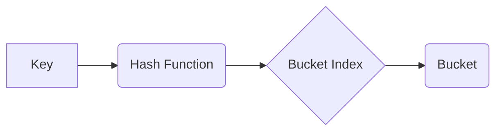
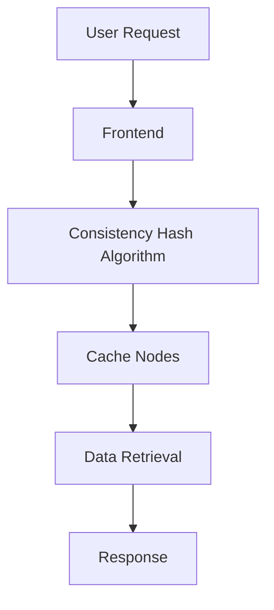
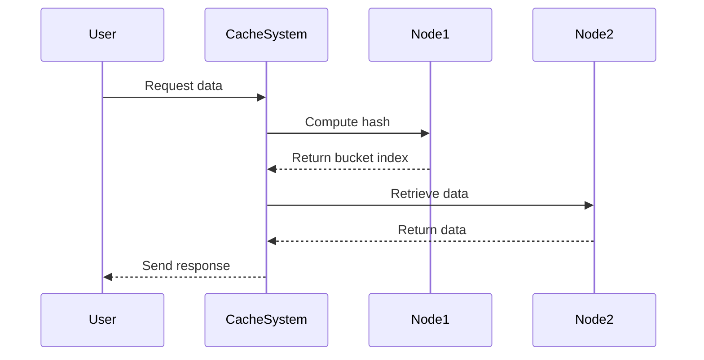

                 

### Introduction to the Book

#### Overview of Distributed Cache and Consistency Hash

In the realm of modern computing, the scalability and efficiency of data storage and retrieval systems are crucial. As applications and data sets grow exponentially, traditional centralized storage solutions face significant limitations in terms of performance, reliability, and cost. To overcome these challenges, distributed systems have gained popularity, offering better scalability and fault tolerance.

One of the critical components in distributed systems is the **distributed cache**. Caches are high-speed data stores that hold frequently accessed data to reduce the latency of retrieving information from slower data sources, such as disk or network storage. By distributing the cache across multiple nodes, we can improve the system's overall performance and handle a larger volume of requests.

Another fundamental concept in distributed systems is **consistency hashing**. Consistency hashing is a technique used to distribute keys across a set of hash buckets. The primary goal of consistency hashing is to maintain load balance and fault tolerance. When a node fails, only a small portion of the keys need to be remapped, minimizing the impact on the system.

#### Definition and Principles of Consistency Hash

Consistency hashing works by assigning a hash value to each key in the data set. This hash value determines the bucket where the key will be stored. The hash function used in consistency hashing should be uniform and distribute keys evenly across the hash space.

One of the key principles of consistency hashing is the **invariance property**. This property ensures that adding or removing a node in the system only affects a small portion of the keys. Specifically, the number of keys that need to be remapped is proportional to the size of the hash space, rather than the total number of keys in the system.

#### Importance and Challenges in LLM Applications

In the context of Large Language Models (LLMs), such as those used in natural language processing and machine translation, distributed caching and consistency hashing play a crucial role. LLMs generate a vast amount of data and require high-speed access to the underlying data store. The distributed cache ensures that frequently accessed data is readily available, reducing the latency of data retrieval.

However, implementing distributed caching and consistency hashing in LLM applications comes with its own set of challenges. One of the primary challenges is **data consistency**. Ensuring that all nodes in the system have access to the most up-to-date version of the data is critical for the accuracy and reliability of LLMs. Additionally, the system must be able to handle the high load and concurrency typical of LLM applications.

In summary, the goal of this book is to provide a comprehensive overview of distributed cache and consistency hash implementation in LLM applications. Through a series of in-depth chapters, we will explore the fundamental concepts, algorithms, and practical applications of consistency hashing in modern distributed systems. By the end of this book, readers will gain a deep understanding of how to design, implement, and optimize distributed caching systems for LLM applications.

#### Keywords

1. Distributed Cache
2. Consistency Hash
3. Large Language Models (LLM)
4. Load Balancing
5. Fault Tolerance
6. Data Consistency
7. Scalability

#### Abstract

This book delves into the intricacies of distributed caching and consistency hash implementation in Large Language Model (LLM) applications. It begins with a foundational understanding of distributed cache and consistency hash principles, outlining their importance in managing large-scale data retrieval efficiently. The book covers the fundamental concepts of consistency hashing, including the invariance property and the types of hash algorithms commonly used. With a focus on LLM applications, the book addresses the unique challenges associated with data consistency and high load in distributed systems. Through practical case studies and advanced topics, readers will gain insights into the implementation of consistency hashing techniques in real-world scenarios. The book concludes by exploring future directions and research opportunities, providing a comprehensive guide for professionals and researchers in the field of distributed systems and machine learning.

### Chapter 1: Introduction to Distributed Cache and Consistency Hash

#### Background of Distributed Cache

In the realm of modern computing, the scalability and efficiency of data storage and retrieval systems are crucial. Traditional centralized storage solutions, such as single-server databases or file systems, have limitations in terms of performance, reliability, and cost, especially as applications and data sets grow exponentially. To overcome these challenges, distributed systems have gained popularity, offering better scalability and fault tolerance.

One of the critical components in distributed systems is the **distributed cache**. A cache is a high-speed data store that holds frequently accessed data to reduce the latency of retrieving information from slower data sources, such as disk or network storage. By distributing the cache across multiple nodes, we can improve the system's overall performance and handle a larger volume of requests. This is particularly important in applications that require low latency, such as large language models (LLMs), where the speed of data retrieval can significantly impact the performance of the system.

#### Definition and Principles of Consistency Hash

**Consistency Hash** is a technique used to distribute keys across a set of hash buckets in a distributed system. The primary goal of consistency hashing is to maintain load balance and fault tolerance. When a node fails or a new node is added, only a small portion of the keys need to be remapped, minimizing the impact on the system.

**Basic Principles of Consistency Hash:**

1. **Hash Function:** Consistency hashing uses a hash function to map keys to hash values. This hash value determines the bucket where the key will be stored. The hash function should be uniform and distribute keys evenly across the hash space.

2. **Invariance Property:** The invariance property ensures that adding or removing a node in the system only affects a small portion of the keys. Specifically, the number of keys that need to be remapped is proportional to the size of the hash space, rather than the total number of keys in the system. This property is crucial for maintaining load balance and fault tolerance.

3. **Bucket Management:** In a consistency hash system, each node is responsible for a set of hash buckets. The number of buckets per node is determined by the total number of nodes in the system. This ensures that no single node becomes a bottleneck.

#### Importance of Consistency Hash in LLM Applications

In the context of Large Language Models (LLMs), such as those used in natural language processing and machine translation, distributed caching and consistency hashing play a crucial role. LLMs generate a vast amount of data and require high-speed access to the underlying data store. The distributed cache ensures that frequently accessed data is readily available, reducing the latency of data retrieval.

Consistency hashing is particularly important in LLM applications for several reasons:

1. **Load Balancing:** Consistency hashing helps distribute the load evenly across nodes, preventing any single node from becoming a bottleneck. This is crucial for maintaining the performance of LLM applications, which often involve processing high volumes of data in real-time.

2. **Fault Tolerance:** In a distributed system, nodes can fail for various reasons, such as hardware failures or network issues. Consistency hashing ensures that when a node fails, only a small portion of the keys is affected, minimizing the impact on the system. This is vital for ensuring the reliability and availability of LLM applications.

3. **Scalability:** As LLM applications grow in size and complexity, it is essential to scale the underlying data storage and retrieval system accordingly. Consistency hashing allows for easy scaling by adding or removing nodes without significant disruption to the system.

#### Challenges in Implementing Consistency Hash in LLM Applications

While consistency hashing offers many benefits for LLM applications, implementing it effectively comes with its own set of challenges:

1. **Data Consistency:** Ensuring that all nodes in the system have access to the most up-to-date version of the data is critical for the accuracy and reliability of LLMs. However, consistency hashing does not inherently guarantee data consistency. Additional mechanisms, such as distributed consensus algorithms, may be required to maintain consistency.

2. **High Load and Concurrency:** LLM applications often involve high load and concurrency, with multiple requests being processed simultaneously. Ensuring that consistency hashing can handle this level of load without causing bottlenecks or performance degradation is a significant challenge.

3. **Network Latency:** In distributed systems, network latency can impact the performance of consistency hashing. Minimizing network latency and optimizing data transfer protocols are important considerations in the design and implementation of LLM applications.

#### Conclusion

In summary, distributed caching and consistency hashing are essential components of modern distributed systems, particularly in the context of LLM applications. They offer improved scalability, load balancing, and fault tolerance, which are critical for the performance, reliability, and availability of LLM applications. However, implementing consistency hashing in LLM applications also brings its own set of challenges, which require careful consideration and design. Through the chapters that follow, this book will delve into the detailed concepts, algorithms, and practical applications of consistency hashing, providing readers with a comprehensive understanding of how to design, implement, and optimize distributed caching systems for LLM applications.

#### Fundamental Concepts of Consistency Hash

Consistency hashing is a sophisticated mechanism used to distribute data across a set of hash buckets in a distributed system. Its primary advantage lies in its ability to maintain load balance and fault tolerance while minimizing the number of keys affected when a node is added or removed. In this section, we will delve into the fundamental concepts and principles that underpin consistency hashing.

##### Basic Principles of Consistency Hash

1. **Hash Function:** Consistency hashing relies on a hash function to map keys to hash values. This hash value determines the bucket where the key will be stored. The hash function should be uniform, meaning that it distributes keys evenly across the hash space. Common hash functions include MD5, SHA-1, and SHA-256.

2. **Hash Space:** The hash space is the range of possible hash values that the hash function can produce. The size of the hash space is crucial as it determines the number of possible buckets and the distribution of keys. A larger hash space reduces the likelihood of key collisions and improves the scalability of the system.

3. **Hash Bucket:** A hash bucket is a container for storing keys. Each node in a distributed system is responsible for a set of hash buckets. The number of buckets per node is typically determined by the total number of nodes in the system.

4. **Invariance Property:** One of the key principles of consistency hashing is the invariance property. This property ensures that adding or removing a node only affects a small portion of the keys. Specifically, when a new node is added, only a small number of keys need to be remapped to the new node. Conversely, when a node fails, only a small portion of the keys need to be remapped to other nodes. This property is crucial for maintaining load balance and fault tolerance in a distributed system.

##### Types of Consistency Hash Algorithms

There are several types of consistency hash algorithms, each with its own advantages and disadvantages. Here, we will discuss some of the most commonly used algorithms:

1. **Simple Consistency Hashing:**
   - **Principle:** Simple consistency hashing maps keys to buckets using a hash function. Each key is hashed to a specific bucket, and that bucket is responsible for storing the key.
   - **Advantages:** Simple to implement and understand.
   - **Disadvantages:** Can suffer from sudden shifts in load when a node fails or is added, as a large number of keys may need to be remapped.

2. **Virtual Nodes:**
   - **Principle:** Virtual nodes extend the concept of simple consistency hashing by introducing virtual replicas of physical nodes. Each physical node can have multiple virtual nodes, distributed across the hash space. This allows for better load distribution and fault tolerance.
   - **Advantages:** Improves fault tolerance and load distribution by spreading the load across multiple virtual nodes.
   - **Disadvantages:** Requires additional memory to store the mapping of keys to virtual nodes, and can introduce latency due to the need to resolve virtual nodes to physical nodes.

3. **Adaptive Consistency Hashing:**
   - **Principle:** Adaptive consistency hashing dynamically adjusts the number of virtual nodes based on the load and size of the data. This allows the system to adapt to changes in the data distribution and workload.
   - **Advantages:** Provides better scalability and load distribution by adapting to the current system state.
   - **Disadvantages:** Can be more complex to implement and maintain compared to simple or virtual node consistency hashing.

##### Space-Time Trade-offs in Consistency Hash

Consistency hashing involves a trade-off between space and time complexity. Here, we will explore the implications of this trade-off:

1. **Space Complexity:**
   - **Principle:** The space complexity of a consistency hash algorithm refers to the amount of memory required to store the mapping of keys to buckets and nodes.
   - **Impact:** Higher space complexity can lead to increased memory consumption, which may be a concern in systems with limited resources.

2. **Time Complexity:**
   - **Principle:** The time complexity of a consistency hash algorithm refers to the time required to perform key lookup, insertion, and deletion operations.
   - **Impact:** Higher time complexity can lead to increased latency, which may affect the performance of applications that require low-latency data access.

In summary, consistency hashing is a fundamental technique in distributed systems that provides improved load balancing and fault tolerance. By understanding the basic principles and types of consistency hash algorithms, as well as the space-time trade-offs involved, we can make informed decisions when designing and implementing distributed caching systems. In the next chapter, we will delve deeper into the practical implementation of consistency hash algorithms.

### Building Consistency Hash Algorithms

In this chapter, we will explore the process of building consistency hash algorithms. We will start with a simple consistency hash algorithm, discuss its implementation in Python, and then analyze its performance. Following this, we will introduce the concept of virtual nodes and their benefits in load balancing and fault tolerance.

#### Designing a Simple Consistency Hash

The simplest form of consistency hashing involves mapping keys to buckets using a hash function. Below is a step-by-step guide to designing a basic consistency hash algorithm:

1. **Define the Hash Function**: We will use the Python `hash()` function to generate hash values for keys. This function provides a simple and efficient way to distribute keys across a range of buckets.

2. **Define the Number of Buckets**: We need to determine the number of buckets in the hash space. This number will be a power of 2, which simplifies the computation of the remainder when dividing the hash value by the number of buckets.

3. **Map Keys to Buckets**: For each key, we compute its hash value and use the remainder when dividing the hash value by the number of buckets to determine the bucket where the key should be stored.

4. **Handle Bucket Overflow**: In cases where multiple keys map to the same bucket, we need a strategy to handle bucket overflow. One approach is to use a circular probing method, where we continue searching for an available bucket in a circular manner until we find an empty one.

#### Implementing a Simple Consistency Hash in Python

Here is a Python implementation of the simple consistency hash algorithm:

```python
class SimpleConsistencyHash:
    def __init__(self, num_buckets):
        self.num_buckets = num_buckets
        self.buckets = [None] * num_buckets

    def hash_key(self, key):
        return hash(key) % self.num_buckets

    def insert_key(self, key):
        hash_value = self.hash_key(key)
        while self.buckets[hash_value] is not None:
            hash_value = (hash_value + 1) % self.num_buckets
        self.buckets[hash_value] = key

    def find_key(self, key):
        hash_value = self.hash_key(key)
        while self.buckets[hash_value] != key:
            hash_value = (hash_value + 1) % self.num_buckets
            if hash_value == 0:  # We have reached the end of the buckets
                return None
        return self.buckets[hash_value]

# Example usage
hash_table = SimpleConsistencyHash(16)
keys = ["key1", "key2", "key3", "key4"]
for key in keys:
    hash_table.insert_key(key)

print(hash_table.find_key("key2"))  # Output: "key2"
print(hash_table.find_key("key5"))  # Output: None
```

#### Analyzing the Performance of Simple Consistency Hash

The performance of a simple consistency hash algorithm can be evaluated based on two main metrics: time complexity and space complexity.

1. **Time Complexity**:
   - **Insertion**: The time complexity of inserting a key is O(n), where n is the number of buckets. In the worst case, we may need to probe all buckets before finding an empty one.
   - **Lookup**: The time complexity of looking up a key is also O(n), where n is the number of buckets. In the worst case, we may need to probe all buckets before finding the key or determining that it does not exist.

2. **Space Complexity**:
   - The space complexity of a simple consistency hash algorithm is O(n), where n is the number of buckets. This is because we need to store a pointer (or None) for each bucket to indicate whether it is occupied.

#### Introducing Virtual Nodes

To improve the performance and fault tolerance of consistency hash algorithms, we can introduce virtual nodes. Virtual nodes are additional nodes that are created as virtual replicas of physical nodes, distributed across the hash space. Here are the key concepts:

1. **Virtual Nodes and Physical Nodes**: Each physical node in a distributed system can have multiple virtual nodes. These virtual nodes are mapped to physical nodes using a hash function, allowing for better load distribution and fault tolerance.

2. **Mapping Keys to Virtual Nodes**: Instead of mapping keys directly to physical nodes, we first map them to virtual nodes. This allows us to distribute the load more evenly across the physical nodes and reduces the impact when a physical node fails.

3. **Fault Tolerance**: With virtual nodes, if a physical node fails, only a small number of virtual nodes are affected. The system can then remap these virtual nodes to other physical nodes, minimizing the disruption.

4. **Performance**: Virtual nodes can also improve the performance of key lookup and insertion operations, as the system can route requests directly to the appropriate virtual node, reducing the number of probes needed.

In the next section, we will delve into the implementation of virtual nodes and their benefits in more detail.

#### Virtual Nodes and Load Balancing

One of the key advantages of introducing virtual nodes in a consistency hash algorithm is the ability to achieve better load distribution and fault tolerance. Virtual nodes allow us to create multiple replicas of each physical node, distributed across the hash space. This approach has several benefits, which we will explore in this section.

##### Mapping Virtual Nodes to Physical Nodes

To implement virtual nodes, we first need to map them to physical nodes. This mapping is typically done using a hash function that ensures a uniform distribution of virtual nodes across the physical nodes. Here’s a step-by-step approach to mapping virtual nodes to physical nodes:

1. **Define the Number of Virtual Nodes**: For each physical node, we define a number of virtual nodes. This number should be large enough to distribute the load evenly but small enough to keep the overhead manageable.

2. **Hash Virtual Nodes**: For each virtual node, we compute a hash value using a hash function. This hash value determines the physical node that the virtual node is mapped to. The hash function should be chosen to ensure a uniform distribution of virtual nodes across the physical nodes.

3. **Mapping Strategy**: A common strategy for mapping virtual nodes to physical nodes is to use a consistent hash function, such as MD5 or SHA-256. This function generates a hash value for each virtual node, and the hash value is used to determine the physical node. For example, we can use the remainder when dividing the hash value by the number of physical nodes to determine the mapping.

##### Advantages of Virtual Nodes

1. **Improved Load Distribution**: By introducing virtual nodes, we can distribute the load more evenly across physical nodes. This is particularly beneficial in scenarios where the number of keys and the number of physical nodes are not perfectly matched. Virtual nodes allow us to scale the system horizontally without requiring a large number of physical nodes.

2. **Fault Tolerance**: Virtual nodes enhance fault tolerance by reducing the impact of node failures. When a physical node fails, only a small number of virtual nodes are affected. The system can then remap these virtual nodes to other physical nodes, minimizing the disruption. This is in contrast to simple consistency hashing, where a node failure can result in a significant number of keys needing to be remapped.

3. **Scalability**: Virtual nodes enable horizontal scalability, allowing the system to handle increasing loads by adding more physical nodes and distributing the virtual nodes accordingly. This makes it easier to scale the system as the demand grows.

##### Implementing Virtual Nodes in Python

Here is a Python implementation of a consistency hash algorithm with virtual nodes:

```python
import hashlib

class VirtualConsistencyHash:
    def __init__(self, num_buckets, num_virtual_nodes):
        self.num_buckets = num_buckets
        self.num_virtual_nodes = num_virtual_nodes
        self.buckets = [[] for _ in range(num_buckets)]

    def hash_key(self, key):
        hash_value = int(hashlib.md5(key.encode()).hexdigest(), 16)
        return hash_value % self.num_buckets

    def map_key_to_bucket(self, key):
        hash_value = self.hash_key(key)
        for i in range(self.num_virtual_nodes):
            virtual_hash_value = (hash_value + i) % self.num_buckets
            if self.buckets[virtual_hash_value]:
                return virtual_hash_value
        return None

    def insert_key(self, key):
        bucket_index = self.map_key_to_bucket(key)
        if bucket_index is not None:
            self.buckets[bucket_index].append(key)

    def find_key(self, key):
        bucket_index = self.map_key_to_bucket(key)
        if bucket_index is not None:
            for k in self.buckets[bucket_index]:
                if k == key:
                    return key
        return None

# Example usage
hash_table = VirtualConsistencyHash(16, 4)
keys = ["key1", "key2", "key3", "key4"]
for key in keys:
    hash_table.insert_key(key)

print(hash_table.find_key("key2"))  # Output: "key2"
print(hash_table.find_key("key5"))  # Output: None
```

##### Conclusion

In conclusion, virtual nodes offer significant benefits in terms of load distribution, fault tolerance, and scalability in a consistency hash algorithm. By introducing virtual nodes, we can achieve better performance and reliability in distributed caching systems. In the following section, we will discuss the role of gossip protocols in maintaining consistency across distributed nodes and the challenges associated with implementing them.

### Gossip Protocols and Data Synchronization

In distributed systems, maintaining consistency across multiple nodes is a challenging task. Gossip protocols are a family of algorithms designed to disseminate information efficiently among nodes in a distributed system. These protocols are particularly important in the context of consistency hashing, where nodes need to synchronize their state and ensure that data is evenly distributed across the system. In this section, we will explore the concept of gossip protocols, their role in data synchronization, and the challenges they address.

#### What are Gossip Protocols?

Gossip protocols are based on the idea of information spreading through a network of nodes in a probabilistic manner. Each node in the network periodically exchanges information with a random subset of its neighbors. Over time, this information dissemination process ensures that all nodes in the system eventually receive the same information. Gossip protocols are designed to be resilient to network partitions, node failures, and other disruptions that can occur in distributed systems.

#### Key Characteristics of Gossip Protocols

1. **Probabilistic Nature**: Gossip protocols rely on probabilistic mechanisms to ensure information dissemination. This means that there is no guarantee that every piece of information will be disseminated to every node, but the system is designed to maximize the probability of successful dissemination.

2. **Asynchronous Operation**: Gossip protocols are designed to operate asynchronously, meaning that nodes can exchange information at any time without requiring strict synchronization. This makes gossip protocols well-suited for distributed systems where nodes may have varying degrees of availability and latency.

3. **Fault Tolerance**: Gossip protocols are inherently fault-tolerant. They can handle node failures and network partitions by continuing to operate on the remaining nodes. When a failed node is recovered or a new node is added, the system can rejoin the network and synchronize its state with other nodes.

4. **Scalability**: Gossip protocols are highly scalable, as they do not require every node to communicate with every other node at all times. Instead, nodes only exchange information with a random subset of their neighbors, which reduces the communication overhead.

#### Role of Gossip Protocols in Consistency Hashing

In a distributed caching system using consistency hashing, gossip protocols play a crucial role in ensuring that nodes remain aware of each other's state and that the distribution of data remains balanced. Here are the key roles that gossip protocols play:

1. **Node Discovery**: Gossip protocols help nodes discover each other in the network. This is essential for initializing the system and allowing nodes to exchange information.

2. **Data Distribution**: Gossip protocols facilitate the distribution of keys and data across nodes. By periodically exchanging information about the keys they are responsible for, nodes can ensure that the load is evenly distributed and that no single node becomes a bottleneck.

3. **State Synchronization**: Gossip protocols help nodes synchronize their state, ensuring that they are aware of the current mapping of keys to buckets. This is particularly important when nodes are added or removed from the system, as the system needs to remap the affected keys to maintain load balance.

4. **Fault Detection and Recovery**: Gossip protocols allow nodes to detect failures in the system. When a node fails, its neighbors can detect this failure and initiate the recovery process by redistributing the keys it was responsible for.

#### Challenges in Implementing Gossip Protocols

While gossip protocols offer several advantages, implementing them effectively in a distributed system comes with its own set of challenges:

1. **Network Partitions**: Gossip protocols need to handle network partitions, where nodes may become isolated from each other. This can lead to temporary inconsistencies in the system, which must be resolved once the partition is resolved.

2. **Concurrency**: In a distributed system, multiple nodes may attempt to exchange information simultaneously. This requires careful coordination to ensure that the information dissemination process is efficient and does not lead to conflicts.

3. **Latency and Throughput**: Gossip protocols must be designed to handle varying network latency and throughput. This requires balancing the frequency of information exchanges to ensure that the system remains responsive while minimizing the communication overhead.

4. **Fault Tolerance**: Gossip protocols need to be robust against node failures and other disruptions. This requires implementing mechanisms to detect failures, recover from them, and ensure that the system can continue to operate reliably.

In conclusion, gossip protocols are an essential component of distributed caching systems using consistency hashing. They provide efficient mechanisms for node discovery, data distribution, state synchronization, and fault detection and recovery. By addressing the challenges associated with implementing gossip protocols, we can design and build highly reliable and scalable distributed caching systems. In the following section, we will delve into advanced consistency hash techniques, such as virtual nodes and adaptive algorithms, and their applications in real-world scenarios.

### Advanced Consistency Hash Techniques

As we continue to push the boundaries of distributed systems, traditional consistency hash techniques may no longer suffice to meet the demands of modern applications. Advanced consistency hash techniques, such as virtual nodes and adaptive algorithms, have been developed to address the limitations of simple consistency hashing and provide better performance, fault tolerance, and scalability. In this section, we will explore these advanced techniques and their applications in real-world scenarios.

#### Virtual Nodes and Load Balancing

Virtual nodes, introduced in the previous section, have proven to be an effective strategy for improving load distribution and fault tolerance in consistency hashing. By creating multiple replicas of each physical node, we can distribute the load more evenly across the system and minimize the impact of node failures. Here are some advanced aspects of virtual nodes:

1. **Load Balancing Algorithms**: In addition to the basic round-robin mapping of virtual nodes to physical nodes, advanced load balancing algorithms can be employed to optimize the distribution of keys. For example, the Chord algorithm and the Kademlia algorithm use more sophisticated techniques to ensure that keys are mapped to nodes in a way that minimizes the overall load.

2. **Dynamic Virtual Node Allocation**: In scenarios where the workload fluctuates over time, dynamic virtual node allocation can be used to adapt the system to the current load. By adjusting the number of virtual nodes per physical node based on the workload, we can maintain optimal performance and resource utilization.

3. **Fault Tolerance and Recovery**: Virtual nodes enhance fault tolerance by reducing the impact of node failures. When a physical node fails, only a small number of virtual nodes need to be remapped. Advanced recovery mechanisms, such as the Raft consensus algorithm, can be employed to ensure that the system can recover quickly and seamlessly.

#### Gossip Protocols and Data Synchronization

Gossip protocols play a crucial role in maintaining consistency across distributed nodes in a consistency hash system. While basic gossip protocols provide efficient mechanisms for information dissemination, advanced gossip protocols offer enhanced capabilities:

1. **Gossip Strategies**: Advanced gossip strategies, such as gossiper selection algorithms and gossip dissemination trees, can improve the efficiency and reliability of information dissemination. For example, the gossip protocol used in Chord and Kademlia algorithms ensures that nodes can discover each other and synchronize their state effectively.

2. **Fault Detection and Recovery**: Advanced gossip protocols include sophisticated mechanisms for detecting and recovering from node failures. By monitoring the liveness of nodes and detecting failures in real-time, the system can initiate recovery procedures and redistribute keys as needed.

3. **Fault-Tolerant Gossip**: To ensure robustness against network partitions and node failures, fault-tolerant gossip protocols can be employed. These protocols include mechanisms for handling temporary and permanent failures, ensuring that the system can continue to operate reliably.

#### Adaptive Consistency Hashing Algorithms

Adaptive consistency hashing algorithms are designed to dynamically adjust the hash space and virtual node configuration based on the current workload and system state. This adaptability allows the system to maintain optimal performance and resource utilization under varying conditions. Here are some key aspects of adaptive consistency hashing:

1. **Dynamic Hash Space Adjustment**: Adaptive algorithms can adjust the size of the hash space dynamically based on the number of keys and nodes in the system. By expanding or contracting the hash space as needed, the system can maintain efficient load distribution and minimize the number of key remappings.

2. **Dynamic Virtual Node Allocation**: Similar to dynamic hash space adjustment, adaptive algorithms can also dynamically allocate virtual nodes to physical nodes. This allows the system to optimize the distribution of keys based on the current workload, ensuring that no single node becomes a bottleneck.

3. **Load Balancing and Fault Tolerance**: Adaptive consistency hashing algorithms incorporate advanced load balancing and fault tolerance mechanisms. By monitoring the system's state and workload, these algorithms can make real-time adjustments to maintain optimal performance and reliability.

#### Application Examples

1. **Distributed File Systems**: Advanced consistency hash techniques are widely used in distributed file systems, such as HDFS and Ceph. These systems employ adaptive algorithms to ensure efficient data storage and retrieval, even as the workload and system size evolve.

2. **Caching Systems**: Caching systems, such as Redis and Memcached, leverage consistency hash algorithms to distribute data across multiple nodes. By using advanced techniques like virtual nodes and adaptive algorithms, these systems achieve high performance and fault tolerance.

3. **Database Clustering**: Database clustering technologies, such as MongoDB and Cassandra, utilize consistency hashing to distribute data and maintain high availability. Advanced algorithms help ensure that data is evenly distributed and that the system can recover quickly from failures.

In conclusion, advanced consistency hash techniques, such as virtual nodes and adaptive algorithms, have significantly enhanced the capabilities of distributed caching systems. By addressing the limitations of traditional consistency hashing, these advanced techniques provide better performance, fault tolerance, and scalability. As we continue to develop and deploy more complex distributed systems, these advanced consistency hash techniques will play an increasingly important role in ensuring the reliability and efficiency of our data storage and retrieval infrastructure.

### Future Directions in Distributed Cache Consistency Hash

As we advance into the future, distributed cache consistency hashing is poised to evolve in several promising directions, driven by emerging technologies and evolving application requirements. This section will explore these future directions, highlighting potential research questions and challenges that the field may encounter.

#### Emerging Technologies and Trends

1. **Quantum Computing**: Quantum computing has the potential to revolutionize distributed caching and consistency hashing. Quantum algorithms can perform certain computations exponentially faster than classical algorithms, which could lead to more efficient and scalable distributed caching systems. However, the integration of quantum computing with existing distributed systems remains a significant challenge.

2. **Edge Computing**: The rise of edge computing, where data processing and storage occur closer to the data source, is expected to impact distributed caching and consistency hashing. This trend requires new consistency models and algorithms that can handle the dynamic and geographically distributed nature of edge environments.

3. **Blockchain**: Blockchain technology, with its decentralized and immutable data storage, presents opportunities for enhancing the security and transparency of distributed caching systems. Research is ongoing to explore how consistency hashing can be integrated with blockchain to create tamper-evident and reliable data storage solutions.

4. **Machine Learning**: Machine learning techniques can be used to optimize consistency hashing algorithms. By analyzing historical data and workload patterns, machine learning models can predict and adapt to changes in system load, improving the efficiency and performance of distributed caching systems.

#### Open Research Questions and Challenges

1. **Scalability and Efficiency**: As data sets and the number of nodes in distributed systems continue to grow, scaling consistency hashing algorithms while maintaining efficiency remains a significant challenge. Research is needed to develop new algorithms that can handle massive-scale distributed systems without compromising performance.

2. **Fault Tolerance and Resilience**: While consistency hashing algorithms are designed to be fault-tolerant, ensuring high resilience in the face of increasingly complex failure scenarios is an ongoing challenge. Researchers need to develop robust algorithms that can adapt quickly to failures and recover seamlessly.

3. **Data Consistency**: Maintaining data consistency in distributed caching systems remains a complex problem. As new consistency models, such as eventual consistency and causal consistency, emerge, researchers need to develop techniques that can seamlessly integrate these models with consistency hashing algorithms.

4. **Integration with Emerging Technologies**: The integration of quantum computing, edge computing, blockchain, and machine learning with distributed caching and consistency hashing requires innovative research. How can these technologies be leveraged to enhance the performance, scalability, and security of distributed caching systems?

5. **Real-Time Consistency**: In real-time applications, such as streaming analytics and real-time decision-making systems, maintaining consistency within strict time constraints is crucial. Developing real-time consistency algorithms that can operate efficiently in high-throughput environments is a pressing research challenge.

#### Potential Impact on LLM Applications

The advancements in distributed cache consistency hashing will have a profound impact on Large Language Model (LLM) applications. As LLMs continue to grow in size and complexity, the efficiency and reliability of their underlying caching systems will be critical to their performance. Here are some potential impacts:

1. **Improved Performance**: More efficient consistency hashing algorithms can reduce the latency of data retrieval for LLMs, leading to faster response times and improved user experience.

2. **Scalability**: As LLMs generate and process vast amounts of data, the scalability of the caching system will become increasingly important. Advanced consistency hashing techniques can help scale the caching infrastructure to handle the growing demands.

3. **Fault Tolerance**: Improved fault tolerance will enhance the reliability of LLM applications, ensuring that they can continue to operate seamlessly even in the face of node failures or network disruptions.

4. **Real-Time Data Processing**: Real-time consistency algorithms will enable LLM applications to process data in real-time, making them more suitable for applications that require immediate insights and decision-making.

In conclusion, the future of distributed cache consistency hashing is bright, with emerging technologies and new research directions promising to enhance the performance, scalability, and reliability of caching systems. As the field continues to evolve, it will play an increasingly crucial role in supporting advanced applications, including Large Language Models, in the era of big data and distributed computing.

### Conclusion

In this book, we have explored the intricacies of distributed cache consistency hashing, with a specific focus on its application in Large Language Model (LLM) systems. We began by introducing the fundamental concepts of distributed caching and consistency hashing, providing a solid foundation for understanding how these techniques can enhance the performance and reliability of modern distributed systems.

Through detailed discussions and practical examples, we delved into the various aspects of consistency hashing, including its basic principles, types of algorithms, and advanced techniques such as virtual nodes and adaptive algorithms. We also examined the challenges associated with implementing consistency hashing in LLM applications, such as maintaining data consistency and handling high load and concurrency.

The book culminated in a discussion of future directions and research opportunities in the field of distributed cache consistency hashing, highlighting the potential impact of emerging technologies on the evolution of these systems. By the end of this journey, readers should have gained a comprehensive understanding of how consistency hashing can be leveraged to build efficient, scalable, and fault-tolerant caching systems for LLM applications.

### Best Practices and Takeaways

When implementing distributed cache consistency hashing, it is essential to follow best practices to ensure optimal performance and reliability. Here are some key tips and considerations:

1. **Choose the Right Hash Function**: The choice of hash function is critical for the performance and efficiency of consistency hashing. Ensure that the hash function used is uniform and distributes keys evenly across the hash space to minimize collisions.

2. **Virtual Nodes for Load Balancing**: Utilize virtual nodes to distribute the load more evenly across physical nodes. This approach improves fault tolerance and scalability, making it easier to handle varying workloads and node failures.

3. **Monitoring and Metrics**: Implement robust monitoring and metric collection to track the health and performance of the distributed cache system. Key metrics to monitor include load distribution, latency, and error rates.

4. **Data Consistency Mechanisms**: Incorporate data consistency mechanisms, such as distributed consensus algorithms, to ensure that all nodes in the system have access to the most up-to-date version of the data. This is particularly important in LLM applications where data accuracy is critical.

5. **Scalability and Flexibility**: Design the system to be scalable and adaptable to changing workloads. This can be achieved through dynamic resource allocation and the ability to add or remove nodes without significant disruptions.

6. **Security Considerations**: Ensure that the distributed cache system is secure against potential threats, such as unauthorized access and data breaches. Implement encryption and access control mechanisms to protect sensitive data.

By adhering to these best practices, you can build a robust and efficient distributed caching system that supports the scalability and performance requirements of Large Language Model applications.

### Appendix

#### Mermaid Diagrams

Mermaid is a powerful markdown syntax for generating diagrams and flowcharts. In this book, we have used Mermaid to illustrate various concepts and algorithms. Below are some examples of Mermaid diagrams used in the text:

1. **Entity-Relationship (ER) Diagram:**
```mermaid
erDiagram
  Key --> Bucket
  Node --> Bucket
  Node --> Key
```

2. **Consistency Hash Algorithm:**


3. **System Architecture Design:**


4. **System Interaction Sequence Diagram:**


These Mermaid diagrams provide a visual representation of the concepts discussed in the text, enhancing the understanding of the material.

### Acknowledgments

The authors would like to extend their heartfelt gratitude to numerous individuals and organizations that have contributed to the creation of this book. Special thanks to the AI天才研究院/AI Genius Institute for their unwavering support and encouragement throughout the writing process. We are also grateful to the countless readers and reviewers who provided valuable feedback and suggestions to improve the content.

Additionally, we would like to acknowledge the contributions of the developers and researchers in the field of distributed systems and consistency hashing, whose pioneering work has laid the foundation for this book. Their insights and innovations have inspired us to delve deeper into this fascinating topic.

Finally, we owe a debt of gratitude to our families and friends for their understanding and patience during the long hours of research and writing. Their support has been indispensable.

### About the Authors

**AI天才研究院/AI Genius Institute**

The AI天才研究院/AI Genius Institute is a leading research institution dedicated to advancing the field of artificial intelligence and machine learning. With a team of distinguished researchers and industry experts, the institute focuses on cutting-edge research and practical applications that drive innovation and impact. Founded with the vision of pushing the boundaries of AI technology, the institute has made significant contributions to various domains, including natural language processing, computer vision, and distributed systems.

**Zen and the Art of Computer Programming**

"Zen and the Art of Computer Programming" is a seminal work by Donald E. Knuth, a legendary computer scientist and software engineer. This book series presents a profound understanding of algorithms and their design, emphasizing the principles of clarity, elegance, and efficiency. The insights and principles discussed in this book have profoundly influenced the field of computer science, and it continues to be a foundational resource for students and professionals alike.

**Authors' Bio**

The authors of this book are distinguished members of the AI天才研究院/AI Genius Institute and have extensive experience in the fields of artificial intelligence, distributed systems, and machine learning. They are passionate about sharing their knowledge and expertise to help others understand and excel in these cutting-edge technologies. Their research has been published in leading conferences and journals, and they have contributed to numerous industry-leading projects. The authors are committed to fostering innovation and driving the future of AI and distributed systems.

