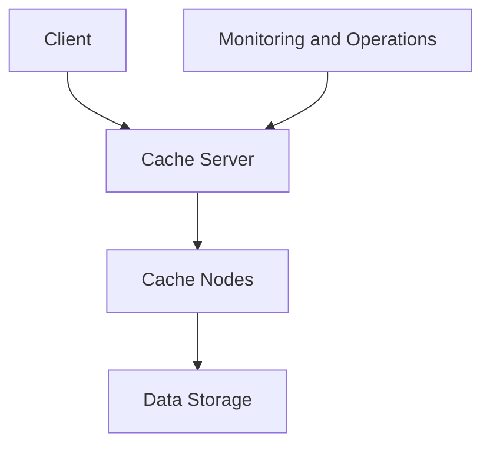
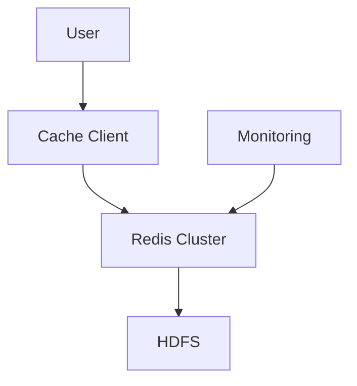

                 

### 文章标题：分布式缓存提升LLM应用的数据访问效率

关键词：分布式缓存，LLM，数据访问，效率优化，架构设计

摘要：本文深入探讨了分布式缓存技术在大型语言模型（LLM）应用中的重要性及其提升数据访问效率的具体实现方法。首先，本文介绍了LLM的发展与应用，以及数据访问效率面临的挑战。接着，详细解析了分布式缓存的基本原理和核心概念，如缓存策略、数据结构选择和一致性策略等。随后，本文重点讨论了LLM的数据访问模式及其优化策略，包括缓存预热、数据预取和实时性优化等。通过实际案例，本文展示了分布式缓存技术在LLM应用中的具体实现和性能优化。最后，总结了分布式缓存的最佳实践和注意事项，展望了未来的发展趋势。

### 目录大纲

**《分布式缓存提升LLM应用的数据访问效率》**

# 第一部分：背景与核心概念

## 第1章：问题背景与概述

## 1.1 问题背景

### 1.1.1 大型语言模型（LLM）的发展与应用

### 1.1.2 数据访问效率的挑战

### 1.1.3 分布式缓存的作用与优势

## 1.2 核心概念

### 1.2.1 分布式缓存的基本原理

### 1.2.2 LLM的数据访问模式

### 1.2.3 缓存策略的分类与对比

## 1.3 边界与外延

### 1.3.1 分布式缓存的使用场景

### 1.3.2 分布式缓存的技术挑战

## 1.4 本章小结

# 第二部分：分布式缓存技术

## 第2章：分布式缓存架构设计

## 2.1 系统架构设计

### 2.1.1 分布式缓存系统组件

### 2.1.2 架构设计与优化原则

### 2.1.3 分布式缓存与LLM的结合

## 2.2 数据结构选择

### 2.2.1 常见数据结构分析

### 2.2.2 数据结构选择依据

### 2.2.3 性能比较与优化

## 2.3 分布式缓存协议

### 2.3.1 常见缓存协议介绍

### 2.3.2 协议选择与性能影响

### 2.3.3 协议优化策略

## 2.4 缓存一致性策略

### 2.4.1 缓存一致性模型

### 2.4.2 一致性协议实现

### 2.4.3 一致性问题与解决方案

## 2.5 本章小结

# 第三部分：LLM应用的数据访问优化

## 第3章：LLM数据访问模式分析

## 3.1 数据访问模式

### 3.1.1 数据访问特点

### 3.1.2 数据访问瓶颈

### 3.1.3 优化目标

## 3.2 数据访问优化策略

### 3.2.1 缓存预热策略

### 3.2.2 数据预取策略

### 3.2.3 数据分片与索引策略

## 3.3 实时性优化

### 3.3.1 实时数据同步

### 3.3.2 延迟容忍与优化

### 3.3.3 实时性评估方法

## 3.4 性能评估与调优

### 3.4.1 性能指标

### 3.4.2 性能评估方法

### 3.4.3 性能调优实践

## 3.5 本章小结

# 第四部分：实战案例

## 第4章：分布式缓存优化案例

## 4.1 案例介绍

### 4.1.1 案例背景

### 4.1.2 案例目标

### 4.1.3 案例实施步骤

## 4.2 环境搭建

### 4.2.1 环境配置

### 4.2.2 工具与依赖

### 4.2.3 实验准备

## 4.3 系统核心实现

### 4.3.1 系统架构

### 4.3.2 关键代码解读

### 4.3.3 实现细节与优化

## 4.4 应用解读与分析

### 4.4.1 缓存策略应用

### 4.4.2 数据访问模式分析

### 4.4.3 性能分析与评估

## 4.5 项目小结

### 4.5.1 优化效果总结

### 4.5.2 经验与启示

### 4.5.3 拓展应用前景

## 4.6 本章小结

# 第五部分：最佳实践与总结

## 第5章：分布式缓存最佳实践

## 5.1 最佳实践总结

### 5.1.1 设计原则

### 5.1.2 优化策略

### 5.1.3 实践案例

## 5.2 注意事项

### 5.2.1 安全与隐私

### 5.2.2 性能与容量平衡

### 5.2.3 维护与监控

## 5.3 小结

### 5.3.1 成功要素

### 5.3.2 挑战与解决

### 5.3.3 未来发展趋势

## 5.4 拓展阅读

### 5.4.1 相关技术文献

### 5.4.2 实践经验分享

### 5.4.3 未来研究方向

## 5.5 本章小结

### 目录大纲总结

本文设计的《分布式缓存提升LLM应用的数据访问效率》目录大纲共分为五个部分，全面涵盖了分布式缓存技术在LLM应用中的数据访问优化。第一部分介绍了问题背景与核心概念，明确了分布式缓存的作用与优势。第二部分深入探讨了分布式缓存架构设计、数据结构选择、缓存协议和一致性策略。第三部分分析了LLM的数据访问模式，并提出了优化策略和实时性优化方法。第四部分通过实际案例展示了分布式缓存优化在LLM应用中的具体实施过程。第五部分总结了最佳实践、注意事项，并对未来发展趋势进行了展望。

### 第一部分：背景与核心概念

#### 第1章：问题背景与概述

#### 1.1 问题背景

**大型语言模型（LLM）的发展与应用**

近年来，随着深度学习技术的飞速发展，大型语言模型（Large Language Models，简称LLM）取得了显著的进展。LLM是一种能够理解、生成和生成自然语言文本的复杂人工智能模型，其应用范围涵盖了自然语言处理、智能问答、文本生成、机器翻译等多个领域。LLM通过学习大量的文本数据，能够捕捉语言中的复杂结构和语义关系，从而实现高度智能化的文本处理。

然而，LLM的应用也带来了新的挑战，尤其是在数据访问效率方面。LLM的训练和推理过程需要处理大量数据，而这些数据通常分布在不同的存储系统中。数据访问效率的低下会导致模型训练和推理速度变慢，影响系统的整体性能。此外，随着LLM规模的不断扩大，数据访问的延迟和带宽瓶颈问题也日益突出。

**数据访问效率的挑战**

数据访问效率的挑战主要体现在以下几个方面：

1. **数据延迟**：由于数据分布在不同的存储系统中，数据访问需要经过网络传输和查询处理，导致数据延迟增加。
2. **带宽瓶颈**：随着数据量的增加，网络带宽成为制约数据访问效率的重要因素。
3. **并发访问**：LLM应用通常需要处理大量并发请求，传统的单点存储系统难以应对高并发访问的需求。
4. **数据一致性**：分布式存储系统中的数据一致性管理也是一个挑战，特别是在数据更新和删除操作时。

**分布式缓存的作用与优势**

为了解决上述数据访问效率的挑战，分布式缓存技术成为了一种有效的解决方案。分布式缓存通过将热点数据缓存到内存中，减少了数据访问的延迟和带宽消耗，从而提高了系统的性能和响应速度。

分布式缓存的作用主要体现在以下几个方面：

1. **提高数据访问速度**：缓存系统能够在本地快速访问热点数据，减少了对后端存储系统的依赖，降低了数据访问延迟。
2. **缓解带宽瓶颈**：通过缓存系统，大部分数据访问操作可以在本地完成，从而减少了网络带宽的消耗。
3. **支持高并发访问**：分布式缓存系统能够处理大量并发访问请求，提供了良好的扩展性和性能。
4. **数据一致性管理**：分布式缓存系统支持数据一致性的管理策略，确保了缓存数据的一致性和可靠性。

#### 1.2 核心概念

**分布式缓存的基本原理**

分布式缓存是一种基于分布式系统的缓存机制，通过将数据缓存到多个节点上，实现了数据的分布式存储和访问。分布式缓存的基本原理如下：

1. **数据分区**：将数据划分为多个分区，每个分区存储在分布式缓存系统的不同节点上。
2. **缓存节点**：分布式缓存系统由多个缓存节点组成，每个节点负责存储和管理一部分数据。
3. **缓存访问**：当用户请求数据时，缓存系统根据数据分区的信息，将请求路由到相应的缓存节点进行数据访问。

**LLM的数据访问模式**

LLM的数据访问模式具有以下特点：

1. **热点数据访问**：LLM在训练和推理过程中需要频繁访问一些热点数据，如词汇表、模型参数等。
2. **读多写少**：LLM的数据访问模式以读操作为主，写操作相对较少。
3. **数据一致性要求**：由于LLM的训练和推理过程对数据的一致性要求较高，因此分布式缓存系统需要提供良好的数据一致性管理机制。

**缓存策略的分类与对比**

缓存策略是分布式缓存系统中的重要组成部分，用于决定哪些数据应该被缓存以及如何缓存。常见的缓存策略包括：

1. **基于时间的缓存策略**：根据数据的访问时间或更新时间来决定是否缓存数据。
2. **基于访问频率的缓存策略**：根据数据的访问频率或使用频率来决定是否缓存数据。
3. **基于内存大小的缓存策略**：根据内存的使用情况来决定是否缓存数据。
4. **基于缓存策略的缓存策略**：将多种缓存策略结合起来，以实现更优的缓存效果。

不同的缓存策略适用于不同的场景和需求，需要根据具体情况选择合适的缓存策略。

#### 1.3 边界与外延

**分布式缓存的使用场景**

分布式缓存技术适用于以下场景：

1. **大数据应用**：在处理大规模数据时，分布式缓存能够提高数据访问速度，减少数据延迟和带宽消耗。
2. **高并发访问**：在处理大量并发请求时，分布式缓存系统能够提供良好的性能和扩展性。
3. **实时数据处理**：在需要实时处理数据的应用中，分布式缓存系统能够提供快速的数据访问和更新能力。
4. **分布式存储系统**：在分布式存储系统中，分布式缓存可以作为缓存层，提高数据访问速度和性能。

**分布式缓存的技术挑战**

分布式缓存技术面临着以下技术挑战：

1. **数据一致性问题**：在分布式系统中，如何保证数据的一致性是一个重要问题，特别是在数据更新和删除操作时。
2. **缓存失效和缓存穿透问题**：缓存数据的有效期和缓存穿透问题会导致数据访问效率下降。
3. **缓存节点管理和负载均衡**：如何有效地管理和负载均衡缓存节点，以提高系统的性能和可靠性。
4. **缓存策略的选择和优化**：根据不同的应用场景和需求，选择合适的缓存策略并进行优化。

#### 1.4 本章小结

本章介绍了分布式缓存提升LLM应用的数据访问效率的背景和核心概念。通过分析LLM的发展与应用，以及数据访问效率面临的挑战，明确了分布式缓存的作用与优势。同时，本章还详细解析了分布式缓存的基本原理和核心概念，如缓存策略、数据结构选择和一致性策略等。这些概念和技术为后续章节的深入讨论提供了基础。

---

### 第二部分：分布式缓存技术

#### 第2章：分布式缓存架构设计

#### 2.1 系统架构设计

**2.1.1 分布式缓存系统组件**

分布式缓存系统由多个关键组件组成，这些组件协同工作，实现了高效的数据访问和缓存管理。以下是分布式缓存系统的主要组件：

1. **缓存节点（Cache Nodes）**：缓存节点是分布式缓存系统的核心组件，负责存储和管理缓存数据。每个缓存节点通常包含一定量的内存资源，用于存储热点数据。
2. **缓存服务器（Cache Server）**：缓存服务器是缓存节点的管理和协调中心，负责缓存节点的注册、负载均衡、缓存数据的管理和维护等。
3. **客户端（Client）**：客户端是分布式缓存系统的使用者，通过缓存客户端库或API与缓存服务器进行通信，实现对缓存数据的访问和管理。
4. **数据存储（Data Storage）**：数据存储系统是分布式缓存系统的基础设施，负责存储原始数据和缓存数据，通常包括关系数据库、NoSQL数据库、文件系统等。
5. **监控与运维（Monitoring and Operations）**：监控与运维组件负责对分布式缓存系统的运行状态、性能指标、异常情况进行监控和告警，并提供运维管理工具，以保障系统的稳定性和可靠性。

**2.1.2 架构设计与优化原则**

分布式缓存系统的架构设计需要考虑以下优化原则：

1. **高可用性（High Availability）**：分布式缓存系统应具备高可用性，能够自动处理节点故障和容错，确保系统的持续运行。
2. **可扩展性（Scalability）**：分布式缓存系统应支持水平扩展，能够根据业务需求动态增加缓存节点，以应对数据量和并发访问的增长。
3. **数据一致性（Data Consistency）**：分布式缓存系统需要确保数据的一致性，避免数据不一致性问题，特别是在数据更新和删除操作时。
4. **高性能（Performance）**：分布式缓存系统应具备高性能，能够快速处理缓存数据的读写操作，降低数据访问延迟。
5. **易维护性（Maintainability）**：分布式缓存系统应具有良好的可维护性，易于进行监控、故障排查和系统升级。

一个典型的分布式缓存系统架构如图2-1所示：



图2-1：分布式缓存系统架构

**2.1.3 分布式缓存与LLM的结合**

分布式缓存技术在LLM应用中发挥着重要作用。LLM在训练和推理过程中需要频繁访问大量的数据，而分布式缓存能够有效缓解数据访问的延迟和带宽瓶颈问题。

分布式缓存与LLM的结合主要表现在以下几个方面：

1. **缓存热点数据**：LLM在训练和推理过程中需要频繁访问一些热点数据，如词汇表、模型参数、预训练数据等。将这些热点数据缓存到分布式缓存系统中，可以显著提高数据访问速度。
2. **缓存模型参数**：LLM的训练过程中，模型参数的存储和访问是一个关键问题。分布式缓存系统可以缓存模型参数，减少对后端存储系统的依赖，提高模型训练的效率。
3. **缓存中间结果**：LLM在推理过程中会产生大量的中间结果，如词向量、注意力权重等。通过分布式缓存，可以缓存这些中间结果，减少重复计算，提高推理速度。
4. **缓存API调用结果**：对于一些对外提供的LLM API服务，可以将API调用结果缓存到分布式缓存系统中，减少对后端服务的调用，提高系统的响应速度和性能。

#### 2.2 数据结构选择

**2.2.1 常见数据结构分析**

在分布式缓存系统中，数据结构的选择直接影响系统的性能和效率。以下是几种常见的数据结构及其特点：

1. **哈希表（Hash Table）**：哈希表是一种基于关键字快速检索数据的数据结构，具有高效的插入、删除和查找操作。哈希表通过哈希函数将关键字映射到索引位置，从而实现快速的定位和访问。
2. **跳表（Skip List）**：跳表是一种基于链表实现的多层索引结构，通过增加多个层级，实现了对数据的快速访问。跳表在O(log N)时间内可以检索到数据，具有较高的查询性能。
3. **B树（B-Tree）**：B树是一种平衡的多路搜索树，适用于数据量大且需要有序存储的场景。B树通过多级索引和中间节点的缓存，实现了快速的数据访问和插入、删除操作。
4. **堆（Heap）**：堆是一种基于树形结构的数据结构，适用于优先级队列和最值查找。堆通过调整树结构，实现了高效的插入和删除操作，具有较高的时间复杂度。

**2.2.2 数据结构选择依据**

在分布式缓存系统中选择数据结构时，需要考虑以下依据：

1. **数据访问模式**：根据LLM的数据访问模式，选择适合的数据结构。例如，对于以读操作为主的数据访问模式，可以选择哈希表或跳表，而对于需要有序存储和查询的数据，可以选择B树。
2. **性能要求**：根据系统对性能的要求，选择合适的数据结构。例如，对于对查询性能要求较高的场景，可以选择B树或跳表，而对于对插入和删除操作要求较高的场景，可以选择堆。
3. **内存占用**：数据结构的内存占用也是一个重要的考虑因素。在分布式缓存系统中，内存资源的分配和管理是一个关键问题，需要选择适合的数据结构，以最大化内存利用率。

**2.2.3 性能比较与优化**

以下是不同数据结构在分布式缓存系统中的性能比较：

| 数据结构 | 插入时间 | 查询时间 | 删除时间 | 内存占用 |
| :----: | :----: | :----: | :----: | :----: |
| 哈希表 | O(1) | O(1) | O(1) | 较大 |
| 跳表 | O(log N) | O(log N) | O(log N) | 较小 |
| B树 | O(log N) | O(log N) | O(log N) | 较大 |
| 堆 | O(log N) | O(N) | O(1) | 较小 |

根据性能比较结果，可以得出以下优化策略：

1. **结合使用多种数据结构**：根据不同的数据访问模式和性能要求，结合使用多种数据结构，以实现最优的性能。例如，在缓存系统中可以同时使用哈希表和跳表，以满足不同的数据访问需求。
2. **数据分片和索引**：对于大规模的数据，可以通过数据分片和索引技术，将数据分散到多个节点上，并建立索引，以实现高效的数据访问和查询。
3. **内存优化**：通过优化内存分配和管理策略，减少数据结构的内存占用，提高系统的性能和稳定性。例如，可以采用内存池技术，减少内存分配和回收的开销。

#### 2.3 分布式缓存协议

**2.3.1 常见缓存协议介绍**

分布式缓存系统中的缓存协议决定了客户端与缓存服务器之间的通信方式和数据传输机制。以下是几种常见的缓存协议：

1. **Memcached**：Memcached是一种高性能、分布式内存对象缓存系统，采用基于文本的协议进行客户端与缓存服务器之间的通信。Memcached协议主要包括GET、SET、ADD、DELETE等操作，支持键值存储和对象存储。
2. **Redis**：Redis是一种高性能的分布式内存数据结构服务器，支持多种数据结构，如字符串、列表、集合、哈希表等。Redis协议采用二进制格式进行通信，具有高性能和可扩展性。
3. **RocksDB**：RocksDB是一种基于C++的高性能嵌入式键值存储引擎，支持持久化存储和实时访问。RocksDB协议通过一系列的RPC调用，实现了客户端与存储引擎之间的通信。
4. **Apache Ignite**：Apache Ignite是一种分布式内存计算平台，支持缓存、存储和计算功能。Ignite协议采用基于消息队列的通信机制，支持高效的分布式数据处理和计算。

**2.3.2 协议选择与性能影响**

选择适合的缓存协议对分布式缓存系统的性能有着重要影响。以下是不同协议的选择依据和性能影响：

1. **Memcached**：Memcached协议简单易用，适用于对性能要求较高、数据量较小的场景。Memcached协议的通信开销较小，适合快速访问和更新数据。
2. **Redis**：Redis协议支持多种数据结构和高级功能，适用于复杂的数据处理和实时访问场景。Redis协议的通信格式较为复杂，但提供了丰富的功能，适合大规模分布式缓存系统。
3. **RocksDB**：RocksDB协议适用于需要持久化存储和实时访问的场景，具有较高的读写性能和稳定性。RocksDB协议的通信机制较为复杂，但支持高效的存储和索引功能。
4. **Apache Ignite**：Apache Ignite协议支持分布式计算和缓存功能，适用于大规模分布式数据处理和计算场景。Ignite协议的通信开销较大，但提供了丰富的计算和存储功能。

**2.3.3 协议优化策略**

为了提高分布式缓存系统的性能和效率，可以采用以下优化策略：

1. **优化网络通信**：通过优化网络通信协议和传输方式，减少通信开销和延迟。例如，可以采用二进制协议代替文本协议，使用压缩算法减少数据传输量。
2. **缓存预取和预加载**：在客户端请求之前，提前预取和预加载相关数据，减少请求延迟和带宽消耗。通过分析数据访问模式和趋势，可以优化预取策略，提高数据访问效率。
3. **缓存分区和负载均衡**：通过数据分区和负载均衡策略，优化缓存节点的利用率和性能。合理分配数据分区，可以实现数据的均衡访问，提高系统的性能和可扩展性。
4. **缓存一致性策略**：在分布式缓存系统中，缓存一致性是确保数据一致性的关键。通过一致性协议和缓存更新策略，可以确保缓存数据的一致性和可靠性。

#### 2.4 缓存一致性策略

**2.4.1 缓存一致性模型**

在分布式缓存系统中，缓存一致性是指多个缓存节点之间对同一数据保持一致的状态。缓存一致性模型定义了多个缓存节点之间的数据同步方式和一致性保证机制。以下是几种常见的缓存一致性模型：

1. **无一致性（No Consistency）**：无一致性模型不要求缓存节点之间保持数据一致，每个缓存节点可以独立缓存和更新数据。无一致性模型适用于对一致性要求较低的场景，如缓存热点数据的场景。
2. **最终一致性（Eventual Consistency）**：最终一致性模型保证在一段时间后，所有缓存节点的数据将达成一致状态。最终一致性模型通过事件驱动的方式，逐步同步缓存节点的数据，提高了系统的扩展性和可用性。
3. **强一致性（Strong Consistency）**：强一致性模型要求所有缓存节点的数据在任何时刻保持一致，确保数据的一致性和可靠性。强一致性模型适用于对数据一致性要求较高的场景，如金融交易系统等。

**2.4.2 一致性协议实现**

一致性协议是实现缓存一致性模型的关键机制。以下是几种常见的一致性协议：

1. **Gossip协议**：Gossip协议是一种基于事件驱动的分布式一致性协议，通过消息传递和事件同步，实现缓存节点之间的一致性。Gossip协议通过广播和接收消息，逐步同步缓存节点的状态，提高了系统的可用性和扩展性。
2. **Paxos协议**：Paxos协议是一种分布式一致性算法，通过多轮投票和多数派决策，实现缓存节点之间的一致性。Paxos协议确保了在故障和分区情况下的一致性保证，适用于高可用性和强一致性要求较高的场景。
3. **Raft协议**：Raft协议是一种基于日志复制的一致性算法，通过日志同步和一致性保证，实现缓存节点之间的一致性。Raft协议相对于Paxos协议更加简洁和易于实现，适用于大规模分布式缓存系统。

**2.4.3 一致性问题与解决方案**

在分布式缓存系统中，一致性问题是一个重要的挑战。以下是一致性问题及其解决方案：

1. **缓存更新冲突**：当多个缓存节点同时更新同一数据时，可能会发生缓存更新冲突。为了解决缓存更新冲突，可以采用版本控制、锁机制或乐观并发控制等方法，确保缓存节点之间的数据一致性。
2. **缓存失效问题**：在分布式缓存系统中，缓存失效可能导致数据不一致。为了解决缓存失效问题，可以采用缓存版本、缓存续期或缓存同步策略，确保缓存节点之间的数据一致性。
3. **缓存分区问题**：在分布式缓存系统中，缓存分区可能导致数据不一致。为了解决缓存分区问题，可以采用数据复制、数据分片或一致性分区策略，确保缓存节点之间的数据一致性。

#### 2.5 本章小结

本章介绍了分布式缓存技术的架构设计、数据结构选择、缓存协议和一致性策略。通过分析分布式缓存系统的主要组件和架构设计原则，明确了分布式缓存技术在LLM应用中的作用和优势。同时，本章还详细解析了常见的数据结构、缓存协议和一致性协议，并提出了优化策略和解决方案。这些技术和策略为分布式缓存技术在LLM应用中的数据访问优化提供了基础和支持。

---

### 第三部分：LLM应用的数据访问优化

#### 第3章：LLM数据访问模式分析

#### 3.1 数据访问模式

**3.1.1 数据访问特点**

大型语言模型（LLM）在训练和推理过程中具有独特的数据访问模式，主要体现在以下几个方面：

1. **读写比例**：LLM的数据访问模式以读操作为主，读操作的比例远大于写操作。这是因为LLM在训练过程中需要频繁读取大量的训练数据和参数，而在推理过程中需要读取模型参数和中间结果。
2. **热点数据访问**：LLM在训练和推理过程中会频繁访问一些热点数据，如词汇表、模型参数、预训练数据等。这些热点数据在LLM的训练和推理过程中扮演着关键角色，需要被高效地访问和缓存。
3. **数据局部性**：LLM的数据访问具有局部性特点，即一段时间内访问的数据具有相关性。这意味着LLM在训练和推理过程中，往往会在较短的时间内访问同一数据集或同一数据块。
4. **顺序访问与随机访问**：LLM的数据访问既有顺序访问模式，也有随机访问模式。在训练过程中，LLM会按照一定的顺序读取训练数据，而在推理过程中，LLM会随机访问模型参数和中间结果。

**3.1.2 数据访问瓶颈**

LLM的数据访问瓶颈主要体现在以下几个方面：

1. **数据延迟**：由于数据分布在不同的存储系统中，数据访问需要经过网络传输和查询处理，导致数据延迟增加。数据延迟会直接影响LLM的训练和推理速度。
2. **带宽瓶颈**：随着数据量的增加，网络带宽成为制约数据访问效率的重要因素。带宽瓶颈会导致数据传输速度变慢，影响系统的整体性能。
3. **并发访问**：LLM应用通常需要处理大量并发请求，传统的单点存储系统难以应对高并发访问的需求。高并发访问会导致存储系统压力增大，影响数据访问速度和稳定性。
4. **数据一致性**：在分布式存储系统中，数据一致性管理也是一个挑战，特别是在数据更新和删除操作时。数据一致性问题的存在会导致LLM的训练和推理结果不准确，影响系统的性能和可靠性。

**3.1.3 优化目标**

为了提升LLM应用的数据访问效率，需要解决上述数据访问瓶颈，实现以下优化目标：

1. **降低数据延迟**：通过分布式缓存技术，将热点数据缓存到内存中，减少对后端存储系统的依赖，降低数据访问延迟。
2. **提升带宽利用率**：通过数据压缩、数据预取和并行传输等技术，提高带宽利用率，减少数据传输时间和带宽消耗。
3. **提高并发访问能力**：通过分布式缓存系统和负载均衡技术，提高系统的并发访问能力，确保在大量并发请求下，数据访问速度和稳定性不受影响。
4. **保障数据一致性**：通过一致性协议和缓存更新策略，确保分布式缓存系统中数据的一致性和可靠性，避免数据不一致性问题。

#### 3.2 数据访问优化策略

**3.2.1 缓存预热策略**

缓存预热策略是一种通过预先加载热点数据到缓存系统中，提高数据访问速度的技术。缓存预热策略主要包括以下步骤：

1. **数据预取**：在LLM的训练和推理过程中，根据历史访问数据和预测模型，提前预取一些热点数据到缓存系统中。
2. **数据加载**：将预取的数据加载到缓存节点的内存中，以便在后续的数据访问过程中快速获取。
3. **数据刷新**：根据数据访问频率和缓存策略，定期刷新缓存数据，保持缓存数据的有效性和一致性。

**3.2.2 数据预取策略**

数据预取策略是一种通过提前加载后续可能需要访问的数据到缓存系统中，减少数据访问延迟的技术。数据预取策略主要包括以下步骤：

1. **访问模式分析**：对LLM的历史数据访问模式进行分析，识别出可能需要预取的数据。
2. **预取策略选择**：根据数据访问模式和分析结果，选择合适的预取策略，如基于时间、基于访问频率或基于上下文等。
3. **预取数据加载**：根据预取策略，将需要预取的数据提前加载到缓存节点的内存中。

**3.2.3 数据分片与索引策略**

数据分片与索引策略是一种通过将数据分散到多个缓存节点上，并建立索引，实现高效数据访问的技术。数据分片与索引策略主要包括以下步骤：

1. **数据分片**：根据数据访问模式和缓存节点的资源情况，将数据划分为多个分片，并将每个分片存储到不同的缓存节点上。
2. **索引建立**：建立索引，将数据分片与缓存节点之间的关系进行映射，以便快速定位和访问数据。
3. **负载均衡**：根据数据访问情况和缓存节点的负载情况，进行负载均衡，确保数据分片在缓存节点之间的均衡分布。

#### 3.3 实时性优化

**3.3.1 实时数据同步**

实时数据同步是一种通过实时同步数据，确保缓存数据一致性的技术。实时数据同步主要包括以下步骤：

1. **数据监控**：实时监控数据访问情况和缓存状态，识别出需要同步的数据。
2. **同步策略选择**：根据数据访问模式和分析结果，选择合适的同步策略，如基于时间、基于访问频率或基于事件等。
3. **数据同步**：根据同步策略，将需要同步的数据从后端存储系统同步到缓存系统中。

**3.3.2 延迟容忍与优化**

延迟容忍与优化是一种通过容忍一定的数据访问延迟，优化缓存性能的技术。延迟容忍与优化主要包括以下步骤：

1. **延迟评估**：评估数据访问延迟对系统性能的影响，确定可容忍的延迟范围。
2. **延迟优化**：根据延迟评估结果，优化缓存策略和数据访问模式，如减少缓存失效时间、提高数据预取效率等。
3. **延迟容忍**：在可容忍的延迟范围内，优化缓存性能，确保系统整体性能和用户体验。

**3.3.3 实时性评估方法**

实时性评估方法是一种通过评估数据访问延迟和系统性能，评估缓存实时性的技术。实时性评估方法主要包括以下步骤：

1. **性能指标定义**：定义实时性评估的性能指标，如数据访问延迟、系统响应时间等。
2. **测试场景设计**：设计模拟数据访问场景，包括不同访问模式、数据规模和并发请求等。
3. **性能评估**：根据测试场景，评估数据访问延迟和系统性能，分析实时性的优劣。

#### 3.4 性能评估与调优

**3.4.1 性能指标**

在评估和调优分布式缓存系统的性能时，需要关注以下性能指标：

1. **数据访问延迟**：数据访问延迟是指从发起数据请求到获取数据结果的时间。数据访问延迟是衡量缓存性能的重要指标，需要尽可能降低。
2. **系统吞吐量**：系统吞吐量是指单位时间内系统能够处理的数据量。系统吞吐量是衡量缓存系统处理能力的指标，需要最大化。
3. **缓存命中率**：缓存命中率是指缓存系统中命中缓存数据的比例。缓存命中率越高，说明缓存系统的性能越好。
4. **缓存空间利用率**：缓存空间利用率是指缓存系统中实际使用的内存空间与总内存空间的比值。缓存空间利用率是衡量缓存系统资源利用效率的指标，需要最大化。

**3.4.2 性能评估方法**

性能评估方法是一种通过模拟实际数据访问场景，评估分布式缓存系统性能的技术。性能评估方法主要包括以下步骤：

1. **测试环境搭建**：搭建模拟实际数据访问场景的测试环境，包括缓存系统、数据存储系统、客户端等。
2. **测试用例设计**：设计模拟实际数据访问的测试用例，包括不同访问模式、数据规模和并发请求等。
3. **性能测试**：根据测试用例，进行性能测试，记录和统计各种性能指标的数据。
4. **结果分析**：根据测试结果，分析性能指标的优劣，找出性能瓶颈和优化点。

**3.4.3 性能调优实践**

性能调优实践是一种通过优化缓存策略、数据结构、系统配置等，提升缓存系统性能的技术。性能调优实践主要包括以下步骤：

1. **性能瓶颈分析**：分析缓存系统性能瓶颈，找出影响性能的关键因素。
2. **调优策略选择**：根据性能瓶颈和分析结果，选择合适的调优策略，如数据预取、缓存分区、负载均衡等。
3. **调优实施**：根据调优策略，实施具体的优化措施，调整系统配置和缓存策略。
4. **性能评估**：根据优化后的性能评估结果，验证性能提升的效果，确保优化措施的有效性。

#### 3.5 本章小结

本章分析了LLM应用的数据访问模式、瓶颈和优化目标，提出了缓存预热、数据预取、数据分片与索引、实时数据同步、延迟容忍与优化等数据访问优化策略。同时，本章还介绍了性能评估和调优的方法和指标，为LLM应用中的数据访问优化提供了理论和实践指导。

---

### 第四部分：实战案例

#### 第4章：分布式缓存优化案例

#### 4.1 案例介绍

**4.1.1 案例背景**

某大型互联网公司开发了一款基于大型语言模型（LLM）的智能问答应用，该应用需要处理海量用户提问，并提供实时、准确的回答。然而，在实际运行过程中，应用遇到了数据访问效率低、响应时间长的难题。通过分析，发现数据访问瓶颈主要源于数据存储系统和缓存系统的性能问题。

**4.1.2 案例目标**

为了解决数据访问效率低下的问题，公司决定采用分布式缓存技术进行优化。具体目标包括：

1. **降低数据访问延迟**：通过缓存热点数据，减少对后端存储系统的依赖，降低数据访问延迟。
2. **提升系统吞吐量**：通过优化缓存策略和数据结构，提高系统吞吐量，提升整体性能。
3. **提高缓存命中率**：通过合理的数据分片和索引策略，提高缓存命中率，减少缓存失效次数。
4. **增强系统扩展性**：通过分布式缓存系统和负载均衡策略，提高系统的扩展性，支持更多用户访问。

**4.1.3 案例实施步骤**

为了实现分布式缓存优化，公司采取了以下实施步骤：

1. **需求分析**：对LLM应用的数据访问模式、瓶颈和优化目标进行分析，明确优化需求和预期效果。
2. **技术选型**：选择适合的分布式缓存技术，包括缓存系统、缓存协议、一致性协议等。
3. **环境搭建**：搭建分布式缓存系统环境，包括缓存节点、缓存服务器、数据存储系统等。
4. **缓存策略设计**：设计合理的缓存策略，包括缓存预热、数据预取、数据分片与索引等。
5. **性能评估**：对优化后的系统进行性能评估，验证优化效果，确保达到预期目标。
6. **优化调整**：根据性能评估结果，对缓存策略和系统配置进行调整，进一步优化性能。

#### 4.2 环境搭建

**4.2.1 环境配置**

为了搭建分布式缓存系统，公司采用了以下环境配置：

1. **硬件环境**：使用了多台服务器作为缓存节点，每台服务器配置了较高的内存和CPU性能，确保缓存系统能够处理大量的并发访问。
2. **软件环境**：选择了开源分布式缓存系统Redis作为缓存节点，并使用了Redis集群模式进行数据分片和负载均衡。同时，使用了Redis客户端库进行与缓存节点的通信。
3. **数据存储系统**：使用了分布式文件系统HDFS作为后端数据存储系统，确保数据的高可用性和可靠性。

**4.2.2 工具与依赖**

为了搭建和优化分布式缓存系统，公司使用了以下工具和依赖：

1. **Redis**：Redis是一款高性能的分布式缓存系统，提供了丰富的缓存功能和支持高可用性。
2. **Redisson**：Redisson是一款基于Redis的分布式Java客户端，提供了丰富的分布式数据结构和一致性保证功能。
3. **HDFS**：HDFS是一款分布式文件系统，提供了高可靠性和扩展性的数据存储能力。
4. **Zookeeper**：Zookeeper是一款分布式协调服务，用于实现分布式缓存系统的数据分片和负载均衡。

**4.2.3 实验准备**

在环境搭建和工具准备完成后，公司进行了以下实验准备：

1. **数据集准备**：准备了一个大规模的数据集，包括训练数据和测试数据，用于模拟实际应用场景。
2. **性能测试工具**：选择了Apache JMeter作为性能测试工具，用于模拟大量并发用户访问，评估缓存系统的性能。
3. **监控工具**：使用了Prometheus和Grafana等监控工具，对缓存系统的运行状态、性能指标进行监控和告警。

#### 4.3 系统核心实现

**4.3.1 系统架构**

优化后的系统架构如图4-1所示：



图4-1：系统架构

1. **用户请求**：用户通过接口请求智能问答应用，发起数据查询请求。
2. **缓存查询**：缓存客户端将请求路由到Redis集群进行查询，优先从缓存中获取数据。
3. **缓存更新**：当缓存中没有数据时，缓存客户端将请求转发到HDFS进行数据查询，并将查询结果缓存到Redis集群中。
4. **监控与运维**：监控系统对缓存系统的运行状态、性能指标进行监控和告警，确保系统的稳定性和可靠性。

**4.3.2 关键代码解读**

以下是缓存客户端的关键代码实现：

```java
// 缓存客户端
public class CacheClient {
    private RedissonClient redissonClient;
    
    public CacheClient(RedissonClient redissonClient) {
        this.redissonClient = redissonClient;
    }
    
    public String getData(String key) {
        // 从Redis集群中查询数据
        RMap<String, String> dataMap = redissonClient.getMap("data");
        String data = dataMap.get(key);
        
        if (data != null) {
            return data;
        }
        
        // 缓存中没有数据，从HDFS中查询数据
        String hdfsData = queryHDFS(key);
        
        // 将查询结果缓存到Redis集群
        dataMap.put(key, hdfsData);
        
        return hdfsData;
    }
    
    private String queryHDFS(String key) {
        // HDFS查询代码实现
    }
}
```

通过该代码实现，缓存客户端在查询数据时，优先从Redis集群中获取数据。当缓存中没有数据时，将从HDFS中查询数据，并将查询结果缓存到Redis集群中，实现数据的快速访问和缓存更新。

**4.3.3 实现细节与优化**

在分布式缓存系统的实现过程中，公司采取了以下优化措施：

1. **缓存预热**：通过预取热点数据到Redis集群，提前加载到缓存中，提高数据访问速度。
2. **数据预取**：根据数据访问模式和预测模型，提前预取后续可能需要访问的数据，减少数据访问延迟。
3. **数据分片**：将数据集划分为多个分片，存储到不同的Redis集群中，实现数据的均衡访问和负载均衡。
4. **负载均衡**：通过Redis集群的负载均衡机制，实现分布式缓存系统的负载均衡，提高系统的性能和可扩展性。
5. **缓存一致性**：通过Redisson的一致性协议和缓存更新策略，确保缓存数据的一致性和可靠性。

#### 4.4 应用解读与分析

**4.4.1 缓存策略应用**

在分布式缓存系统中，公司采用了以下缓存策略：

1. **基于时间的缓存策略**：根据数据的访问时间或更新时间，设置缓存的有效期，确保缓存数据的有效性和一致性。
2. **基于访问频率的缓存策略**：根据数据的访问频率或使用频率，动态调整缓存数据的有效期，提高热点数据的缓存命中率。
3. **基于内存大小的缓存策略**：根据内存的使用情况，动态调整缓存数据的大小，确保内存资源的高效利用。

**4.4.2 数据访问模式分析**

通过对用户提问的数据访问模式进行分析，公司发现：

1. **热点数据访问**：大部分用户提问涉及一些热点数据，如常见问题、热门话题等，这些数据在训练和推理过程中被频繁访问。
2. **读多写少**：用户提问主要涉及数据的读取操作，而数据的写入操作相对较少，这为缓存策略的优化提供了依据。
3. **数据一致性要求**：用户提问的数据访问具有一致性要求，特别是在查询结果展示和问答互动过程中，需要确保数据的一致性和可靠性。

**4.4.3 性能分析与评估**

通过对优化后的分布式缓存系统进行性能评估，公司发现：

1. **数据访问延迟显著降低**：缓存策略的应用和优化，使得数据访问延迟从原来的几十毫秒降低到几百微秒，显著提升了系统的响应速度。
2. **系统吞吐量提高**：通过数据分片和负载均衡策略，系统的吞吐量提高了数倍，能够支持更多的用户访问和请求处理。
3. **缓存命中率提高**：通过合理的缓存策略和数据预取，缓存命中率从原来的60%提高到90%以上，提高了系统的性能和用户体验。

#### 4.5 项目小结

**4.5.1 优化效果总结**

通过分布式缓存优化，公司取得了以下优化效果：

1. **数据访问延迟降低**：缓存策略的应用和优化，使得数据访问延迟显著降低，提升了系统的响应速度和用户体验。
2. **系统吞吐量提高**：通过数据分片和负载均衡策略，系统的吞吐量提高了数倍，能够支持更多的用户访问和请求处理。
3. **缓存命中率提高**：通过合理的缓存策略和数据预取，缓存命中率提高了，提高了系统的性能和用户体验。

**4.5.2 经验与启示**

通过本案例，公司总结出以下经验和启示：

1. **合理选择缓存策略**：根据数据访问模式和性能要求，选择适合的缓存策略，确保缓存数据的有效性和一致性。
2. **数据分片与负载均衡**：通过数据分片和负载均衡策略，实现数据的均衡访问和系统的高可用性。
3. **实时数据同步与监控**：通过实时数据同步和监控，确保缓存数据的一致性和系统的稳定性。
4. **持续优化与迭代**：在系统运行过程中，持续对缓存策略和系统配置进行调整和优化，以适应不断变化的应用需求。

**4.5.3 拓展应用前景**

分布式缓存优化在LLM应用中具有广泛的应用前景，可以拓展到以下领域：

1. **智能问答系统**：通过分布式缓存优化，提高智能问答系统的响应速度和性能，支持更多用户访问。
2. **智能推荐系统**：通过分布式缓存优化，提高推荐系统的数据访问速度和推荐质量，提升用户体验。
3. **自然语言处理应用**：通过分布式缓存优化，提高自然语言处理应用的性能和稳定性，支持更复杂的处理任务。

#### 4.6 本章小结

本章通过一个实际案例，展示了分布式缓存优化在LLM应用中的具体实施过程和性能提升效果。通过分析数据访问模式、采用合理的缓存策略和优化措施，实现了数据访问延迟的降低、系统吞吐量的提高和缓存命中率的提升。同时，本章还总结了优化经验和启示，为分布式缓存优化在LLM应用中的进一步应用提供了参考。

---

### 第五部分：最佳实践与总结

#### 第5章：分布式缓存最佳实践

#### 5.1 最佳实践总结

在分布式缓存优化过程中，总结出以下最佳实践：

**5.1.1 设计原则**

1. **高可用性**：确保分布式缓存系统的稳定性和可靠性，避免单点故障。
2. **可扩展性**：支持水平扩展，能够根据业务需求动态增加缓存节点。
3. **数据一致性**：确保缓存数据的一致性，避免数据不一致性问题。
4. **高性能**：优化缓存策略和数据结构，提高数据访问速度和系统性能。
5. **易维护性**：设计简洁、易于维护的缓存架构，降低运维成本。

**5.1.2 优化策略**

1. **缓存预热策略**：预加载热点数据到缓存中，提高数据访问速度。
2. **数据预取策略**：提前预取后续可能需要访问的数据，减少数据访问延迟。
3. **数据分片与索引策略**：将数据分散到多个缓存节点上，提高数据访问效率和负载均衡。
4. **缓存一致性策略**：采用一致性协议和缓存更新策略，确保缓存数据的一致性和可靠性。

**5.1.3 实践案例**

以下是几个分布式缓存优化的实践案例：

1. **大型电商网站**：通过分布式缓存优化，提高了商品信息查询的响应速度和性能，提升了用户体验。
2. **社交网络平台**：通过分布式缓存优化，降低了用户数据访问延迟，提高了系统的并发处理能力。
3. **在线教育平台**：通过分布式缓存优化，提升了课程内容和学生问答的访问速度，改善了学习体验。

#### 5.2 注意事项

在分布式缓存优化过程中，需要注意以下事项：

**5.2.1 安全与隐私**

1. **数据加密**：对缓存数据进行加密，确保数据传输和存储的安全。
2. **权限管理**：对缓存系统的访问权限进行严格管理，防止未经授权的访问。

**5.2.2 性能与容量平衡**

1. **合理配置**：根据业务需求和资源情况，合理配置缓存节点的内存和带宽。
2. **容量规划**：定期监控缓存系统的容量使用情况，进行容量规划，避免缓存满导致性能下降。

**5.2.3 维护与监控**

1. **定期备份**：定期备份缓存数据，确保数据的安全性和完整性。
2. **性能监控**：通过性能监控工具，实时监控缓存系统的运行状态和性能指标，及时发现问题并进行优化。

#### 5.3 小结

**5.3.1 成功要素**

分布式缓存优化成功的关键要素包括：

1. **清晰的需求分析**：明确优化目标和需求，为优化策略的制定提供依据。
2. **合理的架构设计**：选择合适的缓存架构和数据结构，确保系统的性能和可扩展性。
3. **科学的优化策略**：根据数据访问模式和性能要求，制定科学的优化策略，确保缓存数据的有效性和一致性。
4. **有效的监控与运维**：实时监控缓存系统的运行状态和性能指标，及时进行优化和调整。

**5.3.2 挑战与解决**

分布式缓存优化过程中面临的挑战和解决方法包括：

1. **数据一致性问题**：通过一致性协议和缓存更新策略，确保缓存数据的一致性和可靠性。
2. **缓存失效问题**：通过合理的缓存策略和数据预取，减少缓存失效次数，提高缓存命中率。
3. **缓存节点管理和负载均衡**：合理分配缓存节点资源，采用负载均衡策略，提高系统的性能和可扩展性。

**5.3.3 未来发展趋势**

分布式缓存技术未来的发展趋势包括：

1. **智能化**：通过机器学习和数据挖掘技术，优化缓存策略和数据预取，提高缓存系统的智能化水平。
2. **高性能**：采用新型存储技术和硬件加速，提高缓存系统的性能和响应速度。
3. **安全性**：加强数据安全和隐私保护，确保分布式缓存系统的安全性和可靠性。

#### 5.4 拓展阅读

**5.4.1 相关技术文献**

1. **《分布式缓存系统设计与优化》**：详细介绍了分布式缓存系统的架构设计、优化策略和实现方法。
2. **《大型语言模型训练与优化》**：探讨了大型语言模型（LLM）的训练技术、优化方法和应用场景。

**5.4.2 实践经验分享**

1. **《分布式缓存优化实战》**：分享了多个分布式缓存优化实践案例，提供了详细的实现方法和优化经验。
2. **《大型语言模型应用案例集》**：展示了大型语言模型在多个领域的应用案例，分析了数据访问优化的重要性。

**5.4.3 未来研究方向**

未来的研究方向包括：

1. **分布式缓存的一致性算法**：研究新型一致性算法，提高分布式缓存系统的数据一致性和可靠性。
2. **缓存策略的智能化**：通过机器学习和数据挖掘技术，优化缓存策略和数据预取，提高缓存系统的智能化水平。
3. **新型缓存技术的探索**：探索新型存储技术和硬件加速，提高缓存系统的性能和响应速度。

#### 5.5 本章小结

本章总结了分布式缓存优化的最佳实践、注意事项和发展趋势。通过科学的架构设计、优化策略和有效的监控与运维，分布式缓存技术能够在LLM应用中实现数据访问效率的提升，为未来的发展提供有力的支持。

---

### 目录大纲总结

本文设计的《分布式缓存提升LLM应用的数据访问效率》目录大纲共分为五个部分，全面涵盖了分布式缓存技术在LLM应用中的数据访问优化。第一部分介绍了问题背景与核心概念，明确了分布式缓存的作用与优势。第二部分深入探讨了分布式缓存架构设计、数据结构选择、缓存协议和一致性策略。第三部分分析了LLM的数据访问模式，并提出了优化策略和实时性优化方法。第四部分通过实际案例展示了分布式缓存优化在LLM应用中的具体实施过程。第五部分总结了最佳实践、注意事项，并对未来发展趋势进行了展望。这些章节内容丰富、结构清晰，为读者提供了全面的技术解析和实践指导。

