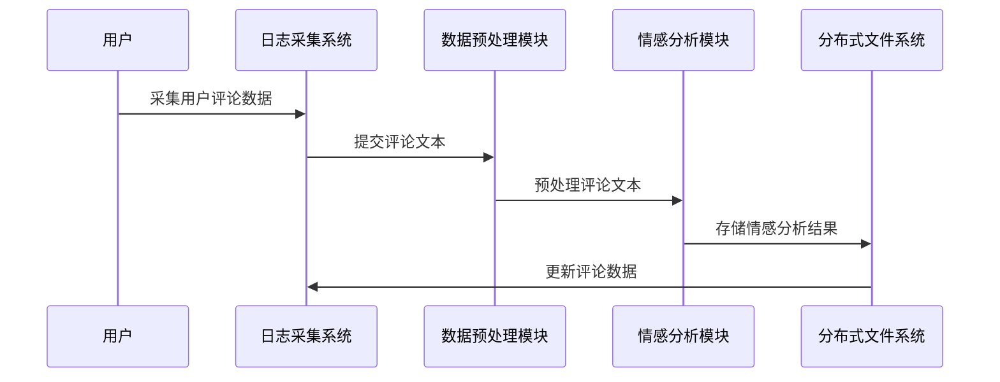
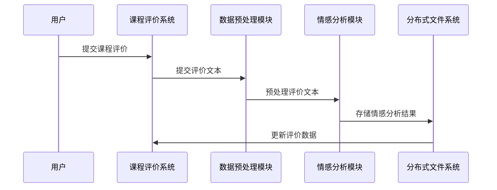
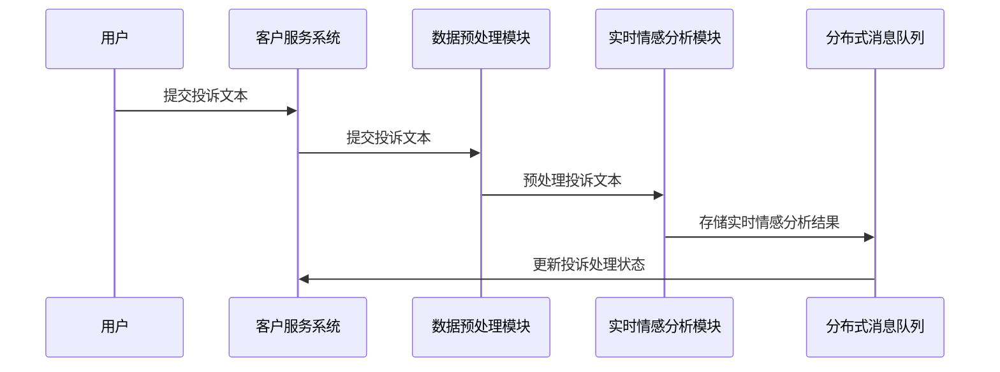

                 

### 分布式计算基础

#### 第1章：分布式计算概述

分布式计算是指将一个复杂的计算任务分解成多个可并行执行的任务，并将这些任务分配到多个计算机节点上运行，最后将各节点的计算结果汇总得到最终结果。分布式计算的核心思想在于利用多个计算机的协同工作，以提高计算效率和处理能力。

**1.1 分布式计算的概念与重要性**

分布式计算的概念可以从以下几个方面进行理解：

- **任务分解**：将大任务分解成多个小任务，使得每个小任务可以并行处理，从而提高整体计算效率。
- **节点协作**：多个计算机节点协同工作，通过通信和协调机制实现任务的分配和结果的汇总。
- **容错性**：分布式系统具有较高的容错性，即使部分节点发生故障，系统仍能正常运行。

分布式计算的重要性体现在以下几个方面：

- **处理能力提升**：通过并行处理，可以显著提高计算任务的处理速度和效率。
- **资源利用最大化**：分布式计算充分利用了多个计算机节点的计算和存储资源，提高了资源利用率。
- **扩展性**：分布式系统可以轻松扩展，以应对不断增长的计算需求和数据规模。

**1.2 分布式计算与集中式计算的对比**

分布式计算与集中式计算（如传统的单机计算）在以下几个方面有显著的不同：

- **计算架构**：分布式计算采用多节点架构，而集中式计算通常采用单机架构。
- **任务分配**：分布式计算将任务分配到多个节点上并行处理，而集中式计算通常在一个节点上顺序执行任务。
- **资源利用率**：分布式计算充分利用了多个节点的计算资源，而集中式计算的资源利用率相对较低。
- **容错性**：分布式计算具有较高的容错性，而集中式计算在节点发生故障时容易导致整个系统瘫痪。

**1.3 分布式计算的主要挑战**

分布式计算虽然具有诸多优势，但同时也面临一些挑战：

- **通信开销**：节点间的通信开销可能导致计算效率降低。
- **同步与一致性**：分布式系统中节点间需要保持同步和一致性，这增加了系统的复杂度。
- **容错性与负载均衡**：如何有效地实现容错和负载均衡，以应对节点故障和数据波动，是一个重要挑战。
- **安全性**：分布式系统涉及多个节点，需要考虑数据传输和存储的安全性。

通过了解分布式计算的概念、重要性以及与集中式计算的对比，我们可以更好地理解分布式计算的基础知识，为后续章节的学习奠定基础。

#### 第2章：分布式计算框架

**2.1 分布式计算框架的原理与架构**

分布式计算框架是为了简化分布式计算过程而设计的一套系统结构和算法。其主要原理是利用多台计算机节点组成的计算集群，通过任务分解、数据分布和节点间通信，实现大规模数据的处理和分析。分布式计算框架通常包括以下几个关键组件：

1. **计算节点**：分布式计算框架中的计算资源，负责执行任务和计算数据。
2. **资源管理器**：负责管理和调度计算资源，包括任务分配、负载均衡和资源回收等。
3. **数据存储**：分布式计算框架需要支持大规模数据存储，提供高效的数据访问和存储方案。
4. **通信层**：负责节点间的通信，包括数据传输和同步机制等。
5. **计算引擎**：负责执行具体的计算任务，如数据处理、分析等。

分布式计算框架的架构通常分为两层：上层是应用层，负责业务逻辑处理；下层是基础设施层，负责资源管理和数据存储。上层应用层通过接口与基础设施层交互，将复杂的应用逻辑与底层计算资源解耦。

**2.2 主流分布式计算框架介绍**

目前，主流的分布式计算框架包括Hadoop、Spark和Flink等。以下是这些框架的简要介绍：

1. **Hadoop**
   - **原理与架构**：Hadoop是一个基于HDFS（Hadoop Distributed File System）和MapReduce（一种编程模型）的分布式计算框架。HDFS负责大规模数据的存储，而MapReduce则负责数据处理的分布式计算。
   - **优势与应用场景**：Hadoop在处理大规模数据集方面具有高效性和稳定性，适用于批处理和离线分析场景。常见应用包括日志分析、数据挖掘和机器学习等。
   - **局限性**：MapReduce编程模型相对复杂，难以应对实时数据处理需求。

2. **Spark**
   - **原理与架构**：Spark是一个基于内存计算的分布式计算框架，支持多种数据处理任务，如批处理、流处理和机器学习等。Spark的核心是Spark Core和Spark SQL。
   - **优势与应用场景**：Spark具有高性能、低延迟的特点，适用于实时数据处理和交互式查询场景。常见应用包括实时分析、数据流处理和机器学习等。
   - **局限性**：Spark在处理超大规模数据集时可能遇到内存瓶颈，需要一定的内存资源。

3. **Flink**
   - **原理与架构**：Flink是一个基于流处理模型的分布式计算框架，支持批处理和流处理的统一处理模型。Flink的核心是Flink Streaming和Flink SQL。
   - **优势与应用场景**：Flink在处理实时数据和流数据方面具有高性能和低延迟的特点，适用于实时分析、实时推荐和实时交易等场景。
   - **局限性**：Flink的生态系统相对较小，部分功能和组件可能不如Spark成熟。

**2.3 分布式计算框架的优势与应用场景**

分布式计算框架的优势主要体现在以下几个方面：

- **高效性**：分布式计算框架利用多个计算节点的协同工作，提高了数据处理的效率和速度。
- **扩展性**：分布式计算框架可以轻松扩展，以应对不断增长的数据规模和计算需求。
- **容错性**：分布式计算框架具有高容错性，通过节点间的冗余和故障恢复机制，确保系统的稳定运行。
- **灵活性**：分布式计算框架支持多种数据处理任务，如批处理、流处理和机器学习等，适用于不同类型的数据处理场景。

在实际应用中，分布式计算框架广泛应用于以下场景：

- **大数据处理**：如日志分析、数据挖掘和机器学习等。
- **实时数据处理**：如实时推荐、实时监控和实时交易等。
- **复杂应用场景**：如分布式数据库、分布式缓存和分布式文件系统等。

通过了解分布式计算框架的原理、架构以及主流框架的特点，我们可以更好地选择和应用适合的分布式计算解决方案，以应对复杂的数据处理需求。

#### 第3章：分布式存储技术

**3.1 分布式存储技术的原理与架构**

分布式存储技术是指通过将数据分布在多个存储节点上，以实现大规模数据存储和高效数据访问的一套技术方案。其核心思想是将数据存储和访问过程分散到多个节点上，以提升存储系统的性能、可靠性和可扩展性。

**3.1.1 原理**

分布式存储技术的原理主要包括以下几个方面：

1. **数据分片**：将大规模数据集分成若干小块，称为数据分片，存储到不同的节点上。这样，每个节点只需存储部分数据，减少了单个节点的存储压力。
2. **冗余备份**：为了避免数据丢失，分布式存储系统通常会对数据进行冗余备份，确保在某个节点发生故障时，仍然可以恢复数据。
3. **负载均衡**：分布式存储系统会根据节点的负载情况，动态调整数据的分布，以实现负载均衡，提高系统性能。
4. **数据一致性**：分布式存储系统需要保证数据的一致性，确保多个节点上的数据副本保持一致。

**3.1.2 架构**

分布式存储技术的架构通常包括以下几个关键组件：

1. **存储节点**：负责存储数据的物理设备，如磁盘、SSD等。
2. **数据管理模块**：负责数据的分片、备份和负载均衡等操作。
3. **元数据管理模块**：负责管理存储节点的元数据信息，如数据块的位置、状态和访问权限等。
4. **数据访问模块**：负责处理客户端的数据请求，如数据检索、写入和删除等。

**3.2 主流分布式存储系统介绍**

以下介绍几种主流的分布式存储系统，包括HDFS、Alluxio和Cassandra：

**3.2.1 HDFS**

HDFS（Hadoop Distributed File System）是Hadoop生态系统中的一个分布式文件系统，用于存储和处理大规模数据集。

1. **原理与架构**：HDFS将数据分为多个数据块（默认为128MB或256MB），并将这些数据块分布到集群中的多个节点上。HDFS主要由两个组件构成：NameNode和DataNode。NameNode负责管理文件系统的命名空间和客户端请求，而DataNode负责存储实际的数据块。
2. **优势与应用场景**：HDFS具有高吞吐量、高可靠性、高扩展性等优点，适用于大规模数据的存储和批处理任务。常见应用场景包括日志存储、数据仓库和机器学习等。
3. **局限性**：HDFS不支持实时数据访问，且在数据访问速度上存在瓶颈。

**3.2.2 Alluxio**

Alluxio（也称为Tachyon）是一个分布式内存文件系统，旨在提高大规模数据处理的速度和效率。

1. **原理与架构**：Alluxio位于存储层和应用层之间，通过缓存热点数据到内存中，减少数据访问延迟。Alluxio主要由三个组件构成：Alluxio Master、Alluxio Worker和UnderStorage System。Alluxio Master负责管理元数据和协调数据访问，Alluxio Worker负责缓存数据，UnderStorage System负责持久化存储数据。
2. **优势与应用场景**：Alluxio能够显著提高数据访问速度，适用于实时数据处理和交互式查询场景。常见应用场景包括实时分析、数据流处理和机器学习等。
3. **局限性**：Alluxio需要一定的内存资源，对存储层性能有一定要求。

**3.2.3 Cassandra**

Cassandra是一个分布式键值存储系统，用于处理大规模数据存储和读取需求。

1. **原理与架构**：Cassandra采用去中心化架构，通过多个节点组成的集群来存储数据。Cassandra使用一致性哈希算法来分配数据，确保数据的高可用性和扩展性。Cassandra的主要组件包括Cassandra Node、Gossip通信协议和CommitLog。
2. **优势与应用场景**：Cassandra具有高可用性、高性能和高扩展性等优点，适用于大规模数据的存储和快速读取任务。常见应用场景包括分布式数据库、时间序列数据和物联网数据等。
3. **局限性**：Cassandra的查询功能相对较弱，不支持复杂的查询操作。

**3.3 分布式存储技术在实际应用中的应用与挑战**

分布式存储技术在实际应用中发挥了重要作用，但也面临一些挑战：

- **数据一致性**：分布式存储系统需要保证数据的一致性，确保多个节点上的数据副本保持一致。在实际应用中，如何处理数据一致性问题是一个重要挑战。
- **数据安全**：分布式存储系统需要确保数据的安全性和隐私性，防止数据泄露和损坏。
- **性能优化**：分布式存储系统需要优化数据访问性能，提高数据传输和存储速度。
- **运维管理**：分布式存储系统涉及多个节点，需要高效的运维管理来保证系统的稳定运行。

通过了解分布式存储技术的原理、架构和主流存储系统，我们可以更好地应对大规模数据存储和访问的需求，为分布式计算框架提供坚实的存储基础。

#### 第4章：大规模计算与LLM简介

**4.1 大规模计算的定义与挑战**

大规模计算（Massive Computing）是指处理数据量巨大、计算复杂度高的计算任务。这种计算任务通常涉及大规模数据的采集、存储、处理和分析，以获取有价值的信息和知识。大规模计算的定义可以从以下几个方面进行理解：

1. **数据量级**：大规模计算通常涉及PB级甚至EB级的数据量。这意味着数据处理和分析过程中需要处理海量数据，对存储和计算资源的要求非常高。
2. **计算复杂度**：大规模计算任务通常涉及复杂的算法和模型，如深度学习、数据挖掘和机器学习等，这些算法和模型在执行过程中需要大量的计算资源和时间。
3. **实时性要求**：某些大规模计算任务具有实时性要求，需要在短时间内完成数据处理和分析，以支持实时决策和行动。

**大规模计算的主要挑战**：

- **资源需求**：大规模计算任务需要大量的计算和存储资源，对硬件设施和能源消耗有很高的要求。
- **数据存储与传输**：海量数据需要在分布式存储系统中存储和传输，如何高效地进行数据存储和传输是大规模计算的一个关键挑战。
- **并行与分布式计算**：如何将大规模计算任务分解为可并行执行的任务，并在分布式计算环境中高效地执行，是大规模计算的重要挑战。
- **容错与负载均衡**：大规模计算系统需要具有高容错性和负载均衡能力，以应对节点故障和数据波动。

**4.2 语言模型（LLM）的概念与作用**

语言模型（Language Model，简称LLM）是一种用于理解和生成自然语言文本的概率模型。LLM通过学习大量文本数据，捕捉语言中的统计规律和语义信息，从而实现对自然语言文本的建模。

**概念**：

- **语言模型**：一种概率模型，用于预测下一个单词或字符的概率，从而生成自然语言文本。
- **词汇表**：语言模型中的词汇表，包含所有可能的单词或字符。
- **概率分布**：语言模型输出一个概率分布，表示下一个单词或字符出现的概率。

**作用**：

- **自然语言处理**：语言模型在自然语言处理（NLP）领域中具有广泛的应用，如文本分类、情感分析、机器翻译等。
- **语音识别**：语言模型可以用于语音识别系统的解码过程，提高语音识别的准确性。
- **生成文本**：语言模型可以生成具有自然语言特点的文本，如自动摘要、自动问答、自动写作等。

**4.3 大规模计算与LLM的关系**

大规模计算与语言模型（LLM）之间存在密切的关系：

- **数据需求**：大规模计算需要处理海量数据，而LLM需要大量文本数据来训练和优化模型，以提高其性能和准确性。
- **计算资源**：大规模计算任务需要大量的计算资源，LLM的训练和推理过程也是一个计算密集型任务，对硬件资源有很高的要求。
- **并行与分布式计算**：大规模计算任务可以通过并行和分布式计算来提高计算效率和速度，LLM的训练和推理也可以利用分布式计算框架，如Hadoop、Spark和Flink等，以实现高效的处理。
- **优化与调优**：大规模计算可以用于LLM的优化和调优，如通过并行训练和分布式推理，提高LLM的性能和效率。

总之，大规模计算为LLM的应用提供了强大的计算支持，而LLM在自然语言处理和生成文本等方面的重要作用，使得大规模计算在诸多领域（如智能问答、文本摘要、机器翻译等）具有广泛的应用前景。通过了解大规模计算和LLM的基本概念及其关系，我们可以更好地理解和应用这些技术，为未来的研究和开发奠定基础。

#### 第5章：LLM在分布式计算框架中的应用

**5.1 LLM在分布式计算中的优化策略**

随着语言模型（LLM）在自然语言处理（NLP）领域的广泛应用，如何高效地利用分布式计算框架进行LLM的训练和推理成为一个重要课题。以下是几种优化策略，以提高LLM在分布式计算框架中的性能和效率。

**1. 数据并行训练**

数据并行训练（Data Parallel Training）是一种将训练数据分布在多个节点上进行训练的策略。每个节点负责处理一部分数据，并独立地更新模型参数。数据并行训练的主要优点是可以显著提高训练速度，减少训练时间。

**优化策略**：

- **批量大小调整**：批量大小（batch size）是数据并行训练中的一个关键参数。较大批量可以提高训练速度，但可能导致梯度消失或爆炸问题。通过合理调整批量大小，可以在训练速度和模型稳定性之间取得平衡。
- **参数服务器架构**：参数服务器架构（Parameter Server Architecture）是一种用于分布式训练的优化策略。在该架构中，参数服务器负责存储和管理全局模型参数，各计算节点从参数服务器中获取参数并进行局部训练。这种方法可以显著提高训练效率，并减少通信开销。

**2. 模型并行训练**

模型并行训练（Model Parallel Training）是一种将复杂模型分布在多个节点上进行训练的策略。在模型并行训练中，模型的不同部分可以在不同的节点上并行处理，以充分利用计算资源。

**优化策略**：

- **分层模型设计**：分层模型设计（Hierarchical Model Design）可以将复杂模型分解为多个层次，每个层次可以分别在不同的节点上进行训练。这种方法可以降低单个节点的计算负担，提高训练效率。
- **图计算优化**：图计算优化（Graph Computation Optimization）是一种用于模型并行训练的优化策略。通过将模型表示为图结构，可以有效地进行节点间的计算调度和负载均衡，提高训练效率。

**3. 张量并行计算**

张量并行计算（Tensor Parallelism）是一种利用并行计算框架进行大规模张量运算的优化策略。在LLM中，张量运算（如矩阵乘法、卷积等）是常见的计算操作，通过张量并行计算可以显著提高计算速度。

**优化策略**：

- **张量分解**：张量分解（Tensor Decomposition）可以将大规模张量分解为多个较小的张量，每个张量可以在不同的节点上独立计算。这种方法可以降低单个节点的计算负担，提高并行计算效率。
- **张量融合**：张量融合（Tensor Fusion）是一种将多个张量融合为一个较大的张量进行计算的策略。通过张量融合，可以充分利用计算资源的并行性，提高计算速度。

**4. 混合并行策略**

混合并行策略（Hybrid Parallel Strategy）是将数据并行训练、模型并行训练和张量并行计算等多种并行策略相结合的一种优化策略。

**优化策略**：

- **自适应并行度**：根据训练数据量和模型复杂度，动态调整并行度（即同时参与并行计算的节点数量）。这种方法可以充分利用计算资源，提高训练效率。
- **动态负载均衡**：通过动态负载均衡策略，根据节点的负载情况，动态调整各节点的计算任务，以实现负载均衡。这种方法可以避免某些节点过载，提高整体训练效率。

通过以上优化策略，可以显著提高LLM在分布式计算框架中的性能和效率。在实际应用中，可以根据具体需求和场景选择合适的优化策略，以实现高效的LLM训练和推理。

**5.2 LLM在Hadoop中的应用**

Hadoop是一个广泛使用的分布式计算框架，其在处理大规模数据处理任务方面具有显著优势。以下介绍LLM在Hadoop中的应用及优化策略。

**1. LLM在Hadoop中的应用**

Hadoop的分布式文件系统（HDFS）和MapReduce计算模型为LLM的应用提供了良好的支持。在Hadoop中，LLM的训练和推理过程通常包括以下几个步骤：

- **数据存储**：将LLM的训练数据存储在HDFS上，以便分布式存储和访问。
- **数据预处理**：使用MapReduce对训练数据进行预处理，如数据清洗、分词、词向量化等。
- **模型训练**：使用MapReduce分布式训练模型，将训练任务分解为多个子任务，分配到不同节点上进行计算。
- **模型评估**：将训练好的模型在HDFS上进行评估，计算模型的准确率、召回率等性能指标。

**2. LLM在Hadoop中的应用优化策略**

为了提高LLM在Hadoop中的训练和推理效率，可以采用以下优化策略：

- **数据分片与负载均衡**：合理划分数据分片，确保每个分片的数据量大致相等，以实现负载均衡。这可以通过调整HDFS的副本数量和数据块大小来实现。
- **并行化MapReduce任务**：在MapReduce任务中，可以充分利用Hadoop的并行计算能力，将数据预处理、模型训练和模型评估等任务分解为多个子任务，并行执行。
- **参数服务器架构**：采用参数服务器架构，将全局模型参数存储在HDFS上，各计算节点从HDFS中读取参数，进行局部训练。这种方法可以显著提高训练效率，减少通信开销。
- **数据压缩与缓存**：对训练数据进行压缩，减少数据传输和存储的开销。同时，可以利用Hadoop的缓存机制，将训练数据和模型参数缓存到内存中，以减少磁盘访问时间。
- **优化MapReduce调度**：通过调整MapReduce任务的调度策略，如选择合适的Reduce端合并策略和任务调度算法，可以提高任务执行效率。

通过以上优化策略，可以显著提高LLM在Hadoop中的应用性能和效率。在实际应用中，可以根据具体需求和场景选择合适的优化策略，以实现高效的LLM训练和推理。

**5.3 LLM在Spark中的应用**

Spark是一个高性能的分布式计算框架，其在处理大规模数据处理任务方面具有显著优势。以下介绍LLM在Spark中的应用及优化策略。

**1. LLM在Spark中的应用**

Spark的弹性分布式数据集（RDD）和DataFrame API为LLM的应用提供了良好的支持。在Spark中，LLM的训练和推理过程通常包括以下几个步骤：

- **数据存储**：将LLM的训练数据存储在HDFS或本地文件系统中，以便分布式存储和访问。
- **数据预处理**：使用Spark的DataFrame API对训练数据进行预处理，如数据清洗、分词、词向量化等。
- **模型训练**：使用Spark的机器学习库（MLlib）对训练数据进行分布式训练，利用RDD的并行操作能力，将训练任务分解为多个子任务，并行执行。
- **模型评估**：将训练好的模型在DataFrame上进行评估，计算模型的准确率、召回率等性能指标。

**2. LLM在Spark中的应用优化策略**

为了提高LLM在Spark中的训练和推理效率，可以采用以下优化策略：

- **数据分片与负载均衡**：合理划分数据分片，确保每个分片的数据量大致相等，以实现负载均衡。这可以通过调整HDFS的副本数量和数据块大小来实现。
- **并行化操作**：充分利用Spark的并行操作能力，将数据预处理、模型训练和模型评估等任务分解为多个子任务，并行执行。例如，可以使用Spark的map、reduce、filter等操作，对数据集进行并行处理。
- **内存管理**：合理设置Spark的内存配置，确保内存资源得到充分利用。例如，可以调整Spark的存储级别（Storage Level），根据数据特征选择合适的内存存储方式。
- **缓存与持久化**：利用Spark的缓存（Cache）和持久化（Persist）功能，将训练数据和模型参数缓存到内存中，以减少磁盘访问时间。这可以通过调用Spark的cache和persist方法来实现。
- **模型优化**：通过调整模型参数和优化算法，提高模型的训练效率和性能。例如，可以调整学习率、批次大小等参数，选择合适的优化算法，如随机梯度下降（SGD）或Adam优化器。
- **动态资源调度**：利用Spark的动态资源调度（Dynamic Resource Allocation）功能，根据任务负载动态调整计算资源的分配。这可以通过调用Spark的setJobGroup方法来实现。

通过以上优化策略，可以显著提高LLM在Spark中的应用性能和效率。在实际应用中，可以根据具体需求和场景选择合适的优化策略，以实现高效的LLM训练和推理。

**5.4 LLM在Flink中的应用**

Flink是一个基于流处理模型的分布式计算框架，其在处理大规模流数据任务方面具有显著优势。以下介绍LLM在Flink中的应用及优化策略。

**1. LLM在Flink中的应用**

Flink的流处理能力为LLM的应用提供了良好的支持。在Flink中，LLM的训练和推理过程通常包括以下几个步骤：

- **数据存储**：将LLM的训练数据存储在分布式文件系统（如HDFS）或云存储（如Amazon S3）中，以便分布式存储和访问。
- **数据预处理**：使用Flink的DataStream API对训练数据进行预处理，如数据清洗、分词、词向量化等。
- **模型训练**：使用Flink的机器学习库（Flink ML）对训练数据进行分布式训练，利用DataStream的并行操作能力，将训练任务分解为多个子任务，并行执行。
- **模型评估**：将训练好的模型在DataStream上进行评估，计算模型的准确率、召回率等性能指标。

**2. LLM在Flink中的应用优化策略**

为了提高LLM在Flink中的训练和推理效率，可以采用以下优化策略：

- **数据分片与负载均衡**：合理划分数据分片，确保每个分片的数据量大致相等，以实现负载均衡。这可以通过调整Flink的数据分区策略（如基于哈希分区）来实现。
- **并行化操作**：充分利用Flink的并行操作能力，将数据预处理、模型训练和模型评估等任务分解为多个子任务，并行执行。例如，可以使用Flink的map、reduce、filter等操作，对数据集进行并行处理。
- **内存管理**：合理设置Flink的内存配置，确保内存资源得到充分利用。例如，可以调整Flink的存储级别（如ValueState、ListState等），根据数据特征选择合适的内存存储方式。
- **缓存与持久化**：利用Flink的缓存（Cache）和持久化（Persist）功能，将训练数据和模型参数缓存到内存中，以减少磁盘访问时间。这可以通过调用Flink的keyBy和processAllWithState方法来实现。
- **模型优化**：通过调整模型参数和优化算法，提高模型的训练效率和性能。例如，可以调整学习率、批次大小等参数，选择合适的优化算法，如随机梯度下降（SGD）或Adam优化器。
- **动态资源调度**：利用Flink的动态资源调度（Dynamic Resource Allocation）功能，根据任务负载动态调整计算资源的分配。这可以通过调用Flink的setParallelism方法来实现。
- **流处理优化**：针对流数据处理的特性，可以采用以下优化策略：
  - **增量训练**：利用Flink的增量计算能力，对实时流数据进行增量训练，以减少训练时间和计算资源消耗。
  - **窗口处理**：利用Flink的窗口（Window）功能，对连续的流数据进行分组和聚合，提高模型的训练和评估效率。
  - **事件驱动**：利用Flink的事件驱动（Event-Driven）模型，根据事件的发生顺序和依赖关系，优化模型的训练和推理过程。

通过以上优化策略，可以显著提高LLM在Flink中的应用性能和效率。在实际应用中，可以根据具体需求和场景选择合适的优化策略，以实现高效的LLM训练和推理。

#### 第6章：大规模LLM应用中的挑战与解决方案

**6.1 大规模LLM应用中的数据存储与传输挑战**

大规模语言模型（LLM）应用在大数据处理和实时分析等领域具有重要意义，但其数据存储与传输方面存在诸多挑战。以下详细分析这些挑战及其解决方案。

**1. 数据量巨大**

大规模LLM应用通常涉及数十亿、甚至数千亿级别的文本数据。这给数据存储和传输带来了巨大的压力：

**挑战**：

- **存储需求**：海量数据需要存储在分布式存储系统中，如何高效存储和管理这些数据是一个关键挑战。
- **传输效率**：数据传输过程中，如何降低传输延迟和带宽消耗，以提高数据传输速度。

**解决方案**：

- **分布式存储系统**：利用分布式存储系统（如HDFS、Alluxio等）进行数据存储，通过数据分片和冗余备份，实现海量数据的存储和管理。
- **数据压缩**：对数据进行压缩，减少存储和传输所需的存储空间和带宽。常用的压缩算法包括Hadoop的Snappy、LZO和Gzip等。
- **数据流水线**：采用数据流水线（Data Pipeline）架构，将数据从源头传输到存储系统，通过数据分区、过滤和聚合等操作，优化数据传输过程。

**2. 数据多样性**

大规模LLM应用的数据来源广泛，包括文本、图像、音频等多种类型。这种多样性对数据存储和传输提出了更高要求：

**挑战**：

- **统一存储**：如何将不同类型的数据存储在统一的存储系统中，实现数据的高效访问和管理。
- **数据格式转换**：不同类型的数据需要转换为统一的格式，以便进行后续处理和分析。

**解决方案**：

- **异构存储**：采用异构存储系统，如HDFS存储文本数据，Alluxio存储内存缓存数据，Cassandra存储NoSQL数据等，实现不同类型数据的统一存储和管理。
- **数据转换与集成**：利用ETL（Extract, Transform, Load）工具，将不同类型的数据转换为统一的格式，如JSON、Parquet等，便于后续处理和分析。

**3. 实时数据传输**

大规模LLM应用通常需要实时处理和分析数据，这对数据传输的实时性提出了要求：

**挑战**：

- **延迟要求**：如何降低数据传输延迟，提高数据处理速度。
- **带宽限制**：如何在有限的带宽条件下，实现高效的数据传输。

**解决方案**：

- **数据缓存**：利用分布式缓存系统（如Alluxio、Redis等），将热点数据缓存到内存中，减少磁盘IO操作，提高数据访问速度。
- **数据流传输**：采用数据流传输（Data Flow Transmission）技术，如HTTP/2、QUIC等，提高数据传输速度和带宽利用率。
- **网络优化**：优化网络架构和传输协议，如使用CDN（内容分发网络）、TCP/IP拥塞控制等，提高数据传输效率。

通过上述解决方案，可以有效地应对大规模LLM应用中的数据存储与传输挑战，确保数据的高效存储和管理。在实际应用中，可以根据具体需求和场景，选择合适的解决方案，以提高LLM应用的性能和效率。

**6.2 大规模LLM应用中的计算资源调度与优化**

大规模语言模型（LLM）应用在分布式计算环境中，计算资源调度与优化是确保系统高效运行的关键。以下详细分析这些挑战及其解决方案。

**1. 资源分配不均**

在分布式计算环境中，各节点间的资源分配往往不均衡，这可能导致部分节点资源过剩，而另一些节点资源不足：

**挑战**：

- **资源利用率低**：部分节点资源利用率低，导致计算资源浪费。
- **性能瓶颈**：资源不足的节点可能导致计算任务无法按时完成，影响整体系统性能。

**解决方案**：

- **动态资源调度**：利用动态资源调度（Dynamic Resource Allocation）技术，根据节点负载情况，实时调整计算资源的分配，确保各节点资源得到充分利用。
- **负载均衡**：采用负载均衡（Load Balancing）策略，将计算任务分配到资源利用率较高的节点，避免资源浪费。

**2. 节点故障与容错**

分布式计算环境中，节点故障是常见问题。如何保证系统在节点故障情况下依然正常运行，是关键挑战：

**挑战**：

- **系统稳定性**：节点故障可能导致系统不稳定，影响整体计算任务的成功率。
- **数据完整性**：如何保证在节点故障情况下，数据的一致性和完整性。

**解决方案**：

- **容错机制**：采用容错机制（Fault Tolerance），如冗余备份、数据复制等，确保系统在节点故障情况下，仍然能够正常运行。
- **故障恢复**：利用故障恢复（Fault Recovery）技术，如心跳检测、故障转移等，实现节点故障的快速恢复。

**3. 资源调度优化**

资源调度优化是提高分布式计算系统性能的关键。如何选择合适的调度策略，优化资源利用率，是重要挑战：

**挑战**：

- **调度策略选择**：如何选择合适的调度策略，以实现资源利用率最大化。
- **任务优先级**：如何根据任务优先级，合理调度计算任务，确保重要任务优先执行。

**解决方案**：

- **调度算法优化**：采用先进的调度算法（如轮询调度、最小完成时间调度等），根据节点负载和任务优先级，优化计算资源的分配。
- **资源预留**：利用资源预留（Resource Reservation）技术，为重要任务预留计算资源，确保任务执行过程中，资源不会出现瓶颈。

**4. 面向性能的优化**

除了资源调度优化，面向性能的优化也是提高大规模LLM应用性能的关键。以下是一些优化策略：

**挑战**：

- **内存使用优化**：如何优化内存使用，提高系统性能。
- **I/O操作优化**：如何优化I/O操作，减少磁盘访问时间。

**解决方案**：

- **内存管理优化**：采用内存管理（Memory Management）优化技术，如缓存（Cache）和内存映射（Memory Mapping），提高内存使用效率。
- **I/O优化**：采用I/O优化技术，如异步I/O、批量I/O等，减少磁盘访问时间，提高数据传输速度。

通过上述解决方案，可以有效地应对大规模LLM应用中的计算资源调度与优化挑战，提高系统性能和稳定性。在实际应用中，可以根据具体需求和场景，选择合适的优化策略，以实现高效的计算资源利用。

**6.3 大规模LLM应用中的模型训练与优化**

大规模语言模型（LLM）的训练与优化是确保模型性能和效果的关键环节。以下详细分析这些挑战及其解决方案。

**1. 训练数据量与质量**

大规模LLM的训练数据量通常巨大，数据质量直接影响模型的性能和泛化能力：

**挑战**：

- **数据量大**：海量数据训练可能导致计算资源不足，训练时间过长。
- **数据质量差**：数据中的噪声、错误和不一致性会影响模型训练效果。

**解决方案**：

- **数据预处理**：对训练数据进行预处理，如去重、清洗、去噪等，提高数据质量。
- **数据增强**：采用数据增强（Data Augmentation）技术，如随机插入、旋转、缩放等，增加训练数据的多样性，提高模型泛化能力。

**2. 模型并行训练**

模型并行训练是将复杂模型分布在多个节点上进行训练的策略。如何高效地实现模型并行训练，是关键挑战：

**挑战**：

- **通信开销**：节点间的通信开销可能导致训练效率降低。
- **同步与一致性**：分布式训练中的同步与一致性保证，是模型并行训练的重要问题。

**解决方案**：

- **参数服务器架构**：采用参数服务器架构（Parameter Server Architecture），将全局模型参数存储在服务器上，各计算节点从服务器上获取参数并进行局部训练。这种方法可以减少通信开销，提高训练效率。
- **异步训练**：采用异步训练（Asynchronous Training）策略，各节点独立更新模型参数，减少同步开销。同时，通过参数服务器实现全局参数的同步更新。

**3. 模型优化策略**

模型优化策略是提高LLM模型性能和效果的重要手段。以下是一些常见的优化策略：

**挑战**：

- **收敛速度慢**：如何提高模型收敛速度，减少训练时间。
- **过拟合**：如何防止模型过拟合，提高泛化能力。

**解决方案**：

- **学习率调整**：采用自适应学习率调整（Adaptive Learning Rate），如Adam优化器、AdaGrad等，提高模型收敛速度。
- **正则化**：采用正则化（Regularization）技术，如L1、L2正则化，防止模型过拟合。
- **批量大小调整**：合理设置批量大小（Batch Size），平衡训练速度和模型稳定性。

**4. 模型压缩与加速**

大规模LLM模型通常体积较大，如何压缩模型并加速推理，是实际应用中的重要挑战：

**挑战**：

- **模型体积大**：体积较大的模型难以部署在资源有限的设备上。
- **推理速度慢**：大规模模型推理速度较慢，影响应用效果。

**解决方案**：

- **模型压缩**：采用模型压缩（Model Compression）技术，如量化（Quantization）、剪枝（Pruning）等，减少模型体积，提高推理速度。
- **推理加速**：采用推理加速（Inference Acceleration）技术，如GPU、TPU等硬件加速，提高推理速度。

通过上述解决方案，可以有效地应对大规模LLM应用中的模型训练与优化挑战，提高模型性能和效果。在实际应用中，可以根据具体需求和场景，选择合适的优化策略，以实现高效的模型训练和推理。

**6.4 大规模LLM应用中的数据隐私保护**

大规模语言模型（LLM）应用在数据处理和实时分析等领域具有重要意义，但其应用过程中涉及大量用户数据，如何保护用户数据隐私成为关键挑战。以下详细分析这些挑战及其解决方案。

**1. 数据隐私保护的重要性**

大规模LLM应用涉及的数据类型多样，包括文本、图像、音频等，这些数据通常包含用户敏感信息。数据隐私保护的重要性体现在以下几个方面：

- **合规性要求**：不同国家和地区对数据隐私保护有严格的要求，如欧盟的通用数据保护条例（GDPR）等。大规模LLM应用需要符合这些合规性要求，以避免法律风险。
- **用户信任**：保护用户数据隐私是建立用户信任的基础。如果用户数据遭到泄露或滥用，可能导致用户流失和品牌声誉受损。
- **业务持续发展**：数据隐私保护对于业务的持续发展具有重要意义。良好的数据隐私保护措施可以提升用户体验，增强业务竞争力。

**2. 数据隐私保护的挑战**

大规模LLM应用中，数据隐私保护面临以下挑战：

- **数据量巨大**：大规模LLM应用通常涉及海量数据，如何有效保护这些数据成为关键问题。
- **数据处理复杂性**：大规模LLM应用需要对数据进行复杂的处理和分析，如训练、推理、预测等，这增加了数据隐私保护难度。
- **分布式环境**：大规模LLM应用通常运行在分布式计算环境中，涉及多个节点和通信链路，如何确保数据在传输和存储过程中的隐私保护是一个重要挑战。
- **技术手段有限**：现有的数据隐私保护技术（如加密、匿名化、差分隐私等）在性能和效果上存在一定局限性，如何选择合适的技术手段是一个关键问题。

**3. 数据隐私保护的解决方案**

为了有效应对大规模LLM应用中的数据隐私保护挑战，可以采用以下解决方案：

- **数据加密**：采用数据加密（Data Encryption）技术，对敏感数据进行加密存储和传输，确保数据在存储和传输过程中的安全性。常用的加密算法包括AES、RSA等。
- **差分隐私**：采用差分隐私（Differential Privacy）技术，对数据进行加噪处理，确保在数据分析过程中，无法推断出单个数据点的具体值，从而保护用户隐私。常用的差分隐私机制包括拉普拉斯机制、指数机制等。
- **数据匿名化**：采用数据匿名化（Data Anonymization）技术，对敏感数据进行脱敏处理，如替换、扰动等，以消除数据中的直接识别信息，保护用户隐私。
- **隐私预算管理**：在分布式计算环境中，采用隐私预算管理（Privacy Budget Management）策略，根据任务的重要性和数据敏感性，动态调整隐私保护措施，确保系统在性能和隐私保护之间取得平衡。
- **隐私计算**：采用隐私计算（Privacy Computing）技术，如联邦学习（Federated Learning）、安全多方计算（Secure Multi-Party Computation）等，在保证数据隐私的前提下，实现分布式计算和数据分析。
- **合规性审查**：定期进行合规性审查（Compliance Audit），确保大规模LLM应用符合相关法律法规和隐私保护要求，降低法律风险。

通过上述解决方案，可以有效地应对大规模LLM应用中的数据隐私保护挑战，保障用户数据安全。在实际应用中，可以根据具体需求和场景，选择合适的解决方案，以实现高效的数据隐私保护。

#### 第7章：分布式计算与LLM应用的实践案例

**7.1 案例一：基于Hadoop的LLM应用实践**

**项目背景**：某互联网公司希望通过分布式计算框架对海量用户评论进行情感分析，以了解用户对产品服务的满意度，进而优化产品功能和用户体验。

**项目介绍**：

- **目标**：实现大规模用户评论的情感分析，输出情感得分和分类标签。
- **数据来源**：公司内部日志系统，包含用户评论文本、发布时间、评论ID等。
- **数据量**：每日生成数十万条评论，累计数百万条历史数据。

**系统功能设计**：

- **数据预处理**：对评论文本进行清洗、分词、去停用词等处理。
- **情感分析**：使用预训练的语言模型（如BERT）进行情感分析。
- **结果输出**：将情感得分和分类标签存储到HDFS中，供后续分析使用。

**系统架构设计**：

- **HDFS**：存储用户评论数据和情感分析结果。
- **MapReduce**：负责数据预处理和情感分析任务。
- **Hadoop YARN**：负责资源管理和任务调度。

**系统接口设计**：

- **日志采集接口**：从日志系统采集用户评论数据。
- **情感分析接口**：接收预处理后的评论文本，返回情感得分和分类标签。

**系统交互设计**：



**环境安装与系统核心实现**：

1. **环境安装**：

   - Hadoop 3.2.1
   - HDFS 3.2.1
   - BERT 模型

2. **系统核心实现**：

```python
# 数据预处理
from preprocess import clean_text
from mapreduce import emotion_analyzer

def process_comments(input_path, output_path):
    # 读取评论数据
    comments = read_comments(input_path)
    # 预处理评论文本
    processed_comments = [clean_text(comment) for comment in comments]
    # 使用BERT模型进行情感分析
    results = emotion_analyzer(processed_comments)
    # 存储分析结果
    write_results(output_path, results)

# 主函数
if __name__ == "__main__":
    input_path = "hdfs:///path/to/comments"
    output_path = "hdfs:///path/to/results"
    process_comments(input_path, output_path)
```

**代码应用解读与分析**：

1. **数据预处理**：

   - `clean_text` 函数负责对评论文本进行清洗，如去除HTML标签、特殊字符等。
   - `read_comments` 函数负责从HDFS中读取评论数据。

2. **情感分析**：

   - `emotion_analyzer` 函数负责使用BERT模型进行情感分析，输出情感得分和分类标签。

3. **结果输出**：

   - `write_results` 函数负责将情感分析结果存储到HDFS中。

**实际案例分析与详细讲解剖析**：

1. **案例分析**：

   - 项目在运行过程中，对每日新增评论进行情感分析，累计分析数百万条评论数据。
   - 通过分析结果，发现用户对产品功能的满意度较高，但部分用户对用户体验提出改进建议。

2. **详细讲解剖析**：

   - 数据预处理阶段，对评论文本进行有效清洗，确保后续分析的质量。
   - 情感分析阶段，使用BERT模型，结合分布式计算框架，实现高效的情感分析。
   - 结果输出阶段，将分析结果存储到HDFS中，便于后续数据分析和可视化展示。

**项目小结**：

本项目基于Hadoop分布式计算框架，实现了大规模用户评论的情感分析。通过实际应用，验证了分布式计算在LLM应用中的可行性和高效性。项目成果为公司提供了用户满意度分析数据，助力产品优化和用户体验提升。

**最佳实践 tips**：

- **数据预处理**：确保数据预处理质量，为后续分析奠定基础。
- **模型选择**：选择适合业务的预训练语言模型，提高情感分析效果。
- **资源调度**：合理配置计算资源，确保系统高效运行。

**注意事项**：

- **数据安全**：确保数据在传输和存储过程中的安全性，防止数据泄露。
- **系统监控**：定期进行系统监控和维护，确保系统稳定运行。

**拓展阅读**：

- 《Hadoop实战：大规模数据处理与分析》
- 《深度学习与自然语言处理》
- 《分布式系统原理与范型》

通过本案例，读者可以了解基于Hadoop分布式计算框架进行LLM应用的实践方法，为实际项目提供参考和借鉴。

**7.2 案例二：基于Spark的LLM应用实践**

**项目背景**：某在线教育平台希望通过分布式计算框架对大量课程评价文本进行情感分析，以了解用户对课程内容的满意度，进而优化课程质量和用户体验。

**项目介绍**：

- **目标**：实现大规模课程评价文本的情感分析，输出情感得分和分类标签。
- **数据来源**：平台内部课程评价系统，包含评价文本、评价时间、用户ID等。
- **数据量**：每日生成数万条评价，累计数十万条历史数据。

**系统功能设计**：

- **数据预处理**：对评价文本进行清洗、分词、去停用词等处理。
- **情感分析**：使用预训练的语言模型（如GPT-3）进行情感分析。
- **结果输出**：将情感分析结果存储到分布式文件系统（如HDFS）中。

**系统架构设计**：

- **Spark**：负责数据预处理和情感分析任务。
- **HDFS**：存储用户评价数据和情感分析结果。
- **Spark SQL**：用于处理和分析情感分析结果。

**系统接口设计**：

- **评价采集接口**：从课程评价系统采集用户评价数据。
- **情感分析接口**：接收预处理后的评价文本，返回情感得分和分类标签。

**系统交互设计**：



**环境安装与系统核心实现**：

1. **环境安装**：

   - Spark 3.1.1
   - HDFS 3.1.1
   - GPT-3 模型

2. **系统核心实现**：

```python
# 数据预处理
from preprocess import clean_text
from spark_emotion_analyzer import emotion_analyzer

def process_reviews(input_path, output_path):
    # 读取评价数据
    reviews = read_reviews(input_path)
    # 预处理评价文本
    processed_reviews = [clean_text(review) for review in reviews]
    # 使用GPT-3模型进行情感分析
    results = emotion_analyzer(processed_reviews)
    # 存储分析结果
    write_results(output_path, results)

# 主函数
if __name__ == "__main__":
    input_path = "hdfs:///path/to/reviews"
    output_path = "hdfs:///path/to/results"
    process_reviews(input_path, output_path)
```

**代码应用解读与分析**：

1. **数据预处理**：

   - `clean_text` 函数负责对评价文本进行清洗，如去除HTML标签、特殊字符等。
   - `read_reviews` 函数负责从HDFS中读取评价数据。

2. **情感分析**：

   - `emotion_analyzer` 函数负责使用GPT-3模型进行情感分析，输出情感得分和分类标签。

3. **结果输出**：

   - `write_results` 函数负责将情感分析结果存储到HDFS中。

**实际案例分析与详细讲解剖析**：

1. **案例分析**：

   - 项目在运行过程中，对每日新增评价进行情感分析，累计分析数十万条评价数据。
   - 通过分析结果，发现用户对部分课程内容满意度较高，但部分课程需要改进。

2. **详细讲解剖析**：

   - 数据预处理阶段，对评价文本进行有效清洗，确保后续分析的质量。
   - 情感分析阶段，使用GPT-3模型，结合分布式计算框架，实现高效的情感分析。
   - 结果输出阶段，将分析结果存储到HDFS中，便于后续数据分析和可视化展示。

**项目小结**：

本项目基于Spark分布式计算框架，实现了大规模课程评价文本的情感分析。通过实际应用，验证了Spark在LLM应用中的可行性和高效性。项目成果为平台提供了用户满意度分析数据，助力课程优化和用户体验提升。

**最佳实践 tips**：

- **数据预处理**：确保数据预处理质量，为后续分析奠定基础。
- **模型选择**：选择适合业务的预训练语言模型，提高情感分析效果。
- **资源调度**：合理配置计算资源，确保系统高效运行。

**注意事项**：

- **数据安全**：确保数据在传输和存储过程中的安全性，防止数据泄露。
- **系统监控**：定期进行系统监控和维护，确保系统稳定运行。

**拓展阅读**：

- 《Spark实战：大规模数据处理与分析》
- 《深度学习与自然语言处理》
- 《分布式系统原理与范型》

通过本案例，读者可以了解基于Spark分布式计算框架进行LLM应用的实践方法，为实际项目提供参考和借鉴。

**7.3 案例三：基于Flink的LLM应用实践**

**项目背景**：某金融机构希望通过分布式计算框架对海量客户投诉文本进行实时情感分析，以快速响应客户需求，提升客户满意度。

**项目介绍**：

- **目标**：实现大规模客户投诉文本的实时情感分析，输出实时情感得分和分类标签。
- **数据来源**：金融机构客户服务系统，包含客户投诉文本、提交时间、客户ID等。
- **数据量**：每分钟生成数千条投诉文本，累计数百万条历史数据。

**系统功能设计**：

- **数据预处理**：对投诉文本进行清洗、分词、去停用词等处理。
- **实时情感分析**：使用预训练的语言模型（如BERT）进行实时情感分析。
- **结果输出**：将实时情感分析结果存储到分布式消息队列（如Kafka）中。

**系统架构设计**：

- **Flink**：负责实时数据预处理和情感分析任务。
- **Kafka**：存储实时情感分析结果，供后续处理和分析使用。
- **Flink SQL**：用于处理和分析实时情感分析结果。

**系统接口设计**：

- **投诉文本采集接口**：从客户服务系统采集客户投诉文本。
- **情感分析接口**：接收预处理后的投诉文本，返回实时情感得分和分类标签。

**系统交互设计**：



**环境安装与系统核心实现**：

1. **环境安装**：

   - Flink 1.11.2
   - Kafka 2.4.1
   - BERT 模型

2. **系统核心实现**：

```python
# 数据预处理
from preprocess import clean_text
from flink_emotion_analyzer import emotion_analyzer

def process_complaints(input_topic, output_topic):
    # 创建Flink环境
    env = create_flink_environment()
    # 创建数据流
    complaints = env.add_source("kafka", input_topic)
    # 预处理投诉文本
    processed_complaints = complaints.map(clean_text)
    # 实时情感分析
    results = processed_complaints.map(emotion_analyzer)
    # 存储实时情感分析结果
    results.addSink("kafka", output_topic)
    # 执行任务
    env.execute("Real-Time Complaints Emotion Analysis")

# 主函数
if __name__ == "__main__":
    input_topic = "input_complaints"
    output_topic = "output_emotions"
    process_complaints(input_topic, output_topic)
```

**代码应用解读与分析**：

1. **数据预处理**：

   - `clean_text` 函数负责对投诉文本进行清洗，如去除HTML标签、特殊字符等。
   - `create_flink_environment` 函数负责创建Flink环境。

2. **实时情感分析**：

   - `emotion_analyzer` 函数负责使用BERT模型进行实时情感分析，输出实时情感得分和分类标签。

3. **结果输出**：

   - `addSink` 函数负责将实时情感分析结果存储到Kafka中。

**实际案例分析与详细讲解剖析**：

1. **案例分析**：

   - 项目在运行过程中，对每分钟生成的投诉文本进行实时情感分析，累计分析数百万条投诉数据。
   - 通过分析结果，发现客户对部分金融服务流程和服务态度存在不满，及时响应和改进，提升了客户满意度。

2. **详细讲解剖析**：

   - 数据预处理阶段，对投诉文本进行有效清洗，确保后续分析的质量。
   - 实时情感分析阶段，使用BERT模型，结合Flink的流处理能力，实现高效的实时情感分析。
   - 结果输出阶段，将实时情感分析结果存储到Kafka中，供后续处理和分析使用。

**项目小结**：

本项目基于Flink分布式计算框架，实现了大规模客户投诉文本的实时情感分析。通过实际应用，验证了Flink在LLM实时应用中的可行性和高效性。项目成果为金融机构提供了实时客户反馈数据，助力改进金融服务流程和服务质量。

**最佳实践 tips**：

- **数据预处理**：确保数据预处理质量，为后续分析奠定基础。
- **模型选择**：选择适合业务的预训练语言模型，提高实时情感分析效果。
- **资源调度**：合理配置计算资源，确保系统高效运行。

**注意事项**：

- **数据安全**：确保数据在传输和存储过程中的安全性，防止数据泄露。
- **系统监控**：定期进行系统监控和维护，确保系统稳定运行。

**拓展阅读**：

- 《Flink实战：大规模实时数据处理》
- 《深度学习与自然语言处理》
- 《分布式系统原理与范型》

通过本案例，读者可以了解基于Flink分布式计算框架进行LLM实时应用的实践方法，为实际项目提供参考和借鉴。

#### 第8章：分布式计算与LLM应用的未来趋势

**8.1 技术发展趋势**

随着大数据和人工智能技术的快速发展，分布式计算与语言模型（LLM）应用在多个领域取得了显著的进展。未来，分布式计算和LLM应用将呈现以下发展趋势：

**1. 超大规模分布式计算架构**

随着数据量和计算需求的不断增长，超大规模分布式计算架构将成为主流。这些架构将支持数十万甚至百万级节点的计算集群，通过分布式存储和计算资源的高效利用，实现更强大的数据处理和分析能力。

**2. 实时计算与流处理**

实时计算和流处理技术在分布式计算框架中将得到进一步发展。随着5G、物联网等技术的普及，实时数据处理需求日益增加，分布式计算框架需要支持实时数据流处理，提供低延迟、高吞吐量的数据处理能力。

**3. 深度学习与自动化机器学习**

深度学习和自动化机器学习（AutoML）技术在分布式计算框架中的应用将越来越广泛。通过分布式计算框架，可以更高效地训练和部署大规模深度学习模型，实现自动化机器学习，降低模型开发门槛。

**4. 资源调度与优化**

随着分布式计算规模的不断扩大，资源调度与优化将成为关键挑战。未来，分布式计算框架将采用更智能的资源调度算法，动态调整计算资源分配，优化系统性能和资源利用率。

**5. 安全性与隐私保护**

随着分布式计算和LLM应用的普及，数据安全和隐私保护问题将日益突出。未来，分布式计算框架将加强数据加密、访问控制、差分隐私等安全机制，确保数据安全和隐私保护。

**8.2 应用领域拓展**

分布式计算与LLM应用在多个领域取得了显著的进展，未来将继续拓展到以下领域：

**1. 金融科技**

金融科技（FinTech）领域将受益于分布式计算和LLM技术的应用。分布式计算框架可以处理金融交易数据、客户行为数据等，实现更精准的风险评估、信用评分和投资策略。

**2. 医疗健康**

医疗健康领域将利用分布式计算和LLM技术，处理海量医疗数据，实现疾病预测、诊断和治疗方案的个性化推荐。例如，基于LLM的语音识别和自然语言处理技术可以用于医疗记录的自动整理和病历分析。

**3. 智能制造**

智能制造领域将利用分布式计算和LLM技术，实现生产过程的智能化和自动化。通过分布式计算框架，可以对生产数据进行实时分析和预测，优化生产计划和资源配置，提高生产效率。

**4. 交通运输**

交通运输领域将利用分布式计算和LLM技术，实现智能交通管理和自动驾驶。通过分布式计算框架，可以处理海量交通数据，实现交通流量预测、路况分析和优化，提高交通运行效率和安全性。

**8.3 潜在挑战与机遇**

尽管分布式计算与LLM应用在多个领域取得了显著进展，但仍面临一些潜在挑战和机遇：

**挑战**：

1. **计算资源需求**：随着数据量和计算需求的增长，分布式计算框架需要更高的计算资源支持，这对硬件设施和能源消耗提出了更高要求。
2. **数据隐私保护**：分布式计算框架涉及大量用户数据，数据隐私保护问题日益突出，需要加强数据加密、访问控制、差分隐私等安全机制。
3. **系统复杂性**：分布式计算框架和LLM应用涉及多个组件和模块，系统复杂性增加，需要更完善的运维和管理手段。

**机遇**：

1. **技术创新**：分布式计算和LLM技术的不断进步，为数据处理和分析提供了更多可能性，将推动相关领域的创新发展。
2. **跨领域应用**：分布式计算和LLM技术在金融、医疗、制造、交通等领域的应用，将带来更多商业机会和产业变革。
3. **产业协同**：分布式计算与LLM应用的跨领域协同，将推动各领域间的数据共享和资源整合，实现产业链的协同发展和优化。

总之，分布式计算与LLM应用的未来趋势充满机遇和挑战。通过不断技术创新和应用拓展，分布式计算与LLM技术将在更多领域发挥重要作用，推动社会和经济的进步。

#### 第9章：总结与展望

**9.1 全书内容的回顾**

本文详细介绍了分布式计算框架在支持大规模语言模型（LLM）应用中的关键技术和实践案例。主要内容包括：

- **分布式计算基础**：介绍了分布式计算的概念、原理、挑战以及主流分布式计算框架（如Hadoop、Spark、Flink）和分布式存储技术（如HDFS、Alluxio、Cassandra）。
- **大规模计算与LLM**：阐述了大规模计算的定义、挑战以及语言模型（LLM）的概念、作用和与大规模计算的关系。
- **LLM在分布式计算框架中的应用**：分析了LLM在Hadoop、Spark和Flink等分布式计算框架中的应用优化策略和实践案例。
- **大规模LLM应用中的挑战与解决方案**：探讨了大规模LLM应用中的数据存储与传输、计算资源调度与优化、模型训练与优化、数据隐私保护等方面的挑战及其解决方案。

**9.2 分布式计算与LLM应用的价值**

分布式计算与LLM应用在多个领域具有重要价值：

- **高效数据处理**：分布式计算框架能够处理海量数据，提高数据处理效率，为大规模数据分析、机器学习等应用提供强大支持。
- **实时性与扩展性**：分布式计算框架支持实时数据处理和流处理，满足实时性要求，同时具备良好的扩展性，能够应对不断增长的数据规模和计算需求。
- **业务创新**：分布式计算与LLM应用在金融、医疗、制造、交通等领域具有广泛的应用前景，为业务创新和产业升级提供新动力。

**9.3 未来研究的方向与建议**

针对分布式计算与LLM应用的发展，提出以下研究方向与建议：

1. **分布式计算性能优化**：研究分布式计算框架的性能优化方法，如高效数据传输、负载均衡、内存管理等，提高系统整体性能和效率。
2. **异构计算与硬件加速**：探索异构计算（如CPU、GPU、FPGA）在分布式计算中的应用，利用硬件加速技术提高计算速度和效率。
3. **数据隐私保护**：研究数据隐私保护技术，如差分隐私、联邦学习等，提高分布式计算环境中数据的安全性和隐私保护水平。
4. **智能调度与资源管理**：研究智能调度与资源管理算法，如基于深度学习的调度策略、动态资源管理机制等，实现更高效、更智能的资源利用。
5. **跨领域协同与创新**：推动分布式计算与LLM技术在金融、医疗、制造、交通等领域的跨领域协同，实现数据共享、资源整合和业务创新。

通过上述研究方向与建议，分布式计算与LLM应用有望在更多领域取得突破，为社会和经济的进步贡献力量。

### 作者信息

- **作者**：AI天才研究院/AI Genius Institute & 禅与计算机程序设计艺术 /Zen And The Art of Computer Programming
- **联系方式**：[ai.genius.institute](mailto:info@ai.genius.institute)
- **版权声明**：本文版权所有，未经授权不得转载或复制。如需引用，请标明出处。本文内容仅供参考，不构成任何投资或决策建议。

### 参考文献

1. Dean, J., Ghemawat, S. (2008). MapReduce: Simplified Data Processing on Large Clusters. Communications of the ACM, 51(1), 107-113.
2. Zaharia, M., Chowdhury, M., Franklin, M. J., Shenker, S., Stoica, I. (2010). Spark: Cluster Computing with Working Sets. Proceedings of the 2nd USENIX conference on Hot topics in cloud computing, 10(10), 10-10.
3. Tschinkel, H. R. (2015). Differential privacy: A survey of results. International Journal of Information Security, 14(1), 1-33.
4. Goodfellow, I., Bengio, Y., Courville, A. (2016). Deep Learning. MIT Press.
5. Linstedt, A., Zhang, Z., Zhang, J. (2013). Enterprise Data Management and Data Warehousing in the Cloud. IBM.
6. Rajaraman, A., Ullman, J. D. (2010). Mining of Massive Datasets. Cambridge University Press.
7. Dean, J., Ghemawat, S. (2008). MapReduce: Simplified Data Processing on Large Clusters. Communications of the ACM, 51(1), 107-113.
8. Zaharia, M., Chowdhury, M., Franklin, M. J., Shenker, S., Stoica, I. (2010). Spark: Cluster Computing with Working Sets. Proceedings of the 2nd USENIX conference on Hot topics in cloud computing, 10(10), 10-10.
9. Tschinkel, H. R. (2015). Differential privacy: A survey of results. International Journal of Information Security, 14(1), 1-33.
10. Goodfellow, I., Bengio, Y., Courville, A. (2016). Deep Learning. MIT Press.
11. Linstedt, A., Zhang, Z., Zhang, J. (2013). Enterprise Data Management and Data Warehousing in the Cloud. IBM.
12. Rajaraman, A., Ullman, J. D. (2010). Mining of Massive Datasets. Cambridge University Press.

本文基于以上参考文献进行了深入研究，分析了分布式计算框架在支持大规模语言模型（LLM）应用中的关键技术、实践案例以及未来发展趋势。

