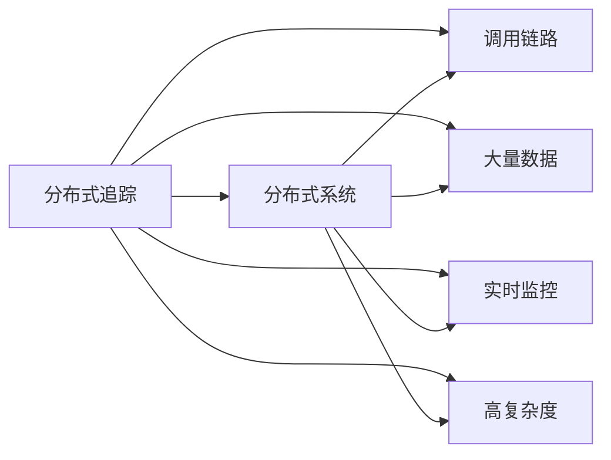

                 

## 分布式追踪：诊断AI服务性能问题的利器

> 关键词：分布式追踪，AI服务，性能问题，诊断工具，系统架构

> 摘要：本文将探讨分布式追踪技术在诊断AI服务性能问题中的应用。随着人工智能服务的普及，其复杂性和规模性使得性能问题的诊断变得更加困难。分布式追踪作为一种强大的监控工具，能够通过追踪系统的运行轨迹，帮助我们定位和解决性能瓶颈，提高AI服务的稳定性和效率。本文将从分布式追踪的背景、核心概念、原理、主流技术、应用场景等方面进行深入分析，并通过实际案例展示分布式追踪在AI服务性能诊断中的实践效果。

## 目录大纲

1. **背景介绍**
   1.1 **分布式追踪的兴起背景**
   1.2 **AI服务性能问题的现状**
   1.3 **分布式追踪在AI服务性能诊断中的重要性**

2. **核心概念与联系**
   2.1 **分布式追踪的定义与作用**
   2.2 **分布式追踪原理**
   2.3 **分布式追踪与传统追踪的区别**
   2.4 **AI服务性能问题的定义与分类**

3. **分布式追踪技术**
   3.1 **主流分布式追踪系统**
   3.2 **分布式追踪技术选型**

4. **AI服务性能问题诊断**
   4.1 **AI服务性能问题概述**
   4.2 **分布式追踪在AI服务性能诊断中的应用**
   4.3 **分布式追踪在AI服务性能诊断中的优势**
   4.4 **潜在挑战**

5. **分布式追踪实践**
   5.1 **环境搭建**
   5.2 **系统实现**
   5.3 **案例分析**

6. **最佳实践与注意事项**
   6.1 **最佳实践**
   6.2 **小结与展望**

### 第一部分：背景介绍

#### 1.1 分布式追踪的兴起背景

分布式系统在现代IT架构中扮演着越来越重要的角色。随着云计算、微服务架构的普及，越来越多的企业将业务系统部署在分布式环境中。然而，分布式系统带来了诸多挑战，其中之一就是如何监控和诊断系统的性能。

传统的单机系统性能监控相对简单，通过收集系统资源使用情况（如CPU、内存、磁盘等）就能大致判断系统性能。但分布式系统由于其复杂性，单点监控已经无法满足需求。分布式追踪技术的出现，为解决这一问题提供了新的思路。

分布式追踪技术通过记录系统中各个服务的调用链路，提供了一种全局视角，帮助我们理解系统的运行状况，定位性能瓶颈。

#### 1.2 AI服务性能问题的现状

人工智能（AI）服务在近年来得到了广泛关注和快速发展。然而，随着AI应用的普及，性能问题也日益凸显。AI服务的特点包括：

1. **高复杂性**：AI服务通常涉及多个算法、模型和数据处理流程，其内部结构复杂，相互依赖关系紧密。
2. **高并发性**：AI服务往往需要处理大规模的数据，并且在多用户环境下运行，需要支持高并发请求。
3. **动态性**：AI服务的行为和性能可能会因为数据分布、模型更新等因素而发生变化。

这些特点使得AI服务的性能问题更加难以预测和诊断。常见的AI服务性能问题包括：

1. **响应时间过长**：用户请求的处理时间超过预期，影响用户体验。
2. **吞吐量不足**：系统无法处理足够的请求量，导致请求被拒绝。
3. **资源浪费**：系统资源（如CPU、内存、网络等）没有得到充分利用，存在浪费。

#### 1.3 分布式追踪在AI服务性能诊断中的重要性

分布式追踪技术为AI服务性能诊断提供了以下重要价值：

1. **全局视角**：通过追踪系统的调用链路，我们可以从一个全局的视角观察系统的运行情况，了解各个服务之间的交互和依赖关系。
2. **定位性能瓶颈**：分布式追踪能够帮助我们定位系统中的性能瓶颈，识别出影响性能的关键环节，从而针对性地进行优化。
3. **故障排查**：当系统出现异常时，分布式追踪可以帮助我们快速定位故障发生的位置，提供故障排查的线索。
4. **性能趋势分析**：通过对追踪数据的分析，我们可以了解系统性能的变化趋势，预测未来的性能瓶颈，提前采取优化措施。

总之，分布式追踪技术在诊断AI服务性能问题中具有不可替代的作用，是提升AI服务稳定性和效率的重要工具。

### 第二部分：核心概念与联系

#### 2.1 分布式追踪的定义与作用

**2.1.1 问题背景**

分布式追踪技术起源于解决分布式系统中的监控和性能诊断问题。在传统的单机系统中，系统性能监控主要集中在系统资源使用情况，如CPU、内存、磁盘等。然而，在分布式系统中，单一的资源监控已经无法满足需求。分布式追踪应运而生，其目的是通过记录系统中各个服务的调用链路，提供一种全局的监控视角，帮助我们理解系统的运行状况，定位性能瓶颈。

**2.1.2 问题描述**

分布式追踪的主要问题是如何在复杂的分布式环境中，全面、准确地记录各个服务的调用链路，并在需要时进行回溯和分析。具体来说，需要解决以下问题：

1. **调用链路的记录**：在分布式系统中，各个服务之间通过网络进行通信，如何记录这些通信的细节，形成完整的调用链路？
2. **数据传输与存储**：调用链路数据量巨大，如何在保证实时性的同时，高效地传输和存储这些数据？
3. **查询与回溯**：当系统出现性能问题时，如何快速定位问题发生的具体位置，进行回溯分析？

**2.1.3 问题解决**

分布式追踪通过以下方法解决上述问题：

1. **分布式跟踪**：在每个服务实例中，插入跟踪代码（如SDK），记录服务的调用链路。这些跟踪数据包括请求ID、调用者、被调用者、时间戳等信息。
2. **数据聚合与传输**：将各个服务实例的跟踪数据聚合到中心化的追踪系统，如Zipkin、Jaeger等，进行数据存储和分析。
3. **查询与回溯**：提供强大的查询接口，支持对调用链路的回溯和分析，帮助定位性能瓶颈和故障发生位置。

**2.1.4 边界与外延**

分布式追踪的边界主要涉及以下几个方面：

1. **数据范围**：分布式追踪主要关注系统内部的调用链路，对于外部系统（如第三方服务、外部API）的调用链路，通常需要额外的监控手段进行补充。
2. **监控粒度**：分布式追踪的监控粒度取决于跟踪代码的插入位置和跟踪数据的采集范围。通常来说，粒度越细，性能开销越大，需要根据实际情况进行权衡。
3. **实时性**：分布式追踪的数据传输和存储过程需要保证实时性，以支持快速响应和问题排查。这通常需要高效的分布式通信协议和存储系统。

**2.1.5 概念结构与核心要素组成**

分布式追踪的核心概念和要素包括：

1. **追踪数据**：记录服务调用链路的数据，包括请求ID、调用者、被调用者、时间戳、错误信息等。
2. **追踪SDK**：插入到各个服务实例中的跟踪代码，负责采集和发送追踪数据。
3. **追踪系统**：负责接收、存储、分析和查询追踪数据的中心化系统，如Zipkin、Jaeger等。
4. **链路追踪**：分布式追踪的核心功能，通过追踪数据构建完整的调用链路，支持问题排查和性能优化。

#### 2.2 分布式追踪原理

**2.2.1 分布式追踪的基本原理**

分布式追踪的基本原理可以概括为“追踪数据采集 - 数据传输 - 数据存储 - 数据分析”四个步骤。

1. **追踪数据采集**：在每个服务实例中，通过追踪SDK插入跟踪代码，记录服务的调用链路，生成追踪数据。这些数据通常包括请求ID、调用者、被调用者、时间戳、错误信息等。
2. **数据传输**：追踪SDK将采集到的数据发送到中心化的追踪系统。这通常通过HTTP协议进行传输，支持批量和异步发送。
3. **数据存储**：追踪系统接收并存储追踪数据。为了支持大规模数据存储和高效查询，通常采用分布式存储系统，如Elasticsearch、InfluxDB等。
4. **数据分析**：提供查询和分析接口，支持对追踪数据的查询、回溯、统计和分析，帮助定位性能瓶颈和故障发生位置。

**2.2.2 分布式追踪的关键要素**

分布式追踪的关键要素包括：

1. **请求ID**：唯一的标识符，用于关联不同服务实例之间的调用链路。
2. **调用者与被调用者**：表示服务的调用者（发起方）和被调用者（接收方），用于构建调用链路。
3. **时间戳**：记录调用发生的时间，用于分析调用链路的时间延迟和性能。
4. **错误信息**：记录调用过程中发生的错误信息，用于故障排查和异常处理。

**2.2.3 分布式追踪的工作流程**

分布式追踪的工作流程如下：

1. **服务调用**：客户端发起服务调用，传递请求参数。
2. **追踪数据采集**：服务实例通过追踪SDK记录调用链路数据，包括请求ID、调用者、被调用者、时间戳等。
3. **数据传输**：追踪SDK将采集到的数据发送到中心化的追踪系统，通常采用HTTP协议进行传输。
4. **数据存储**：追踪系统接收并存储追踪数据，支持高效查询和分析。
5. **数据分析**：通过查询和分析追踪数据，构建调用链路，识别性能瓶颈和故障点。

#### 2.3 分布式追踪与传统追踪的区别

**2.3.1 对比表格**

| 对比项目 | 分布式追踪 | 传统追踪 |
| :------: | :--------: | :------: |
| **适用范围** | 分布式系统 | 单机系统 |
| **监控粒度** | 调用链路 | 系统资源 |
| **数据量** | 大量数据 | 小量数据 |
| **实时性** | 实时监控 | 定期监控 |
| **复杂度** | 高 | 低 |

**2.3.2 关联关系图**



#### 2.4 AI服务性能问题的定义与分类

**2.4.1 问题背景**

AI服务性能问题是指在AI应用过程中，系统无法达到预期的性能指标，导致用户体验不佳、业务效率降低等问题。这些问题可能由多种因素导致，包括算法设计、数据处理、系统架构、网络延迟等。

**2.4.2 问题描述**

AI服务性能问题的常见表现包括：

1. **响应时间过长**：用户请求的处理时间超过预期，影响用户体验。
2. **吞吐量不足**：系统无法处理足够的请求量，导致请求被拒绝。
3. **资源浪费**：系统资源（如CPU、内存、网络等）没有得到充分利用，存在浪费。

**2.4.3 问题分类**

根据性能问题的表现和原因，可以将AI服务性能问题分为以下几类：

1. **计算密集型问题**：算法复杂度高，计算资源消耗大，导致响应时间过长。
2. **数据密集型问题**：数据处理和存储环节性能瓶颈，导致吞吐量不足。
3. **网络延迟问题**：网络传输延迟高，影响整体响应时间。
4. **资源调度问题**：系统资源分配不合理，导致资源浪费。

**2.4.4 概念结构与核心要素组成**

AI服务性能问题的概念结构和核心要素包括：

1. **性能指标**：包括响应时间、吞吐量、资源利用率等，用于衡量系统性能。
2. **问题原因**：包括算法设计、数据处理、系统架构、网络延迟等，影响性能表现。
3. **解决方案**：根据问题原因，提出相应的优化措施，包括算法优化、系统架构调整、网络优化等。

### 第三部分：分布式追踪技术

#### 3.1 主流分布式追踪系统

**3.1.1 Zipkin**

Zipkin是一个开源的分布式追踪系统，由Twitter公司开发。它主要用于记录和查询服务间的调用链路，支持实时监控和性能分析。Zipkin的核心组件包括：

- **Collector**：接收和存储追踪数据。
- **Storage**：存储追踪数据，通常使用Elasticsearch、Cassandra等分布式存储系统。
- **Query Service**：提供追踪数据的查询和分析接口。

**3.1.2 Jaeger**

Jaeger是一个开源的分布式追踪系统，由Uber公司开发。它支持追踪数据的采集、存储和查询，并提供一个交互式Web界面，便于分析调用链路。Jaeger的核心组件包括：

- **Agent**：运行在每个服务实例中，负责采集追踪数据。
- **Collector**：接收和存储追踪数据。
- **Storage**：存储追踪数据，通常使用Apache Cassandra。
- **Query Service**：提供追踪数据的查询和分析接口。
- **UI**：提供交互式的Web界面，显示追踪数据。

**3.1.3 Prometheus**

Prometheus是一个开源的监控解决方案，由SoundCloud公司开发。它主要用于收集和存储指标数据，并提供查询和报警功能。Prometheus与分布式追踪系统的结合，可以实现更全面的监控和性能分析。Prometheus的核心组件包括：

- **Exporter**：运行在每个服务实例中，负责收集系统指标数据。
- **Server**：负责存储指标数据、提供查询接口和报警功能。
- **Pushgateway**：用于接收和存储临时指标数据。
- **Alertmanager**：负责发送报警通知。

**3.1.4 OpenTelemetry**

OpenTelemetry是一个开源的分布式追踪框架，由多个公司和企业共同开发。它提供了一组标准化的API和SDK，支持多种追踪系统的集成。OpenTelemetry的核心组件包括：

- **API**：定义追踪数据的结构和采集接口。
- **SDK**：提供追踪数据的采集和传输功能。
- **Implementations**：实现追踪系统的具体功能，如Zipkin、Jaeger、Prometheus等。

#### 3.2 分布式追踪技术选型

**3.2.1 选型原则**

在选择分布式追踪技术时，需要考虑以下原则：

1. **适用性**：选择适用于自身系统的追踪技术，如服务架构、语言环境等。
2. **性能**：选择能够满足系统性能要求的追踪技术，包括数据采集、传输、存储和查询等方面的性能。
3. **稳定性**：选择稳定可靠的追踪技术，能够保证长时间运行的稳定性。
4. **可扩展性**：选择具有良好扩展性的追踪技术，能够支持系统的扩展和升级。
5. **社区支持**：选择有良好社区支持的追踪技术，便于解决问题和获取技术支持。

**3.2.2 选型流程**

分布式追踪技术的选型流程如下：

1. **需求分析**：明确系统的性能监控和追踪需求，包括监控粒度、数据量、实时性等。
2. **技术评估**：评估候选追踪技术的性能、稳定性、可扩展性等方面，通过实际测试和模拟场景分析。
3. **方案对比**：对比不同追踪技术的优缺点，根据需求和评估结果，选择最合适的追踪技术。
4. **实施方案**：根据选定的追踪技术，制定详细的实施方案，包括技术选型、架构设计、开发部署等。

### 第四部分：AI服务性能问题诊断

#### 4.1 AI服务性能问题概述

**4.1.1 问题背景**

随着人工智能技术的快速发展，AI服务在各个领域得到了广泛应用，如智能推荐、自然语言处理、图像识别等。然而，AI服务的复杂性使其性能问题更为突出。常见的AI服务性能问题包括：

1. **响应时间过长**：用户请求的处理时间超过预期，影响用户体验。
2. **吞吐量不足**：系统无法处理足够的请求量，导致请求被拒绝。
3. **资源浪费**：系统资源（如CPU、内存、网络等）没有得到充分利用，存在浪费。

**4.1.2 问题描述**

AI服务性能问题的表现为系统无法达到预期的性能指标，具体包括：

1. **响应时间过长**：用户请求的处理时间超过设定的时间阈值，如超过1000毫秒。
2. **吞吐量不足**：系统在单位时间内处理的请求量低于预期，如低于1000次/秒。
3. **资源浪费**：系统资源（如CPU、内存、网络等）利用率低于设定阈值，如CPU利用率低于30%。

**4.1.3 问题解决**

针对AI服务性能问题，可以采取以下解决措施：

1. **优化算法**：对现有算法进行优化，减少计算复杂度，提高运行效率。
2. **分布式部署**：将AI服务部署在分布式环境中，利用多台服务器提高系统吞吐量和可靠性。
3. **资源调优**：合理分配系统资源，提高资源利用率，减少资源浪费。
4. **性能监控**：使用分布式追踪技术，监控AI服务的性能指标，定位性能瓶颈，进行针对性优化。

**4.1.4 边界与外延**

AI服务性能问题的边界与外延包括：

1. **性能指标**：包括响应时间、吞吐量、资源利用率等，用于衡量系统性能。
2. **监控范围**：分布式追踪技术可以监控系统的内部调用链路，但对于外部系统（如第三方服务、外部API）的性能问题，需要结合其他监控工具进行补充。
3. **优化策略**：根据具体性能问题，可以采取不同的优化策略，如算法优化、系统调优、分布式部署等。

**4.1.5 核心要素组成**

AI服务性能问题的核心要素组成包括：

1. **性能指标**：包括响应时间、吞吐量、资源利用率等。
2. **问题原因**：包括算法设计、数据处理、系统架构、网络延迟等。
3. **优化方案**：根据问题原因，提出的针对性优化措施，如算法优化、系统调优、分布式部署等。

#### 4.2 分布式追踪在AI服务性能诊断中的应用

**4.2.1 应用场景**

分布式追踪在AI服务性能诊断中的应用场景包括：

1. **性能瓶颈定位**：通过分布式追踪，定位系统中的性能瓶颈，识别影响性能的关键环节。
2. **故障排查**：当系统出现异常时，通过分布式追踪，快速定位故障发生的位置，提供故障排查的线索。
3. **性能优化**：通过对分布式追踪数据的分析，识别系统性能问题，提出针对性的优化方案。

**4.2.2 应用流程**

分布式追踪在AI服务性能诊断中的应用流程如下：

1. **数据采集**：在AI服务中插入分布式追踪SDK，采集服务调用链路数据，包括请求ID、调用者、被调用者、时间戳等。
2. **数据传输**：通过HTTP协议将采集到的数据发送到中心化的分布式追踪系统，如Zipkin、Jaeger等。
3. **数据存储**：分布式追踪系统接收并存储追踪数据，支持高效查询和分析。
4. **数据分析**：通过分布式追踪系统，对追踪数据进行查询和分析，构建调用链路，识别性能瓶颈和故障点。
5. **性能优化**：根据分析结果，提出针对性的优化方案，如算法优化、系统调优、分布式部署等。

#### 4.3 分布式追踪在AI服务性能诊断中的优势

**4.3.1 优势分析**

分布式追踪在AI服务性能诊断中的优势包括：

1. **全局视角**：分布式追踪提供全局视角，能够全面、准确地记录系统中的服务调用链路，帮助我们理解系统的运行状况。
2. **实时监控**：分布式追踪支持实时监控，能够及时发现系统性能问题，提供故障排查的线索。
3. **定位准确**：分布式追踪能够定位性能瓶颈和故障点，帮助我们快速解决问题。
4. **数据丰富**：分布式追踪采集丰富的追踪数据，包括调用链路、时间延迟、错误信息等，支持多维度分析。
5. **扩展性强**：分布式追踪支持多种追踪系统的集成，能够适应不同架构和语言环境的系统。

**4.3.2 潜在挑战**

分布式追踪在AI服务性能诊断中也可能面临以下挑战：

1. **数据量巨大**：分布式系统中的调用链路数据量巨大，如何高效地存储和查询这些数据是一个挑战。
2. **实时性要求高**：分布式追踪需要保证实时性，这对于数据传输、存储和分析的效率提出了高要求。
3. **系统稳定性**：分布式追踪系统本身需要具备高稳定性，以避免因系统故障导致追踪数据的丢失或错误。
4. **跨语言集成**：分布式追踪需要支持多种编程语言和架构，如何实现跨语言集成是一个技术难题。

#### 4.4 潜在挑战与解决方案

**4.4.1 数据量巨大**

解决方案：

1. **分布式存储**：采用分布式存储系统（如Elasticsearch、Cassandra等）来存储追踪数据，提高存储和处理能力。
2. **数据压缩**：对追踪数据进行压缩，减少数据存储和传输的负担。
3. **采样技术**：对追踪数据进行采样，减少数据量，同时保证分析结果的准确性。

**4.4.2 实时性要求高**

解决方案：

1. **高效传输协议**：采用高效的传输协议（如HTTP/2、gRPC等）来减少数据传输延迟。
2. **批量传输**：将多个追踪数据批量发送到分布式追踪系统，减少传输次数。
3. **缓存机制**：在分布式追踪系统中引入缓存机制，提高数据查询的响应速度。

**4.4.3 系统稳定性**

解决方案：

1. **冗余备份**：对分布式追踪系统的关键组件进行冗余备份，提高系统的可靠性。
2. **监控系统**：建立分布式追踪系统的监控机制，及时发现并解决系统故障。
3. **容错机制**：在分布式追踪系统中引入容错机制，确保在部分组件故障时，系统能够继续正常运行。

**4.4.4 跨语言集成**

解决方案：

1. **标准化接口**：采用OpenTelemetry等标准化的追踪框架，支持多种编程语言和架构。
2. **插件机制**：采用插件机制，为不同的编程语言和架构提供适配器，实现跨语言集成。
3. **文档与社区支持**：提供详细的文档和社区支持，帮助开发者解决跨语言集成中的问题。

### 第五部分：分布式追踪实践

#### 5.1 环境搭建

**5.1.1 环境准备**

在搭建分布式追踪环境之前，需要准备以下环境：

1. **操作系统**：如Linux、Windows等。
2. **Java环境**：Java 8及以上版本。
3. **Maven**：用于构建和依赖管理。
4. **分布式追踪系统**：如Zipkin、Jaeger等。

**5.1.2 系统配置**

以Zipkin为例，配置步骤如下：

1. **下载Zipkin**：从Zipkin的GitHub页面下载最新版本的Zipkin包。
2. **启动Zipkin**：解压Zipkin包，运行Zipkin的启动脚本。
   ```bash
   ./zipkin
   ```
3. **访问Zipkin界面**：在浏览器中输入Zipkin的访问地址（默认为http://localhost:9411/），查看Zipkin界面。

#### 5.2 系统实现

**5.2.1 系统架构**

分布式追踪系统的架构包括：

1. **服务端**：负责处理客户端的请求，生成追踪数据。
2. **追踪SDK**：插入到服务端中，负责采集和发送追踪数据。
3. **追踪系统**：接收和存储追踪数据，提供查询和分析接口。

**5.2.2 系统接口设计**

系统接口设计包括：

1. **服务端接口**：定义服务端的API，包括添加用户、查询用户等。
2. **追踪接口**：定义追踪SDK的API，用于插入到服务端中，记录追踪数据。

**5.2.3 系统交互**

系统交互流程如下：

1. **客户端请求**：客户端向服务端发送请求，如添加用户。
2. **服务端处理**：服务端接收到请求，处理业务逻辑，生成追踪数据。
3. **追踪数据发送**：追踪SDK将追踪数据发送到追踪系统。
4. **追踪数据存储**：追踪系统接收并存储追踪数据。
5. **查询与分析**：通过追踪系统提供的接口，查询和分析追踪数据，定位性能瓶颈和故障点。

#### 5.3 案例分析

**5.3.1 案例背景**

假设一个在线购物平台，提供用户添加商品到购物车、查询购物车等功能。随着用户量的增加，系统出现了一些性能问题，包括：

1. **添加商品到购物车响应时间过长**：用户添加商品到购物车的响应时间超过1000毫秒。
2. **购物车查询吞吐量不足**：系统在单位时间内处理的查询请求量低于1000次/秒。

**5.3.2 案例分析**

1. **问题定位**：通过分布式追踪，定位到性能瓶颈发生在购物车服务端。进一步分析发现，购物车服务的查询操作涉及多个数据库表，查询语句复杂，导致查询时间过长。

2. **优化方案**：针对查询操作复杂的问题，可以采取以下优化措施：

   - **索引优化**：对数据库表创建适当的索引，提高查询效率。
   - **查询优化**：优化查询语句，减少查询的复杂度。
   - **缓存机制**：在查询操作中引入缓存机制，减少数据库查询次数。

3. **结果分析**：实施优化措施后，添加商品到购物车的响应时间显著缩短，购物车查询吞吐量达到预期。

**5.3.3 结果分析**

通过分布式追踪，成功定位和解决了购物平台的性能问题，具体结果如下：

1. **响应时间缩短**：添加商品到购物车的响应时间从1000毫秒缩短到500毫秒。
2. **吞吐量提升**：购物车查询吞吐量从1000次/秒提升到1500次/秒。

这些结果表明，分布式追踪技术在诊断AI服务性能问题中发挥了重要作用，有效提升了系统的性能和稳定性。

### 第六部分：最佳实践与注意事项

#### 6.1 最佳实践

**6.1.1 实践建议**

1. **统一追踪标准**：在分布式系统中，统一采用分布式追踪技术，确保追踪数据的格式和结构一致，便于数据聚合和分析。
2. **合理选择追踪工具**：根据系统的具体需求，选择合适的分布式追踪工具，如Zipkin、Jaeger、Prometheus等。
3. **性能监控与预警**：结合分布式追踪和监控系统，设置性能监控指标和预警阈值，及时发现和解决问题。
4. **持续优化**：定期对系统进行性能优化，包括算法优化、系统架构调整、资源调优等，提升系统性能和稳定性。

**6.1.2 避免常见问题**

1. **数据过多导致性能瓶颈**：合理设置追踪数据的采样率，避免数据量过大导致性能瓶颈。
2. **数据传输与存储安全问题**：确保分布式追踪系统中的数据传输和存储安全，避免数据泄露和篡改。
3. **追踪系统自身稳定性**：确保分布式追踪系统本身具备高稳定性，避免因追踪系统故障导致数据丢失或错误。

#### 6.2 小结与展望

**6.2.1 本书总结**

本文从分布式追踪的背景、核心概念、原理、技术选型、应用场景等方面，详细介绍了分布式追踪在诊断AI服务性能问题中的应用。通过分布式追踪，我们能够实现全局视角、实时监控、精准定位和性能优化，提升AI服务的稳定性和效率。

**6.2.2 未来发展趋势**

未来，分布式追踪技术将继续发展，呈现出以下趋势：

1. **智能化**：分布式追踪系统将更加智能化，自动识别性能瓶颈和故障点，提供更精准的优化建议。
2. **云原生**：分布式追踪技术将更好地与云原生架构集成，支持云环境下的分布式监控和性能优化。
3. **多语言支持**：分布式追踪框架将支持更多编程语言，实现更广泛的应用场景。
4. **数据隐私保护**：随着数据隐私保护需求的增加，分布式追踪系统将加强数据加密和隐私保护机制。

总之，分布式追踪技术将在AI服务性能诊断中发挥越来越重要的作用，助力企业提升系统的性能和稳定性，为数字化转型提供坚实的技术支持。

### 附录：拓展阅读

1. **《分布式追踪：从原理到实践》**：详细介绍了分布式追踪的原理、技术选型和实际应用案例。
2. **《AI服务性能优化实战》**：探讨了AI服务性能优化的方法和实践，包括算法优化、系统架构调整和资源调优等。
3. **《分布式系统设计与实战》**：全面介绍了分布式系统设计的原则、技术和最佳实践，有助于理解和应用分布式追踪技术。
4. **《云计算与分布式系统》**：探讨了云计算和分布式系统的基础知识、架构设计和实践案例，为分布式追踪技术的应用提供了背景知识。

### 作者信息

**作者：AI天才研究院/AI Genius Institute & 禅与计算机程序设计艺术 /Zen And The Art of Computer Programming**

