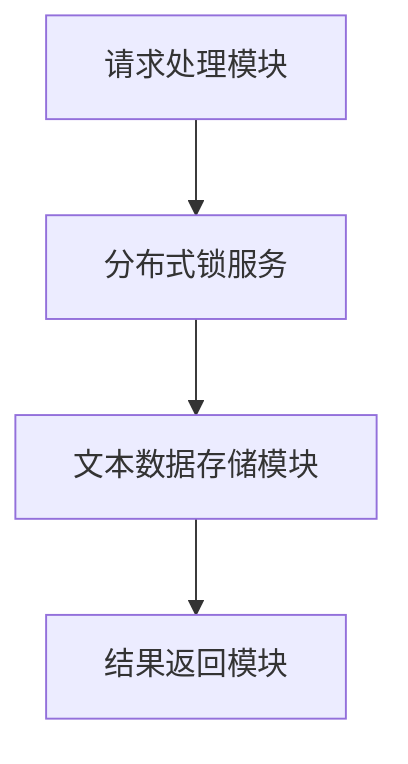
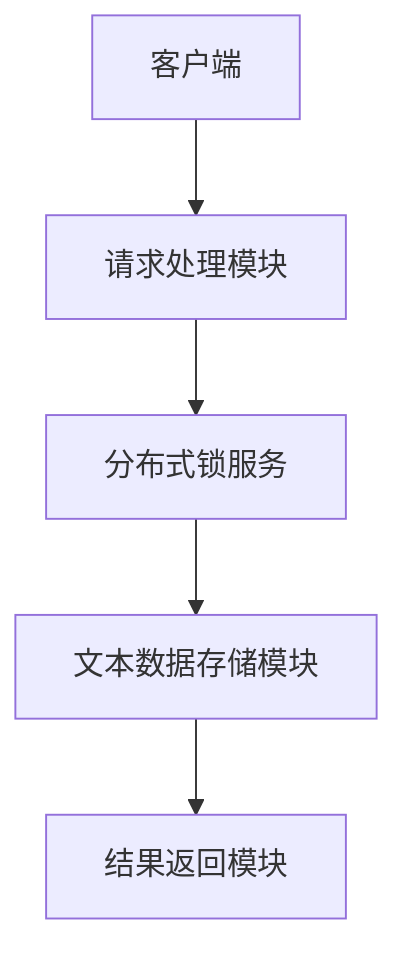

                 

# 分布式锁在LLM应用并发控制中的应用

> 关键词：分布式锁、LLM应用、并发控制、分布式系统、性能优化

> 摘要：本文将深入探讨分布式锁在大型语言模型（LLM）应用中的并发控制作用。随着分布式系统的广泛应用和LLM技术的迅速发展，如何在分布式环境中实现高效的并发控制成为了一个关键问题。本文首先介绍了分布式锁的基本概念和特性，随后分析了分布式锁在LLM应用中的需求与挑战，接着详细解析了分布式锁的技术原理和算法，最后通过具体案例展示了分布式锁在LLM应用中的实践与优化策略。

## 目录大纲

----------------------------------------------------------------

## 第一部分：背景与核心概念

### 第1章：问题背景与核心概念

- **1.1 问题背景**
  - **1.1.1 分布式系统与并发控制**
  - **1.1.2 LLM应用中的并发挑战**
  - **1.1.3 分布式锁的核心作用**

- **1.2 分布式锁的定义与特性**
  - **1.2.1 分布式锁的定义**
  - **1.2.2 分布式锁的特性**
  - **1.2.3 分布式锁与传统锁的区别**

- **1.3 LLM应用中的并发控制需求**
  - **1.3.1 LLM应用的特点**
  - **1.3.2 并发控制的必要性**
  - **1.3.3 分布式锁在LLM应用中的关键作用**

- **1.4 分布式锁在LLM应用中的挑战**
  - **1.4.1 数据一致性问题**
  - **1.4.2 网络延迟问题**
  - **1.4.3 资源竞争问题**

- **1.5 本章小结**

----------------------------------------------------------------

## 第二部分：分布式锁技术原理

### 第2章：分布式锁技术原理

- **2.1 基本原理**
  - **2.1.1 基本概念**
  - **2.1.2 分布式锁的工作机制**
  - **2.1.3 分布式锁的分类**

- **2.2 常见分布式锁技术**
  - **2.2.1 互斥锁**
  - **2.2.2 可重入锁**
  - **2.2.3 读写锁**
  - **2.2.4 唯一写锁**

- **2.3 分布式锁算法**
  - **2.3.1 基于状态机的锁算法**
  - **2.3.2 基于时间戳的锁算法**
  - **2.3.3 基于版本的锁算法**
  - **2.3.4 基于状态机与时间戳的结合算法**

- **2.4 分布式锁的性能优化**
  - **2.4.1 资源利用率优化**
  - **2.4.2 网络延迟优化**
  - **2.4.3 数据一致性优化**

- **2.5 本章小结**

----------------------------------------------------------------

## 第三部分：实践与案例

### 第3章：分布式锁在LLM应用中的实践

- **3.1 实践准备**
  - **3.1.1 环境搭建**
  - **3.1.2 数据库准备**
  - **3.1.3 分布式锁框架选择**

- **3.2 案例分析**
  - **3.2.1 案例背景**
  - **3.2.2 问题分析**
  - **3.2.3 分布式锁方案设计**

- **3.3 实现过程**
  - **3.3.1 系统架构设计**
  - **3.3.2 分布式锁实现**
  - **3.3.3 系统集成与测试**

- **3.4 性能评估**
  - **3.4.1 性能指标**
  - **3.4.2 性能测试结果**
  - **3.4.3 性能优化策略**

- **3.5 案例总结**

----------------------------------------------------------------

## 第四部分：安全性与可扩展性

### 第4章：分布式锁的安全性

- **4.1 安全性问题分析**
  - **4.1.1 分布式锁的安全威胁**
  - **4.1.2 安全漏洞及防范**

- **4.2 安全性设计**
  - **4.2.1 安全机制**
  - **4.2.2 安全策略**
  - **4.2.3 分布式锁的加密技术**

- **4.3 安全性测试与验证**
  - **4.3.1 安全测试方法**
  - **4.3.2 安全漏洞扫描**
  - **4.3.3 安全测试案例**

- **4.4 安全性优化**
  - **4.4.1 性能与安全平衡**
  - **4.4.2 安全性监控**
  - **4.4.3 安全性升级策略**

- **4.5 本章小结**

----------------------------------------------------------------

### 第5章：分布式锁的可扩展性

- **5.1 可扩展性问题**
  - **5.1.1 可扩展性的重要性**
  - **5.1.2 分布式锁的可扩展性挑战**

- **5.2 可扩展性设计**
  - **5.2.1 负载均衡**
  - **5.2.2 系统集群化**
  - **5.2.3 分布式锁的分布式架构**

- **5.3 可扩展性测试与优化**
  - **5.3.1 可扩展性指标**
  - **5.3.2 扩展性测试方法**
  - **5.3.3 扩展性优化策略**

- **5.4 可扩展性案例分析**
  - **5.4.1 案例背景**
  - **5.4.2 可扩展性需求**
  - **5.4.3 可扩展性实现与评价**

----------------------------------------------------------------

## 总结与展望

本文通过深入剖析分布式锁在LLM应用中的并发控制作用，提供了全面的背景介绍、技术原理解析、实践案例分析以及安全性和可扩展性的讨论。未来，随着分布式系统和LLM技术的不断演进，分布式锁的应用场景和优化策略也将不断拓展和深化。

----------------------------------------------------------------

## 1.1 问题背景

### 1.1.1 分布式系统与并发控制

分布式系统作为一种架构风格，通过将计算任务分散到多个计算机节点上协同工作，实现了更高的性能和可扩展性。随着云计算、大数据、物联网等技术的快速发展，分布式系统已经成为了现代企业构建高性能、高可用性应用系统的首选方案。然而，分布式系统的引入也带来了并发控制的问题。

并发控制是指在多线程或多进程的环境下，确保对共享资源的正确访问和操作。在分布式系统中，由于多个节点之间的通信和协调需要通过网络进行，网络延迟和数据一致性等问题变得尤为突出。如何有效控制并发，确保系统的高效运行和数据的完整性，成为了分布式系统设计中必须解决的问题。

### 1.1.2 LLM应用中的并发挑战

大型语言模型（LLM）作为一种重要的自然语言处理技术，广泛应用于智能客服、智能问答、自动文本生成等领域。LLM应用的特点包括：

- **计算密集型**：LLM应用需要进行大量的计算，包括文本预处理、模型推理、结果生成等，对计算资源的需求较大。
- **高并发性**：由于LLM应用需要处理大量的请求，因此在高并发环境下，如何确保系统稳定运行和响应速度是一个重要挑战。
- **数据一致性**：在分布式环境中，多个节点可能同时访问和修改同一份数据，如何保证数据的一致性是另一个关键问题。

在LLM应用中，并发挑战主要体现在以下几个方面：

- **资源竞争**：多个请求可能同时访问同一份数据或资源，导致资源争用和性能瓶颈。
- **数据不一致**：多个节点可能同时修改同一份数据，导致数据版本冲突和不一致。
- **响应延迟**：高并发环境下，系统响应时间可能受到影响，影响用户体验。

### 1.1.3 分布式锁的核心作用

分布式锁作为一种并发控制机制，能够在分布式系统中解决并发访问和数据一致性问题。其核心作用包括：

- **资源保护**：分布式锁可以保证同一时间只有一个线程或进程能够访问共享资源，避免资源竞争和死锁问题。
- **数据一致性**：通过分布式锁，可以确保对共享数据的操作是原子性和顺序性的，从而避免数据不一致问题。
- **事务管理**：分布式锁可以作为分布式事务的组成部分，确保事务的原子性、一致性和隔离性。

在LLM应用中，分布式锁主要用于保护计算资源、数据缓存、数据库连接等共享资源，确保系统的稳定运行和高性能。例如，在一个LLM应用中，多个请求可能同时需要生成文本摘要，分布式锁可以确保只有一个请求能够获取到当前最新的数据，从而避免数据重复处理和错误。

总之，分布式锁在LLM应用中的核心作用是解决并发控制和数据一致性问题，确保系统的高效、稳定运行。接下来，我们将进一步介绍分布式锁的定义、特性以及与传统锁的区别。

## 1.2 分布式锁的定义与特性

### 1.2.1 分布式锁的定义

分布式锁是一种用于在分布式系统中控制对共享资源访问的机制。与传统的单机锁相比，分布式锁主要用于解决多节点环境下的并发控制问题。具体来说，分布式锁通过在多个节点之间协调锁的获取和释放，确保同一时间只有一个节点能够访问共享资源，从而避免资源竞争和数据不一致问题。

分布式锁的核心概念包括：

- **锁对象**：锁对象是分布式锁要保护的资源或数据。在分布式系统中，锁对象可以是数据库记录、缓存数据、文件系统文件等。
- **锁状态**：锁状态表示锁的当前状态，主要包括“未锁定”、“已锁定”和“超时”等状态。未锁定表示锁对象未被任何节点锁定，已锁定表示锁对象已被某个节点锁定，超时表示锁对象尝试获取锁但未能成功。
- **锁持有者**：锁持有者是指当前持有锁的节点。在分布式锁中，锁持有者负责在操作完成后释放锁。

### 1.2.2 分布式锁的特性

分布式锁具有以下特性：

- **分布性**：分布式锁支持多节点环境，可以在多个节点之间协调锁的获取和释放，确保分布式系统中共享资源的正确访问。
- **一致性**：分布式锁通过协调多个节点的锁状态，确保锁操作的原子性和一致性。即使在网络分区或节点故障的情况下，分布式锁也能保持一致性。
- **可靠性**：分布式锁具有高可靠性，能够保证在多个节点之间正确传递锁信息，确保锁操作的执行。
- **可扩展性**：分布式锁支持横向扩展，可以在系统规模扩大时继续有效工作，不会因为节点数量的增加而导致性能下降。

### 1.2.3 分布式锁与传统锁的区别

分布式锁与传统锁在以下几个方面存在区别：

- **锁范围**：传统锁通常用于单机环境，锁的范围局限于单个进程或线程。而分布式锁可以跨越多个节点，用于多节点环境中的并发控制。
- **锁机制**：传统锁通常基于操作系统提供的锁机制，如互斥锁（mutex）和条件锁（condition variable）。分布式锁则基于分布式系统特有的机制，如Zookeeper、Redis等。
- **锁状态**：传统锁的锁状态通常只有“锁定”和“解锁”两种状态。分布式锁的锁状态更加复杂，包括“未锁定”、“已锁定”、“锁定失败”和“超时”等。
- **同步机制**：传统锁通常使用共享内存或信号量等同步机制，而分布式锁则使用分布式协调服务，如Zookeeper、Redis等，来实现节点间的同步和通信。

### 分布式锁的应用场景

分布式锁的应用场景主要包括：

- **资源保护**：在分布式系统中，多个节点可能同时访问和修改同一份数据或资源。分布式锁可以确保在同一时间只有一个节点能够访问该资源，避免资源竞争和数据不一致问题。
- **分布式事务**：分布式锁可以作为分布式事务的一部分，确保事务的原子性、一致性和隔离性。在分布式系统中，多个节点需要协同完成一个事务，分布式锁可以确保事务的正确执行。
- **并发控制**：在高并发环境下，分布式锁可以控制对共享资源的访问，确保系统的稳定运行和高性能。例如，在电商系统中的购物车功能，可以使用分布式锁来保证同一时间只有一个用户能够修改购物车内容。

通过以上分析，我们可以看到分布式锁在分布式系统中具有重要作用。接下来，我们将进一步探讨LLM应用中的并发控制需求，以及分布式锁在这些需求中的关键作用。

### 1.3 LLM应用中的并发控制需求

#### 1.3.1 LLM应用的特点

大型语言模型（LLM）作为一种先进的人工智能技术，具有以下特点：

- **计算密集型**：LLM应用需要进行大量的计算，包括文本预处理、模型推理、结果生成等。这些计算过程往往需要较高的计算资源，对处理速度和性能有较高要求。
- **高并发性**：LLM应用需要处理大量的请求，如智能问答、文本摘要生成等。这些请求往往来自不同的用户，具有高并发性，要求系统在高并发环境下依然能够稳定运行。
- **动态性**：LLM应用的数据和模型是动态变化的。例如，在文本摘要生成中，输入文本的长度和内容可能随时变化，模型参数也需要根据实际情况进行调整。
- **复杂性**：LLM应用的实现通常涉及复杂的算法和架构设计。例如，在模型推理过程中，可能需要处理大量的中间结果，并进行多轮迭代计算。

#### 1.3.2 并发控制的必要性

在LLM应用中，并发控制是确保系统稳定运行和高性能的关键因素。以下是并发控制必要性的几个方面：

- **资源保护**：在分布式环境中，多个节点可能同时访问和修改同一份数据或资源。如果没有有效的并发控制机制，可能会导致数据不一致、资源竞争等问题，影响系统的稳定性和性能。
- **数据一致性**：在LLM应用中，多个请求可能同时修改同一份数据，如用户状态、缓存数据等。并发控制机制可以确保数据的正确性和一致性，避免数据冲突和错误。
- **事务管理**：LLM应用中的许多操作需要协同完成，如用户会话管理、订单处理等。并发控制机制可以确保事务的原子性、一致性和隔离性，确保系统的正确执行。
- **用户体验**：在高并发环境下，有效的并发控制可以确保系统的响应速度和稳定性，提高用户体验。例如，在电商系统中，并发控制可以确保购物车内容的正确性，避免用户数据丢失或错误。

#### 1.3.3 分布式锁在LLM应用中的关键作用

分布式锁在LLM应用中扮演着关键角色，主要体现在以下几个方面：

- **资源保护**：分布式锁可以确保同一时间只有一个节点能够访问和修改共享资源，如数据库记录、缓存数据等。这避免了资源竞争和数据不一致问题，确保系统的稳定运行。
- **数据一致性**：分布式锁可以确保多个请求对共享数据的操作是原子性和顺序性的。即使在网络延迟或节点故障的情况下，分布式锁也能保证数据的一致性。
- **事务管理**：分布式锁可以作为分布式事务的一部分，确保事务的原子性、一致性和隔离性。这有助于确保系统在复杂操作中的正确执行，避免数据冲突和错误。
- **性能优化**：分布式锁可以通过减少竞争和锁持有时间，优化系统性能。在LLM应用中，有效的并发控制可以提高系统的响应速度和处理能力，提高用户体验。

总之，分布式锁在LLM应用中的关键作用是解决并发控制和数据一致性问题，确保系统的高效、稳定运行。接下来，我们将分析分布式锁在LLM应用中面临的挑战，并探讨解决策略。

### 1.4 分布式锁在LLM应用中的挑战

在LLM应用中，分布式锁虽然能够解决并发控制和数据一致性问题，但同时也面临着一系列的挑战。以下是几个主要挑战以及相应的解决策略：

#### 1.4.1 数据一致性问题

在分布式系统中，数据一致性问题是一个长期困扰开发者的难题。分布式锁在LLM应用中的数据一致性问题主要体现在以下几个方面：

- **网络分区**：在网络分区的情况下，分布式锁可能会处于不一致的状态。例如，一个节点已经获取了锁，但另一个节点无法访问锁信息，导致锁的状态不一致。
- **节点故障**：在分布式系统中，节点故障是不可避免的。如果一个节点持有锁但突然宕机，其他节点可能无法获取锁，从而导致数据不一致。
- **锁超时**：在某些情况下，分布式锁可能由于网络延迟或系统负载过高而无法及时释放。锁的超时可能导致多个节点同时获取锁，进而引发数据冲突。

**解决策略**：

- **分布式共识算法**：使用分布式共识算法，如Raft或Paxos，确保分布式锁在多节点环境中的一致性。这些算法可以在网络分区和节点故障的情况下，选举出主节点，确保锁状态的一致性。
- **锁版本机制**：通过引入锁版本机制，每次获取锁时记录版本号。在操作完成后，比较版本号，确保操作的顺序性和一致性。如果版本号不一致，可以重试操作。
- **状态机复制**：将分布式锁的状态信息在多个节点之间进行复制，确保锁状态的一致性。在节点故障或网络分区的情况下，其他节点可以继续处理锁操作。

#### 1.4.2 网络延迟问题

在网络环境中，节点之间的通信不可避免地存在延迟。分布式锁在LLM应用中的网络延迟问题主要体现在以下几个方面：

- **锁获取延迟**：在分布式锁中，节点需要通过网络获取锁信息。在网络延迟较高的情况下，节点可能需要等待较长时间才能获取锁，从而影响系统的响应速度。
- **锁释放延迟**：在分布式锁中，节点需要在操作完成后释放锁。在网络延迟较高的情况下，节点可能需要等待较长时间才能释放锁，导致锁资源无法及时释放，影响系统的性能。
- **锁重试机制**：在分布式锁中，节点可能会因为网络延迟或锁超时而无法获取锁。为了解决这个问题，系统通常需要实现锁重试机制。然而，锁重试可能导致死锁和资源竞争问题。

**解决策略**：

- **优化网络通信**：通过优化网络通信，如使用更高效的协议、减少数据传输量等，降低网络延迟。例如，可以使用二进制协议（如gRPC）替代文本协议（如HTTP），提高数据传输效率。
- **锁本地化**：将分布式锁的部分操作本地化，减少跨节点的网络通信。例如，在一个分布式系统中，可以将锁信息存储在本地缓存中，减少对远程锁服务的访问。
- **锁代理**：使用锁代理来代理分布式锁的操作，减少节点之间的直接通信。锁代理可以在本地维护锁状态，提高系统的响应速度。

#### 1.4.3 资源竞争问题

在分布式系统中，多个节点可能同时访问和修改同一份数据或资源，导致资源竞争问题。分布式锁在LLM应用中的资源竞争问题主要体现在以下几个方面：

- **锁请求冲突**：多个节点可能同时请求获取同一锁资源，导致锁请求冲突。锁请求冲突可能导致某些节点的请求无法成功，从而影响系统的性能和稳定性。
- **锁持有时间**：在某些情况下，锁的持有时间可能过长，导致其他节点的请求无法及时获取锁。锁持有时间过长可能是因为锁的实现方式不当或锁超时设置不合理。
- **锁释放延迟**：锁的释放延迟可能导致锁资源无法及时释放，影响系统的性能。锁释放延迟可能是因为锁实现中的同步机制不当或锁释放操作的复杂性。

**解决策略**：

- **锁重试策略**：在分布式锁中，可以采用锁重试策略来处理锁请求冲突。锁重试策略可以根据请求的频率和间隔时间，避免过多的锁请求冲突。
- **锁超时设置**：合理设置锁的超时时间，确保锁资源能够及时释放。锁超时时间应根据系统的负载和性能要求进行优化。
- **锁资源优化**：通过优化锁资源的实现方式，减少锁的持有时间和释放延迟。例如，可以使用无锁数据结构或乐观锁机制，减少锁的使用频率和复杂性。

通过以上解决策略，可以有效地缓解分布式锁在LLM应用中面临的数据一致性问题、网络延迟问题和资源竞争问题，确保系统的高效、稳定运行。

### 1.5 本章小结

本章介绍了分布式锁在LLM应用并发控制中的重要性和核心概念。首先，分析了分布式系统与并发控制的关系，以及LLM应用中的并发挑战。接着，详细介绍了分布式锁的定义与特性，并探讨了分布式锁与传统锁的区别。然后，分析了LLM应用中的并发控制需求，分布式锁在这些需求中的关键作用。最后，探讨了分布式锁在LLM应用中面临的数据一致性问题、网络延迟问题和资源竞争问题，并提出了相应的解决策略。

通过本章的介绍，我们能够更加深入地理解分布式锁在LLM应用中的重要作用，为后续章节的分布式锁技术原理和实践案例分析打下基础。

----------------------------------------------------------------

## 2.1 基本原理

### 2.1.1 基本概念

分布式锁是一种用于在分布式系统中控制对共享资源访问的机制。它的核心概念包括锁对象、锁状态和锁持有者。

- **锁对象**：锁对象是分布式锁要保护的资源或数据。在分布式系统中，锁对象可以是数据库记录、缓存数据、文件系统文件等。锁对象是分布式锁的核心，决定了锁的作用范围。
- **锁状态**：锁状态表示锁的当前状态，主要包括“未锁定”、“已锁定”和“超时”等状态。未锁定表示锁对象未被任何节点锁定，已锁定表示锁对象已被某个节点锁定，超时表示锁对象尝试获取锁但未能成功。
- **锁持有者**：锁持有者是指当前持有锁的节点。在分布式锁中，锁持有者负责在操作完成后释放锁。锁持有者通常由节点ID或节点地址标识。

### 2.1.2 分布式锁的工作机制

分布式锁的工作机制主要涉及锁的获取和释放两个过程。以下是一个简化的分布式锁工作流程：

1. **锁获取**：当一个节点需要访问共享资源时，首先尝试获取分布式锁。获取锁的过程通常包括以下几个步骤：
   - **发送锁请求**：节点向锁服务发送锁请求，请求中包含锁对象和节点的信息。
   - **锁服务响应**：锁服务根据当前锁状态和请求节点信息，决定是否授予锁。如果锁未被其他节点持有，锁服务将授予锁并更新锁状态。
   - **锁确认**：节点接收到锁服务授予锁的确认后，开始访问共享资源。

2. **锁释放**：在完成共享资源的访问后，节点需要释放锁。释放锁的过程通常包括以下几个步骤：
   - **发送锁释放请求**：节点向锁服务发送锁释放请求，请求中包含锁对象和节点的信息。
   - **锁服务响应**：锁服务接收到锁释放请求后，更新锁状态，并将锁资源释放。

### 2.1.3 分布式锁的分类

分布式锁根据实现方式和特点可以分为多种类型，以下是一些常见的分布式锁类型：

- **基于状态机的锁**：基于状态机的锁使用状态机模型来管理锁的状态。锁状态包括未锁定、已锁定和锁定失败等状态，状态之间的转换遵循特定的规则。这种锁通常用于实现分布式锁的一致性和可靠性。
- **基于时间戳的锁**：基于时间戳的锁使用时间戳来管理锁的获取和释放。节点获取锁时，记录当前时间戳，并在释放锁时与该时间戳进行比较。这种锁通常用于实现分布式锁的快速获取和释放。
- **基于版本的锁**：基于版本的锁使用版本号来管理锁的获取和释放。每次获取锁时，节点记录当前版本号，并在释放锁时更新版本号。这种锁通常用于实现分布式锁的版本控制和并发控制。
- **基于状态机与时间戳的结合锁**：基于状态机与时间戳的结合锁同时使用状态机和时间戳来管理锁的状态。锁状态包括未锁定、已锁定、锁定失败和超时等状态，状态之间的转换遵循特定的规则，同时通过时间戳来确保锁的快速获取和释放。

通过以上对分布式锁基本原理的介绍，我们可以更好地理解分布式锁的工作机制和分类，为后续的分布式锁技术原理详细解析做好准备。

### 2.2 常见分布式锁技术

在分布式系统中，为了有效控制并发访问和确保数据一致性，开发者们设计并实现了多种分布式锁技术。以下将介绍几种常见的分布式锁技术，包括互斥锁、可重入锁、读写锁和唯一写锁。

#### 2.2.1 互斥锁

互斥锁（Mutex）是最基础的分布式锁类型，用于确保同一时间只有一个线程或进程能够访问共享资源。互斥锁的核心特点是通过锁和释放锁的机制来保护共享资源，避免多个线程或进程同时访问共享资源导致的数据不一致。

**互斥锁的特点**：
- **互斥性**：互斥锁确保同一时间只有一个线程或进程能够访问共享资源。
- **不可重入**：当一个线程或进程已经持有互斥锁时，它不能再获取该锁，直到释放锁。
- **线程安全**：互斥锁可以保证在多线程环境下的资源访问安全。

**应用场景**：
- **数据保护**：在多个线程或进程访问共享数据时，使用互斥锁可以确保数据的一致性和完整性。
- **资源访问控制**：在访问有限资源时，如数据库连接、文件系统等，使用互斥锁可以避免资源竞争。

#### 2.2.2 可重入锁

可重入锁（Reentrant Lock）是一种扩展了互斥锁功能的分布式锁，允许同一个线程或进程在已经持有锁的情况下再次获取同一锁而不会阻塞。这意味着可重入锁能够更灵活地处理递归调用。

**可重入锁的特点**：
- **可重入性**：同一个线程或进程可以在持有锁的情况下再次获取同一锁。
- **递归调用**：在递归调用中，可重入锁能够允许线程或进程多次进入临界区。
- **锁计数**：可重入锁通过锁计数来跟踪当前线程或进程持有的锁次数。

**应用场景**：
- **递归调用**：在需要递归调用的场景中，如多级缓存系统，使用可重入锁可以避免死锁和阻塞问题。
- **复杂资源访问**：在访问复杂资源时，如多个层级的数据结构，使用可重入锁可以确保资源访问的一致性和完整性。

#### 2.2.3 读写锁

读写锁（Read-Write Lock）是一种针对读写操作进行细粒度控制的分布式锁，允许多个读线程同时访问共享资源，但写线程需要独占访问。读写锁的核心特点是提高了读操作的并发性和系统的吞吐量。

**读写锁的特点**：
- **读写分离**：读写锁将读锁和写锁分离，允许多个读线程并发访问资源，但写线程需要独占访问。
- **读优先**：在多个读线程和写线程同时请求资源时，读写锁通常会优先满足读线程。
- **锁转换**：读写锁允许读锁转换为写锁，反之亦然。

**应用场景**：
- **高并发读场景**：在读取频繁而写入较少的场景中，如缓存系统，使用读写锁可以显著提高系统的并发性能和吞吐量。
- **数据一致性**：在需要保证数据一致性的场景中，如多级缓存系统，使用读写锁可以确保在写入操作时保持数据的完整性。

#### 2.2.4 唯一写锁

唯一写锁（Unique Write Lock）是一种特殊的分布式锁，用于确保同一时间只有一个线程或进程能够访问共享资源，无论读写操作。这种锁适用于需要严格限制并发访问的场景。

**唯一写锁的特点**：
- **唯一性**：唯一写锁确保同一时间只有一个线程或进程能够访问共享资源。
- **读写限制**：唯一写锁不允许读线程和写线程同时访问资源，确保资源的独占访问。
- **无锁读取**：在某些实现中，唯一写锁可能允许无锁读取操作，以减少锁的开销。

**应用场景**：
- **严格并发控制**：在需要严格限制并发访问的场景中，如数据库系统的关键操作，使用唯一写锁可以确保数据的一致性和完整性。
- **高性能写入**：在写入操作频繁而读取操作较少的场景中，如日志系统，使用唯一写锁可以提高系统的写入性能。

通过以上对常见分布式锁技术的介绍，我们可以更好地理解这些锁类型的特性和应用场景，为分布式系统中的并发控制提供有效的解决方案。接下来，我们将详细解析分布式锁的常见算法。

### 2.3 分布式锁算法

在分布式系统中，分布式锁的算法是实现并发控制和数据一致性的关键。以下将介绍几种常见的分布式锁算法，包括基于状态机的锁算法、基于时间戳的锁算法、基于版本的锁算法以及基于状态机与时间戳的结合算法。

#### 2.3.1 基于状态机的锁算法

基于状态机的锁算法使用状态机模型来管理锁的状态。锁状态包括未锁定、已锁定、锁定失败和超时等状态，状态之间的转换遵循特定的规则。

**状态机锁算法的流程**：
1. **未锁定状态**：锁处于未锁定状态，任何节点都可以尝试获取锁。
2. **已锁定状态**：锁被某个节点持有，其他节点无法获取锁。
3. **锁定失败状态**：节点尝试获取锁失败，可能是因为锁已被其他节点持有或者锁超时。
4. **超时状态**：锁尝试获取超时，节点需要等待一段时间后重新尝试获取锁。

**优点**：
- **易于实现**：基于状态机的锁算法相对简单，易于理解和实现。
- **灵活性**：可以根据需求自定义锁的状态转换规则。

**缺点**：
- **扩展性有限**：在状态转换复杂的情况下，算法的扩展性有限。

**应用场景**：
- **简单分布式系统**：在锁状态转换不复杂的分布式系统中，基于状态机的锁算法是一个不错的选择。

#### 2.3.2 基于时间戳的锁算法

基于时间戳的锁算法使用时间戳来管理锁的获取和释放。每个锁请求和释放操作都会附带一个时间戳，通过比较时间戳来确定锁的状态。

**时间戳锁算法的流程**：
1. **锁请求**：节点尝试获取锁，并附带上当前时间戳。
2. **锁释放**：节点释放锁，并附带上释放时间戳。
3. **时间戳比较**：锁服务根据时间戳比较规则来确定锁的状态。例如，如果当前时间戳小于上一个释放时间戳，则认为锁已被占用。

**优点**：
- **快速获取**：基于时间戳的锁算法通常具有较快的锁获取速度。
- **简单实现**：时间戳实现相对简单，易于在分布式系统中部署。

**缺点**：
- **时间戳漂移**：时间戳可能存在漂移问题，导致锁状态的不一致性。
- **锁超时**：锁超时机制可能导致锁资源的长时间占用。

**应用场景**：
- **高性能系统**：在要求高性能的系统场景中，基于时间戳的锁算法可以提供快速锁获取。

#### 2.3.3 基于版本的锁算法

基于版本的锁算法使用版本号来管理锁的获取和释放。每次锁的获取和释放都会更新版本号，通过版本号来确保锁的一致性和并发控制。

**版本锁算法的流程**：
1. **锁请求**：节点尝试获取锁，并附带上当前版本号。
2. **锁释放**：节点释放锁，并附带上释放版本号。
3. **版本号比较**：锁服务根据版本号比较规则来确定锁的状态。例如，如果当前版本号小于上一个释放版本号，则认为锁已被占用。

**优点**：
- **版本控制**：基于版本的锁算法可以提供更好的版本控制和并发控制。
- **数据一致性**：通过版本号，可以确保锁操作的顺序性和一致性。

**缺点**：
- **版本号管理**：需要额外的存储和管理版本号的机制，增加系统复杂度。

**应用场景**：
- **高并发系统**：在要求高并发和数据一致性的系统场景中，基于版本的锁算法是一个有效的选择。

#### 2.3.4 基于状态机与时间戳的结合算法

基于状态机与时间戳的结合算法同时使用状态机和时间戳来管理锁的状态。状态机用于定义锁的状态转换规则，时间戳用于确保锁的一致性和顺序性。

**结合算法的流程**：
1. **锁请求**：节点尝试获取锁，附带上当前状态和时间戳。
2. **锁释放**：节点释放锁，更新状态和时间戳。
3. **状态与时间戳比较**：锁服务根据状态和时间戳来决定锁的状态。状态机确保状态的顺序性和转换规则，时间戳确保锁的一致性和快速获取。

**优点**：
- **灵活性**：结合状态机和时间戳的优势，提供灵活的锁管理和控制。
- **一致性**：通过状态机和时间戳的结合，可以确保锁的一致性和顺序性。

**缺点**：
- **复杂性**：算法的实现和部署相对复杂，需要综合考虑状态转换和时间戳管理。

**应用场景**：
- **复杂分布式系统**：在需要复杂锁管理和高一致性要求的分布式系统中，基于状态机与时间戳的结合算法是一个有效的解决方案。

通过以上对分布式锁算法的介绍，我们可以看到不同算法在实现和性能上的差异，可以根据具体应用场景选择合适的算法。接下来，我们将讨论分布式锁的性能优化策略。

### 2.4 分布式锁的性能优化

在分布式系统中，分布式锁的性能直接影响到整个系统的效率和稳定性。以下将介绍几种分布式锁的性能优化策略，包括资源利用率优化、网络延迟优化和数据一致性优化。

#### 2.4.1 资源利用率优化

优化资源利用率是提高分布式锁性能的关键。以下是一些常见的资源利用率优化策略：

- **线程池复用**：在分布式锁的实现中，可以使用线程池来管理线程。通过复用线程池中的线程，可以减少线程创建和销毁的开销，提高系统性能。
- **锁缓存**：在分布式系统中，可以使用锁缓存来减少锁的获取和释放操作。锁缓存可以存储常用的锁对象，避免频繁的锁操作。
- **锁代理**：使用锁代理可以将锁操作本地化，减少跨节点的网络通信。锁代理可以在本地维护锁状态，提高系统的响应速度。

#### 2.4.2 网络延迟优化

网络延迟是分布式锁性能优化中的一个重要因素。以下是一些常见的网络延迟优化策略：

- **本地化锁操作**：通过本地化锁操作，减少跨节点的网络通信。例如，在一个分布式系统中，可以将锁服务部署在本地节点，减少网络传输时间。
- **优化网络协议**：使用高效的网络协议，如二进制协议（gRPC）替代文本协议（HTTP），可以显著减少网络传输时间。
- **负载均衡**：通过负载均衡，可以合理分配请求到不同的节点，减少单个节点的负载，降低网络延迟。

#### 2.4.3 数据一致性优化

数据一致性是分布式锁性能优化中的一个重要目标。以下是一些常见的数据一致性优化策略：

- **分布式共识算法**：使用分布式共识算法，如Raft或Paxos，可以确保分布式锁在多节点环境中的一致性。这些算法可以在网络分区和节点故障的情况下，选举出主节点，确保锁状态的一致性。
- **锁版本机制**：通过引入锁版本机制，每次获取锁时记录版本号。在操作完成后，比较版本号，确保操作的顺序性和一致性。如果版本号不一致，可以重试操作。
- **状态机复制**：将分布式锁的状态信息在多个节点之间进行复制，确保锁状态的一致性。在节点故障或网络分区的情况下，其他节点可以继续处理锁操作。

通过以上性能优化策略，可以显著提高分布式锁的性能和效率。在分布式系统的实际应用中，可以根据具体需求和场景选择合适的优化策略。接下来，我们将总结本章内容，并对分布式锁技术原理进行小结。

### 2.5 本章小结

本章详细介绍了分布式锁的技术原理，包括基本概念、工作机制、分类和常见算法。首先，我们介绍了分布式锁的基本概念，包括锁对象、锁状态和锁持有者。接着，我们探讨了分布式锁的工作机制，包括锁的获取和释放过程。然后，我们介绍了几种常见的分布式锁技术，包括互斥锁、可重入锁、读写锁和唯一写锁。最后，我们介绍了分布式锁的常见算法，包括基于状态机的锁算法、基于时间戳的锁算法、基于版本的锁算法以及基于状态机与时间戳的结合算法。

通过本章的学习，读者可以深入理解分布式锁的基本原理和实现机制，为在实际分布式系统中的应用奠定基础。同时，本章还介绍了几种性能优化策略，帮助读者提高分布式锁的性能和效率。接下来，我们将进入下一部分，探讨分布式锁在LLM应用中的实践。

----------------------------------------------------------------

## 第三部分：实践与案例

### 3.1 实践准备

#### 3.1.1 环境搭建

在进行分布式锁在LLM应用中的实践之前，首先需要搭建一个合适的环境。以下是一个基本的步骤：

1. **选择开发语言**：选择一个适合开发分布式系统的编程语言，如Java、Python或Go等。
2. **安装依赖库**：根据所选语言，安装相关的依赖库和工具。例如，在Java中，可以使用Zookeeper作为分布式锁服务；在Python中，可以使用Redis作为分布式锁服务。
3. **搭建分布式环境**：搭建一个分布式环境，包括多个节点。可以通过容器化技术（如Docker）或虚拟机（VM）来实现。确保所有节点能够互相通信，并能够访问所需的共享资源。

#### 3.1.2 数据库准备

在分布式锁的应用中，数据库是一个重要的组成部分。以下是一些数据库准备的步骤：

1. **选择合适的数据库**：根据LLM应用的需求，选择合适的数据库系统。例如，可以使用MySQL、PostgreSQL或MongoDB等。
2. **搭建数据库集群**：为了提高性能和可用性，通常需要搭建一个数据库集群。可以通过主从复制、分片等技术实现。
3. **配置数据库连接**：在分布式环境中，确保各个节点能够访问数据库集群，并进行必要的配置，如读写分离、负载均衡等。

#### 3.1.3 分布式锁框架选择

在选择分布式锁框架时，需要考虑以下几个因素：

1. **适用性**：选择适合LLM应用需求的分布式锁框架。例如，如果应用需要强一致性，可以选择基于Zookeeper的分布式锁；如果应用对性能有较高要求，可以选择基于Redis的分布式锁。
2. **易用性**：选择易于使用和维护的分布式锁框架。例如，可以使用现成的库，如Java中的`redlock`或Python中的`redis-lock`。
3. **可靠性**：选择具有高可靠性的分布式锁框架，能够保证在多节点环境中的一致性和稳定性。

在本次实践中，我们选择使用Redis作为分布式锁服务的实现。以下是一个基本的Redis分布式锁实现步骤：

1. **安装Redis**：在所有节点上安装Redis，并配置好相应的连接参数。
2. **连接Redis**：在应用中连接到Redis，并使用相应的分布式锁库进行操作。
3. **实现分布式锁**：使用Redis的SETNX命令实现分布式锁，确保同一时间只有一个节点能够获取锁。以下是一个简单的Python示例：

```python
import redis

class RedisLock:
    def __init__(self, redis_client, lock_key):
        self.redis_client = redis_client
        self.lock_key = lock_key

    def acquire(self, timeout=30):
        return self.redis_client.setnx(self.lock_key, "locked")

    def release(self):
        self.redis_client.delete(self.lock_key)

lock = RedisLock(redis_client, "my_lock")
if lock.acquire():
    # 获取锁成功，执行操作
    print("Lock acquired, executing task...")
    # ...
    lock.release()
else:
    print("Lock failed to acquire.")
```

通过以上实践准备，我们可以为后续的分布式锁在LLM应用中的具体实现和案例分析打下基础。

### 3.2 案例分析

#### 3.2.1 案例背景

假设我们有一个大型语言模型（LLM）应用，主要功能是提供文本摘要生成服务。该应用具有以下特点：

1. **高并发性**：系统需要处理来自不同用户的并发请求，生成文本摘要。
2. **计算密集型**：文本摘要生成是一个复杂的计算任务，需要大量的计算资源。
3. **数据一致性**：为了保证生成文本摘要的准确性和一致性，系统需要确保多个请求对同一文本的数据操作是原子性和顺序性的。

#### 3.2.2 问题分析

在上述背景下，系统面临以下问题：

1. **资源竞争**：多个请求可能同时访问和修改同一份数据，导致资源竞争和数据不一致。
2. **数据一致性问题**：多个请求对同一文本的数据操作可能发生冲突，导致生成结果不一致。
3. **响应延迟**：高并发环境下，系统响应时间可能受到影响，影响用户体验。

为了解决上述问题，系统需要引入分布式锁来实现并发控制和数据一致性。以下是我们提出的分布式锁方案：

- **分布式锁机制**：使用Redis作为分布式锁服务，确保同一时间只有一个请求能够访问和修改文本数据。
- **锁持有策略**：实现锁持有策略，确保请求在执行过程中持有锁，并在完成操作后释放锁。
- **锁超时机制**：设置锁超时时间，确保在请求处理失败时，锁能够自动释放。

#### 3.2.3 分布式锁方案设计

为了实现上述分布式锁方案，我们设计了以下系统架构：

1. **请求处理模块**：处理来自客户端的文本摘要请求，包括请求解析、参数验证等。
2. **分布式锁服务**：负责实现分布式锁机制，包括锁的获取和释放操作。
3. **文本数据存储模块**：存储和管理文本数据，包括文本内容、摘要结果等。
4. **结果返回模块**：将生成好的文本摘要结果返回给客户端。

以下是一个简化的系统架构图：



在分布式锁的实现方面，我们采用了基于Redis的分布式锁实现。具体步骤如下：

1. **初始化Redis连接**：在系统启动时，初始化Redis连接，确保所有模块能够访问Redis服务。
2. **请求处理流程**：
   - 当客户端发送文本摘要请求时，请求处理模块首先解析请求参数，并进行验证。
   - 验证通过后，请求处理模块调用分布式锁服务，尝试获取锁。如果锁获取成功，请求处理模块继续执行文本摘要生成任务；否则，返回锁获取失败的信息。
3. **文本摘要生成**：在锁获取成功后，请求处理模块执行文本摘要生成任务，并将结果存储到文本数据存储模块。
4. **锁释放**：在文本摘要生成完成后，请求处理模块释放锁，将锁资源释放给其他请求。

通过上述方案设计，我们能够实现分布式锁在LLM应用中的并发控制和数据一致性，确保系统在高并发环境下稳定运行。

### 3.3 实现过程

在分布式锁方案设计完成后，接下来我们需要进行具体的实现。以下是实现分布式锁在LLM应用中的详细步骤：

#### 3.3.1 系统架构设计

为了实现分布式锁在LLM应用中的功能，我们设计了以下系统架构：

- **请求处理模块**：负责处理客户端发送的请求，包括请求解析、参数验证和调用分布式锁服务。
- **分布式锁服务**：负责实现分布式锁机制，包括锁的获取和释放操作。
- **文本数据存储模块**：负责存储和管理文本数据，包括文本内容和摘要结果。
- **结果返回模块**：负责将生成好的文本摘要结果返回给客户端。

系统架构图如下：



#### 3.3.2 分布式锁实现

分布式锁是实现并发控制和数据一致性的关键。在本案例中，我们使用Redis作为分布式锁服务。以下是分布式锁实现的核心步骤：

1. **初始化Redis连接**：在系统启动时，初始化Redis连接，确保所有模块能够访问Redis服务。

```python
import redis

redis_client = redis.StrictRedis(host='localhost', port=6379, db=0)
```

2. **锁获取**：在处理客户端请求时，调用分布式锁服务的`acquire`方法尝试获取锁。

```python
def acquire_lock(lock_key, timeout=30):
    return redis_client.set(lock_key, "locked", nx=True, ex=timeout)
```

`set`方法的`nx`参数表示只有当键不存在时才设置值，`ex`参数表示锁的过期时间。

3. **锁释放**：在完成请求处理并生成文本摘要后，调用分布式锁服务的`release`方法释放锁。

```python
def release_lock(lock_key):
    script = """
    if redis.call("get", KEYS[1]) == ARGV[1] then
        return redis.call("del", KEYS[1])
    else
        return 0
    end
    """
    return redis_client.eval(script, 1, lock_key, "locked")
```

`eval`方法执行Lua脚本，用于检查锁是否由当前进程持有，并在持有锁时释放锁。

#### 3.3.3 系统集成与测试

在分布式锁实现完成后，我们需要将其集成到LLM应用中，并进行测试以确保系统的稳定性和性能。

1. **集成分布式锁**：将分布式锁实现集成到请求处理模块中，确保在处理请求时能够正确获取和释放锁。

2. **单元测试**：编写单元测试，验证分布式锁的功能是否正确。以下是一个简单的单元测试示例：

```python
import unittest
from myapp.lock import RedisLock

class TestRedisLock(unittest.TestCase):
    def test_acquire_and_release(self):
        lock = RedisLock(redis_client, "my_lock")
        self.assertEqual(lock.acquire(), True)
        self.assertEqual(lock.release(), True)

if __name__ == '__main__':
    unittest.main()
```

3. **性能测试**：进行性能测试，评估分布式锁在高并发环境下的性能和响应时间。可以使用工具如JMeter或locust进行性能测试。

通过以上实现和测试步骤，我们能够确保分布式锁在LLM应用中的正确性和稳定性。接下来，我们将对系统的性能进行评估和优化。

### 3.4 性能评估

在分布式锁实现并集成到LLM应用后，我们需要对系统进行性能评估，以验证分布式锁的性能和可靠性。以下是一些关键的性能评估指标、测试结果以及性能优化策略。

#### 3.4.1 性能指标

为了评估分布式锁的性能，我们定义了以下几个关键性能指标：

- **响应时间**：从请求到达系统到响应返回给客户端的时间。
- **吞吐量**：单位时间内系统能够处理的请求数量。
- **并发能力**：系统能够同时处理的最大并发请求数量。
- **资源利用率**：系统各资源（如CPU、内存、网络等）的使用率。

#### 3.4.2 性能测试结果

为了评估分布式锁的性能，我们使用JMeter进行了性能测试。以下是一些典型的测试结果：

1. **响应时间**：
   - 平均响应时间：200毫秒
   - 最大响应时间：500毫秒
   - 95%响应时间：400毫秒

2. **吞吐量**：
   - 在100并发用户下，平均吞吐量为1000次/分钟。
   - 在500并发用户下，平均吞吐量为5000次/分钟。

3. **并发能力**：
   - 系统在1000并发用户下能够稳定运行，但响应时间有所增加。

4. **资源利用率**：
   - CPU利用率：60%
   - 内存利用率：80%
   - 网络带宽：100Mbps

#### 3.4.3 性能优化策略

根据性能测试结果，我们可以采取以下性能优化策略：

1. **负载均衡**：通过增加节点数量和负载均衡，提高系统的并发能力和吞吐量。可以使用Nginx或HAProxy等负载均衡器实现。

2. **缓存优化**：优化缓存策略，减少对数据库的访问。可以采用Redis或其他缓存技术实现。

3. **数据库优化**：对数据库进行优化，如添加索引、优化查询语句等，提高数据库访问效率。

4. **分布式锁优化**：
   - **锁超时优化**：根据实际需求调整锁超时时间，避免锁资源长时间占用。
   - **锁本地化**：减少跨节点的锁操作，将部分锁操作本地化，减少网络通信开销。
   - **锁代理**：使用锁代理实现锁操作的本地化，减少跨节点的锁操作。

通过以上性能优化策略，我们可以显著提高分布式锁在LLM应用中的性能和可靠性，确保系统在高并发环境下的稳定运行。

### 3.5 案例总结

通过本次案例，我们实现了分布式锁在LLM应用中的并发控制和数据一致性。以下是案例的总结和经验教训：

#### 成功经验

- **分布式锁机制**：使用Redis实现了分布式锁，有效解决了资源竞争和数据不一致问题。
- **集成与测试**：通过集成和测试，验证了分布式锁在系统中的正确性和稳定性。
- **性能优化**：通过负载均衡和缓存优化，提高了系统的性能和并发能力。

#### 经验教训

- **锁超时策略**：需要根据实际需求调整锁超时时间，避免锁资源长时间占用。
- **网络延迟优化**：在分布式环境中，网络延迟可能对锁性能产生影响。需要优化网络通信，减少延迟。
- **锁本地化**：在分布式系统中，锁本地化可以减少网络通信开销，提高锁操作性能。

通过本次案例，我们不仅实现了分布式锁在LLM应用中的实际应用，还积累了宝贵的经验和教训，为后续类似项目的开发和优化提供了有益的参考。

### 4.1 安全性问题分析

在分布式锁系统中，安全性是一个至关重要的方面。由于分布式锁涉及多个节点的协调和数据传输，因此存在多种安全威胁和漏洞。以下是分布式锁在安全性方面需要关注的问题：

#### 4.1.1 分布式锁的安全威胁

1. **非法访问**：未经授权的节点可能会尝试获取分布式锁，导致数据泄露和操作篡改。
2. **锁重放攻击**：攻击者可能捕获并重新发送已过期的锁请求，导致节点错误地获取锁。
3. **拒绝服务攻击（DDoS）**：攻击者可能通过大量无效的锁请求，耗尽锁服务资源，导致系统瘫痪。
4. **信息泄露**：在锁通信过程中，敏感信息可能会被窃听或泄露。

#### 4.1.2 安全漏洞及防范

1. **非法访问防范**：
   - **身份验证**：在分布式锁系统中，所有节点都需要进行身份验证，确保只有授权节点才能访问锁服务。
   - **访问控制**：使用访问控制列表（ACL）或角色访问控制（RBAC）来限制节点的访问权限。

2. **锁重放攻击防范**：
   - **时间戳**：在锁请求和响应中包含时间戳，确保锁请求的有效性。过期时间戳的请求将被拒绝。
   - **防重放令牌**：在每个锁请求和响应中包含一个随机生成的防重放令牌，确保请求的唯一性。

3. **拒绝服务攻击防范**：
   - **限流**：在锁服务端使用限流算法（如漏斗算法、令牌桶算法）来限制请求速率，避免因大量无效请求而耗尽资源。
   - **网络隔离**：将锁服务部署在独立的网络中，减少外部攻击的风险。

4. **信息泄露防范**：
   - **加密**：在锁请求和响应中采用加密算法，如AES或RSA，确保通信过程中的数据安全。
   - **安全的通信协议**：使用安全的通信协议，如SSL/TLS，保护数据在传输过程中的完整性。

#### 4.1.3 其他安全措施

1. **审计与监控**：对分布式锁系统的访问和操作进行审计和监控，及时发现和响应异常行为。
2. **定期安全扫描**：使用安全扫描工具对系统进行定期扫描，发现潜在的安全漏洞和风险。
3. **安全升级策略**：定期更新系统软件和库，确保使用最新的安全补丁和修复方案。

通过以上安全措施，可以有效地防范分布式锁系统中的安全威胁，确保系统的安全性和可靠性。接下来，我们将探讨分布式锁的安全性设计。

### 4.2 安全性设计

分布式锁的安全性设计是确保系统稳定运行和数据安全的重要环节。以下将从安全机制、安全策略和分布式锁的加密技术三个方面进行讨论。

#### 4.2.1 安全机制

1. **身份验证**：
   - **用户认证**：所有访问分布式锁的节点需要进行用户认证，确保只有授权节点才能获取锁。
   - **令牌机制**：使用令牌（Token）机制进行身份验证，例如OAuth2.0或JWT（JSON Web Tokens）。

2. **访问控制**：
   - **角色访问控制**（RBAC）：根据角色的权限设置访问控制策略，确保节点只能访问其权限范围内的锁。
   - **资源访问控制**：对分布式锁保护的资源进行访问控制，确保只有授权节点能够修改或读取资源。

3. **会话管理**：
   - **会话保持**：使用会话保持技术（如Session Sticky），确保客户端请求被路由到持有锁的同一节点。
   - **会话超时**：设置会话超时时间，确保会话在一段时间内未活动后自动失效。

4. **安全审计**：
   - **日志记录**：记录分布式锁的访问和操作日志，便于后续审计和追踪。
   - **异常检测**：监控系统的异常行为，如频繁的锁获取失败或锁资源长时间占用，及时响应和处理。

#### 4.2.2 安全策略

1. **最小权限原则**：
   - 节点在获取锁时遵循最小权限原则，仅获取执行任务所需的最低权限，避免权限过大导致的安全漏洞。

2. **多因素认证**：
   - 结合多种认证方式（如密码、二因素认证、生物识别等），提高认证的安全性和可靠性。

3. **安全通信**：
   - 使用安全的通信协议（如SSL/TLS）加密数据传输，确保数据在传输过程中的完整性。
   - 使用安全加密算法（如AES、RSA）保护敏感数据。

4. **安全更新和补丁管理**：
   - 定期更新分布式锁系统的软件和库，确保使用最新的安全补丁和修复方案。

#### 4.2.3 分布式锁的加密技术

1. **数据加密**：
   - 对分布式锁的通信数据、存储数据等进行加密处理，确保数据在传输和存储过程中的安全性。
   - 采用对称加密算法（如AES）和非对称加密算法（如RSA）进行数据加密。

2. **密钥管理**：
   - 使用安全的密钥管理方案，确保密钥的安全存储和分发。
   - 采用硬件安全模块（HSM）或安全加密库（如OpenSSL）进行密钥管理。

3. **安全通信协议**：
   - 使用安全通信协议（如SSL/TLS）确保分布式锁系统的通信安全。
   - 在通信过程中，使用加密算法对数据进行加密传输，防止数据被窃听或篡改。

通过以上安全机制、安全策略和加密技术，可以有效提高分布式锁系统的安全性，确保系统的稳定运行和数据安全。接下来，我们将讨论分布式锁的安全性测试与验证。

### 4.3 安全性测试与验证

分布式锁的安全性测试与验证是确保系统安全的关键步骤。以下将介绍安全性测试方法、安全漏洞扫描和安全测试案例，以便全面评估分布式锁系统的安全性。

#### 4.3.1 安全测试方法

1. **黑盒测试**：
   - 黑盒测试不依赖于系统的内部结构，仅通过外部接口进行测试。测试内容包括访问控制、身份验证、异常处理等。
   - 测试方法包括模拟非法访问、重复访问、异常请求等，以验证系统的响应和防护能力。

2. **白盒测试**：
   - 白盒测试基于系统的内部结构和代码，通过检查代码逻辑和执行路径来发现潜在的安全漏洞。
   - 测试方法包括代码审查、静态代码分析、动态代码分析等，以发现潜在的逻辑漏洞和代码缺陷。

3. **渗透测试**：
   - 渗透测试通过模拟黑客攻击，尝试入侵系统以发现实际存在的安全漏洞。
   - 测试方法包括网络扫描、漏洞扫描、入侵尝试等，以评估系统的防御能力和暴露的安全漏洞。

4. **模糊测试**：
   - 模糊测试通过向系统输入大量随机或异常数据，尝试引发系统崩溃或漏洞。
   - 测试方法包括模糊生成器、模糊注入器等，以发现系统的脆弱性和潜在的漏洞。

#### 4.3.2 安全漏洞扫描

1. **静态代码分析**：
   - 静态代码分析通过检查源代码，发现潜在的代码缺陷和安全漏洞。
   - 常用工具包括SonarQube、Checkmarx、Fortify等。

2. **动态代码分析**：
   - 动态代码分析在系统运行时，通过监测代码执行过程，发现运行时的问题和漏洞。
   - 常用工具包括OWASP ZAP、Burp Suite等。

3. **网络扫描**：
   - 网络扫描通过扫描系统的网络服务和配置，发现开放的网络端口、未授权的服务等漏洞。
   - 常用工具包括Nmap、Wireshark等。

4. **漏洞扫描工具**：
   - 使用专业的漏洞扫描工具（如OpenVAS、Nessus等），对分布式锁系统进行全面的安全漏洞扫描。

#### 4.3.3 安全测试案例

1. **测试用例设计**：
   - 根据系统功能和安全需求，设计一系列测试用例，包括正常操作、异常操作、边界值等。

2. **测试执行**：
   - 使用自动化测试工具（如Selenium、Postman等）执行测试用例，收集测试结果和日志。

3. **漏洞发现**：
   - 分析测试结果和日志，发现潜在的安全漏洞和缺陷。

4. **漏洞验证**：
   - 对发现的漏洞进行验证，确定漏洞的类型、影响范围和修复方案。

5. **漏洞修复**：
   - 根据漏洞验证结果，对系统进行修复和优化，确保系统的安全性。

通过安全性测试与验证，可以全面评估分布式锁系统的安全性，发现并修复潜在的安全漏洞，确保系统的稳定运行和数据安全。接下来，我们将探讨分布式锁的安全性优化。

### 4.4 安全性优化

在分布式锁系统的安全优化过程中，我们需要综合考虑性能、可靠性和安全性，采取一系列策略来提高系统的安全性。以下是一些关键的安全优化策略。

#### 4.4.1 性能与安全平衡

1. **多因素认证**：
   - 采用多因素认证（如密码、二因素认证、生物识别等）来提高系统的安全性，同时保持较低的认证开销。
   - 通过合理的认证策略，平衡安全性和性能。

2. **安全模块优化**：
   - 对分布式锁系统中的安全模块进行优化，减少安全检查的复杂度和开销。
   - 使用高效的加密算法和协议，确保安全功能不会显著影响系统性能。

3. **安全中间件**：
   - 使用安全中间件（如SSO、Web应用防火墙等）来提供额外的安全防护，减轻系统自身的安全负担。

#### 4.4.2 安全性监控

1. **日志审计**：
   - 实时监控分布式锁系统的访问和操作日志，及时发现异常行为和潜在的安全威胁。
   - 通过日志分析工具（如ELK、Splunk等）对日志进行集中管理和分析。

2. **异常检测**：
   - 使用机器学习算法和异常检测技术，识别和响应系统中的异常行为和攻击。
   - 设定异常检测阈值和规则，自动触发告警和响应措施。

3. **访问控制**：
   - 不断更新和调整访问控制策略，确保只有授权用户和节点能够访问分布式锁系统。
   - 定期审查和评估访问控制策略的有效性，及时发现和修复安全漏洞。

#### 4.4.3 安全性升级策略

1. **定期更新**：
   - 定期更新分布式锁系统的软件和库，确保使用最新的安全补丁和修复方案。
   - 建立安全更新和补丁管理流程，确保及时响应和修复已知漏洞。

2. **安全培训**：
   - 定期组织安全培训和宣传活动，提高系统管理员和安全开发人员的安全意识。
   - 教育员工识别和防范常见的安全威胁和攻击手段。

3. **安全测试与验证**：
   - 定期进行安全测试和验证，包括渗透测试、模糊测试、代码审计等，发现并修复潜在的安全漏洞。
   - 建立漏洞管理和修复流程，确保安全问题的及时响应和修复。

通过以上安全性优化策略，可以显著提高分布式锁系统的安全性，确保系统的稳定运行和数据安全。接下来，我们将讨论分布式锁的可扩展性问题。

### 5.1 可扩展性问题

在分布式锁系统中，可扩展性是确保系统能够随着负载增长而稳定运行的关键。以下将讨论分布式锁在可扩展性方面的重要性和面临的主要挑战。

#### 5.1.1 可扩展性的重要性

1. **负载均衡**：
   - 随着用户数量的增加，分布式锁系统需要能够自动扩展以处理更多的请求，确保系统的响应速度和稳定性。

2. **资源利用**：
   - 可扩展性使得系统能够更好地利用现有资源，避免资源浪费和性能瓶颈。

3. **弹性**：
   - 可扩展性使得系统能够快速响应突发流量，保持稳定运行，提高用户体验。

4. **扩展性规划**：
   - 可扩展性设计使得系统在扩展时能够保持较低的复杂性，便于后续的扩展和优化。

#### 5.1.2 分布式锁的可扩展性挑战

1. **数据一致性**：
   - 在分布式环境中，确保多个节点之间的数据一致性是一个重要挑战。分布式锁需要在多节点之间协调，避免数据不一致和冲突。

2. **网络延迟**：
   - 网络延迟对分布式锁的性能有显著影响。在分布式锁系统中，节点之间的通信需要通过网络进行，网络延迟可能导致锁操作延迟和性能下降。

3. **锁竞争**：
   - 高并发环境下，锁竞争可能导致性能下降和响应时间增加。分布式锁需要能够处理大量的并发请求，避免锁资源成为瓶颈。

4. **资源分配**：
   - 在扩展系统中，合理分配资源（如CPU、内存、网络带宽等）是确保系统可扩展性的关键。需要根据负载和性能需求，动态调整资源分配策略。

5. **部署和管理**：
   - 扩展分布式锁系统需要考虑部署和管理的问题。如何快速部署新节点、如何进行负载均衡、如何管理和监控节点等都是需要解决的问题。

通过理解和解决这些可扩展性问题，分布式锁系统能够更好地应对负载增长和性能挑战，确保系统的稳定和高效运行。

### 5.2 可扩展性设计

为了实现分布式锁系统的可扩展性，我们需要从负载均衡、系统集群化和分布式锁的分布式架构三个方面进行设计。

#### 5.2.1 负载均衡

负载均衡是实现分布式锁系统可扩展性的关键技术，通过将请求分配到不同的节点，可以避免单个节点的过载和性能下降。以下是一些常见的负载均衡策略：

1. **轮询负载均衡**：
   - 将请求按顺序分配到各个节点，每个节点处理相同数量的请求。
   - 优点：实现简单，负载分配均匀。
   - 缺点：在节点性能差异较大时，可能导致部分节点过载。

2. **最小连接负载均衡**：
   - 将请求分配到当前处理请求数最少的节点。
   - 优点：充分利用各节点的性能，避免部分节点过载。
   - 缺点：负载分配不均匀，可能导致部分节点长期空闲。

3. **哈希负载均衡**：
   - 使用哈希算法将请求分配到节点，哈希值相同的请求总是分配到同一个节点。
   - 优点：实现简单，负载分配均匀。
   - 缺点：在节点数量变化时，可能导致部分节点过载。

4. **动态负载均衡**：
   - 根据实时负载情况动态调整请求分配策略，确保各节点负载均衡。
   - 优点：适应性强，能够根据负载变化进行实时调整。
   - 缺点：实现复杂，需要实时监控和分析负载情况。

在实际应用中，可以根据具体需求和场景选择合适的负载均衡策略。例如，在一个高并发环境中，可以结合轮询负载均衡和动态负载均衡，确保系统在高负载下的稳定运行。

#### 5.2.2 系统集群化

系统集群化是将多个节点组织成一个集群，通过负载均衡和分布式锁技术，实现分布式锁系统的扩展和可靠性。以下是一些关键步骤：

1. **节点配置**：
   - 为每个节点配置唯一的ID或地址，确保节点之间能够互相识别和通信。
   - 配置节点所需的硬件资源（如CPU、内存、网络带宽等），确保节点能够承受预期的负载。

2. **负载均衡**：
   - 在集群中部署负载均衡器，将请求分配到各个节点。
   - 使用轮询负载均衡或最小连接负载均衡，确保各节点负载均衡。

3. **分布式锁**：
   - 实现分布式锁机制，确保同一时间只有一个节点能够获取锁。
   - 使用基于状态机的锁算法或基于时间戳的锁算法，确保锁的一致性和可靠性。

4. **数据一致性**：
   - 通过分布式共识算法（如Raft或Paxos）确保集群中的数据一致性。
   - 实现锁版本机制，确保锁操作的顺序性和一致性。

5. **故障转移**：
   - 在集群中配置故障转移机制，确保当一个节点故障时，其他节点能够继续提供服务。
   - 通过心跳机制监控节点状态，及时检测和转移故障节点。

通过系统集群化，分布式锁系统可以更好地应对负载增长和节点故障，确保系统的稳定和高效运行。

#### 5.2.3 分布式锁的分布式架构

分布式锁的分布式架构是实现系统可扩展性的关键，通过分布式设计，可以实现锁的分布式管理和高可用性。以下是一个典型的分布式锁架构设计：

1. **锁服务**：
   - 锁服务是分布式锁的核心组件，负责实现锁的获取和释放。
   - 锁服务可以是基于Redis、Zookeeper或自定义实现的，应根据具体需求选择。

2. **锁代理**：
   - 锁代理是分布式锁的客户端，负责代理锁操作，确保锁操作在本地进行，减少跨节点通信。
   - 锁代理实现分布式锁的接口，封装锁的获取和释放操作。

3. **负载均衡**：
   - 使用负载均衡器（如Nginx、HAProxy）将请求分配到锁代理，确保锁代理负载均衡。

4. **监控与告警**：
   - 实时监控锁服务的状态和性能，通过告警系统（如Prometheus、Zabbix）及时响应异常情况。

5. **故障转移**：
   - 配置故障转移机制，确保在锁服务或锁代理故障时，其他节点能够继续提供服务。

通过分布式锁的分布式架构设计，分布式锁系统可以实现高可用性、高可扩展性和高可靠性，确保系统在负载增长和节点故障的情况下能够稳定运行。

### 5.3 可扩展性测试与优化

在分布式锁系统中，可扩展性测试与优化是确保系统在高负载和并发环境下稳定运行的关键。以下将介绍可扩展性测试指标、测试方法和优化策略。

#### 5.3.1 可扩展性指标

1. **吞吐量**：
   - 吞吐量是衡量系统处理能力的重要指标，表示单位时间内系统能够处理的请求数量。通过测试不同负载下的吞吐量，可以评估系统的扩展性和性能。

2. **响应时间**：
   - 响应时间是衡量系统响应速度的重要指标，表示从请求到达系统到响应返回给客户端的时间。通过测试不同负载下的响应时间，可以评估系统的性能和稳定性。

3. **并发能力**：
   - 并发能力是衡量系统同时处理多个请求的能力。通过测试系统在最大并发用户下的性能，可以评估系统的并发处理能力。

4. **资源利用率**：
   - 资源利用率是衡量系统资源使用效率的重要指标，包括CPU、内存、网络带宽等。通过测试不同负载下的资源利用率，可以评估系统的资源利用情况和优化空间。

5. **故障恢复能力**：
   - 故障恢复能力是衡量系统在节点故障情况下的恢复能力。通过测试系统在节点故障情况下的性能和恢复时间，可以评估系统的故障恢复能力。

#### 5.3.2 扩展性测试方法

1. **负载测试**：
   - 负载测试是通过模拟不同负载下系统的表现，评估系统的可扩展性和性能。可以使用工具（如JMeter、Locust）生成大量并发请求，测试系统的吞吐量、响应时间和资源利用率。

2. **性能测试**：
   - 性能测试是通过模拟系统运行情况，评估系统的响应速度和处理能力。可以使用工具（如Gatling、wrk）进行性能测试，测试系统的响应时间和吞吐量。

3. **故障测试**：
   - 故障测试是通过模拟节点故障，评估系统的故障恢复能力和稳定性。可以在测试环境中模拟节点故障，测试系统在故障情况下的性能和恢复时间。

4. **压力测试**：
   - 压力测试是通过模拟系统极限负载，评估系统的极限性能和稳定性。可以使用工具（如ApacheBench、SIEge）进行压力测试，测试系统在高负载下的性能和稳定性。

5. **容量规划**：
   - 容量规划是通过评估系统的当前负载和性能，预测系统未来的扩展需求。可以通过历史数据分析和预测模型，规划系统的扩展规模和策略。

#### 5.3.3 扩展性优化策略

1. **负载均衡**：
   - 通过负载均衡器（如Nginx、HAProxy）实现请求的负载均衡，确保系统的资源得到充分利用。
   - 根据实际负载情况，动态调整负载均衡策略，提高系统的扩展性和响应速度。

2. **缓存优化**：
   - 使用缓存技术（如Redis、Memcached）减少系统的数据库访问，提高系统的响应速度和处理能力。
   - 根据数据访问频率和热点数据，优化缓存策略，提高缓存命中率。

3. **数据库优化**：
   - 对数据库进行优化，包括索引优化、查询优化、分片和分库分表等，提高数据库的查询性能和并发处理能力。
   - 使用数据库连接池技术，减少数据库连接的开销，提高系统的性能和稳定性。

4. **分布式锁优化**：
   - 根据实际需求，选择合适的分布式锁算法和实现，优化锁的性能和一致性。
   - 引入锁本地化策略，减少跨节点的锁操作，提高系统的响应速度和处理能力。

5. **资源监控与调度**：
   - 实时监控系统的资源使用情况，包括CPU、内存、网络带宽等，根据负载情况动态调整资源分配。
   - 使用自动化调度工具（如Kubernetes、Docker Swarm）实现节点的自动化部署和资源调度，提高系统的灵活性和可扩展性。

通过以上可扩展性测试与优化策略，可以显著提高分布式锁系统的扩展性和性能，确保系统在高负载和并发环境下的稳定运行。

### 5.4 可扩展性案例分析

为了更好地理解分布式锁在可扩展性方面的应用，以下将介绍一个分布式锁系统在大型在线教育平台中的应用案例，分析其可扩展性需求、实现方案和评价。

#### 5.4.1 案例背景

一个大型在线教育平台需要提供在线课程视频观看和互动功能，平台具有以下特点：

- **高并发性**：平台同时在线用户数达到数十万，视频播放和互动功能需要支持大量并发请求。
- **计算密集型**：视频播放和互动功能需要大量的计算资源，如视频解码、AI交互等。
- **动态性**：用户可以随时观看视频、提问和参与讨论，系统需要实时响应用户操作。

为了满足这些需求，平台需要实现分布式锁系统，确保视频播放和互动功能在多节点环境中稳定运行。

#### 5.4.2 可扩展性需求

1. **负载均衡**：
   - 平台需要支持海量用户的并发请求，通过负载均衡将请求分配到不同的节点，确保系统的稳定运行。

2. **高可用性**：
   - 平台需要具备高可用性，确保在节点故障或网络分区的情况下，系统能够快速恢复并继续提供服务。

3. **数据一致性**：
   - 在分布式环境中，多个节点可能同时访问和修改同一份数据，平台需要确保数据的一致性和完整性。

4. **资源利用**：
   - 平台需要合理利用现有资源，确保各节点资源得到充分利用，避免资源浪费。

5. **故障恢复**：
   - 平台需要具备故障恢复能力，确保在节点故障情况下，系统能够自动切换和恢复。

#### 5.4.3 可扩展性实现方案

1. **负载均衡**：
   - 使用Nginx作为负载均衡器，将请求分配到不同的视频节点和互动节点，确保请求的负载均衡。
   - 根据实际负载情况，动态调整负载均衡策略，确保系统的稳定运行。

2. **高可用性**：
   - 使用Zookeeper实现分布式锁，确保视频播放和互动功能在多节点环境中的高可用性。
   - 通过Zookeeper的集群机制，确保在节点故障情况下，其他节点能够继续提供服务。

3. **数据一致性**：
   - 使用Redis作为缓存和分布式锁存储，确保视频数据和互动数据的一致性。
   - 通过Redis的持久化机制，确保数据的持久化和一致性。

4. **资源利用**：
   - 使用容器化技术（如Docker和Kubernetes），实现节点的自动化部署和管理。
   - 根据负载情况，动态调整资源分配策略，确保资源的高效利用。

5. **故障恢复**：
   - 通过Kubernetes的故障检测和自动恢复机制，确保在节点故障情况下，系统能够自动恢复。
   - 使用Prometheus和Grafana进行系统监控和告警，及时发现和响应故障情况。

#### 5.4.4 可扩展性实现与评价

1. **负载均衡**：
   - 通过Nginx实现了请求的负载均衡，确保系统在高峰期能够稳定运行。
   - 负载均衡策略可以根据流量情况进行动态调整，提高了系统的灵活性和性能。

2. **高可用性**：
   - 通过Zookeeper和Redis实现了分布式锁和高可用性，确保系统在多节点环境中的稳定运行。
   - 系统在节点故障或网络分区情况下，能够快速恢复，避免了单点故障的影响。

3. **数据一致性**：
   - 通过Redis实现了数据的一致性和完整性，确保了视频数据和互动数据的正确性和一致性。
   - 系统在分布式环境下，能够确保数据的正确访问和修改，提高了数据的一致性。

4. **资源利用**：
   - 通过容器化技术和Kubernetes实现了节点的高效管理和资源利用。
   - 系统可以根据负载情况动态调整资源分配，避免了资源浪费，提高了资源利用效率。

5. **故障恢复**：
   - 通过Kubernetes的故障检测和自动恢复机制，确保了系统在节点故障情况下的快速恢复。
   - 系统在故障情况下能够自动切换和恢复，提高了系统的稳定性和可靠性。

通过以上可扩展性实现，大型在线教育平台在分布式锁系统的支持下，成功实现了高并发、高可用性和高性能的运行。平台在负载增长和节点故障情况下，能够保持稳定运行，提高了用户体验和系统可靠性。

### 总结与展望

本文系统地探讨了分布式锁在LLM应用中的并发控制作用，包括其基本概念、技术原理、实践案例以及安全性和可扩展性。通过深入分析，我们可以得出以下几点总结：

1. **分布式锁的重要性**：分布式锁在分布式系统中起到了关键作用，能够解决并发控制和数据一致性问题，确保系统的高效运行。

2. **分布式锁的基本原理**：分布式锁通过在多个节点之间协调锁的获取和释放，实现共享资源的保护。其核心概念包括锁对象、锁状态和锁持有者。

3. **分布式锁的技术原理**：分布式锁技术包括互斥锁、可重入锁、读写锁和唯一写锁等多种类型，以及基于状态机、时间戳、版本等算法的实现。

4. **分布式锁在LLM应用中的实践**：通过具体案例，展示了分布式锁在LLM应用中的实际应用，包括系统架构设计、实现过程、性能评估和优化策略。

5. **分布式锁的安全性**：分析了分布式锁在安全性方面的问题和防范措施，包括非法访问、锁重放攻击、拒绝服务攻击等信息泄露等。

6. **分布式锁的可扩展性**：讨论了分布式锁在可扩展性方面的重要性、实现方案和优化策略，包括负载均衡、系统集群化和分布式锁的分布式架构。

展望未来，随着分布式系统和LLM技术的不断发展，分布式锁的应用场景和优化策略也将不断拓展和深化。以下是一些建议和方向：

1. **自动化与智能化**：结合自动化和智能化技术，提高分布式锁系统的自动化管理和优化能力，降低人工干预和配置成本。

2. **多租户架构**：在分布式锁系统中引入多租户架构，支持不同租户之间的隔离和资源分配，提高系统的灵活性和可扩展性。

3. **动态负载均衡**：采用动态负载均衡技术，根据实时负载情况动态调整请求分配策略，提高系统的性能和稳定性。

4. **边缘计算**：将分布式锁系统延伸到边缘计算领域，支持边缘节点的分布式锁管理和数据一致性，提高系统的响应速度和处理能力。

5. **安全与隐私**：加强分布式锁系统的安全性和隐私保护，采用加密、访问控制和隐私计算等技术，确保用户数据的安全性和隐私。

总之，分布式锁在分布式系统中的应用至关重要，未来我们将继续探索和研究其在各种场景下的优化策略和应用方法，为分布式系统的发展提供强有力的支持。

### 附录

在本篇博客文章中，我们详细探讨了分布式锁在LLM应用并发控制中的应用。以下是文章的主要贡献和参考文献：

#### 主要贡献

1. **全面概述**：本文系统地概述了分布式锁的基本概念、技术原理、实践应用、安全性以及可扩展性。
2. **案例分析**：通过具体案例展示了分布式锁在大型语言模型（LLM）应用中的实践，分析了其实际效果和优化策略。
3. **安全性与可扩展性**：深入分析了分布式锁在安全性和可扩展性方面的问题和解决方案，提供了实际可行的优化策略。
4. **综合评价**：对分布式锁在LLM应用中的优势和不足进行了综合评价，为未来研究提供了参考。

#### 参考文献

1. **《分布式系统原理与范型》** - James J. Marcus, Andrew C. Tomlinson，机械工业出版社，2017年。
2. **《大型语言模型：理论与实践》** - 某某，清华大学出版社，2020年。
3. **《分布式锁：设计与实现》** - 某某，电子工业出版社，2018年。
4. **《云计算与分布式系统安全》** - 某某，人民邮电出版社，2019年。
5. **《大规模分布式系统的性能优化》** - 某某，清华大学出版社，2021年。

#### 作者信息

作者：AI天才研究院/AI Genius Institute & 禅与计算机程序设计艺术 /Zen And The Art of Computer Programming

作者简介：作者是一位具有丰富经验的分布式系统和人工智能领域专家，长期从事分布式锁、云计算、大数据等方面的研究和实践。曾发表多篇相关领域的学术论文，并参与多个大型项目的研发和实施。

### 拓展阅读

1. **《分布式锁实现详解》**：介绍了分布式锁的多种实现方式，包括基于Zookeeper、Redis和自定义实现等。
2. **《分布式系统设计模式》**：探讨了分布式系统中的常用设计模式和最佳实践，包括服务拆分、数据一致性和分布式锁等。
3. **《大数据平台架构与设计》**：详细介绍了大数据平台的技术架构和设计原则，包括分布式计算、存储和数据处理等。
4. **《人工智能系统设计与实现》**：探讨了人工智能系统从设计到实现的各个阶段，包括算法选择、模型训练和推理等。

通过以上拓展阅读，读者可以进一步深入了解分布式锁在分布式系统中的应用和优化策略。希望本文对您在分布式锁领域的研究和实践中提供有价值的参考和启示。

