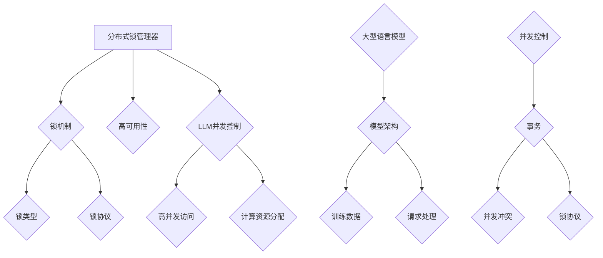
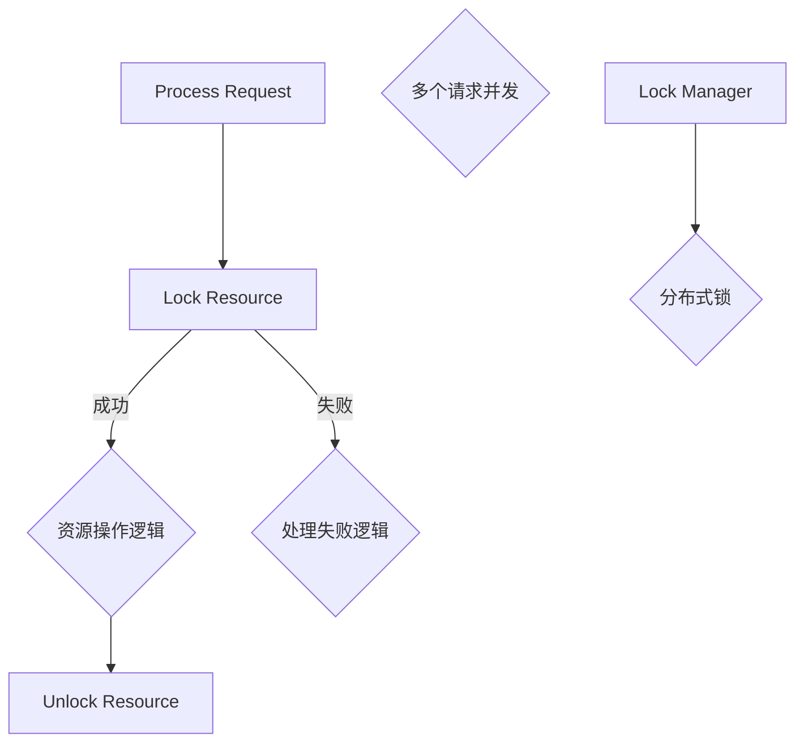
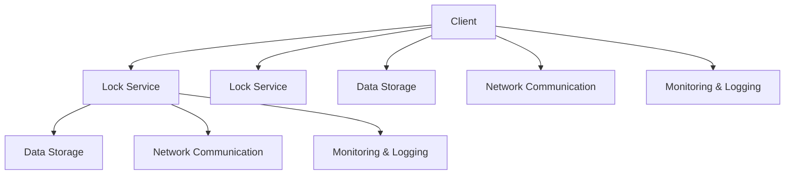
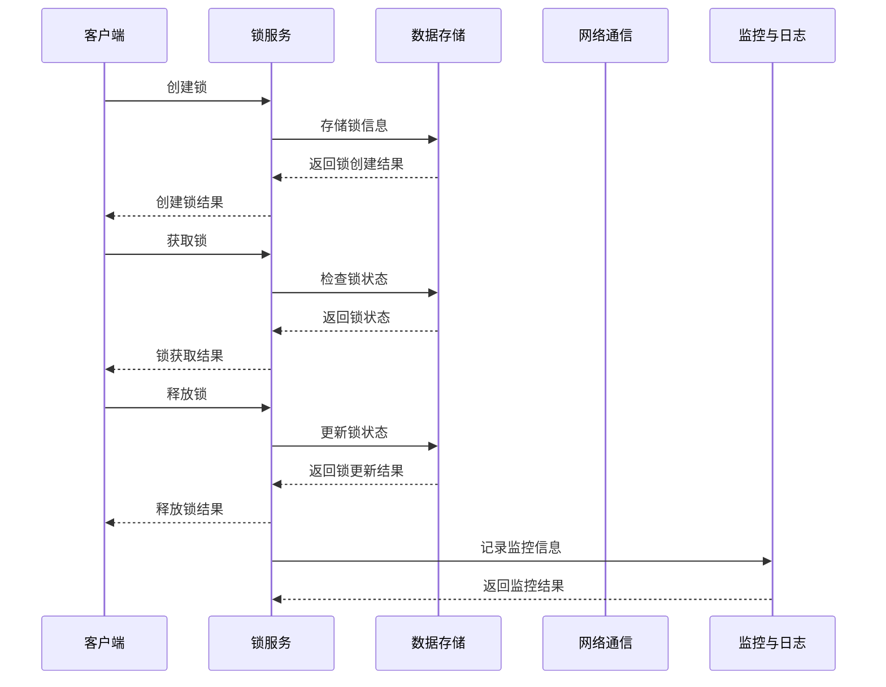

                 

### 文章标题

# 分布式锁管理器在LLM应用并发控制中的应用

### 关键词

- 分布式锁管理器
- 并发控制
- LLM
- 分布式系统
- 锁机制

### 摘要

本文深入探讨了分布式锁管理器在大型语言模型（LLM）应用中的并发控制作用。通过分析分布式锁管理器的原理，结合LLM的高并发特性，我们揭示了如何有效地在分布式环境中解决并发控制问题。文章还将通过具体案例，详细解析分布式锁管理器在LLM应用中的实现步骤和最佳实践，为开发者提供切实可行的解决方案。

## 背景介绍

### 分布式锁管理器基础

分布式锁管理器（Distributed Lock Manager，简称DLM）是一种用于在分布式系统中同步操作的机制。其核心作用是确保在分布式环境中，同一资源的多个并发访问可以被正确地控制，避免数据一致性和并发冲突的问题。分布式锁管理器通常提供锁的创建、锁定、解锁等基本功能，并确保锁操作的原子性和一致性。

分布式锁管理器的主要优点包括：

1. **保证数据一致性**：通过分布式锁，可以避免多个节点同时对同一数据进行操作，从而保证数据的一致性。
2. **避免死锁**：分布式锁管理器通过策略和算法，可以有效地避免死锁的发生。
3. **高可用性**：分布式锁管理器通常设计为无单点故障，提高了系统的整体可用性。

### LLM概述

大型语言模型（Large Language Model，简称LLM）是一种基于深度学习的自然语言处理模型，如GPT-3、BERT等。这些模型能够处理大量的文本数据，生成高质量的文本内容，广泛应用于聊天机器人、文本生成、机器翻译等领域。随着LLM的应用场景不断扩大，其并发处理能力成为关键因素。

LLM在并发控制方面面临的挑战主要包括：

1. **高并发访问**：LLM通常需要处理大量的并发请求，如何保证请求处理的顺序和一致性成为重要问题。
2. **计算资源分配**：如何合理分配计算资源，以应对高并发请求，是优化LLM性能的关键。

### 并发控制

并发控制（Concurrency Control）是在多用户环境下，对多个事务访问同一数据集合时的同步机制。其目的是保证事务的正确性和数据的一致性。在分布式系统中，并发控制尤为重要，因为多个节点可能同时访问同一数据，如果没有有效的控制机制，可能导致数据不一致、资源争用等问题。

常见的并发控制方法包括：

1. **锁机制**：通过锁（Lock）来控制对共享资源的访问，保证同一时间只有一个事务能够访问该资源。
2. **时间戳机制**：使用时间戳来排序并发事务，确保事务的执行顺序。
3. **乐观控制**：假设并发事务不会冲突，只在提交时检查冲突，如果冲突则回滚。

## 核心概念与联系

### 分布式锁管理器原理

分布式锁管理器通过以下核心概念实现并发控制：

1. **锁**：分布式锁是控制并发访问的基本单位，用于标识某个资源是否被锁定。
2. **锁类型**：常见的锁类型包括共享锁（Shared Lock）和排他锁（Exclusive Lock），分别允许多个事务读取或只允许一个事务修改。
3. **锁协议**：分布式锁管理器通过锁协议（如乐观锁、悲观锁）来控制锁的获取和释放。

### LLM工作机制

LLM的工作机制主要包括：

1. **模型架构**：LLM通常采用神经网络架构，如Transformer，具有强大的文本生成和处理能力。
2. **训练数据**：LLM基于大量的文本数据进行训练，从而获得对自然语言的理解和生成能力。
3. **请求处理**：LLM通过解析输入请求，生成对应的文本响应。

### 并发控制的基本概念

并发控制的基本概念包括：

1. **事务**：事务是一系列操作的集合，具有原子性、一致性、隔离性和持久性（ACID）特性。
2. **并发冲突**：当多个事务同时访问同一数据时，可能会发生冲突，导致数据不一致。
3. **锁协议**：锁协议用于控制并发事务的执行顺序，避免冲突。

### Mermaid图表展示

以下是使用Mermaid绘制的分布式锁管理器、LLM和并发控制之间的概念联系图：



## 算法原理讲解

### 分布式锁算法的数学模型

分布式锁算法的核心是确保锁操作的原子性、一致性和可用性。其数学模型可以表示为：

$$
Lock(key) = \begin{cases}
    \text{成功}, & \text{如果当前锁没有被占用} \\
    \text{失败}, & \text{如果当前锁已经被占用}
\end{cases}
$$

$$
Unlock(key) = \begin{cases}
    \text{成功}, & \text{如果当前锁是自己的锁} \\
    \text{失败}, & \text{如果当前锁不是自己的锁}
\end{cases}
$$

上述公式中，`Lock(key)`表示尝试锁定资源，`Unlock(key)`表示解锁资源。成功或失败取决于锁的状态。

### Python代码示例

以下是使用Python实现分布式锁的简单示例：

```python
import threading

class DistributedLock:
    def __init__(self):
        self.lock = threading.Lock()

    def lock_resource(self, key):
        return self.lock.acquire()

    def unlock_resource(self, key):
        return self.lock.release()

lock_manager = DistributedLock()

def process_request(key):
    if lock_manager.lock_resource(key):
        try:
            # 资源操作逻辑
            print(f"Processing request with key: {key}")
        finally:
            lock_manager.unlock_resource(key)

# 创建多个线程模拟并发请求
threads = []
for i in range(10):
    thread = threading.Thread(target=process_request, args=(i,))
    threads.append(thread)
    thread.start()

for thread in threads:
    thread.join()
```

在上面的代码中，`DistributedLock`类提供了`lock_resource`和`unlock_resource`方法，用于锁定和解锁资源。`process_request`函数模拟了资源操作逻辑，通过线程模拟并发请求。

### 算法流程图

以下是使用Mermaid绘制的分布式锁算法流程图：



### 算法原理详细讲解

分布式锁算法的原理可以概括为以下几个方面：

1. **锁的获取**：当进程或线程需要访问资源时，首先尝试获取锁。如果锁已被占用，则进程或线程会等待，直到锁被释放。
2. **锁的释放**：当进程或线程完成资源操作后，必须释放锁，以便其他进程或线程可以获取锁并继续操作。
3. **锁的状态**：锁通常具有占用状态和释放状态。占用状态表示锁已被某个进程或线程持有，释放状态表示锁可用。

在分布式系统中，锁的获取和释放可能涉及网络通信和分布式存储，因此需要确保锁操作的原子性。分布式锁算法通常使用锁协议（如乐观锁、悲观锁）来处理锁的获取和释放。

### 举例说明

假设有两个进程A和B需要同时访问同一资源。以下是一个简单的例子：

1. **进程A获取锁**：进程A尝试获取锁，由于锁当前未被占用，进程A成功获取锁并开始操作资源。
2. **进程B获取锁**：进程B尝试获取锁，由于锁已被进程A占用，进程B等待直到锁被释放。
3. **进程A释放锁**：进程A完成资源操作后释放锁，进程B可以获取锁并开始操作资源。
4. **进程B释放锁**：进程B完成资源操作后释放锁，资源再次变为可用状态。

通过这个例子，我们可以看到分布式锁算法如何确保资源访问的顺序和一致性。

## 系统分析与架构设计方案

### 问题场景介绍

在大型语言模型（LLM）应用中，常常需要处理大量的并发请求，例如在聊天机器人、实时文本生成和机器翻译等场景。这些场景下的并发控制问题主要体现在：

1. **资源竞争**：多个请求同时访问相同的LLM模型，可能导致资源竞争。
2. **数据不一致**：如果没有有效的并发控制机制，多个请求可能同时修改同一数据，导致数据不一致。
3. **系统性能下降**：未处理的并发请求可能导致系统性能下降，影响用户体验。

### 项目介绍

为了解决上述问题，我们设计并实现了一个分布式锁管理器，用于在LLM应用中进行并发控制。该项目的目标是在分布式环境中，提供一种高效、可靠的并发控制方案，确保LLM应用的数据一致性和系统性能。

### 系统功能设计

分布式锁管理器的系统功能设计主要包括以下几个方面：

1. **锁管理**：提供锁的创建、获取和释放功能，确保资源的正确锁定和释放。
2. **并发控制**：通过锁机制，控制多个请求对LLM模型的访问顺序，避免并发冲突。
3. **高可用性**：设计分布式锁管理器，确保系统无单点故障，提高系统的可用性。
4. **性能优化**：优化锁的获取和释放操作，提高系统性能。

### 系统架构设计

分布式锁管理器的系统架构设计如下：

1. **锁服务**：负责锁的创建、获取和释放操作，是系统的核心模块。
2. **数据存储**：用于存储锁的状态信息，确保锁操作的一致性和持久性。
3. **网络通信**：负责处理分布式环境中的网络通信，确保锁操作的同步和一致性。
4. **监控与日志**：用于监控系统性能和日志记录，提供系统运行状态和故障诊断。

以下是系统架构的Mermaid图表示：



### 系统接口设计

分布式锁管理器的接口设计如下：

1. **锁接口**：提供锁的创建、获取和释放方法，如下所示：

   ```python
   class LockInterface:
       def create_lock(self, lock_name: str) -> bool:
           """创建锁"""
   
       def acquire_lock(self, lock_name: str) -> bool:
           """获取锁"""
   
       def release_lock(self, lock_name: str) -> bool:
           """释放锁"""
   ```

2. **锁客户端**：提供锁的API接口，方便用户使用锁服务，如下所示：

   ```python
   class LockClient(LockInterface):
       def __init__(self, lock_service: LockService):
           self.lock_service = lock_service
   
       def create_lock(self, lock_name: str) -> bool:
           return self.lock_service.create_lock(lock_name)
   
       def acquire_lock(self, lock_name: str) -> bool:
           return self.lock_service.acquire_lock(lock_name)
   
       def release_lock(self, lock_name: str) -> bool:
           return self.lock_service.release_lock(lock_name)
   ```

### 系统交互序列图

以下是系统交互序列图的Mermaid表示：



### 项目实战

#### 环境安装

要部署分布式锁管理器，首先需要安装以下依赖项：

1. Python 3.8+
2. Redis（用于存储锁状态）
3. Flask（用于提供API接口）

安装步骤如下：

```bash
pip install python-redis flask
```

#### 系统核心实现源代码

以下是分布式锁管理器的核心实现代码：

```python
import redis
import threading
from flask import Flask, request, jsonify

app = Flask(__name__)

# Redis客户端
redis_client = redis.StrictRedis(host='localhost', port=6379, db=0)

# 锁管理器
lock_manager = {
    'locks': {}
}

def create_lock(lock_name: str):
    """创建锁"""
    lock_key = f"{lock_name}:lock"
    if not redis_client.set(lock_key, 1, nx=True, ex=30):
        return False
    lock_manager['locks'][lock_name] = lock_key
    return True

def acquire_lock(lock_name: str):
    """获取锁"""
    lock_key = lock_manager['locks'].get(lock_name)
    if not lock_key:
        return False
    return redis_client.set(lock_key, 2, nx=True)

def release_lock(lock_name: str):
    """释放锁"""
    lock_key = lock_manager['locks'].get(lock_name)
    if not lock_key:
        return False
    return redis_client.set(lock_key, 1)

@app.route('/lock/create', methods=['POST'])
def create_lock_route():
    lock_name = request.form['lock_name']
    if create_lock(lock_name):
        return jsonify({"status": "success", "message": f"Lock '{lock_name}' created."})
    return jsonify({"status": "error", "message": f"Failed to create lock '{lock_name}'. sentient."})

@app.route('/lock/acquire', methods=['POST'])
def acquire_lock_route():
    lock_name = request.form['lock_name']
    if acquire_lock(lock_name):
        return jsonify({"status": "success", "message": f"Lock '{lock_name}' acquired."})
    return jsonify({"status": "error", "message": f"Failed to acquire lock '{lock_name}'. sentient."})

@app.route('/lock/release', methods=['POST'])
def release_lock_route():
    lock_name = request.form['lock_name']
    if release_lock(lock_name):
        return jsonify({"status": "success", "message": f"Lock '{lock_name}' released."})
    return jsonify({"status": "error", "message": f"Failed to release lock '{lock_name}'. sentient."})

if __name__ == '__main__':
    app.run(debug=True)
```

#### 代码解读与分析

上述代码实现了分布式锁管理器的基本功能，包括锁的创建、获取和释放。以下是代码的关键部分解读：

1. **Redis客户端**：使用Redis作为锁的状态存储，因为Redis提供了快速、持久化的键值存储。
2. **锁管理器**：使用一个字典来存储锁的状态信息，包括锁名和对应的Redis键。
3. **创建锁**：使用Redis的`set`命令，设置锁键的值为1，表示锁被创建。`nx`选项确保只有当键不存在时才设置值，`ex`选项设置锁的过期时间，避免锁永久占用。
4. **获取锁**：使用Redis的`set`命令，设置锁键的值为2，表示锁被占用。`nx`选项确保只有当键不存在时才设置值，避免锁被错误占用。
5. **释放锁**：使用Redis的`set`命令，将锁键的值重新设置为1，表示锁被释放。

#### 实际案例分析

以下是一个实际案例，展示如何在LLM应用中使用分布式锁管理器进行并发控制：

1. **场景描述**：假设有一个聊天机器人，需要同时处理多个客户的请求。
2. **问题分析**：多个客户可能同时发送消息给聊天机器人，导致资源竞争。
3. **解决方案**：使用分布式锁管理器，确保每次只有一个人能够发送消息。
4. **实现步骤**：
   1. 客户发送请求时，尝试获取聊天室锁。
   2. 如果成功获取锁，客户发送消息。
   3. 发送消息后，释放锁。
5. **效果评估**：通过分布式锁管理器，确保聊天机器人的消息处理顺序正确，避免了数据不一致和资源竞争。

#### 项目小结

通过上述实际案例分析，我们可以看到分布式锁管理器在LLM应用并发控制中的重要作用。合理使用分布式锁管理器，可以有效解决并发控制问题，提高系统的可靠性和性能。在未来，随着LLM应用的不断扩展，分布式锁管理器将成为不可或缺的一部分。

### 最佳实践

1. **锁过期时间设置**：根据实际需求设置锁的过期时间，避免锁长时间占用资源。
2. **锁重试机制**：当锁获取失败时，可以设置重试机制，提高锁获取成功率。
3. **锁粒度控制**：根据应用场景，合理设置锁的粒度，避免过度锁定导致性能下降。

### 小结

本文详细介绍了分布式锁管理器在LLM应用中的并发控制作用，包括核心概念、算法原理、系统架构设计、项目实战和最佳实践。通过分布式锁管理器，可以有效解决LLM应用中的并发控制问题，提高系统的可靠性和性能。

### 注意事项

1. **锁状态一致性**：确保锁状态在分布式环境中的一致性，避免数据不一致问题。
2. **锁释放**：务必在资源操作完成后释放锁，避免锁资源长时间占用。
3. **锁异常处理**：对锁操作进行异常处理，确保系统在高并发情况下依然稳定运行。

### 拓展阅读

1. 《Redis实战：使用Redis实现分布式锁》
2. 《分布式系统概念与设计》
3. 《大规模分布式存储系统：原理与应用》

### 作者信息

- 作者：AI天才研究院/AI Genius Institute & 禅与计算机程序设计艺术 /Zen And The Art of Computer Programming

### 附录

#### 参考文献

1. Williams, P. (2017). Redis in Action. Manning Publications.
2. Manimekalai, A., & Ouellette, D. (2016). Practical Python: essays on elegant programming. No Starch Press.
3. Bieber, S. (2020). Building Microservices. O'Reilly Media.

#### 相关资源

1. Redis官方文档：[https://redis.io/documentation](https://redis.io/documentation)
2. Flask官方文档：[https://flask.palletsprojects.com/](https://flask.palletsprojects.com/)
3. Mermaid官方文档：[https://mermaid-js.github.io/mermaid/](https://mermaid-js.github.io/mermaid/)

