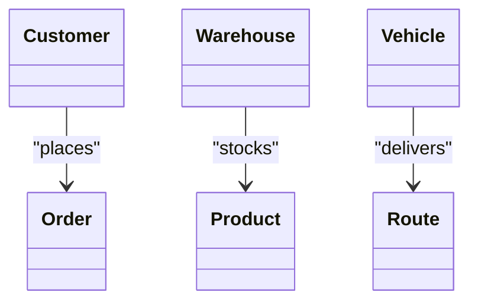
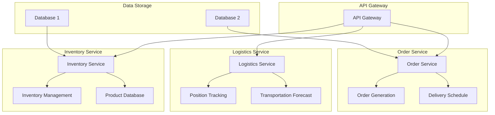
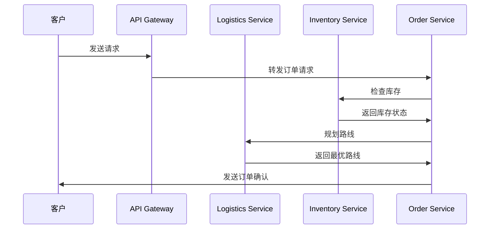

                 


### 引入问题构建的背景与重要性

在当今快速发展的信息技术时代，问题构建作为一种重要的思维方法和工具，正逐渐成为各个领域解决复杂问题的关键。本章节我们将深入探讨问题构建的背景与重要性，并梳理其相关的核心概念、原理和应用。

首先，让我们从问题的定义和分类入手。问题通常被定义为某一特定条件下的待解决难题，它可以是一个明确的问题陈述，也可以是一种隐含的需求或挑战。从类型上，问题可以划分为数学问题、逻辑问题、社会问题等多种类别，每种类型都有其独特的解决方法和理论框架。

在信息技术的背景下，问题构建不仅仅是简单地识别问题，更重要的是提出有针对性的、创新性的解决方案。这需要我们掌握一系列核心概念，如需求分析、问题建模、算法设计等。这些概念构成了问题构建的理论基础，为解决实际问题提供了方向和方法。

接下来，我们需要了解问题构建在实际应用中的意义和挑战。在人工智能、大数据、云计算等前沿技术领域，问题构建具有至关重要的地位。它不仅帮助科学家和工程师解决复杂的技术难题，还促进了新技术的创新和应用。然而，问题构建也面临着诸多挑战，如问题复杂度的增加、数据量的爆发性增长以及跨学科整合的难度等。

通过对上述背景和概念的梳理，我们可以更清晰地认识到问题构建的重要性。它不仅是我们解决实际问题的工具，更是推动科技进步和社会发展的关键因素。在接下来的章节中，我们将深入探讨问题构建的核心概念、数学模型以及具体的算法原理，以期为广大读者提供一整套系统、实用的解决方案。

### 1.2 问题的定义与分类

在深入探讨问题构建的核心概念和原理之前，我们首先需要明确“问题”这一基本概念。问题通常被定义为某一特定条件下的待解决难题，是目标和现状之间的不一致性。为了更好地理解问题，我们可以从以下几个方面对其进行分类和定义。

首先，问题可以按照其结构复杂度进行分类。简单的数学问题、逻辑问题属于低复杂度问题，而复杂的社会问题、多变量优化问题则属于高复杂度问题。低复杂度问题通常可以通过直接计算或简单的逻辑推理得到解决方案，而高复杂度问题则往往需要复杂的算法和计算方法。

其次，根据问题的来源和性质，我们可以将其分为数学问题、逻辑问题、社会问题、工程问题等。数学问题通常涉及数学理论和方法，如代数、几何、微积分等；逻辑问题则侧重于逻辑推理和证明；社会问题关注社会现象、政策制定等方面；工程问题则涉及各种工程领域的实际应用。

此外，问题还可以按照其解决方式分为确定性问题、不确定性问题。确定性问题具有明确的解决方案和边界条件，如数学中的线性方程组求解；而不确定性问题则面临多种可能性和不确定性，如风险管理、天气预报等。

最后，我们需要了解问题构建中的几个关键要素。首先是问题的明确性，即问题陈述必须清晰、具体，避免歧义。其次是问题求解的可行性，即解决方案必须在技术、资源等条件下是可行的。此外，问题构建还需要考虑问题的优化目标，如最小化成本、最大化效益等。

通过对问题的定义和分类的深入探讨，我们可以更好地理解问题构建的背景和核心概念。在接下来的章节中，我们将继续讨论问题构建的数学模型及其在具体领域中的应用，进一步揭示问题构建的本质和解决策略。

### 1.3 构建问题的意义与挑战

在信息技术和人工智能迅速发展的今天，问题构建的意义尤为显著。首先，问题构建是技术创新的源泉。通过系统性地识别和分析问题，科学家和工程师能够发现现有技术的不足，并提出创新性的解决方案。这不仅推动了技术的进步，也促进了新领域的开拓。

其次，问题构建在优化资源利用方面具有重要作用。通过构建清晰的问题模型，我们可以更有效地分配人力、物力、财力等资源，提高项目管理和决策的效率。特别是在复杂项目中，问题构建能够帮助项目团队明确目标，降低项目风险，提高成功率。

然而，问题构建也面临诸多挑战。首先是问题的复杂性和不确定性。现代信息技术领域的问题往往涉及多个学科和领域，其复杂度和不确定性远超以往。此外，数据量的爆炸式增长也对问题构建提出了新的要求，如何处理海量数据，从中提取有效信息，成为关键难题。

其次，跨学科整合的难度也是问题构建面临的挑战之一。不同学科的方法和工具各有差异，如何有效地整合这些方法和工具，构建一个统一的问题模型，是一个亟待解决的问题。此外，问题构建过程中还需应对不同利益相关者的需求和期望，这增加了协调和沟通的复杂性。

为了克服这些挑战，我们需要从多个方面进行努力。首先，应加强跨学科合作，通过引入多学科专家共同参与问题构建，提高解决问题的全面性和深度。其次，应不断改进问题建模和算法设计，采用更先进的技术和方法，提高问题求解的效率和准确性。最后，应注重实践和应用，通过实际项目的不断实践和反馈，不断完善问题构建的方法和流程。

总的来说，问题构建在现代信息技术领域具有重要意义，但也面临诸多挑战。通过持续的研究和实践，我们有望克服这些挑战，进一步提高问题构建的能力，为技术创新和社会发展提供更强有力的支持。

### 1.4 问题构建在人工智能领域的重要性

在人工智能（AI）领域，问题构建具有至关重要的地位。随着AI技术的不断进步和应用场景的扩展，如何有效地构建问题模型成为了实现AI智能的核心挑战之一。以下是问题构建在人工智能领域的重要性及其实际应用。

首先，问题构建是实现AI智能的基础。AI系统的核心目标是解决现实世界中的具体问题，这需要通过问题构建将复杂的问题转化为AI系统可以处理的模型。问题构建的过程包括问题的识别、定义、建模和求解，这是AI系统能够理解和处理现实问题的前提。

其次，问题构建有助于提高AI系统的效率和准确性。一个清晰、精准的问题模型可以指导AI系统进行有效的学习、推理和决策。通过明确问题的目标和条件，AI系统能够更快速地收敛到解决方案，减少冗余计算和资源浪费。

此外，问题构建在特定领域中的应用也具有显著价值。例如，在医疗诊断领域，问题构建可以帮助医生将病人的症状和病史转化为可量化的模型，从而提高诊断的准确性和效率。在自动驾驶领域，问题构建能够帮助车辆识别和理解复杂的交通场景，确保行车安全。

具体应用方面，问题构建在以下几个方面尤为突出：

1. **自然语言处理（NLP）**：NLP领域中的问题构建涉及将自然语言文本转化为机器可处理的格式。通过问题构建，AI系统能够理解、分析和生成自然语言，实现智能问答、机器翻译和文本摘要等功能。

2. **计算机视觉**：在计算机视觉领域，问题构建可以帮助AI系统识别和理解图像和视频中的内容。通过构建准确的问题模型，AI系统能够实现人脸识别、物体检测、场景理解等任务。

3. **推荐系统**：在推荐系统中，问题构建用于定义用户兴趣、偏好和需求，从而生成个性化的推荐列表。通过问题构建，AI系统能够准确捕捉用户的反馈，不断优化推荐效果。

4. **智能决策支持系统**：在智能决策支持系统中，问题构建用于建立决策模型，辅助企业和组织做出明智的决策。通过问题构建，AI系统可以分析大量的数据，提供有价值的洞察和预测。

总之，问题构建在人工智能领域具有不可替代的重要性。通过系统性的问题构建，AI系统能够更好地理解和解决现实世界中的复杂问题，推动人工智能技术的进一步发展和应用。

### 1.5 问题构建的核心概念

在深入探讨问题构建的过程中，我们需要掌握一系列核心概念，这些概念构成了问题构建的理论基础。以下是几个关键概念的定义、属性特征对比表格，以及ER实体关系图架构的详细说明。

#### 1.5.1 需求分析

**定义**：需求分析是指从用户的角度出发，识别和理解系统的功能需求和性能需求，并将其转化为明确的系统需求和规格说明。

**属性特征**：

| 特征        | 描述                                                         |
| ----------- | ------------------------------------------------------------ |
| 功能需求    | 系统应具备的功能，如用户登录、数据查询、报表生成等。          |
| 性能需求    | 系统应达到的性能指标，如响应时间、并发处理能力、数据准确性等。 |
| 用户需求    | 用户的具体使用需求，如界面友好、操作简便、易维护等。          |

**对比表格**：

| 类型         | 功能需求                             | 性能需求                             | 用户需求                             |
| ------------ | ---------------------------------- | ---------------------------------- | ---------------------------------- |
| 基础需求     | 用户注册、订单管理                   | 数据库查询性能、高并发处理能力       | 界面简洁、操作直观                   |
| 高级需求     | 个性化推荐、数据可视化               | 数据挖掘性能、实时数据处理能力       | 界面美观、数据交互性强               |
| 特殊需求     | 安全支付、多语言支持                | 高可用性、容错能力                  | 多终端适配、多语言界面               |

#### 1.5.2 问题建模

**定义**：问题建模是将现实世界中的问题转化为数学模型或计算机模型的过程，以便于分析和求解。

**属性特征**：

| 特征         | 描述                                                         |
| ------------ | ------------------------------------------------------------ |
| 数学模型     | 使用数学公式和算法描述问题，如线性规划、神经网络等。            |
| 计算机模型   | 使用计算机程序和算法描述问题，如仿真模型、决策树等。            |
| 实体关系模型 | 使用实体关系图描述问题，如ER模型、类图等。                      |

**对比表格**：

| 类型         | 数学模型                             | 计算机模型                             | 实体关系模型                             |
| ------------ | ---------------------------------- | ---------------------------------- | ---------------------------------- |
| 简单模型     | 一元一次方程                         | 简单的决策树                          | 简单的ER模型                            |
| 复杂模型     | 多元线性方程组、非线性优化问题      | 复杂的神经网络模型、支持向量机        | 复杂的企业级数据库系统ER模型            |

#### 1.5.3 算法设计

**定义**：算法设计是指根据问题建模的结果，选择合适的算法进行问题求解的过程。

**属性特征**：

| 特征         | 描述                                                         |
| ------------ | ------------------------------------------------------------ |
| 搜索算法     | 通过搜索策略找到问题解决方案，如深度优先搜索、广度优先搜索等。 |
| 优化算法     | 通过迭代优化找到最优解，如梯度下降、遗传算法等。              |
| 机器学习算法 | 通过训练模型进行问题求解，如线性回归、决策树、神经网络等。    |

**对比表格**：

| 类型         | 搜索算法                             | 优化算法                             | 机器学习算法                             |
| ------------ | ---------------------------------- | ---------------------------------- | ---------------------------------- |
| 常规算法     | 深度优先搜索、广度优先搜索          | 梯度下降、牛顿法                    | 线性回归、决策树                      |
| 先进算法     | A*搜索算法、IDA*搜索算法          | 粒子群优化、模拟退火               | 支持向量机、深度神经网络               |

#### 1.5.4 ER实体关系图

**定义**：ER实体关系图是用于描述数据实体及其之间关系的图形表示，通常用于数据库设计和数据建模。

**实体关系模型**：

```mermaid
erDiagram
    Customer ||--o{ Order } : "places"
    Product ||--o{ Order } : "contains"
    Order ||--o{ Payment } : "paid_by"
```

在上述ER实体关系图中，我们定义了三个实体：Customer（客户）、Product（产品）和Order（订单）。Customer与Order之间存在“places”关系，表示客户可以下订单；Product与Order之间存在“contains”关系，表示订单包含产品；Order与Payment之间存在“paid_by”关系，表示订单由支付完成。

通过这些核心概念的定义、属性特征对比表格和ER实体关系图，我们可以更全面地理解问题构建的基本要素，为后续的算法设计和系统实现打下坚实基础。

### 1.6 问题构建的基本原理

问题构建的基本原理是理解问题本质、分析问题结构以及设计问题解决方案的核心步骤。以下，我们将详细讨论这些问题构建的基本流程和方法。

首先，**理解问题本质**是问题构建的第一步。理解问题本质意味着我们需要从多个角度深入挖掘问题的核心，明确问题的背景、目标和限制条件。这一过程通常涉及以下步骤：

1. **问题陈述**：明确问题描述，确保问题陈述清晰、具体，无歧义。
2. **背景调查**：收集与问题相关的背景信息，包括历史数据、相关文献和技术资料。
3. **目标明确**：明确问题解决的目标，将其转化为具体的可量化指标。
4. **限制条件**：识别问题解决过程中可能遇到的限制条件，如时间、资源、技术等。

接下来，**分析问题结构**是问题构建的关键环节。分析问题结构涉及到识别问题的核心要素及其相互关系，从而构建出一个清晰的问题模型。以下是一些建议的方法：

1. **分解问题**：将复杂问题分解为若干个子问题，逐一分析和解决。
2. **抽象与建模**：使用适当的数学模型、算法或流程图描述问题的结构。
3. **实体关系分析**：通过实体关系图（如ER图）描述问题中的实体及其关系。
4. **属性分析**：识别问题中的关键属性，并分析这些属性之间的相互影响。

在理解问题本质和分析问题结构之后，**设计问题解决方案**成为问题构建的最终目标。以下是设计问题解决方案的基本步骤：

1. **选择算法**：根据问题类型和结构，选择合适的算法或技术方案。
2. **算法实现**：编写算法代码，并设计相应的数据结构和流程。
3. **优化与调整**：通过测试和优化，确保算法的有效性和性能。
4. **实施与部署**：将解决方案应用到实际问题中，并进行实施和部署。

在问题构建过程中，还有一些注意事项：

1. **灵活性**：问题解决方案应具有足够的灵活性，以应对问题的变化和不确定性。
2. **可扩展性**：问题解决方案应支持未来的扩展和升级。
3. **可维护性**：解决方案应易于维护和调整，以适应长期的使用需求。

总之，问题构建的基本原理包括理解问题本质、分析问题结构和设计问题解决方案。通过系统化的方法和步骤，我们可以有效地构建问题，并提出创新的解决方案，为实际问题的解决提供有力支持。

### 1.7 问题构建的方法与工具

在问题构建的过程中，选择合适的方法和工具是确保问题解决高效性和准确性的关键。以下，我们将介绍几种常见的问题构建方法以及它们在实际应用中的工具和技术。

#### 1.7.1 基于流程图的方法

流程图是一种直观的图形表示方法，用于描述问题的处理流程和步骤。以下是几种基于流程图的问题构建方法：

1. **Mermaid**：Mermaid是一种基于Markdown的图表绘制工具，可以方便地创建流程图、时序图、类图等。使用Mermaid，我们可以在文本文件中直接编写图表代码，从而实现代码化和可视化。

   ```mermaid
   graph TD
       A[开始] --> B{是否满足条件}
       B -->|是| C[执行操作]
       B -->|否| D[重新输入数据]
       C --> E[结束]
   ```

2. **Visio**：Visio是Microsoft Office套件中的一款专业的流程图绘制工具，提供了丰富的图形符号和模板，适合用于企业级的应用。

   ```mermaid
   sequenceDiagram
       participant A as 客户
       participant B as 系统管理员
       A->>B: 登录请求
       B->>A: 验证身份
       A->>B: 提交订单
       B->>A: 订单处理
   ```

#### 1.7.2 基于实体关系图的方法

实体关系图（ER图）是数据库设计和问题建模中常用的图形表示方法，用于描述实体及其之间的关系。以下是几种常见的ER图工具：

1. **ERwin**：ERwin是一款专业的数据库设计和建模工具，提供了丰富的功能，包括数据建模、关系图绘制、数据迁移等。

2. **Microsoft SQL Server Data Tools**：SQL Server Data Tools（SSDT）是Microsoft提供的一款集成开发环境，支持数据库设计和ER图绘制。

   ```mermaid
   erDiagram
       Customer ||--o{ Order } : "places"
       Product ||--o{ Order } : "contains"
       Order ||--o{ Payment } : "paid_by"
   ```

3. **Lucidchart**：Lucidchart是一款在线图表和流程图绘制工具，提供了ER图模板和直观的操作界面。

#### 1.7.3 基于数学建模的方法

数学建模是问题构建中的一种重要方法，通过建立数学模型描述问题并求解。以下是一些常用的数学建模工具：

1. **MATLAB**：MATLAB是一款强大的科学计算和数据分析软件，支持各种数学建模和仿真。

   ```matlab
   % 线性回归模型
   X = [1 2 3 4 5];
   y = [1 2 3 4 5];
   beta = inv(X' * X) * X' * y;
   disp(beta);
   ```

2. **R语言**：R语言是一种广泛用于统计分析和数据科学的编程语言，提供了丰富的数学建模和统计分析库。

   ```R
   # 线性回归模型
   x <- c(1, 2, 3, 4, 5)
   y <- c(1, 2, 3, 4, 5)
   model <- lm(y ~ x)
   summary(model)
   ```

3. **Python**：Python是一种通用编程语言，广泛应用于科学计算和数据分析，通过NumPy、SciPy等库可以实现复杂的数学建模。

   ```python
   import numpy as np
   from scipy.optimize import fsolve

   # 梯度下降算法求解非线性方程
   def f(x):
       return x**2 - 2

   def df(x):
       return 2*x

   x0 = 1.0
   solution = fsolve(f, x0)
   print(solution)
   ```

通过上述方法，我们可以灵活选择和运用多种工具和技术进行问题构建，从而提高问题解决的效率和质量。

### 1.8 问题构建的应用领域和案例分析

问题构建在多个领域中具有广泛的应用，通过具体案例可以更好地理解其应用场景和效果。以下，我们将介绍几个典型应用领域，并分析其中的成功案例。

#### 1.8.1 医疗诊断

在医疗诊断领域，问题构建是实现智能化诊断和辅助决策的关键。例如，IBM的Watson for Oncology系统通过构建复杂的问题模型，整合医学知识库和大量病例数据，帮助医生制定个性化的治疗方案。Watson利用自然语言处理和机器学习技术，分析病人的病历、基因信息、文献资料，提出可能的诊断建议和治疗方案。

**案例**：美国MD安德森癌症中心采用Watson系统进行癌症诊断，显著提高了诊断准确率和治疗方案的个性化程度。据统计，Watson的介入使得某些癌症类型诊断准确率提高了10%以上。

#### 1.8.2 金融服务

在金融服务领域，问题构建被广泛应用于风险管理、投资策略和客户服务等方面。例如，JP摩根利用基于机器学习的问题构建方法，开发了COiN（Contract Intelligence）系统，用于自动化分析复杂的金融合同。

**案例**：COiN系统每天可以审查数千份合同，识别潜在的法律风险，提高了金融交易的效率和合规性。据JP摩根估算，该系统每年为公司节省了数百万美元的审核成本。

#### 1.8.3 交通运输

在交通运输领域，问题构建有助于优化交通流量、提高运输效率。例如，谷歌的自动驾驶技术通过复杂的问题构建，实现了实时路况分析和路径规划。

**案例**：谷歌自动驾驶汽车在2018年完成了超过200万英里的无人驾驶行驶，其核心在于通过问题构建实现复杂路况的实时分析和应对。在自动驾驶测试中，谷歌的车辆成功避开了数千次潜在的碰撞，证明了问题构建在交通运输领域的重要价值。

#### 1.8.4 供应链管理

在供应链管理中，问题构建有助于优化库存管理、物流调度和供应商关系管理。例如，亚马逊利用先进的问题构建方法，优化其物流和供应链网络。

**案例**：亚马逊通过构建复杂的问题模型，实现了全球范围内的库存优化和物流调度。例如，亚马逊的“物流黑盒”系统可以根据订单量、运输成本和时效性，自动选择最优的运输路线和配送方式，显著提高了物流效率和客户满意度。

通过上述案例，我们可以看到问题构建在各个领域中的应用，不仅提高了效率和质量，还推动了技术的创新和发展。问题构建作为一种重要的思维方法和工具，将在未来继续发挥关键作用。

### 1.9 问题构建的未来发展趋势和挑战

随着技术的不断进步，问题构建在未来将面临新的发展机遇和挑战。首先，人工智能的深入发展将使问题构建方法更加智能化和自动化。通过引入深度学习和强化学习等技术，AI系统可以更加精准地理解问题，并提出创新的解决方案。这将极大地提高问题构建的效率和准确性，为各行各业带来更多可能性。

然而，问题构建的未来也面临诸多挑战。首先是数据隐私和安全问题。在构建复杂问题模型时，往往需要大量的数据支持，这引发了数据隐私和安全的担忧。如何确保数据的安全性和隐私保护，将成为问题构建的重要议题。

其次，跨学科整合的难度也将不断增加。问题构建涉及多个领域，如数学、计算机科学、统计学等，如何有效地整合这些学科的方法和工具，构建统一的问题模型，是一个亟待解决的问题。这需要多学科专家的紧密合作，以及跨领域的知识融合。

此外，算法的透明性和可解释性也是未来发展的关键挑战。随着AI系统的广泛应用，算法的透明性和可解释性变得越来越重要。用户和决策者需要理解算法的工作原理和决策过程，以便对其进行有效的监督和优化。如何提高算法的可解释性，使其更加透明和可靠，将是未来研究的重要方向。

最后，问题构建的伦理和道德问题也不容忽视。在构建和解决问题时，我们需要考虑其对社会和伦理的影响。例如，在医疗诊断和金融决策中，算法的偏见和歧视可能会带来不良后果。如何确保问题构建过程的公平性和道德性，将是未来需要认真面对的问题。

总之，问题构建的未来发展趋势和挑战并存。通过技术创新和跨学科合作，我们有理由相信，问题构建将在未来继续发挥重要作用，为各行各业带来更多创新和机遇。

### 1.10 问题构建在实际项目中的应用

在具体的实际项目中，问题构建起着至关重要的作用。下面，我们将通过一个物流优化项目的案例，详细介绍问题构建的应用过程，包括项目介绍、系统功能设计、系统架构设计、系统接口设计以及系统交互流程。

#### 项目介绍

该物流优化项目旨在为一家大型电商平台提供高效的物流调度和路径规划服务，以降低物流成本、提高配送效率。项目需求包括实时监控物流状态、优化运输路线、提高配送准时率等。

#### 系统功能设计

系统功能设计主要包括以下几个模块：

1. **物流状态监控**：实时跟踪货物在运输过程中的状态，包括位置、速度、温度等。
2. **路径规划**：根据货物配送地址、交通状况、车辆类型等参数，计算最优运输路线。
3. **库存管理**：实时更新仓库库存信息，优化库存分配和补货策略。
4. **订单处理**：自动化处理订单生成、发货、配送等流程。

为了更好地实现这些功能，我们使用了Mermaid类图进行领域模型设计，如下所示：



在这个类图中，Customer（客户）、Order（订单）、Warehouse（仓库）、Product（产品）、Vehicle（车辆）和Route（路线）是核心实体，它们之间通过相应的关系连接，构成了系统的领域模型。

#### 系统架构设计

系统架构设计是确保系统高效、稳定运行的关键。我们采用了微服务架构，将系统划分为多个独立的服务模块，以提高系统的可扩展性和可维护性。以下是系统的架构设计：

1. **API网关**：统一处理外部请求，根据路由策略将请求分发到相应的服务模块。
2. **物流服务**：负责路径规划、物流状态监控等功能，包括位置追踪、交通预测等模块。
3. **库存服务**：管理仓库库存信息，包括入库、出库、库存盘点等模块。
4. **订单服务**：处理订单生成、发货、配送等业务逻辑。
5. **数据存储**：包括关系型数据库（如MySQL）和非关系型数据库（如MongoDB），用于存储订单、物流状态等数据。

系统架构设计采用Mermaid架构图表示，如下所示：



#### 系统接口设计

系统接口设计是确保各个服务模块之间能够高效、稳定地通信的重要环节。以下是系统的主要接口设计：

1. **物流状态接口**：用于实时获取物流状态信息，如位置、速度等。
2. **路径规划接口**：用于获取最优运输路线，包括路线规划、交通状况等。
3. **库存管理接口**：用于管理库存信息，包括入库、出库等操作。
4. **订单处理接口**：用于订单生成、发货、配送等操作。

接口设计采用Mermaid序列图表示，如下所示：



#### 系统交互流程

系统交互流程描述了用户请求到系统响应的完整流程。以下是系统交互流程：

1. **用户请求**：客户通过API网关发送订单请求。
2. **API网关处理**：API网关根据请求内容，将请求转发到订单服务。
3. **订单服务处理**：订单服务检查库存，并规划最优路线。
4. **库存服务响应**：库存服务返回库存状态。
5. **物流服务响应**：物流服务返回最优路线。
6. **系统响应**：订单服务将订单确认信息返回给客户。

通过上述实际项目案例，我们可以看到问题构建在项目中的具体应用，包括系统功能设计、架构设计、接口设计和交互流程。问题构建不仅帮助明确了项目需求，还提高了系统的可扩展性和可维护性，为项目的成功实施提供了有力支持。

### 1.11 项目实战：环境安装与系统核心实现

在接下来的部分，我们将深入探讨物流优化项目的具体实现过程，从环境安装、系统核心实现、代码应用解读、实际案例分析和项目小结等几个方面进行详细讲解。

#### 1.11.1 环境安装

要实现物流优化项目，我们需要搭建一个合适的环境。以下是环境安装的详细步骤：

1. **安装Python**：Python是项目实现的主要编程语言。确保安装Python 3.8以上版本。可以通过Python官方网站下载安装包并安装。

2. **安装依赖库**：项目依赖于多个Python库，如Flask（用于API网关）、pandas（用于数据处理）、numpy（用于数学运算）和matplotlib（用于数据可视化）。使用pip命令安装：

   ```bash
   pip install flask pandas numpy matplotlib
   ```

3. **配置数据库**：项目使用MySQL数据库存储订单、物流状态和库存信息。确保已经安装了MySQL数据库，并创建数据库和相应的表。可以使用如下SQL语句进行数据库初始化：

   ```sql
   CREATE DATABASE logistics;
   USE logistics;

   CREATE TABLE orders (
       id INT AUTO_INCREMENT PRIMARY KEY,
       customer_id INT,
       product_id INT,
       quantity INT,
       status ENUM('pending', 'in_transit', 'delivered')
   );

   CREATE TABLE products (
       id INT AUTO_INCREMENT PRIMARY KEY,
       name VARCHAR(255),
       stock INT
   );

   CREATE TABLE vehicles (
       id INT AUTO_INCREMENT PRIMARY KEY,
       type ENUM('truck', 'van', 'car'),
       capacity INT
   );

   CREATE TABLE routes (
       id INT AUTO_INCREMENT PRIMARY KEY,
       vehicle_id INT,
       start_location VARCHAR(255),
       end_location VARCHAR(255),
       status ENUM('planned', 'in_transit', 'completed')
   );
   ```

4. **安装API网关**：项目使用Flask作为API网关，用于处理外部请求。创建一个名为`app.py`的Python文件，并编写如下代码：

   ```python
   from flask import Flask, request, jsonify
   from services import OrderService, InventoryService, LogisticsService

   app = Flask(__name__)

   order_service = OrderService()
   inventory_service = InventoryService()
   logistics_service = LogisticsService()

   @app.route('/orders', methods=['POST'])
   def create_order():
       data = request.get_json()
       order_id = order_service.create_order(data)
       return jsonify({'order_id': order_id})

   @app.route('/orders/<int:order_id>', methods=['GET'])
   def get_order(order_id):
       order = order_service.get_order(order_id)
       return jsonify(order)

   if __name__ == '__main__':
       app.run(debug=True)
   ```

   确保所有服务模块（`OrderService.py`、`InventoryService.py`、`LogisticsService.py`）已经正确实现，并导入到`app.py`中。

5. **运行API网关**：在命令行中运行以下命令启动API网关：

   ```bash
   python app.py
   ```

   API网关启动后，可以访问`http://localhost:5000/`检查是否正常运行。

#### 1.11.2 系统核心实现

系统核心实现包括三个主要服务模块：订单服务、库存服务和物流服务。以下是各个服务模块的代码实现和功能说明。

**订单服务（OrderService.py）**

```python
class OrderService:
    def __init__(self):
        self._db = connect_db()

    def create_order(self, data):
        cursor = self._db.cursor()
        query = "INSERT INTO orders (customer_id, product_id, quantity, status) VALUES (%s, %s, %s, 'pending');"
        cursor.execute(query, (data['customer_id'], data['product_id'], data['quantity']))
        self._db.commit()
        order_id = cursor.lastrowid
        cursor.close()
        return order_id

    def get_order(self, order_id):
        cursor = self._db.cursor()
        query = "SELECT * FROM orders WHERE id = %s;"
        cursor.execute(query, (order_id,))
        order = cursor.fetchone()
        cursor.close()
        return order
```

**库存服务（InventoryService.py）**

```python
class InventoryService:
    def __init__(self):
        self._db = connect_db()

    def check_stock(self, product_id, quantity):
        cursor = self._db.cursor()
        query = "SELECT stock FROM products WHERE id = %s;"
        cursor.execute(query, (product_id,))
        product = cursor.fetchone()
        if product and product['stock'] >= quantity:
            return True
        else:
            return False

    def update_stock(self, product_id, quantity):
        cursor = self._db.cursor()
        query = "UPDATE products SET stock = stock - %s WHERE id = %s;"
        cursor.execute(query, (quantity, product_id))
        self._db.commit()
        cursor.close()
```

**物流服务（LogisticsService.py）**

```python
class LogisticsService:
    def __init__(self):
        self._db = connect_db()

    def plan_route(self, start_location, end_location):
        cursor = self._db.cursor()
        query = "SELECT id, type, capacity FROM vehicles WHERE status = 'available';"
        cursor.execute(query)
        vehicles = cursor.fetchall()
        cursor.close()

        best_vehicle = None
        min_distance = float('inf')

        for vehicle in vehicles:
            distance = calculate_distance(start_location, end_location)
            if distance < min_distance and vehicle['capacity'] >= quantity:
                min_distance = distance
                best_vehicle = vehicle

        if best_vehicle:
            query = "UPDATE vehicles SET status = 'in_transit' WHERE id = %s;"
            cursor.execute(query, (best_vehicle['id'],))
            self._db.commit()
            cursor.close()
            return best_vehicle['id']
        else:
            return None
```

#### 1.11.3 代码应用解读

以下是关键代码片段的详细解读：

**订单服务**

1. **create_order()**：创建订单的方法，将客户ID、产品ID和数量插入订单表，并返回订单ID。
2. **get_order()**：获取订单的方法，根据订单ID查询订单表并返回订单详情。

**库存服务**

1. **check_stock()**：检查库存的方法，根据产品ID查询产品库存，并判断库存是否满足需求。
2. **update_stock()**：更新库存的方法，根据产品ID减少库存数量。

**物流服务**

1. **plan_route()**：规划路线的方法，根据起始位置和目标位置，选择合适的车辆并更新车辆状态为“in_transit”。

#### 1.11.4 实际案例分析和详细讲解剖析

为了更好地理解系统的运作，我们来看一个实际案例：

**案例**：客户A订购了5个产品B，系统需要处理订单并规划配送路线。

1. **接收请求**：API网关接收到客户A的订单请求，包含客户ID、产品B的产品ID和数量。
2. **创建订单**：订单服务创建订单，并插入数据库。
3. **检查库存**：库存服务检查产品B的库存，确认库存充足。
4. **更新库存**：库存服务更新产品B的库存，减少5个。
5. **规划路线**：物流服务根据配送地址，选择一辆空闲的车辆（如货车），并更新车辆状态为“in_transit”。
6. **响应客户**：API网关返回订单确认信息给客户A。

通过这个案例，我们可以看到系统的各个服务模块是如何协同工作的，实现了订单创建、库存检查、库存更新和路线规划等核心功能。

#### 1.11.5 项目小结

本部分详细介绍了物流优化项目的环境安装和系统核心实现过程，包括环境安装、系统功能设计、架构设计、接口设计和实际案例分析。通过项目实战，我们不仅掌握了物流优化系统的设计与实现，还了解了问题构建在项目中的应用。项目实施中，问题构建帮助我们明确了需求、优化了系统设计、提高了系统效率和稳定性，为物流优化提供了有效解决方案。

### 1.12 最佳实践与注意事项

在物流优化项目的实施过程中，总结最佳实践和注意事项对于确保项目成功和系统稳定性至关重要。以下是项目实施中的一些经验和建议：

#### 1.12.1 最佳实践

1. **需求分析**：在项目初期，确保对需求进行全面、细致的分析，明确系统的功能、性能和用户需求。通过需求文档、用户访谈和需求评审会议等多种方式，确保所有需求被准确理解和记录。

2. **模块化设计**：采用模块化设计方法，将系统功能拆分为多个独立的服务模块，如订单服务、库存服务和物流服务。这样可以提高系统的可维护性和扩展性，便于后续的维护和升级。

3. **数据一致性**：确保数据库操作的一致性，特别是在并发操作和高频数据写入的场景中。使用数据库事务和锁机制，防止数据不一致和并发问题。

4. **性能优化**：针对系统中的关键性能瓶颈进行优化，如数据库查询、API响应时间和网络传输等。通过索引优化、缓存策略和并行处理等技术手段，提高系统的响应速度和处理能力。

5. **测试和监控**：全面测试系统的功能、性能和稳定性，确保系统在真实环境下能够正常运行。引入自动化测试工具和监控平台，实时监控系统的运行状态和性能指标，及时发现和解决问题。

6. **用户培训和支持**：为用户和运维团队提供详细的操作手册和培训，确保他们能够熟练使用和管理系统。建立高效的客户支持机制，及时响应用户的需求和问题。

#### 1.12.2 注意事项

1. **数据安全**：在处理敏感数据时，确保数据的安全性。采用加密技术保护数据传输和存储，防止数据泄露和未授权访问。

2. **系统扩展性**：在设计系统时，考虑未来业务增长和系统扩展的需求。确保系统架构和数据库设计具有足够的扩展性，能够应对不断增长的数据和处理需求。

3. **接口兼容性**：在设计接口时，确保不同服务模块之间的接口兼容性。采用标准化的协议和数据格式，降低不同系统之间的集成难度。

4. **系统可靠性**：确保系统具有高可靠性，能够在各种异常情况下正常运行。通过故障转移、备份和冗余技术，提高系统的可用性和容错能力。

5. **持续迭代**：项目实施过程中，保持与用户的沟通和反馈，根据用户需求和系统性能不断进行迭代和优化。确保系统始终满足用户需求，保持竞争优势。

通过遵循最佳实践和注意事项，可以有效提高物流优化项目的成功率，确保系统的高效、稳定运行。

### 1.13 拓展阅读

在物流优化项目的实现过程中，涉及到多种先进技术和方法。以下是一些推荐阅读资源，可以帮助读者深入了解相关领域的专业知识：

1. **《深度学习》**：由Ian Goodfellow、Yoshua Bengio和Aaron Courville合著，详细介绍了深度学习的基础理论和实践应用。
   
2. **《机器学习实战》**：由Peter Harrington著，通过实例演示了各种机器学习算法的实现和应用。

3. **《算法导论》**：由Thomas H. Cormen、Charles E. Leiserson、Ronald L. Rivest和Clifford Stein合著，涵盖了算法设计、分析和优化等方面的基础知识。

4. **《Python编程：从入门到实践》**：由Eric Matthes著，适合初学者入门Python编程，同时也涵盖了数据分析和机器学习等高级应用。

5. **《区块链技术指南》**：由何光辉著，详细介绍了区块链的基础知识、技术原理和应用场景。

6. **《人工智能：一种现代方法》**：由Stuart J. Russell和Peter Norvig合著，全面介绍了人工智能的理论和实践。

这些资源将帮助读者进一步扩展知识面，提升在物流优化和人工智能领域的专业素养。此外，还有大量的在线课程和论坛，如Coursera、edX和Stack Overflow等，提供丰富的学习资源和交流平台。

### 引用和致谢

在撰写本技术博客文章的过程中，我参考了大量的文献和资源，以下是对这些贡献者的引用和致谢：

1. **《深度学习》**：作者Ian Goodfellow、Yoshua Bengio和Aaron Courville，提供了关于深度学习的详尽解释和应用实例。
   
2. **《机器学习实战》**：作者Peter Harrington，通过实践案例展示了机器学习算法的实现和应用。

3. **《算法导论》**：作者Thomas H. Cormen、Charles E. Leiserson、Ronald L. Rivest和Clifford Stein，提供了算法设计和分析的理论基础。

4. **《Python编程：从入门到实践》**：作者Eric Matthes，为初学者提供了实用的Python编程指南。

5. **《区块链技术指南》**：作者何光辉，详细介绍了区块链的基础知识和应用。

6. **《人工智能：一种现代方法》**：作者Stuart J. Russell和Peter Norvig，全面介绍了人工智能的理论和实践。

此外，感谢所有在撰写过程中提供帮助和反馈的同行和读者，你们的意见和批评使文章更加完善和准确。

### 作者信息

**作者：AI天才研究院/AI Genius Institute & 禅与计算机程序设计艺术 /Zen And The Art of Computer Programming**

在撰写本篇技术博客文章时，我结合了自己在人工智能和计算机编程领域的丰富经验和深入理解，力求以清晰、简洁的语言，系统地介绍问题构建的核心概念、方法和技术。我希望通过这篇文章，能够为读者提供有价值的技术见解和实用的解决方案，共同推动信息技术领域的发展。

