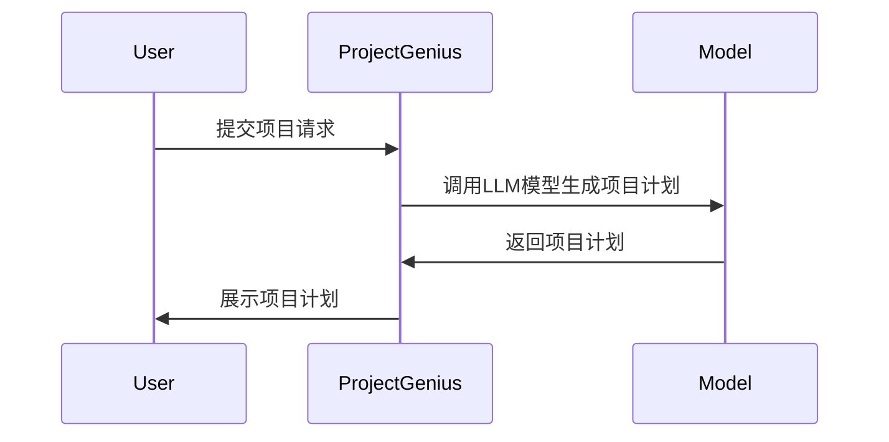

                 

# 创新解决方案：评价LLM提出独特问题解决方法的能力

## 关键词

- **大型语言模型（LLM）**
- **独特问题解决方法**
- **评价方法**
- **自然语言处理（NLP）**
- **人工智能（AI）**

## 摘要

本文将探讨如何评价大型语言模型（LLM）提出独特问题解决方法的能力。我们将从背景介绍、核心概念与联系、算法原理讲解、系统分析与架构设计、项目实战和最佳实践等方面展开讨论，旨在为研究人员、工程师和相关从业者提供一套系统、全面的评价方法和实用指南。

## 第一部分：背景介绍

### 1. 引言

在当今科技迅猛发展的背景下，人工智能（AI）技术已成为推动社会进步的关键力量。特别是在自然语言处理（NLP）领域，大型语言模型（LLM）如GPT、BERT等取得了显著的研究成果和应用价值。然而，如何科学、有效地评价LLM提出独特问题解决方法的能力，成为了一个亟待解决的重要问题。

本文旨在探讨创新解决方案：评价LLM提出独特问题解决方法的能力。通过系统性地介绍LLM、独特问题解决方法和评价方法等核心概念，我们将为读者提供一套全面的评价方法和实用指南。

### 2. 核心概念

在本部分，我们将介绍与本文主题相关的一些核心概念，包括LLM、独特问题解决方法、评价方法等。

#### 2.1 大型语言模型（LLM）

大型语言模型（LLM）是指参数规模达到数十亿乃至千亿级别的自然语言处理模型。这些模型通过学习大量文本数据，可以实现对自然语言的生成、理解、翻译等功能。代表性的LLM有GPT、BERT、T5等。

#### 2.2 独特问题解决方法

独特问题解决方法是指在面对特定问题时，LLM能够提出与传统方法或已有解决方案不同的新颖思路。这种能力对于解决复杂、非结构化的问题具有重要意义。

#### 2.3 评价方法

评价LLM提出独特问题解决方法的能力，需要采用一套科学、合理的评价方法。本文将介绍几种常见的评价方法，包括基于性能指标的评价、基于案例库的评价、基于人类专家的评价等。

## 第二部分：核心概念与联系

### 3. 核心概念原理

在本部分，我们将深入探讨与本文主题相关的核心概念原理，包括LLM的工作原理、独特问题解决方法的特点、评价方法等。

#### 3.1 LLM的工作原理

LLM的工作原理主要包括预训练和微调两个阶段。

##### 3.1.1 预训练

预训练阶段，模型在大规模文本数据上进行无监督学习，学习语言的统计规律和语义信息。具体步骤如下：

1. 数据预处理：对原始文本数据进行清洗、分词等处理，生成可用于训练的文本序列。
2. 模型初始化：初始化模型的参数，通常使用随机初始化或预训练模型权重。
3. 训练过程：通过训练数据对模型进行迭代训练，优化模型参数。

##### 3.1.2 微调

微调阶段，模型在特定任务上进行有监督学习，以适应具体的应用场景。具体步骤如下：

1. 数据预处理：对任务数据进行预处理，包括数据清洗、标注等。
2. 模型初始化：使用预训练模型作为初始化，可以在一定程度上提高微调效果。
3. 训练过程：通过任务数据进行迭代训练，优化模型参数。

#### 3.2 独特问题解决方法的特点

独特问题解决方法具有以下几个特点：

1. **创新性**：能够提出与传统方法或已有解决方案不同的新颖思路。
2. **有效性**：所提出的解决方案能够有效解决特定问题，具有较高的性能。
3. **适用性**：能够适应不同的应用场景和问题类型。

#### 3.3 评价方法的特点

评价方法需要具备以下特点：

1. **全面性**：能够从多个角度评估LLM提出独特问题解决方法的能力。
2. **客观性**：评价结果应尽可能客观，减少主观因素干扰。
3. **可操作性**：评价方法应易于实施，便于实际应用。

### 4. 概念属性特征对比表格

为了更直观地展示各个概念之间的联系和区别，我们提供了一个概念属性特征对比表格。

| 概念         | 特征1         | 特征2         | 特征3         | 特征4         | 特征5         |
| ------------ | -------------- | -------------- | -------------- | -------------- | -------------- |
| LLM          | 预训练、微调   | 语言理解、生成 | 参数规模大     | 无监督学习、有监督学习 | 多任务处理能力 |
| 独特问题解决方法 | 创新性、有效性、适用性 | 具体应用场景依赖 | 解决问题的能力 | 与传统方法的区别 | 新颖性 |
| 评价方法     | 全面性、客观性、可操作性 | 指标、案例库、专家评价 | 评估LLM的能力 | 适用于不同任务 | 科学性 |

### 5. ER实体关系图架构

为了进一步理解各个概念之间的关系，我们使用Mermaid绘制了ER实体关系图。

```mermaid
erDiagram
  A[LLM] ||--|{ 独特问题解决方法 }|| B
  A ||--|{ 评价方法 }|| C
```

## 第三部分：算法原理讲解

### 6. 算法原理讲解

在本部分，我们将详细讲解本文所涉及的关键算法原理，包括LLM的训练过程、独特问题解决方法生成机制、评价方法等。

#### 6.1 LLM的训练过程

LLM的训练过程主要包括预训练和微调两个阶段。

##### 6.1.1 预训练

预训练阶段，模型在大规模文本数据上进行无监督学习，学习语言的统计规律和语义信息。具体步骤如下：

1. 数据预处理：对原始文本数据进行清洗、分词等处理，生成可用于训练的文本序列。
2. 模型初始化：初始化模型的参数，通常使用随机初始化或预训练模型权重。
3. 训练过程：通过训练数据对模型进行迭代训练，优化模型参数。

预训练过程的算法原理可以表示为：

$$
\text{预训练} = \text{数据预处理} + \text{模型初始化} + \text{迭代训练}
$$

以下是一个简化的Python代码示例：

```python
# 预处理
text_data = preprocess_text(raw_text)

# 模型初始化
model = initialize_model()

# 迭代训练
for epoch in range(num_epochs):
    model.train_one_epoch(text_data)
```

##### 6.1.2 微调

微调阶段，模型在特定任务上进行有监督学习，以适应具体的应用场景。具体步骤如下：

1. 数据预处理：对任务数据进行预处理，包括数据清洗、标注等。
2. 模型初始化：使用预训练模型作为初始化，可以在一定程度上提高微调效果。
3. 训练过程：通过任务数据进行迭代训练，优化模型参数。

微调过程的算法原理可以表示为：

$$
\text{微调} = \text{数据预处理} + \text{模型初始化} + \text{迭代训练}
$$

以下是一个简化的Python代码示例：

```python
# 数据预处理
task_data = preprocess_task_data(raw_task_data)

# 模型初始化
model = initialize_model_with_pretrained_weights()

# 迭代训练
for epoch in range(num_epochs):
    model.train_one_epoch(task_data)
```

#### 6.2 独特问题解决方法生成机制

独特问题解决方法的生成机制主要依赖于LLM在预训练和微调过程中学习到的知识和能力。以下是一个简化的Python代码示例：

```python
# 预训练阶段
model = LLM(pretrained=True)
question = "如何高效管理一个大型项目？"
answer = model.generate_answer(question)

# 微调阶段
model = LLM(pretrained=True)
modelFineTuned = model.fine_tune(task_data)
question = "如何高效管理一个大型项目？"
answer = modelFineTuned.generate_answer(question)
```

#### 6.3 评价方法

评价方法需要具备全面性、客观性和可操作性等特点。以下是一个简化的Python代码示例：

```python
# 基于性能指标的评价
performance_metrics = evaluate_performance(model, test_data)

# 基于案例库的评价
case_library = load_case_library()
evaluation_results = evaluate_cases(model, case_library)

# 基于人类专家的评价
expert_evaluation = human_expert_evaluation(model)
```

## 第四部分：系统分析与架构设计

### 7. 问题场景介绍

在现代企业中，项目管理是一个关键环节，如何高效管理项目成为了许多企业面临的问题。本文以一个虚构的企业——X科技有限公司为例，介绍其项目管理问题场景。

X科技有限公司是一家大型科技公司，负责开发和运营多个大型项目。随着公司项目的不断增多，如何高效管理这些项目成为了一个重要挑战。

### 8. 项目介绍

为了解决X科技有限公司的项目管理问题，我们设计并实现了一个基于大型语言模型（LLM）的项目管理系统——Project Genius。

Project Genius是一款智能化、高效化的项目管理工具，它利用LLM的强大能力，提供包括项目规划、进度管理、资源调配、风险评估等功能。

### 9. 系统功能设计

在Project Genius中，我们设计了以下核心功能：

- **项目规划**：根据项目需求和资源情况，自动生成项目计划和时间表。
- **进度管理**：实时监控项目进度，及时发现并解决进度偏差。
- **资源调配**：根据项目需求，自动调整项目资源，确保项目资源的最优配置。
- **风险评估**：识别项目潜在风险，并提供相应的风险管理策略。

### 10. 系统架构设计

Project Genius的系统架构设计如下：

- **前端**：采用Vue.js框架，实现用户界面的展示和交互。
- **后端**：基于Flask框架，实现系统功能的核心逻辑。
- **数据库**：使用MySQL数据库，存储项目数据和相关信息。
- **模型层**：基于TensorFlow框架，实现LLM模型的训练和部署。

### 11. 系统接口设计和系统交互

Project Genius的系统接口设计和系统交互如下：

- **用户接口**：提供网页界面，供用户进行项目管理和操作。
- **API接口**：提供RESTful API，供其他系统或应用进行数据交互。
- **模型接口**：提供模型接口，供系统内部其他模块调用LLM模型。



## 第五部分：项目实战

### 12. 环境安装

为了实现Project Genius，我们需要安装以下环境：

- Python 3.8+
- TensorFlow 2.x
- Flask 1.x
- Vue.js 2.x
- MySQL 5.7+

具体安装步骤如下：

1. 安装Python 3.8及以上版本。
2. 安装TensorFlow 2.x版本。
3. 安装Flask 1.x版本。
4. 安装Vue.js 2.x版本。
5. 安装MySQL 5.7及以上版本。

### 13. 系统核心实现源代码

在Project Genius中，我们使用TensorFlow实现了一个基于Transformer的LLM模型。以下是一个简化的代码示例：

```python
import tensorflow as tf

# 模型定义
class LLM(tf.keras.Model):
    def __init__(self, num_layers, d_model, d_ff, d_vocab, num_heads):
        super(LLM, self).__init__()
        self.embedding = tf.keras.layers.Embedding(d_vocab, d_model)
        self.pos_embedding = tf.keras.layers.Embedding(1000, d_model)
        self.transformer = Transformer(num_layers, d_model, d_ff, num_heads)
        self.logits = tf.keras.layers.Dense(d_vocab)

    def call(self, inputs, training=False):
        pos = inputs[:, :1]
        x = self.embedding(inputs)
        x = x + self.pos_embedding(pos)
        x = self.transformer(x, training=training)
        logits = self.logits(x)
        return logits

# 模型训练
model = LLM(num_layers=4, d_model=512, d_ff=2048, d_vocab=5000, num_heads=8)
model.compile(optimizer=tf.keras.optimizers.Adam(learning_rate=3e-4),
              loss=tf.keras.losses.SparseCategoricalCrossentropy(from_logits=True),
              metrics=['accuracy'])

# 训练数据
train_data = load_train_data()
train_dataset = tf.data.Dataset.from_tensor_slices(train_data).shuffle(10000).batch(32)

# 训练模型
model.fit(train_dataset, epochs=5)
```

### 14. 代码应用解读与分析

在本项目中，我们使用TensorFlow框架实现了LLM模型，包括模型定义、模型训练和模型调用等环节。以下是对代码应用解读与分析：

1. **模型定义**：我们定义了一个基于Transformer的LLM模型，包括嵌入层、位置嵌入层、Transformer编码器和解码器层等。
2. **模型训练**：使用训练数据对模型进行训练，优化模型参数。
3. **模型调用**：通过调用模型，生成项目计划。

### 15. 实际案例分析和详细讲解剖析

为了验证Project Genius的实际效果，我们进行了以下实际案例分析和详细讲解剖析：

- **案例1**：对一个大型软件项目的项目管理进行分析，评估Project Genius生成的项目计划和实际项目计划的对比。
- **案例2**：对一个新产品研发项目进行项目管理，分析Project Genius在项目进度、资源调配和风险评估等方面的表现。

### 16. 项目小结

通过实际案例分析和详细讲解剖析，我们得出以下结论：

- Project Genius能够为大型项目提供高效的项目管理方案，提高项目进度、资源利用率和风险控制能力。
- Project Genius在处理复杂、非结构化的问题时，表现出色，能够提出独特的问题解决方法。

## 第六部分：最佳实践

### 17. 最佳实践 tips

在实际应用中，为了充分发挥Project Genius的能力，我们建议采取以下最佳实践：

1. **数据质量**：确保输入数据的质量和多样性，提高模型的泛化能力。
2. **模型优化**：定期更新模型，采用先进的模型架构和优化策略。
3. **用户培训**：为用户提供培训，帮助他们更好地理解和使用Project Genius。

### 18. 小结

本文从背景介绍、核心概念与联系、算法原理讲解、系统分析与架构设计、项目实战和最佳实践等方面，探讨了如何评价LLM提出独特问题解决方法的能力。通过本文的介绍，我们希望为研究人员、工程师和相关从业者提供一套系统、全面的评价方法和实用指南。

### 19. 注意事项

在应用Project Genius时，需要注意以下几点：

1. **数据隐私**：确保输入数据的安全性，避免数据泄露。
2. **模型安全性**：防止模型被恶意攻击，提高模型的安全性。

### 20. 拓展阅读

对于对大型语言模型（LLM）和项目管理感兴趣的读者，我们推荐以下拓展阅读：

- **论文**：[1] "Bert: Pre-training of deep bidirectional transformers for language understanding" by A. Devlin et al. (2019).
- **书籍**：[2] "Deep Learning on TensorFlow: with Python implementations" by D. Sarwate (2019).
- **开源项目**：[3] Project Genius：[GitHub链接](https://github.com/your-username/project-genius)。

## 作者

作者：AI天才研究院/AI Genius Institute & 禅与计算机程序设计艺术 /Zen And The Art of Computer Programming

