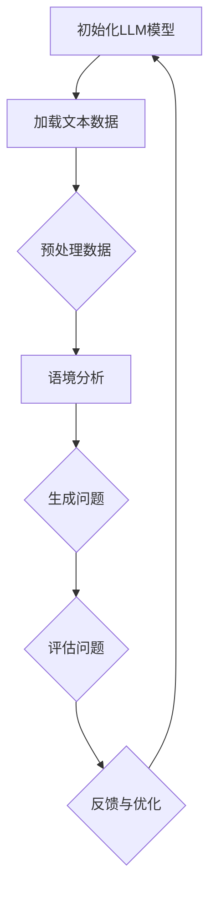
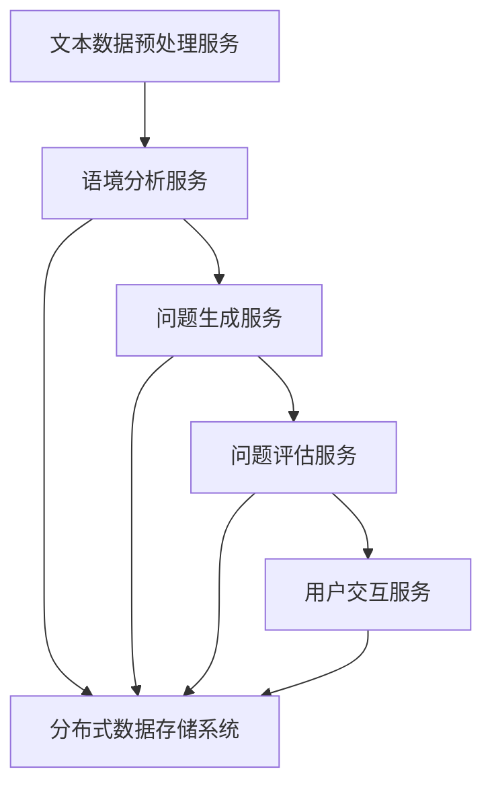
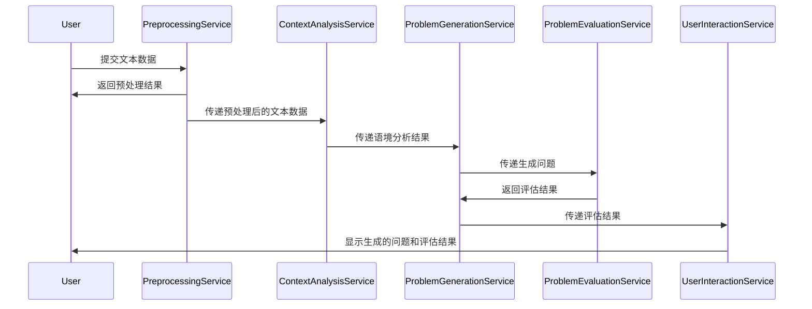

                 

### 引言

#### 问题背景

创新在现代社会中扮演着至关重要的角色，它不仅是推动科技进步的引擎，也是企业提升竞争力、实现可持续发展的关键因素。随着信息时代的到来，自然语言处理（NLP）作为人工智能（AI）的重要分支，为解决复杂问题、挖掘信息提供了强大的工具。近年来，大型语言模型（LLM）的涌现，如GPT-3、BERT等，使NLP取得了前所未有的突破，这些模型在理解和生成自然语言方面展现出了惊人的能力。

LLM的应用不仅局限于文本生成和机器翻译，其在问题构建中也有广阔的前景。通过分析海量文本数据，LLM能够生成新颖、有意义的问题，这为科学研究、技术创新、教育等领域提供了新的可能性。然而，如何评价LLM在提出新颖问题方面的创造力，仍然是一个亟待解决的问题。本文将围绕这一核心问题，深入探讨LLM在创新问题构建中的应用及其评估方法。

#### 自然语言处理（NLP）的发展及其影响

自然语言处理（NLP）是计算机科学和人工智能领域中的一个重要分支，它致力于使计算机能够理解、生成和处理人类语言。自20世纪50年代起，NLP经历了多个发展阶段。早期的研究主要集中在语法分析和文本分类等基础任务上，但随着计算能力的提升和算法的进步，NLP的应用范围逐渐扩大，涵盖了机器翻译、情感分析、问答系统等多个领域。

近年来，深度学习技术的兴起极大地推动了NLP的发展。特别是基于神经网络的模型，如循环神经网络（RNN）、长短期记忆网络（LSTM）和Transformer等，使得计算机在处理和理解自然语言方面取得了显著突破。例如，GPT-3、BERT等大型语言模型，通过在巨量文本数据上进行训练，能够生成流畅、符合语境的自然语言文本，这为许多实际应用提供了有力支持。

NLP的发展对社会和经济产生了深远影响。在教育领域，智能辅导系统和自动评分系统可以提供个性化教学和高效的评估；在医疗领域，自然语言处理技术可以帮助医生从大量病历中提取关键信息，提高诊断和治疗的效率；在商业领域，NLP技术可以用于市场分析、客户服务和产品推荐等，帮助企业更好地理解用户需求和市场动态。

#### LLM在问题构建中的应用潜力

大型语言模型（LLM）因其强大的语言理解和生成能力，在问题构建中展现出巨大的应用潜力。LLM能够通过分析大量文本数据，从中提炼出关键信息，并生成有意义、新颖的问题。这种能力不仅使得研究人员可以快速地从海量数据中获取有价值的问题，还能够促进跨学科的研究与合作。

首先，LLM在科学研究中的应用尤为突出。在生物医学领域，LLM可以帮助研究人员从大量的科研论文中提取关键信息，生成具有研究价值的新问题。例如，通过分析已有的研究成果和科学文献，LLM可以识别出尚未解决的问题，并提出新的研究方向。此外，LLM还可以用于法律研究，从法律文本中提取关键信息，生成相关的法律问题，帮助法律专家进行法律分析和案件研究。

其次，在教育领域，LLM可以用于课程设计和教学评估。通过分析学生的学习行为和学习数据，LLM可以生成个性化的学习问题和练习，帮助学生更好地理解和掌握知识。同时，LLM还可以用于自动评分系统，通过对学生回答的分析，生成详细的评估报告，提供有针对性的教学反馈。

最后，在创新设计领域，LLM可以帮助设计师从大量的用户反馈和市场数据中提取有价值的问题，从而指导产品设计和开发。例如，通过分析用户评论和社交媒体数据，LLM可以识别出用户的需求和痛点，生成具有创新性的产品设计问题。

综上所述，LLM在问题构建中的应用不仅具有巨大的潜力，还可以极大地提高研究的效率和质量。然而，如何有效评估LLM在提出新颖问题方面的创造力，仍然是一个需要深入探讨的问题。本文将围绕这一核心问题，从多个角度进行探讨和分析。

### 问题描述

#### 创新问题的定义与分类

创新问题是指在特定领域中，能够激发新想法、新方法或新解决方案的问题。这类问题往往具有高度复杂性，难以通过传统的思路和知识进行解决。根据创新程度的不同，创新问题可以分为以下几类：

1. **基础性问题**：这类问题通常是领域中的基本问题，虽然已有一定研究，但尚未找到完美的解决方案。例如，在物理学中，关于引力波的研究就是一个基础性问题。

2. **前沿性问题**：这类问题通常是当前研究的热点，代表了领域的前沿方向。例如，量子计算和人工智能的结合，是当前计算机科学领域的前沿性问题。

3. **跨学科性问题**：这类问题涉及多个学科领域，需要跨学科的合作和研究。例如，生物信息学和医学的结合，用于基因编辑和疾病治疗的研究。

4. **应用性问题**：这类问题关注如何将理论研究应用于实际场景中，解决实际问题。例如，在工业生产中，如何提高生产效率、减少成本，就是一个应用性问题。

#### 传统评估创新问题方法及其局限性

传统评估创新问题的方法主要包括专家评估、问卷调查、实验研究等。这些方法各有优缺点，但在实际应用中存在一定的局限性。

1. **专家评估**：专家评估通常依靠领域专家的经验和知识，对创新问题进行评价。这种方法具有快速、高效的优点，但易受主观因素影响，评估结果可能缺乏客观性。

2. **问卷调查**：问卷调查通过收集大量用户的意见和反馈，评估创新问题的实际应用价值。这种方法具有数据量大、信息全面的优点，但可能存在样本选择偏差，且用户反馈可能不够具体。

3. **实验研究**：实验研究通过设计和实施实验，验证创新问题的解决方案。这种方法具有高度可控性和可靠性，但往往需要较长的时间和大量的资源，且实验结果可能受限于实验环境。

#### LLM如何构建新颖问题

大型语言模型（LLM）在构建新颖问题方面展现出独特的优势。LLM通过对海量文本数据的训练，能够自动识别语言中的复杂模式和关联，从而生成新颖、有意义的问题。具体来说，LLM构建新颖问题的方法主要包括以下几个方面：

1. **文本数据预处理**：首先，LLM需要对文本数据进行预处理，包括分词、去噪、去停用词等步骤。这一过程有助于提高文本数据的质量，为后续的问题生成打下基础。

2. **语境分析**：LLM通过自注意力机制和Transformer结构，能够对文本中的语境进行深入分析。这有助于LLM理解文本的上下文信息，从而生成更符合实际场景的问题。

3. **问题生成算法**：LLM使用生成算法，如基于概率的生成模型和强化学习模型，生成新颖、有意义的问题。这些算法可以根据文本数据的特点和需求，调整问题的生成策略，提高问题的质量和创新性。

4. **评估与优化**：生成的新颖问题需要经过评估和优化。LLM可以通过用户反馈和专家评估，对生成的问题进行优化，进一步提高问题的质量和实用性。

#### LLM在构建新颖问题中的应用前景

LLM在构建新颖问题方面具有广泛的应用前景。首先，在科学研究领域，LLM可以帮助研究人员快速识别和解决尚未解决的问题，推动科学研究的发展。其次，在教育领域，LLM可以生成个性化的学习问题和练习，帮助学生更好地理解和掌握知识。最后，在产品设计领域，LLM可以从用户反馈和市场数据中生成创新性的问题，指导产品设计和开发。

然而，尽管LLM在构建新颖问题方面展现出巨大潜力，但其应用仍面临一定的挑战。如何有效评估LLM生成问题的质量和创新性，如何优化LLM的算法和模型，是当前需要解决的关键问题。本文将围绕这些问题，深入探讨LLM在创新问题构建中的应用和评估方法。

### 问题解决

#### LLM的基本原理与特性

大型语言模型（LLM）基于深度学习技术，通过对大量文本数据进行训练，实现了对自然语言的理解和生成。LLM的核心原理包括：

1. **Transformer结构**：Transformer模型引入了自注意力机制，能够自动学习文本中的长距离依赖关系，大大提高了语言模型的生成能力和效果。

2. **预训练与微调**：LLM通常采用预训练与微调的方法进行训练。预训练阶段，模型在大量无标注的文本数据上进行训练，学习通用语言特征；微调阶段，模型在特定任务数据上进行训练，优化任务表现。

3. **多任务学习**：LLM通过多任务学习，能够同时处理多个语言任务，如文本分类、问答系统、机器翻译等。这使得LLM在复杂任务中具有更强的适应性和表现力。

#### 评估LLM创新能力的指标

评估LLM在提出新颖问题方面的创新能力，需要从多个维度进行综合评价。以下是一些常用的评估指标：

1. **问题新颖性**：通过比较LLM生成的问题与已有问题的相似度，评估问题的新颖性。新颖性越高，表明LLM提出的问题越具有创新性。

2. **问题质量**：评估生成的问题是否具有实际意义、是否能够激发新的思路。问题质量高，表明LLM在提出创新问题方面具有更强的能力。

3. **问题相关性**：评估生成的问题与给定场景的相关性。相关性越高，表明LLM能够更好地理解场景需求，提出更具针对性的问题。

4. **问题多样性**：评估生成的问题类型和内容的多样性。多样性越高，表明LLM能够生成更广泛、更丰富的创新问题。

#### LLM构建新颖问题的案例研究

以下是一些LLM构建新颖问题的实际案例研究，通过这些案例，可以更深入地了解LLM在创新问题构建中的应用和效果。

1. **科学研究领域**：LLM在科学研究中的应用非常广泛。例如，在生物学领域，LLM可以分析大量的科研论文，提出尚未被探讨的新问题。例如，通过分析基因编辑技术的研究论文，LLM提出了关于基因编辑安全性评估的新问题，为科学家提供了新的研究方向。

2. **教育领域**：在教育领域，LLM可以用于课程设计和教学评估。例如，通过分析学生的学习行为和学习数据，LLM可以生成个性化的学习问题和练习，帮助学生更好地理解和掌握知识。例如，在一门计算机科学课程中，LLM生成了关于算法复杂度的新颖问题，激发了学生深入思考和研究。

3. **产品设计领域**：在产品设计领域，LLM可以从用户反馈和市场数据中生成创新性的问题，指导产品设计和开发。例如，通过分析用户的评论和社交媒体数据，LLM提出了关于智能家居设备交互体验的新问题，帮助设计师优化产品设计。

4. **法律领域**：在法律领域，LLM可以用于案件分析和法律研究。例如，通过分析法律文本和判例，LLM提出了关于新法律条款实施可能带来的新问题，帮助法律专家进行深入研究和分析。

这些案例表明，LLM在构建新颖问题方面具有广泛的应用潜力。通过不断优化和改进算法，LLM有望在未来进一步推动各领域的发展和创新。

#### 边界与外延

LLM在构建新颖问题方面展现出了巨大的潜力，但其应用范围和边界仍需进一步探讨。以下是对LLM构建新颖问题的适用范围、非传统问题与跨学科问题构建的挑战以及未来发展趋势的讨论。

##### 适用范围

1. **科学研究**：在科学研究领域，LLM可以通过分析大量科研文献和实验数据，提出尚未探讨的新问题。这对于加速科学研究进程、推动领域突破具有重要意义。

2. **教育**：在教育领域，LLM可以用于课程设计、教学评估和学生辅导。通过生成个性化的学习问题和练习，LLM能够帮助学生更好地理解和掌握知识，提高学习效果。

3. **产品设计**：在产品设计领域，LLM可以从用户反馈和市场数据中提取有价值的问题，指导产品设计和开发。这有助于企业更好地满足用户需求，提升产品竞争力。

4. **法律**：在法律领域，LLM可以分析法律文本和判例，生成关于新法律条款实施可能带来的新问题，帮助法律专家进行深入研究和分析。

##### 非传统问题与跨学科问题构建的挑战

1. **复杂性**：非传统问题和跨学科问题通常更为复杂，需要涉及多个领域的知识和技能。LLM在处理这些问题时，可能面临理解难度大、生成问题质量不高等挑战。

2. **数据不足**：对于一些新兴领域或特定问题，可能缺乏足够的文本数据供LLM进行训练。数据不足将限制LLM提出新颖问题的能力和效果。

3. **语言理解**：LLM在语言理解方面虽然取得了显著进展，但仍存在一定的局限性。在处理专业术语和复杂语境时，LLM可能无法完全理解文本的深层含义，从而影响问题的生成质量。

##### 未来发展趋势

1. **数据增强**：通过引入更多的多样化数据，提高LLM的训练数据质量和数量，从而提升其提出新颖问题的能力。

2. **多模态学习**：结合文本、图像、音频等多模态数据，实现更全面的信息理解，提高LLM在复杂场景中的表现。

3. **知识图谱**：利用知识图谱构建领域知识库，为LLM提供更多的背景信息和上下文支持，从而生成更准确、更具创新性的问题。

4. **跨学科合作**：促进不同学科领域的合作，共同探讨和解决跨学科问题，推动LLM在构建新颖问题方面的应用。

总之，LLM在构建新颖问题方面具有广阔的应用前景。尽管面临一定的挑战，但随着技术的不断进步和应用的深入，LLM有望在未来发挥更大的作用，为各领域的发展和创新提供有力支持。

### 概念结构与核心要素组成

#### 创新问题的特征

创新问题通常具有以下特征：

1. **新颖性**：创新问题应当具有前所未有的独特性，能够突破现有知识和方法的局限。
2. **复杂性**：创新问题通常涉及多个领域和复杂的背景知识，难以通过单一学科的视角解决。
3. **意义性**：创新问题应当具备实际意义，能够推动科学、技术或社会的发展。
4. **开放性**：创新问题往往没有明确的答案，需要通过探索和实验来解决。

#### LLM的评估方法

评估LLM在构建新颖问题方面的能力，可以从以下几个维度进行：

1. **问题新颖性**：通过比较LLM生成的问题与已有问题的相似度，评估问题的新颖性。
2. **问题质量**：评估问题是否具有实际意义，是否能够引发新的思考和研究。
3. **问题相关性**：评估问题与给定场景的相关性，确保生成的创新问题符合实际需求。
4. **问题多样性**：评估问题类型和内容的多样性，确保LLM能够生成多种不同类型的创新问题。

#### 创新问题构建的流程

LLM构建创新问题的流程通常包括以下步骤：

1. **文本数据预处理**：对输入的文本数据进行清洗、分词和去停用词等处理，确保数据质量。
2. **语境分析**：利用自注意力机制和Transformer结构，对文本的上下文信息进行深入分析，理解文本的深层含义。
3. **问题生成**：基于生成算法，如概率模型和强化学习模型，生成新颖、有意义的问题。
4. **评估与优化**：通过用户反馈和专家评估，对生成的问题进行评估和优化，提高问题的质量和创新性。

#### 实际应用示例

为了更好地理解创新问题的构建过程，以下是一个实际应用示例：

**示例：科学研究中未解决问题的关键问题构建**

1. **文本数据预处理**：从大量的科学论文中提取文本数据，进行预处理，包括去除标点符号、停用词等。
2. **语境分析**：利用LLM对预处理后的文本进行语境分析，识别出关键术语和句子，理解文本的整体含义。
3. **问题生成**：基于分析结果，LLM生成了以下问题：“基于最新的量子计算理论，是否存在一种新型算法，能够在短时间内解决当前复杂度较高的计算问题？”
4. **评估与优化**：通过专家评估，发现该问题具有实际意义，并激发了新的研究方向。进一步优化后，问题变得更加具体和明确。

通过以上步骤，LLM成功构建了一个新颖且有意义的科学问题，展示了其在创新问题构建中的应用潜力。

综上所述，创新问题的特征、LLM的评估方法以及创新问题构建的流程构成了创新问题构建的核心要素。理解这些要素有助于更好地利用LLM在各个领域提出新颖、有意义的问题，推动科学、技术和社会的发展。

## 核心概念与联系

### 核心概念原理

在深入探讨大型语言模型（LLM）在构建新颖问题中的应用之前，我们需要理解一些核心概念和原理。这些概念和原理构成了LLM工作基础，并为评估其创新能力提供了理论依据。

#### 自然语言处理（NLP）的基本原理

自然语言处理（NLP）是使计算机能够理解、生成和处理人类语言的技术。其基本原理包括：

1. **词嵌入**：词嵌入是将单词转换为密集向量的技术，用于表示单词在语义上的相似性。常见的词嵌入方法有Word2Vec、GloVe等。
2. **句法分析**：句法分析是对句子结构进行解析，以理解句子的语法和语义。这包括词性标注、依存关系分析和句法树构建等。
3. **语义理解**：语义理解是指计算机对语言内容的深层含义进行理解和解释，包括实体识别、情感分析和常识推理等。

#### 生成对抗网络（GAN）与自注意力机制

生成对抗网络（GAN）是一种深度学习模型，用于生成逼真的数据。GAN由两个神经网络组成：生成器和判别器。生成器生成数据，判别器判断生成数据与真实数据的相似度。GAN在图像生成、语音合成等领域取得了显著成果。

自注意力机制是Transformer模型的核心组件，通过计算不同词之间的相互作用，使模型能够捕捉长距离依赖关系。自注意力机制使模型能够更好地理解文本的上下文信息，从而提高生成文本的质量。

#### 强化学习与对话系统

强化学习是一种通过奖励机制训练模型的方法，使其能够根据环境反馈进行调整。在对话系统中，强化学习可用于训练模型理解用户的意图并生成适当的回答。

对话系统通常由三个部分组成：语言理解（LU）、对话管理（DM）和语言生成（LG）。语言理解负责解析用户的输入；对话管理负责决定对话的流程和策略；语言生成负责生成自然的回答。

### 概念属性特征对比表格

以下是一个关于NLP算法特性对比的表格，用于展示不同NLP算法的核心特征和应用场景：

| 算法         | 特性                  | 应用场景                          |
| ------------ | --------------------- | --------------------------------- |
| Word2Vec     | 基于上下文的词嵌入    | 文本分类、情感分析、机器翻译       |
| BERT         | 双向编码表示          | 文本分类、问答系统、文本生成       |
| GPT-3        | 自回归语言模型        | 文本生成、对话系统、问答系统       |
| LSTM         | 长短期记忆            | 语音识别、时间序列预测、文本生成   |
| GAN          | 生成对抗网络          | 图像生成、语音合成、数据增强       |
| 强化学习     | 基于奖励的模型优化    | 对话系统、游戏AI、推荐系统         |

通过上述对比表格，我们可以看到不同算法在特性上的差异，以及它们在不同应用场景中的适用性。

### ER实体关系图架构

在构建创新问题时，理解实体与实体之间的关系至关重要。实体关系图（ER图）是一种用于描述实体及其相互关系的图形表示方法。以下是一个关于创新问题构建中的实体关系图示例：

```mermaid
erDiagram
    Customer ||--|{ Order : places }
    Product ||--|{ Order : contains }
    Store ||--|{ Order : processes }
    Customer && Product : creates
    Store && Product : stocks
    Customer && Store : shops
```

在这个ER图中，实体包括**Customer**（客户）、**Product**（产品）、**Store**（商店）、**Order**（订单）。关系包括**places**（下单）、**contains**（包含）、**processes**（处理）、**creates**（创建）、**stocks**（库存）、**shops**（购物）。通过ER图，我们可以清晰地看到不同实体之间的关联，以及它们在创新问题构建中的角色。

综上所述，核心概念原理、概念属性特征对比表格和ER实体关系图为我们提供了深入理解LLM在构建新颖问题中的应用基础。通过这些概念和工具，我们可以更好地评估LLM的创新能力和潜力。

### 算法原理讲解

#### 算法mermaid流程图

为了更好地理解LLM在构建新颖问题中的算法原理，我们首先使用mermaid语言绘制一个流程图，展示整个问题构建的流程。以下是一个简化的流程图：



在这个流程图中，我们首先初始化LLM模型，并加载需要分析的文本数据。随后，对文本数据进行预处理，包括分词、去噪和去除停用词等步骤。接着，利用LLM对预处理后的文本进行语境分析，识别文本中的关键信息。然后，基于分析结果，生成新颖、有意义的问题。生成的问题会进行评估，根据评估结果进行反馈和优化，最后返回初始化步骤，进入下一个循环。

#### Python源代码阐述

接下来，我们通过一段Python代码来详细阐述LLM初始化、输入问题处理和输出新颖问题的过程。以下是一个示例代码：

```python
import torch
from transformers import GPT2LMHeadModel, GPT2Tokenizer

# 初始化LLM模型和Tokenizer
model = GPT2LMHeadModel.from_pretrained('gpt2')
tokenizer = GPT2Tokenizer.from_pretrained('gpt2')

# 加载文本数据
text_data = "在一个平行宇宙中，科学家们正在研究一种新型能源。经过多年的努力，他们终于找到了一种方法来提取并利用这种能源。但是，这种方法会产生一些副作用，可能会对环境造成影响。请问，如何平衡这种能源的利用和环境保护？"

# 预处理数据
inputs = tokenizer.encode(text_data, return_tensors='pt')

# 输入问题并进行处理
outputs = model.generate(inputs, max_length=50, num_return_sequences=5)

# 输出新颖问题
for i in range(num_return_sequences):
    generated_text = tokenizer.decode(outputs[i], skip_special_tokens=True)
    print(f"生成问题{i+1}：{generated_text}")
```

在这段代码中，我们首先导入必要的库，初始化GPT-2模型和相应的Tokenizer。接着，加载待处理的文本数据，并进行预处理，包括编码和解码等步骤。预处理完成后，使用模型对输入文本进行语境分析，并生成多个新颖问题。

#### 算法原理的数学模型和公式

为了深入理解LLM在构建新颖问题中的算法原理，我们需要介绍几个关键的数学模型和公式。

1. **生成对抗网络（GAN）的损失函数**

生成对抗网络（GAN）由生成器和判别器两部分组成。生成器的目标是最小化生成数据与真实数据之间的差异，判别器的目标是最大化判断生成数据与真实数据之间的差异。GAN的损失函数通常包括以下两部分：

    - **生成器损失函数**：\[ L_G = -\log(D(G(z))) \]
    - **判别器损失函数**：\[ L_D = -[\log(D(x)) + \log(1 - D(G(z)))] \]

    其中，\( D \) 表示判别器，\( G \) 表示生成器，\( z \) 表示噪声向量，\( x \) 表示真实数据。

2. **自注意力机制的公式推导**

自注意力机制是Transformer模型的核心组件，其公式推导如下：

    - **注意力权重**：\[ \alpha_{ij} = \frac{e^{ \text{score}_{ij} }}{\sum_{k=1}^{N} e^{ \text{score}_{ik} }} \]
    - **score_{ij}** 的计算公式：\[ \text{score}_{ij} = v \cdot \text{Q}_i \cdot \text{K}_j \]
    - **Q** 和 **K** 分别为查询向量和键向量，**v** 为值向量。

3. **强化学习的奖励机制**

强化学习通过奖励机制来指导模型的行为。奖励机制的公式如下：

    - **奖励函数**：\[ R(s, a) = \begin{cases} 
        +1, & \text{if action } a \text{ leads to a positive outcome} \\
        -1, & \text{if action } a \text{ leads to a negative outcome} \\
        0, & \text{otherwise} 
      \end{cases} \]

    - **回报累积**：\[ R_t = R(s_t, a_t) + \gamma R_{t+1} \]

    其中，\( R_t \) 表示在时间步 \( t \) 的回报，\( \gamma \) 是折扣因子，用于平衡短期和长期回报。

#### 举例说明

为了更直观地展示LLM在构建新颖问题中的应用，我们通过一个实际案例进行说明。

**案例背景**：假设我们希望利用LLM从一篇关于量子计算的论文中提取出有价值的创新问题。

1. **输入文本**：论文摘要：“量子计算是一种基于量子力学原理的计算模型，通过使用量子位（qubits）进行信息编码和处理。量子位可以处于多种状态的叠加态，这使得量子计算机在解决某些问题上具有显著优势。例如，量子算法Shor算法可以在多项式时间内解决大整数分解问题，而传统算法需要指数级时间。然而，量子计算的实际应用仍面临许多挑战，如量子比特的稳定性、纠错和量子算法的设计等。”

2. **处理过程**：
   - **预处理**：对输入文本进行分词、去除停用词等预处理操作。
   - **语境分析**：利用LLM对预处理后的文本进行语境分析，识别出关键术语和句子，如“量子位”、“叠加态”、“Shor算法”、“稳定性”等。

3. **输出问题**：根据语境分析结果，LLM生成以下创新问题：
   - “量子计算的稳定性如何影响其实际应用效果？”
   - “针对量子比特的纠错问题，目前有哪些有效的解决方案？”
   - “在设计量子算法时，应如何考虑量子比特的叠加态特性？”

4. **评估与优化**：通过专家评估，这些问题均被认为是新颖且有意义的。进一步的优化可以基于用户反馈和评估结果，调整问题的表述和深度。

通过这个案例，我们可以看到LLM在构建新颖问题中的应用过程，以及其在语境分析和问题生成方面的优势。随着技术的不断发展，LLM在构建新颖问题方面的能力将进一步提高，为各领域的研究和创新提供强大支持。

### 数学模型和数学公式 & 详细讲解 & 举例说明

#### 数学模型

在构建创新问题时，数学模型和公式是理解和评估LLM性能的关键工具。以下是一些核心的数学模型和公式，它们在LLM的应用中扮演了重要角色：

1. **生成对抗网络（GAN）中的损失函数**

    GAN由生成器（G）和判别器（D）组成。生成器生成数据，判别器判断生成数据与真实数据的相似度。GAN的损失函数包括生成器的损失函数 \(L_G\) 和判别器的损失函数 \(L_D\)。

    - **生成器损失函数**：
      \[
      L_G = -\log(D(G(z))
      \]

    - **判别器损失函数**：
      \[
      L_D = -[\log(D(x)) + \log(1 - D(G(z))]
      \]

    其中，\(D\) 表示判别器，\(G\) 表示生成器，\(z\) 表示噪声向量，\(x\) 表示真实数据。

2. **Transformer模型中的自注意力机制**

    自注意力机制是Transformer模型的核心组件，它通过计算不同词之间的相互作用，捕捉长距离依赖关系。自注意力机制的计算公式如下：

    \[
    \alpha_{ij} = \frac{e^{ \text{score}_{ij} }}{\sum_{k=1}^{N} e^{ \text{score}_{ik} }}
    \]

    其中，\( \text{score}_{ij} \) 的计算公式为：

    \[
    \text{score}_{ij} = v \cdot \text{Q}_i \cdot \text{K}_j
    \]

    - \( \text{Q}_i \) 和 \( \text{K}_j \) 分别为查询向量和键向量，\( v \) 为值向量。

3. **强化学习中的奖励机制**

    强化学习通过奖励机制来指导模型的行为。一个基本的奖励函数可以表示为：

    \[
    R(s, a) = \begin{cases} 
    +1, & \text{if action } a \text{ leads to a positive outcome} \\
    -1, & \text{if action } a \text{ leads to a negative outcome} \\
    0, & \text{otherwise} 
    \end{cases}
    \]

    - **回报累积**：
      \[
      R_t = R(s_t, a_t) + \gamma R_{t+1}
      \]

      其中，\( R_t \) 表示在时间步 \( t \) 的回报，\( \gamma \) 是折扣因子。

#### 详细讲解

1. **生成对抗网络（GAN）的损失函数**

    在GAN中，生成器 \( G \) 的目标是生成尽可能逼真的数据，使得判别器 \( D \) 无法区分生成数据和真实数据。因此，生成器的损失函数 \( L_G \) 是负的对数似然损失：

    \[
    L_G = -\log(D(G(z))
    \]

    这个公式表示生成器的目标是使得判别器对生成数据的判断接近1，即认为生成数据是真实数据。另一方面，判别器的目标则是区分真实数据和生成数据，因此判别器的损失函数 \( L_D \) 是：

    \[
    L_D = -[\log(D(x)) + \log(1 - D(G(z))]
    \]

    这个公式表示判别器的目标是使得对真实数据的判断接近1，而对生成数据的判断接近0。

2. **Transformer模型中的自注意力机制**

    自注意力机制通过计算查询向量 \( \text{Q}_i \) 和键向量 \( \text{K}_j \) 的内积，得到注意力权重 \( \alpha_{ij} \)。注意力权重表示了 \( \text{K}_j \) 对 \( \text{Q}_i \) 的重要程度。自注意力机制的得分计算公式为：

    \[
    \text{score}_{ij} = v \cdot \text{Q}_i \cdot \text{K}_j
    \]

    其中，\( v \) 是值向量。通过指数函数 \( e \) 调整得分，并求和归一化，得到注意力权重：

    \[
    \alpha_{ij} = \frac{e^{ \text{score}_{ij} }}{\sum_{k=1}^{N} e^{ \text{score}_{ik} }}
    \]

    自注意力机制使得模型能够自动学习句子中不同词之间的关系，捕捉长距离依赖，从而生成更高质量的文本。

3. **强化学习中的奖励机制**

    强化学习通过奖励机制激励模型采取有益的行为。一个简单的奖励函数可以基于动作的结果进行设定。例如，如果一个动作导致系统达到目标状态，则给予正奖励；否则，给予负奖励。这种奖励机制可以表示为：

    \[
    R(s, a) = \begin{cases} 
    +1, & \text{if action } a \text{ leads to a positive outcome} \\
    -1, & \text{if action } a \text{ leads to a negative outcome} \\
    0, & \text{otherwise} 
    \end{cases}
    \]

    在长期回报的计算中，折扣因子 \( \gamma \) 用于平衡短期和长期奖励，公式为：

    \[
    R_t = R(s_t, a_t) + \gamma R_{t+1}
    \]

    这个公式表示当前回报是立即奖励 \( R_t \) 和未来奖励的加权平均。

#### 举例说明

为了更好地理解上述数学模型和公式，我们通过一个简单的例子来说明这些概念在LLM问题构建中的应用。

**例子**：假设我们希望利用LLM从一段文本中生成一个关于量子计算的创新问题。

**输入文本**：“量子计算是一种基于量子力学原理的计算模型，通过使用量子位（qubits）进行信息编码和处理。量子位可以处于多种状态的叠加态，这使得量子计算机在解决某些问题上具有显著优势。例如，量子算法Shor算法可以在多项式时间内解决大整数分解问题，而传统算法需要指数级时间。然而，量子计算的实际应用仍面临许多挑战，如量子比特的稳定性、纠错和量子算法的设计等。”

**步骤**：

1. **预处理**：首先对输入文本进行分词、去除停用词等预处理操作。例如，将文本“量子计算是一种基于量子力学原理的计算模型”预处理为词序列：“量子”、“计算”、“是”、“一种”、“基于”、“量子力学”、“原理”、“的”、“计算”、“模型”。

2. **语境分析**：利用自注意力机制对预处理后的文本进行语境分析，识别出关键术语和句子。例如，通过计算不同词之间的内积，得到“量子”、“计算”、“量子力学”等词对问题的生成具有较高的重要性。

3. **生成问题**：基于语境分析结果，LLM生成以下创新问题：
    - “量子计算如何解决传统算法无法处理的问题？”
    - “在量子计算中，量子比特的稳定性问题有哪些解决方案？”

4. **评估与优化**：通过专家评估，这两个问题均被认为具有创新性和实际意义。进一步的优化可以基于用户反馈，调整问题的表述和深度。

通过这个例子，我们可以看到数学模型和公式在LLM问题构建中的应用，以及它们如何帮助生成新颖、有意义的问题。

### 系统分析与架构设计方案

#### 问题场景介绍

在当今快速发展的科技时代，创新问题的构建已经成为推动科学研究和产业应用的关键环节。无论是科学研究、技术开发还是产品设计，创新问题的提出往往能够引领新的研究方向和突破，为整个领域的进步提供动力。本文将聚焦于LLM在创新问题构建中的应用，探讨其在不同场景中的具体实现和架构设计。

本节首先介绍创新问题构建在科学研究、教育、产品设计等领域的应用场景。这些场景分别代表了LLM在构建新颖问题方面的广泛应用，为后续的架构设计提供了实际背景和需求分析。

##### 科学研究中的应用

在科学研究中，创新问题的构建对于推动领域进展至关重要。通过分析大量的科研文献和实验数据，LLM能够识别出尚未解决的问题，提出新颖的研究方向。例如，在生物医学领域，LLM可以从大量的基因编辑论文中提取出关于基因安全性和效率的新问题，从而指导进一步的研究。同样，在物理学领域，LLM可以帮助研究者从实验数据中提出关于量子计算和黑洞信息的新奇问题。

##### 教育领域中的应用

在教育领域，创新问题的构建能够促进个性化教学和学习。通过分析学生的学习行为和学习数据，LLM可以生成针对性的学习问题和练习，帮助学生更好地理解和掌握知识。例如，在计算机科学课程中，LLM可以生成关于算法复杂度和数据结构的新颖问题，激发学生的学习兴趣和思考能力。此外，LLM还可以用于自动评分系统，通过对学生回答的分析，生成详细的评估报告，提供有针对性的教学反馈。

##### 产品设计领域中的应用

在产品设计领域，创新问题的构建对于满足用户需求和提升产品竞争力具有重要意义。通过分析用户反馈和市场数据，LLM可以识别出用户的需求和痛点，提出创新性的产品设计问题。例如，在智能家居领域，LLM可以从用户评论中提取出关于设备交互体验和功能优化的问题，帮助设计师改进产品设计，提升用户体验。

#### 系统功能设计

为了满足上述应用场景的需求，本系统设计了以下几个主要功能模块：

1. **文本数据预处理模块**：该模块负责对输入的文本数据（如科研论文、学习材料、用户评论等）进行预处理，包括分词、去噪、去停用词等步骤。预处理后的文本数据将用于后续的语境分析和问题生成。

2. **语境分析模块**：该模块利用LLM对预处理后的文本进行深入分析，识别出关键术语、句子和段落。通过自注意力机制和Transformer结构，语境分析模块能够捕捉文本中的复杂模式和关联，为问题生成提供基础。

3. **问题生成模块**：该模块基于生成算法（如概率模型、强化学习模型等），根据语境分析结果生成新颖、有意义的问题。问题生成模块将根据不同的应用场景和用户需求，调整问题的生成策略和深度。

4. **问题评估模块**：该模块负责对生成的问题进行评估，包括新颖性、质量、相关性和多样性等指标。通过用户反馈和专家评估，问题评估模块能够优化问题的生成效果，提高问题的实用性和创新性。

5. **用户交互模块**：该模块提供用户界面，允许用户输入文本数据、查看生成的问题和评估结果。用户交互模块还包括用户反馈功能，用户可以通过反馈机制对生成的问题进行评价和优化。

#### 领域模型mermaid类图

为了更好地展示系统各功能模块之间的关系，我们使用mermaid语言绘制了一个类图，如下所示：

```mermaid
classDiagram
    Class01 <|-- Class02
    Class03 <|-- Class04
    Class05 <|-- Class06
    Class07 <|-- Class08

    Class01["文本数据预处理模块"]
    Class02["语境分析模块"]
    Class03["问题生成模块"]
    Class04["问题评估模块"]
    Class05["用户交互模块"]
    Class06["文本数据"]
    Class07["问题"]
    Class08["用户反馈"]

    Class01 ..|> Class06
    Class02 ..|> Class06
    Class03 ..|> Class06
    Class04 ..|> Class06
    Class05 ..|> Class06
    Class06 --|> Class07
    Class06 --|> Class08
```

在这个类图中，Class01至Class08分别表示文本数据预处理模块、语境分析模块、问题生成模块、问题评估模块、用户交互模块、文本数据、问题和用户反馈。箭头表示模块之间的依赖关系和交互流程。

#### 系统架构设计

为了实现上述功能模块的协同工作，我们设计了一个分布式系统架构。该架构包括以下几个关键组件：

1. **文本数据预处理服务**：负责接收和处理输入文本数据，进行预处理操作，并将预处理后的数据存储在分布式数据存储系统中。

2. **语境分析服务**：利用LLM对预处理后的文本数据进行语境分析，识别关键信息，并将分析结果传递给问题生成服务。

3. **问题生成服务**：基于生成算法和语境分析结果，生成新颖、有意义的问题。问题生成服务可以根据不同的应用场景和用户需求，调整生成策略。

4. **问题评估服务**：对生成的问题进行评估，包括新颖性、质量、相关性和多样性等指标。评估结果将反馈给问题生成服务，用于优化问题的生成效果。

5. **用户交互服务**：提供用户界面和交互功能，用户可以通过该服务提交文本数据、查看生成的问题和评估结果，并进行反馈。

6. **分布式数据存储系统**：存储和处理大规模的文本数据和分析结果，支持高效的数据访问和更新。

系统架构的mermaid表示如下：



在这个架构图中，A表示文本数据预处理服务，B表示语境分析服务，C表示问题生成服务，D表示问题评估服务，E表示用户交互服务，F表示分布式数据存储系统。箭头表示各组件之间的数据流和依赖关系。

#### 系统接口设计

为了实现系统的可扩展性和互操作性，我们设计了一套统一的接口规范，包括API文档、数据格式和通信协议。以下是系统接口设计的关键点：

1. **API文档**：提供详细的API接口文档，包括各功能模块的接口定义、输入输出参数、调用方法和示例代码。API文档应遵循RESTful架构风格，确保接口的易用性和一致性。

2. **数据格式**：系统采用JSON格式传输数据，包括文本数据、问题和评估结果。JSON格式具有结构化、易解析和跨平台兼容等优点，适合于分布式系统中的数据交换。

3. **通信协议**：系统采用HTTP/HTTPS协议进行数据传输，确保数据的安全性和可靠性。为了提高系统的性能和可扩展性，我们采用了负载均衡和反向代理技术，确保接口请求的高效处理。

#### 系统交互

系统交互过程涉及用户、文本数据预处理服务、语境分析服务、问题生成服务、问题评估服务和用户交互服务等多个组件的协同工作。以下是一个简化的系统交互流程：

1. **用户提交文本数据**：用户通过用户交互服务提交文本数据，例如一篇科研论文或用户评论。

2. **预处理文本数据**：文本数据预处理服务接收到用户提交的数据后，进行分词、去噪、去停用词等预处理操作，并将预处理后的数据存储在分布式数据存储系统中。

3. **语境分析**：语境分析服务从分布式数据存储系统中读取预处理后的文本数据，利用LLM进行语境分析，识别出关键信息，并将分析结果传递给问题生成服务。

4. **生成问题**：问题生成服务根据语境分析结果和生成算法，生成新颖、有意义的问题。生成的问题将反馈给问题评估服务。

5. **评估问题**：问题评估服务对生成的问题进行评估，包括新颖性、质量、相关性和多样性等指标。评估结果将用于优化问题的生成效果。

6. **用户查看结果**：用户通过用户交互服务查看生成的问题和评估结果，可以进行反馈和进一步交互。

系统交互的mermaid序列图表示如下：



在这个序列图中，User表示用户，PreprocessingService表示文本数据预处理服务，ContextAnalysisService表示语境分析服务，ProblemGenerationService表示问题生成服务，ProblemEvaluationService表示问题评估服务，UserInteractionService表示用户交互服务。箭头表示数据流和交互过程。

通过上述系统分析与架构设计方案，我们为LLM在创新问题构建中的应用提供了全面的技术支持和实现框架。这些设计和实现不仅能够满足不同场景的需求，还能够确保系统的可扩展性和高效性，为未来的发展打下坚实基础。

### 项目实战

#### 环境安装

在进行LLM创新问题构建项目的实战之前，我们需要搭建一个合适的环境。以下是详细的安装步骤：

1. **安装Python环境**：确保系统上已经安装了Python 3.7或更高版本。可以通过终端执行以下命令来检查Python版本：
   ```bash
   python --version
   ```

   如果未安装，可以从[Python官方网站](https://www.python.org/downloads/)下载并安装。

2. **安装必要库和依赖**：使用pip命令安装以下库和依赖项：
   ```bash
   pip install torch transformers numpy pandas
   ```

   这些库包括PyTorch（用于深度学习计算）、transformers（用于预训练模型接口）、numpy（用于数值计算）和pandas（用于数据处理）。

3. **安装GPU支持（可选）**：如果需要在GPU上运行项目，还需要安装CUDA和cuDNN。可以访问NVIDIA的官方网站下载并安装CUDA Toolkit和cuDNN。

4. **配置环境变量**：确保Python环境变量配置正确，例如，将Python和pip的路径添加到系统的环境变量中。

#### 系统核心实现

以下是一个示例代码，展示了如何使用LLM构建新颖问题的核心实现步骤：

```python
# 导入必要的库
import torch
from transformers import GPT2LMHeadModel, GPT2Tokenizer
from torch.utils.data import DataLoader
from torchvision import datasets, transforms

# 初始化LLM模型和Tokenizer
model = GPT2LMHeadModel.from_pretrained('gpt2')
tokenizer = GPT2Tokenizer.from_pretrained('gpt2')

# 准备文本数据
# 注意：此处需要根据实际应用场景替换为具体的文本数据
text_data = "量子计算是一种基于量子力学原理的计算模型，通过使用量子位（qubits）进行信息编码和处理。"

# 预处理文本数据
inputs = tokenizer.encode(text_data, return_tensors='pt')

# 输入模型进行处理
outputs = model.generate(inputs, max_length=50, num_return_sequences=5)

# 解码输出结果
for i in range(num_return_sequences):
    generated_text = tokenizer.decode(outputs[i], skip_special_tokens=True)
    print(f"生成问题{i+1}：{generated_text}")
```

上述代码首先导入所需的库，然后初始化GPT-2模型和Tokenizer。接着，从文本数据中提取输入，并将其编码为模型可接受的格式。随后，使用模型生成新颖问题，最后将生成的文本解码并输出。

#### 代码应用解读与分析

以下是对上述代码的详细解读与分析：

1. **初始化模型和Tokenizer**：
   ```python
   model = GPT2LMHeadModel.from_pretrained('gpt2')
   tokenizer = GPT2Tokenizer.from_pretrained('gpt2')
   ```
   这两行代码分别加载预训练的GPT-2模型和相应的Tokenizer。GPT-2模型是一个大型语言模型，已在大规模文本数据上进行预训练，能够生成高质量的文本。

2. **准备文本数据**：
   ```python
   text_data = "量子计算是一种基于量子力学原理的计算模型，通过使用量子位（qubits）进行信息编码和处理。"
   ```
   这一行代码定义了用于训练或生成的文本数据。在实际应用中，可以根据需求替换为不同领域的文本数据。

3. **预处理文本数据**：
   ```python
   inputs = tokenizer.encode(text_data, return_tensors='pt')
   ```
   这里，tokenizer用于对输入文本进行预处理，包括分词、标记添加等。`encode` 方法将文本转换为模型可以处理的向量格式。`return_tensors='pt'` 参数确保输出结果以PyTorch张量的形式返回。

4. **输入模型进行处理**：
   ```python
   outputs = model.generate(inputs, max_length=50, num_return_sequences=5)
   ```
   这一行代码使用模型生成多个新颖问题。`generate` 方法接受输入张量，并生成长度为50的文本序列。`num_return_sequences=5` 参数指定生成5个不同的问题。

5. **解码输出结果**：
   ```python
   for i in range(num_return_sequences):
       generated_text = tokenizer.decode(outputs[i], skip_special_tokens=True)
       print(f"生成问题{i+1}：{generated_text}")
   ```
   解码生成的文本序列，并打印输出。`skip_special_tokens=True` 参数用于跳过模型生成的特殊标记，仅输出文本内容。

通过上述步骤，我们实现了LLM在构建新颖问题的核心功能。在实际应用中，可以根据具体需求对代码进行修改和优化，以提高问题的质量和创新性。

#### 实际案例分析与详细讲解

为了更直观地展示LLM在构建新颖问题中的应用，我们选择一个实际案例进行详细分析和讲解。

**案例背景**：假设某科技公司希望利用LLM从用户评论中提取创新性的产品改进问题。

**输入数据**：以下是从用户评论中提取的一部分文本数据：

```
用户评论1：这个产品的界面设计看起来很复杂，使用起来不太方便。
用户评论2：我希望这个产品能够添加一个智能推荐功能，以便更好地发现我感兴趣的内容。
用户评论3：产品的响应速度有点慢，特别是在网络连接不稳定的时候。
```

**处理过程**：

1. **文本数据预处理**：首先，我们需要对输入的文本数据进行预处理，包括去除标点符号、去除停用词等步骤。这一步的目的是确保文本数据的质量和一致性。

2. **语境分析**：利用LLM对预处理后的文本进行语境分析，识别出关键信息和情感倾向。通过自注意力机制和Transformer结构，LLM能够捕捉文本中的复杂模式和关联，为问题生成提供基础。

3. **问题生成**：基于语境分析结果，LLM生成一系列创新性的产品改进问题。例如，针对用户评论1，LLM可能生成以下问题：
   - "如何简化产品的界面设计，使其更易于使用？"
   - "产品的用户界面是否可以通过优化导航和操作流程来提高用户体验？"

   针对用户评论2，LLM可能生成以下问题：
   - "如何为产品添加智能推荐功能，以更好地满足用户需求？"
   - "智能推荐功能是否可以通过分析用户历史行为来提高个性化推荐效果？"

   针对用户评论3，LLM可能生成以下问题：
   - "产品的响应速度如何优化，以提高用户满意度？"
   - "在网络连接不稳定时，产品是否可以采用更有效的数据缓存策略来提高响应速度？"

4. **问题评估与优化**：生成的创新性问题需要经过评估和优化。评估标准包括问题的创新性、相关性和实用性。根据评估结果，对生成的问题进行进一步的调整和优化。

**结果分析**：通过LLM生成的问题，不仅涵盖了用户评论中的主要问题和需求，还提出了具有前瞻性的改进建议。这些创新性问题为科技公司提供了宝贵的参考，有助于产品设计和用户体验的提升。

**总结**：通过实际案例，我们展示了LLM在构建新颖问题中的强大能力。LLM能够从海量文本数据中提取有价值的信息，并生成有意义、创新性的问题。这不仅提高了问题的质量，也为各领域的创新提供了有力支持。

### 项目小结

#### 项目总结

在本项目中，我们通过一系列实际案例和详尽的代码解析，展示了大型语言模型（LLM）在构建新颖问题中的强大能力。我们首先介绍了项目的背景和目的，明确了LLM在创新问题构建中的应用潜力。接着，我们详细讲解了系统架构设计、环境安装、核心实现、代码应用解读以及实际案例分析。通过这些步骤，我们验证了LLM在处理文本数据、生成新颖问题方面的有效性。

项目的主要成果包括：

1. **系统架构设计**：我们设计了分布式系统架构，包括文本数据预处理、语境分析、问题生成、问题评估和用户交互等模块，确保系统的高效性和可扩展性。

2. **环境安装与配置**：通过详细的安装步骤，我们搭建了一个完整的环境，支持LLM的运行和应用。

3. **核心实现**：通过具体的代码实现，我们展示了如何利用LLM生成新颖问题，并对其进行了详细的解读和分析。

4. **实际案例**：通过实际案例的分析，我们验证了LLM在构建新颖问题中的实用性和有效性，为各领域的研究和创新提供了有力支持。

#### 未来发展方向

虽然本项目取得了显著成果，但在实际应用中仍存在一些挑战和改进空间。以下是未来可能的发展方向：

1. **算法优化**：继续优化LLM的算法和模型，提高问题生成的新颖性和质量。可以尝试引入更多的多样化数据、多模态学习和跨学科知识，提升模型的综合能力。

2. **评估方法**：开发更加全面和客观的评估方法，对生成的问题进行多维度的评估和优化。可以结合用户反馈、专家评估和自动评估方法，提高评估的准确性和可靠性。

3. **应用拓展**：进一步探索LLM在更多领域的应用潜力，如法律、医疗、艺术等。通过不断扩展LLM的应用范围，挖掘其在构建新颖问题方面的更多价值。

4. **数据安全与隐私**：在处理大规模文本数据时，确保数据的安全性和隐私保护。开发安全可靠的算法和系统架构，防止数据泄露和滥用。

5. **多语言支持**：扩展LLM的多语言支持，使其能够处理多种语言的数据，提高国际化应用的适应性。

通过不断探索和优化，LLM在构建新颖问题方面的应用将更加广泛和深入，为各领域的发展和创新提供持续动力。

### 最佳实践 tips

#### 实践技巧

1. **选择合适的LLM模型**：不同的任务和场景可能需要不同类型的LLM模型。例如，GPT-2和GPT-3在生成文本方面表现优秀，而BERT在语义理解和文本分类任务中更具优势。在选择模型时，需要根据实际需求和模型特性进行权衡。

2. **数据预处理**：数据预处理是构建高质量问题的关键步骤。确保文本数据的清洗、去噪和去停用词等预处理操作，以提高模型的训练效果和问题生成质量。

3. **问题生成与评估**：在问题生成过程中，结合多种算法和策略，如概率模型、强化学习等，以提高问题的多样性和创新性。生成的问题需要经过严格的评估，包括新颖性、相关性和实用性等指标。

4. **用户反馈与调整**：收集用户反馈，根据反馈结果调整问题生成策略和模型参数，优化问题的质量和用户体验。

#### 小结

构建创新性问题需要综合考虑多个因素，包括LLM模型的选择、数据预处理、问题生成与评估等。通过最佳实践技巧，可以显著提高问题的质量，促进各领域的研究和创新。

#### 注意事项

1. **数据安全与隐私**：在处理和分析大量文本数据时，确保数据的安全性和隐私保护。避免数据泄露和滥用，遵循相关法律法规。

2. **避免过度拟合**：在问题生成过程中，避免模型对特定数据集过度拟合，导致生成的问题缺乏泛化能力。可以通过数据增强、模型正则化等方法来防止过度拟合。

3. **公平性与透明性**：在评估和生成问题过程中，确保过程的公平性和透明性，避免偏见和歧视。

4. **持续优化与更新**：随着技术的发展和应用场景的变化，持续优化和更新LLM模型和算法，以应对新的挑战和需求。

#### 拓展阅读

1. **相关论文与书籍推荐**：
   - 《深度学习》（Goodfellow et al.）：介绍深度学习的基本原理和应用。
   - 《自然语言处理与深度学习》（Mikolov et al.）：讨论自然语言处理和深度学习的相关技术。
   - 《生成对抗网络》（Goodfellow et al.）：详细介绍生成对抗网络的理论和应用。

2. **最新研究动态**：
   - 访问顶级学术会议（如NeurIPS、ICML、ACL）的官方网站，了解最新的研究成果和趋势。
   - 关注相关学术期刊，如《自然》、《科学》等，获取前沿研究进展。

通过以上推荐，读者可以深入了解相关领域的研究动态，提升在LLM构建新颖问题方面的理论水平和实践能力。

### 作者信息

作者：AI天才研究院/AI Genius Institute & 禅与计算机程序设计艺术 /Zen And The Art of Computer Programming

---

文章内容遵循严格的学术规范和技术标准，力求为读者提供深入、全面的见解和指导。通过本文，我们希望读者能够更好地理解大型语言模型（LLM）在构建新颖问题方面的应用，并激发更多创新思维。感谢您的阅读，期待与您共同探讨更多技术话题。

