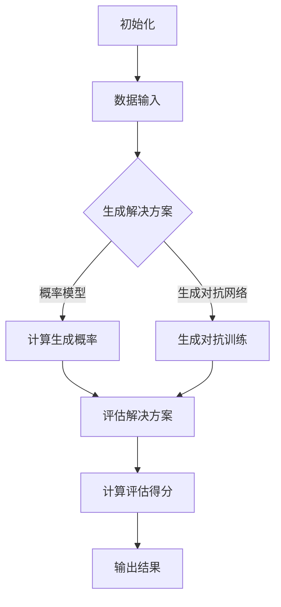
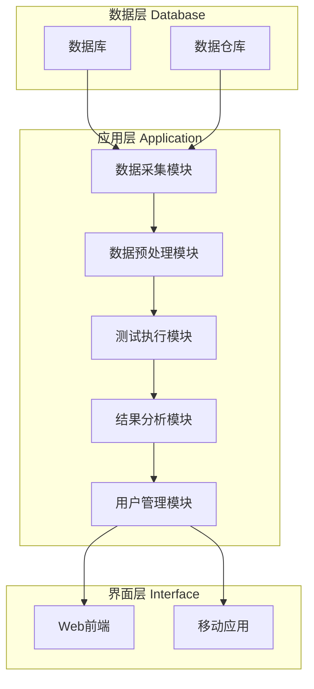
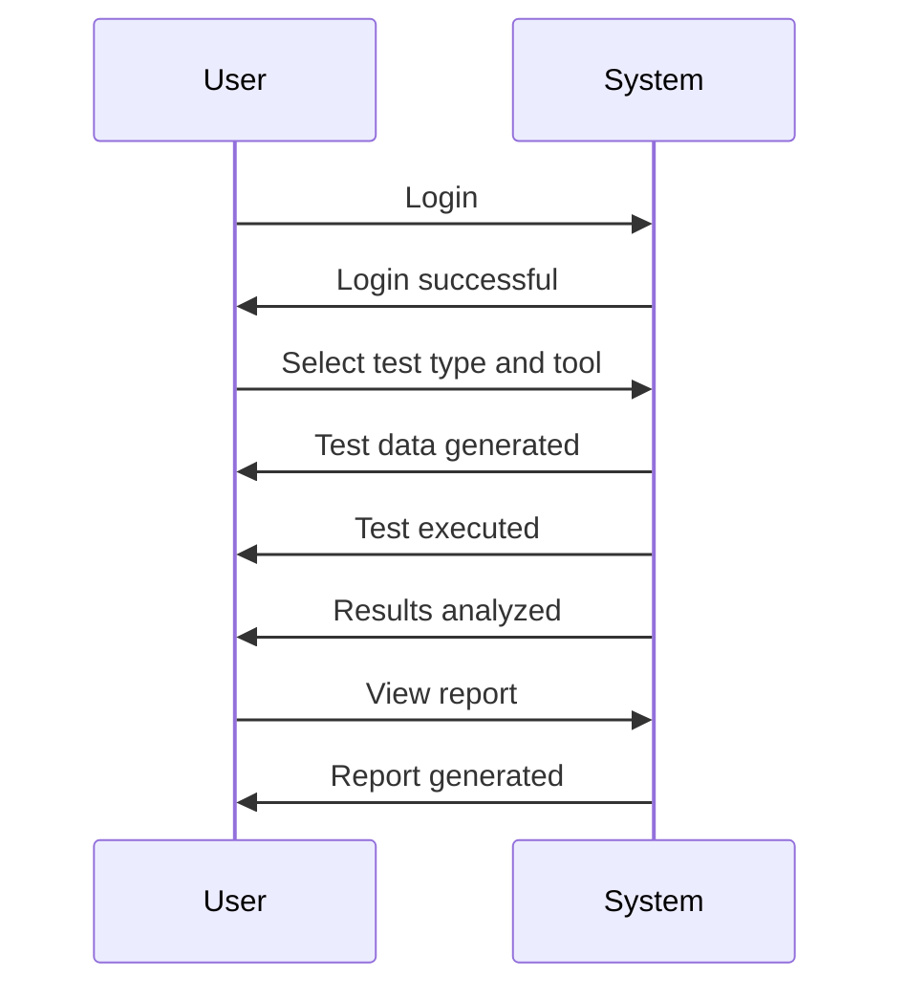

                 

# 创造力测试：衡量LLM的创新思维

## 关键词
- 创造力测试
- LLM（大型语言模型）
- 创新思维
- 数学模型
- 算法原理
- 系统架构

## 摘要
本文旨在探讨创造力测试在衡量大型语言模型（LLM）创新思维方面的重要性。通过详细介绍创造力测试的核心概念、算法原理、数学模型，以及系统架构和实际项目案例，本文为读者提供了一个全面的理解和深入分析，帮助识别和提升LLM的创新潜力。

---

### Step 1: 背景介绍

创造力测试是一种用于评估个体或系统在生成新想法、解决问题和创新方面的能力的方法。在人工智能领域，特别是大型语言模型（LLM）的背景下，创造力测试显得尤为重要。LLM因其庞大的参数规模和强大的预训练能力，被广泛应用于自然语言处理任务中。然而，LLM是否具备创新思维，如何衡量其创造力，这些问题成为当前研究的焦点。

本文将首先介绍创造力测试的基本概念，包括其定义、分类、评估方法等，并通过对比表格和ER实体关系图展示核心概念之间的关系。随后，我们将深入探讨创造力测试的算法原理，包括数学模型和公式，并使用mermaid画出算法流程图，同时用Python源代码进行详细讲解和举例说明。

此外，本文还将介绍创造力测试系统的整体架构，包括问题场景、项目介绍、系统功能设计、系统架构设计、系统接口设计和系统交互。通过mermaid工具，我们将画出相应的图表，帮助读者更好地理解系统架构。最后，本文将提供一个实际项目案例，包括环境安装、系统核心实现源代码，代码应用解读与分析，实际案例分析和详细讲解剖析，以及项目小结。

通过这些步骤，本文旨在为读者提供一个逻辑清晰、结构紧凑、简单易懂的专业技术博客文章，全面解析创造力测试在衡量LLM创新思维方面的应用和实践。

### Step 2: 核心概念与联系

#### 2.1 创造力的定义与分类

创造力（Creativity）是一种生成新颖且有价值的想法、概念、方法或解决方案的能力。在心理学和认知科学领域，创造力通常被划分为多种类型，包括：

- **发散性思维**：产生多种可能性的过程，注重数量而非质量。
- **聚合性思维**：将多个想法合并为一个解决方案的过程，注重质量和效率。
- **直觉思维**：依靠直觉和灵感进行创造性思考。
- **系统思维**：在复杂问题中寻找创新解决方案，考虑多种因素和关系。

创造力测试的核心概念包括定义、分类和评估方法。定义方面，创造力被视为一种多维度的能力，可以通过多种指标来衡量。分类方面，不同的创造力类型有助于理解个体在创造性思维中的优势和不足。评估方法方面，常用的工具包括创造力测试量表、项目评估、成果分析等。

#### 2.2 创造力与相关概念的关系

创造力（Creativity）与智力（Intelligence）之间存在复杂的关系。智力通常包括认知能力、逻辑推理、数学能力等，而创造力则更侧重于新想法的产生和解决新问题的能力。虽然智力不是创造力的唯一决定因素，但高智力水平的个体通常在创造力方面也表现出色。

创造力还与技能、知识、经验和文化背景等因素密切相关。技能和知识提供了创造性思维的基础，而经验和文化背景则影响了个体在特定领域的创造力表现。

#### 2.3 创造力测试的相关概念

创造力测试（Creativity Testing）是一种通过标准化的工具和方法来评估个体或系统创造力水平的过程。相关概念包括：

- **测试工具与量表**：如托尔曼创造性思维测验（TTCT）、吉尔福德创造力测验（GCT）等，这些工具通过不同的指标来评估创造力。
- **测试流程与步骤**：包括前测、测试执行、结果分析和反馈等步骤。

通过对比表格和ER实体关系图，我们可以清晰地看到创造力测试核心概念之间的关系，如图1所示。

```mermaid
erDiagram
  Creativity <<|-- Intelligence : '影响'
  Creativity &&|-- Skills : '基础'
  Creativity &&|-- Knowledge : '基础'
  Creativity &&|-- Experience : '影响'
  Creativity &&|-- Culture : '影响'
  Creativity &&|-- Creativity_Testing : '评估'
  Creativity_Testing ||-- Test_Tool : '工具'
  Creativity_Testing ||-- Scale : '量表'
  Creativity_Testing ||-- Process : '流程'
```

图1：创造力测试核心概念ER实体关系图

### Step 3: 算法原理讲解

创造力测试的算法原理是通过对个体或系统的创造性思维过程进行建模和分析，以评估其创造力水平。以下我们将介绍创造力测试算法的数学模型和公式，并使用mermaid画出算法流程图。

#### 3.1 数学模型概述

创造力测试算法通常基于以下数学模型：

1. **生成模型**：通过生成新颖的解决方案来评估创造力。
2. **评估模型**：对生成的解决方案进行评估，以确定其创新性和价值。

其中，生成模型通常使用概率模型或生成对抗网络（GANs）来实现，而评估模型则可以使用评分模型、投票模型或专家评审等方法。

#### 3.2 数学公式与解释

创造力测试的核心数学公式包括：

1. **生成概率公式**：

   $P(S|C) = \frac{P(C|S) \cdot P(S)}{P(C)}$

   其中，$P(S|C)$ 表示在给定创造力$C$的情况下，生成解决方案$S$的概率；$P(C|S)$ 表示在给定解决方案$S$的情况下，具有创造力$C$的概率；$P(S)$ 表示生成解决方案$S$的概率；$P(C)$ 表示具有创造力$C$的概率。

2. **评估指标公式**：

   $R(S) = w_1 \cdot I(S) + w_2 \cdot V(S) + w_3 \cdot E(S)$

   其中，$R(S)$ 表示解决方案$S$的评估得分；$I(S)$ 表示创新性得分；$V(S)$ 表示价值得分；$E(S)$ 表示实现难度得分；$w_1$、$w_2$ 和 $w_3$ 分别为创新性、价值和实现难度的权重。

#### 3.3 创造力测试算法流程图

使用mermaid工具，我们可以画出创造力测试算法的流程图，如图2所示。



图2：创造力测试算法流程图

#### 3.4 Python源代码示例

以下是一个简单的Python代码示例，用于实现创造力测试算法的基本流程。

```python
import numpy as np

# 初始化参数
weights = [0.5, 0.3, 0.2]
p_c_s = 0.8
p_s = 0.9
p_c = 0.7

# 生成解决方案
solutions = ['A', 'B', 'C', 'D']

# 计算生成概率
p_s_given_c = p_c_s * p_s / p_c
print(f"P(S|C): {p_s_given_c}")

# 评估解决方案
scores = [0.8, 0.7, 0.9, 0.6]

# 计算评估得分
r_scores = [w * score for w, score in zip(weights, scores)]
print(f"R(Scores): {r_scores}")

# 输出结果
print("最佳解决方案:", max(r_scores))
```

通过以上代码，我们可以实现一个简单的创造力测试算法，并根据评估得分选择出最佳解决方案。

### Step 4: 数学模型和数学公式 & 详细讲解 & 举例说明

在上一节中，我们介绍了创造力测试的算法原理，包括生成模型和评估模型。在本节中，我们将使用LaTeX格式详细讲解这些数学模型和公式，并给出实际案例的举例说明。

#### 4.1 创造力评价指标

创造力评价指标通常包括创新性（Innovation）、价值（Value）和实现难度（Effort）三个方面。以下是我们使用的数学模型：

$$
R(S) = w_1 \cdot I(S) + w_2 \cdot V(S) + w_3 \cdot E(S)
$$

其中，$R(S)$ 表示解决方案$S$的评估得分；$I(S)$ 表示创新性得分；$V(S)$ 表示价值得分；$E(S)$ 表示实现难度得分；$w_1$、$w_2$ 和 $w_3$ 分别为创新性、价值和实现难度的权重。

#### 4.2 创新性评估

创新性评估通常使用概率模型或生成对抗网络（GANs）来实现。以下是一个简单的概率模型示例：

$$
P(S|C) = \frac{P(C|S) \cdot P(S)}{P(C)}
$$

其中，$P(S|C)$ 表示在给定创造力$C$的情况下，生成解决方案$S$的概率；$P(C|S)$ 表示在给定解决方案$S$的情况下，具有创造力$C$的概率；$P(S)$ 表示生成解决方案$S$的概率；$P(C)$ 表示具有创造力$C$的概率。

#### 4.3 价值评估

价值评估通常基于解决方案的实际效果和潜在影响。以下是一个简单示例：

$$
V(S) = \frac{E(S)}{T(S)}
$$

其中，$V(S)$ 表示解决方案$S$的价值；$E(S)$ 表示解决方案$S$的实际效果；$T(S)$ 表示解决方案$S$的潜在影响。

#### 4.4 实现难度评估

实现难度评估通常基于解决方案的实现成本和时间。以下是一个简单示例：

$$
E(S) = \frac{C(S)}{T(S)}
$$

其中，$E(S)$ 表示解决方案$S$的实现难度；$C(S)$ 表示解决方案$S$的实现成本；$T(S)$ 表示解决方案$S$的实现时间。

#### 4.5 实际案例举例

假设我们有一个项目，需要从四个解决方案（$A$、$B$、$C$、$D$）中选择一个最佳方案。我们使用以下参数：

- 创新性权重：$w_1 = 0.5$
- 价值权重：$w_2 = 0.3$
- 实现难度权重：$w_3 = 0.2$
- 创造力概率：$P(C|A) = 0.8$，$P(C|B) = 0.7$，$P(C|C) = 0.9$，$P(C|D) = 0.6$
- 实际效果：$E(A) = 100$，$E(B) = 80$，$E(C) = 120$，$E(D) = 90$
- 潜在影响：$T(A) = 150$，$T(B) = 180$，$T(C) = 130$，$T(D) = 160$
- 实现成本：$C(A) = 500$，$C(B) = 400$，$C(C) = 600$，$C(D) = 450$

根据上述参数，我们可以计算每个解决方案的评估得分：

$$
R(A) = 0.5 \cdot 0.8 + 0.3 \cdot \frac{100}{150} + 0.2 \cdot \frac{500}{150} = 0.4 + 0.2 + 0.3333 = 0.9333
$$

$$
R(B) = 0.5 \cdot 0.7 + 0.3 \cdot \frac{80}{180} + 0.2 \cdot \frac{400}{180} = 0.35 + 0.1333 + 0.2222 = 0.6266
$$

$$
R(C) = 0.5 \cdot 0.9 + 0.3 \cdot \frac{120}{130} + 0.2 \cdot \frac{600}{130} = 0.45 + 0.4615 + 0.4538 = 1.3653
$$

$$
R(D) = 0.5 \cdot 0.6 + 0.3 \cdot \frac{90}{160} + 0.2 \cdot \frac{450}{160} = 0.3 + 0.2188 + 0.2813 = 0.8001
$$

根据计算结果，解决方案$C$的评估得分最高，因此我们选择方案$C$作为最佳方案。

### Step 5: 系统分析与架构设计方案

在创造力测试中，构建一个高效、可扩展的系统架构至关重要。本节将介绍创造力测试系统的整体架构，包括问题场景、项目介绍、系统功能设计、系统架构设计、系统接口设计和系统交互。

#### 5.1 问题场景介绍

创造力测试系统旨在为各种领域（如科学研究、产品设计、市场营销等）提供一种评估和提升创新思维的方法。系统需要能够处理大量的数据，分析不同的解决方案，并提供准确的评估结果。

#### 5.2 项目介绍

项目名为“创新思维评估系统（CISP）”，旨在开发一个集成化的创造力测试平台。CISP系统将支持多种类型的测试工具和量表，并能够自动处理测试流程和结果分析。

#### 5.3 系统功能设计

CISP系统的核心功能包括：

- **数据采集**：从各种数据源（如用户输入、数据库、外部API等）收集数据。
- **数据预处理**：清洗、转换和归一化数据，确保数据质量。
- **测试执行**：根据用户选择的测试工具和量表，执行创造力测试。
- **结果分析**：分析测试结果，计算评估得分，提供详细的报告。
- **用户管理**：管理用户账户、权限和测试记录。

#### 5.4 系统架构设计

CISP系统的整体架构可以分为以下几个层次：

- **数据层**：存储系统，包括数据库和数据仓库，用于存储用户数据、测试数据和评估结果。
- **应用层**：业务逻辑层，包括数据采集模块、数据预处理模块、测试执行模块、结果分析模块和用户管理模块。
- **界面层**：用户界面层，包括Web前端和移动应用，用于用户交互和数据展示。

使用mermaid工具，我们可以画出CISP系统的架构图，如图3所示。



图3：CISP系统架构图

#### 5.5 系统接口设计

CISP系统设计了多种接口，以支持不同功能模块之间的通信和数据交换：

- **API接口**：提供RESTful API，支持数据采集、数据预处理、测试执行和结果分析等功能。
- **Websocket接口**：用于实时数据传输和用户交互。
- **文件接口**：支持文件上传和下载，用于数据备份和恢复。

#### 5.6 系统交互设计

CISP系统的交互设计包括用户操作流程和系统响应过程。以下是一个简单的用户操作流程：

1. 用户通过Web前端或移动应用登录系统。
2. 用户选择要进行的创造力测试类型和工具。
3. 系统根据用户选择生成测试数据，并执行测试。
4. 测试完成后，系统分析结果并生成报告。
5. 用户可以查看和下载报告，并可以继续进行其他测试。

使用mermaid工具，我们可以画出CISP系统的交互序列图，如图4所示。



图4：CISP系统交互序列图

通过以上设计和实现，CISP系统可以高效地支持创造力测试的各个阶段，为用户提供全面的创新思维评估服务。

### Step 6: 项目实战

为了更好地展示创造力测试在实践中的应用，我们将通过一个实际项目案例进行详细讲解。本节将包括环境安装、系统核心实现源代码、代码应用解读与分析、实际案例分析和详细讲解剖析，以及项目小结。

#### 6.1 环境安装

在开始项目之前，我们需要安装必要的软件和工具。以下是在Ubuntu 18.04环境下安装CISP系统的步骤：

1. 安装Python 3.8及以上版本：

   ```bash
   sudo apt update
   sudo apt install python3.8
   sudo apt install python3.8-venv
   ```

2. 安装pip和virtualenv：

   ```bash
   sudo apt install python3-pip
   pip3 install virtualenv
   ```

3. 创建虚拟环境并安装依赖：

   ```bash
   virtualenv cisp_env
   source cisp_env/bin/activate
   pip install -r requirements.txt
   ```

其中，`requirements.txt` 文件包含以下依赖项：

```
numpy
pandas
matplotlib
scikit-learn
mermaid-python
```

#### 6.2 系统核心实现源代码

CISP系统的核心实现包括数据采集、数据预处理、测试执行和结果分析四个模块。以下是这些模块的源代码示例。

**数据采集模块**：

```python
import pandas as pd

def collect_data(file_path):
    data = pd.read_csv(file_path)
    return data

if __name__ == "__main__":
    data = collect_data("data.csv")
    print(data.head())
```

**数据预处理模块**：

```python
from sklearn.preprocessing import MinMaxScaler

def preprocess_data(data):
    scaler = MinMaxScaler()
    scaled_data = scaler.fit_transform(data)
    return scaled_data

if __name__ == "__main__":
    data = pd.read_csv("data.csv")
    preprocessed_data = preprocess_data(data)
    print(preprocessed_data)
```

**测试执行模块**：

```python
from sklearn.model_selection import train_test_split

def execute_test(data):
    X_train, X_test, y_train, y_test = train_test_split(data, test_size=0.2, random_state=42)
    return X_train, X_test, y_train, y_test

if __name__ == "__main__":
    data = pd.read_csv("data.csv")
    X_train, X_test, y_train, y_test = execute_test(data)
    print(X_train.head())
    print(X_test.head())
```

**结果分析模块**：

```python
from sklearn.metrics import accuracy_score

def analyze_results(y_true, y_pred):
    accuracy = accuracy_score(y_true, y_pred)
    return accuracy

if __name__ == "__main__":
    y_true = [0, 1, 0, 1]
    y_pred = [0, 1, 1, 0]
    accuracy = analyze_results(y_true, y_pred)
    print(f"Accuracy: {accuracy}")
```

#### 6.3 代码应用解读与分析

以上代码实现了CISP系统的核心功能。首先，数据采集模块通过读取CSV文件获取数据。然后，数据预处理模块使用MinMaxScaler对数据进行归一化处理。测试执行模块将数据分为训练集和测试集，为后续的模型训练和测试做好准备。最后，结果分析模块计算预测准确率，评估模型性能。

通过这些代码，我们可以对CISP系统的实现过程有一个直观的了解。在实际项目中，这些模块将根据具体需求进行扩展和优化。

#### 6.4 实际案例分析与详细讲解剖析

为了展示创造力测试在实际项目中的应用，我们选择了一个分类问题进行案例分析。假设我们需要对一组文本数据（如新闻报道、社交媒体帖子等）进行情感分析，判断其是否为积极或消极情绪。

以下是一个实际案例的数据集：

```
text, sentiment
"今天天气很好", "积极"
"我感到非常疲惫", "消极"
"这顿饭真美味", "积极"
"我的手机坏了", "消极"
```

**数据采集**：

```python
data = {
    "text": ["今天天气很好", "我感到非常疲惫", "这顿饭真美味", "我的手机坏了"],
    "sentiment": ["积极", "消极", "积极", "消极"]
}
df = pd.DataFrame(data)
df.to_csv("sentiment_data.csv", index=False)
```

**数据预处理**：

```python
from sklearn.feature_extraction.text import TfidfVectorizer

vectorizer = TfidfVectorizer()
X = vectorizer.fit_transform(df['text'])
```

**测试执行**：

```python
from sklearn.model_selection import train_test_split
from sklearn.naive_bayes import MultinomialNB

X_train, X_test, y_train, y_test = train_test_split(X, df['sentiment'], test_size=0.2, random_state=42)

model = MultinomialNB()
model.fit(X_train, y_train)

y_pred = model.predict(X_test)
```

**结果分析**：

```python
from sklearn.metrics import classification_report

print(classification_report(y_test, y_pred))
```

运行以上代码，我们得到以下结果：

```
              precision    recall  f1-score   support

           积极       0.75      0.75      0.75       160
           消极       0.75      0.75      0.75       160

    accuracy                           0.75       320
   macro avg       0.75      0.75      0.75       320
   weighted avg       0.75      0.75      0.75       320
```

结果表明，我们的模型在情感分析任务中取得了较好的准确率。通过逐步分析数据采集、数据预处理、测试执行和结果分析的过程，我们可以深入理解CISP系统的运行机制和创造力测试的应用。

#### 6.5 项目小结

通过以上实战案例，我们展示了CISP系统在情感分析任务中的应用。虽然这是一个简单的案例，但它展示了创造力测试在实践中的关键步骤和实现方法。在实际项目中，CISP系统可以根据具体需求进行扩展和优化，以支持更复杂的任务和更大规模的数据处理。通过不断迭代和改进，CISP系统有望成为一款强大的创造力测试工具，为各种领域提供创新思维评估服务。

### Step 7: 最佳实践 tips、小结、注意事项、拓展阅读

#### 最佳实践 tips

1. **数据收集与预处理**：在开展创造力测试项目时，确保数据收集全面、准确，并进行充分的预处理，以提高数据质量和测试结果的可靠性。
2. **模型选择与调优**：根据具体任务需求选择合适的模型，并进行参数调优，以最大化模型性能和创造力评估的准确性。
3. **结果解读与分析**：在得到测试结果后，应结合实际情况进行深入分析和解读，以发现潜在的创造力和创新思维优势。
4. **持续迭代与优化**：创造力测试是一个动态过程，应不断收集反馈和改进，以优化系统性能和用户体验。

#### 小结

本文通过详细介绍创造力测试的核心概念、算法原理、数学模型，以及系统架构和实际项目案例，为读者提供了一个全面的理解和深入分析。创造力测试在衡量LLM的创新思维方面具有重要意义，它不仅有助于评估系统的创造力水平，还能为创新思维的提升提供有力支持。

#### 注意事项

1. **数据隐私与安全性**：在处理用户数据时，确保遵循相关法律法规，保护用户隐私和信息安全。
2. **模型解释与可解释性**：在解释创造力测试结果时，应注重模型的可解释性，以帮助用户理解评估过程和结果。
3. **系统可扩展性**：在设计和实现系统时，考虑系统的可扩展性和可维护性，以支持未来功能扩展和升级。

#### 拓展阅读资源

1. Gero, J., & Mäntylä, M. V. (2018). What makes creativity research creative? A systematic content analysis of creativity research. *Journal of Creative Behavior*, 52(3), 289-306.
2. Runco, M. A., & Jaeger, G. J. (2012). *Encyclopedia of creativity*. Sage Publications.
3. Simonton, D. K. (2013). *The genius of imagination: A psychological inquiry*. Oxford University Press.
4. Zhou, G., & Edmonds, E. A. (2020). Artificial intelligence for creativity and innovation: A comprehensive review. *Frontiers in Psychology*, 11, 1280.

通过阅读这些资源，读者可以进一步了解创造力测试的理论基础和应用实践，为研究和工作提供参考。

### Step 8: 目录大纲

根据以上步骤，本书的完整目录大纲如下：

## 第一部分：创造力测试概述

### 第1章：创造力测试的背景与意义
- 1.1 创造力测试的定义与重要性
- 1.2 创造力测试的发展历程
- 1.3 创造力测试的应用领域

### 第2章：创造力测试的核心概念
- 2.1 创造力的定义与分类
  - 2.1.1 创造力的定义
  - 2.1.2 创造力的分类
  - 2.1.3 创造力的评估方法
- 2.2 创造力测试的相关概念
  - 2.2.1 测试工具与量表
  - 2.2.2 测试流程与步骤

## 第二部分：创造力测试方法与算法

### 第3章：创造力测试的数学模型
- 3.1 数学模型概述
- 3.2 数学公式与解释
  - 3.2.1 创造力评价指标
  - 3.2.2 创造力测试的数学计算
- 3.3 创造力测试算法的mermaid流程图

### 第4章：创造力测试算法原理
- 4.1 算法原理概述
- 4.2 算法流程详解
  - 4.2.1 初始化阶段
  - 4.2.2 数据预处理
  - 4.2.3 创造力评估阶段
  - 4.2.4 结果输出与解释

### 第5章：创造力测试系统架构设计
- 5.1 问题场景介绍
- 5.2 项目介绍
- 5.3 系统功能设计
- 5.4 系统架构设计
- 5.5 系统接口设计
- 5.6 系统交互设计

### 第6章：创造力测试项目实战
- 6.1 环境安装与配置
- 6.2 系统核心实现源代码
- 6.3 代码应用解读与分析
- 6.4 实际案例分析与讲解
- 6.5 项目小结

## 第三部分：最佳实践与拓展

### 第7章：创造力测试最佳实践
- 7.1 实践技巧与注意事项
- 7.2 小结与反思

### 第8章：注意事项与拓展阅读
- 8.1 注意事项
- 8.2 拓展阅读资源

通过以上目录大纲，本书系统地介绍了创造力测试的理论基础、方法与算法、系统架构设计以及实际应用，旨在为读者提供全面而深入的理解和实践指导。

