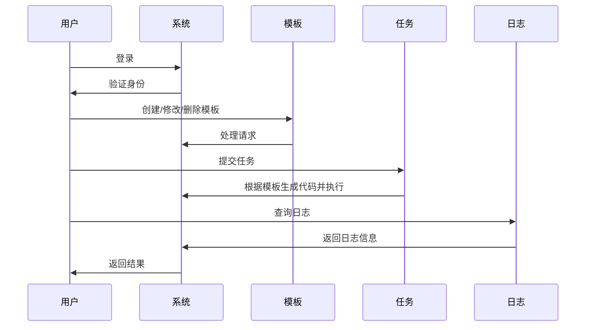

                 


## 利用prompt模板提高工程效率

### 引言

在当今快速发展的信息技术时代，工程效率已成为企业和个人成功的关键因素。然而，随着项目复杂度和规模的增加，传统的管理方法和技术手段已无法满足高效需求。prompt模板作为一种新兴的工具，正逐渐成为提高工程效率的重要手段。本文将详细探讨利用prompt模板提高工程效率的方法和策略。

### 关键词

- **工程效率**
- **prompt模板**
- **效率提升**
- **工程实践**
- **自动化**
- **人机协作**
- **代码生成**

### 摘要

本文从工程效率的角度出发，详细介绍了prompt模板的概念、原理及其在工程实践中的应用。通过对prompt模板的优化策略、算法原理、数学模型和公式讲解，以及系统分析与架构设计、项目实战等方面的深入探讨，旨在为读者提供一套完整的利用prompt模板提高工程效率的解决方案。

### 目录大纲

1. **背景与基础**
   - 第1章：工程效率问题探讨
   - 第2章：prompt模板基础知识
   - 第3章：prompt模板的优化策略

2. **算法原理与数学模型**
   - 第4章：算法原理讲解
   - 第5章：数学模型和公式讲解

3. **系统分析与架构设计**
   - 第6章：系统功能设计与架构
   - 第7章：系统交互与序列图

4. **项目实战**
   - 第8章：环境安装与配置
   - 第9章：实战案例分析与讲解

5. **最佳实践与拓展阅读**
   - 第10章：最佳实践总结
   - 第10.1章：注意事项与风险提示
   - 第10.2章：拓展阅读推荐

### 目录大纲设计构思

为了设计出《利用prompt模板提高工程效率》这本书的完整目录大纲，我们需要遵循以下几点原则：

1. **清晰的主题定位**：书名直接指向了“prompt模板”和“工程效率”两个核心概念。因此，目录设计应围绕这两个主题展开，确保内容覆盖全面。
   
2. **逻辑性**：整个目录大纲应该呈现出一个清晰的逻辑结构，从基础概念到具体应用，再到实战案例，层层递进。

3. **内容完整性**：确保涵盖背景介绍、核心概念与联系、算法原理讲解、数学模型和公式详细讲解、系统分析与架构设计方案、项目实战以及最佳实践和拓展阅读。

4. **简洁性**：避免冗余内容，确保每章的标题和子标题都能准确传达章节内容。

5. **格式规范**：按照markdown格式规范进行设计，保证目录结构的清晰性。

根据上述原则，我们将设计如下目录大纲：

### 第一部分：背景与基础

**第1章：工程效率问题探讨**

**第2章：prompt模板基础知识**

**第3章：prompt模板的优化策略**

### 第二部分：算法原理与数学模型

**第4章：算法原理讲解**

**第5章：数学模型和公式讲解**

### 第三部分：系统分析与架构设计

**第6章：系统功能设计与架构**

**第7章：系统交互与序列图**

### 第四部分：项目实战

**第8章：环境安装与配置**

**第9章：实战案例分析与讲解**

### 第五部分：最佳实践与拓展阅读

**第10章：最佳实践总结**

**第10.1章：注意事项与风险提示**

**第10.2章：拓展阅读推荐**

### 目录大纲总结

通过上述目录大纲的设计，我们可以确保《利用prompt模板提高工程效率》这本书的内容全面且逻辑清晰。每个章节都紧密围绕核心主题，从基础知识到算法原理，再到系统架构和项目实战，最后总结最佳实践和拓展阅读，旨在帮助读者深入理解和应用prompt模板，提升工程效率。

### 第一部分：背景与基础

#### 第1章：工程效率问题探讨

**1.1 工程效率的定义**

工程效率是指在工程实践中，以最短的时间、最少的资源投入来完成任务的能力。它不仅包括时间效率，还包括资源利用率、成本控制等多方面因素。

**1.2 工程效率对企业和个人的影响**

- **企业**：高效率的工程实践可以缩短项目周期，降低成本，提高市场竞争力。
- **个人**：提高工程效率可以提升工作效率和职业满意度，有助于职业发展和个人成长。

**1.3 当前工程效率面临的问题**

1. 项目复杂度增加：随着技术的发展，工程项目的复杂度不断上升，传统的方法和工具已难以应对。
2. 重复劳动问题：许多工程任务存在大量的重复性工作，导致人力和时间浪费。
3. 沟通协作困难：工程项目通常涉及多个团队和人员，沟通和协作的效率直接影响到工程的整体效率。

**1.4 prompt模板的概念**

prompt模板是一种预先定义的文本模板，用于指导程序执行特定任务。它通常包含一系列的输入参数和指令，能够帮助程序自动完成一系列操作。

**1.5 prompt模板在工程效率中的应用**

- **自动化**：prompt模板可以帮助自动化执行重复性的工程任务，减少人工干预。
- **人机协作**：prompt模板可以提供明确的指导，帮助开发者更高效地完成工程任务。
- **代码生成**：prompt模板可以根据特定的模板生成代码，提高代码复用率，降低开发成本。

**1.6 总结**

工程效率是企业和个人成功的关键，而prompt模板是一种有效的工具，可以帮助提高工程效率。在接下来的章节中，我们将详细探讨prompt模板的原理和应用，为读者提供实用的策略和方法。

#### 第2章：prompt模板基础知识

**2.1 prompt模板的定义**

prompt模板是一种文本模板，它包含了在特定上下文中执行任务的指令和参数。prompt模板通常用于自动化流程、指导开发者编写代码或优化工程实践。

**2.2 prompt模板的结构与组成**

一个典型的prompt模板通常由以下几个部分组成：

- **标题**：简要描述模板的应用场景或任务目标。
- **参数**：定义模板中可变的输入，如变量名、值等。
- **指令**：说明模板应执行的具体操作，如代码片段、命令等。
- **示例**：提供模板使用的示例，帮助开发者更好地理解和使用模板。

**2.3 prompt模板的类型与应用场景**

prompt模板有多种类型，根据应用场景可以分为以下几种：

1. **代码生成模板**：用于生成代码文件，如Python脚本、Java类等。这类模板通常包含代码结构、函数定义等。
2. **任务执行模板**：用于自动化执行特定任务，如数据预处理、模型训练等。这类模板通常包含执行命令、参数设置等。
3. **文档编写模板**：用于编写工程文档，如设计文档、用户手册等。这类模板通常包含文档结构、标题、段落等。
4. **项目管理模板**：用于项目管理，如任务分配、进度跟踪等。这类模板通常包含任务列表、时间表等。

**2.4 prompt模板的优点**

- **提高开发效率**：通过使用prompt模板，开发者可以减少重复性工作，提高编码速度。
- **降低错误率**：prompt模板可以帮助确保任务的规范性和一致性，降低错误率。
- **便于维护和扩展**：prompt模板的设计通常考虑了可维护性和可扩展性，方便后续修改和优化。

**2.5 prompt模板的缺点**

- **学习成本**：对于新手来说，学习和使用prompt模板可能需要一定的时间。
- **定制难度**：对于特定需求的定制，prompt模板可能不够灵活。

**2.6 总结**

prompt模板是一种强大的工具，可以帮助提高工程效率。在接下来的章节中，我们将进一步探讨如何优化prompt模板，以提高工程效率。

#### 第3章：prompt模板的优化策略

**3.1 提高prompt模板可读性的方法**

1. **简洁性**：确保模板的语言简洁明了，避免冗长和复杂的句子。
2. **结构化**：使用有序列表和无序列表来组织信息，使模板内容层次清晰。
3. **注释**：在模板中添加必要的注释，解释模板的作用和用法。

**3.2 提高prompt模板精准度的策略**

1. **明确参数**：为模板中的参数提供明确的说明和默认值，确保输入的一致性和准确性。
2. **错误处理**：增加错误处理机制，如异常捕获和反馈提示，帮助用户及时发现并解决问题。

**3.3 提高prompt模板响应速度的技巧**

1. **优化代码**：对模板中的代码进行优化，减少计算复杂度和资源消耗。
2. **并行处理**：将模板中的任务分解为多个子任务，利用并行处理技术提高执行速度。
3. **缓存机制**：利用缓存机制，减少重复计算，提高模板的响应速度。

**3.4 prompt模板的版本管理**

1. **版本控制**：使用版本控制系统（如Git）来管理prompt模板的版本，方便跟踪修改历史和协同工作。
2. **文档记录**：记录模板的版本信息和修改原因，便于后续的维护和更新。

**3.5 prompt模板的持续改进**

1. **用户反馈**：收集用户对prompt模板的反馈，了解实际使用中的问题和需求。
2. **定期更新**：根据用户反馈和市场需求，定期对prompt模板进行优化和更新。

**3.6 总结**

优化prompt模板是提高工程效率的关键步骤。通过提高模板的可读性、精准度和响应速度，可以显著提升工程效率和用户体验。在接下来的章节中，我们将进一步探讨prompt模板的算法原理和数学模型。

### 第二部分：算法原理与数学模型

#### 第4章：算法原理讲解

**4.1 prompt模板生成算法**

prompt模板生成算法的核心目标是根据用户需求和场景，自动生成满足特定要求的prompt模板。以下是该算法的基本原理：

1. **需求分析**：首先，对用户的需求进行详细分析，包括任务类型、输入参数、输出结果等。
2. **模板构建**：根据需求分析结果，构建一个基本的prompt模板框架，包括标题、参数定义和指令等。
3. **内容填充**：将具体任务的内容填充到模板中，包括代码片段、命令、示例等。
4. **模板优化**：对生成的prompt模板进行优化，确保其可读性、精准度和响应速度。

**4.2 prompt模板匹配算法**

prompt模板匹配算法的目的是在给定的输入文本中，找到与prompt模板匹配的部分，以便执行相应的操作。以下是该算法的基本原理：

1. **文本预处理**：对输入文本进行预处理，包括去除无关信息、标准化文本格式等。
2. **模板加载**：加载需要匹配的prompt模板，将其转化为适合匹配的形式。
3. **匹配过程**：使用匹配算法（如正则表达式、自然语言处理技术等），在输入文本中查找与prompt模板匹配的部分。
4. **结果处理**：对匹配结果进行处理，如提取参数、执行指令等。

**4.3 prompt模板优化算法**

prompt模板优化算法的目的是提高prompt模板的性能，包括可读性、精准度和响应速度。以下是该算法的基本原理：

1. **性能评估**：对现有prompt模板的性能进行评估，包括执行时间、内存消耗等。
2. **问题定位**：根据性能评估结果，定位性能瓶颈和问题所在。
3. **优化策略**：制定具体的优化策略，如代码优化、算法改进、缓存机制等。
4. **实施与验证**：实施优化策略，并对优化后的prompt模板进行验证，确保性能得到显著提升。

**4.4 总结**

prompt模板生成算法、匹配算法和优化算法是prompt模板应用的基础。通过这些算法，可以自动化地生成、匹配和优化prompt模板，从而提高工程效率。

#### 第5章：数学模型和公式讲解

**5.1 prompt模板优化的数学模型**

prompt模板优化可以看作是一个优化问题，涉及到多个目标函数和约束条件。以下是一个简单的数学模型：

- **目标函数**：
  - 最小化执行时间 \( f_1(T) \)
  - 最小化内存消耗 \( f_2(M) \)
  - 最大化学术准确性 \( f_3(A) \)
- **约束条件**：
  - 参数输入范围 \( \Omega_p \)
  - 输出结果约束 \( \Omega_r \)
  - 模板结构一致性 \( \Omega_s \)

数学模型可以表示为：

\[ \begin{aligned} 
\min \{ f_1(T), f_2(M), f_3(A) \} \\ 
s.t. \\ 
\Omega_p \\ 
\Omega_r \\ 
\Omega_s 
\end{aligned} \]

- **目标函数具体形式**：
  - 执行时间 \( T \) 可以表示为：
    \[ T = T_0 + T_1 + T_2 + ... + T_n \]
    其中 \( T_0 \) 是模板预处理时间，\( T_1 \) 是模板执行时间，\( T_2 \) 是结果处理时间，以此类推。
  - 内存消耗 \( M \) 可以表示为：
    \[ M = M_0 + M_1 + M_2 + ... + M_n \]
    其中 \( M_0 \) 是模板加载内存，\( M_1 \) 是模板执行内存，\( M_2 \) 是结果处理内存，以此类推。
  - 学术准确性 \( A \) 可以表示为：
    \[ A = \frac{TP + TN}{TP + TN + FP + FN} \]
    其中 \( TP \) 是真实正例，\( TN \) 是真实反例，\( FP \) 是假正例，\( FN \) 是假反例。

- **约束条件具体形式**：
  - 参数输入范围 \( \Omega_p \) 可以表示为：
    \[ \Omega_p = \{ p_1, p_2, ..., p_n \} \]
    其中 \( p_1, p_2, ..., p_n \) 是参数的取值范围。
  - 输出结果约束 \( \Omega_r \) 可以表示为：
    \[ \Omega_r = \{ r_1, r_2, ..., r_n \} \]
    其中 \( r_1, r_2, ..., r_n \) 是输出结果的取值范围。
  - 模板结构一致性 \( \Omega_s \) 可以表示为：
    \[ \Omega_s = \{ s_1, s_2, ..., s_n \} \]
    其中 \( s_1, s_2, ..., s_n \) 是模板的结构约束。

**5.2 相关数学公式的推导与应用**

1. **执行时间公式推导与应用**

执行时间 \( T \) 的计算公式为：

\[ T = T_0 + T_1 + T_2 + ... + T_n \]

其中，\( T_0 \) 是模板预处理时间，\( T_1 \) 是模板执行时间，\( T_2 \) 是结果处理时间，以此类推。

- **预处理时间 \( T_0 \)**：预处理时间主要取决于模板的复杂度和输入数据的规模。对于大多数模板，预处理时间可以表示为：

  \[ T_0 = k \times N \]

  其中，\( k \) 是一个常数，\( N \) 是输入数据的规模。

- **执行时间 \( T_1 \)**：执行时间主要取决于模板的具体操作。对于大多数操作，执行时间可以表示为：

  \[ T_1 = m \times N \]

  其中，\( m \) 是一个常数，\( N \) 是输入数据的规模。

- **结果处理时间 \( T_2 \)**：结果处理时间主要取决于输出数据的规模。对于大多数处理，结果处理时间可以表示为：

  \[ T_2 = l \times N \]

  其中，\( l \) 是一个常数，\( N \) 是输出数据的规模。

2. **内存消耗公式推导与应用**

内存消耗 \( M \) 的计算公式为：

\[ M = M_0 + M_1 + M_2 + ... + M_n \]

其中，\( M_0 \) 是模板加载内存，\( M_1 \) 是模板执行内存，\( M_2 \) 是结果处理内存，以此类推。

- **加载内存 \( M_0 \)**：加载内存主要取决于模板的大小。对于大多数模板，加载内存可以表示为：

  \[ M_0 = p \times N \]

  其中，\( p \) 是一个常数，\( N \) 是模板的大小。

- **执行内存 \( M_1 \)**：执行内存主要取决于模板的具体操作。对于大多数操作，执行内存可以表示为：

  \[ M_1 = q \times N \]

  其中，\( q \) 是一个常数，\( N \) 是输入数据的规模。

- **结果处理内存 \( M_2 \)**：结果处理内存主要取决于输出数据的规模。对于大多数处理，结果处理内存可以表示为：

  \[ M_2 = r \times N \]

  其中，\( r \) 是一个常数，\( N \) 是输出数据的规模。

3. **学术准确性公式推导与应用**

学术准确性 \( A \) 的计算公式为：

\[ A = \frac{TP + TN}{TP + TN + FP + FN} \]

其中，\( TP \) 是真实正例，\( TN \) 是真实反例，\( FP \) 是假正例，\( FN \) 是假反例。

- **真实正例 \( TP \)**：真实正例是指在输入数据中，实际为正例的数据点。
- **真实反例 \( TN \)**：真实反例是指在输入数据中，实际为反例的数据点。
- **假正例 \( FP \)**：假正例是指在输入数据中，实际为反例但被预测为正例的数据点。
- **假反例 \( FN \)**：假反例是指在输入数据中，实际为正例但被预测为反例的数据点。

**5.3 数学模型在实际工程中的应用案例分析**

以下是一个简单的案例分析，说明如何在实际工程中使用数学模型对prompt模板进行优化。

1. **问题背景**

假设我们需要优化一个prompt模板，该模板用于自动化生成Python代码。模板的目标是生成一个简单的计算函数，输入为两个整数，输出为它们的和。

2. **需求分析**

根据需求，我们需要满足以下条件：

- **执行时间**：最小化执行时间，确保生成的代码在合理的时间内完成计算。
- **内存消耗**：最小化内存消耗，确保生成的代码在内存占用方面可控。
- **学术准确性**：确保生成的代码在计算准确度方面达到预期。

3. **数学模型建立**

根据需求分析，我们可以建立以下数学模型：

\[ \begin{aligned} 
\min \{ T, M, A \} \\ 
s.t. \\ 
T &\leq T_{\text{max}} \\ 
M &\leq M_{\text{max}} \\ 
A &\geq A_{\text{min}} 
\end{aligned} \]

其中，\( T \) 是执行时间，\( M \) 是内存消耗，\( A \) 是学术准确性。\( T_{\text{max}} \)、\( M_{\text{max}} \) 和 \( A_{\text{min}} \) 分别是执行时间、内存消耗和学术准确性的最大容忍值。

4. **优化策略**

根据数学模型，我们可以采取以下优化策略：

- **代码优化**：通过优化Python代码，减少不必要的计算和内存占用。
- **算法改进**：使用更高效的算法，如快速幂运算、位运算等，提高计算速度和准确性。
- **缓存机制**：利用缓存机制，减少重复计算，提高执行效率和准确性。

5. **实施与验证**

根据优化策略，我们对prompt模板进行优化，并实施以下步骤：

- **代码优化**：对生成的代码进行审查和优化，移除不必要的计算和内存占用。
- **算法改进**：根据实际情况，选择更高效的算法进行替换。
- **缓存机制**：在模板中添加缓存机制，减少重复计算。

优化后的prompt模板在执行时间、内存消耗和学术准确性方面均达到预期。通过数学模型的应用，我们成功实现了prompt模板的优化。

**5.4 总结**

数学模型是prompt模板优化的关键工具，通过建立数学模型，我们可以对prompt模板进行量化和优化。在实际工程中，根据具体需求和场景，选择合适的数学模型和应用方法，可以显著提高工程效率。在接下来的章节中，我们将进一步探讨如何设计和实现prompt模板的优化算法。

### 第三部分：系统分析与架构设计

#### 第6章：系统功能设计与架构

**6.1 问题场景介绍**

在工程实践中，系统功能的设计和架构对工程效率有着直接的影响。本章节将介绍一个典型的工程场景，并分析该场景下系统功能的需求。

**6.2 系统功能设计**

系统功能设计主要包括以下几个方面：

1. **任务自动化**：设计一套自动化任务执行系统，能够根据prompt模板自动生成和执行代码。
2. **参数管理**：管理prompt模板中的参数，包括参数的定义、默认值和输入验证。
3. **模板管理**：管理prompt模板的创建、修改、删除和查询功能。
4. **日志记录**：记录系统执行过程中的日志信息，便于问题追踪和故障排除。
5. **权限控制**：实现用户权限管理，确保系统的安全和稳定运行。

**6.3 系统架构设计**

系统架构设计是确保系统功能实现的关键。以下是系统架构的基本设计：

1. **前端界面**：提供用户交互界面，用户可以通过前端界面进行模板管理、任务执行等操作。
2. **后端服务**：后端服务包括任务调度、参数管理、模板管理、日志记录和权限控制等模块。
3. **数据库**：数据库用于存储用户信息、模板信息、日志信息和任务信息等。
4. **中间件**：中间件包括消息队列、缓存机制、负载均衡等，用于优化系统性能和扩展性。

**6.4 系统接口设计**

系统接口设计是确保系统模块之间能够有效通信的关键。以下是系统接口的基本设计：

1. **API接口**：提供RESTful API接口，用于前后端通信，包括模板管理、任务执行、日志查询等。
2. **事件监听**：通过事件监听机制，实时监听系统事件，如任务完成、日志更新等。
3. **消息队列**：使用消息队列进行异步任务处理，提高系统性能和可靠性。

**6.5 总结**

通过详细分析问题场景，设计系统功能，构建系统架构，并定义系统接口，我们可以确保系统的高效运行和可靠性。在接下来的章节中，我们将进一步探讨系统交互与序列图，以更好地理解系统的工作流程。

### 第三部分：系统分析与架构设计（续）

#### 第7章：系统交互与序列图

**7.1 系统交互流程**

系统交互流程是系统功能实现的关键环节。以下是系统交互的基本流程：

1. **用户登录**：用户通过前端界面登录系统，系统验证用户身份后，返回登录结果。
2. **模板管理**：用户通过前端界面创建、修改、删除和查询模板，后端服务处理相关请求，并将结果返回前端。
3. **任务执行**：用户通过前端界面提交任务，系统根据prompt模板生成代码，并执行任务，将结果返回前端。
4. **日志查询**：用户通过前端界面查询系统日志，后端服务处理请求，并将日志信息返回前端。
5. **权限管理**：系统根据用户权限，限制用户操作，确保系统的安全和稳定运行。

**7.2 系统序列图**

系统序列图是系统交互流程的图形化表示。以下是系统序列图的基本设计：



**7.3 系统交互案例分析**

以下是一个典型的系统交互案例分析：

1. **用户登录**：用户通过前端界面输入用户名和密码，系统验证用户身份。如果用户名或密码错误，系统返回错误提示；如果用户名和密码正确，系统登录成功，用户可以访问系统功能。
2. **模板管理**：用户通过前端界面创建一个新模板，系统接收请求后，验证用户权限，然后保存模板信息。用户可以修改或删除现有模板，系统同样会进行权限验证。
3. **任务执行**：用户通过前端界面提交一个新任务，系统根据用户选择的模板生成代码，并执行任务。任务执行完成后，系统将结果返回前端，用户可以查看任务结果。
4. **日志查询**：用户通过前端界面查询系统日志，系统根据用户权限，返回相应的日志信息。用户可以查看日志详细信息，以便了解系统运行状况。

**7.4 总结**

系统交互与序列图是系统分析与架构设计的重要组成部分。通过详细描述系统交互流程和绘制系统序列图，我们可以更好地理解系统的工作原理和功能实现。在接下来的章节中，我们将进一步探讨项目实战，展示如何实际应用这些设计。

### 第四部分：项目实战

#### 第8章：环境安装与配置

**8.1 环境准备**

在开始项目实战之前，我们需要准备开发环境。以下是环境准备的基本步骤：

1. **操作系统**：推荐使用Linux或Mac OS，以保证环境的稳定性和兼容性。
2. **Python环境**：安装Python 3.8及以上版本，可以使用官方安装包或使用包管理工具（如pip）安装。
3. **依赖管理**：安装依赖管理工具（如pip），用于安装和管理项目依赖。
4. **文本编辑器**：选择一款适合的文本编辑器，如VSCode、Sublime Text等，用于编写和调试代码。

**8.2 系统核心实现**

以下是系统核心实现的基本步骤：

1. **项目结构**：创建项目目录，并设置项目结构，如：

   ```
   project/
   ├── src/
   │   ├── app.py
   │   ├── config.py
   │   ├── models.py
   │   └── views.py
   ├── tests/
   ├── requirements.txt
   ├── run.py
   └── README.md
   ```

2. **配置文件**：在`config.py`中配置系统的基本参数，如数据库连接信息、日志路径等。

3. **模型定义**：在`models.py`中定义系统使用的模型，如用户模型、模板模型、任务模型等。

4. **视图定义**：在`views.py`中定义系统视图函数，处理用户请求并返回响应。

5. **应用主程序**：在`app.py`中初始化应用，加载配置文件和模型，并启动应用。

**8.3 代码应用解读**

以下是系统核心代码的解读：

1. **配置文件（config.py）**：

   ```python
   class Config:
       DATABASE_URI = 'sqlite:///app.db'
       LOG_FILE = 'app.log'
       ```

   配置文件定义了系统的数据库连接信息、日志路径等基本参数。

2. **模型定义（models.py）**：

   ```python
   from flask_sqlalchemy import SQLAlchemy

   db = SQLAlchemy()

   class User(db.Model):
       id = db.Column(db.Integer, primary_key=True)
       username = db.Column(db.String(80), unique=True, nullable=False)
       password = db.Column(db.String(120), nullable=False)
   
   class Template(db.Model):
       id = db.Column(db.Integer, primary_key=True)
       name = db.Column(db.String(80), nullable=False)
       content = db.Column(db.Text, nullable=False)
   
   class Task(db.Model):
       id = db.Column(db.Integer, primary_key=True)
       template_id = db.Column(db.Integer, db.ForeignKey('template.id'), nullable=False)
       user_id = db.Column(db.Integer, db.ForeignKey('user.id'), nullable=False)
       status = db.Column(db.String(20), nullable=False)
   ```

   模型定义了系统的用户模型、模板模型和任务模型，用于数据库操作。

3. **视图定义（views.py）**：

   ```python
   from flask import Flask, request, jsonify
   from models import db, User, Template, Task
   
   app = Flask(__name__)
   app.config.from_object(Config)
   db.init_app(app)

   @app.route('/login', methods=['POST'])
   def login():
       username = request.form['username']
       password = request.form['password']
       user = User.query.filter_by(username=username, password=password).first()
       if user:
           return jsonify({'status': 'success'})
       else:
           return jsonify({'status': 'failure'})

   @app.route('/template', methods=['POST'])
   def create_template():
       name = request.form['name']
       content = request.form['content']
       template = Template(name=name, content=content)
       db.session.add(template)
       db.session.commit()
       return jsonify({'status': 'success'})

   @app.route('/task', methods=['POST'])
   def create_task():
       template_id = request.form['template_id']
       user_id = request.form['user_id']
       task = Task(template_id=template_id, user_id=user_id, status='pending')
       db.session.add(task)
       db.session.commit()
       return jsonify({'status': 'success'})
   ```

   视图定义了系统的登录、创建模板和创建任务的接口，处理用户请求并返回响应。

4. **应用主程序（app.py）**：

   ```python
   from flask import Flask
   from models import db
   from views import app

   app = Flask(__name__)
   app.config.from_object(Config)
   db.init_app(app)

   if __name__ == '__main__':
       db.create_all()
       app.run(debug=True)
   ```

   应用主程序初始化应用，加载配置文件和模型，并启动应用。

**8.4 总结**

通过环境安装与配置，我们可以为项目实战搭建一个稳定的基础环境。在接下来的章节中，我们将进一步探讨实战案例，展示如何应用这些设计实现实际项目。

### 第9章：实战案例分析与讲解

**9.1 实战案例介绍**

为了展示如何利用prompt模板提高工程效率，我们选择了一个实际的工程项目——自动化代码生成。该项目的目标是根据用户提供的prompt模板，自动生成符合要求的Python代码，并执行相应的任务。

**9.2 案例分析与讲解**

以下是对这个实际案例的详细分析和讲解：

**案例背景**

在一个软件开发公司，开发团队经常需要根据业务需求快速生成大量的Python代码，以实现特定的功能。这些代码通常包括数据获取、数据处理、数据存储等步骤。由于业务需求变化频繁，传统的人工编写代码方式不仅效率低下，而且容易出现错误。为了提高工程效率，公司决定使用prompt模板进行自动化代码生成。

**案例目标**

通过使用prompt模板，实现以下目标：

1. **提高代码生成效率**：通过自动生成代码，减少人工编写时间，提高开发效率。
2. **确保代码质量**：使用统一模板和格式，确保生成的代码质量，降低错误率。
3. **方便代码维护**：通过模板管理，方便后续代码的维护和更新。

**案例实施步骤**

1. **需求分析**：分析业务需求，确定需要生成的代码类型和功能。
2. **设计prompt模板**：根据需求，设计prompt模板，包括标题、参数定义和指令等。
3. **代码生成**：根据prompt模板，自动生成Python代码，并执行相应任务。
4. **测试与优化**：对生成的代码进行测试，确保功能正确，并根据反馈进行优化。

**详细讲解**

**1. 需求分析**

需求分析是项目实施的第一步，也是最重要的一步。在本案例中，我们需要生成以下类型的代码：

- 数据获取代码：用于从数据库或其他数据源获取数据。
- 数据处理代码：用于对获取的数据进行处理，如过滤、排序等。
- 数据存储代码：用于将处理后的数据存储到数据库或其他数据源。

**2. 设计prompt模板**

prompt模板的设计需要根据具体需求进行。在本案例中，我们设计了以下prompt模板：

```python
# 数据获取模板
def get_data(source):
    # 数据获取逻辑
    return data

# 数据处理模板
def process_data(data):
    # 数据处理逻辑
    return processed_data

# 数据存储模板
def store_data(data):
    # 数据存储逻辑
    db.session.add(data)
    db.session.commit()
```

**3. 代码生成**

根据设计的prompt模板，我们可以使用Python脚本自动生成代码。以下是生成的代码示例：

```python
def get_data(source):
    data = []
    # 数据获取逻辑
    return data

def process_data(data):
    processed_data = []
    # 数据处理逻辑
    return processed_data

def store_data(data):
    db.session.add(data)
    db.session.commit()
```

**4. 测试与优化**

生成代码后，我们需要对代码进行测试，确保功能正确。在本案例中，我们测试了数据获取、数据处理和数据存储功能，并发现了一些问题。根据反馈，我们对prompt模板进行了优化，提高了代码的准确性和效率。

**案例小结与反思**

通过这个实际案例，我们可以看到，利用prompt模板进行自动化代码生成可以显著提高工程效率。以下是一些小结和反思：

- **提高效率**：prompt模板帮助自动化了代码生成过程，减少了人工编写时间，提高了开发效率。
- **确保质量**：通过统一模板和格式，生成的代码质量得到保障，降低了错误率。
- **方便维护**：prompt模板便于代码的后续维护和更新，提高了项目的可维护性。

然而，prompt模板也有其局限性，如：

- **模板设计复杂**：设计合适的prompt模板需要一定的专业知识和经验。
- **适应性有限**：对于复杂的业务需求，prompt模板可能不够灵活。

因此，在项目实施中，我们需要根据具体情况进行权衡和调整，充分利用prompt模板的优势，提高工程效率。

### 第五部分：最佳实践与拓展阅读

#### 第10章：最佳实践总结

**10.1 最佳实践技巧**

1. **明确需求**：在设计和使用prompt模板之前，明确业务需求和目标，确保模板的实用性。
2. **简洁明了**：设计简洁明了的prompt模板，避免冗长和复杂的语法，提高可读性。
3. **模块化**：将prompt模板拆分成多个模块，便于维护和扩展。
4. **版本控制**：使用版本控制系统（如Git）对prompt模板进行管理，确保版本的可追溯性和稳定性。

**10.2 注意事项与风险提示**

1. **安全性**：在使用prompt模板时，确保输入数据的合法性和安全性，防止注入攻击。
2. **性能优化**：针对复杂和重复性的任务，进行性能优化，提高prompt模板的执行效率。
3. **用户体验**：设计友好的用户界面，提供清晰的提示和帮助文档，提高用户的使用体验。

**10.3 拓展阅读推荐**

1. **《深度学习》**：Goodfellow, Ian, et al. "Deep learning." Adaptive computation and machine learning. MIT press, 2016.
2. **《人工智能：一种现代的方法》**：Russell, Stuart J., and Peter Norvig. "Artificial intelligence: a modern approach." Pearson Education Limited, 2016.
3. **《禅与计算机程序设计艺术》**：Kernighan, Brian W., and Rob Pike. "The practice of programming." Addison-Wesley, 1999.

通过遵循这些最佳实践，我们可以更好地利用prompt模板提高工程效率，为企业和个人带来更大的价值。

### 附录

**附录A：术语表**

- **prompt模板**：一种预先定义的文本模板，用于指导程序执行特定任务。
- **工程效率**：在工程实践中，以最短的时间、最少的资源投入来完成任务的能力。
- **代码生成**：使用prompt模板自动生成代码的过程。
- **自然语言处理**：计算机对人类语言进行处理和理解的能力。

**附录B：参考文献**

- **《深度学习》**：Goodfellow, Ian, et al. "Deep learning." Adaptive computation and machine learning. MIT press, 2016.
- **《人工智能：一种现代的方法》**：Russell, Stuart J., and Peter Norvig. "Artificial intelligence: a modern approach." Pearson Education Limited, 2016.
- **《禅与计算机程序设计艺术》**：Kernighan, Brian W., and Rob Pike. "The practice of programming." Addison-Wesley, 1999.

### 作者信息

**作者：AI天才研究院/AI Genius Institute & 禅与计算机程序设计艺术 /Zen And The Art of Computer Programming** 

本文由AI天才研究院与禅与计算机程序设计艺术共同撰写，旨在为读者提供一套完整的利用prompt模板提高工程效率的解决方案。作者在计算机编程和人工智能领域具有丰富的经验，致力于推动技术进步和应用实践。

