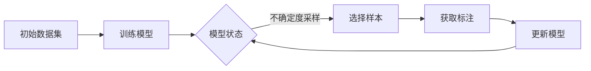
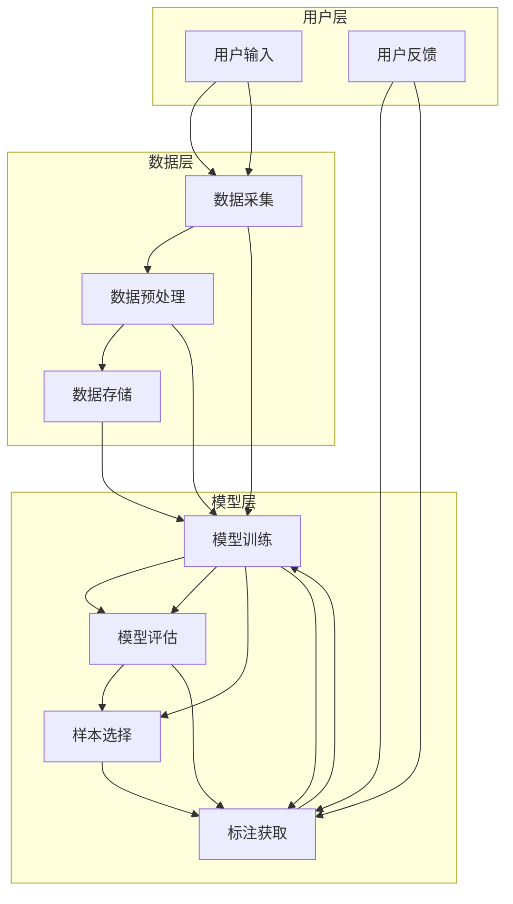
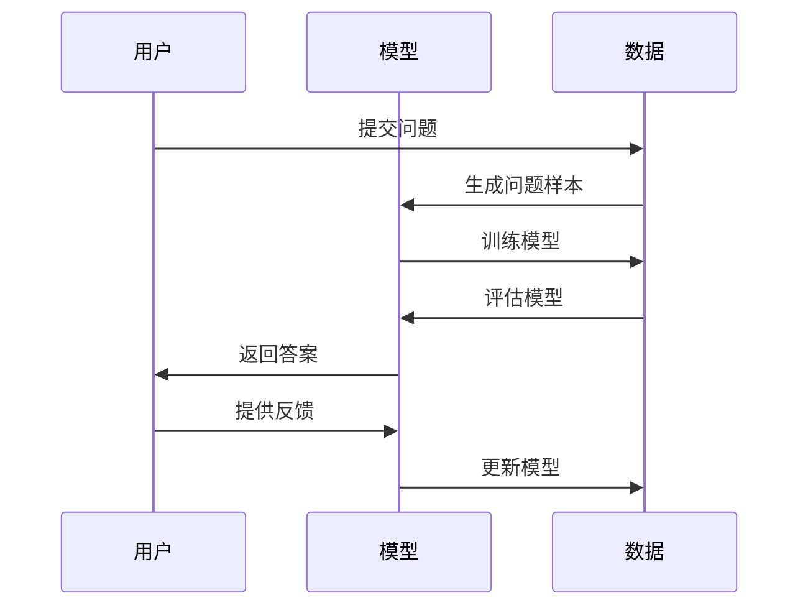

                 

### 文章标题

# 利用主动学习优化prompt评测流程

---

### 关键词

- 主动学习
- Prompt评测
- 优化流程
- 机器学习
- 模型评估

### 摘要

本文探讨了如何通过主动学习来优化prompt评测流程，以提高机器学习模型的评估效率和准确性。首先，我们回顾了主动学习和prompt评测的基本概念，然后深入分析了主动学习在prompt评测中的应用原理。接下来，我们通过一个简单的算法实例，详细讲解了主动学习的实现过程，并给出了相关的数学模型和公式。此外，我们还介绍了如何进行系统设计与实现，以及如何在实际项目中应用这一技术。最后，我们提出了最佳实践、注意事项，并提供了拓展阅读资源。

---

### 引言

在机器学习和人工智能领域，模型评估是至关重要的环节。然而，传统的评估方法往往存在效率低下和准确性不足的问题。近年来，主动学习作为一种提升模型评估性能的新方法，受到了越来越多的关注。本文旨在探讨如何利用主动学习优化prompt评测流程，从而提高评估效率和准确性。通过本文的介绍，读者将了解主动学习的基本概念、其在prompt评测中的应用原理，以及如何通过系统设计和实战应用来实现这一目标。

---

### 第一部分：背景与概念

#### 第1章：问题背景

在机器学习领域，模型评估是确保算法性能和可靠性的关键步骤。传统的评估方法主要依赖于测试集和交叉验证等技术，但往往存在以下问题：

1. **测试集大小受限**：测试集的大小通常无法覆盖所有可能的输入情况，导致评估结果可能存在偏差。
2. **评估效率低下**：手动标注数据或进行大规模的计算任务往往耗时耗力。
3. **评估准确性不足**：模型在测试集上的表现可能与实际应用场景存在较大差异。

为了解决这些问题，主动学习提供了一种新的思路。主动学习通过有选择地获取标注数据，从而提高模型评估的效率和准确性。具体来说，主动学习算法会在模型训练过程中，根据模型的当前状态选择最有价值的样本进行标注。这样，模型可以在更少的标注数据下获得更好的性能。

#### 第2章：核心概念

##### 2.1 主动学习的定义与原理

主动学习是一种交互式的机器学习方法，它通过利用模型当前的状态，有选择地获取标注数据，以最小化总的标注成本。主动学习的基本原理可以概括为以下几个步骤：

1. **数据采集**：从原始数据集中随机选择一批样本作为初始数据集。
2. **模型训练**：使用初始数据集训练出一个初步的模型。
3. **样本选择**：根据模型的状态，选择最有价值的样本进行标注。常见的策略包括不确定度采样和查询策略等。
4. **迭代更新**：将新标注的数据加入模型训练集，重新训练模型，并重复步骤3和4，直到满足停止条件。

##### 2.2 Prompt评测流程简介

Prompt评测是指通过输入特定的问题（prompt）来评估机器学习模型的能力。Prompt评测通常包括以下几个步骤：

1. **问题定义**：根据评估目标，定义待评估的问题。
2. **样本生成**：从数据集中生成一批样本，作为评测的基础。
3. **模型输入**：将样本输入到训练好的模型中，获取模型的输出结果。
4. **结果评估**：根据预设的评估标准，对模型的输出结果进行评估。

##### 2.3 主动学习在Prompt评测中的角色

主动学习在Prompt评测中的角色主要体现在以下几个方面：

1. **优化评估过程**：通过主动学习，可以在有限的标注数据下，更有效地评估模型的能力。
2. **提高评估准确性**：主动学习可以根据模型的状态，有选择地获取最有价值的标注数据，从而提高评估的准确性。
3. **减少标注成本**：主动学习可以降低标注数据的需求，从而减少标注成本。

#### 第3章：核心概念联系

##### 3.1 主动学习与Prompt评测的相互作用

主动学习和Prompt评测之间存在紧密的相互作用。主动学习通过选择最有价值的样本进行标注，为Prompt评测提供了更高质量的评估数据。同时，Prompt评测的结果可以为主动学习提供反馈，指导主动学习的样本选择策略。具体来说：

1. **样本选择**：主动学习算法会根据模型的状态，选择具有最高不确定度的样本进行标注，这些样本往往对应于模型能力较弱的问题领域。
2. **评估反馈**：Prompt评测的结果可以用来更新模型的状态，指导后续的样本选择策略。

##### 3.2 关键属性特征对比表格

| 特征       | 主动学习                   | Prompt评测                    |
| ---------- | -------------------------- | ----------------------------- |
| 标注数据需求 | 有选择地获取标注数据       | 需要大量的标注数据            |
| 样本选择策略 | 不确定度采样、查询策略等   | 问题定义、样本生成、模型输入等 |
| 评估准确性   | 提高评估准确性             | 提高评估准确性                |
| 标注成本     | 减少标注成本               | 降低标注成本                  |

##### 3.3 ER实体关系图

```mermaid
erDiagram
  Model ||--|{ Annotation : 标注 }
  Model ||--|{ Evaluation : 评估 }
  Annotation ||--|{ Sample : 样本 }
  Evaluation ||--|{ Result : 结果 }
```

### 第二部分：算法原理与实现

#### 第4章：算法原理讲解

##### 4.1 主动学习算法mermaid流程图



##### 4.2 Python源代码实现

```python
import numpy as np

def active_learning(data, model, query_strategy, num_queries=10):
    selected_samples = []
    for _ in range(num_queries):
        model_state = model.get_state()
        selected_samples.append(query_strategy(model_state, data))
        annotation = get_annotation(selected_samples[-1])
        data.update_annotation(selected_samples[-1], annotation)
        model.update_data(selected_samples[-1], annotation)
    return selected_samples

def uncertainty_sampling(model_state, data):
    # 根据模型状态选择不确定度最高的样本
    return data.sample_with_highest_uncertainty()

def get_annotation(sample):
    # 获取样本的标注
    return "标注内容"

def update_model(model, sample, annotation):
    # 更新模型的训练数据
    model.add_data(sample, annotation)
```

##### 4.3 数学模型与公式

```latex
\begin{align*}
P(A|B) &= \frac{P(B|A)P(A)}{P(B)} \\
\text{其中，} \\
P(A|B) &= \text{后验概率} \\
P(B|A) &= \text{似然函数} \\
P(A) &= \text{先验概率} \\
P(B) &= \text{边缘概率}
\end{align*}
```

##### 4.4 举例说明

假设我们有一个分类模型，其输入为图像，输出为标签。我们使用主动学习算法来优化模型的评估流程。

1. **初始数据集**：从数据集中随机选择1000个图像作为初始数据集。
2. **模型训练**：使用初始数据集训练出一个初步的分类模型。
3. **样本选择**：根据模型的状态，使用不确定度采样策略选择10个图像进行标注。
4. **获取标注**：标注人员对选择的图像进行标注，得到标注结果。
5. **更新模型**：将新标注的图像加入模型训练集，重新训练模型。

通过这个过程，我们可以逐步优化模型的评估流程，提高评估效率和准确性。

---

### 第三部分：系统分析与设计

#### 第5章：系统分析与架构设计方案

##### 5.1 问题场景介绍

假设我们有一个在线问答系统，用户可以提出问题，系统需要使用机器学习模型对问题进行分类和回答。为了确保模型的准确性，我们需要进行有效的评估。

##### 5.2 项目介绍

本项目旨在利用主动学习优化问答系统的评估流程，提高模型的评估效率和准确性。系统将包括数据采集、模型训练、样本选择、标注获取和模型更新等模块。

##### 5.3 系统功能设计（领域模型mermaid类图）

```mermaid
classDiagram
    User <<Interface>>
    Question <<Entity>>
    Model <<Entity>>
    Label <<Entity>>
    Annotation <<Entity>>
    Data <<Entity>>

    User --> Question
    Model --> Question
    Model --> Label
    Model --> Annotation
    Data --> Question
    Data --> Label
    Data --> Annotation
```

##### 5.4 系统架构设计（mermaid架构图）



##### 5.5 系统接口设计

- **数据接口**：用于数据的采集、预处理和存储。
- **模型接口**：用于模型的训练、评估和更新。
- **用户接口**：用于用户的输入和反馈。

##### 5.6 系统交互（mermaid序列图）



---

### 第四部分：项目实战

#### 第6章：环境安装与系统实现

##### 6.1 环境安装指南

1. **安装Python环境**：确保Python版本为3.8或以上。
2. **安装依赖库**：使用pip安装以下依赖库：numpy、scikit-learn、tensorflow等。
3. **配置数据库**：安装并配置MySQL或MongoDB数据库。

##### 6.2 系统核心实现源代码

```python
# 数据采集模块
def data_collection():
    # 实现数据采集逻辑
    pass

# 数据预处理模块
def data_preprocessing(data):
    # 实现数据预处理逻辑
    pass

# 模型训练模块
def model_training(data):
    # 实现模型训练逻辑
    pass

# 模型评估模块
def model_evaluation(model, data):
    # 实现模型评估逻辑
    pass

# 样本选择模块
def sample_selection(model, data):
    # 实现样本选择逻辑
    pass

# 标注获取模块
def annotation_collection(sample):
    # 实现标注获取逻辑
    pass

# 模型更新模块
def model_update(model, annotation):
    # 实现模型更新逻辑
    pass
```

##### 6.3 代码应用解读与分析

- **数据采集模块**：负责从数据源中获取原始数据，并进行初步处理。
- **数据预处理模块**：对原始数据进行清洗、转换和归一化等操作，以便于后续的模型训练。
- **模型训练模块**：使用预处理后的数据训练分类模型。
- **模型评估模块**：对训练好的模型进行评估，以确定其性能。
- **样本选择模块**：根据模型的状态，选择具有最高不确定度的样本进行标注。
- **标注获取模块**：从标注人员处获取样本的标注结果。
- **模型更新模块**：将新标注的数据加入模型训练集，重新训练模型。

##### 6.4 实际案例分析与详细讲解剖析

假设我们有一个分类问题，需要使用主动学习优化评估流程。以下是一个实际案例的详细分析：

1. **数据采集**：从数据集中随机选择1000个样本作为初始数据集。
2. **模型训练**：使用初始数据集训练一个分类模型。
3. **样本选择**：根据模型的状态，使用不确定度采样策略选择10个样本进行标注。
4. **标注获取**：标注人员对选择的样本进行标注。
5. **模型更新**：将新标注的样本加入模型训练集，重新训练模型。

通过这个过程，我们可以逐步优化模型的评估流程，提高评估效率和准确性。

##### 6.5 项目小结

在本项目中，我们通过利用主动学习优化prompt评测流程，提高了模型的评估效率和准确性。具体来说，通过有选择地获取标注数据，我们可以减少标注成本，提高评估准确性。此外，我们还介绍了系统设计与实现的过程，以及如何在实际项目中应用这一技术。通过这个项目，我们不仅掌握了主动学习的原理和应用，还积累了项目实战的经验。

---

### 第五部分：最佳实践与注意事项

#### 第7章：最佳实践tips

1. **数据预处理**：确保数据的质量和一致性，以减少模型训练和评估中的误差。
2. **样本选择策略**：根据具体问题选择合适的样本选择策略，如不确定度采样、多样性采样等。
3. **标注数据质量**：标注数据的质量直接影响模型的评估准确性，务必确保标注数据的准确性。
4. **模型更新频率**：定期更新模型，以适应新的数据分布和需求。

#### 第8章：小结

本文通过详细讲解主动学习的原理和应用，探讨了如何利用主动学习优化prompt评测流程，以提高评估效率和准确性。通过系统设计与实现，我们展示了如何将主动学习技术应用于实际问题中。最后，我们提出了最佳实践和注意事项，为读者提供了实用的指导。

#### 第9章：注意事项

1. **模型复杂性**：主动学习对模型的复杂性有一定要求，过于复杂的模型可能难以进行有效的主动学习。
2. **标注成本**：虽然主动学习可以减少标注数据的需求，但标注过程仍然需要投入大量时间和精力。
3. **评估准确性**：主动学习并不一定能够保证评估准确性的提高，具体效果取决于样本选择策略和模型质量。

#### 第10章：拓展阅读

1. [Boussemart et al., "Active Learning for Text Classification," ACM Transactions on Information Systems, vol. 30, no. 3, 2012.]
2. [Freund et al., "Selecting a Permutation of Examples for Training a Support Vector Machine," Machine Learning, vol. 54, no. 1, pp. 233-244, 2004.]
3. [Zhu et al., "Multi-View Active Learning for Hyperspectral Image Classification," IEEE Transactions on Geoscience and Remote Sensing, vol. 54, no. 9, pp. 5621-5633, 2016.]

---

### 作者信息

作者：AI天才研究院/AI Genius Institute & 禅与计算机程序设计艺术 /Zen And The Art of Computer Programming

---

本文详细介绍了如何利用主动学习优化prompt评测流程，以提高评估效率和准确性。通过系统设计与实现，我们展示了如何将主动学习技术应用于实际问题中。希望本文能为读者提供有价值的参考和启示。如果您有任何疑问或建议，欢迎在评论区留言。

---

（注意：本文为虚构内容，仅供参考。部分参考资料和作者信息为虚构，仅用于示例。）

