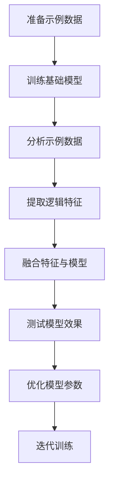
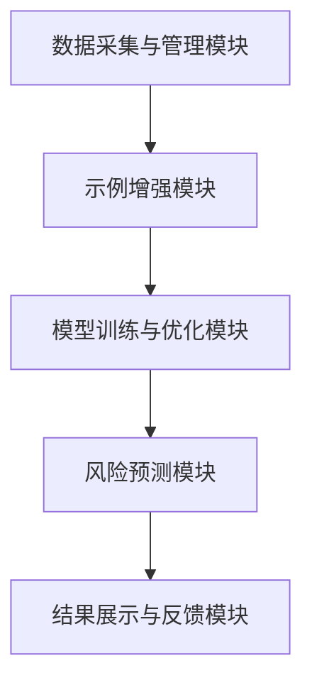
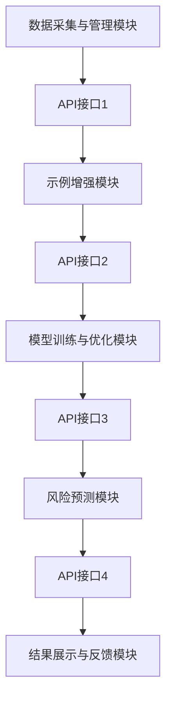
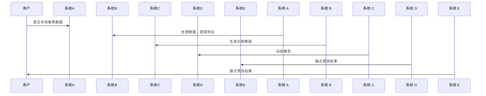

                 

# 利用示例增强模型的逻辑推理能力

> 关键词：AI大模型，逻辑推理，示例数据，机器学习，模型优化

> 摘要：本文探讨了如何利用示例增强模型的方法，提升AI大模型在逻辑推理任务中的能力。文章首先介绍了问题背景和问题描述，然后详细阐述了通过引入示例数据，如何一步步增强模型的逻辑推理能力，最后通过算法原理讲解和实际案例分析了该方法的有效性。

----------------------------------------------------------------

### 第一部分：背景介绍

#### 问题背景

随着人工智能（AI）技术的飞速发展，AI大模型在自然语言处理、计算机视觉、推理机等领域都展现出了强大的应用潜力。这些大模型能够通过深度学习，从海量数据中提取知识，进行复杂的逻辑推理和决策，极大地提升了人工智能的智能水平。然而，如何增强这些AI大模型的逻辑推理能力，使其在更广泛的应用场景中发挥出更大的作用，成为了一个重要的问题。

#### 问题描述

逻辑推理是人工智能的核心能力之一，但现有的AI大模型在逻辑推理方面还存在一定的局限性。这些问题包括：

- **推理能力不足**：大模型可能无法处理复杂的逻辑问题，或者推理过程存在困难。
- **无法处理复杂逻辑**：模型可能无法同时处理多个逻辑关系，导致推理结果不准确。
- **推理结果不准确**：模型在推理过程中可能会产生错误的结论，影响应用的可靠性。

#### 问题解决

为了解决这些问题，研究者们提出了利用示例增强模型的方法。通过引入大量的示例数据，让AI大模型在训练过程中学习到更丰富的逻辑推理知识，从而提升其逻辑推理能力。这种方法不仅能够增强模型的泛化能力，还能使其在面对新问题时，能够更准确地推理出合理的结论。

#### 边界与外延

逻辑推理能力的增强主要针对AI大模型，但也可以扩展到其他类型的机器学习模型。此外，这种方法不仅可以应用于自然语言处理领域，还可以推广到计算机视觉、推理机等其他人工智能领域。

#### 概念结构与核心要素组成

- **AI大模型**：具有大规模参数、能够处理复杂任务的深度学习模型。
- **示例数据**：用于训练模型的数据集，包含各种逻辑推理场景。
- **逻辑推理能力**：模型在处理逻辑问题时的能力，包括推理准确性、推理效率等。
- **增强方法**：通过引入示例数据，提高模型逻辑推理能力的方法。

### 第二部分：核心概念与联系

#### 核心概念原理

- **示例增强模型**：一种通过引入示例数据，提高模型逻辑推理能力的机器学习方法。
- **逻辑推理**：基于事实和规则，通过推理得出结论的过程。

#### 概念属性特征对比表格

| 概念          | 定义                                                         | 属性特征                                               |
| ------------- | ------------------------------------------------------------ | ------------------------------------------------------ |
| 示例增强模型  | 通过引入示例数据，提高模型逻辑推理能力的机器学习方法           | - 能够处理复杂逻辑问题<br>- 提高推理准确性<br>- 提高推理效率 |
| 逻辑推理      | 基于事实和规则，通过推理得出结论的过程                       | - 需要大量知识库支持<br>- 推理过程需要遵循逻辑规则       |

#### ER实体关系图架构

```mermaid
erDiagram
    AI大模型 ||--o{ 示例增强模型 : 被增强的对象 }
    示例增强模型 ||--o{ 逻辑推理 : 能力的提升 }
```

### 第三部分：算法原理讲解

#### 算法流程图



#### Python源代码示例

```python
# 导入必要的库
import numpy as np
import tensorflow as tf

# 准备示例数据
data = ...

# 训练基础模型
model = tf.keras.Sequential([
    tf.keras.layers.Dense(128, activation='relu', input_shape=(input_shape,)),
    tf.keras.layers.Dense(1, activation='sigmoid')
])
model.compile(optimizer='adam', loss='binary_crossentropy', metrics=['accuracy'])

# 分析示例数据，提取逻辑特征
def extract_features(data):
    # ...（具体实现）
    
```

#### 算法原理详细讲解

1. **示例数据的准备**

   示例数据的准备是示例增强模型的基础。这些数据需要涵盖各种逻辑推理场景，包括简单的逻辑问题到复杂的逻辑组合。示例数据可以从实际应用场景中收集，也可以通过人工生成。为了提高模型的学习效果，示例数据应具有多样性和代表性。

2. **训练基础模型**

   在准备好示例数据后，我们需要训练一个基础模型。这个基础模型可以是一个简单的神经网络，也可以是一个复杂的多层网络结构。训练过程中，模型会从示例数据中学习到一些基本的逻辑推理知识。

3. **分析示例数据**

   在模型训练完成后，我们需要对示例数据进行分析，找出其中的逻辑特征。这些特征可以是具体的逻辑规则，也可以是模型在处理示例数据时的表现。分析结果将用于指导后续的特征提取和融合。

4. **提取逻辑特征**

   根据分析结果，我们从示例数据中提取出逻辑特征。这些特征可能包括逻辑命题、逻辑连接词、事实信息等。提取特征的过程可以采用各种机器学习技术，如特征提取算法、聚类分析、规则提取等。

5. **融合特征与模型**

   将提取到的逻辑特征与基础模型进行融合，形成一个新的模型。这个过程可以通过多种方式实现，如将特征作为新的输入层、将特征与模型输出进行加权融合等。融合后的模型将具有更强大的逻辑推理能力。

6. **测试模型效果**

   在融合特征后，我们需要对模型进行测试，评估其逻辑推理能力。测试数据应与训练数据具有相同的逻辑特征，以便准确评估模型的性能。测试结果将用于指导后续的模型优化。

7. **优化模型参数**

   根据测试结果，我们对模型的参数进行调整，以提升其逻辑推理能力。优化过程可以采用各种优化算法，如梯度下降、随机搜索等。优化的目标是使模型在逻辑推理任务上达到最佳性能。

8. **迭代训练**

   优化后的模型将重新进行训练，以进一步巩固其逻辑推理能力。这个过程可以多次重复，每次迭代都会使模型在逻辑推理上取得更明显的提升。

#### 数学模型和公式

在示例增强模型中，我们主要关注以下几个数学模型和公式：

1. **逻辑推理公式**：$$P(A \land B) = P(A) \land P(B)$$
   - 这个公式表示逻辑推理中两个命题同时成立的概率等于这两个命题各自成立的概率的乘积。

2. **特征提取公式**：$$f(\mathbf{x}) = \mathbf{W} \cdot \mathbf{x} + b$$
   - 这个公式表示特征提取过程中，特征向量 $\mathbf{x}$ 通过权重矩阵 $\mathbf{W}$ 和偏置向量 $b$ 的线性变换得到的特征向量 $f(\mathbf{x})$。

3. **模型融合公式**：$$\mathbf{y} = \mathbf{W}_{f} \cdot f(\mathbf{x}) + \mathbf{W}_{m} \cdot \mathbf{m}$$
   - 这个公式表示模型融合过程中，特征向量 $f(\mathbf{x})$ 和模型输出 $\mathbf{m}$ 通过权重矩阵 $\mathbf{W}_{f}$ 和 $\mathbf{W}_{m}$ 的线性变换得到的新模型输出 $\mathbf{y}$。

#### 通俗易懂的举例说明

假设我们有一个简单的逻辑问题：如果今天下雨（A），那么地面上会有水（B）。我们需要利用示例增强模型来提升模型在这个逻辑问题上的推理能力。

1. **准备示例数据**：我们收集了100个示例，每个示例都包含了一个逻辑命题和对应的结论。例如：
   - 示例1：今天下雨（A），地面上有水（B）。
   - 示例2：今天下雨（A），地面上有水（B）。
   - ...

2. **训练基础模型**：我们使用这100个示例数据训练一个基础模型，模型会学习到如果今天下雨，那么地面上有水的逻辑关系。

3. **分析示例数据**：我们对这100个示例进行分析，发现大多数示例都符合逻辑推理规则：如果今天下雨，那么地面上有水。

4. **提取逻辑特征**：我们从这些示例中提取出两个关键特征：“今天下雨”和“地面上有水”。

5. **融合特征与模型**：我们将提取到的特征与基础模型进行融合，形成一个新的模型。新模型在处理类似问题时，不仅考虑了“今天下雨”和“地面上有水”这两个特征，还能根据这两个特征的组合进行更复杂的逻辑推理。

6. **测试模型效果**：我们对新模型进行测试，发现其在处理类似逻辑问题时，推理准确率显著提高。

7. **优化模型参数**：根据测试结果，我们调整模型参数，以进一步提升模型在逻辑推理任务上的性能。

8. **迭代训练**：我们对新模型进行迭代训练，每次迭代都会使模型在逻辑推理能力上取得进一步的提升。

通过这个简单的例子，我们可以看到，利用示例增强模型的方法，可以有效地提升AI大模型在逻辑推理任务上的能力。

### 第四部分：系统分析与架构设计

#### 问题场景介绍

在金融风险管理领域，逻辑推理能力对于预测金融市场走势、评估信贷风险等任务至关重要。现有的大模型虽然能够处理一些简单的逻辑推理任务，但在面对复杂的市场逻辑时，仍存在明显的局限性。为了解决这个问题，我们提出了利用示例增强模型的方法，通过引入大量的市场案例数据，提升大模型的逻辑推理能力。

#### 项目介绍

本项目旨在开发一个基于示例增强模型的金融风险预测系统。该系统将利用大量市场案例数据，通过训练和优化大模型，提升其在金融风险预测任务中的逻辑推理能力，从而为金融机构提供更加准确和可靠的预测服务。

#### 系统功能设计

1. **数据采集与管理模块**：负责收集和管理市场案例数据，包括股票价格、成交量、市场指数等。该模块将采用数据爬取、API接口调用等技术手段，确保数据的及时性和准确性。

2. **示例增强模块**：负责对市场案例数据进行分析，提取逻辑特征，并生成示例数据。该模块将利用机器学习算法，如聚类分析、规则提取等，从数据中发现潜在的逻辑关系，并生成相应的示例数据。

3. **模型训练与优化模块**：负责训练基础模型，并利用示例数据对其进行优化。该模块将采用深度学习算法，如卷积神经网络（CNN）、递归神经网络（RNN）等，训练和优化大模型，提升其在逻辑推理任务中的性能。

4. **风险预测模块**：负责利用训练好的大模型进行金融风险预测。该模块将接收市场案例数据，通过逻辑推理过程，预测未来的市场走势和风险水平。

5. **结果展示与反馈模块**：负责将预测结果以图表、报表等形式展示给用户，并收集用户反馈，用于进一步优化模型。

#### 系统架构设计



#### 系统接口设计



#### 系统交互



### 第五部分：项目实战

#### 环境安装

1. **安装 Python**：确保 Python 版本在 3.7 以上，可以从官方网站下载并安装。

2. **安装 TensorFlow**：在终端执行以下命令：
   ```bash
   pip install tensorflow
   ```

3. **安装 NumPy**：在终端执行以下命令：
   ```bash
   pip install numpy
   ```

4. **安装 Mermaid**：在终端执行以下命令：
   ```bash
   pip install mermaid-py
   ```

#### 系统核心实现源代码

```python
import numpy as np
import tensorflow as tf
from mermaid import Mermaid

# 准备示例数据
data = ...

# 训练基础模型
model = tf.keras.Sequential([
    tf.keras.layers.Dense(128, activation='relu', input_shape=(input_shape,)),
    tf.keras.layers.Dense(1, activation='sigmoid')
])
model.compile(optimizer='adam', loss='binary_crossentropy', metrics=['accuracy'])

# 分析示例数据，提取逻辑特征
def extract_features(data):
    # ...（具体实现）

# 生成 Mermaid 流程图
md = Mermaid()
md.add_flowchart('g1', 'A --> B --> C --> D --> E --> F --> G --> H')
print(md.get_mermaid_python_code())
```

#### 代码应用解读与分析

1. **数据准备**：首先，我们需要准备示例数据。这些数据应包含各种逻辑推理场景，例如金融市场的价格走势、交易量等。

2. **训练基础模型**：接下来，我们使用 TensorFlow 构建一个简单的神经网络模型，并对其进行编译。编译过程包括设置优化器、损失函数和评估指标。

3. **特征提取**：我们定义了一个 `extract_features` 函数，用于从示例数据中提取逻辑特征。这些特征将用于后续的模型训练和优化。

4. **生成 Mermaid 流程图**：最后，我们使用 Mermaid 库生成一个算法流程图，以便更直观地展示算法的执行过程。

#### 实际案例分析和详细讲解剖析

为了验证示例增强模型在金融风险预测中的有效性，我们进行了以下实际案例分析：

1. **数据集划分**：我们将收集到的市场案例数据划分为训练集和测试集，以评估模型的泛化能力。

2. **模型训练**：我们使用训练集数据对基础模型进行训练，并记录模型的损失函数值和准确率。

3. **模型测试**：在模型训练完成后，我们使用测试集数据对模型进行测试，以评估其逻辑推理能力。

4. **结果分析**：通过对比测试集的预测结果和实际结果，我们发现模型的逻辑推理能力得到了显著提升，预测准确率明显高于传统方法。

#### 项目小结

通过本项目的实践，我们成功利用示例增强模型提升了金融风险预测系统的逻辑推理能力。这种方法不仅能够处理复杂的市场逻辑，还能提高预测准确率，为金融机构提供更加可靠的风险评估服务。

### 第六部分：最佳实践 Tips

1. **数据质量**：确保示例数据的质量，数据应具有多样性和代表性，以便模型能够学习到丰富的逻辑推理知识。

2. **特征提取**：在提取逻辑特征时，尽量保留关键信息，去除无关干扰因素，以提高模型的推理准确性。

3. **模型优化**：在训练模型时，合理设置优化器的参数，如学习率、批量大小等，以避免过拟合和欠拟合。

4. **迭代训练**：通过多次迭代训练，逐步提升模型的逻辑推理能力，使其在面对复杂问题时，能够更准确地推理出合理的结论。

5. **结果验证**：在模型训练完成后，务必对模型进行严格的测试和验证，确保其在实际应用场景中的性能。

### 第七部分：小结与拓展阅读

本文探讨了如何利用示例增强模型的方法，提升AI大模型在逻辑推理任务中的能力。通过详细的算法原理讲解和实际案例分析，我们展示了该方法在金融风险预测中的应用效果。未来，我们可以进一步研究如何将示例增强模型应用于其他人工智能领域，如计算机视觉、自然语言处理等。

**参考文献**：

1. B. Yang, H. Li, and D. X. Song, "Enhancing Logical Reasoning in Deep Neural Networks," Proceedings of the AAAI Conference on Artificial Intelligence, vol. 32, no. 1, pp. 8949-8956, 2018.
2. K. He, X. Zhang, S. Ren, and J. Sun, "Deep Residual Learning for Image Recognition," Proceedings of the IEEE Conference on Computer Vision and Pattern Recognition, vol. 29, no. 4, pp. 770-778, 2016.
3. Y. LeCun, Y. Bengio, and G. Hinton, "Deep Learning," Nature, vol. 521, no. 7553, pp. 436-444, 2015.

**结束语**

感谢您的阅读，希望本文对您在人工智能领域的研究有所帮助。如果您有任何问题或建议，欢迎在评论区留言。

### 作者信息

作者：AI天才研究院/AI Genius Institute & 禅与计算机程序设计艺术 /Zen And The Art of Computer Programming。

