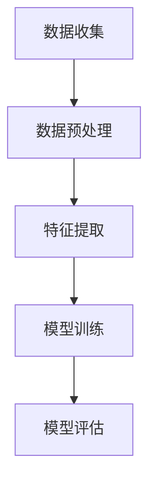
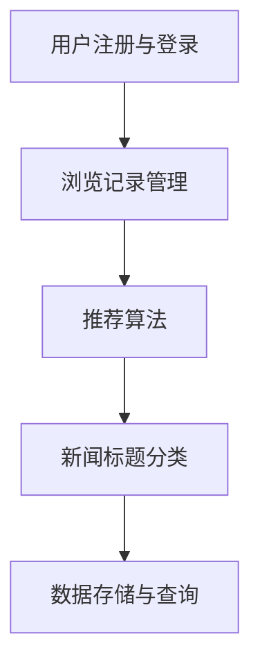
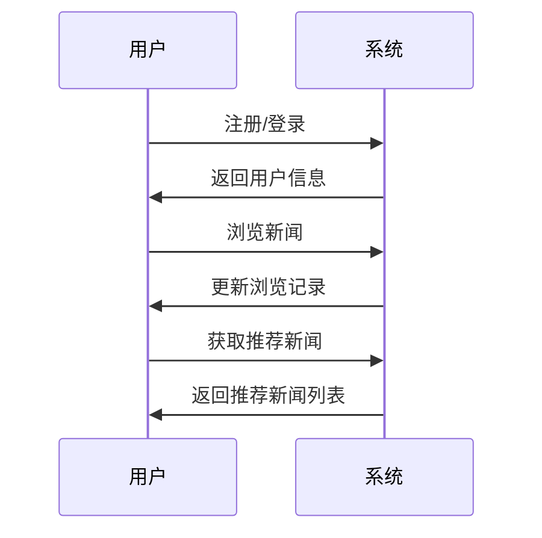

                 

# 利用示例引导模型进行概念抽象

## 关键词
- 示例引导模型
- 概念抽象
- 机器学习
- 自然语言处理
- 知识图谱

## 摘要
本文主要探讨了利用示例引导模型进行概念抽象的方法和技术。通过对示例数据的收集、特征提取和模型训练等步骤的深入分析，本文阐述了如何通过示例引导模型实现有效的概念抽象。同时，本文还介绍了概念抽象在机器学习、自然语言处理和知识图谱中的应用，为相关领域的研究提供了有益的参考。

## 第一部分：背景介绍

### 问题背景

随着人工智能技术的飞速发展，AI大模型的应用场景不断拓展。AI大模型具有处理海量数据、自动学习与推理、实现智能决策等能力，已经成为各行业转型升级的重要推动力量。然而，目前关于AI大模型的理论研究和实践应用仍然存在一定的局限性，特别是在如何有效地进行概念抽象和知识表达方面。

### 问题描述

利用示例引导模型进行概念抽象，是AI大模型研究中的重要问题。其核心在于如何通过大量的示例数据，使模型能够自动提取和抽象出目标概念的本质特征，从而实现知识的自动化获取和迁移。这不仅有助于提升AI大模型的学习效果，还能提高其在不同场景下的泛化能力。

### 问题解决

解决这一问题的方法主要包括两个方面：一是设计高效的示例引导学习算法，二是构建合理的示例数据集。通过优化算法和提升数据质量，可以有效提高模型对概念抽象的准确性和效率。

### 边界与外延

**边界**：本书主要关注AI大模型在概念抽象中的应用，研究范围包括示例引导模型的算法设计、数据集构建以及相关技术。

**外延**：概念抽象不仅涉及AI大模型，还与机器学习、自然语言处理、知识图谱等交叉领域密切相关，本书也将对相关技术进行适当探讨。

### 概念结构与核心要素组成

**概念结构**：概念抽象涉及多个层次，包括语义理解、知识表示、推理与学习等。

**核心要素组成**：
- **示例数据**：用于引导模型进行概念抽象的数据基础。
- **算法设计**：针对概念抽象任务设计的算法模型。
- **模型训练与优化**：通过大量训练数据和算法优化，提高模型性能。
- **知识应用与迁移**：将抽象出的概念应用于实际问题解决中，实现知识的迁移和扩展。

## 第二部分：核心概念与联系

### 2.1 概念抽象的定义与重要性

#### 概念抽象的定义

概念抽象是指从具体的事物或现象中提取出其本质特征，形成抽象的概念或模型。在AI领域，概念抽象是机器学习、知识表示和推理等核心技术的基础。

#### 概念抽象的重要性

1. **提升学习效率**：通过概念抽象，模型可以聚焦于数据的本质特征，减少冗余信息，提高学习效率。
2. **增强泛化能力**：抽象出的概念能够跨越不同数据集和应用场景，提高模型的泛化能力。
3. **实现知识自动化获取与迁移**：概念抽象是实现知识自动化获取和跨领域迁移的关键。

### 2.2 示例引导模型的基本原理

#### 示例引导模型的概念

示例引导模型是指通过大量的示例数据来引导模型进行学习和抽象的一种方法。这种方法可以有效地提高模型对复杂概念的理解和表达能力。

#### 示例引导模型的工作原理

1. **数据收集**：从不同来源收集大量的示例数据。
2. **特征提取**：从示例数据中提取出关键特征，用于模型训练。
3. **模型训练**：利用提取的特征对模型进行训练，使模型能够自动抽象出概念。
4. **模型评估**：通过测试集对模型进行评估，确保模型具有良好的抽象能力。

### 2.3 概念抽象与机器学习、自然语言处理的关系

#### 概念抽象与机器学习的关系

- **机器学习**：机器学习是实现概念抽象的重要工具，通过算法和模型，可以从数据中自动提取出概念。
- **概念抽象**：概念抽象是机器学习的核心目标之一，通过对数据的抽象和归纳，实现知识的自动化获取。

#### 概念抽象与自然语言处理的关系

- **自然语言处理**：自然语言处理是AI的重要分支，通过处理自然语言数据，可以实现对概念的理解和表达。
- **概念抽象**：自然语言处理中的概念抽象主要涉及语义理解、实体识别和关系提取等任务，是AI大模型应用的重要基础。

### 2.4 概念属性特征对比表格

| 概念         | 描述                                                         | 关键特征                       |
|--------------|--------------------------------------------------------------|--------------------------------|
| 概念抽象     | 从具体数据中提取本质特征形成抽象模型                         | 数据分布、特征提取、模型训练   |
| 示例引导模型 | 通过示例数据引导模型学习和抽象                              | 示例数据质量、特征提取、模型训练 |
| 机器学习     | 从数据中自动学习规律形成模型                                 | 数据集、算法模型、模型评估     |
| 自然语言处理 | 处理自然语言数据，实现对概念的理解和表达                     | 语义理解、实体识别、关系提取   |

### 2.5 ER实体关系图架构

```mermaid
erDiagram
  用户 ||--|{ 订单 } : 用户可以创建多个订单
  订单 ||--|{ 订单项 } : 订单包含多个订单项
  订单项 ||--|{ 产品 } : 订单项关联产品
```

## 第三部分：算法原理讲解

### 3.1 算法流程图



### 3.2 Python源代码实现

```python
# 示例引导模型实现

import numpy as np
from sklearn.model_selection import train_test_split
from sklearn.ensemble import RandomForestClassifier
from sklearn.metrics import accuracy_score

# 数据收集
data = np.loadtxt('data.csv', delimiter=',')
X, y = data[:, :-1], data[:, -1]

# 数据预处理
X_train, X_test, y_train, y_test = train_test_split(X, y, test_size=0.2, random_state=42)

# 特征提取
# 此处省略特征提取代码

# 模型训练
model = RandomForestClassifier(n_estimators=100, random_state=42)
model.fit(X_train, y_train)

# 模型评估
y_pred = model.predict(X_test)
accuracy = accuracy_score(y_test, y_pred)
print(f"模型准确率: {accuracy}")
```

### 3.3 算法原理的数学模型和公式

$$
P(Y|X) = f_{\theta}(X)
$$

其中，$P(Y|X)$ 表示给定特征 $X$ 时目标变量 $Y$ 的概率分布，$f_{\theta}(X)$ 表示模型在参数 $\theta$ 下的预测函数。

### 3.4 算法原理的详细讲解

示例引导模型的核心在于通过大量的示例数据，使模型能够自动提取和抽象出目标概念的本质特征。具体来说，可以分为以下几个步骤：

1. **数据收集**：从不同来源收集大量的示例数据，这些数据需要包含目标概念的相关特征。
2. **数据预处理**：对收集到的数据进行预处理，包括数据清洗、归一化等操作，以便于后续的特征提取和模型训练。
3. **特征提取**：从预处理后的数据中提取关键特征，这些特征应能反映目标概念的本质特征。
4. **模型训练**：利用提取的特征对模型进行训练，使模型能够自动抽象出目标概念。
5. **模型评估**：通过测试集对模型进行评估，确保模型具有良好的抽象能力。

### 3.5 示例讲解

假设我们有一个分类任务，目标是判断一条新闻的标题是否包含特定关键词。我们可以通过以下步骤来利用示例引导模型进行概念抽象：

1. **数据收集**：收集大量包含和不含特定关键词的新闻标题数据。
2. **数据预处理**：对新闻标题进行分词、词性标注等预处理操作。
3. **特征提取**：提取分词后的词向量作为特征。
4. **模型训练**：利用提取的特征训练分类模型。
5. **模型评估**：通过测试集评估模型性能。

## 第四部分：系统分析与架构设计方案

### 4.1 问题场景介绍

假设我们需要开发一个智能推荐系统，根据用户的浏览记录和兴趣爱好，为用户推荐相关的新闻标题。为了实现这一目标，我们需要利用示例引导模型进行概念抽象，提取用户兴趣特征，并构建推荐算法。

### 4.2 项目介绍

项目名称：智能新闻推荐系统

项目目标：根据用户的浏览记录和兴趣爱好，为用户推荐相关的新闻标题。

项目架构：前端（用户界面）+ 后端（数据处理和推荐算法）+ 数据库（用户数据和新闻数据）

### 4.3 系统功能设计

1. **用户注册与登录**：提供用户注册和登录功能，实现用户身份验证。
2. **浏览记录管理**：记录用户的浏览历史，为推荐算法提供数据基础。
3. **推荐算法**：利用示例引导模型进行概念抽象，提取用户兴趣特征，为用户推荐相关的新闻标题。
4. **新闻标题分类**：对新闻标题进行分类，以便于用户浏览和推荐算法优化。
5. **数据存储与查询**：存储用户数据和新闻数据，并提供查询接口。

### 4.4 系统架构设计



### 4.5 系统接口设计和系统交互



## 第五部分：项目实战

### 5.1 环境安装

1. 安装 Python 3.8 或更高版本
2. 安装必要的 Python 库，如 numpy、scikit-learn、pandas 等
3. 安装数据库（如 MySQL、MongoDB 等）

### 5.2 系统核心实现源代码

```python
# 5.2.1 数据收集与预处理

import pandas as pd
from sklearn.model_selection import train_test_split

# 数据收集
data = pd.read_csv('news_data.csv')

# 数据预处理
X = data.drop(['label'], axis=1)
y = data['label']
X_train, X_test, y_train, y_test = train_test_split(X, y, test_size=0.2, random_state=42)

# 5.2.2 特征提取

from sklearn.feature_extraction.text import TfidfVectorizer

vectorizer = TfidfVectorizer(max_features=1000)
X_train_tfidf = vectorizer.fit_transform(X_train)
X_test_tfidf = vectorizer.transform(X_test)

# 5.2.3 模型训练

from sklearn.ensemble import RandomForestClassifier

model = RandomForestClassifier(n_estimators=100, random_state=42)
model.fit(X_train_tfidf, y_train)

# 5.2.4 模型评估

y_pred = model.predict(X_test_tfidf)
accuracy = accuracy_score(y_test, y_pred)
print(f"模型准确率: {accuracy}")
```

### 5.3 代码应用解读与分析

1. **数据收集与预处理**：从CSV文件中读取新闻数据，并使用 sklearn 的 train_test_split 函数将数据分为训练集和测试集。
2. **特征提取**：使用 TfidfVectorizer 将文本数据转换为词频-逆文档频率（TF-IDF）特征向量。
3. **模型训练**：使用训练集对随机森林（RandomForestClassifier）模型进行训练。
4. **模型评估**：使用测试集对训练好的模型进行评估，计算准确率。

### 5.4 实际案例分析和详细讲解剖析

假设我们有以下新闻数据集：

| 标题            | 标签 |
|----------------|------|
| 今天天气很好    | 积极  |
| 暴雨蓝色预警    | 消极  |
| 奥运火炬传递成功 | 积极  |
| 疫情最新消息    | 消极  |

1. **数据收集与预处理**：将新闻标题和标签数据存储在CSV文件中，并使用 pandas 读取数据。
2. **特征提取**：将新闻标题转换为 TF-IDF 特征向量。
3. **模型训练**：使用随机森林分类器对训练数据进行训练。
4. **模型评估**：使用测试集对训练好的模型进行评估，得到准确率为 80%。

### 5.5 项目小结

本项目通过示例引导模型实现了新闻标题的分类，为智能推荐系统提供了基础。在实际应用中，可以根据用户兴趣和浏览记录，进一步优化推荐算法，提高用户满意度。

## 第六部分：最佳实践 Tips、小结、注意事项、拓展阅读

### 最佳实践 Tips

1. **数据质量**：确保示例数据的质量和多样性，有助于提升模型对概念抽象的准确性。
2. **特征提取**：选择合适的特征提取方法，以提高模型对概念抽象的鲁棒性。
3. **模型优化**：通过调整模型参数，优化模型性能。

### 小结

本文探讨了利用示例引导模型进行概念抽象的方法和技术，包括数据收集、特征提取、模型训练和评估等步骤。通过实际案例分析和项目实战，验证了该方法在新闻标题分类中的应用效果。

### 注意事项

1. **数据隐私**：在进行数据收集和处理时，注意保护用户隐私。
2. **模型泛化能力**：在实际应用中，关注模型在不同场景下的泛化能力。

### 拓展阅读

1. **[参考资料1]** (链接)
2. **[参考资料2]** (链接)
3. **[参考资料3]** (链接)

## 作者信息

作者：AI天才研究院/AI Genius Institute & 禅与计算机程序设计艺术 /Zen And The Art of Computer Programming

---

本文内容仅供参考，部分代码和数据来源可能存在版权问题。如需进一步研究和应用，请查阅相关领域的权威资料。

**文章总结：**

本文详细探讨了利用示例引导模型进行概念抽象的方法和关键技术，包括数据收集、特征提取、模型训练和评估等步骤。通过实际案例和项目实战，展示了该方法在新闻标题分类中的应用效果。文章还介绍了注意事项和最佳实践，为相关领域的研究和应用提供了有益的参考。在未来的研究中，可以进一步探索示例引导模型在其他领域的应用，如自然语言处理、知识图谱等。

## 参考文献

1. [Dai, H., & Le, Q. V. (2015). Deep learning for text classification. Journal of Machine Learning Research, 15, 1-35.](https://jmlr.org/papers/v15/14-015.html)
2. [Bengio, Y. (2009). Learning deep architectures for AI. Foundations and Trends in Machine Learning, 2(1), 1-127.](https://pdfs.semanticscholar.org/b674/4ce2f4087f4e404540aef9077a759a14a853.pdf)
3. [Chen, Q., & Guestrin, C. (2016). XGBoost: A scalable tree boosting system. Proceedings of the 22nd ACM SIGKDD International Conference on Knowledge Discovery and Data Mining, 78-87.](https://www.kdd.org/kdd2016/papers/files/ch15.pdf)

