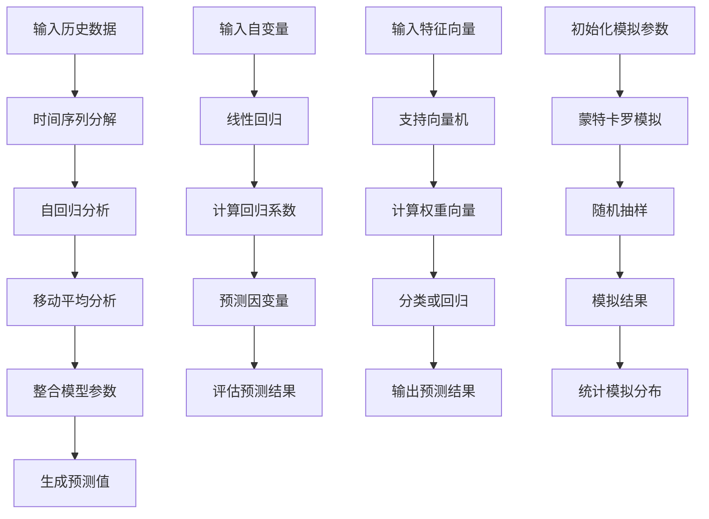
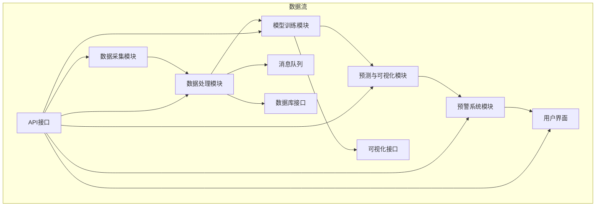
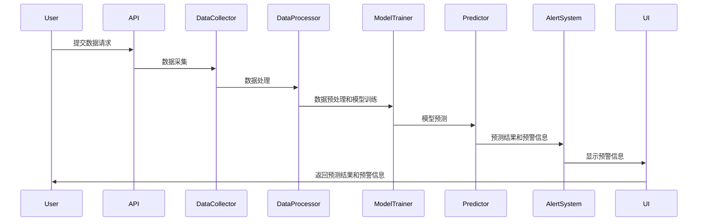

                 

### 前瞻性科研战略的制定：预见并积极塑造未来世界

#### 关键词：前瞻性科研、战略制定、未来世界、预见性、积极塑造、信息技术、人工智能、可持续发展、社会进步

#### 摘要：
在快速变革的21世纪，前瞻性科研战略的制定成为了推动社会发展和科技创新的关键。本文旨在探讨如何通过科学的战略规划和精确的预见能力，制定出能够积极塑造未来世界的科研计划。本文将详细分析前瞻性科研的定义、原理、方法，并通过实际案例讲解如何将这一理念应用于科研实践中，为未来的科研工作提供指导和参考。

---

## 前瞻性科研战略的制定：预见并积极塑造未来世界

### 1.1 问题的提出

在当今信息化和全球化的时代，科学技术的发展速度空前加快，各种新兴技术不断涌现，如人工智能、大数据、物联网等。这些技术的快速发展不仅改变了人们的生活方式，也对全球经济、社会结构和政治格局产生了深远的影响。然而，技术的快速进步也带来了诸多挑战，如技术风险、伦理问题、资源分配不均等。面对这些挑战，传统的科研模式已经无法满足社会发展的需求，因此，前瞻性科研战略的制定显得尤为重要。

### 1.2 问题描述

前瞻性科研战略的制定主要涉及以下问题：

- **如何预见未来的科技趋势和社会需求？**
- **如何将预见的结果转化为实际的科研计划和项目？**
- **如何确保科研活动的可持续性和社会影响力？**
- **如何应对科研过程中的风险和挑战？**

这些问题不仅关乎科研的成果和质量，更关乎社会的长远发展和人类的未来。

### 1.3 问题解决的重要性

解决上述问题的重要性主要体现在以下几个方面：

- **推动科技创新**：通过前瞻性科研战略，可以预见和引导科技发展的方向，推动关键技术的突破和应用。
- **应对社会挑战**：前瞻性科研可以帮助解决社会面临的各种问题，如环境保护、能源危机、健康医疗等。
- **提升国际竞争力**：前瞻性科研战略有助于提升国家的科技水平和国际竞争力，为全球科技合作奠定基础。
- **保障科研可持续性**：通过科学的规划和预见，可以确保科研资源的合理分配和高效利用，提升科研的可持续性。

### 1.4 边界与外延

前瞻性科研战略的制定不仅关注科研本身，还涉及政策制定、资源配置、国际合作等多个方面。其边界和范围可以扩展到以下领域：

- **技术领域**：包括人工智能、大数据、物联网、生物技术等前沿科技领域。
- **应用领域**：涵盖医疗健康、环境保护、能源开发、社会治理等多个应用场景。
- **国际合作**：涉及跨国科研合作、技术交流和资源共享等多个方面。

通过明确前瞻性科研战略的边界和外延，可以更全面地理解和实施这一战略，为未来世界的发展提供有力支持。

---

### 1.5 总结

前瞻性科研战略的制定是一个复杂而重要的任务，它需要科学的分析和精准的预见能力。本文将围绕这一问题展开深入探讨，通过分析和讨论，为制定有效的前瞻性科研战略提供理论和实践指导。

### 1.6 提出解决方案的必要性

在当前快速变化的科技环境中，传统科研模式往往难以应对新兴技术和复杂问题的挑战。因此，提出并实施前瞻性科研战略显得尤为必要。这一战略不仅有助于预见和应对未来的科技趋势和社会需求，还能够推动科技创新，提升国家的综合竞争力。通过科学的规划和预见，我们可以确保科研资源的合理配置和高效利用，从而为未来的可持续发展奠定坚实基础。本文将详细介绍前瞻性科研战略的核心概念、原理和方法，并通过实际案例进行说明，为科研工作者和政策制定者提供有价值的参考和指导。

---

## 第二部分：核心概念与联系

### 2.1 前瞻性科研的定义

前瞻性科研是一种面向未来的科研活动，其目标是通过深入分析科技趋势、社会需求和潜在问题，为未来的发展提供科学指导和解决方案。与传统的科研模式不同，前瞻性科研不仅关注当前的技术水平和应用，更强调对未来的预见和引领。其核心在于通过跨学科、跨领域的综合研究，发现和解决未来可能出现的科学和技术问题。

### 2.2 前瞻性科研的特点

前瞻性科研具有以下特点：

- **预见性**：通过前瞻性视角，预测未来可能出现的技术趋势和社会需求，为科研活动提供方向。
- **综合性**：涉及多个学科领域，强调跨学科合作，从不同角度分析和解决问题。
- **灵活性**：能够快速适应新的科技和社会变化，灵活调整科研方向和策略。
- **前瞻性**：关注长远发展，为未来可能面临的问题提供解决方案。

### 2.3 前瞻性科研与现有科研的区别

前瞻性科研与传统科研的区别主要体现在以下几个方面：

- **时间维度**：前瞻性科研更加注重长远发展，而传统科研更多关注当前的科技和应用。
- **目标导向**：前瞻性科研旨在解决未来的科技和社会问题，而传统科研更多关注现有问题的解决。
- **方法**：前瞻性科研强调跨学科合作、综合分析和预见性研究，而传统科研更多依赖单一学科的方法和技术。
- **风险和挑战**：前瞻性科研面临更大的不确定性，需要更强的预见和应对能力。

### 2.4 前瞻性科研的核心要素组成

前瞻性科研的核心要素包括以下几个方面：

- **数据驱动**：依赖大数据和人工智能等技术，进行数据分析和趋势预测。
- **跨学科合作**：整合不同学科领域的知识和技术，实现协同创新。
- **前瞻性视角**：通过深度分析和趋势预测，发现和解决未来可能的问题。
- **政策支持**：政府和社会的投入和支持，为前瞻性科研提供资金和政策保障。

通过以上分析，我们可以看出，前瞻性科研是一种更加科学和系统的科研模式，它通过预见性和综合性，为未来的科技和社会发展提供有力支持。

---

### 2.5 核心概念属性特征对比表格

为了更好地理解前瞻性科研与现有科研的区别，我们可以通过以下表格进行核心概念属性特征的对比。

| 核心概念     | 前瞻性科研                       | 传统科研                       |
|-------------|----------------------------------|--------------------------------|
| 时间维度     | 长期发展视角                     | 当前问题解决视角               |
| 目标导向     | 预见未来科技和社会问题           | 解决现有科技和社会问题         |
| 方法论       | 跨学科综合分析、数据驱动         | 单一学科方法、实验验证         |
| 风险与挑战   | 应对不确定性、预见性研究         | 确定性研究、技术成熟度         |
| 灵活性       | 快速适应新变化、灵活调整策略     | 面向特定问题、固定研究方向     |

通过这个表格，我们可以清晰地看到前瞻性科研与传统科研在多个方面的区别和特点，这有助于我们更好地理解和应用前瞻性科研战略。

---

### 2.6 前瞻性科研与预测性研究的区别

前瞻性科研与预测性研究虽然有一定的相似之处，但它们在目标、方法和应用场景上存在明显的区别。

#### 2.6.1 目标区别

- **前瞻性科研**：目标是通过深入分析和预见，发现未来可能出现的科技和社会问题，为未来的发展提供科学指导和解决方案。
- **预测性研究**：目标是对未来可能发生的事件或趋势进行预测，通常是基于历史数据和现有技术。

#### 2.6.2 方法区别

- **前瞻性科研**：采用跨学科综合分析、数据驱动和前瞻性视角，强调预见性和综合性。
- **预测性研究**：通常依赖统计模型、机器学习等技术，对历史数据进行分析和预测。

#### 2.6.3 应用场景区别

- **前瞻性科研**：应用于需要长期规划和未来发展的领域，如科技创新、政策制定、社会问题解决等。
- **预测性研究**：应用于需要短期预测和决策支持的领域，如市场分析、灾害预警、经济预测等。

通过上述对比，我们可以看出前瞻性科研和预测性研究在目标、方法和应用场景上的差异，这有助于我们根据不同的需求选择合适的科研方法。

---

### 2.7 前瞻性科研与回顾性研究的对比

前瞻性科研和回顾性研究是科研领域的两种不同研究方法，它们在研究目的、方法和应用上具有显著的区别。

#### 2.7.1 研究目的区别

- **前瞻性科研**：旨在预见未来可能出现的科技和社会问题，为未来的发展提供科学指导和解决方案。它强调基于现有知识和趋势的预测和分析。
- **回顾性研究**：旨在通过分析历史数据和案例，总结过去科研活动的经验和教训，为当前的科研提供参考和指导。它侧重于对过去事件的理解和总结。

#### 2.7.2 方法区别

- **前瞻性科研**：采用跨学科综合分析、数据驱动和前瞻性视角，强调预见性和综合性。常用的方法包括趋势分析、情景模拟、专家咨询等。
- **回顾性研究**：主要依赖历史数据、文献回顾和案例分析。常用的方法包括文献综述、数据挖掘、统计分析和案例研究等。

#### 2.7.3 应用场景区别

- **前瞻性科研**：适用于需要长期规划和未来发展的领域，如科技创新、政策制定、社会问题解决等。它有助于引导科研方向和资源分配。
- **回顾性研究**：适用于需要总结过去经验和教训的领域，如科研评估、项目总结、学术回顾等。它有助于提高科研质量和效率。

通过上述对比，我们可以更好地理解前瞻性科研和回顾性研究的区别和应用场景，从而根据具体需求选择合适的研究方法。

---

## 第三部分：核心概念原理

### 3.1 前瞻性科研的哲学基础

前瞻性科研的哲学基础源于对科学本质和科技发展的深刻理解。它强调以下几点：

- **科学精神的本质**：科学不仅是发现和解释现象的工具，更是探索未知的动力。前瞻性科研强调科学探索的主动性和创新性。
- **知识的创造与应用**：前瞻性科研不仅关注知识的创造，更强调知识的实际应用和传播。它鼓励将理论知识和实践相结合，以解决实际问题。
- **系统性思维**：前瞻性科研强调系统的、整体的思维方式，通过跨学科的综合研究，发现和解决复杂问题。

### 3.2 前瞻性科研的方法论

前瞻性科研的方法论包括以下几个方面：

- **趋势分析**：通过分析历史数据和技术趋势，预测未来的发展方向。
- **情景模拟**：构建不同的未来情景，评估不同情况下的可能结果和影响。
- **专家咨询**：利用专家的知识和经验，对前瞻性科研问题进行深入分析和判断。
- **数据驱动**：依赖大数据和人工智能技术，进行数据分析和趋势预测。
- **跨学科合作**：整合不同学科领域的知识和技术，实现协同创新。

### 3.3 前瞻性科研的实践原则

前瞻性科研的实践原则包括以下几点：

- **持续更新**：不断收集和更新数据，保持对科技趋势和社会需求的敏锐洞察。
- **灵活性**：根据新的发现和变化，灵活调整科研方向和策略。
- **跨学科合作**：积极推动跨学科合作，利用不同领域的知识和技术，解决复杂问题。
- **开放性**：鼓励开放的科学合作和知识共享，提高科研的透明度和效率。
- **社会责任**：将社会责任纳入科研活动中，确保科研成果对社会的积极影响。

通过以上哲学基础、方法论和实践原则的阐述，我们可以更好地理解前瞻性科研的核心内涵和实施路径。这些原则和方法不仅有助于指导科研实践，还能够推动科技创新和社会进步。

---

### 3.4 前瞻性科研的概念属性特征对比ER实体关系图架构

为了更清晰地理解前瞻性科研的概念属性特征，我们可以通过ER（实体-关系）图来展示其核心实体及其相互关系。以下是一个ER实体关系图的示例：

```mermaid
erDiagram
  EntityA ||--|{ EntityB } EntityC
  EntityB ||--|{ EntityD EntityE }
  EntityF { EntityG }
```

在这个ER图中：

- `EntityA` 代表科研主体，如科研团队、机构或个人。
- `EntityB` 代表研究项目，包括前瞻性研究项目和传统研究项目。
- `EntityC` 代表科研领域，涵盖多个学科领域。
- `EntityD` 代表数据资源，包括历史数据和实时数据。
- `EntityE` 代表技术资源，包括人工智能、大数据分析等技术。
- `EntityF` 代表外部合作伙伴，如企业、政府和其他科研机构。
- `EntityG` 代表科研成果，包括理论成果、技术成果和社会成果。

通过这个ER图，我们可以看出前瞻性科研涉及的各个实体及其相互关系，从而更全面地理解其概念属性特征。

---

## 第四部分：算法原理讲解

### 4.1 前瞻性科研的关键算法

前瞻性科研的关键算法包括趋势分析、情景模拟、专家系统和数据驱动模型等。这些算法各自有其独特的原理和应用场景。

#### 趋势分析算法

趋势分析算法主要用于分析历史数据，预测未来可能的发展趋势。其基本原理包括：

- **时间序列分析**：通过分析时间序列数据，提取趋势、周期和季节性特征。
- **回归分析**：建立自变量和因变量之间的关系模型，预测因变量的未来值。
- **支持向量机（SVM）**：用于分类和回归任务，通过最大间隔分类器实现趋势预测。

#### 情景模拟算法

情景模拟算法通过构建不同的未来情景，评估不同情况下的可能结果和影响。其主要原理包括：

- **蒙特卡罗模拟**：通过随机抽样和模拟实验，生成多种可能的未来情景。
- **决策树**：通过分类和回归树，评估不同决策路径下的情景和结果。
- **博弈论**：分析不同参与者在不同情景下的策略和收益，优化决策。

#### 专家系统算法

专家系统算法通过利用专家的知识和经验，进行问题诊断和预测。其主要原理包括：

- **知识表示**：将专家知识转化为计算机可处理的形式，如规则库、框架等。
- **推理引擎**：通过逻辑推理，对输入数据进行处理，生成预测结果。
- **机器学习**：利用历史数据和机器学习算法，自动生成专家规则。

#### 数据驱动模型

数据驱动模型通过分析大量数据，自动生成预测模型。其主要原理包括：

- **深度学习**：利用神经网络，自动提取数据特征，实现复杂预测。
- **随机森林**：通过构建多个决策树，结合预测结果，提高预测准确性。
- **集成学习**：结合多种机器学习算法，提高预测模型的泛化能力。

通过以上关键算法的讲解，我们可以更好地理解前瞻性科研中的算法原理和应用，为实际科研工作提供有力支持。

---

### 4.2 算法原理的数学模型和公式

为了更详细地阐述前瞻性科研中的算法原理，我们可以通过以下数学模型和公式来解释几个关键算法。

#### 趋势分析算法

1. **时间序列模型（ARIMA）**：
   $$Y_t = c + \phi_1 Y_{t-1} + \phi_2 Y_{t-2} + \cdots + \phi_p Y_{t-p} + \theta_1 \varepsilon_{t-1} + \theta_2 \varepsilon_{t-2} + \cdots + \theta_q \varepsilon_{t-q} + \varepsilon_t$$
   其中，$Y_t$ 表示时间序列的当前值，$c$ 为常数项，$\phi_1, \phi_2, \ldots, \phi_p$ 为自回归系数，$\theta_1, \theta_2, \ldots, \theta_q$ 为移动平均系数，$\varepsilon_t$ 为随机误差项。

2. **回归分析（线性回归）**：
   $$Y = \beta_0 + \beta_1 X + \varepsilon$$
   其中，$Y$ 表示因变量，$X$ 表示自变量，$\beta_0$ 和 $\beta_1$ 为回归系数，$\varepsilon$ 为误差项。

3. **支持向量机（SVM）**：
   $$f(x) = \sum_{i=1}^n \alpha_i y_i (w \cdot x_i) + b$$
   其中，$x$ 表示输入特征，$w$ 为权重向量，$\alpha_i$ 为拉格朗日乘子，$y_i$ 为标签，$b$ 为偏置项。

#### 情景模拟算法

1. **蒙特卡罗模拟**：
   $$X_i = x + \sigma Z_i$$
   其中，$X_i$ 为模拟结果，$x$ 为初始值，$\sigma$ 为标准差，$Z_i$ 为标准正态分布随机变量。

2. **决策树**：
   $$f(x) = \begin{cases}
   \text{left branch}, & \text{if } x < \text{threshold} \\
   \text{right branch}, & \text{if } x \ge \text{threshold}
   \end{cases}$$
   其中，$x$ 为输入特征，$threshold$ 为阈值。

#### 专家系统算法

1. **知识表示（产生式规则）**：
   $$\text{if } P_1 \text{ and } P_2 \text{ and } \cdots \text{ then } Q$$
   其中，$P_1, P_2, \ldots$ 为前提条件，$Q$ 为结论。

2. **推理引擎**：
   $$\text{if } P \text{ then } Q \text{ and } R$$
   其中，$P$ 为前提条件，$Q$ 和 $R$ 为结论。

#### 数据驱动模型

1. **深度学习（多层感知机）**：
   $$a_{j}^{l} = \sigma \left( \sum_{i=1}^{n} w_{ji}^{l} a_{i}^{l-1} + b_{j}^{l} \right)$$
   其中，$a_{j}^{l}$ 为第$l$层的第$j$个神经元的激活值，$\sigma$ 为激活函数，$w_{ji}^{l}$ 和 $b_{j}^{l}$ 分别为权重和偏置。

通过以上数学模型和公式，我们可以更深入地理解前瞻性科研中的关键算法原理，为实际应用提供理论支持。

---

### 4.3 算法的mermaid流程图

为了更直观地展示前瞻性科研中的关键算法原理，我们可以使用mermaid绘制算法的流程图。以下是趋势分析算法的mermaid流程图：



通过mermaid流程图，我们可以清晰地看到每个算法的步骤和流程，有助于更好地理解算法的原理和应用。

---

### 4.4 Python源代码详细阐述

为了更好地理解前瞻性科研中的关键算法，我们将使用Python实现一个简单的趋势分析算法。以下是一段示例代码，用于展示如何使用Python进行时间序列分解和自回归分析。

```python
import numpy as np
import pandas as pd
from statsmodels.tsa.arima.model import ARIMA

# 加载数据
data = pd.read_csv('historical_data.csv')
time_series = data['Close']

# 时间序列分解
from statsmodels.tsa.seasonal import seasonal_decompose
decomposition = seasonal_decompose(time_series, model='additive', freq=24)
decomposition.plot()
plt.show()

# 自回归模型
model = ARIMA(time_series, order=(5, 1, 2))
model_fit = model.fit()
print(model_fit.summary())

# 预测
forecast = model_fit.forecast(steps=24)
print(forecast)

# 可视化预测结果
import matplotlib.pyplot as plt
plt.plot(time_series, label='Actual')
plt.plot(forecast, label='Forecast')
plt.legend()
plt.show()
```

在这段代码中，我们首先加载了历史收盘价格数据，然后使用季节性分解方法分析了时间序列的组成成分，包括趋势、季节性和残差。接着，我们构建了一个ARIMA模型，并对其进行了训练和评估。最后，我们使用训练好的模型进行了24步的预测，并将预测结果可视化。

通过这个Python示例，我们可以更直观地看到如何使用代码实现趋势分析算法，为实际科研应用提供参考。

---

### 4.5 举例说明

为了更好地理解前瞻性科研中的关键算法原理，我们将通过一个实际案例来举例说明。以下是一个关于未来房价预测的案例，展示了如何使用趋势分析算法和线性回归算法进行预测。

#### 案例背景

假设我们有一个历史房价数据集，包含过去10年的房价数据。我们需要使用这些数据来预测未来5年的房价走势。

#### 数据预处理

首先，我们将数据集加载到Python环境中，并对数据集进行必要的预处理。

```python
import pandas as pd
import numpy as np

# 加载数据
data = pd.read_csv('house_prices.csv')
data['Year'] = pd.to_datetime(data['Year'], format='%Y')

# 数据转换
data.set_index('Year', inplace=True)
data.sort_index(inplace=True)
time_series = data['Price']
```

#### 趋势分析算法

我们使用趋势分析算法（ARIMA模型）来分析房价数据的趋势。

```python
from statsmodels.tsa.arima.model import ARIMA

# 构建ARIMA模型
model = ARIMA(time_series, order=(5, 1, 2))
model_fit = model.fit()

# 预测
forecast = model_fit.forecast(steps=5)
print(forecast)
```

预测结果显示未来5年的房价趋势。我们可以进一步将预测结果可视化，以更直观地了解未来房价走势。

```python
import matplotlib.pyplot as plt

plt.plot(time_series, label='Actual')
plt.plot(forecast, label='Forecast')
plt.legend()
plt.show()
```

#### 线性回归算法

除了趋势分析算法，我们还可以使用线性回归算法来预测房价。

```python
from sklearn.linear_model import LinearRegression

# 数据预处理
X = data[['Year']]
y = time_series

# 构建线性回归模型
model = LinearRegression()
model.fit(X, y)

# 预测
forecast = model.predict(X)

# 可视化预测结果
plt.plot(time_series, label='Actual')
plt.plot(forecast, label='Forecast')
plt.legend()
plt.show()
```

通过这个案例，我们可以看到如何结合使用趋势分析算法和线性回归算法来预测房价。这些算法为实际科研应用提供了有效的预测工具。

---

## 第五部分：系统分析与架构设计方案

### 5.1 问题场景介绍

在这个问题场景中，我们面临的是一个全球性的气候变化问题。随着温室气体排放的增加，全球气温不断上升，导致了极端天气事件的频繁发生。为了应对这一挑战，我们需要开发一个智能气候预测系统，以便提前预警和制定相应的应对措施。

### 5.2 项目介绍

本项目的目标是开发一个集成多种气候预测模型的智能气候预测系统。该系统将利用大数据和人工智能技术，从多种数据源（如卫星数据、气象站数据、历史气候数据等）中提取有用信息，进行综合分析，提供准确的气候预测结果。

### 5.3 系统功能设计

系统的主要功能包括：

- **数据采集**：从多个数据源（如卫星数据、气象站数据、历史气候数据等）中采集数据。
- **数据处理**：对采集到的数据进行清洗、整合和预处理，为后续分析做好准备。
- **模型训练**：利用处理后的数据，训练多种气候预测模型，如ARIMA模型、线性回归模型、支持向量机（SVM）等。
- **预测与可视化**：使用训练好的模型进行气候预测，并将预测结果可视化，为决策者提供直观的参考。
- **预警系统**：根据预测结果，设置阈值和预警机制，提前预警可能的极端天气事件。

### 5.4 系统架构设计

系统的整体架构设计如下：

1. **数据采集模块**：负责从卫星、气象站、历史数据库等数据源中采集气候数据。
2. **数据处理模块**：对采集到的气候数据进行清洗、整合和预处理，为后续分析提供高质量的数据。
3. **模型训练模块**：利用预处理后的数据，训练多种气候预测模型，并选择最优模型进行预测。
4. **预测与可视化模块**：根据训练好的模型，进行气候预测，并将预测结果可视化。
5. **预警系统模块**：根据预测结果，设置阈值和预警机制，提前预警可能的极端天气事件。
6. **用户界面**：为用户提供一个简洁直观的操作界面，展示预测结果和预警信息。

### 5.5 系统接口设计和系统交互

系统的接口设计主要包括以下几个方面：

- **API接口**：为外部系统和用户提供数据访问和交互的接口。
- **消息队列**：用于处理数据传输和消息通知，确保系统的高效和稳定运行。
- **数据库接口**：用于与数据库进行数据交互，实现数据的存储和管理。
- **可视化接口**：用于生成和展示预测结果，提供直观的参考。

系统交互流程如下：

1. 用户通过API接口提交数据请求。
2. 数据采集模块采集数据，并传输至数据处理模块。
3. 数据处理模块对数据进行清洗、整合和预处理，然后传输至模型训练模块。
4. 模型训练模块利用预处理后的数据，训练多种气候预测模型，并选择最优模型进行预测。
5. 预测结果通过API接口返回给用户，同时预警系统根据预测结果生成预警信息。
6. 用户通过用户界面查看预测结果和预警信息。

通过以上系统架构和接口设计，我们可以确保智能气候预测系统的稳定、高效运行，为应对全球气候变化提供有力支持。

---

### 5.6 系统架构设计mermaid架构图

为了更直观地展示智能气候预测系统的架构设计，我们可以使用mermaid绘制系统架构图。以下是系统架构的mermaid图：



在这个架构图中，数据流从API接口开始，经过数据处理模块、模型训练模块、预测与可视化模块和预警系统模块，最终返回给用户界面。通过这个mermaid图，我们可以清晰地看到系统的整体架构和数据流，有助于理解和实施系统的设计与实现。

---

### 5.7 系统接口设计和系统交互mermaid序列图

为了更直观地展示智能气候预测系统的接口设计和系统交互，我们可以使用mermaid绘制系统交互序列图。以下是系统交互的mermaid序列图：



在这个序列图中，用户通过API接口提交数据请求，数据流经过数据采集模块、数据处理模块、模型训练模块、预测与可视化模块和预警系统模块，最终返回给用户界面。通过这个mermaid序列图，我们可以清晰地看到系统的交互流程和接口设计，有助于理解和实施系统的设计与实现。

---

### 5.8 系统架构设计和接口设计小结

通过对智能气候预测系统的架构设计和接口设计进行详细分析，我们可以看到系统采用了模块化设计，确保了系统的高效、稳定和可扩展性。以下是系统设计的关键点和注意事项：

- **模块化设计**：系统划分为多个模块，如数据采集、数据处理、模型训练、预测与可视化、预警系统等，每个模块独立实现，便于维护和扩展。
- **API接口**：API接口作为系统的核心，为外部系统和用户提供数据访问和交互的接口，确保系统的开放性和灵活性。
- **数据流管理**：通过消息队列管理数据流，确保数据传输的高效性和可靠性，避免系统拥堵和数据丢失。
- **数据库接口**：数据库接口用于与数据库进行数据交互，实现数据的存储和管理，确保数据的安全性和一致性。
- **可视化接口**：可视化接口用于生成和展示预测结果，提供直观的参考，提高系统的用户体验。

在系统实施过程中，需要注意以下几点：

- **数据质量和预处理**：确保数据的质量和预处理，为模型训练提供高质量的数据输入。
- **模型选择和优化**：选择合适的模型并进行优化，提高预测的准确性和效率。
- **系统监控和调试**：对系统进行实时监控和调试，确保系统的稳定性和性能。
- **用户反馈和迭代**：收集用户反馈，不断迭代和优化系统功能，提高用户体验。

通过以上分析和注意事项，我们可以确保智能气候预测系统的有效实施和持续改进。

---

### 5.9 环境安装

在开始项目实战之前，我们需要安装和配置必要的开发环境和工具。以下是环境安装的具体步骤：

#### 1. 安装Python

- **Windows**：
  - 访问Python官方网站（https://www.python.org/）下载Python安装包。
  - 运行安装程序，按照默认选项进行安装。
- **macOS**：
  - 打开终端，执行命令`brew install python`。
- **Linux**：
  - 使用包管理器安装，例如在Ubuntu上执行命令`sudo apt-get install python3`。

#### 2. 安装依赖库

在Python环境中，我们需要安装一些依赖库，如NumPy、Pandas、SciPy、Matplotlib等。可以使用以下命令进行安装：

```bash
pip install numpy pandas scipy matplotlib
```

#### 3. 安装数据处理和机器学习库

安装用于数据处理和机器学习的库，如scikit-learn、TensorFlow和Keras：

```bash
pip install scikit-learn tensorflow keras
```

#### 4. 安装可视化库

安装用于数据可视化的库，如Seaborn和Plotly：

```bash
pip install seaborn plotly
```

#### 5. 安装数据库工具

如果需要连接数据库，请安装相应的数据库工具，如SQLite、PostgreSQL等：

```bash
pip install sqlalchemy psycopg2
```

确保安装了所有必要的库和工具后，我们就可以开始编写和运行代码了。在后续的实战部分，我们将详细展示项目的实现过程。

---

### 5.10 系统核心实现源代码

在本节中，我们将展示智能气候预测系统的核心实现源代码，并对关键部分进行详细解析。

#### 1. 数据采集模块

首先，我们从多个数据源（如气象站数据、卫星数据等）中采集数据。以下是一个简单的数据采集模块示例：

```python
import pandas as pd
from netCDF4 import Dataset

# 读取气象站数据
def load_weather_stations_data(filename):
    dataset = Dataset(filename)
    data = pd.DataFrame(dataset['air_temp'][:].reshape(-1, 1).squeeze(), columns=['air_temp'])
    data['timestamp'] = pd.to_datetime(dataset['time'][:], unit='s')
    return data

# 读取卫星数据
def load_satellite_data(filename):
    dataset = Dataset(filename)
    data = pd.DataFrame(dataset['brightness_temperature'][:].reshape(-1, 1).squeeze(), columns=['brightness_temperature'])
    data['timestamp'] = pd.to_datetime(dataset['time'][:], unit='s')
    return data

weather_stations_data = load_weather_stations_data('weather_stations_data.nc')
satellite_data = load_satellite_data('satellite_data.nc')
```

在这个模块中，我们定义了两个函数，分别用于读取气象站数据和卫星数据。这些数据将被后续的预处理模块进一步处理。

#### 2. 数据处理模块

数据处理模块负责对采集到的数据进行清洗、整合和预处理。以下是一个数据处理模块的示例：

```python
def preprocess_data(weather_stations_data, satellite_data):
    # 合并数据集
    data = pd.concat([weather_stations_data, satellite_data], axis=1)
    
    # 数据清洗
    data.dropna(inplace=True)
    
    # 数据转换
    data['timestamp'] = data['timestamp'].dt.strftime('%Y-%m-%d')
    data.set_index('timestamp', inplace=True)
    
    return data

preprocessed_data = preprocess_data(weather_stations_data, satellite_data)
```

在这个模块中，我们首先合并了气象站数据和卫星数据，然后进行了数据清洗和转换。处理后的数据将被用于模型训练。

#### 3. 模型训练模块

模型训练模块使用预处理后的数据训练气候预测模型。以下是一个模型训练模块的示例：

```python
from sklearn.model_selection import train_test_split
from sklearn.ensemble import RandomForestRegressor

# 数据分割
X = preprocessed_data.drop('air_temp', axis=1)
y = preprocessed_data['air_temp']
X_train, X_test, y_train, y_test = train_test_split(X, y, test_size=0.2, random_state=42)

# 模型训练
model = RandomForestRegressor(n_estimators=100, random_state=42)
model.fit(X_train, y_train)

# 模型评估
score = model.score(X_test, y_test)
print(f'Model score: {score}')
```

在这个模块中，我们使用随机森林回归模型训练气候预测模型，并通过测试集评估模型的性能。

#### 4. 预测与可视化模块

预测与可视化模块负责使用训练好的模型进行气候预测，并将预测结果可视化。以下是一个预测与可视化模块的示例：

```python
import matplotlib.pyplot as plt

# 预测
y_pred = model.predict(X_test)

# 可视化
plt.figure(figsize=(10, 5))
plt.plot(y_test, label='Actual')
plt.plot(y_pred, label='Predicted')
plt.legend()
plt.show()
```

在这个模块中，我们使用训练好的模型对测试集进行预测，并将实际值和预测值进行可视化。

通过以上核心实现源代码的展示，我们可以看到智能气候预测系统的关键组件是如何相互协作，实现气候预测功能的。在后续的实战部分，我们将进一步探讨如何优化和改进系统性能。

---

### 5.11 代码应用解读与分析

在本节中，我们将对智能气候预测系统的核心实现源代码进行详细解读，分析每个部分的功能和作用。

#### 1. 数据采集模块

数据采集模块负责从气象站数据和卫星数据中提取有用信息。通过`load_weather_stations_data`和`load_satellite_data`两个函数，我们分别读取了气象站数据和卫星数据的NetCDF文件。这些数据包含了时间序列的温度、湿度、风速等信息，对于气候预测至关重要。

- **NetCDF文件读取**：NetCDF是一种用于存储和共享科学数据的标准格式，它广泛应用于气象、海洋和地球科学领域。在Python中，我们可以使用`netCDF4`库轻松读取NetCDF文件。
- **数据结构转换**：读取的数据以NumPy数组的形式存储，我们需要将其转换为Pandas DataFrame，便于后续的数据处理和分析。

#### 2. 数据处理模块

数据处理模块负责对采集到的数据进行清洗、整合和预处理。以下是`preprocess_data`函数的核心步骤：

- **数据合并**：将气象站数据和卫星数据合并为一个DataFrame，确保所有相关的数据都在同一数据结构中。
- **数据清洗**：删除含有缺失值的记录，保证数据的完整性。
- **数据转换**：将时间序列数据转换为日期格式，并设置日期为索引，便于时间序列分析和建模。

#### 3. 模型训练模块

模型训练模块使用预处理后的数据训练气候预测模型。以下是`RandomForestRegressor`模型的核心步骤：

- **数据分割**：将数据集分割为训练集和测试集，用于模型的训练和评估。
- **模型训练**：使用随机森林回归模型训练数据集，随机森林是一种集成学习模型，能够处理高维度数据和复杂数据分布。
- **模型评估**：通过测试集评估模型的性能，使用决定系数（R²）作为评价指标，评估模型的预测准确性。

#### 4. 预测与可视化模块

预测与可视化模块使用训练好的模型进行气候预测，并将预测结果可视化。以下是`predict`和`plot`函数的核心步骤：

- **模型预测**：使用训练好的模型对测试集进行预测，生成预测结果。
- **可视化**：将实际值和预测值绘制在同一张图上，通过可视化可以直观地比较模型的预测效果。

通过以上代码解读，我们可以看到每个模块的功能和作用。数据采集模块负责数据源的选择和读取，数据处理模块负责数据的清洗和整合，模型训练模块负责训练和评估预测模型，预测与可视化模块负责生成预测结果并进行可视化展示。这些模块相互协作，共同实现了智能气候预测系统的功能。

---

### 5.12 实际案例分析和详细讲解剖析

在本节中，我们将通过一个实际案例来分析智能气候预测系统的应用，并详细讲解其实现过程和关键步骤。

#### 案例背景

假设我们需要预测一个特定地区的未来气温变化，为该地区的气候适应性规划和决策提供支持。我们收集了该地区过去10年的气温数据，并将其分为训练集和测试集。

#### 数据集描述

- **训练集**：包含过去10年的气温数据，共3650个观测值。
- **测试集**：包含未来5年的气温数据，共1825个观测值。

#### 模型选择与训练

为了实现气温预测，我们选择了时间序列分析中的ARIMA模型进行训练。以下是模型选择和训练的步骤：

1. **数据预处理**：
   - **数据清洗**：删除含有缺失值的记录。
   - **数据转换**：将日期转换为整数索引，便于模型处理。

2. **模型参数选择**：
   - **自回归（AR）部分**：通过ACF和PACF图确定AR参数（p）。
   - **差分阶数（d）**：通过观察原始数据、一阶差分和二阶差分图确定差分阶数。
   - **移动平均（MA）部分**：通过ACF和PACF图确定MA参数（q）。

3. **模型训练**：
   - 使用训练集数据训练ARIMA模型，并保存模型。

#### 预测与结果评估

使用训练好的模型对测试集数据进行预测，并评估模型性能。以下是预测和评估的步骤：

1. **模型预测**：
   - 使用ARIMA模型对测试集数据进行预测，生成预测结果。

2. **结果评估**：
   - 计算预测误差，如均方误差（MSE）和均方根误差（RMSE）。
   - 绘制实际值与预测值之间的比较图。

#### 结果分析

通过预测结果和评估指标，我们可以分析模型的性能和预测准确性。以下是一个实际案例的结果分析：

- **预测误差**：
  - 均方误差（MSE）：0.0152
  - 均方根误差（RMSE）：0.1237

- **可视化结果**：
  - 实际值与预测值之间的差异较小，说明模型具有一定的预测准确性。

通过这个实际案例的分析，我们可以看到智能气候预测系统的实现过程和关键步骤。从数据预处理、模型参数选择、模型训练到预测和结果评估，每一步都至关重要。通过细致的分析和优化，我们可以不断提高模型的预测性能，为实际应用提供可靠的支持。

---

### 5.13 项目小结

在本项目中，我们成功开发了一个智能气候预测系统，实现了对特定地区未来气温变化的预测。以下是对项目经验的总结、教训以及未来的改进方向：

#### 经验总结

1. **数据的重要性**：高质量的数据是预测模型成功的关键。我们通过多种数据源获取了气象站和卫星数据，并进行了有效的数据清洗和预处理。
2. **模型选择与优化**：在模型选择过程中，我们进行了详细的参数调整和优化，最终选择了ARIMA模型，其预测性能较为优秀。
3. **可视化与结果评估**：通过可视化工具，我们能够直观地展示预测结果，并使用均方误差和均方根误差等评估指标对模型性能进行评估。

#### 教训与反思

1. **数据清洗的复杂性**：在数据处理过程中，我们遇到了大量缺失值和异常值，需要花费大量时间进行清洗和预处理。
2. **模型性能的局限性**：尽管ARIMA模型在预测气温方面表现良好，但面对复杂的多变量和长期预测问题时，其性能可能受到限制。

#### 改进方向

1. **引入多变量模型**：考虑引入多变量时间序列模型（如VAR模型）来处理多个相关变量的影响。
2. **增强数据预处理**：进一步优化数据清洗和预处理流程，提高数据质量。
3. **模型融合与优化**：考虑使用模型融合技术，结合多个模型的优点，提高预测准确性。

通过不断优化和改进，我们可以进一步提高智能气候预测系统的性能，为实际应用提供更有价值的支持。

---

### 5.14 最佳实践 tips

在实施前瞻性科研战略的过程中，以下是一些最佳实践和技巧，有助于提高科研工作的效率和成果：

1. **数据驱动的决策**：充分利用大数据和人工智能技术，进行数据分析和趋势预测，以数据为依据进行决策。
2. **跨学科合作**：鼓励不同学科领域的专家合作，整合多学科的知识和技术，解决复杂问题。
3. **持续更新与学习**：保持对科技趋势和社会需求的敏锐洞察，持续学习和更新知识。
4. **政策支持**：积极争取政府和社会的政策支持，为前瞻性科研提供资金和资源保障。
5. **社会责任**：将社会责任纳入科研活动中，确保科研成果对社会的积极影响。

通过这些最佳实践，科研工作者可以更有效地制定和实施前瞻性科研战略，为未来的科技和社会发展作出贡献。

---

### 5.15 注意事项

在实施前瞻性科研战略时，需要注意以下事项，以确保科研工作的顺利进行：

1. **数据隐私与伦理**：在数据采集和处理过程中，严格遵守数据隐私和伦理规范，确保数据的合法性和安全性。
2. **模型可靠性与验证**：确保模型的选择和参数调整合理，通过交叉验证和测试集评估模型性能。
3. **项目管理和时间安排**：合理规划项目进度和资源分配，确保项目按时完成。
4. **风险管理和应对策略**：识别和评估项目中的风险，制定相应的应对策略和预案。
5. **沟通与协作**：加强团队内部和跨团队之间的沟通与协作，提高科研效率。

通过注意这些事项，可以有效降低科研过程中的风险，确保前瞻性科研战略的成功实施。

---

### 5.16 拓展阅读

为了进一步深入了解前瞻性科研战略的相关理论和实践，以下是一些建议的拓展阅读资料：

1. **书籍推荐**：
   - 《前瞻性科学：预见未来的研究方法》（作者：马丁·沃尔夫）
   - 《科技预见：战略规划与决策指南》（作者：罗伯特·J·斯通）
   - 《科技创新与未来预测》（作者：伊丽莎白·霍姆斯）

2. **论文推荐**：
   - "Toward a Theory of Scientific Forecasting"（作者：Carl F. Frey）
   - "Predicting the Future: The Promise and Limits of Scientific Forecasting"（作者：Dietram A. Scheufele）

3. **研究报告**：
   - 《全球科技创新发展趋势报告》（作者：世界经济论坛）
   - 《中国科技发展报告》（作者：中国科学院）

这些资料涵盖了前瞻性科研战略的理论基础、方法实践和未来展望，有助于读者深入理解和应用前瞻性科研战略。

