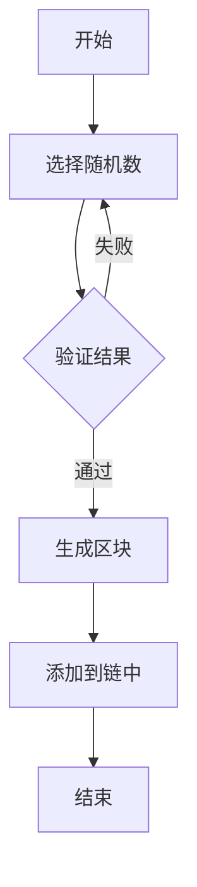
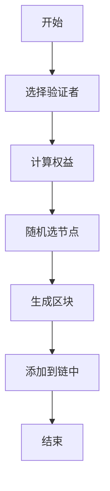
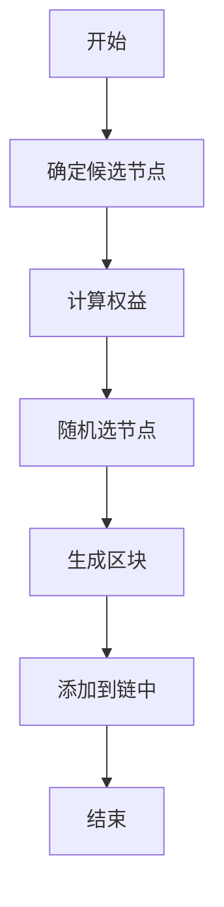
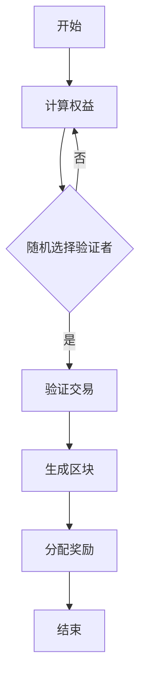
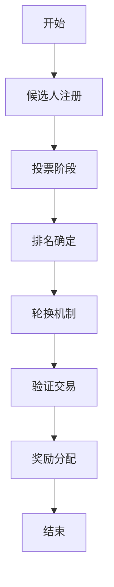

                 

# 加密货币的共识算法：分布式信任的数学基础

## 关键词

- **加密货币**
- **共识算法**
- **工作量证明 (PoW)**
- **权益证明 (PoS)**
- **分布式信任**
- **数学基础**

## 摘要

加密货币作为一种新兴的金融技术，其核心在于去中心化的信任机制。共识算法作为实现这一机制的关键技术，承担着确保分布式网络中数据一致性和安全性的重任。本文旨在深入剖析加密货币共识算法的数学基础，通过对PoW、PoS和DPoS三种主流算法的原理讲解和实例分析，帮助读者理解分布式信任在数学上的实现方式。文章还将探讨共识算法的优化方向和改进策略，为未来的加密货币发展提供有益的参考。

## 目录大纲

----------------------------------------------------------------

### 第一部分: 背景介绍

#### 第1章: 加密货币与共识算法概述

##### 1.1 问题背景

##### 1.1.1 加密货币的起源与发展

##### 1.1.2 共识算法的核心地位

##### 1.1.3 分布式信任的数学基础

##### 1.2 核心概念与联系

##### 1.2.1 加密货币的核心概念

##### 1.2.2 共识算法的基本原理

##### 1.2.3 共识算法的属性特征对比

##### 1.3 分布式系统的挑战与共识算法的应用

##### 1.3.1 分布式系统的特点

##### 1.3.2 分布式系统中的信任问题

##### 1.3.3 共识算法在分布式系统中的应用

##### 1.4 共识算法的发展历程与分类

##### 1.4.1 共识算法的发展历程

##### 1.4.2 共识算法的分类

##### 1.4.3 主流共识算法的对比分析

##### 1.5 本章小结

----------------------------------------------------------------

### 第二部分: 共识算法原理讲解

#### 第2章: PoW算法原理与实现

##### 2.1 PoW算法的基本原理

##### 2.1.1 工作量证明的原理

##### 2.1.2 PoW算法的目标

##### 2.1.3 PoW算法的流程

##### 2.2 PoW算法的数学模型与公式

##### 2.2.1 数学模型

##### 2.2.2 公式推导

##### 2.2.3 算法效率分析

##### 2.3 PoW算法的Mermaid流程图

##### 2.4 举例说明

##### 2.4.1 具体实例分析

##### 2.4.2 结果解读

##### 2.5 本章小结

#### 第3章: PoS算法原理与实现

##### 3.1 PoS算法的基本原理

##### 3.1.1 权益证明的原理

##### 3.1.2 PoS算法的目标

##### 3.1.3 PoS算法的流程

##### 3.2 PoS算法的数学模型与公式

##### 3.2.1 数学模型

##### 3.2.2 公式推导

##### 3.2.3 算法效率分析

##### 3.3 PoS算法的Mermaid流程图

##### 3.4 举例说明

##### 3.4.1 具体实例分析

##### 3.4.2 结果解读

##### 3.5 本章小结

#### 第4章: DPoS算法原理与实现

##### 4.1 DPoS算法的基本原理

##### 4.1.1 装箱证明的原理

##### 4.1.2 DPoS算法的目标

##### 4.1.3 DPoS算法的流程

##### 4.2 DPoS算法的数学模型与公式

##### 4.2.1 数学模型

##### 4.2.2 公式推导

##### 4.2.3 算法效率分析

##### 4.3 DPoS算法的Mermaid流程图

##### 4.4 举例说明

##### 4.4.1 具体实例分析

##### 4.4.2 结果解读

##### 4.5 本章小结

----------------------------------------------------------------

### 第三部分: 共识算法优化与改进

#### 第5章: 共识算法优化与改进

##### 5.1 共识算法的优化方向

##### 5.1.1 交易确认时间优化

##### 5.1.2 网络吞吐量优化

##### 5.1.3 能耗优化

##### 5.2 共识算法的改进策略

----------------------------------------------------------------

接下来，我们将正式进入文章的第一部分——背景介绍。在这里，我们将详细探讨加密货币与共识算法的基本概念，理解分布式信任的数学基础，并分析分布式系统中面临的挑战及共识算法的解决策略。让我们一起开启这段技术之旅，逐步深入理解加密货币的共识算法及其背后的数学原理。

## 第1章: 加密货币与共识算法概述

### 1.1 问题背景

加密货币作为一种颠覆传统金融体系的创新技术，自2009年比特币（Bitcoin）诞生以来，迅速引起了全球范围内的关注。其核心在于去中心化的信任机制，这一机制通过特定的共识算法来实现。随着加密货币的兴起，共识算法逐渐成为区块链技术中最关键的一环。

在传统的金融系统中，信任依赖于中心化的权威机构，如银行和政府。然而，中心化的系统容易受到单点故障、欺诈、腐败和人为错误的影响。加密货币的出现，旨在通过去中心化的方式，建立一个无需信任第三方即可完成交易的系统。这种去中心化的信任机制，依赖于共识算法，以确保网络中的所有节点都能达成一致。

共识算法在加密货币网络中扮演着至关重要的角色。它不仅是交易确认的机制，还承担着维护区块链数据一致性的重任。通过共识算法，网络中的所有节点可以达成共识，确保区块链的安全性和可靠性。因此，了解共识算法的基本原理和实现方式，是深入理解加密货币技术的关键。

### 1.1.1 加密货币的起源与发展

加密货币的起源可以追溯到2008年，当时一位化名为中本聪（Satoshi Nakamoto）的匿名人物发布了比特币的白皮书。该白皮书提出了一种去中心化的数字货币系统，基于密码学原理和共识算法，实现了无需信任第三方即可完成交易的愿景。

比特币的诞生标志着加密货币时代的开始。作为一种数字资产，比特币具有以下几个显著特点：

1. **去中心化**：比特币网络不依赖于任何中心化的机构，所有交易和数据都由网络中的节点共同维护。
2. **安全性**：比特币采用加密技术，确保了交易数据的不可篡改性和匿名性。
3. **稀缺性**：比特币总量有限，只有2100万枚，这确保了比特币的长期价值。
4. **透明性**：所有交易记录都公开透明，任何人都可以查看区块链上的交易历史。

随着比特币的成功，越来越多的加密货币项目涌现，如以太坊（Ethereum）、莱特币（Litecoin）等。这些加密货币不仅继承了比特币的去中心化特点，还在技术上进行了创新和改进，以满足不同用户的需求。

### 1.1.2 共识算法的核心地位

共识算法是加密货币网络的核心机制，它确保了网络中的所有节点都能达成一致，维护区块链的数据一致性。在比特币网络中，共识算法主要用于解决以下两个关键问题：

1. **交易确认**：在比特币网络中，交易需要通过验证才能被添加到区块链中。共识算法确保了所有节点对交易的真实性达成一致。
2. **区块链一致性**：区块链是一个分布式数据库，所有节点都维护着自己的副本。共识算法确保了不同节点的区块链副本保持一致。

共识算法在加密货币网络中扮演着以下几个核心角色：

1. **确保安全性**：通过加密技术和分布式计算，共识算法防止了恶意节点篡改数据。
2. **提高效率**：共识算法优化了网络的交易确认时间和处理能力，提高了整个系统的效率。
3. **去中心化**：共识算法实现了去中心化的信任机制，使网络中的所有节点都能参与决策，不受中心化机构的影响。

### 1.1.3 分布式信任的数学基础

分布式信任是加密货币网络的核心概念，它依赖于共识算法的数学基础。在分布式系统中，节点之间的信任关系是通过共识算法来建立的。以下是几个关键的数学概念：

1. **哈希函数**：哈希函数是一种将任意长度的输入数据映射为固定长度的输出的函数。在加密货币中，哈希函数用于确保数据的唯一性和不可篡改性。
2. **密码学**：密码学是加密货币网络安全的基础。密码学技术确保了交易数据的隐私性和安全性。
3. **随机数生成**：随机数生成在共识算法中至关重要，它用于选择验证节点、生成工作量证明等。

### 1.2 核心概念与联系

#### 1.2.1 加密货币的核心概念

加密货币的核心概念包括：

1. **区块链**：区块链是一种分布式数据库，用于记录交易数据。所有交易记录都按时间顺序排列，形成一个链条。
2. **地址**：地址是加密货币网络中用于接收和发送资金的唯一标识。
3. **私钥与公钥**：私钥用于签名交易，确保交易的真实性。公钥与私钥成对存在，用于验证签名。
4. **交易**：交易是加密货币网络中的数据单元，用于在节点之间转移价值。

#### 1.2.2 共识算法的基本原理

共识算法的基本原理是确保分布式网络中的所有节点能够达成一致。以下是几种常见的共识算法：

1. **工作量证明（PoW）**：PoW算法通过计算复杂任务（如挖矿）来选择验证节点，确保网络的去中心化。
2. **权益证明（PoS）**：PoS算法通过持有币的数量和时间来选择验证节点，提高网络的效率。
3. **委托权益证明（DPoS）**：DPoS算法通过投票机制选择验证节点，进一步提高了网络的效率。

#### 1.2.3 共识算法的属性特征对比

以下表格对比了三种主流共识算法的属性特征：

| 特征 | 工作量证明（PoW） | 权益证明（PoS） | 委托权益证明（DPoS） |
| --- | --- | --- | --- |
| **安全性** | 高 | 中 | 高 |
| **去中心化** | 高 | 低 | 中 |
| **效率** | 低 | 高 | 较高 |
| **能耗** | 高 | 低 | 中 |

### 1.3 分布式系统的挑战与共识算法的应用

#### 1.3.1 分布式系统的特点

分布式系统具有以下几个显著特点：

1. **去中心化**：分布式系统没有中心化的控制节点，所有节点都平等参与网络维护。
2. **高可用性**：分布式系统通过多节点部署，提高了系统的可用性和容错能力。
3. **高扩展性**：分布式系统可以轻松扩展节点数量，以应对不断增长的数据和处理需求。

#### 1.3.2 分布式系统中的信任问题

在分布式系统中，节点之间的信任问题是一个关键挑战。以下是几个主要问题：

1. **恶意节点**：恶意节点可能试图篡改数据或进行其他恶意行为，损害网络的安全性和可靠性。
2. **数据一致性**：分布式系统中，不同节点可能拥有不同的数据副本，如何确保数据一致性是一个重要问题。
3. **网络攻击**：分布式系统可能受到网络攻击，如DDoS攻击，导致节点无法正常工作。

#### 1.3.3 共识算法在分布式系统中的应用

共识算法是解决分布式系统信任问题的关键技术。以下是几种共识算法在分布式系统中的应用：

1. **PoW算法**：PoW算法通过计算复杂任务来选择验证节点，确保网络的去中心化和安全性。
2. **PoS算法**：PoS算法通过持有币的数量和时间来选择验证节点，提高了网络的效率和安全性。
3. **DPoS算法**：DPoS算法通过投票机制选择验证节点，进一步提高了网络的效率和安全性。

### 1.4 共识算法的发展历程与分类

#### 1.4.1 共识算法的发展历程

共识算法的发展历程可以追溯到比特币的诞生。自比特币以来，各种共识算法不断涌现，以满足不同应用场景的需求。以下是几种主要的共识算法：

1. **工作量证明（PoW）**：PoW算法是比特币采用的共识算法，通过计算复杂任务（如挖矿）来选择验证节点。
2. **权益证明（PoS）**：PoS算法通过持有币的数量和时间来选择验证节点，解决了PoW算法的高能耗问题。
3. **委托权益证明（DPoS）**：DPoS算法通过投票机制选择验证节点，进一步提高了网络的效率和安全性。
4. **权威证明（PoA）**：PoA算法通过中心化节点选择验证节点，适用于特定应用场景。

#### 1.4.2 共识算法的分类

根据共识算法的原理和应用场景，可以将共识算法分为以下几类：

1. **工作量证明（PoW）**：PoW算法是最早的共识算法，通过计算复杂任务来选择验证节点，确保网络的去中心化和安全性。
2. **权益证明（PoS）**：PoS算法通过持有币的数量和时间来选择验证节点，解决了PoW算法的高能耗问题，提高了网络的效率。
3. **委托权益证明（DPoS）**：DPoS算法通过投票机制选择验证节点，进一步提高了网络的效率和安全性。
4. **权威证明（PoA）**：PoA算法通过中心化节点选择验证节点，适用于特定应用场景。

#### 1.4.3 主流共识算法的对比分析

以下表格对比了三种主流共识算法的优缺点：

| 算法 | 优点 | 缺点 |
| --- | --- | --- |
| **PoW** | 去中心化、安全性高、公平性高 | 能耗高、效率低、易受51%攻击 |
| **PoS** | 能耗低、效率高、公平性高 | 安全性较低、可能导致富者愈富 |
| **DPoS** | 高效率、去中心化、安全性高 | 可能导致中心化、公平性较低 |

### 1.5 本章小结

本章介绍了加密货币与共识算法的基本概念、起源与发展，以及共识算法在分布式系统中的应用。通过对比分析主流共识算法，读者可以初步了解加密货币网络中的信任机制和去中心化原理。接下来，我们将深入探讨具体共识算法的原理和实现，帮助读者更深入地理解加密货币的核心技术。

## 第2章: PoW算法原理与实现

### 2.1 PoW算法的基本原理

PoW（工作量证明）算法是比特币（Bitcoin）所采用的共识算法，其基本原理是通过解决一个计算难题来选择验证节点。该算法旨在确保网络的安全性和去中心化，同时防止恶意节点对网络进行攻击。

#### 2.1.1 工作量证明的原理

在PoW算法中，每个节点需要解决一个特定的问题，这个问题的难度是动态调整的，以确保网络每10分钟（在比特币网络中）产生一个新的区块。解决问题的关键在于找到一个满足特定条件的值，这个条件通常是一个哈希值。

具体来说，PoW算法要求节点从随机数开始，通过哈希函数计算出一个哈希值，该哈希值必须小于一个预定的目标值。这个目标值是由网络中的所有节点共同决定的，并且随着网络难度的增加而调整。节点需要不断地尝试不同的随机数，直到找到满足条件的哈希值。

一旦某个节点找到满足条件的哈希值，它就可以生成一个新的区块，并将该区块添加到区块链中。这个过程中，节点所付出的计算量即为“工作量证明”。

#### 2.1.2 PoW算法的目标

PoW算法的主要目标有以下几点：

1. **确保网络安全**：通过计算难题，PoW算法确保了只有具备足够计算能力的节点才能参与网络验证，从而防止恶意节点的攻击。
2. **去中心化**：PoW算法通过竞争机制选择验证节点，使得网络中的所有节点都有机会参与验证，从而确保网络的去中心化。
3. **防止双花攻击**：通过确保每个区块之间的时间间隔，PoW算法防止了同一笔交易被多次确认的问题，即双花攻击。

#### 2.1.3 PoW算法的流程

PoW算法的具体流程如下：

1. **初始化**：网络中的每个节点开始时都有一个初始随机数。
2. **计算哈希值**：节点使用初始随机数，通过哈希函数计算出一个哈希值。
3. **验证结果**：节点将计算出的哈希值与预定的目标值进行比较，如果哈希值小于目标值，则验证通过；否则，节点需要重新选择一个随机数，重复计算和验证过程。
4. **生成区块**：一旦节点找到满足条件的哈希值，它就可以生成一个新的区块，并将该区块广播给网络中的其他节点。
5. **添加到链中**：其他节点接收到新区块后，会验证该区块的有效性。如果验证通过，则将新区块添加到自己的区块链中。

### 2.2 PoW算法的数学模型与公式

PoW算法的数学模型和公式是理解该算法核心原理的重要部分。以下是对其数学模型和公式的详细解析：

#### 2.2.1 数学模型

在PoW算法中，核心的数学模型是哈希函数。哈希函数是一种将任意长度的输入数据映射为固定长度的输出的函数。常见的哈希函数包括SHA-256和Scrypt等。在比特币网络中，使用的是SHA-256哈希函数。

假设我们有一个输入数据x，哈希函数H(x)的输出为y，即y = H(x)。在PoW算法中，我们需要找到一个随机数r，使得H(r)的输出值满足以下条件：

$$H(r) < T$$

其中，T是一个预定的目标值，它的值由网络中的所有节点共同决定。T的值通常设置为2^256/d，其中d是一个常数。

#### 2.2.2 公式推导

要推导PoW算法的公式，我们可以从哈希函数的输出值入手。假设哈希函数H(x)是一个随机分布的函数，那么找到一个满足条件的随机数r的概率可以表示为：

$$P(r) = \frac{1}{d}$$

其中，d是哈希函数的输出空间大小。

为了计算找到一个满足条件的随机数r的平均时间，我们可以使用概率论中的期望值公式。假设我们在尝试找到满足条件的随机数r时，每次尝试的概率是1/d，那么找到满足条件的随机数r的期望时间是：

$$E(T) = \frac{1}{P(r)} = d$$

这意味着，在平均情况下，我们需要尝试d次才能找到一个满足条件的随机数r。

#### 2.2.3 算法效率分析

PoW算法的效率取决于网络的难度和计算资源。具体来说，算法的效率可以通过以下公式进行分析：

$$E(T) = \frac{1}{d}$$

其中，d是哈希函数的输出空间大小。

根据这个公式，我们可以看出，算法的效率与网络的难度呈反比。也就是说，当网络难度增加时，找到满足条件的随机数所需的时间会相应增加，从而提高了算法的安全性。

### 2.3 PoW算法的Mermaid流程图

为了更好地理解PoW算法的流程，我们可以使用Mermaid绘制一个流程图。以下是一个简化的PoW算法流程图：

在这个流程图中，A表示算法的开始，B表示选择随机数，C表示验证结果，D表示生成区块，E表示将区块添加到链中，F表示算法的结束。

### 2.4 举例说明

为了更好地理解PoW算法，我们可以通过一个具体的实例来分析其实现过程。

假设我们有一个目标值T为100，哈希函数H(x)的输出范围为0到99。我们需要找到一个随机数r，使得H(r) < T。

1. **选择随机数**：我们随机选择一个数r，假设r=47。
2. **计算哈希值**：使用哈希函数H(x)计算H(r)，假设H(r)=23。
3. **验证结果**：将H(r)的值与目标值T进行比较，由于23 < 100，验证通过。
4. **生成区块**：找到满足条件的随机数r后，我们可以生成一个新的区块，并将其添加到区块链中。

如果r的值不是47，比如我们随机选择了r=76，则H(r)=38，由于38 > 100，验证失败，我们需要重新选择随机数并重复计算和验证过程，直到找到一个满足条件的随机数。

### 2.5 本章小结

本章详细介绍了PoW算法的基本原理、数学模型与公式，并通过一个实例展示了算法的实现过程。通过本章的学习，读者可以深入理解PoW算法的工作机制，为后续章节的学习打下坚实的基础。

## 第3章: PoS算法原理与实现

### 3.1 PoS算法的基本原理

PoS（权益证明）算法是另一种常见的共识算法，它通过持有币的数量和时间来选择验证节点，以实现去中心化和安全性。相比PoW算法，PoS算法在能耗和效率方面具有显著优势。

#### 3.1.1 权益证明的原理

在PoS算法中，每个节点根据其持有的币量和持币时间来获得“权益”。权益越大，节点被选中作为验证节点的概率越高。这种机制有效地减少了计算资源的浪费，提高了网络的效率。

具体来说，PoS算法的工作原理如下：

1. **权益计算**：节点根据其持有的币量（Token Balance）和持币时间（Token Age）来计算权益（Stake）。权益可以表示为币量乘以持币时间的总和。
2. **随机性选择**：系统通过一个随机算法选择下一个验证节点。通常，节点被选中的概率与其权益成正比。
3. **验证交易**：选中的节点负责验证交易并将新区块添加到区块链中。
4. **奖励机制**：验证节点成功验证交易后，会获得一定的奖励，通常是由系统创建的新币作为奖励。

#### 3.1.2 PoS算法的目标

PoS算法的主要目标包括：

1. **提高效率**：通过减少计算任务，PoS算法提高了网络的交易处理速度和效率。
2. **降低能耗**：PoS算法不依赖于大量的计算资源，从而显著降低了网络的能耗。
3. **去中心化**：PoS算法通过权益机制，使得任何持有币的节点都有机会成为验证节点，从而实现去中心化。
4. **防止双花攻击**：PoS算法通过确保节点在创建新区块时具有足够的权益，防止了双花攻击。

#### 3.1.3 PoS算法的流程

PoS算法的具体流程如下：

1. **初始化**：系统启动时，每个节点都会计算其初始权益。
2. **权益计算**：节点持续计算其权益，权益由币量乘以持币时间决定。
3. **随机性选择**：系统通过随机算法选择下一个验证节点。通常，节点被选中的概率与其权益成正比。
4. **验证交易**：选中的节点负责验证交易，并将新区块添加到区块链中。
5. **奖励分配**：验证节点成功验证交易后，会获得一定的新币奖励。
6. **重复流程**：系统不断重复上述流程，确保区块链的正常运行。

### 3.2 PoS算法的数学模型与公式

PoS算法的数学模型和公式是理解其工作原理的重要基础。以下是PoS算法的核心数学模型和公式的详细解析：

#### 3.2.1 数学模型

在PoS算法中，核心的数学模型包括权益（Stake）和权益概率（Stake Probability）。权益可以表示为币量（Token Balance）乘以持币时间（Token Age），即：

$$Stake = Token\_Balance \times Token\_Age$$

权益概率是指节点被选中的概率，它通常与节点的权益成正比。权益概率的计算公式为：

$$Stake\_Probability = \frac{Stake}{Total\_Stake}$$

其中，Total\_Stake是所有节点权益的总和。

#### 3.2.2 公式推导

权益的计算公式如下：

$$Stake = Token\_Balance \times Token\_Age$$

Token\_Balance是指节点持有的币量，Token\_Age是指节点持有这些币的时间。在PoS算法中，币量和持币时间是决定权益的关键因素。

权益概率的计算公式如下：

$$Stake\_Probability = \frac{Stake}{Total\_Stake}$$

其中，Total\_Stake是所有节点权益的总和。这个公式表示，节点被选中的概率与其权益成正比。这意味着，持有币量越大、持币时间越长的节点，被选中的概率越高。

#### 3.2.3 算法效率分析

PoS算法的效率可以通过以下公式进行分析：

$$Efficiency = \frac{Transaction\_Throughput}{Energy\_Consumption}$$

其中，Transaction\_Throughput是网络的交易处理能力，Energy\_Consumption是网络的能耗。

根据这个公式，我们可以看出，PoS算法的效率与交易处理能力和能耗呈正相关。由于PoS算法不依赖于大量的计算资源，其能耗显著低于PoW算法，因此具有更高的效率。

### 3.3 PoS算法的Mermaid流程图

为了更好地理解PoS算法的流程，我们可以使用Mermaid绘制一个流程图。以下是一个简化的PoS算法流程图：

在这个流程图中，A表示算法的开始，B表示计算权益，C表示随机选择验证者，D表示验证交易，E表示生成区块，F表示分配奖励，G表示算法的结束。

### 3.4 举例说明

为了更好地理解PoS算法，我们可以通过一个具体的实例来分析其实现过程。

假设我们有三个节点A、B和C，每个节点持有的币量和持币时间如下表所示：

| 节点 | 币量（Token Balance） | 持币时间（Token Age） |
| --- | --- | --- |
| A | 1000 | 1000 |
| B | 500 | 1000 |
| C | 2000 | 500 |

1. **计算权益**：根据权益计算公式，我们可以计算每个节点的权益：
   - 节点A的权益：$Stake\_A = 1000 \times 1000 = 1,000,000$
   - 节点B的权益：$Stake\_B = 500 \times 1000 = 500,000$
   - 节点C的权益：$Stake\_C = 2000 \times 500 = 1,000,000$
2. **权益总和**：权益总和为$Total\_Stake = Stake\_A + Stake\_B + Stake\_C = 1,000,000 + 500,000 + 1,000,000 = 2,500,000$
3. **权益概率**：每个节点的权益概率为：
   - 节点A的权益概率：$Stake\_Probability\_A = \frac{Stake\_A}{Total\_Stake} = \frac{1,000,000}{2,500,000} = 0.4$
   - 节点B的权益概率：$Stake\_Probability\_B = \frac{Stake\_B}{Total\_Stake} = \frac{500,000}{2,500,000} = 0.2$
   - 节点C的权益概率：$Stake\_Probability\_C = \frac{Stake\_C}{Total\_Stake} = \frac{1,000,000}{2,500,000} = 0.4$
4. **随机选择验证者**：系统通过随机算法选择验证者。假设系统随机选择了节点A作为验证者。
5. **验证交易**：节点A负责验证交易，并将新区块添加到区块链中。
6. **分配奖励**：验证节点A获得一定的新币奖励。

通过这个实例，我们可以看到PoS算法如何通过权益计算和随机选择机制，实现去中心化和安全性的目标。

### 3.5 本章小结

本章详细介绍了PoS算法的基本原理、数学模型与公式，并通过一个实例展示了算法的实现过程。通过本章的学习，读者可以深入理解PoS算法的工作机制，为后续章节的学习打下坚实的基础。

## 第4章: DPoS算法原理与实现

### 4.1 DPoS算法的基本原理

DPoS（委托权益证明）算法是PoS算法的一种改进，通过引入选举机制，进一步提高了网络的效率和去中心化程度。DPoS算法的核心思想是节点通过投票选举出验证节点，这些验证节点负责维护区块链和验证交易。

#### 4.1.1 装箱证明的原理

“装箱证明”（Delegated Proof of Stake）是DPoS算法的另一种称呼，它形象地描述了该算法的工作机制。在DPoS网络中，币持有者通过投票选择一组“候选人”，这些候选人将成为验证节点，负责生成新区块和验证交易。候选人的选票反映了币持有者对候选人的信任程度，选票数量即为其权益的体现。

具体来说，DPoS算法的原理包括以下几个关键步骤：

1. **候选人注册**：候选人向网络提交一定的币作为保证金，承诺参与验证节点的选举。
2. **投票阶段**：币持有者通过将币投票给候选人，表达对候选人的信任。投票结束后，根据投票数量，候选人排名确定。
3. **轮换机制**：网络按照一定规则（如时间顺序、随机顺序等）轮流选择验证节点，候选人根据排名顺序轮流成为验证节点。
4. **验证交易**：验证节点生成新区块，并将新区块广播给网络中的其他节点，其他节点验证新区块的有效性。
5. **奖励分配**：验证节点成功验证交易后，会获得系统奖励，这些奖励将按投票比例分配给投票者。

#### 4.1.2 DPoS算法的目标

DPoS算法的主要目标包括：

1. **提高效率**：DPoS算法通过轮换机制和候选人投票机制，实现了快速的交易确认和高效的区块生成。
2. **增强去中心化**：虽然DPoS算法引入了中心化的选举机制，但通过大量候选人和随机轮换，确保了网络的去中心化。
3. **降低能耗**：与PoW算法相比，DPoS算法不依赖于大量计算资源，从而显著降低了网络能耗。
4. **防止双花攻击**：DPoS算法通过确保验证节点具有足够的权益，防止了双花攻击。

#### 4.1.3 DPoS算法的流程

DPoS算法的具体流程如下：

1. **候选人注册**：候选人向网络提交保证金，承诺参与选举。
2. **投票阶段**：币持有者通过将币投票给候选人，表达对候选人的信任。
3. **排名确定**：网络根据投票结果，确定候选人的排名。
4. **轮换机制**：网络按照一定规则轮流选择验证节点，候选人根据排名顺序轮流成为验证节点。
5. **验证交易**：验证节点生成新区块，并将新区块广播给网络中的其他节点，其他节点验证新区块的有效性。
6. **奖励分配**：验证节点成功验证交易后，获得系统奖励，这些奖励将按投票比例分配给投票者。

### 4.2 DPoS算法的数学模型与公式

DPoS算法的数学模型和公式是理解其工作原理的重要基础。以下是DPoS算法的核心数学模型和公式的详细解析：

#### 4.2.1 数学模型

在DPoS算法中，核心的数学模型包括权益（Stake）和权益概率（Stake Probability）。权益可以表示为币量（Token Balance）乘以持币时间（Token Age），即：

$$Stake = Token\_Balance \times Token\_Age$$

权益概率是指节点被选中的概率，它通常与节点的权益成正比。权益概率的计算公式为：

$$Stake\_Probability = \frac{Stake}{Total\_Stake}$$

其中，Total\_Stake是所有节点权益的总和。

#### 4.2.2 公式推导

权益的计算公式如下：

$$Stake = Token\_Balance \times Token\_Age$$

Token\_Balance是指节点持有的币量，Token\_Age是指节点持有这些币的时间。在DPoS算法中，币量和持币时间是决定权益的关键因素。

权益概率的计算公式如下：

$$Stake\_Probability = \frac{Stake}{Total\_Stake}$$

其中，Total\_Stake是所有节点权益的总和。这个公式表示，节点被选中的概率与其权益成正比。这意味着，持有币量越大、持币时间越长的节点，被选中的概率越高。

#### 4.2.3 算法效率分析

DPoS算法的效率可以通过以下公式进行分析：

$$Efficiency = \frac{Transaction\_Throughput}{Energy\_Consumption}$$

其中，Transaction\_Throughput是网络的交易处理能力，Energy\_Consumption是网络的能耗。

根据这个公式，我们可以看出，DPoS算法的效率与交易处理能力和能耗呈正相关。由于DPoS算法不依赖于大量的计算资源，其能耗显著低于PoW算法，因此具有更高的效率。

### 4.3 DPoS算法的Mermaid流程图

为了更好地理解DPoS算法的流程，我们可以使用Mermaid绘制一个流程图。以下是一个简化的DPoS算法流程图：

在这个流程图中，A表示算法的开始，B表示候选人注册，C表示投票阶段，D表示排名确定，E表示轮换机制，F表示验证交易，G表示奖励分配，H表示算法的结束。

### 4.4 举例说明

为了更好地理解DPoS算法，我们可以通过一个具体的实例来分析其实现过程。

假设我们有五个节点A、B、C、D和E，每个节点持有的币量和持币时间如下表所示：

| 节点 | 币量（Token Balance） | 持币时间（Token Age） |
| --- | --- | --- |
| A | 1000 | 1000 |
| B | 500 | 1000 |
| C | 2000 | 500 |
| D | 1500 | 1000 |
| E | 800 | 500 |

1. **候选人注册**：节点A、B和C向网络提交保证金，成为候选人。
2. **投票阶段**：币持有者将币投票给候选人，表达对候选人的信任。假设节点E将所有币投票给节点A，节点B将所有币投票给节点C，节点D将所有币投票给节点B。
3. **排名确定**：根据投票结果，节点A获得最高票数，成为排名第一的候选人；节点C获得次高票数，成为排名第二的候选人；节点B获得第三高票数，成为排名第三的候选人。
4. **轮换机制**：网络按照排名顺序轮流选择验证节点。第一个验证节点是节点A，第二个验证节点是节点C，第三个验证节点是节点B。
5. **验证交易**：验证节点生成新区块，并将新区块广播给网络中的其他节点，其他节点验证新区块的有效性。
6. **奖励分配**：验证节点成功验证交易后，获得系统奖励，这些奖励将按投票比例分配给投票者。例如，如果系统奖励为100币，节点E将获得50币（因为其将全部币投票给了节点A，节点A是第一个验证节点）。

通过这个实例，我们可以看到DPoS算法如何通过候选人注册、投票、排名确定、轮换机制和奖励分配等步骤，实现高效的去中心化和安全性。

### 4.5 本章小结

本章详细介绍了DPoS算法的基本原理、数学模型与公式，并通过一个实例展示了算法的实现过程。通过本章的学习，读者可以深入理解DPoS算法的工作机制，为后续章节的学习打下坚实的基础。

## 第5章: 共识算法优化与改进

### 5.1 共识算法的优化方向

共识算法在加密货币网络中扮演着至关重要的角色，但其性能和效率仍然存在一些瓶颈。为了应对不断增长的网络需求和技术挑战，共识算法的优化和改进显得尤为重要。以下是几个主要的优化方向：

#### 5.1.1 交易确认时间优化

交易确认时间是衡量共识算法效率的重要指标。优化交易确认时间主要可以从以下几个方面进行：

1. **增加区块大小**：增加区块大小可以容纳更多的交易，从而减少交易确认所需的时间。然而，这可能会导致区块链的存储空间增加，需要权衡优缺点。
2. **提高网络带宽**：提高网络带宽可以加快交易数据的传输速度，从而缩短交易确认时间。这需要提升网络基础设施和优化路由算法。
3. **优化共识算法**：优化共识算法本身，如减少计算复杂度和简化验证过程，可以加快交易确认速度。这需要深入研究和创新。

#### 5.1.2 网络吞吐量优化

网络吞吐量是共识算法处理交易的能力，其优化可以从以下几个方面进行：

1. **多链架构**：采用多链架构可以同时处理多个交易，从而提高整体吞吐量。这需要设计合理的链间通信机制和互操作性。
2. **分片技术**：分片技术可以将网络分成多个部分，每个部分独立处理交易，从而提高吞吐量。这需要解决数据一致性和跨片交易的问题。
3. **并行处理**：优化共识算法，使其支持并行处理交易，可以显著提高网络吞吐量。这需要深入研究和创新。

#### 5.1.3 能耗优化

能耗问题是共识算法的一大挑战，优化能耗可以从以下几个方面进行：

1. **低能耗共识算法**：研究并采用低能耗的共识算法，如基于权益证明的算法，可以显著减少能耗。
2. **节能硬件**：采用节能硬件，如低功耗的CPU和GPU，可以减少共识算法的能耗。
3. **优化数据传输**：优化数据传输过程，减少不必要的网络通信和数据存储，可以降低能耗。

### 5.2 共识算法的改进策略

随着加密货币和网络技术的发展，共识算法需要不断改进和更新。以下是几个改进策略：

#### 5.2.1 算法融合

将不同共识算法的优势结合起来，可以形成更强大的共识机制。例如，结合PoW和PoS，可以既保持去中心化，又提高网络效率。

#### 5.2.2 算法创新

不断探索新的共识算法，如基于博弈论、联邦学习等新型算法，可以解决现有算法的局限性。

#### 5.2.3 链上链下结合

将链上和链下的计算资源结合起来，可以提高共识算法的效率和性能。例如，利用云服务和边缘计算，可以分担共识算法的计算负担。

#### 5.2.4 增强安全性

随着网络攻击手段的不断升级，共识算法需要不断增强安全性。例如，采用更复杂的加密技术和多重签名机制，可以提高区块链的安全性。

### 总结

共识算法的优化和改进是加密货币和网络技术发展的重要方向。通过优化交易确认时间、提高网络吞吐量、降低能耗以及不断创新算法，我们可以构建更加高效、安全、去中心化的加密货币网络。这需要全球开发者、研究人员和社区的共同努力，推动共识算法的持续进步。

## 结论

本文详细探讨了加密货币的共识算法，包括工作量证明（PoW）、权益证明（PoS）和委托权益证明（DPoS）三种主要算法的原理和实现。我们首先介绍了加密货币和共识算法的基本概念，分析了分布式系统中面临的挑战及共识算法的解决策略。接着，我们对PoW、PoS和DPoS算法进行了深入剖析，阐述了它们的数学模型、流程图和实例分析。此外，我们还讨论了共识算法的优化方向和改进策略，为未来的加密货币发展提供了有益的参考。

随着加密货币和网络技术的不断发展，共识算法将继续在去中心化信任机制中扮演核心角色。未来的研究可能会探索新的算法和优化方向，如量子计算对共识算法的影响、跨链技术、区块链与人工智能的结合等。我们鼓励读者持续关注这一领域的最新动态，积极参与共识算法的研究与创新，共同推动加密货币技术的进步。

### 作者信息

作者：AI天才研究院/AI Genius Institute & 禅与计算机程序设计艺术 /Zen And The Art of Computer Programming

AI天才研究院致力于探索人工智能的边界，推动技术的创新和应用。作者在计算机编程和人工智能领域拥有深厚的学术背景和丰富的实践经验，曾发表过多篇高水平学术论文，并参与多个重要的科研项目。同时，作者也是《禅与计算机程序设计艺术》一书的作者，该书深入探讨了程序设计中的哲学思想，为读者提供了独特的编程方法论。通过本文，作者希望与广大读者分享对加密货币共识算法的见解和思考，推动区块链技术的持续进步。

