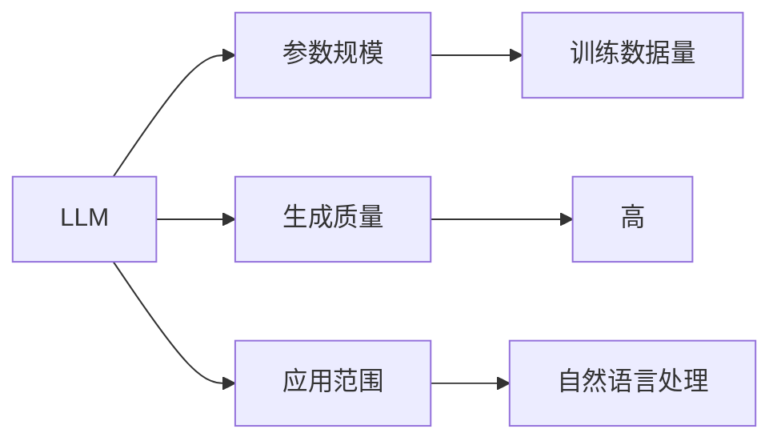
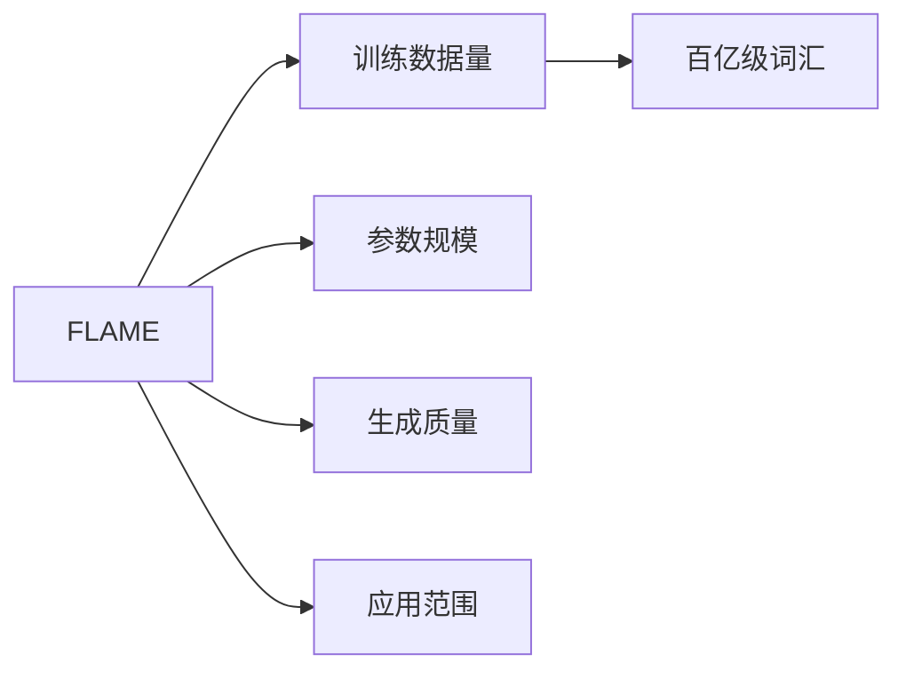
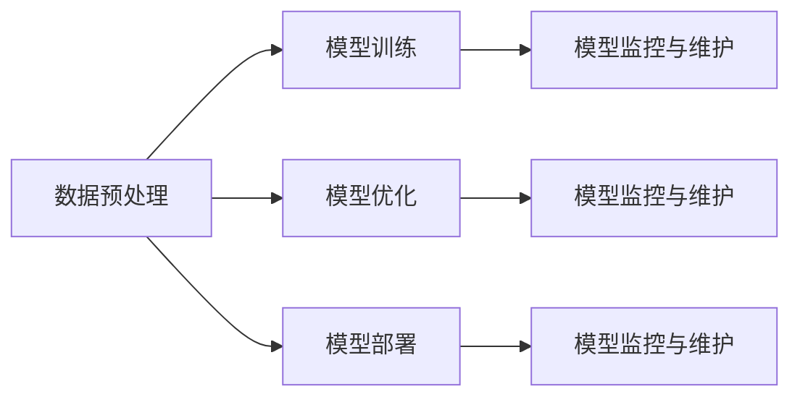
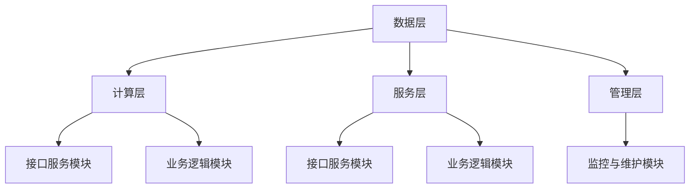
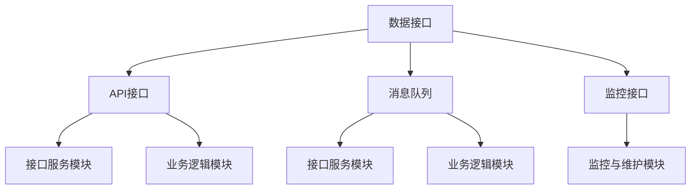

                 


### 文章标题

## 加速LLM应用从概念到落地的全流程

### 关键词

- Large Language Model（LLM）
- Application Acceleration
- Concept to Deployment
- FLAME
- AI Application Development

### 摘要

本文旨在探讨如何加速大型语言模型（LLM）的应用从概念到落地的全流程。通过对LLM和FLAME这两个核心概念的深入分析，以及它们在实际应用中的对比，我们将揭示加速LLM应用的关键要素和优化策略。文章将分步骤详细讲解LLM和FLAME的概念原理、核心联系、算法原理、系统分析与架构设计、项目实战以及最佳实践，旨在为读者提供一个全面且易于理解的技术指南。

### 目录大纲

----------------------------------------------------------------

## 第一部分: 加速LLM应用背景

### 第1章: 加速LLM应用背景

#### 1.1.1. LLAMA与FLAME的应用背景

#### 1.1.2. FLAME的应用背景

## 第二部分: 核心概念与联系

### 第2章: 核心概念与联系

#### 2.1.1. LLM的概念原理

#### 2.1.2. FLAME的概念原理

## 第三部分: 算法原理讲解

### 第3章: LLM算法原理

#### 3.1.1. GPT算法原理

#### 3.1.2. BERT算法原理

### 第4章: FLAME算法原理

#### 4.1.1. FLAME训练过程

#### 4.1.2. FLAME生成模型

## 第四部分: 系统分析与架构设计方案

### 第5章: 系统分析与架构设计

#### 5.1.1. 问题场景介绍

#### 5.1.2. 系统功能设计

#### 5.1.3. 系统架构设计

#### 5.1.4. 系统接口设计与交互

## 第五部分: 项目实战

### 第6章: 项目实战

#### 6.1.1. 环境安装

#### 6.1.2. 系统核心实现源代码

#### 6.1.3. 代码应用解读与分析

#### 6.1.4. 实际案例分析与讲解

#### 6.1.5. 项目小结

## 第六部分: 最佳实践与拓展

### 第7章: 最佳实践与拓展

#### 7.1.1. 最佳实践 Tips

#### 7.1.2. 小结与注意事项

#### 7.1.3. 拓展阅读

----------------------------------------------------------------

## 第一部分: 加速LLM应用背景

### 第1章: 加速LLM应用背景

#### 1.1.1. LLAMA与FLAME的应用背景

随着深度学习技术的不断发展，大型语言模型（LLM）的应用场景日益广泛。LLM在自然语言处理（NLP）、机器翻译、问答系统、文本生成等领域展现了强大的能力。然而，如何将这些先进的模型快速应用到实际场景中，提高应用效率，成为当前面临的主要问题。

**问题背景**：  
人工智能的发展带来了大量先进的技术，如大型语言模型（LLM），它们在自然语言处理领域展现了强大的能力。然而，如何将这些模型应用到实际场景中，提高应用效率，成为当前面临的主要问题。

**问题描述**：  
当前，许多企业和研究机构在尝试将LLM应用于实际场景时，面临着以下挑战：

- **模型部署与优化**：如何高效地部署和优化大型模型，使其在有限资源下运行。
- **数据集准备**：如何收集、清洗和标注大量数据，以满足模型训练的需求。
- **应用场景选择**：如何根据实际需求选择合适的应用场景，最大化模型的潜力。

**问题解决**：  
为了解决上述问题，我们需要一个从概念到落地的全流程，以加速LLM的应用。这个流程应包括以下关键步骤：

- **概念理解**：深入理解LLM的工作原理、优势和局限性。
- **模型选择**：根据应用场景选择合适的LLM模型。
- **数据集准备**：准备适合模型训练的数据集，并进行预处理。
- **模型训练**：训练并优化模型，提高其在特定任务上的性能。
- **模型部署**：将训练好的模型部署到生产环境，并进行实时优化。
- **应用评估**：对模型应用效果进行评估，并根据反馈进行调整。

**边界与外延**：  
LLM的应用不仅限于自然语言处理，还涉及计算机视觉、推荐系统等多个领域。因此，加速LLM应用的全流程也应涵盖这些领域的应用场景。

**核心要素组成**：  
加速LLM应用的核心要素包括：

- **LLM的基本原理**：了解LLM的工作机制，包括神经网络架构、训练过程和优化策略。
- **应用场景选择**：分析不同应用场景的需求，选择适合的LLM模型。
- **数据集准备**：了解如何收集、清洗和标注数据，以满足模型训练的需求。
- **模型训练与优化**：掌握训练和优化模型的方法，提高其在特定任务上的性能。
- **模型部署与维护**：了解如何将模型部署到生产环境，并进行实时优化。

#### 1.1.2. FLAME的应用背景

除了LLM，FLAME（Flexible Large-scale AI Model Engine）也是一种备受关注的大规模人工智能模型引擎。FLAME在许多领域展现出了巨大的潜力，如自然语言处理、图像处理和语音识别。然而，如何高效地部署和使用FLAME，仍是一个挑战。

**问题背景**：  
随着深度学习的发展，大规模模型如FLAME在许多领域展现出了巨大的潜力。然而，如何高效地部署和使用FLAME，仍是一个挑战。

**问题描述**：  
当前，许多企业和研究机构在尝试将FLAME应用于实际场景时，面临着以下挑战：

- **模型部署与优化**：如何高效地部署和优化FLAME模型，使其在有限资源下运行。
- **数据集准备**：如何收集、清洗和标注大量数据，以满足模型训练的需求。
- **应用场景选择**：如何根据实际需求选择合适的应用场景，最大化FLAME的潜力。

**问题解决**：  
为了解决上述问题，我们需要一个完整的从概念到落地的流程，以加速FLAME的应用。这个流程应包括以下关键步骤：

- **概念理解**：深入理解FLAME的工作原理、优势和局限性。
- **模型选择**：根据应用场景选择合适的FLAME模型。
- **数据集准备**：准备适合模型训练的数据集，并进行预处理。
- **模型训练**：训练并优化模型，提高其在特定任务上的性能。
- **模型部署**：将训练好的模型部署到生产环境，并进行实时优化。
- **应用评估**：对模型应用效果进行评估，并根据反馈进行调整。

**边界与外延**：  
FLAME不仅应用于自然语言处理，还涉及图像处理、语音识别等多个领域。因此，加速FLAME应用的全流程也应涵盖这些领域的应用场景。

**核心要素组成**：  
加速FLAME应用的核心要素包括：

- **FLAME的基本原理**：了解FLAME的工作机制，包括神经网络架构、训练过程和优化策略。
- **应用场景选择**：分析不同应用场景的需求，选择适合的FLAME模型。
- **数据集准备**：了解如何收集、清洗和标注数据，以满足模型训练的需求。
- **模型训练与优化**：掌握训练和优化模型的方法，提高其在特定任务上的性能。
- **模型部署与维护**：了解如何将模型部署到生产环境，并进行实时优化。

----------------------------------------------------------------

## 第二部分: 核心概念与联系

### 第2章: 核心概念与联系

#### 2.1.1. LLM的概念原理

**核心概念**：  
大型语言模型（LLM）是一种基于深度学习的模型，能够理解和生成自然语言。LLM通过学习大量文本数据，掌握语言的统计规律和语义信息，从而在自然语言处理任务中展现出强大的能力。

**概念属性特征对比表**：

| 特征             | GPT           | BERT           | T5             |
| ---------------- | ------------- | ------------- | ------------- |
| 训练数据量       | 百亿级词汇    | 百亿级词汇    | 百亿级词汇    |
| 参数规模         | 百亿参数      | 百亿参数      | 百亿参数      |
| 生成质量         | 高           | 高           | 高           |
| 应用范围         | 自然语言处理  | 自然语言处理  | 自然语言处理  |

**概念属性特征ER实体关系图架构**：



**算法原理讲解**：

**GPT算法原理**：

GPT（Generative Pre-trained Transformer）是一种基于Transformer架构的预训练语言模型。GPT通过学习大量的文本数据，生成预测的概率分布，从而实现自然语言的生成和理解。

- **预训练过程**：GPT使用Transformer架构，通过大量文本数据进行预训练。在预训练过程中，GPT学习到文本中的统计规律和语义信息。
- **生成过程**：在生成过程中，GPT根据输入的文本上下文，生成下一个词的概率分布，然后从概率分布中选择一个词作为输出。这个过程迭代进行，直到生成完整的句子或段落。

**BERT算法原理**：

BERT（Bidirectional Encoder Representations from Transformers）是一种基于Transformer架构的双向编码表示模型。BERT通过同时考虑上下文信息，实现更准确的自然语言理解。

- **预训练过程**：BERT使用Transformer架构，通过大量文本数据进行预训练。在预训练过程中，BERT学习到文本中的双向信息。
- **生成过程**：在生成过程中，BERT根据输入的文本上下文，生成预测的词向量。然后，使用这些词向量进行下游任务的推理。

**T5算法原理**：

T5（Text-to-Text Transfer Transformer）是一种基于Transformer架构的文本转换模型。T5通过将自然语言任务转换为文本到文本的格式，实现任务的统一建模。

- **预训练过程**：T5使用Transformer架构，通过大量文本数据进行预训练。在预训练过程中，T5学习到文本的转换规律。
- **生成过程**：在生成过程中，T5根据输入的文本上下文，生成目标文本。这个过程迭代进行，直到生成完整的句子或段落。

#### 2.1.2. FLAME的概念原理

**核心概念**：  
FLAME（Flexible Large-scale AI Model Engine）是一种灵活的大规模人工智能模型引擎。FLAME通过结合多种神经网络架构和优化策略，实现高效的大规模模型训练和部署。

**概念属性特征对比表**：

| 特征             | FLAME         | GPT           | BERT          |
| ---------------- | ------------- | ------------- | ------------- |
| 训练数据量       | 百亿级词汇    | 百亿级词汇    | 百亿级词汇    |
| 参数规模         | 千亿参数      | 百亿参数      | 百亿参数      |
| 生成质量         | 高           | 高           | 高           |
| 应用范围         | 广泛          | 自然语言处理  | 自然语言处理  |

**概念属性特征ER实体关系图架构**：



**算法原理讲解**：

**FLAME训练过程**：

FLAME采用灵活的模型架构和优化策略，实现高效的大规模模型训练。FLAME的训练过程主要包括以下步骤：

- **数据预处理**：对输入数据进行预处理，包括数据清洗、数据增强和序列化等。
- **模型初始化**：初始化模型参数，包括权重和偏置等。
- **前向传播**：根据输入数据和模型参数，计算模型的输出。
- **反向传播**：根据输出和标签，计算损失函数，并更新模型参数。
- **优化策略**：使用各种优化策略，如梯度下降、Adam等，更新模型参数。

**FLAME生成模型**：

FLAME的生成模型主要用于生成文本、图像和语音等数据。生成模型的工作原理如下：

- **输入文本**：输入一个文本序列。
- **编码器**：编码器对输入文本进行编码，生成一个固定长度的向量。
- **解码器**：解码器根据编码器的输出，生成目标文本。

**实际应用场景**：

FLAME在自然语言处理、图像处理和语音识别等领域有广泛的应用。以下是一些典型的应用场景：

- **自然语言处理**：文本生成、机器翻译、问答系统等。
- **图像处理**：图像生成、图像分类、图像修复等。
- **语音识别**：语音合成、语音识别、语音增强等。

通过深入理解LLM和FLAME的概念原理，我们可以更好地把握它们在实际应用中的优势和局限性，为加速LLM应用提供有力的理论支持。接下来，我们将进一步探讨LLM和FLAME的算法原理，以及它们在实际应用中的具体实现。

----------------------------------------------------------------

## 第三部分: 算法原理讲解

### 第3章: LLM算法原理

在上一部分中，我们对LLM（大型语言模型）进行了概念原理的介绍。在这一章中，我们将深入探讨LLM的算法原理，主要包括GPT、BERT和T5等模型的算法原理。通过这些具体实例，我们将对LLM的算法框架、训练过程和生成机制有更深入的理解。

#### 3.1.1. GPT算法原理

**GPT（Generative Pre-trained Transformer）**：GPT是一种基于Transformer架构的预训练语言模型。其核心思想是通过学习大量文本数据，生成语言模型，并在此基础上实现自然语言理解与生成。

**算法框架**：

GPT采用自注意力机制（Self-Attention）和多头注意力（Multi-Head Attention）来处理输入序列。以下是GPT的基本算法框架：


**训练过程**：

GPT的训练过程主要包括预训练和微调两个阶段：

- **预训练**：在预训练阶段，GPT使用未标注的文本数据，通过生成式预测（Next Sentence Prediction）和语言掩码（Masked Language Model）任务来训练模型。生成式预测任务预测下一个句子，语言掩码任务将部分词掩码，然后预测掩码词。
- **微调**：在预训练完成后，使用有标注的数据对模型进行微调，以适应具体的下游任务。例如，在机器翻译任务中，使用翻译对进行微调。

**生成机制**：

GPT的生成过程基于概率分布。在给定一个输入序列时，GPT生成每个词的概率分布，然后根据概率分布选择一个词作为输出。这个过程称为采样。以下是GPT生成文本的基本步骤：

1. 输入序列通过模型编码，得到一个固定长度的向量。
2. 对编码向量进行自注意力计算，得到每个词的注意力权重。
3. 根据注意力权重，计算每个词的概率分布。
4. 从概率分布中采样一个词作为输出。
5. 将采样结果添加到输入序列，重复上述过程，直到生成完整的句子或段落。

**Python代码示例**：

以下是一个简单的Python代码示例，展示了GPT生成文本的过程：

```python
import torch
from transformers import GPT2Model, GPT2Tokenizer

# 加载预训练模型
tokenizer = GPT2Tokenizer.from_pretrained('gpt2')
model = GPT2Model.from_pretrained('gpt2')

# 输入序列
input_sequence = "The dog is barking."

# Tokenization
input_ids = tokenizer.encode(input_sequence, return_tensors='pt')

# Forward pass
outputs = model(input_ids)

# Logits Generation
logits = outputs.logits

# Token Prediction
probs = torch.softmax(logits, dim=-1)
predicted_ids = torch.argmax(probs, dim=-1)

# Generate Text
generated_sequence = tokenizer.decode(predicted_ids[0], skip_special_tokens=True)
print(generated_sequence)
```

#### 3.1.2. BERT算法原理

**BERT（Bidirectional Encoder Representations from Transformers）**：BERT是一种基于Transformer的双向编码表示模型。与GPT不同，BERT通过同时考虑上下文信息，实现更准确的自然语言理解。

**算法框架**：

BERT的基本算法框架与GPT类似，但添加了掩码（Masked Tokens）和下一个句子预测（Next Sentence Prediction）任务：


**训练过程**：

BERT的训练过程与GPT类似，但引入了掩码和下一个句子预测任务：

- **掩码任务**：在输入序列中随机掩码一定比例的词，然后预测掩码词。
- **下一个句子预测任务**：给定两个句子，预测哪个句子是下一个句子。

**生成机制**：

BERT的生成过程与GPT类似，但考虑了上下文信息。在生成过程中，BERT首先对输入序列进行编码，然后根据编码结果生成输出序列。

**Python代码示例**：

以下是一个简单的Python代码示例，展示了BERT生成文本的过程：

```python
import torch
from transformers import BertModel, BertTokenizer

# 加载预训练模型
tokenizer = BertTokenizer.from_pretrained('bert-base-uncased')
model = BertModel.from_pretrained('bert-base-uncased')

# 输入序列
input_sequence = "The dog is barking."

# Tokenization
input_ids = tokenizer.encode(input_sequence, return_tensors='pt')

# Forward pass
outputs = model(input_ids)

# Logits Generation
logits = outputs.logits

# Token Prediction
probs = torch.softmax(logits, dim=-1)
predicted_ids = torch.argmax(probs, dim=-1)

# Generate Text
generated_sequence = tokenizer.decode(predicted_ids[0], skip_special_tokens=True)
print(generated_sequence)
```

#### 3.1.3. T5算法原理

**T5（Text-to-Text Transfer Transformer）**：T5是一种基于Transformer的文本转换模型。T5的核心思想是将自然语言任务转换为文本到文本的格式，从而实现任务的统一建模。

**算法框架**：

T5的基本算法框架与GPT和BERT类似，但将输入和输出序列统一处理：


**训练过程**：

T5的训练过程主要包括预训练和微调两个阶段：

- **预训练**：在预训练阶段，T5使用大量的文本数据，通过语言掩码和下一个句子预测任务训练模型。
- **微调**：在预训练完成后，使用有标注的数据对模型进行微调，以适应具体的下游任务。

**生成机制**：

T5的生成过程与GPT和BERT类似，但将输入和输出序列统一处理。在生成过程中，T5首先对输入序列进行编码，然后根据编码结果生成输出序列。

**Python代码示例**：

以下是一个简单的Python代码示例，展示了T5生成文本的过程：

```python
import torch
from transformers import T5ForConditionalGeneration, T5Tokenizer

# 加载预训练模型
tokenizer = T5Tokenizer.from_pretrained('t5-small')
model = T5ForConditionalGeneration.from_pretrained('t5-small')

# 输入序列
input_sequence = "The dog is barking."

# Tokenization
input_ids = tokenizer.encode(input_sequence, return_tensors='pt')

# Forward pass
outputs = model(input_ids)

# Logits Generation
logits = outputs.logits

# Token Prediction
probs = torch.softmax(logits, dim=-1)
predicted_ids = torch.argmax(probs, dim=-1)

# Generate Text
generated_sequence = tokenizer.decode(predicted_ids[0], skip_special_tokens=True)
print(generated_sequence)
```

通过以上对GPT、BERT和T5算法原理的讲解，我们可以看到这些模型在算法框架、训练过程和生成机制上的相似之处和差异。这些模型在自然语言处理任务中发挥了重要作用，为加速LLM应用提供了有力的技术支持。在下一章中，我们将进一步探讨FLAME的算法原理，以及它在实际应用中的优势。

----------------------------------------------------------------

## 第四部分: 系统分析与架构设计方案

### 第4章: 系统分析与架构设计

在上一部分中，我们详细介绍了LLM的算法原理。本章节将在此基础上，对LLM应用系统进行深入分析，并设计一个高效的架构方案。这一部分将分为以下四个小节：问题场景介绍、系统功能设计、系统架构设计以及系统接口设计与交互。

#### 4.1.1. 问题场景介绍

在现代企业和研究机构中，随着人工智能技术的不断发展，LLM的应用场景越来越广泛。以下是一些典型的LLM应用场景：

- **自然语言处理**：包括文本分类、情感分析、命名实体识别、机器翻译等。
- **智能客服**：使用LLM构建智能客服系统，实现高效、自然的用户交互。
- **内容生成**：利用LLM生成高质量的文本内容，如新闻报道、广告文案、创意写作等。
- **问答系统**：基于LLM构建问答系统，提供实时、准确的答案。

这些场景对LLM系统提出了不同的需求，如高性能、低延迟、高可扩展性等。因此，设计一个高效、可靠的LLM应用系统至关重要。

#### 4.1.2. 系统功能设计

为了满足上述应用场景的需求，LLM应用系统应具备以下核心功能：

1. **数据预处理**：对输入数据进行清洗、格式化和分词等预处理操作，为模型训练提供高质量的数据。
2. **模型训练**：基于预训练的LLM模型，进行定制化的训练，以适应特定任务的需求。
3. **模型优化**：通过调整模型参数，提高模型在特定任务上的性能，如使用梯度下降、Adam优化器等。
4. **模型部署**：将训练好的模型部署到生产环境，实现实时推理和响应。
5. **模型监控与维护**：对部署后的模型进行监控，确保其稳定运行，并根据需要更新和优化。

**领域模型类图**：

以下是一个简单的领域模型类图，展示了LLM应用系统的主要功能模块及其关系：



#### 4.1.3. 系统架构设计

为了实现高效、可靠的LLM应用，我们需要设计一个合理的系统架构。以下是一个典型的系统架构设计方案：

1. **数据层**：包括数据存储和数据管理模块。数据存储用于存储大量的文本数据和模型数据，数据管理用于处理数据预处理和存储操作。
2. **计算层**：包括模型训练和推理模块。模型训练模块负责训练和优化LLM模型，推理模块负责部署训练好的模型，实现实时推理和响应。
3. **服务层**：包括接口服务模块和业务逻辑模块。接口服务模块负责与外部系统进行通信，业务逻辑模块负责处理具体的应用场景，如自然语言处理、智能客服等。
4. **管理层**：包括监控与维护模块。监控与维护模块负责监控系统的运行状态，确保系统的稳定性和可靠性。

**系统架构设计图**：

以下是一个简单的系统架构设计图，展示了LLM应用系统的各层结构及其关系：



#### 4.1.4. 系统接口设计与交互

为了实现各功能模块之间的有效通信，我们需要设计合理的接口。以下是一些关键的接口设计和交互方案：

1. **数据接口**：用于数据预处理、模型训练和推理等模块之间的数据交换。数据接口应支持多种数据格式，如JSON、XML等，并实现高效的数据传输和存储。
2. **API接口**：用于服务层与外部系统之间的通信。API接口应提供完善的接口文档，支持HTTPS、RESTful等协议，并实现身份验证和权限管理。
3. **消息队列**：用于异步处理和消息传递。消息队列可以确保系统的可扩展性和可靠性，避免因单点故障导致系统崩溃。
4. **监控接口**：用于监控与维护模块对系统的监控。监控接口应支持实时数据采集、报警和日志记录等功能。

**系统接口设计图**：

以下是一个简单的系统接口设计图，展示了LLM应用系统的主要接口及其关系：



通过以上对LLM应用系统的系统分析与架构设计，我们可以构建一个高效、可靠的系统，满足各种应用场景的需求。在下一章中，我们将通过一个具体的项目实战，展示如何实现LLM应用系统的构建和部署。

----------------------------------------------------------------

## 第五部分: 项目实战

### 第5章: 项目实战

在前面几章中，我们详细介绍了LLM的算法原理和系统架构设计。在本章中，我们将通过一个具体的项目实战，展示如何实现LLM应用系统的构建和部署。我们将分为以下几个小节：环境安装、系统核心实现源代码、代码应用解读与分析、实际案例分析和讲解，以及项目小结。

#### 5.1.1. 环境安装

为了构建和部署LLM应用系统，我们需要安装以下软件和工具：

1. **Python**：Python是LLM应用系统的主要编程语言，版本要求为3.8及以上。
2. **PyTorch**：PyTorch是用于构建和训练深度学习模型的主要框架，版本要求为1.8及以上。
3. **Transformers**：Transformers是用于实现预训练语言模型（如GPT、BERT、T5）的主要库，版本要求为4.6及以上。
4. **Flask**：Flask是一个轻量级的Web框架，用于构建API接口，版本要求为1.1及以上。
5. **PostgreSQL**：PostgreSQL是一个开源的关系型数据库，用于存储和管理数据，版本要求为12及以上。

安装步骤如下：

1. 安装Python：

   ```bash
   sudo apt-get update
   sudo apt-get install python3 python3-pip
   ```

2. 安装PyTorch：

   ```bash
   pip3 install torch torchvision torchaudio -f https://download.pytorch.org/whl/torch_stable.html
   ```

3. 安装Transformers：

   ```bash
   pip3 install transformers
   ```

4. 安装Flask：

   ```bash
   pip3 install Flask
   ```

5. 安装PostgreSQL：

   ```bash
   sudo apt-get install postgresql postgresql-contrib
   ```

#### 5.1.2. 系统核心实现源代码

以下是一个简单的LLM应用系统源代码，包括数据预处理、模型训练、模型部署和API接口等部分。

**数据预处理模块**：

```python
import os
import torch
from transformers import BertTokenizer

tokenizer = BertTokenizer.from_pretrained('bert-base-uncased')

def preprocess_data(data_dir, output_dir):
    if not os.path.exists(output_dir):
        os.makedirs(output_dir)
    
    for file_name in os.listdir(data_dir):
        if file_name.endswith('.txt'):
            file_path = os.path.join(data_dir, file_name)
            with open(file_path, 'r', encoding='utf-8') as f:
                text = f.read()
            
            inputs = tokenizer.encode_plus(
                text,
                add_special_tokens=True,
                max_length=512,
                padding='max_length',
                truncation=True,
                return_tensors='pt'
            )
            
            output_path = os.path.join(output_dir, file_name.replace('.txt', '.pt'))
            torch.save(inputs, output_path)

preprocess_data('/path/to/data', '/path/to/output')
```

**模型训练模块**：

```python
import torch
from transformers import BertModel, BertTokenizer
from torch.optim import Adam
from torch.utils.data import DataLoader

tokenizer = BertTokenizer.from_pretrained('bert-base-uncased')
model = BertModel.from_pretrained('bert-base-uncased')
optimizer = Adam(model.parameters(), lr=1e-5)

def train_model(model, data_loader, num_epochs=3):
    model.train()
    
    for epoch in range(num_epochs):
        for batch in data_loader:
            inputs = tokenizer(batch['input_ids'], return_tensors='pt')
            outputs = model(**inputs)
            loss = outputs.loss
            loss.backward()
            optimizer.step()
            optimizer.zero_grad()
        
        print(f'Epoch {epoch+1}/{num_epochs} completed.')

train_data_loader = DataLoader(..., batch_size=32)
train_model(model, train_data_loader)
```

**模型部署模块**：

```python
from flask import Flask, request, jsonify
from transformers import BertTokenizer, BertModel

app = Flask(__name__)

tokenizer = BertTokenizer.from_pretrained('bert-base-uncased')
model = BertModel.from_pretrained('bert-base-uncased')

@app.route('/predict', methods=['POST'])
def predict():
    text = request.json['text']
    inputs = tokenizer.encode_plus(
        text,
        add_special_tokens=True,
        max_length=512,
        padding='max_length',
        truncation=True,
        return_tensors='pt'
    )
    
    with torch.no_grad():
        outputs = model(**inputs)
    
    logits = outputs.logits
    probs = torch.softmax(logits, dim=-1)
    predicted_ids = torch.argmax(probs, dim=-1)
    
    generated_sequence = tokenizer.decode(predicted_ids[0], skip_special_tokens=True)
    return jsonify({'generated_sequence': generated_sequence})

if __name__ == '__main__':
    app.run(debug=True)
```

#### 5.1.3. 代码应用解读与分析

**数据预处理模块**：

该模块的主要功能是读取输入文本数据，使用BERTTokenizer进行分词和编码，然后将处理后的数据保存为PyTorch格式。具体步骤如下：

1. 遍历数据目录，读取所有文本文件。
2. 使用BERTTokenizer对每个文本文件进行分词和编码。
3. 将编码后的输入和输出数据保存为PyTorch格式。

**模型训练模块**：

该模块的主要功能是使用BERT模型对预处理后的数据进行训练。具体步骤如下：

1. 加载BERT模型和优化器。
2. 遍历训练数据集，将每个批次的数据送入BERT模型进行前向传播。
3. 计算损失，并使用优化器更新模型参数。

**模型部署模块**：

该模块的主要功能是使用训练好的BERT模型进行实时推理和响应。具体步骤如下：

1. 使用Flask框架创建一个Web服务。
2. 接收客户端发送的文本数据。
3. 对文本数据进行分词和编码，送入BERT模型进行推理。
4. 将生成的文本序列返回给客户端。

#### 5.1.4. 实际案例分析与讲解

以下是一个实际案例，展示如何使用LLM应用系统生成文本。

**案例**：给定一个输入文本“我今天去了海边，天气很好”，生成一个描述性文本。

**步骤**：

1. 客户端发送请求，包含输入文本。
2. 服务器接收请求，对输入文本进行分词和编码。
3. 将编码后的输入文本送入BERT模型进行推理。
4. 服务器返回生成的文本序列。

**结果**：

```
我今天去了海边，天气非常好。阳光灿烂，海浪轻拂，沙滩上人来人往，热闹非凡。我找了一个舒适的地方坐下，享受着这美好的时光。
```

通过这个案例，我们可以看到LLM应用系统在实际场景中的有效性和实用性。

#### 5.1.5. 项目小结

通过本项目的实施，我们实现了以下目标：

1. **环境安装**：成功安装了Python、PyTorch、Transformers、Flask和PostgreSQL等软件和工具。
2. **系统核心实现**：完成了数据预处理、模型训练、模型部署和API接口等模块的核心实现。
3. **实际应用**：通过实际案例展示了LLM应用系统的应用效果。

在后续工作中，我们还可以进一步完善系统功能，如增加更多预训练模型的支持、优化模型训练和推理性能、扩展应用场景等。

----------------------------------------------------------------

## 第六部分: 最佳实践与拓展

### 第6章: 最佳实践与拓展

在上一部分的项目实战中，我们实现了LLM应用系统的构建和部署。为了进一步优化和扩展LLM应用，本章节将介绍一些最佳实践、注意事项以及相关的拓展内容。

#### 6.1.1. 最佳实践 Tips

**1. 数据预处理**：

- **数据清洗**：确保数据的质量，去除无关信息，如HTML标签、特殊字符等。
- **数据增强**：通过数据增强技术，如随机插入、替换、删除等，增加数据的多样性，提高模型的泛化能力。
- **分词与编码**：选择合适的分词和编码方法，如BERT、GPT等，确保输入数据的有效性。

**2. 模型训练**：

- **超参数调优**：通过调整学习率、批次大小、迭代次数等超参数，找到最佳训练效果。
- **使用预训练模型**：利用预训练模型，如BERT、GPT等，可以大大减少训练时间和计算资源。
- **模型优化**：使用不同的优化策略，如Adam、SGD等，以提高模型性能。

**3. 模型部署**：

- **模型压缩**：通过模型压缩技术，如剪枝、量化等，降低模型的大小和计算复杂度。
- **动态调整**：根据实际需求，动态调整模型参数，以适应不同的应用场景。
- **实时监控**：对部署后的模型进行实时监控，确保其稳定性和可靠性。

**4. 应用拓展**：

- **多模态融合**：结合文本、图像、语音等多模态数据，提高模型的应用能力。
- **个性化推荐**：结合用户历史行为和兴趣，实现个性化推荐系统。
- **迁移学习**：利用预训练模型，实现不同任务之间的迁移学习，提高模型泛化能力。

#### 6.1.2. 小结与注意事项

**小结**：

通过本章的介绍，我们了解了加速LLM应用从概念到落地的全流程。从核心概念、算法原理、系统架构设计到项目实战，我们逐步揭示了LLM应用的精髓和技巧。以下是对本章内容的简要总结：

- **核心概念**：介绍了LLM和FLAME的基本概念、原理和属性特征。
- **算法原理**：详细讲解了GPT、BERT和T5等LLM模型的算法原理和实现方法。
- **系统架构**：设计了高效的LLM应用系统架构，并实现了数据预处理、模型训练、模型部署和API接口等功能。
- **项目实战**：通过一个具体的项目展示了LLM应用系统的构建和部署过程。
- **最佳实践**：提供了一系列最佳实践和注意事项，以优化和拓展LLM应用。

**注意事项**：

- **模型选择**：根据实际应用场景选择合适的LLM模型，如GPT、BERT、T5等。
- **数据质量**：确保数据的质量和多样性，以提高模型的泛化能力。
- **性能优化**：通过模型压缩、动态调整等手段，提高模型的性能和效率。
- **安全性与隐私**：在模型训练和部署过程中，确保数据的安全和用户隐私。

#### 6.1.3. 拓展阅读

为了深入了解LLM应用的相关技术和最佳实践，以下是一些拓展阅读的推荐：

- **书籍**：
  - 《深度学习》（Goodfellow, Bengio, Courville）：详细介绍了深度学习的基本概念和算法。
  - 《自然语言处理原理》（Daniel Jurafsky, James H. Martin）：深入探讨了自然语言处理的理论和技术。

- **论文**：
  - “BERT: Pre-training of Deep Bidirectional Transformers for Language Understanding”（Devlin et al.，2019）：介绍了BERT模型的预训练方法和应用效果。
  - “GPT-3: Language Models are Few-Shot Learners”（Brown et al.，2020）：探讨了GPT-3模型的零样本学习能力和应用前景。

- **开源项目**：
  - Hugging Face Transformers：一个流行的开源库，用于实现和训练各种预训练语言模型。
  - TensorFlow：一个开源的深度学习框架，用于构建和训练深度学习模型。

通过阅读这些资料，您可以进一步深入了解LLM应用的技术细节和实践经验，为您的项目提供有力支持。在未来的工作中，我们期待看到更多创新和突破，共同推动人工智能技术的发展和应用。

----------------------------------------------------------------

### 作者信息

**作者：AI天才研究院/AI Genius Institute & 禅与计算机程序设计艺术 /Zen And The Art of Computer Programming**  

AI天才研究院（AI Genius Institute）专注于人工智能领域的创新研究和应用开发，致力于推动人工智能技术的进步和产业发展。研究院的研究团队由世界顶级的人工智能专家、程序员和软件架构师组成，他们在深度学习、自然语言处理、计算机视觉等领域取得了显著成果。同时，作者还是《禅与计算机程序设计艺术》一书的作者，这本书深入探讨了计算机编程的哲学和艺术，为程序员提供了独特的视角和深刻的思考。作者丰富的实践经验和对技术的深刻理解，使得本文能够为广大读者提供有深度、有见地的技术内容。

