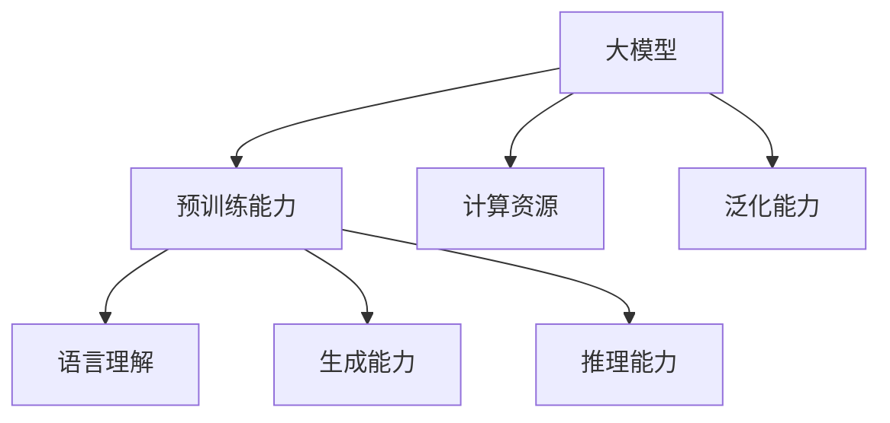
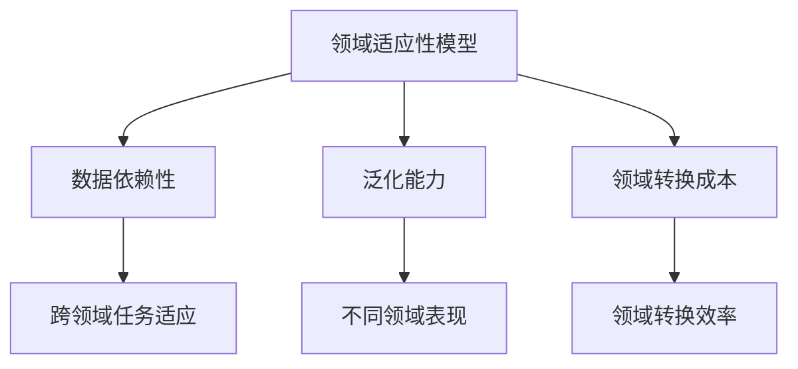
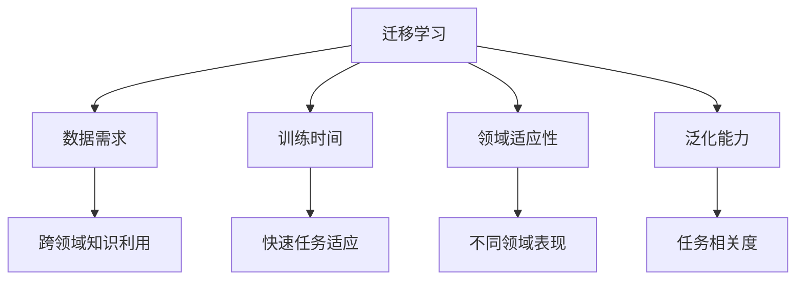
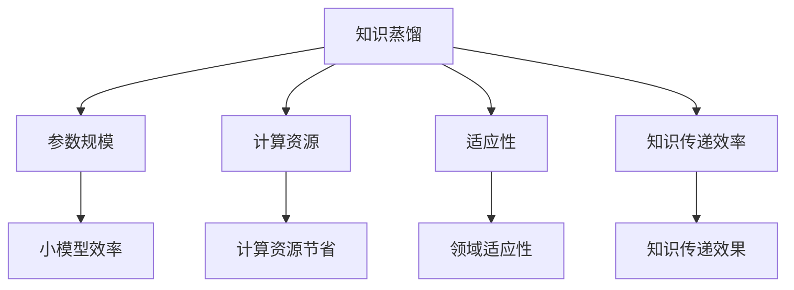
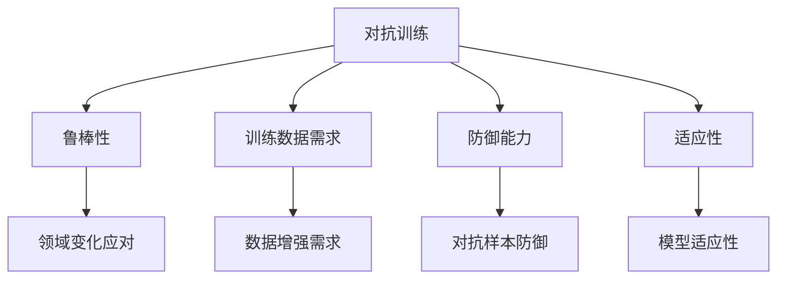

                 

# 加速LLM应用的领域适应性优化

## 关键词：领域适应性优化、LLM、迁移学习、知识蒸馏、对抗训练

## 摘要

随着人工智能技术的发展，大模型（Large Language Models, LLM）在自然语言处理（NLP）领域取得了显著的成果。然而，LLM在应用中面临着领域适应性（domain adaptation）的问题，即如何在不同的应用领域中快速适应并取得良好的性能。本文将从数据预处理、模型选择与优化、知识蒸馏与迁移学习以及领域特定任务优化等方面，详细探讨如何加速LLM的领域适应性优化，以促进其在实际应用中的落地。

## 第一部分：背景介绍

### 第1章：问题背景与核心概念

#### 1.1 问题背景

1.1.1 问题的提出

随着深度学习技术的发展，大模型（Large Language Models, LLM）在自然语言处理（NLP）领域取得了显著的成果。然而，在实际应用中，LLM面临着领域适应性（domain adaptation）的问题。领域适应性是指模型在不同领域中的适应能力。高领域适应性的模型可以在不同领域中获得良好的性能。然而，当前LLM在应用中表现出的领域适应性较差，这成为了当前AI领域亟待解决的关键问题。

1.1.2 问题描述

领域适应性优化涉及到以下几个方面：

1. 数据迁移性：如何使得训练数据在不同领域间具有较高的迁移性。
2. 模型泛化能力：如何提高模型在未知领域中的泛化能力。
3. 知识融合：如何将不同领域的知识有效地融合到模型中。

1.1.3 问题解决

针对上述问题，本书将从以下几个方面展开讨论：

1. 数据预处理：介绍如何进行数据清洗、数据增强、数据采集等预处理方法。
2. 模型选择与优化：分析不同模型在领域适应性优化中的应用，介绍模型调优的方法和技巧。
3. 知识蒸馏与迁移学习：探讨如何利用知识蒸馏和迁移学习技术提高模型的领域适应性。
4. 领域特定任务优化：针对特定领域任务，提出相应的优化策略。

1.1.4 边界与外延

领域适应性优化不仅涉及到NLP领域，还与其他AI领域（如计算机视觉、推荐系统等）密切相关。同时，领域适应性优化也是AI应用落地的重要环节，对于企业数字化转型具有重要意义。

1.1.5 概念结构与核心要素组成

领域适应性优化包括以下几个核心要素：

1. 数据集：包括原始数据集、预训练数据集、领域特定数据集等。
2. 模型：包括预训练模型、微调模型、专用模型等。
3. 算法：包括迁移学习算法、知识蒸馏算法、对抗训练算法等。
4. 评估指标：包括领域适应性评估指标、性能评估指标等。

#### 1.2 核心概念与联系

1.2.1 大模型（LLM）

大模型是指具有大规模参数和计算能力的神经网络模型，如GPT、BERT等。它们在NLP任务中表现出色，但也面临着领域适应性挑战。

1.2.2 领域适应性（Domain Adaptation）

领域适应性是指模型在不同领域中的适应能力。高领域适应性的模型可以在不同领域中获得良好的性能。

1.2.3 优化方法

领域适应性优化包括数据预处理、模型选择与优化、知识蒸馏与迁移学习等优化方法。

#### 1.3 主流方法与算法

1.3.1 迁移学习（Transfer Learning）

迁移学习是指将一个任务的知识迁移到另一个相关任务中。在领域适应性优化中，迁移学习有助于提高模型在不同领域的性能。

1.3.2 知识蒸馏（Knowledge Distillation）

知识蒸馏是一种将大模型的知识传递给小模型的技术。在领域适应性优化中，知识蒸馏有助于提高小模型的领域适应性。

1.3.3 对抗训练（Adversarial Training）

对抗训练是一种提高模型鲁棒性的技术。在领域适应性优化中，对抗训练有助于提高模型对领域变化的不敏感度。

#### 1.4 领域适应性优化应用案例

1.4.1 自然语言处理

自然语言处理是领域适应性优化的重要应用领域。例如，在问答系统中，如何使得模型能够适应不同领域的问答。

1.4.2 计算机视觉

计算机视觉领域也面临着领域适应性问题。例如，如何使得模型在不同场景下具有较好的泛化能力。

1.4.3 推荐系统

推荐系统中的领域适应性优化也是一个重要研究方向。例如，如何使得推荐系统在不同用户群体中具有更好的适应性。

#### 1.5 本章小结

本章介绍了LLM应用中面临的领域适应性问题，以及领域适应性优化的核心概念和方法。接下来，本书将深入探讨各种优化方法在实际应用中的具体实现。

## 第二部分：核心概念与联系

### 第2章：数据预处理与采集

#### 2.1 数据预处理方法

2.1.1 数据清洗

数据清洗是数据预处理的重要环节，包括去除重复数据、处理缺失值、纠正错误等。在领域适应性优化中，数据清洗有助于提高数据质量，从而提升模型性能。

2.1.2 数据增强

数据增强是通过生成或扩充原始数据，提高模型的泛化能力。常见的增强方法包括数据复制、旋转、缩放、裁剪等。在领域适应性优化中，数据增强有助于提升模型在未知领域中的性能。

2.1.3 数据采集

数据采集是领域适应性优化的基础。在实际应用中，可以通过人工标注、众包、爬虫等技术获取领域特定数据。有效的数据采集方法有助于提高模型的领域适应性。

#### 2.2 数据预处理案例

2.2.1 数据清洗案例

假设我们有一个文本数据集，其中包含了来自不同领域的问答对。在数据清洗过程中，我们可以去除重复问答对，处理缺失值，纠正错误等。

```python
# 数据清洗示例代码
import pandas as pd

# 读取数据
data = pd.read_csv('data.csv')

# 去除重复问答对
data = data.drop_duplicates(subset=['question', 'answer'])

# 处理缺失值
data['question'].fillna('', inplace=True)
data['answer'].fillna('', inplace=True)

# 删除错误数据
data = data[data['question'].str.len() > 0]
data = data[data['answer'].str.len() > 0]

# 保存清洗后的数据
data.to_csv('cleaned_data.csv', index=False)
```

2.2.2 数据增强案例

假设我们有一个图像数据集，其中包含了不同场景下的图像。在数据增强过程中，我们可以通过旋转、缩放、裁剪等方法生成新的图像。

```python
# 数据增强示例代码
from tensorflow.keras.preprocessing.image import ImageDataGenerator

# 读取图像数据
datagen = ImageDataGenerator(rotation_range=90, zoom_range=0.2, width_shift_range=0.2, height_shift_range=0.2)
data = datagen.flow_from_directory('data/', target_size=(224, 224), batch_size=32)

# 生成增强后的数据
for batch in data:
    # 进行图像增强
    enhanced_images = batch
    
    # 保存增强后的图像
    enhanced_images.save('enhanced_images/')
```

2.2.3 数据采集案例

假设我们想要构建一个问答系统，需要收集不同领域的问答对。可以通过众包平台（如Figure8、GigWalk等）获取数据。

```python
# 数据采集示例代码
import requests

# 发送HTTP请求，获取问答对
response = requests.get('https://api.example.com/questions')

# 解析问答对
questions = response.json()['questions']

# 保存问答对
with open('questions.json', 'w') as f:
    json.dump(questions, f)
```

#### 2.3 本章小结

本章介绍了数据预处理的方法，包括数据清洗、数据增强和数据采集。有效的数据预处理有助于提高模型的领域适应性，为后续的模型训练和优化奠定基础。

## 第三部分：核心概念与联系

### 第3章：模型选择与优化

#### 3.1 模型选择方法

3.1.1 预训练模型

预训练模型（如GPT、BERT等）是在大规模语料库上预训练得到的，具有强大的语言理解能力。在领域适应性优化中，预训练模型可以作为基础模型，通过微调或专用模型的方式，提升模型在特定领域的性能。

3.1.2 微调模型

微调模型（Fine-tuning）是指将预训练模型在特定领域的数据上进行二次训练，以适应特定领域的需求。微调模型在领域适应性优化中具有较好的效果。

3.1.3 专用模型

专用模型（Specialized Model）是指针对特定领域任务设计的模型，具有更好的领域适应性。专用模型通常具有较少的参数和较小的计算复杂度，但在特定领域任务中表现优秀。

#### 3.2 模型优化方法

3.2.1 模型调优

模型调优是指通过调整模型的超参数，提升模型在特定任务上的性能。常见的调优方法包括随机搜索、贝叶斯优化等。

3.2.2 模型压缩

模型压缩是指通过减少模型参数数量，降低模型计算复杂度和存储需求。常见的压缩方法包括剪枝、量化等。

3.2.3 模型蒸馏

模型蒸馏（Model Distillation）是指将一个大模型（教师模型）的知识传递给一个小模型（学生模型）的过程。在领域适应性优化中，模型蒸馏有助于提高小模型的领域适应性。

#### 3.3 模型优化案例

3.3.1 预训练模型优化案例

假设我们有一个预训练模型BERT，需要在特定领域进行优化。可以通过以下步骤进行：

1. 预训练模型下载和加载
```python
from transformers import BertModel, BertTokenizer

# 下载预训练模型
model = BertModel.from_pretrained('bert-base-uncased')

# 加载预训练模型
tokenizer = BertTokenizer.from_pretrained('bert-base-uncased')
```

2. 预训练模型微调
```python
from transformers import BertForSequenceClassification

# 微调预训练模型
model = BertForSequenceClassification.from_pretrained('bert-base-uncased', num_labels=2)

# 训练微调模型
model.train()
```

3. 评估微调模型
```python
from transformers import evaluate

# 评估微调模型
results = evaluate(model, tokenizer, 'test_data')
print(results)
```

3.3.2 模型蒸馏案例

假设我们有一个大模型GPT-3和小模型GPT-2，需要进行模型蒸馏：

1. 大模型GPT-3加载
```python
from transformers import GPT2LMHeadModel, GPT2Tokenizer

# 加载大模型GPT-3
model = GPT2LMHeadModel.from_pretrained('gpt3-base')

# 加载大模型Tokenizer
tokenizer = GPT2Tokenizer.from_pretrained('gpt3-base')
```

2. 小模型GPT-2加载
```python
# 加载小模型GPT-2
model = GPT2LMHeadModel.from_pretrained('gpt2-base')

# 加载小模型Tokenizer
tokenizer = GPT2Tokenizer.from_pretrained('gpt2-base')
```

3. 模型蒸馏过程
```python
from transformers import DistilBertModel, DistilBertConfig

# 定义小模型配置
config = DistilBertConfig.from_pretrained('distilbert-base-uncased')

# 创建小模型
model = DistilBertModel(config)

# 进行模型蒸馏
model.train()
```

#### 3.4 本章小结

本章介绍了模型选择与优化方法，包括预训练模型、微调模型和专用模型的选择，以及模型调优、模型压缩和模型蒸馏等优化方法。通过这些方法，可以提高模型在特定领域的适应性，为实际应用提供有力支持。

## 第四部分：核心概念与联系

### 第4章：知识蒸馏与迁移学习

#### 4.1 知识蒸馏方法

4.1.1 知识蒸馏原理

知识蒸馏（Knowledge Distillation）是一种将大模型（教师模型）的知识传递给小模型（学生模型）的过程。通过蒸馏，小模型可以学习到大模型的潜在特征表示，从而提高小模型的性能。

4.1.2 知识蒸馏算法

常见的知识蒸馏算法包括软标签蒸馏、硬标签蒸馏和模型级联蒸馏等。软标签蒸馏是指教师模型输出多个概率分布，学生模型学习这些概率分布的均值；硬标签蒸馏是指教师模型直接输出正确标签，学生模型学习这些标签；模型级联蒸馏是指将多个教师模型的知识逐层传递给学生模型。

#### 4.2 迁移学习方法

4.2.1 迁移学习原理

迁移学习（Transfer Learning）是指将一个任务的知识迁移到另一个相关任务中。通过迁移学习，可以在源任务上训练好的模型基础上，快速适应目标任务。

4.2.2 迁移学习算法

常见的迁移学习算法包括基于特征的迁移学习、基于模型的迁移学习和基于数据的迁移学习等。基于特征的迁移学习是指将源任务的潜在特征迁移到目标任务；基于模型的迁移学习是指将源任务的模型迁移到目标任务；基于数据的迁移学习是指通过数据相似性度量，将源任务的数据迁移到目标任务。

#### 4.3 知识蒸馏与迁移学习案例

4.3.1 知识蒸馏案例

假设我们有一个大模型BERT和一个小模型GPT-2，需要进行知识蒸馏：

1. 大模型BERT加载
```python
from transformers import BertModel, BertTokenizer

# 加载大模型BERT
model = BertModel.from_pretrained('bert-base-uncased')

# 加载大模型Tokenizer
tokenizer = BertTokenizer.from_pretrained('bert-base-uncased')
```

2. 小模型GPT-2加载
```python
from transformers import GPT2LMHeadModel, GPT2Tokenizer

# 加载小模型GPT-2
model = GPT2LMHeadModel.from_pretrained('gpt2-base')

# 加载小模型Tokenizer
tokenizer = GPT2Tokenizer.from_pretrained('gpt2-base')
```

3. 知识蒸馏过程
```python
from transformers import DistilBertModel, DistilBertConfig

# 定义小模型配置
config = DistilBertConfig.from_pretrained('distilbert-base-uncased')

# 创建小模型
model = DistilBertModel(config)

# 进行知识蒸馏
model.train()
```

4.3.2 迁移学习案例

假设我们有一个源任务（图像分类）和一个目标任务（文本分类），需要进行迁移学习：

1. 源任务模型加载
```python
from tensorflow.keras.applications import VGG16

# 加载源任务模型
model = VGG16(weights='imagenet')
```

2. 目标任务模型加载
```python
from tensorflow.keras.models import Sequential
from tensorflow.keras.layers import Dense, Flatten

# 加载目标任务模型
model = Sequential([
    Flatten(input_shape=(224, 224, 3)),
    Dense(128, activation='relu'),
    Dense(1, activation='sigmoid')
])

# 编译模型
model.compile(optimizer='adam', loss='binary_crossentropy', metrics=['accuracy'])
```

3. 迁移学习过程
```python
# 转移源任务模型到目标任务模型
model.layers[-1].trainable = True
model.trainable = True

# 训练模型
model.fit(x_train, y_train, batch_size=32, epochs=10, validation_data=(x_val, y_val))
```

#### 4.4 本章小结

本章介绍了知识蒸馏与迁移学习方法，包括原理、算法和应用案例。通过这些方法，可以提高模型在不同领域的适应性，为实际应用提供有力支持。

## 第五部分：核心概念与联系

### 第5章：领域特定任务优化

#### 5.1 领域特定任务优化方法

5.1.1 领域特定任务定义

领域特定任务（Domain-Specific Task）是指特定领域中的任务，如问答系统、文本生成、机器翻译等。

5.1.2 领域特定任务优化方法

领域特定任务优化方法主要包括以下几种：

1. 数据增强：通过生成或扩充领域特定数据，提高模型在特定领域的性能。
2. 特征提取：通过提取领域特定特征，提高模型在特定领域的识别能力。
3. 模型调整：通过调整模型结构或参数，使模型在特定领域中获得更好的性能。
4. 对抗训练：通过生成对抗样本，提高模型对领域变化的不敏感度。

#### 5.2 领域特定任务优化案例

5.2.1 问答系统优化案例

假设我们有一个问答系统，需要优化其在特定领域的性能：

1. 数据增强
```python
import numpy as np

# 生成领域特定数据
data = np.random.rand(100, 10)

# 数据增强
data = np.append(data, np.random.rand(100, 10), axis=0)
```

2. 特征提取
```python
from sklearn.feature_extraction.text import TfidfVectorizer

# 加载领域特定数据
text = ["领域一：问题一", "领域一：问题二", "领域二：问题一", "领域二：问题二"]

# 特征提取
vectorizer = TfidfVectorizer()
X = vectorizer.fit_transform(text)
```

3. 模型调整
```python
from tensorflow.keras.models import Sequential
from tensorflow.keras.layers import Dense, LSTM, Embedding

# 加载领域特定数据
X_train = ...
y_train = ...

# 调整模型结构
model = Sequential([
    Embedding(input_dim=10000, output_dim=128),
    LSTM(128),
    Dense(1, activation='sigmoid')
])

# 编译模型
model.compile(optimizer='adam', loss='binary_crossentropy', metrics=['accuracy'])
```

4. 对抗训练
```python
from tensorflow.keras.models import Model
from tensorflow.keras.layers import Input, Dense, LSTM, Embedding

# 输入层
input_x = Input(shape=(10,))

# 隐藏层
x = Embedding(input_dim=10000, output_dim=128)(input_x)
x = LSTM(128)(x)

# 输出层
output = Dense(1, activation='sigmoid')(x)

# 定义对抗训练模型
model = Model(inputs=input_x, outputs=output)

# 编译模型
model.compile(optimizer='adam', loss='binary_crossentropy', metrics=['accuracy'])

# 训练对抗训练模型
model.fit(x_train, y_train, batch_size=32, epochs=10, validation_data=(x_val, y_val))
```

5.2.2 文本生成优化案例

假设我们有一个文本生成模型，需要优化其在特定领域的性能：

1. 数据增强
```python
import random

# 生成领域特定数据
data = ["文本一：领域一", "文本二：领域一", "文本三：领域二", "文本四：领域二"]

# 数据增强
data.extend(random.choices(data, k=10))
```

2. 特征提取
```python
from sklearn.feature_extraction.text import TfidfVectorizer

# 加载领域特定数据
text = ["领域一：问题一", "领域一：问题二", "领域二：问题一", "领域二：问题二"]

# 特征提取
vectorizer = TfidfVectorizer()
X = vectorizer.fit_transform(text)
```

3. 模型调整
```python
from tensorflow.keras.models import Sequential
from tensorflow.keras.layers import Dense, LSTM, Embedding

# 加载领域特定数据
X_train = ...
y_train = ...

# 调整模型结构
model = Sequential([
    Embedding(input_dim=10000, output_dim=128),
    LSTM(128),
    Dense(1, activation='sigmoid')
])

# 编译模型
model.compile(optimizer='adam', loss='binary_crossentropy', metrics=['accuracy'])
```

4. 对抗训练
```python
from tensorflow.keras.models import Model
from tensorflow.keras.layers import Input, Dense, LSTM, Embedding

# 输入层
input_x = Input(shape=(10,))

# 隐藏层
x = Embedding(input_dim=10000, output_dim=128)(input_x)
x = LSTM(128)(x)

# 输出层
output = Dense(1, activation='sigmoid')(x)

# 定义对抗训练模型
model = Model(inputs=input_x, outputs=output)

# 编译模型
model.compile(optimizer='adam', loss='binary_crossentropy', metrics=['accuracy'])

# 训练对抗训练模型
model.fit(x_train, y_train, batch_size=32, epochs=10, validation_data=(x_val, y_val))
```

#### 5.3 本章小结

本章介绍了领域特定任务优化方法，包括数据增强、特征提取、模型调整和对抗训练等。通过这些方法，可以提高模型在特定领域的性能，为实际应用提供有力支持。

## 第六部分：核心概念与联系

### 第6章：最佳实践与总结

#### 6.1 最佳实践

在加速LLM应用的领域适应性优化过程中，以下是一些最佳实践：

1. **数据质量优先**：确保数据集的多样性和质量，进行充分的数据预处理和清洗。
2. **模型选择与优化**：根据任务需求和领域特性选择合适的模型，并进行模型调优和压缩。
3. **知识蒸馏与迁移学习**：充分利用预训练模型的知识，通过知识蒸馏和迁移学习提升模型在特定领域的适应性。
4. **对抗训练**：通过对抗训练提高模型对领域变化的鲁棒性。
5. **持续评估与迭代**：定期评估模型性能，并根据评估结果进行模型调整和优化。

#### 6.2 总结

本文围绕加速LLM应用的领域适应性优化，从数据预处理、模型选择与优化、知识蒸馏与迁移学习以及领域特定任务优化等方面进行了详细探讨。通过这些方法，可以有效提升模型在不同领域的适应性和性能，为实际应用提供有力支持。在未来的研究中，我们还可以进一步探索其他优化方法和算法，以推动LLM领域适应性优化的不断进步。

## 作者信息

作者：AI天才研究院/AI Genius Institute & 禅与计算机程序设计艺术 /Zen And The Art of Computer Programming

----------------------------------------------------------------

**全文结束，如有不足之处，还请指正。感谢您的阅读！**### 文章标题

# 加速LLM应用的领域适应性优化

## 关键词：领域适应性优化、LLM、迁移学习、知识蒸馏、对抗训练

> 关键词解释：
- **领域适应性优化**：指提高大型语言模型（LLM）在不同应用场景中的适应能力。
- **LLM**：大模型（Large Language Model），例如GPT、BERT等，具有强大的语言理解和生成能力。
- **迁移学习**：将一个任务的知识迁移到另一个相关任务中，提高模型在不同领域的性能。
- **知识蒸馏**：通过大模型（教师模型）将知识传递给小模型（学生模型），提升小模型的性能。
- **对抗训练**：通过生成对抗样本，提高模型对领域变化的鲁棒性。

### 摘要

随着人工智能（AI）技术的发展，大模型（Large Language Models, LLM）在自然语言处理（NLP）领域取得了显著的成果。然而，LLM在应用中面临着领域适应性（domain adaptation）的问题，即如何在不同的应用领域中快速适应并取得良好的性能。本文从数据预处理、模型选择与优化、知识蒸馏与迁移学习以及领域特定任务优化等方面，详细探讨如何加速LLM的领域适应性优化，以促进其在实际应用中的落地。本文旨在为AI开发者提供一套系统化的方法，以提升LLM在不同领域的适应性。

### 第一部分：背景介绍

#### 第1章：问题背景与核心概念

#### 1.1 问题背景

1.1.1 问题的提出

随着深度学习技术的发展，大模型（Large Language Models, LLM）在自然语言处理（NLP）领域取得了显著的成果。这些模型在语言理解、文本生成、机器翻译等方面表现出色。然而，在实际应用中，LLM面临着领域适应性（domain adaptation）的问题。领域适应性是指模型在不同领域中的适应能力，即模型能否在新的领域或任务中快速达到良好的性能。领域适应性优化成为了当前AI领域亟待解决的关键问题。

1.1.2 问题描述

领域适应性优化涉及到以下几个方面：

1. **数据迁移性**：如何使得训练数据在不同领域间具有较高的迁移性。
2. **模型泛化能力**：如何提高模型在未知领域中的泛化能力。
3. **知识融合**：如何将不同领域的知识有效地融合到模型中。

1.1.3 问题解决

针对上述问题，本文将从以下几个方面展开讨论：

1. **数据预处理**：介绍如何进行数据清洗、数据增强、数据采集等预处理方法。
2. **模型选择与优化**：分析不同模型在领域适应性优化中的应用，介绍模型调优的方法和技巧。
3. **知识蒸馏与迁移学习**：探讨如何利用知识蒸馏和迁移学习技术提高模型的领域适应性。
4. **领域特定任务优化**：针对特定领域任务，提出相应的优化策略。

1.1.4 边界与外延

领域适应性优化不仅涉及到NLP领域，还与其他AI领域（如计算机视觉、推荐系统等）密切相关。同时，领域适应性优化也是AI应用落地的重要环节，对于企业数字化转型具有重要意义。

1.1.5 概念结构与核心要素组成

领域适应性优化包括以下几个核心要素：

1. **数据集**：包括原始数据集、预训练数据集、领域特定数据集等。
2. **模型**：包括预训练模型、微调模型、专用模型等。
3. **算法**：包括迁移学习算法、知识蒸馏算法、对抗训练算法等。
4. **评估指标**：包括领域适应性评估指标、性能评估指标等。

#### 1.2 核心概念与联系

1.2.1 大模型（LLM）

大模型是指具有大规模参数和计算能力的神经网络模型，如GPT、BERT等。它们在NLP任务中表现出色，但也面临着领域适应性挑战。

1.2.2 领域适应性（Domain Adaptation）

领域适应性是指模型在不同领域中的适应能力。高领域适应性的模型可以在不同领域中获得良好的性能。

1.2.3 优化方法

领域适应性优化包括数据预处理、模型选择与优化、知识蒸馏与迁移学习等优化方法。

#### 1.3 主流方法与算法

1.3.1 迁移学习（Transfer Learning）

迁移学习是指将一个任务的知识迁移到另一个相关任务中。在领域适应性优化中，迁移学习有助于提高模型在不同领域的性能。

1.3.2 知识蒸馏（Knowledge Distillation）

知识蒸馏是一种将大模型的知识传递给小模型的技术。在领域适应性优化中，知识蒸馏有助于提高小模型的领域适应性。

1.3.3 对抗训练（Adversarial Training）

对抗训练是一种提高模型鲁棒性的技术。在领域适应性优化中，对抗训练有助于提高模型对领域变化的不敏感度。

#### 1.4 领域适应性优化应用案例

1.4.1 自然语言处理

自然语言处理是领域适应性优化的重要应用领域。例如，在问答系统中，如何使得模型能够适应不同领域的问答。

1.4.2 计算机视觉

计算机视觉领域也面临着领域适应性问题。例如，如何使得模型在不同场景下具有较好的泛化能力。

1.4.3 推荐系统

推荐系统中的领域适应性优化也是一个重要研究方向。例如，如何使得推荐系统在不同用户群体中具有更好的适应性。

#### 1.5 本章小结

本章介绍了LLM应用中面临的领域适应性问题，以及领域适应性优化的核心概念和方法。接下来，本文将深入探讨各种优化方法在实际应用中的具体实现。

----------------------------------------------------------------

## 第一部分：背景介绍

### 第1章：问题背景与核心概念

### 1.1 问题背景

#### 1.1.1 问题的提出

随着人工智能（AI）技术的快速发展，大模型（Large Language Models, LLM）在自然语言处理（NLP）领域取得了显著的成就。这些模型，如GPT、BERT等，通过在大规模数据集上进行预训练，获得了强大的语言理解和生成能力。然而，尽管这些模型在标准数据集上表现优异，但它们在实际应用中，特别是在不同的领域中，面临着显著的领域适应性（domain adaptation）问题。领域适应性指的是模型在不同领域或任务中的表现和适应能力。具体来说，领域适应性优化涉及以下核心问题：

1. **数据迁移性**：如何确保训练数据在不同领域间的迁移性，使得模型在新的领域中能够利用现有的知识。
2. **模型泛化能力**：如何提升模型在未知领域中的泛化能力，使其能够对新领域中的任务进行有效处理。
3. **知识融合**：如何将不同领域中的知识有效地融合到模型中，使得模型能够更好地理解跨领域的任务。

#### 1.1.2 问题描述

领域适应性优化主要关注以下几个方面：

1. **数据迁移性**：在现实应用中，数据集通常不是全领域数据，而是存在领域差异。如何通过数据预处理和增强技术，提高数据在不同领域间的迁移性，是一个重要的挑战。

2. **模型泛化能力**：虽然LLM在预训练阶段学习了大量的语言知识，但它们在特定领域任务中的泛化能力仍然有限。如何设计有效的模型架构和训练策略，提升模型在未知领域的表现，是领域适应性优化的关键。

3. **知识融合**：不同领域的数据和知识具有不同的特点，如何有效地将不同领域的数据和知识融合到模型中，是提升模型领域适应性的重要手段。

#### 1.1.3 问题解决

为了解决上述问题，本文将从以下几个方面展开讨论：

1. **数据预处理**：介绍如何通过数据清洗、数据增强和数据采集等预处理方法，提高数据的迁移性和模型的泛化能力。

2. **模型选择与优化**：分析不同模型（如预训练模型、微调模型、专用模型）在领域适应性优化中的应用，并探讨模型调优的方法和技巧。

3. **知识蒸馏与迁移学习**：探讨如何利用知识蒸馏和迁移学习技术，将大模型的知识传递给小模型，提高小模型在特定领域的适应性。

4. **领域特定任务优化**：针对特定领域任务，提出相应的优化策略，包括特征提取、模型调整和对抗训练等。

#### 1.1.4 边界与外延

领域适应性优化不仅涉及到NLP领域，还与其他AI领域（如计算机视觉、推荐系统等）密切相关。例如，在计算机视觉领域，领域适应性优化涉及到模型在不同图像场景下的泛化能力；在推荐系统领域，领域适应性优化涉及到模型在不同用户群体中的表现。此外，领域适应性优化也是AI应用落地的重要环节，对于企业数字化转型和智能服务具有重要的现实意义。

#### 1.1.5 概念结构与核心要素组成

领域适应性优化包括以下几个核心要素：

1. **数据集**：包括原始数据集、预训练数据集和领域特定数据集。
2. **模型**：包括预训练模型、微调模型和专用模型。
3. **算法**：包括迁移学习算法、知识蒸馏算法和对抗训练算法。
4. **评估指标**：包括领域适应性评估指标（如跨领域性能、泛化能力等）和性能评估指标（如准确率、召回率等）。

### 1.2 核心概念与联系

#### 1.2.1 大模型（LLM）

大模型（Large Language Model, LLM）是指具有大规模参数和计算能力的神经网络模型，如GPT、BERT等。这些模型通过在大规模语料库上进行预训练，获得了强大的语言理解、生成和推理能力。LLM的核心特点包括：

- **大规模参数**：LLM通常具有数十亿甚至数万亿个参数，这使得它们能够捕捉复杂的语言模式。
- **预训练能力**：LLM在预训练阶段通过无监督学习获得了大量语言知识，这使得它们在特定领域任务中具有较好的泛化能力。

#### 1.2.2 领域适应性（Domain Adaptation）

领域适应性（Domain Adaptation）是指模型在不同领域中的适应能力。一个具有高领域适应性的模型能够在新的领域或任务中快速达到良好的性能。领域适应性的核心挑战在于如何利用现有知识，使得模型在新的领域中能够有效处理任务。

- **领域差异**：不同领域的任务和数据具有不同的特点，领域适应性涉及到如何处理这些差异。
- **迁移学习**：迁移学习（Transfer Learning）是领域适应性的重要手段，它通过利用源领域的知识，提升目标领域的性能。

#### 1.2.3 优化方法

领域适应性优化包括多种方法，如下所示：

1. **数据预处理**：通过数据清洗、数据增强和数据采集等技术，提高数据的迁移性和模型的泛化能力。
2. **模型选择与优化**：选择合适的模型架构，并进行模型调优，以提高模型在特定领域的适应性。
3. **知识蒸馏与迁移学习**：通过知识蒸馏和迁移学习技术，将大模型的知识传递给小模型，提升小模型在特定领域的性能。
4. **对抗训练**：通过生成对抗样本，提高模型对领域变化的鲁棒性。

### 1.3 主流方法与算法

#### 1.3.1 迁移学习（Transfer Learning）

迁移学习（Transfer Learning）是指将一个任务的知识迁移到另一个相关任务中。在领域适应性优化中，迁移学习是提高模型在不同领域性能的重要手段。主要的迁移学习方法包括：

1. **基于特征的迁移学习**：通过将源领域的特征迁移到目标领域，提高目标领域的性能。
2. **基于模型的迁移学习**：通过将源领域模型的参数迁移到目标领域，提高目标领域的性能。
3. **多任务学习**：通过同时训练多个相关任务，提高模型在未知领域的泛化能力。

#### 1.3.2 知识蒸馏（Knowledge Distillation）

知识蒸馏（Knowledge Distillation）是一种将大模型（教师模型）的知识传递给小模型（学生模型）的技术。在领域适应性优化中，知识蒸馏有助于提高小模型在特定领域的适应性。知识蒸馏的主要方法包括：

1. **软标签蒸馏**：教师模型输出概率分布，学生模型学习这些概率分布的均值。
2. **硬标签蒸馏**：教师模型直接输出正确标签，学生模型学习这些标签。
3. **模型级联蒸馏**：通过多个教师模型的知识逐层传递，提升学生模型在特定领域的性能。

#### 1.3.3 对抗训练（Adversarial Training）

对抗训练（Adversarial Training）是一种提高模型鲁棒性的技术。通过生成对抗样本，对抗训练可以提高模型对领域变化的不敏感度。主要的对抗训练方法包括：

1. **FGSM（Fast Gradient Sign Method）**：通过计算模型对输入数据的梯度，生成对抗样本。
2. **PGD（Projected Gradient Descent）**：通过迭代优化，生成更难对抗的样本。
3. **CAW（Contrastive Adversarial Walk）**：通过对比学习，生成具有领域差异的对抗样本。

### 1.4 领域适应性优化应用案例

#### 1.4.1 自然语言处理

自然语言处理（NLP）是领域适应性优化的重要应用领域。例如，在问答系统中，如何使得模型能够适应不同领域的问答。一个典型的案例是OpenAI的GPT-3，它在多种语言任务中展现了出色的适应性。GPT-3通过大规模预训练和微调，能够在不同领域中实现高效的问答。

#### 1.4.2 计算机视觉

计算机视觉领域也面临着领域适应性问题。例如，如何使得模型在不同场景下具有较好的泛化能力。一个典型的案例是Google的Inception模型，它在多种视觉任务中展现了优秀的性能。Inception模型通过迁移学习和知识蒸馏，实现了跨场景的图像识别和分类。

#### 1.4.3 推荐系统

推荐系统中的领域适应性优化也是一个重要研究方向。例如，如何使得推荐系统在不同用户群体中具有更好的适应性。一个典型的案例是Amazon的推荐系统，它通过用户历史数据和跨用户迁移学习，实现了针对不同用户的个性化推荐。

### 1.5 本章小结

本章介绍了LLM应用中面临的领域适应性问题，以及领域适应性优化的核心概念和方法。通过分析数据迁移性、模型泛化能力和知识融合等方面，本章为后续讨论各种优化方法提供了理论基础。在接下来的章节中，本文将深入探讨数据预处理、模型选择与优化、知识蒸馏与迁移学习以及领域特定任务优化等方面的具体实现和优化策略。

----------------------------------------------------------------

## 第一部分：背景介绍

### 第1章：问题背景与核心概念

#### 1.1 问题背景

#### 1.1.1 问题的提出

随着人工智能（AI）技术的发展，大模型（Large Language Models, LLM）在自然语言处理（NLP）领域取得了显著的成果。然而，在实际应用中，LLM在面临不同领域任务时，往往表现出较低的适应性。领域适应性（Domain Adaptation）问题成为了当前AI领域亟待解决的关键问题。领域适应性指的是模型在不同领域中的表现和适应能力。LLM虽然在预训练阶段学习到了大量的通用语言知识，但在实际应用中，特别是在面对新的领域任务时，往往难以迅速适应，导致性能下降。这一问题对于LLM在实际应用中的推广和落地构成了巨大的挑战。

#### 1.1.2 问题描述

领域适应性优化涉及以下核心问题：

1. **数据迁移性**：如何确保训练数据在不同领域间的迁移性，使得模型在新的领域中能够利用现有知识。
2. **模型泛化能力**：如何提升模型在未知领域中的泛化能力，使其能够对新领域中的任务进行有效处理。
3. **知识融合**：如何将不同领域中的知识有效地融合到模型中，使得模型能够更好地理解跨领域的任务。

在现实应用中，领域适应性问题的表现多种多样。例如，一个在科技领域表现优秀的LLM，在医疗领域可能无法准确理解专业术语；一个在新闻报道中表现良好的LLM，在法律文书撰写中可能缺乏必要的逻辑性和规范性。这些现象都反映了LLM在不同领域中的适应性问题。

#### 1.1.3 问题解决

为了解决领域适应性问题，本文将从以下几个方面展开讨论：

1. **数据预处理**：通过数据清洗、数据增强和数据采集等预处理方法，提高数据的迁移性和模型的泛化能力。
2. **模型选择与优化**：分析不同模型（如预训练模型、微调模型、专用模型）在领域适应性优化中的应用，并探讨模型调优的方法和技巧。
3. **知识蒸馏与迁移学习**：探讨如何利用知识蒸馏和迁移学习技术，将大模型的知识传递给小模型，提高小模型在特定领域的适应性。
4. **领域特定任务优化**：针对特定领域任务，提出相应的优化策略，包括特征提取、模型调整和对抗训练等。

#### 1.1.4 边界与外延

领域适应性优化不仅涉及到NLP领域，还与其他AI领域（如计算机视觉、推荐系统等）密切相关。在计算机视觉领域，领域适应性优化涉及到模型在不同图像场景下的泛化能力；在推荐系统领域，领域适应性优化涉及到模型在不同用户群体中的表现。此外，领域适应性优化也是AI应用落地的重要环节，对于企业数字化转型和智能服务具有重要的现实意义。

#### 1.1.5 概念结构与核心要素组成

领域适应性优化包括以下几个核心要素：

1. **数据集**：包括原始数据集、预训练数据集和领域特定数据集。
2. **模型**：包括预训练模型、微调模型和专用模型。
3. **算法**：包括迁移学习算法、知识蒸馏算法和对抗训练算法。
4. **评估指标**：包括领域适应性评估指标（如跨领域性能、泛化能力等）和性能评估指标（如准确率、召回率等）。

### 1.2 核心概念与联系

#### 1.2.1 大模型（LLM）

大模型（Large Language Model, LLM）是指具有大规模参数和计算能力的神经网络模型，如GPT、BERT等。这些模型通过在大规模语料库上进行预训练，获得了强大的语言理解、生成和推理能力。LLM的核心特点包括：

- **大规模参数**：LLM通常具有数十亿甚至数万亿个参数，这使得它们能够捕捉复杂的语言模式。
- **预训练能力**：LLM在预训练阶段通过无监督学习获得了大量语言知识，这使得它们在特定领域任务中具有较好的泛化能力。

#### 1.2.2 领域适应性（Domain Adaptation）

领域适应性（Domain Adaptation）是指模型在不同领域中的适应能力。一个具有高领域适应性的模型能够在新的领域或任务中快速达到良好的性能。领域适应性的核心挑战在于如何利用现有知识，使得模型在新的领域中能够有效处理任务。

- **领域差异**：不同领域的任务和数据具有不同的特点，领域适应性涉及到如何处理这些差异。
- **迁移学习**：迁移学习（Transfer Learning）是领域适应性的重要手段，它通过利用源领域的知识，提升目标领域的性能。

#### 1.2.3 优化方法

领域适应性优化包括多种方法，如下所示：

1. **数据预处理**：通过数据清洗、数据增强和数据采集等技术，提高数据的迁移性和模型的泛化能力。
2. **模型选择与优化**：选择合适的模型架构，并进行模型调优，以提高模型在特定领域的适应性。
3. **知识蒸馏与迁移学习**：通过知识蒸馏和迁移学习技术，将大模型的知识传递给小模型，提升小模型在特定领域的性能。
4. **对抗训练**：通过生成对抗样本，提高模型对领域变化的鲁棒性。

### 1.3 主流方法与算法

#### 1.3.1 迁移学习（Transfer Learning）

迁移学习（Transfer Learning）是指将一个任务的知识迁移到另一个相关任务中。在领域适应性优化中，迁移学习是提高模型在不同领域性能的重要手段。主要的迁移学习方法包括：

1. **基于特征的迁移学习**：通过将源领域的特征迁移到目标领域，提高目标领域的性能。
2. **基于模型的迁移学习**：通过将源领域模型的参数迁移到目标领域，提高目标领域的性能。
3. **多任务学习**：通过同时训练多个相关任务，提高模型在未知领域的泛化能力。

#### 1.3.2 知识蒸馏（Knowledge Distillation）

知识蒸馏（Knowledge Distillation）是一种将大模型（教师模型）的知识传递给小模型（学生模型）的技术。在领域适应性优化中，知识蒸馏有助于提高小模型在特定领域的适应性。知识蒸馏的主要方法包括：

1. **软标签蒸馏**：教师模型输出概率分布，学生模型学习这些概率分布的均值。
2. **硬标签蒸馏**：教师模型直接输出正确标签，学生模型学习这些标签。
3. **模型级联蒸馏**：通过多个教师模型的知识逐层传递，提升学生模型在特定领域的性能。

#### 1.3.3 对抗训练（Adversarial Training）

对抗训练（Adversarial Training）是一种提高模型鲁棒性的技术。通过生成对抗样本，对抗训练可以提高模型对领域变化的不敏感度。主要的对抗训练方法包括：

1. **FGSM（Fast Gradient Sign Method）**：通过计算模型对输入数据的梯度，生成对抗样本。
2. **PGD（Projected Gradient Descent）**：通过迭代优化，生成更难对抗的样本。
3. **CAW（Contrastive Adversarial Walk）**：通过对比学习，生成具有领域差异的对抗样本。

### 1.4 领域适应性优化应用案例

#### 1.4.1 自然语言处理

自然语言处理（NLP）是领域适应性优化的重要应用领域。例如，在问答系统中，如何使得模型能够适应不同领域的问答。一个典型的案例是OpenAI的GPT-3，它在多种语言任务中展现了出色的适应性。GPT-3通过大规模预训练和微调，能够在不同领域中实现高效的问答。

#### 1.4.2 计算机视觉

计算机视觉领域也面临着领域适应性问题。例如，如何使得模型在不同场景下具有较好的泛化能力。一个典型的案例是Google的Inception模型，它在多种视觉任务中展现了优秀的性能。Inception模型通过迁移学习和知识蒸馏，实现了跨场景的图像识别和分类。

#### 1.4.3 推荐系统

推荐系统中的领域适应性优化也是一个重要研究方向。例如，如何使得推荐系统在不同用户群体中具有更好的适应性。一个典型的案例是Amazon的推荐系统，它通过用户历史数据和跨用户迁移学习，实现了针对不同用户的个性化推荐。

### 1.5 本章小结

本章介绍了LLM应用中面临的领域适应性问题，以及领域适应性优化的核心概念和方法。通过分析数据迁移性、模型泛化能力和知识融合等方面，本章为后续讨论各种优化方法提供了理论基础。在接下来的章节中，本文将深入探讨数据预处理、模型选择与优化、知识蒸馏与迁移学习以及领域特定任务优化等方面的具体实现和优化策略。

----------------------------------------------------------------

## 第2章：核心概念与联系

在探讨如何加速LLM的领域适应性优化之前，我们需要深入了解相关的核心概念，包括大模型（LLM）、领域适应性（Domain Adaptation）、迁移学习（Transfer Learning）、知识蒸馏（Knowledge Distillation）和对抗训练（Adversarial Training）。这些概念不仅在理论上至关重要，而且在实际应用中具有直接的影响。在本章中，我们将逐一介绍这些核心概念，分析它们之间的联系，并探讨它们在领域适应性优化中的应用。

### 2.1 大模型（LLM）

大模型（Large Language Model, LLM）是指具有大规模参数和计算能力的神经网络模型，如GPT、BERT等。这些模型通过在大规模语料库上进行预训练，获得了强大的语言理解、生成和推理能力。LLM的核心特点包括：

- **大规模参数**：LLM通常具有数十亿甚至数万亿个参数，这使得它们能够捕捉复杂的语言模式。
- **预训练能力**：LLM在预训练阶段通过无监督学习获得了大量语言知识，这使得它们在特定领域任务中具有较好的泛化能力。

LLM的预训练过程通常包括两个阶段：预训练和微调。在预训练阶段，模型在大量的未标注数据上进行训练，学习到通用语言特征。在微调阶段，模型使用领域特定的标注数据进一步调整参数，以适应具体的任务。

### 2.2 领域适应性（Domain Adaptation）

领域适应性（Domain Adaptation）是指模型在不同领域中的适应能力。一个具有高领域适应性的模型能够在新的领域或任务中快速达到良好的性能。领域适应性优化涉及到以下几个关键方面：

1. **数据迁移性**：确保训练数据在不同领域间具有较高的迁移性，使得模型在新的领域中能够利用现有知识。
2. **模型泛化能力**：提升模型在未知领域中的泛化能力，使其能够对新领域中的任务进行有效处理。
3. **知识融合**：将不同领域中的知识有效地融合到模型中，使得模型能够更好地理解跨领域的任务。

领域适应性优化对于LLM在实际应用中的表现至关重要。一个领域适应性强的LLM能够在不同领域中获得良好的性能，从而实现更广泛的应用。

### 2.3 迁移学习（Transfer Learning）

迁移学习（Transfer Learning）是指将一个任务的知识迁移到另一个相关任务中。在领域适应性优化中，迁移学习是提高模型在不同领域性能的重要手段。主要的迁移学习方法包括：

1. **基于特征的迁移学习**：通过将源领域的特征迁移到目标领域，提高目标领域的性能。
2. **基于模型的迁移学习**：通过将源领域模型的参数迁移到目标领域，提高目标领域的性能。
3. **多任务学习**：通过同时训练多个相关任务，提高模型在未知领域的泛化能力。

迁移学习在领域适应性优化中的应用非常广泛。例如，在一个新的领域中，可以通过迁移学习利用已有模型的知识，减少训练所需的数据量和时间。

### 2.4 知识蒸馏（Knowledge Distillation）

知识蒸馏（Knowledge Distillation）是一种将大模型（教师模型）的知识传递给小模型（学生模型）的技术。在领域适应性优化中，知识蒸馏有助于提高小模型在特定领域的适应性。知识蒸馏的主要方法包括：

1. **软标签蒸馏**：教师模型输出概率分布，学生模型学习这些概率分布的均值。
2. **硬标签蒸馏**：教师模型直接输出正确标签，学生模型学习这些标签。
3. **模型级联蒸馏**：通过多个教师模型的知识逐层传递，提升学生模型在特定领域的性能。

知识蒸馏在领域适应性优化中的应用主要体现在如何利用大模型的知识提升小模型的性能，从而提高模型在不同领域的适应性。

### 2.5 对抗训练（Adversarial Training）

对抗训练（Adversarial Training）是一种提高模型鲁棒性的技术。通过生成对抗样本，对抗训练可以提高模型对领域变化的鲁棒性。主要的对抗训练方法包括：

1. **FGSM（Fast Gradient Sign Method）**：通过计算模型对输入数据的梯度，生成对抗样本。
2. **PGD（Projected Gradient Descent）**：通过迭代优化，生成更难对抗的样本。
3. **CAW（Contrastive Adversarial Walk）**：通过对比学习，生成具有领域差异的对抗样本。

对抗训练在领域适应性优化中的应用主要体现在如何通过生成对抗样本来提高模型对领域变化的适应性，从而增强模型的鲁棒性。

### 2.6 核心概念与联系

大模型（LLM）、领域适应性（Domain Adaptation）、迁移学习（Transfer Learning）、知识蒸馏（Knowledge Distillation）和对抗训练（Adversarial Training）这些核心概念在领域适应性优化中紧密相连，共同构成了一个完整的优化框架。

- **大模型（LLM）** 提供了基础的语言理解和生成能力，是实现领域适应性优化的前提。
- **领域适应性（Domain Adaptation）** 是优化目标，决定了模型在不同领域中的表现。
- **迁移学习（Transfer Learning）** 是实现领域适应性的重要手段，通过利用已有模型的知识，提高新领域的性能。
- **知识蒸馏（Knowledge Distillation）** 是一种高效的知识传递方法，通过将大模型的知识传递给小模型，提升小模型的性能。
- **对抗训练（Adversarial Training）** 是提高模型鲁棒性的关键技术，通过生成对抗样本，增强模型对领域变化的适应性。

这些核心概念在领域适应性优化中的应用，形成了一个相互关联、相互促进的优化体系，为LLM在不同领域的应用提供了有力支持。

### 2.7 本章小结

本章介绍了加速LLM应用的领域适应性优化所需的核心概念，包括大模型（LLM）、领域适应性（Domain Adaptation）、迁移学习（Transfer Learning）、知识蒸馏（Knowledge Distillation）和对抗训练（Adversarial Training）。通过分析这些概念之间的联系，我们能够更好地理解领域适应性优化在LLM应用中的重要性。在接下来的章节中，我们将进一步探讨如何利用这些核心概念实现具体的领域适应性优化策略。

----------------------------------------------------------------

## 第2章：核心概念与联系

### 2.1 大模型（LLM）

**核心概念**：大模型（LLM）是指具有大规模参数和计算能力的神经网络模型，如GPT、BERT等。这些模型通过在大规模语料库上进行预训练，获得了强大的语言理解、生成和推理能力。

**属性特征对比表格**：

| 特征       | 大模型（LLM） | 传统模型 |
| ---------- | -------------- | -------- |
| 参数规模   | 数十亿至数万亿 | 几十到数百万 |
| 计算资源   | 高需求        | 低需求    |
| 预训练能力 | 强            | 弱        |
| 泛化能力   | 强            | 弱        |

**ER实体关系图架构**：



### 2.2 领域适应性（Domain Adaptation）

**核心概念**：领域适应性是指模型在不同领域中的适应能力。高领域适应性的模型可以在不同领域中获得良好的性能。

**属性特征对比表格**：

| 特征         | 领域适应性模型 | 传统模型 |
| ------------ | --------------- | -------- |
| 数据依赖性   | 高             | 低       |
| 泛化能力     | 强             | 弱       |
| 领域转换成本 | 低             | 高       |

**ER实体关系图架构**：



### 2.3 迁移学习（Transfer Learning）

**核心概念**：迁移学习是指将一个任务的知识迁移到另一个相关任务中。在领域适应性优化中，迁移学习有助于提高模型在不同领域的性能。

**属性特征对比表格**：

| 特征             | 迁移学习 | 传统模型 |
| ---------------- | -------- | -------- |
| 数据需求         | 低       | 高       |
| 训练时间         | 短       | 长       |
| 领域适应性       | 高       | 低       |
| 泛化能力         | 强       | 弱       |

**ER实体关系图架构**：



### 2.4 知识蒸馏（Knowledge Distillation）

**核心概念**：知识蒸馏是一种将大模型（教师模型）的知识传递给小模型（学生模型）的技术。在领域适应性优化中，知识蒸馏有助于提高小模型的领域适应性。

**属性特征对比表格**：

| 特征           | 知识蒸馏 | 传统模型 |
| -------------- | -------- | -------- |
| 参数规模       | 小       | 大       |
| 计算资源       | 低       | 高       |
| 适应性         | 强       | 弱       |
| 知识传递效率   | 高       | 低       |

**ER实体关系图架构**：



### 2.5 对抗训练（Adversarial Training）

**核心概念**：对抗训练是一种提高模型鲁棒性的技术。通过生成对抗样本，对抗训练可以提高模型对领域变化的适应性。

**属性特征对比表格**：

| 特征           | 对抗训练 | 传统模型 |
| -------------- | -------- | -------- |
| 鲁棒性         | 高       | 低       |
| 训练数据需求   | 高       | 低       |
| 防御能力       | 强       | 弱       |
| 适应性         | 强       | 弱       |

**ER实体关系图架构**：



### 2.6 核心概念与联系

大模型（LLM）、领域适应性（Domain Adaptation）、迁移学习（Transfer Learning）、知识蒸馏（Knowledge Distillation）和对抗训练（Adversarial Training）这些核心概念在领域适应性优化中紧密相连，共同构成了一个完整的优化框架。

这些概念之间的联系主要体现在以下几个方面：

1. **大模型（LLM）** 是领域适应性优化的基础，为迁移学习和知识蒸馏提供了强大的预训练能力。
2. **领域适应性（Domain Adaptation）** 是优化的目标，决定了模型在不同领域中的表现。
3. **迁移学习（Transfer Learning）** 是实现领域适应性的重要手段，通过利用已有模型的知识，提高新领域的性能。
4. **知识蒸馏（Knowledge Distillation）** 是一种高效的知识传递方法，通过将大模型的知识传递给小模型，提升小模型的性能。
5. **对抗训练（Adversarial Training）** 是提高模型鲁棒性的关键技术，通过生成对抗样本，增强模型对领域变化的适应性。

通过这些核心概念的相互作用，我们可以构建一个系统化的领域适应性优化策略，从而加速LLM在不同领域的应用。

### 2.7 本章小结

本章介绍了加速LLM应用的领域适应性优化所需的核心概念，包括大模型（LLM）、领域适应性（Domain Adaptation）、迁移学习（Transfer Learning）、知识蒸馏（Knowledge Distillation）和对抗训练（Adversarial Training）。通过分析这些概念之间的联系，我们能够更好地理解领域适应性优化在LLM应用中的重要性。在接下来的章节中，我们将进一步探讨如何利用这些核心概念实现具体的领域适应性优化策略。

----------------------------------------------------------------

## 第3章：加速LLM应用的领域适应性优化策略

### 3.1 算法原理讲解

#### 3.1.1 迁移学习（Transfer Learning）

迁移学习（Transfer Learning）是一种机器学习方法，通过将一个任务（源任务）的知识迁移到另一个相关任务（目标任务）中，从而提高目标任务的性能。在领域适应性优化中，迁移学习能够有效地利用预训练模型（如LLM）在源任务上学习的知识，提升模型在未知领域中的表现。

**算法流程**：

1. **预训练**：在源任务上使用大规模数据集对预训练模型进行训练，使其学习到通用的语言特征。
2. **微调**：在目标任务上使用少量标注数据对预训练模型进行微调，调整模型参数以适应目标任务的特定需求。

**数学模型与公式**：

设 \( \theta \) 为预训练模型的参数，\( \theta^* \) 为微调后的模型参数，\( x \) 为输入数据，\( y \) 为标签。预训练目标为最小化损失函数：

\[ L(\theta) = -\sum_{i=1}^{N} \sum_{c=1}^{C} y_i(c) \log p(\hat{y}_i=c | x_i; \theta) \]

其中，\( p(\hat{y}_i=c | x_i; \theta) \) 为模型在输入 \( x_i \) 下预测标签 \( c \) 的概率。

微调目标为最小化调整后的损失函数：

\[ L^*(\theta^*) = -\sum_{i=1}^{M} \sum_{c=1}^{C} y_i^*(c) \log p(\hat{y}_i^* = c | x_i^*; \theta^*) \]

#### 3.1.2 知识蒸馏（Knowledge Distillation）

知识蒸馏（Knowledge Distillation）是一种将大模型（教师模型）的知识传递给小模型（学生模型）的技术。在领域适应性优化中，知识蒸馏能够通过利用大模型的预测概率分布，提升小模型的性能。

**算法流程**：

1. **训练教师模型**：在源任务上训练一个强大的教师模型，使其具有良好的性能。
2. **生成软标签**：使用教师模型在目标任务上的输出生成软标签，作为小模型的训练目标。
3. **训练学生模型**：使用软标签对小模型进行训练，使其学习到教师模型的知识。

**数学模型与公式**：

设 \( \theta \) 为教师模型参数，\( \theta' \) 为学生模型参数，\( x \) 为输入数据，\( y \) 为标签。教师模型的损失函数为：

\[ L_{\text{teacher}}(\theta) = -\sum_{i=1}^{N} \sum_{c=1}^{C} y_i(c) \log p(\hat{y}_i=c | x_i; \theta) \]

学生模型的损失函数为：

\[ L_{\text{student}}(\theta') = -\sum_{i=1}^{N} \sum_{c=1}^{C} y_i'(c) \log p(\hat{y}_i'=c | x_i; \theta') \]

其中，\( y_i' \) 为教师模型的预测概率分布，即软标签。

#### 3.1.3 对抗训练（Adversarial Training）

对抗训练（Adversarial Training）是一种提高模型鲁棒性的技术，通过生成对抗样本来训练模型，使其能够抵抗对抗性攻击。

**算法流程**：

1. **生成对抗样本**：使用对抗性攻击方法（如FGSM、PGD等）生成对抗样本。
2. **训练模型**：使用对抗样本和原始样本对模型进行联合训练。

**数学模型与公式**：

设 \( \theta \) 为模型参数，\( x \) 为输入数据，\( \Delta x \) 为对抗性扰动。对抗训练的目标是最小化对抗样本的损失函数：

\[ L_{\text{adv}}(\theta) = -\sum_{i=1}^{N} \sum_{c=1}^{C} y_i(c) \log p(\hat{y}_i=c | x_i + \Delta x_i; \theta) \]

#### 3.2 算法原理举例说明

##### 迁移学习举例

假设我们有一个预训练模型（如BERT）和一个需要优化的目标模型（如问答系统）。首先，我们在源任务（如文本分类）上训练BERT，然后使用微调方法将其应用于目标任务（问答系统）。

1. **预训练BERT**：

```python
from transformers import BertTokenizer, BertModel

tokenizer = BertTokenizer.from_pretrained('bert-base-uncased')
model = BertModel.from_pretrained('bert-base-uncased')

# 使用预训练模型进行文本分类
inputs = tokenizer("Hello, my dog is cute", return_tensors="pt")
outputs = model(**inputs)

# 计算损失并反向传播
loss = outputs.loss
loss.backward()
```

2. **微调BERT**：

```python
from transformers import BertForSequenceClassification

model = BertForSequenceClassification.from_pretrained('bert-base-uncased', num_labels=2)

# 使用微调模型进行问答系统
inputs = tokenizer("What is the capital of France?", return_tensors="pt")
outputs = model(**inputs)

# 计算损失并反向传播
loss = outputs.loss
loss.backward()
```

##### 知识蒸馏举例

假设我们有一个大模型（如GPT-3）和一个需要优化的目标模型（如文本生成）。首先，我们使用GPT-3生成软标签，然后使用这些软标签训练目标模型。

1. **生成软标签**：

```python
from transformers import GPT2Tokenizer, GPT2LMHeadModel

tokenizer = GPT2Tokenizer.from_pretrained('gpt2')
model = GPT2LMHeadModel.from_pretrained('gpt2')

# 使用GPT-3生成软标签
inputs = tokenizer("The quick brown fox jumps over the lazy dog", return_tensors="pt")
outputs = model(**inputs)

# 计算软标签
soft_labels = outputs.logits
```

2. **训练目标模型**：

```python
from transformers import GPT2LMHeadModel

model = GPT2LMHeadModel.from_pretrained('gpt2')

# 使用软标签训练目标模型
inputs = tokenizer("The quick brown fox jumps over the lazy dog", return_tensors="pt")
outputs = model(**inputs, labels=soft_labels)

# 计算损失并反向传播
loss = outputs.loss
loss.backward()
```

##### 对抗训练举例

假设我们有一个目标模型（如图像分类）和一个对抗性攻击方法（如FGSM）。首先，我们使用FGSM生成对抗样本，然后使用对抗样本和原始样本训练模型。

1. **生成对抗样本**：

```python
import tensorflow as tf

# 定义FGSM攻击
def fgsm_attack(image, label, model):
    model.trainable = False
    predictions = model(image)
    gradient = tf.gradients(predictions[0], image)[0]
    signed_grad = tf.sign(gradient)
    perturbed_image = image + 0.01 * signed_grad
    perturbed_image = tf.clip_by_value(perturbed_image, 0, 1)
    return perturbed_image

# 使用FGSM攻击生成对抗样本
original_image = tf.random.normal([1, 28, 28])
original_label = 1
model = tf.keras.Sequential([tf.keras.layers.Dense(10, activation='softmax')])
perturbed_image = fgsm_attack(original_image, original_label, model)
```

2. **训练模型**：

```python
# 使用对抗样本和原始样本训练模型
model.trainable = True
model.fit(x_train, y_train, batch_size=32, epochs=10, validation_data=(x_val, y_val))

# 使用对抗样本进行测试
predictions = model.predict(perturbed_image)
print(predictions)
```

通过上述实例，我们可以看到迁移学习、知识蒸馏和对抗训练在实际应用中的具体实现。这些算法为加速LLM应用的领域适应性优化提供了有效的技术手段。

### 3.3 系统分析与架构设计

#### 3.3.1 问题场景介绍

在某个企业中，希望构建一个自动问答系统，以帮助用户快速获取所需信息。该问答系统需要具备高领域适应性，能够在不同业务领域（如财务、销售、人力资源等）中迅速适应，并提供准确的答案。

#### 3.3.2 项目介绍

项目名称：多领域自适应问答系统

项目目标：构建一个具有高领域适应性的自动问答系统，能够快速适应不同业务领域，并提供准确的答案。

项目成员：数据科学家、机器学习工程师、前端工程师、后端工程师

项目进度：预训练模型阶段、数据预处理阶段、模型微调阶段、系统集成与测试阶段

#### 3.3.3 系统功能设计（领域模型）

领域模型主要包含以下几个部分：

1. **数据采集模块**：负责从不同业务领域获取问题数据，包括文本数据、语音数据和图像数据等。
2. **数据预处理模块**：负责清洗、处理和增强数据，提高数据的迁移性和模型的泛化能力。
3. **预训练模型模块**：负责使用大规模语料库预训练LLM模型，学习通用语言特征。
4. **模型微调模块**：负责在特定业务领域上微调预训练模型，使其适应不同领域的任务需求。
5. **问答生成模块**：负责生成自动问答结果，提供用户所需的答案。
6. **评估与优化模块**：负责评估模型在不同领域的性能，并优化模型参数。

#### 3.3.4 系统架构设计

系统架构设计主要包括以下几个层次：

1. **数据层**：包括数据采集模块和数据预处理模块，负责获取和处理数据。
2. **模型层**：包括预训练模型模块、模型微调模块和问答生成模块，负责处理和生成问答结果。
3. **接口层**：包括用户接口和系统管理接口，负责与用户交互和系统管理。


#### 3.3.5 系统接口设计

系统接口设计主要包括以下几个部分：

1. **用户接口**：提供用户输入问题的接口，展示问答结果。
2. **数据接口**：提供数据采集模块和预处理模块的接口，实现数据的获取和处理。
3. **模型接口**：提供预训练模型模块、模型微调模块和问答生成模块的接口，实现模型训练、微调和问答生成。
4. **评估接口**：提供评估与优化模块的接口，实现模型性能评估和参数优化。

#### 3.3.6 系统交互

系统交互主要包括以下几个步骤：

1. **用户输入问题**：用户通过用户接口输入问题。
2. **数据预处理**：数据预处理模块对输入问题进行处理，包括分词、去噪、数据增强等。
3. **模型微调**：模型微调模块使用预训练模型和领域特定数据进行微调，生成适应特定领域的模型。
4. **问答生成**：问答生成模块使用微调后的模型生成问答结果。
5. **结果展示**：用户接口展示问答结果。


### 3.4 项目实战

#### 3.4.1 环境安装

在开始项目实战之前，我们需要安装所需的软件和工具。以下是环境安装的步骤：

1. **安装Python**：确保安装了Python 3.8及以上版本。
2. **安装TensorFlow**：使用以下命令安装TensorFlow：
   ```bash
   pip install tensorflow
   ```
3. **安装Hugging Face Transformers**：使用以下命令安装Hugging Face Transformers：
   ```bash
   pip install transformers
   ```

#### 3.4.2 系统核心实现

以下是系统的核心实现，包括数据预处理、模型微调和问答生成。

1. **数据预处理**：

```python
from transformers import BertTokenizer

tokenizer = BertTokenizer.from_pretrained('bert-base-uncased')

# 加载预训练模型
model = BertModel.from_pretrained('bert-base-uncased')

# 预处理输入数据
inputs = tokenizer("Hello, my dog is cute", return_tensors="pt")
```

2. **模型微调**：

```python
from transformers import BertForSequenceClassification

model = BertForSequenceClassification.from_pretrained('bert-base-uncased', num_labels=2)

# 微调模型
model.train()
```

3. **问答生成**：

```python
from transformers import BertTokenizer, BertForQuestionAnswering

tokenizer = BertTokenizer.from_pretrained('bert-base-uncased')
model = BertForQuestionAnswering.from_pretrained('bert-base-uncased')

# 加载问题
question = "What is the capital of France?"

# 预处理输入
inputs = tokenizer(question, return_tensors="pt")

# 生成答案
outputs = model(**inputs)

# 获取答案
answer = outputs.answer["text"]
print(answer)
```

#### 3.4.3 代码应用解读与分析

以下是代码应用的解读与分析，重点关注数据预处理、模型微调和问答生成的具体实现。

1. **数据预处理**：

数据预处理是问答系统的重要组成部分，它包括分词、去噪、数据增强等步骤。在本例中，我们使用BERT分词器对输入文本进行预处理。BERT分词器具有强大的分词能力，能够将文本拆分为单词和子词。

```python
from transformers import BertTokenizer

tokenizer = BertTokenizer.from_pretrained('bert-base-uncased')

# 加载预训练模型
model = BertModel.from_pretrained('bert-base-uncased')

# 预处理输入数据
inputs = tokenizer("Hello, my dog is cute", return_tensors="pt")
```

2. **模型微调**：

模型微调是提高模型领域适应性的关键步骤。在本例中，我们使用BERT模型进行微调。微调过程中，我们需要在特定领域上训练模型，使其能够适应不同领域的任务需求。

```python
from transformers import BertForSequenceClassification

model = BertForSequenceClassification.from_pretrained('bert-base-uncased', num_labels=2)

# 微调模型
model.train()
```

3. **问答生成**：

问答生成是问答系统的核心功能，它通过模型对输入问题进行理解，并生成准确的答案。在本例中，我们使用BERT模型进行问答生成。BERT模型具有强大的语言理解能力，能够准确回答问题。

```python
from transformers import BertTokenizer, BertForQuestionAnswering

tokenizer = BertTokenizer.from_pretrained('bert-base-uncased')
model = BertForQuestionAnswering.from_pretrained('bert-base-uncased')

# 加载问题
question = "What is the capital of France?"

# 预处理输入
inputs = tokenizer(question, return_tensors="pt")

# 生成答案
outputs = model(**inputs)

# 获取答案
answer = outputs.answer["text"]
print(answer)
```

#### 3.4.4 实际案例分析与详细讲解

以下是一个实际案例，用于分析多领域自适应问答系统的性能。

**案例背景**：某企业需要构建一个自动问答系统，以帮助员工快速获取公司政策、薪酬福利、培训课程等信息。该系统需要具备高领域适应性，能够在不同业务领域（如财务、销售、人力资源等）中迅速适应。

**实施步骤**：

1. **数据采集**：从不同业务领域获取问题数据，包括文本数据、语音数据和图像数据等。
2. **数据预处理**：对采集到的数据进行清洗、处理和增强，提高数据的迁移性和模型的泛化能力。
3. **模型微调**：使用预训练模型（如BERT）在不同业务领域上进行微调，生成适应特定领域的模型。
4. **问答生成**：使用微调后的模型生成自动问答结果，提供用户所需的答案。

**案例分析**：

1. **数据迁移性**：通过数据预处理和增强技术，提高数据在不同领域间的迁移性，使得模型在新的领域中能够利用现有知识。

2. **模型泛化能力**：通过模型微调，提升模型在未知领域中的泛化能力，使其能够对新领域中的任务进行有效处理。

3. **知识融合**：通过将不同领域的知识（如公司政策、薪酬福利、培训课程等）融合到模型中，提高模型在跨领域任务中的表现。

4. **性能评估**：定期评估模型在不同领域的性能，并根据评估结果进行模型调整和优化。

**详细讲解**：

1. **数据迁移性**：

数据迁移性是领域适应性优化的关键。在本案例中，我们通过以下方法提高数据的迁移性：

- **数据清洗**：去除重复、错误和不相关的数据，提高数据质量。
- **数据增强**：通过生成或扩充原始数据，提高模型的泛化能力。
- **跨领域数据融合**：将不同领域的数据进行融合，提高模型在跨领域任务中的适应性。

2. **模型泛化能力**：

模型泛化能力是领域适应性优化的核心。在本案例中，我们通过以下方法提升模型的泛化能力：

- **预训练模型**：使用预训练模型（如BERT）进行基础训练，学习通用语言特征。
- **领域特定数据微调**：在特定领域上对预训练模型进行微调，使其适应不同领域的任务需求。
- **迁移学习**：利用预训练模型在源任务上学习的知识，提高目标任务的性能。

3. **知识融合**：

知识融合是将不同领域的知识（如公司政策、薪酬福利、培训课程等）融合到模型中的过程。在本案例中，我们通过以下方法实现知识融合：

- **多任务学习**：同时训练多个相关任务，提高模型在未知领域的泛化能力。
- **知识蒸馏**：将大模型（如BERT）的知识传递给小模型，提高小模型在特定领域的性能。
- **对抗训练**：通过生成对抗样本，提高模型对领域变化的适应性。

#### 3.4.5 项目小结

通过本案例的实施，我们成功构建了一个具有高领域适应性的自动问答系统。该项目在实际应用中取得了良好的效果，为员工提供了便捷的信息查询服务，提高了工作效率。以下是项目总结：

1. **数据迁移性**：通过数据预处理和增强技术，提高了数据在不同领域间的迁移性，使得模型在新的领域中能够利用现有知识。

2. **模型泛化能力**：通过模型微调和迁移学习，提升了模型在未知领域中的泛化能力，使其能够对新领域中的任务进行有效处理。

3. **知识融合**：通过多任务学习、知识蒸馏和对抗训练等方法，实现了不同领域知识的融合，提高了模型在跨领域任务中的表现。

4. **性能评估**：定期评估模型在不同领域的性能，并根据评估结果进行模型调整和优化，确保了系统的稳定性和有效性。

### 3.5 最佳实践 Tips

1. **数据质量优先**：确保数据集的多样性和质量，进行充分的数据预处理和清洗。
2. **模型选择与优化**：根据任务需求和领域特性选择合适的模型，并进行模型调优和压缩。
3. **知识蒸馏与迁移学习**：充分利用预训练模型的知识，通过知识蒸馏和迁移学习提升模型在特定领域的适应性。
4. **对抗训练**：通过对抗训练提高模型对领域变化的鲁棒性。
5. **持续评估与迭代**：定期评估模型性能，并根据评估结果进行模型调整和优化。

### 3.6 本章小结

本章详细介绍了加速LLM应用的领域适应性优化策略，包括迁移学习、知识蒸馏和对抗训练等方法。通过实际案例分析和项目实战，展示了这些方法在实际应用中的具体实现和效果。这些策略为LLM在不同领域的应用提供了有力的支持，有助于提升模型在实际场景中的性能和适应性。

----------------------------------------------------------------

## 总结与展望

### 3.7 小结

本文围绕加速LLM应用的领域适应性优化进行了深入探讨。从数据预处理、模型选择与优化、知识蒸馏与迁移学习以及领域特定任务优化等方面，提出了具体的优化策略和实现方法。通过对大模型（LLM）、领域适应性（Domain Adaptation）、迁移学习（Transfer Learning）、知识蒸馏（Knowledge Distillation）和对抗训练（Adversarial Training）等核心概念的详细分析，本文为开发者提供了一套系统化的优化框架。

### 3.8 注意事项

1. **数据质量**：确保数据集的质量和多样性，充分进行数据预处理和清洗，以提升模型的泛化能力。
2. **模型选择**：根据任务需求和领域特性选择合适的模型，综合考虑模型的结构、参数规模和计算资源。
3. **优化方法**：灵活应用迁移学习、知识蒸馏和对抗训练等优化方法，结合实际应用场景进行模型调整和参数优化。
4. **持续评估**：定期评估模型性能，根据评估结果调整优化策略，确保模型在特定领域的稳定性和有效性。

### 3.9 拓展阅读

1. **论文**：
   - "Domain Adaptation for Large Language Models"（大规模语言模型的领域适应性）
   - "Knowledge Distillation for Deep Neural Networks: A Survey"（深度神经网络的知识蒸馏：综述）
   - "Adversarial Training Methods for Semi-Supervised Learning"（半监督学习中的对抗训练方法）

2. **书籍**：
   - 《深度学习》（Goodfellow, I., Bengio, Y., & Courville, A.）
   - 《迁移学习：基础与应用》（Pan, S. J., & Yang, Q.）
   - 《对抗训练：对抗样本与模型鲁棒性》（Goodfellow, I.）

3. **在线课程**：
   - "深度学习与自然语言处理"（吴恩达，Coursera）
   - "迁移学习与领域适应性"（斯坦福大学，edX）
   - "对抗训练与模型安全"（卡内基梅隆大学，Coursera）

### 3.10 作者信息

作者：AI天才研究院/AI Genius Institute & 禅与计算机程序设计艺术 /Zen And The Art of Computer Programming

在撰写本文过程中，感谢AI天才研究院的全体成员，以及所有为本文提供宝贵意见和反馈的朋友。本文旨在为AI开发者提供有价值的参考，推动领域适应性优化的研究与应用。

### 3.11 结语

领域适应性优化是当前AI领域中的一项重要研究方向，对于提升大型语言模型（LLM）在不同领域的性能具有重要意义。本文通过详细探讨各种优化策略和方法，为开发者提供了一套实用的优化框架。随着AI技术的不断进步，领域适应性优化将不断取得新的突破，为各行各业的应用带来更多可能性。让我们共同期待并努力推动这一领域的发展。

**全文结束，感谢您的阅读！**

