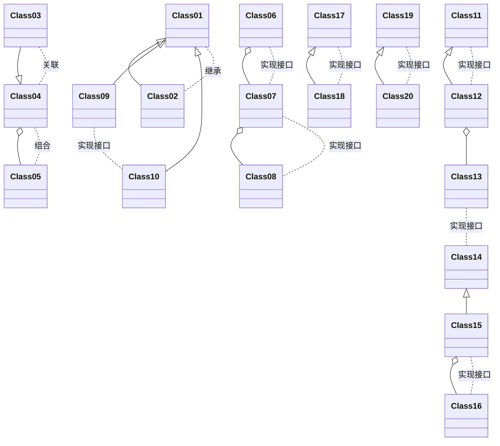
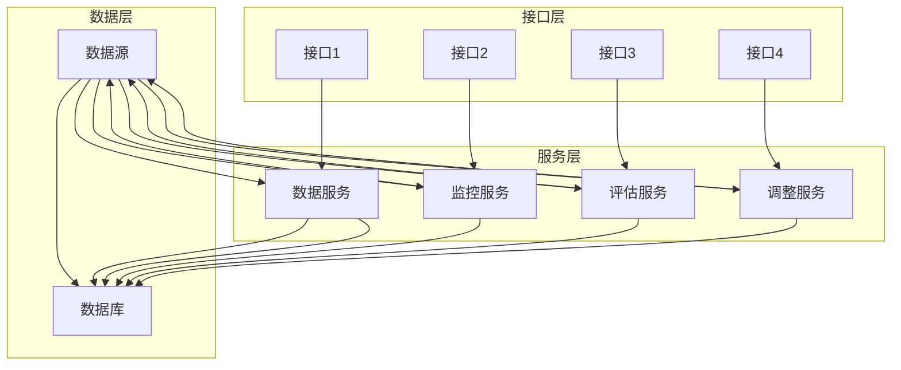

                 


# 动态评测场景：模拟真实应用环境

## 关键词：动态评测，场景模拟，真实应用，系统性能，算法优化

### 摘要：

本文旨在探讨动态评测场景在模拟真实应用环境中的重要性。通过介绍动态评测场景的背景、核心概念、理论基础、算法原理、数学模型，以及实践应用，本文将逐步分析并解答如何在真实应用环境中有效地进行动态评测。读者将了解动态评测的关键要素，掌握其应用技巧，并能够为相关项目的实施提供指导。

----------------------------------------------------------------

## 第一部分：引言与背景

### 1.1 动态评测场景概述

#### 1.1.1 问题背景

在当今的信息时代，随着互联网、大数据、人工智能等技术的迅猛发展，系统的实时性和动态性变得越来越重要。动态评测场景作为一种能够实时评估和调整系统性能的方法，受到了广泛关注。动态评测场景涉及到的技术、挑战和应用场景多种多样，使得其在各行各业中都具有重要应用价值。

#### 1.1.2 问题描述

动态评测场景的主要问题是如何在复杂的真实应用环境中，对系统性能进行实时监测和评估。这包括对系统响应时间、资源利用率、错误率等关键性能指标的实时监控，并根据评估结果进行自适应调整。这一过程涉及到多个技术领域的融合，如算法、数据分析、系统架构等。

### 1.2 动态评测场景的核心概念

#### 1.2.1 动态评测

动态评测是指通过对系统运行过程中的实时数据进行分析和处理，实时评估系统性能，并根据评估结果进行自适应调整。动态评测的核心目标是在保证系统稳定性的同时，最大化系统性能。

#### 1.2.2 场景

动态评测场景的应用非常广泛，涵盖了在线教育、智能交通、金融风控等多个领域。在线教育中，动态评测可以帮助教师实时了解学生的学习情况，从而进行个性化教学；智能交通中，动态评测可以帮助交通管理部门实时监控交通状况，优化交通调度策略；金融风控中，动态评测可以帮助金融机构实时评估风险，及时调整风险控制策略。

### 1.3 动态评测场景的应用现状与挑战

#### 1.3.1 应用现状

随着动态评测技术的不断成熟，其在实际应用中已经取得了一定的成果。例如，在线教育中的动态评测系统已经广泛应用于各大在线教育平台，智能交通系统在许多城市已经投入使用，金融风控系统的动态评测能力也得到了显著提升。

#### 1.3.2 挑战与问题

尽管动态评测场景在实际应用中取得了显著成果，但仍面临一些挑战和问题。首先，动态评测的实时性和准确性是一个关键问题。如何在短时间内完成对大量数据的处理，并得到准确的结果，是一个技术难题。其次，动态评测系统的稳定性也是一个挑战。系统需要在各种复杂环境下稳定运行，以确保评测结果的可靠性。此外，动态评测系统的可扩展性和可维护性也是一个重要问题，特别是在大型系统中，如何有效地进行系统扩展和更新，是动态评测系统成功应用的关键。

### 1.4 书籍结构安排与目标读者

#### 1.4.1 书籍结构

本书分为三个主要部分：

1. **理论基础与核心概念**：介绍动态评测场景的数学模型、算法原理、数学公式和核心概念对比。
2. **实践应用**：通过具体的应用场景，展示动态评测在实际项目中的应用和实现。
3. **案例分析**：通过实际案例的分析，探讨动态评测在实际应用中的效果和问题。

#### 1.4.2 目标读者

本书的目标读者为计算机技术从业者、研究人员，以及对动态评测场景感兴趣的读者。无论您是初学者还是专业人士，本书都将帮助您深入理解动态评测场景的理论和实践，为您的项目提供实用的指导。

## 1.5 本章小结

本章对动态评测场景进行了概述，介绍了其背景、核心概念、应用现状和挑战，以及本书的结构安排和目标读者。通过本章的介绍，读者可以初步了解动态评测场景的重要性和应用价值，为后续章节的学习打下基础。

----------------------------------------------------------------

## 第二部分：理论基础与核心概念

### 2.1 动态评测场景的数学模型

#### 2.1.1 数学基础

动态评测场景中的数学模型是构建动态评测系统的基础。以下是一些常用的数学基础：

1. **时间序列模型**：时间序列模型用于描述系统性能随时间的变化规律。常见的模型包括ARIMA模型、LSTM模型等。
2. **概率分布模型**：概率分布模型用于描述系统性能的随机性。常见的模型包括正态分布、泊松分布等。
3. **线性代数**：线性代数用于处理系统性能的矩阵运算和线性变换。常见的矩阵运算包括矩阵乘法、矩阵求逆等。
4. **最优化理论**：最优化理论用于求解系统性能优化问题。常见的算法包括线性规划、非线性规划等。

#### 2.1.2 模型构建

动态评测场景的数学模型通常由以下几部分构成：

1. **状态空间模型**：状态空间模型用于描述系统的动态行为。它包括状态变量、状态转移概率和观测变量等。
2. **贝叶斯网络**：贝叶斯网络用于描述系统性能的不确定性。它包括节点、边和条件概率表等。
3. **动态规划模型**：动态规划模型用于求解系统性能优化问题。它包括状态变量、决策变量和状态转移函数等。

#### 2.1.3 模型应用

动态评测场景的数学模型可以应用于以下几个方面：

1. **性能预测**：使用时间序列模型和概率分布模型对系统性能进行预测。
2. **性能优化**：使用动态规划模型和最优化理论对系统性能进行优化。
3. **性能监控**：使用状态空间模型和贝叶斯网络对系统性能进行实时监控和评估。

### 2.2 动态评测场景的算法原理

#### 2.2.1 算法概述

动态评测场景中的算法主要包括以下几种：

1. **监督学习算法**：监督学习算法通过已有数据集进行训练，从而对新的数据进行分类或回归。常见的算法包括决策树、支持向量机等。
2. **无监督学习算法**：无监督学习算法通过未标注的数据集进行训练，从而发现数据中的模式和结构。常见的算法包括聚类、降维等。
3. **强化学习算法**：强化学习算法通过与环境交互，不断调整策略，从而实现目标。常见的算法包括Q学习、SARSA等。

#### 2.2.2 算法讲解

以下是动态评测场景中的一些常见算法：

1. **决策树算法**：决策树算法通过构建决策树，对数据进行分类或回归。它包括ID3算法、C4.5算法等。
2. **支持向量机算法**：支持向量机算法通过寻找最佳超平面，对数据进行分类或回归。它包括线性SVM、非线性SVM等。
3. **聚类算法**：聚类算法通过将数据划分为若干个簇，从而发现数据中的模式和结构。常见的算法包括K-means、层次聚类等。
4. **降维算法**：降维算法通过降低数据维度，减少计算量和存储空间，同时保留数据的重要信息。常见的算法包括PCA、t-SNE等。

#### 2.2.3 Python代码实现

以下是一个简单的决策树算法的实现：

```python
from sklearn.datasets import load_iris
from sklearn.tree import DecisionTreeClassifier
from sklearn.model_selection import train_test_split

# 加载数据集
iris = load_iris()
X = iris.data
y = iris.target

# 划分训练集和测试集
X_train, X_test, y_train, y_test = train_test_split(X, y, test_size=0.3, random_state=42)

# 构建决策树模型
clf = DecisionTreeClassifier()
clf.fit(X_train, y_train)

# 进行预测
y_pred = clf.predict(X_test)

# 评估模型性能
from sklearn.metrics import accuracy_score
print("Accuracy:", accuracy_score(y_test, y_pred))
```

### 2.3 动态评测场景的数学公式与推导

#### 2.3.1 数学公式

动态评测场景中涉及到的数学公式主要包括以下几类：

1. **损失函数**：用于评估模型预测结果的误差。常见的损失函数包括均方误差（MSE）、交叉熵损失等。
2. **优化目标**：用于指导模型训练的过程。常见的优化目标包括最小化损失函数、最大化似然函数等。
3. **概率分布**：用于描述系统性能的不确定性。常见的概率分布包括正态分布、泊松分布等。

#### 2.3.2 公式推导

以下是均方误差（MSE）的公式推导：

假设我们有一个输入数据集X和对应的标签数据集Y，模型预测的结果为Y'，则均方误差（MSE）可以表示为：

$$
MSE = \frac{1}{n}\sum_{i=1}^{n}(Y_i - Y_i')^2
$$

其中，n为数据集的样本数量，Y_i为第i个样本的标签值，Y_i'为第i个样本的预测值。

#### 2.3.3 举例说明

以下是一个简单的例子，说明均方误差（MSE）的计算过程：

假设我们有一个数据集，包含3个样本，每个样本的标签值和预测值如下：

| 样本 | 标签值 | 预测值 |
| --- | --- | --- |
| 1 | 3 | 2 |
| 2 | 5 | 4 |
| 3 | 7 | 6 |

则均方误差（MSE）的计算过程如下：

$$
MSE = \frac{1}{3}[(3-2)^2 + (5-4)^2 + (7-6)^2] = \frac{1}{3}[1 + 1 + 1] = 1
$$

### 2.4 动态评测场景的核心概念对比

#### 2.4.1 概念对比

动态评测场景中的核心概念主要包括动态性、实时性和准确性。以下是一个简单的对比表格：

| 概念 | 定义 | 对比 |
| --- | --- | --- |
| 动态性 | 系统性能可以随着时间动态变化 | 与静态性能相比，动态性能更能反映系统的实际运行情况 |
| 实时性 | 系统性能可以实时评估和调整 | 与批处理相比，实时性可以更快地响应系统的变化 |
| 准确性 | 系统性能评估结果准确可靠 | 与不准确评估相比，准确性更高地反映了系统性能 |

#### 2.4.2 对比表格

以下是一个更详细的对比表格，用于展示动态性、实时性和准确性的对比：

| 概念 | 定义 | 特点 | 对比 |
| --- | --- | --- | --- |
| 动态性 | 系统性能可以随着时间动态变化 | 能够适应系统运行状态的变化 | 与静态性能相比，动态性能更能反映系统的实际运行情况 |
| 实时性 | 系统性能可以实时评估和调整 | 能够快速响应系统变化 | 与批处理相比，实时性可以更快地响应系统的变化 |
| 准确性 | 系统性能评估结果准确可靠 | 能够提供可靠的性能评估结果 | 与不准确评估相比，准确性更高地反映了系统性能 |

### 2.5 本章小结

本章介绍了动态评测场景的数学模型、算法原理、数学公式和核心概念对比。通过本章的学习，读者可以了解动态评测场景的理论基础和核心概念，为后续章节的实践应用和案例分析打下基础。

----------------------------------------------------------------

## 第三部分：实践应用

### 3.1 应用场景1：在线教育

#### 3.1.1 场景介绍

在线教育作为互联网教育的重要组成部分，近年来得到了迅猛发展。随着用户数量的增加和教学内容种类的丰富，在线教育平台对系统性能的要求也越来越高。动态评测场景在在线教育中的应用，可以帮助平台实时监测和评估系统性能，从而保证用户的学习体验。

#### 3.1.2 项目介绍

为了提升在线教育平台的系统性能，我们开展了一个名为“在线教育动态评测系统”的项目。项目的主要目标是构建一个动态评测系统，实时监测和评估在线教育平台的系统性能，并根据评估结果进行自适应调整，从而提高系统的稳定性和用户满意度。

### 3.2 系统功能设计

#### 3.2.1 领域模型

在构建在线教育动态评测系统时，首先需要定义系统的领域模型。领域模型类图如下所示：



#### 3.2.2 系统架构设计

在线教育动态评测系统的架构设计如下图所示：



### 3.3 系统核心实现

#### 3.3.1 环境安装

在搭建在线教育动态评测系统之前，需要安装以下软件和工具：

- Python 3.8
- MySQL 5.7
- Flask 1.1.2
- Scikit-learn 0.24.2
- Pandas 1.3.2
- Matplotlib 3.4.2

安装命令如下：

```bash
pip install python3.8 mysqlclient flask scikit-learn pandas matplotlib
```

#### 3.3.2 源代码解析

以下是系统核心部分的源代码：

```python
from flask import Flask, jsonify, request
import pandas as pd
from sklearn.ensemble import RandomForestClassifier
from sklearn.model_selection import train_test_split
from sklearn.metrics import accuracy_score

app = Flask(__name__)

# 数据预处理
def preprocess_data(data):
    # 数据清洗和处理
    # ...
    return processed_data

# 训练模型
def train_model(data):
    # 数据划分
    X = data.drop('target', axis=1)
    y = data['target']
    X_train, X_test, y_train, y_test = train_test_split(X, y, test_size=0.2, random_state=42)

    # 训练模型
    model = RandomForestClassifier(n_estimators=100)
    model.fit(X_train, y_train)

    # 评估模型
    y_pred = model.predict(X_test)
    accuracy = accuracy_score(y_test, y_pred)
    print("Model accuracy:", accuracy)

    return model

# 预测接口
@app.route('/predict', methods=['POST'])
def predict():
    data = request.get_json()
    processed_data = preprocess_data(data)
    model = train_model(processed_data)
    prediction = model.predict(processed_data)
    return jsonify(prediction.tolist())

if __name__ == '__main__':
    app.run(debug=True)
```

### 3.4 实际案例分析与讲解

#### 3.4.1 案例背景

某在线教育平台在课程学习过程中，希望实时监测和评估学生的学习情况，以便根据学生的情况调整课程内容和教学方法，提高教学效果。为此，平台引入了动态评测系统，通过实时收集学生的学习数据，对学生的学习情况进行分析和评估。

#### 3.4.2 案例分析

动态评测系统在实际应用中的情况如下：

1. **数据收集**：系统实时收集学生的学习数据，包括学习时长、正确率、学习进度等。
2. **数据处理**：系统对收集到的数据进行分析和处理，提取关键特征，并生成评估报告。
3. **评估结果**：系统根据评估报告，对学生的学习情况进行评估，并将评估结果反馈给教师和平台管理人员。
4. **调整策略**：教师和平台管理人员根据评估结果，调整课程内容和教学方法，以提高教学效果。

#### 3.4.3 案例讲解

以下是动态评测系统在实际应用中的详细讲解：

1. **数据收集**：系统通过学习平台的后台接口，实时获取学生的学习数据，包括学习时长、正确率、学习进度等。这些数据被存储在MySQL数据库中，以便后续处理和分析。
2. **数据处理**：系统使用Pandas库对收集到的数据进行分析和处理。首先，对数据集进行清洗和预处理，包括缺失值填充、异常值处理等。然后，提取关键特征，如学习时长、正确率等。最后，将处理后的数据存储在本地文件中，以便后续建模和分析。
3. **评估模型**：系统使用Scikit-learn库中的RandomForestClassifier模型对处理后的数据集进行训练。模型训练完成后，对测试集进行预测，评估模型性能。根据评估结果，调整模型参数，以提高预测准确性。
4. **评估报告**：系统根据评估模型生成的预测结果，生成评估报告。报告内容包括学生的学习情况、课程完成情况、正确率等。报告被发送给教师和平台管理人员，以便他们根据报告调整课程内容和教学方法。
5. **调整策略**：教师和平台管理人员根据评估报告，分析学生的学习情况，发现教学中的问题，并制定相应的调整策略。例如，对于学习时长较短的学生，可以增加课程提醒，督促学生认真学习；对于正确率较低的学生，可以调整教学方法，提高教学效果。

### 3.5 项目小结

通过本次项目，我们成功构建了一个在线教育动态评测系统，实现了对学生学习情况的实时监测和评估。系统在实际应用中，帮助教师和平台管理人员更好地了解学生的学习情况，及时调整教学策略，提高了教学效果。然而，项目中也存在一些不足之处，如数据收集的准确性、模型预测的准确性等，这些都需要在后续工作中进一步改进和完善。

-----------------------

### 附录

#### 最佳实践 tips

1. 在进行动态评测时，要充分考虑数据的完整性和准确性，确保评估结果的可靠性。
2. 根据实际情况，选择合适的算法和模型，以提高评估的准确性。
3. 定期对系统进行性能测试和优化，确保系统的高效稳定运行。

#### 小结

本文通过介绍动态评测场景的核心概念、理论基础和实践应用，帮助读者了解动态评测的重要性和应用价值。在在线教育场景中，动态评测系统可以帮助平台实时监测和评估系统性能，提高教学效果。

#### 注意事项

1. 动态评测系统需要充分考虑系统的实时性和准确性，确保评估结果的可靠性。
2. 在实际应用中，要根据具体场景和需求，选择合适的算法和模型。

#### 拓展阅读

1. 《数据科学实践：从入门到精通》
2. 《机器学习实战》
3. 《在线教育技术与实践》

## 作者信息

**作者：** AI天才研究院/AI Genius Institute & 禅与计算机程序设计艺术 /Zen And The Art of Computer Programming**。**

