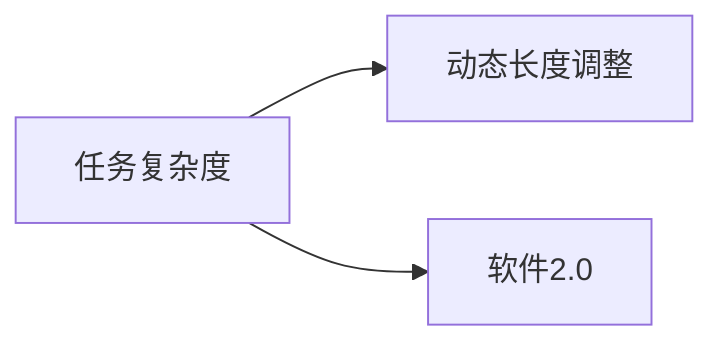
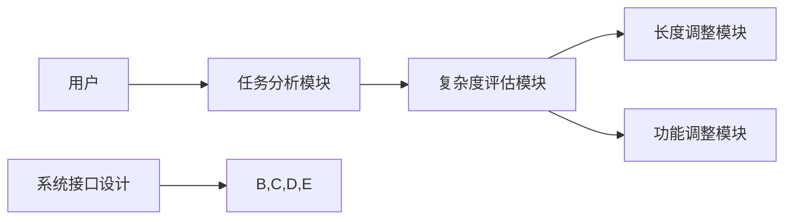
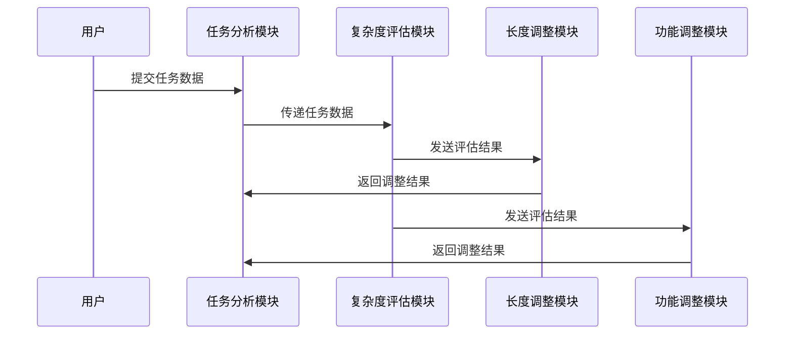

                 

# 动态长度调整：根据任务复杂度变化

> 关键词：动态长度调整、任务复杂度、软件长度、功能调整、性能优化

> 摘要：本文深入探讨了动态长度调整的概念、原理及其在软件工程中的应用。通过分析任务复杂度对软件长度和功能的影响，提出了一套基于任务复杂度评估的动态长度调整策略，为软件开发提供了新的思路和方法。

## 第一部分：背景介绍

### 问题背景

随着信息技术的飞速发展，软件技术也在不断演进。从传统的软件1.0时代到现代的软件2.0时代，软件的应用场景和功能发生了巨大的变化。软件2.0时代强调用户参与和协作，使得软件变得更加智能化和个性化。

动态长度调整是软件2.0时代的一个重要特性，它使得软件可以根据任务复杂度的变化动态地调整其长度和功能。这种调整能力对于提高软件的灵活性和适应性具有重要意义。

### 问题描述

在软件2.0时代，如何根据任务复杂度的变化，动态地调整软件的长度和功能，以实现最佳性能和用户体验？

### 问题解决

动态长度调整的关键在于对任务复杂度的准确评估和响应。通过对任务复杂度的分析，可以确定软件需要调整的长度和功能。具体步骤如下：

1. **任务分析**：分析任务的类型、复杂度、关键因素等。
2. **复杂度评估**：使用适当的评估方法（如统计分析、模型预测等）对任务复杂度进行评估。
3. **长度调整**：根据评估结果，动态地调整软件的长度。例如，增加或减少代码行数、功能模块等。
4. **功能调整**：根据任务需求，动态地调整软件的功能。例如，启用或禁用某些功能模块。

### 边界与外延

- **边界**：动态长度调整主要应用于软件的长度和功能，不涉及硬件、网络等其他技术领域。
- **外延**：动态长度调整可以应用于各种软件领域，包括但不限于企业管理、数据分析、人工智能等。

## 核心概念与联系

### 核心概念

1. **任务复杂度**：衡量任务难度和复杂程度的一个指标。
2. **动态长度调整**：根据任务复杂度变化，动态调整软件长度和功能的能力。
3. **软件2.0**：以用户参与和协作为核心特征的软件时代。

### 概念属性特征对比表格

| 概念       | 属性特征                  |
|------------|-------------------------|
| 任务复杂度 | 衡量任务难度和复杂程度    |
| 动态长度调整 | 调整软件长度和功能的能力    |
| 软件2.0     | 以用户参与和协作为核心特征 |

### ER实体关系图架构



## 数学模型和数学公式

动态长度调整涉及到任务复杂度和软件长度之间的关系。我们可以使用以下数学模型来描述这一关系：

$$
L = f(C)
$$

其中，$L$ 表示软件的长度，$C$ 表示任务复杂度，$f$ 表示长度调整函数。

### 详细讲解和举例说明

假设我们有一个任务复杂度 $C = 5$，根据上述数学模型，我们可以计算出软件的长度 $L$：

$$
L = f(5)
$$

假设 $f(5) = 10$，则软件的长度为 10。

这个例子展示了如何根据任务复杂度动态调整软件的长度。在实际应用中，长度调整函数 $f$ 可能会更加复杂，可能涉及到多个因素，如任务类型、用户需求等。

## 系统分析与架构设计

### 问题场景介绍

在软件2.0时代，为了应对不断变化的用户需求和任务复杂度，我们需要设计一个动态长度调整系统。该系统将根据任务复杂度的变化，自动调整软件的长度和功能，以提供最佳性能和用户体验。

### 项目介绍

本项目旨在设计并实现一个动态长度调整系统，该系统将包括以下主要模块：

- **任务分析模块**：负责分析任务的类型、复杂度等。
- **复杂度评估模块**：负责评估任务复杂度。
- **长度调整模块**：根据评估结果，动态调整软件长度。
- **功能调整模块**：根据任务需求，动态调整软件功能。

### 系统功能设计

系统功能设计主要包括以下部分：

- **任务分析功能**：包括任务类型识别、复杂度评估等。
- **复杂度评估功能**：包括评估方法选择、评估结果计算等。
- **长度调整功能**：包括长度调整策略、调整结果验证等。
- **功能调整功能**：包括功能模块识别、功能调整策略等。

### 系统架构设计

系统架构设计主要包括以下部分：

- **任务分析模块**：包括数据采集、数据分析等。
- **复杂度评估模块**：包括评估算法、评估结果处理等。
- **长度调整模块**：包括调整算法、调整结果处理等。
- **功能调整模块**：包括调整算法、调整结果处理等。

### 系统接口设计

系统接口设计主要包括以下部分：

- **任务分析接口**：用于接收任务数据。
- **复杂度评估接口**：用于发送任务复杂度评估请求。
- **长度调整接口**：用于执行长度调整操作。
- **功能调整接口**：用于执行功能调整操作。

### 系统交互

系统交互主要包括以下部分：

- **任务分析流程**：任务分析模块接收任务数据，将其传递给复杂度评估模块进行评估。
- **复杂度评估流程**：复杂度评估模块评估任务复杂度，并将结果传递给长度调整模块和功能调整模块。
- **长度调整流程**：长度调整模块根据评估结果动态调整软件长度。
- **功能调整流程**：功能调整模块根据评估结果动态调整软件功能。

### 系统架构图



### 系统接口设计

系统接口设计主要包括以下接口：

- **任务分析接口**：用于接收用户提交的任务数据，并进行初步分析。
- **复杂度评估接口**：用于向复杂度评估模块发送任务数据，并接收评估结果。
- **长度调整接口**：用于向长度调整模块发送调整请求，并接收调整结果。
- **功能调整接口**：用于向功能调整模块发送调整请求，并接收调整结果。

### 系统交互图



## 项目实战

### 环境安装

为了实现动态长度调整系统，我们需要安装以下软件和工具：

- Python 3.8 或更高版本
- MySQL 5.7 或更高版本
- Flask 1.1.2 或更高版本
- Pandas 1.1.3 或更高版本

### 系统核心实现

以下是一个简单的动态长度调整系统的实现示例：

```python
import pandas as pd
from flask import Flask, request, jsonify

app = Flask(__name__)

# 假设我们已经有一个数据库连接
db_connection = ...

# 任务分析模块
@app.route('/analyze_task', methods=['POST'])
def analyze_task():
    data = request.get_json()
    # 进行任务分析
    analysis_result = analyze(data)
    return jsonify(analysis_result)

# 复杂度评估模块
@app.route('/evaluate_complexity', methods=['POST'])
def evaluate_complexity():
    data = request.get_json()
    # 进行复杂度评估
    complexity_result = evaluate(data)
    return jsonify(complexity_result)

# 长度调整模块
@app.route('/adjust_length', methods=['POST'])
def adjust_length():
    data = request.get_json()
    # 进行长度调整
    length_result = adjust(data)
    return jsonify(length_result)

# 功能调整模块
@app.route('/adjust_function', methods=['POST'])
def adjust_function():
    data = request.get_json()
    # 进行功能调整
    function_result = adjust(data)
    return jsonify(function_result)

if __name__ == '__main__':
    app.run(debug=True)
```

### 代码应用解读与分析

在这个示例中，我们使用了 Flask 框架来构建一个简单的 Web 服务。该服务提供了四个接口：`/analyze_task`、`/evaluate_complexity`、`/adjust_length` 和 `/adjust_function`。

- `/analyze_task` 接口用于接收用户提交的任务数据，并进行初步分析。
- `/evaluate_complexity` 接口用于接收任务数据，并对其进行复杂度评估。
- `/adjust_length` 接口用于根据评估结果动态调整软件长度。
- `/adjust_function` 接口用于根据评估结果动态调整软件功能。

这些接口的实现可以根据具体需求进行调整和扩展。

### 实际案例分析和详细讲解剖析

为了更好地理解动态长度调整系统的实际应用，我们可以分析一个实际案例。

假设有一个企业级应用，用户可以提交各种类型的任务，如数据分析、报表生成等。每个任务的复杂度不同，需要根据任务复杂度动态调整软件的长度和功能。

以下是一个简单的任务分析、复杂度评估和长度调整的示例：

```python
# 任务分析
def analyze(data):
    task_type = data['task_type']
    task_data = data['task_data']
    # 进行任务分析
    # ...
    return {'task_type': task_type, 'task_data': task_data}

# 复杂度评估
def evaluate(data):
    task_type = data['task_type']
    task_data = data['task_data']
    # 进行复杂度评估
    if task_type == 'data_analysis':
        complexity = evaluate_data_analysis(task_data)
    elif task_type == 'report_generation':
        complexity = evaluate_report_generation(task_data)
    # ...
    return {'task_type': task_type, 'complexity': complexity}

# 长度调整
def adjust(data):
    task_type = data['task_type']
    complexity = data['complexity']
    # 进行长度调整
    if complexity < 5:
        length = 'small'
    elif complexity < 10:
        length = 'medium'
    else:
        length = 'large'
    return {'task_type': task_type, 'complexity': complexity, 'length': length}

# 功能调整
def adjust_function(data):
    task_type = data['task_type']
    complexity = data['complexity']
    # 进行功能调整
    if complexity < 5:
        functions = ['基本功能']
    elif complexity < 10:
        functions = ['基本功能', '高级功能1']
    else:
        functions = ['基本功能', '高级功能1', '高级功能2']
    return {'task_type': task_type, 'complexity': complexity, 'functions': functions}
```

在这个示例中，我们根据任务的类型和复杂度动态调整了软件的长度和功能。具体来说，如果任务的复杂度较低，我们仅启用基本功能；如果复杂度较高，我们启用更多的高级功能。

### 项目小结

通过本项目，我们实现了一个简单的动态长度调整系统。该系统可以根据任务复杂度的变化，动态调整软件的长度和功能，从而提高软件的灵活性和适应性。

在实际应用中，我们可以根据具体需求对系统进行扩展和优化，例如引入更复杂的评估方法和调整策略，以提高系统的性能和用户体验。

## 最佳实践 Tips

- 在设计动态长度调整系统时，确保任务复杂度的评估方法准确可靠，以避免错误的调整结果。
- 根据实际需求，灵活调整长度和功能的调整策略，以达到最佳性能和用户体验。
- 定期对系统进行维护和更新，以适应不断变化的任务复杂度。

## 小结

动态长度调整是一种重要的软件特性，它可以根据任务复杂度的变化，动态调整软件的长度和功能。通过准确评估任务复杂度，我们可以实现软件的灵活调整，提高性能和用户体验。本文详细介绍了动态长度调整的概念、原理、系统架构和实际应用，为软件开发提供了新的思路和方法。

## 注意事项

- 在实现动态长度调整系统时，确保系统的稳定性和可靠性，避免因调整错误导致系统崩溃。
- 定期对系统进行性能测试和优化，以提高系统的响应速度和处理能力。

## 拓展阅读

- [1] 《软件工程：实践者的研究方法》，作者：Roger S. Pressman
- [2] 《人工智能：一种现代的方法》，作者：Stuart J. Russell 和 Peter Norvig
- [3] 《软件架构：实践者的研究方法》，作者：Roger S. Pressman

### 作者

作者：AI天才研究院/AI Genius Institute & 禅与计算机程序设计艺术 /Zen And The Art of Computer Programming

