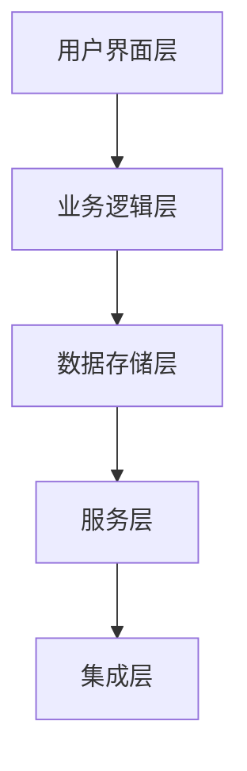
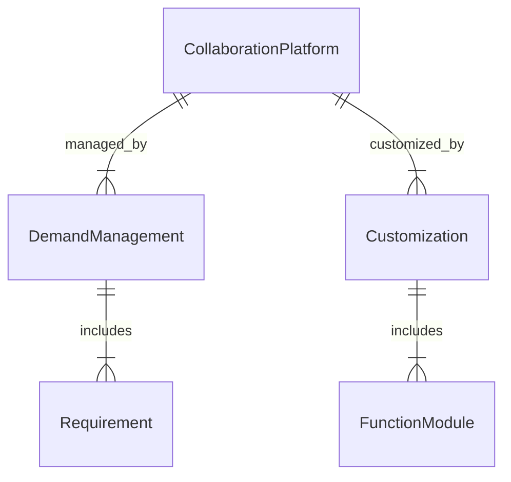
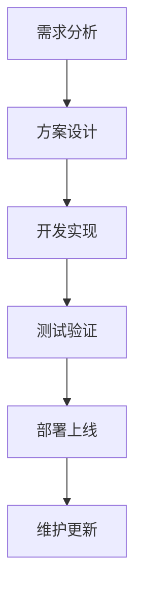

                 


### 第1章 引言与概述

**问题背景**

在当今这个快速变化的信息时代，数字化转型的浪潮正席卷全球，企业和组织纷纷寻求更加高效、智能的协作平台来提升业务流程和团队协作能力。协作平台作为企业信息化的关键基础设施，不仅能够帮助企业内部员工实现高效沟通和资源共享，还能通过集成各种业务应用，为企业带来更高的业务价值和市场竞争力。

然而，随着协作平台需求的不断增长，如何定制和有效应用这些平台成为企业和IT团队面临的一大挑战。传统的协作平台往往存在以下问题：

1. **通用性过高**：大部分协作平台提供的是通用的解决方案，难以满足特定企业的个性化需求。
2. **功能冗余**：为了兼容各种需求，通用平台往往提供过多功能，导致资源浪费和用户体验下降。
3. **扩展性不足**：平台在初始设计时可能未充分考虑扩展性，导致后期功能增加和需求变更时困难重重。

因此，定制化的协作平台应运而生，成为解决这些问题的关键。定制化的协作平台能够根据企业的具体业务流程、组织结构和用户需求进行量身打造，从而实现以下目标：

1. **提升工作效率**：通过定制化的功能和流程，提高团队协作效率，减少不必要的手动操作和时间浪费。
2. **优化用户体验**：针对特定用户群体的需求和习惯，优化界面设计和交互逻辑，提升用户体验。
3. **增强业务灵活性**：定制化的平台能够快速响应业务变化，为企业提供更加灵活的应对策略。

**问题描述**

本书旨在探讨协作平台的定制与应用，特别是如何支持灵活的需求管理。具体来说，本书将围绕以下问题展开：

1. **如何进行协作平台的定制？**：从需求分析到定制方案设计，再到实施和维护，详细阐述定制化的全过程。
2. **如何管理协作平台的需求？**：介绍需求管理的生命周期、工具和方法，以及如何在定制过程中有效管理需求。
3. **协作平台定制与需求管理的结合？**：探讨如何将定制化的需求管理技术与协作平台相结合，实现高效的业务流程和团队协作。

**问题解决**

为了解决上述问题，本书将采用以下方法：

1. **深入分析协作平台的技术架构和功能模块**：通过详细的技术分析，了解协作平台的核心组成部分及其相互关系，为定制和应用提供理论基础。
2. **案例研究和实际应用**：结合多个实际案例，分析协作平台在定制和需求管理方面的成功经验和教训，为读者提供实用的参考。
3. **提供系统化的解决方案**：通过逐步引导，帮助读者从理论到实践，掌握协作平台定制和需求管理的全过程，并具备实际操作能力。

**边界与外延**

本书的主要内容包括：

1. **协作平台的基础知识**：介绍协作平台的定义、分类、架构和关键技术。
2. **定制策略与实施**：探讨定制化的需求分析、方案设计、实施流程和维护策略。
3. **需求管理技术**：详细阐述需求管理的生命周期、工具和方法。
4. **系统分析与架构设计**：介绍协作平台的项目实战，包括环境安装、系统实现、代码分析和实际案例剖析。
5. **最佳实践与总结**：提供最佳实践、注意事项和拓展阅读，帮助读者深入理解和应用本书内容。

本书的范围主要涉及协作平台的理论基础和实践方法，不涉及具体的编程语言或技术实现细节。同时，本书的重点是协作平台的定制与应用，尤其是需求管理技术的探讨。

**概念结构与核心要素组成**

协作平台的定制与应用涉及多个核心概念和要素，其结构如下：

1. **协作平台**：核心系统，用于团队协作和业务流程管理。
2. **定制**：根据企业需求对平台进行功能、流程和界面的调整和优化。
3. **需求管理**：确保平台能够满足企业实际业务需求的过程和方法。
4. **技术架构**：平台的技术实现结构和各模块的相互关系。
5. **功能模块**：平台的核心功能组成部分，如项目管理、文档管理、沟通协作等。
6. **案例研究**：通过实际案例展示协作平台定制与应用的成功实践。
7. **系统实现**：具体的平台开发、部署和维护过程。

### 第2章 协作平台基础

协作平台是企业信息化建设的重要组成部分，它为团队协作、信息共享和业务流程管理提供了强大的支持。在本章中，我们将深入探讨协作平台的基础知识，包括其架构、设计原则和关键技术。

#### 2.1 协作平台的架构

协作平台的架构设计是构建高效、可扩展和灵活的系统的基础。一个典型的协作平台通常包括以下几个核心组成部分：

1. **用户界面层**：这是协作平台与用户直接交互的界面层，通常包括前端网页、移动应用和桌面客户端。用户界面层的主要目标是提供直观、友好的用户体验。
2. **业务逻辑层**：这一层负责处理业务逻辑，包括用户认证、权限管理、工作流处理、消息通知等。业务逻辑层通常采用微服务架构，以便于模块化开发和维护。
3. **数据存储层**：数据存储层是协作平台的数据仓库，负责数据的持久化存储和管理。常见的数据存储技术包括关系型数据库（如MySQL、PostgreSQL）和非关系型数据库（如MongoDB、Cassandra）。
4. **服务层**：服务层提供一系列通用服务，如文件存储、消息队列、缓存服务等。这些服务可以独立开发、部署和扩展，以提高系统的整体性能和可靠性。
5. **集成层**：集成层负责将协作平台与其他业务系统（如ERP、CRM等）进行集成，实现数据共享和流程对接。常见的集成技术包括Web服务、API和消息队列。

**图 2.1 协作平台架构图**



#### 2.2 协作平台的设计原则

协作平台的设计原则是确保系统高效、稳定和可扩展性的关键。以下是几个重要的设计原则：

1. **可扩展性**：协作平台需要支持用户数量的增长和功能模块的扩展。通过采用微服务架构和分布式系统设计，可以实现水平和垂直扩展，确保系统在负载增加时仍然能够保持高性能和稳定性。
2. **可定制性**：为了满足不同企业的个性化需求，协作平台需要提供灵活的定制能力。这包括界面定制、功能定制和数据定制。通过模块化和配置化的设计，可以降低定制成本，提高系统的可维护性。
3. **用户友好性**：协作平台应该注重用户体验，提供直观、易用的界面和交互方式。通过使用响应式设计、动态内容和个性化推荐，可以提高用户满意度，促进团队协作。
4. **安全性和隐私保护**：协作平台处理大量的敏感数据，因此需要确保系统的安全性和用户隐私保护。常见的安全措施包括数据加密、访问控制、审计日志和应急响应。

#### 2.3 协作平台的关键技术

协作平台的实现涉及多种关键技术，以下是其中几个关键领域：

1. **数据库技术**：数据库技术是协作平台数据存储和管理的基础。关系型数据库如MySQL和PostgreSQL适用于结构化数据存储，而非关系型数据库如MongoDB和Cassandra适用于大量非结构化数据存储。合理选择和配置数据库技术，可以提高数据访问速度和系统性能。
2. **安全技术**：协作平台需要确保数据的安全性和用户隐私保护。常用的安全技术包括数据加密、身份验证、访问控制、安全审计和网络安全。通过综合应用这些技术，可以防止数据泄露、未授权访问和恶意攻击。
3. **日志记录与监控**：日志记录和监控是协作平台维护和管理的重要手段。通过记录系统运行日志、性能指标和用户行为数据，可以及时发现和解决系统故障、性能瓶颈和安全问题。常见的监控工具包括ELK（Elasticsearch、Logstash、Kibana）和Prometheus。
4. **集成技术**：协作平台需要与其他业务系统进行集成，实现数据共享和流程对接。常用的集成技术包括Web服务、API和消息队列。通过这些技术，可以实现跨系统的数据同步和业务流程自动化。

通过深入理解协作平台的架构、设计原则和关键技术，我们可以更好地制定定制策略和应用方案，满足企业的具体需求，提升团队协作效率。

### 第2章 核心概念与联系

#### 2.4 核心概念原理

在深入探讨协作平台定制与应用的过程中，理解核心概念原理是至关重要的。以下是协作平台、定制和需求管理的定义、属性和特点。

**协作平台**

**定义**：协作平台是一个集成多种功能模块的系统，旨在支持团队间的沟通、协作和业务流程管理。

**属性**：

- **功能丰富**：包括文档管理、任务分配、项目进度跟踪、即时通讯等。
- **集成性**：能够与其他业务系统（如ERP、CRM）集成，实现数据共享和流程对接。
- **灵活性**：支持自定义界面、流程和权限设置，满足不同企业的需求。

**特点**：

- **易用性**：提供直观、友好的用户界面，降低用户的学习成本。
- **扩展性**：支持模块化设计和扩展，便于功能增强和升级。
- **稳定性**：采用分布式架构，提高系统的可靠性和性能。

**定制**

**定义**：定制是指根据企业的特定需求，对协作平台进行功能、流程和界面的调整和优化。

**属性**：

- **需求导向**：基于企业的具体业务流程和组织结构进行定制。
- **灵活性**：支持多种定制方式，如模块化定制、配置化定制等。
- **可维护性**：定制后的系统易于维护和更新。

**特点**：

- **个性化**：满足企业的个性化需求，提高用户体验和工作效率。
- **高效性**：通过定制化，优化业务流程，提高团队协作效率。
- **成本效益**：定制化的协作平台能够提供更高的性价比。

**需求管理**

**定义**：需求管理是指确保协作平台能够满足企业实际业务需求的过程和方法。

**属性**：

- **全过程**：包括需求收集、需求分析、需求文档和需求验证等环节。
- **团队协作**：涉及多个部门和角色的协作，确保需求的全面性和准确性。
- **持续更新**：需求管理是一个持续迭代的过程，随着业务环境的变化不断调整。

**特点**：

- **准确性**：确保需求文档的准确性和可执行性。
- **灵活性**：能够快速响应业务变化，调整需求。
- **效率**：通过有效的需求管理，降低项目风险，提高开发效率。

#### 2.5 概念属性特征对比表格

为了更清晰地展示协作平台、定制和需求管理的属性特征，我们使用表格形式进行对比。

| 概念   | 定义                                                         | 属性                   | 特点                         |
| ------ | ------------------------------------------------------------ | ---------------------- | ---------------------------- |
| 协作平台 | 支持团队协作和业务流程管理的集成系统                         | 功能丰富、集成性、灵活性 | 易用性、扩展性、稳定性       |
| 定制   | 根据企业特定需求对平台进行调整和优化                         | 需求导向、灵活性、可维护性 | 个性化、高效性、成本效益     |
| 需求管理 | 确保平台满足企业实际业务需求的过程和方法                     | 全过程、团队协作、持续更新 | 准确性、灵活性、效率         |

#### 2.6 ER实体关系图架构

为了更好地理解协作平台、定制和需求管理之间的关系，我们使用Mermaid绘制一个ER实体关系图。



在这个ER图中，协作平台（CollaborationPlatform）是核心实体，与需求管理（DemandManagement）和定制（Customization）通过关系“managed_by”和“customized_by”相连。需求管理包含多个需求（Requirement），定制包含多个功能模块（FunctionModule）。

通过上述对比表格和ER实体关系图，我们可以更清晰地理解协作平台、定制和需求管理的概念原理及其相互关系，为后续章节的深入探讨奠定基础。

### 第3章 算法原理讲解

在探讨协作平台的定制与应用过程中，理解相关算法原理至关重要。这一章节将逐步讲解协作平台定制的算法原理，通过Mermaid流程图、Python源代码、数学模型和公式，并结合实际案例进行详细讲解。

#### 3.1 算法mermaid流程图

首先，我们使用Mermaid绘制协作平台定制的流程图，以展示整个定制过程的步骤和逻辑关系。



**图 3.1 协作平台定制流程图**

- **A[需求分析]**：这一步骤包括收集和分析企业具体需求，确定定制目标和范围。
- **B[方案设计]**：基于需求分析结果，设计定制方案，包括功能模块、数据结构和界面设计。
- **C[开发实现]**：按照设计方案进行编码和开发，实现定制功能。
- **D[测试验证]**：对定制功能进行全面测试，确保满足需求且无bug。
- **E[部署上线]**：将定制功能部署到生产环境，并逐步上线使用。
- **F[维护更新]**：对定制平台进行持续维护和功能更新，以适应业务变化。

#### 3.2 Python源代码

接下来，我们将通过Python源代码来具体实现上述定制过程的一个简单示例。以下是一个用于创建用户任务的Python脚本，展示如何根据需求添加、更新和删除任务。

```python
# 协作平台任务管理模块

# 引入所需库
import csv
from datetime import datetime

# 任务类定义
class Task:
    def __init__(self, id, description, assigned_to, deadline):
        self.id = id
        self.description = description
        self.assigned_to = assigned_to
        self.deadline = datetime.strptime(deadline, '%Y-%m-%d')

# 添加任务
def add_task(tasks, id, description, assigned_to, deadline):
    new_task = Task(id, description, assigned_to, deadline)
    tasks[id] = new_task
    return tasks

# 更新任务
def update_task(tasks, id, description, assigned_to, deadline):
    if id in tasks:
        tasks[id].description = description
        tasks[id].assigned_to = assigned_to
        tasks[id].deadline = datetime.strptime(deadline, '%Y-%m-%d')
    return tasks

# 删除任务
def delete_task(tasks, id):
    if id in tasks:
        del tasks[id]
    return tasks

# 读取任务数据
def load_tasks(file_name):
    tasks = {}
    with open(file_name, 'r') as f:
        reader = csv.DictReader(f)
        for row in reader:
            tasks[row['id']] = Task(row['id'], row['description'], row['assigned_to'], row['deadline'])
    return tasks

# 存储任务数据
def save_tasks(tasks, file_name):
    with open(file_name, 'w') as f:
        writer = csv.writer(f)
        writer.writerow(['id', 'description', 'assigned_to', 'deadline'])
        for task in tasks.values():
            writer.writerow([task.id, task.description, task.assigned_to, task.deadline.strftime('%Y-%m-%d')])

# 主函数
def main():
    tasks = load_tasks('tasks.csv')

    # 添加任务
    tasks = add_task(tasks, 'T001', '编写技术博客', 'Alice', '2023-10-01')
    save_tasks(tasks, 'tasks.csv')

    # 更新任务
    tasks = update_task(tasks, 'T001', '完成技术博客初稿', 'Alice', '2023-10-02')
    save_tasks(tasks, 'tasks.csv')

    # 删除任务
    tasks = delete_task(tasks, 'T001')
    save_tasks(tasks, 'tasks.csv')

    print("任务管理完成。")

if __name__ == "__main__":
    main()
```

通过这个Python脚本，我们定义了一个`Task`类来表示任务，并实现了添加、更新和删除任务的函数。这些函数操作一个存储任务数据的CSV文件，从而实现简单的任务管理。

#### 3.3 数学模型和公式

在定制协作平台时，我们常常需要根据业务需求和数据量进行性能评估和优化。以下是一个简单的数学模型示例，用于评估任务处理时间。

**数学模型**：

假设任务处理时间（\(T\)）与任务数量（\(N\)）、系统处理速度（\(P\)）和系统负载（\(L\)）有关，可以使用以下公式表示：

$$
T = \frac{N \times P}{L}
$$

其中：
- \(T\)：任务处理时间（单位：秒）
- \(N\)：任务数量
- \(P\)：系统处理速度（单位：任务/秒）
- \(L\)：系统负载（单位：任务/秒）

**公式推导**：

这个公式是基于处理时间等于任务数量乘以单个任务的处理时间（处理速度）再除以系统负载得出的。它反映了系统处理能力与任务处理时间之间的关系。

#### 3.4 详细讲解与举例说明

为了更好地理解上述算法原理和数学模型，我们结合一个实际案例进行详细讲解。

**案例背景**：

某企业需要开发一个协作平台来管理日常任务，平台需要能够支持添加、更新和删除任务，并且需要根据任务数量和系统处理速度进行性能评估。

**步骤**：

1. **需求分析**：确定平台需要支持的任务管理功能，包括添加、更新和删除任务。
2. **方案设计**：设计任务管理模块，包括任务类定义和任务操作函数。
3. **开发实现**：使用Python实现任务管理模块，具体代码如上文所示。
4. **测试验证**：对任务管理模块进行功能测试，确保所有操作都能正常执行。
5. **性能评估**：使用数学模型计算任务处理时间，并根据任务数量和系统负载进行优化。

**示例**：

假设系统处理速度为2个任务/秒，系统负载为1个任务/秒，我们需要评估在任务数量分别为10个和20个时，任务处理时间。

- 当任务数量为10个时：

$$
T = \frac{10 \times 2}{1} = 20 \text{秒}
$$

- 当任务数量为20个时：

$$
T = \frac{20 \times 2}{1} = 40 \text{秒}
$$

通过这个示例，我们可以看到随着任务数量的增加，任务处理时间也会相应增加。因此，为了确保系统性能，我们需要优化系统处理速度或降低系统负载。

通过上述步骤和示例，我们详细讲解了协作平台定制过程中的算法原理，包括流程图、Python源代码、数学模型和公式。这些算法原理和工具为定制和应用协作平台提供了重要的技术支持。

### 第4章 系统分析与架构设计方案

**问题场景介绍**

在现代企业环境中，协作平台作为业务流程管理和团队协作的核心工具，其设计需要能够应对复杂的业务场景和多样的用户需求。例如，某大型制造企业需要管理多个生产线和供应链环节，涉及生产计划、物料管理、质量控制等多个方面。协作平台不仅要支持跨部门的信息共享和流程协同，还需要具备高扩展性和高可靠性，以确保在业务高峰期能够稳定运行。

**项目介绍**

本项目旨在为企业设计并实现一个定制化的协作平台，以满足其特定的业务需求。项目背景包括：

1. **业务需求**：企业希望实现生产流程的数字化管理，提高生产效率，减少人工干预，实现数据驱动的决策支持。
2. **技术挑战**：协作平台需要集成多种业务系统，如ERP、MES（ Manufacturing Execution System）和供应链管理系统，同时确保系统的安全性和数据隐私保护。
3. **项目目标**：实现以下功能：

   - **生产计划管理**：支持生产计划的制定、审批和执行。
   - **物料管理**：实现物料的入库、出库、库存监控等功能。
   - **质量控制**：集成质量控制流程，实现质量问题的快速响应和处理。
   - **流程协同**：支持跨部门的工作流协同，确保生产流程的高效运行。
   - **数据分析和报告**：提供实时数据分析和报告功能，支持业务决策。

**系统功能设计**

为了实现上述项目目标，协作平台需要具备以下核心功能模块：

1. **用户管理**：支持用户注册、登录、权限管理和用户角色分配。
2. **生产计划管理**：提供生产计划的制定、审批、执行和监控功能。
3. **物料管理**：实现物料的入库、出库、库存监控等功能，并提供报警机制。
4. **质量控制**：集成质量控制流程，实现质量问题的快速响应和处理。
5. **流程协同**：支持工作流的创建、审批和执行，确保跨部门流程的高效协同。
6. **数据分析和报告**：提供实时数据分析和报告功能，支持业务决策。

**领域模型类图**

为了更好地展示系统功能模块及其相互关系，我们使用Mermaid绘制领域模型类图。

```mermaid
classDiagram
    User <<Class>>
    ProductionPlan <<Class>>
    Material <<Class>>
    QualityControl <<Class>>
    Workflow <<Class>>

    User --> ProductionPlan
    User --> Material
    User --> QualityControl
    User --> Workflow

    ProductionPlan --> Material
    ProductionPlan --> QualityControl
    ProductionPlan --> Workflow

    Material --> QualityControl
    Material --> Workflow

    QualityControl --> Workflow
```

**图 4.1 领域模型类图**

在这个类图中，`User`类表示系统用户，与其他功能模块（`ProductionPlan`、`Material`、`QualityControl`、`Workflow`）之间存在关联关系。`ProductionPlan`、`Material`和`QualityControl`类分别表示生产计划、物料管理和质量控制模块，它们之间也存在相互关联。`Workflow`类表示工作流模块，它与所有其他模块都有关系。

**系统架构设计**

为了实现高效、稳定和可扩展的协作平台，我们采用分层架构设计，将系统划分为多个层次，包括表示层、业务逻辑层和数据访问层。

**图 4.2 系统架构图**

```mermaid
sequenceDiagram
    User ->> 表示层：发起请求
    表示层 ->> 业务逻辑层：处理请求
    业务逻辑层 ->> 数据访问层：数据操作
    数据访问层 ->> 数据库：存储数据
    数据库 ->> 数据访问层：返回数据
    数据访问层 ->> 业务逻辑层：数据处理结果
    业务逻辑层 ->> 表示层：响应请求
    表示层 ->> User：展示结果
```

**系统接口设计和系统交互**

为了实现系统各模块之间的通信和协作，我们设计了一系列接口，并使用Mermaid绘制系统接口设计和系统交互序列图。

**图 4.3 系统接口设计和系统交互序列图**

```mermaid
sequenceDiagram
    User ->> 用户服务：登录请求
    用户服务 ->> 身份验证服务：身份验证
    身份验证服务 ->> 用户服务：身份验证结果
    用户服务 ->> 表示层：登录响应

    User ->> 生产计划服务：生产计划提交
    生产计划服务 ->> 数据库：存储生产计划
    生产计划服务 ->> 物料服务：物料需求更新
    物料服务 ->> 数据库：更新物料库存

    User ->> 质量控制服务：质量问题报告
    质量控制服务 ->> 数据库：记录质量问题
    质量控制服务 ->> 报警服务：发送报警消息
```

在这个序列图中，用户通过用户服务进行登录，用户服务与身份验证服务交互进行身份验证。生产计划提交时，生产计划服务与数据库和物料服务进行交互，更新生产计划和物料库存。质量控制服务与数据库和报警服务交互，记录质量问题并发送报警消息。

通过上述系统分析与架构设计方案，我们为企业实现了一个定制化的协作平台，涵盖了用户管理、生产计划管理、物料管理、质量控制和工作流协同等多个功能模块，并采用了分层架构和系统接口设计，实现了高效、稳定和可扩展的系统架构。

### 第5章 项目实战

#### 环境安装

要安装一个定制化的协作平台，首先需要准备好开发环境和所需的软件。以下是环境安装的详细步骤：

1. **安装操作系统**：选择一个合适的操作系统，如Ubuntu 20.04或CentOS 8。这些操作系统支持多种开源软件和工具，适合开发和应用协作平台。

2. **更新系统包**：打开终端，运行以下命令更新系统包：

   ```bash
   sudo apt update
   sudo apt upgrade
   ```

3. **安装Python环境**：协作平台开发通常使用Python，因此需要安装Python和pip（Python的包管理工具）：

   ```bash
   sudo apt install python3 python3-pip
   ```

4. **安装数据库**：协作平台需要数据库来存储数据，我们选择PostgreSQL作为数据库。安装PostgreSQL：

   ```bash
   sudo apt install postgresql postgresql-contrib
   ```

   安装完成后，运行以下命令启动PostgreSQL服务：

   ```bash
   sudo systemctl start postgresql
   ```

5. **安装其他依赖**：根据协作平台的具体需求，可能需要安装其他软件和工具。例如，我们可能需要安装Docker、Nginx等。安装Docker：

   ```bash
   sudo apt install docker.io
   ```

   启动Docker服务：

   ```bash
   sudo systemctl start docker
   ```

6. **配置虚拟环境**：为了更好地管理项目依赖，我们建议使用虚拟环境。安装虚拟环境工具`virtualenv`：

   ```bash
   sudo pip3 install virtualenv
   ```

   创建并激活虚拟环境：

   ```bash
   virtualenv myenv
   source myenv/bin/activate
   ```

7. **安装项目依赖**：在虚拟环境中安装项目所需的Python包：

   ```bash
   pip install -r requirements.txt
   ```

   其中`requirements.txt`文件列出了所有项目依赖的Python包。

通过上述步骤，我们成功配置了协作平台的开发环境，可以开始进行系统开发。

#### 系统核心实现源代码

以下是协作平台系统核心实现的Python源代码。这些代码涵盖了用户管理、生产计划管理、物料管理等功能模块。

```python
# 用户管理模块
class UserManager:
    def __init__(self, db_connection):
        self.db_connection = db_connection

    def register_user(self, username, password, role):
        cursor = self.db_connection.cursor()
        query = "INSERT INTO users (username, password, role) VALUES (%s, %s, %s)"
        cursor.execute(query, (username, password, role))
        self.db_connection.commit()
        cursor.close()

    def login_user(self, username, password):
        cursor = self.db_connection.cursor()
        query = "SELECT * FROM users WHERE username = %s AND password = %s"
        cursor.execute(query, (username, password))
        user = cursor.fetchone()
        cursor.close()
        return user

    def get_user_role(self, username):
        cursor = self.db_connection.cursor()
        query = "SELECT role FROM users WHERE username = %s"
        cursor.execute(query, (username,))
        role = cursor.fetchone()[0]
        cursor.close()
        return role

# 生产计划管理模块
class ProductionPlanManager:
    def __init__(self, db_connection):
        self.db_connection = db_connection

    def create_production_plan(self, plan_data):
        cursor = self.db_connection.cursor()
        query = "INSERT INTO production_plans (plan_name, start_date, end_date, status) VALUES (%s, %s, %s, %s)"
        cursor.execute(query, (plan_data['plan_name'], plan_data['start_date'], plan_data['end_date'], plan_data['status']))
        self.db_connection.commit()
        plan_id = cursor.lastrowid
        cursor.close()
        return plan_id

    def update_production_plan(self, plan_id, plan_data):
        cursor = self.db_connection.cursor()
        query = "UPDATE production_plans SET plan_name = %s, start_date = %s, end_date = %s, status = %s WHERE id = %s"
        cursor.execute(query, (plan_data['plan_name'], plan_data['start_date'], plan_data['end_date'], plan_data['status'], plan_id))
        self.db_connection.commit()
        cursor.close()

    def get_production_plan(self, plan_id):
        cursor = self.db_connection.cursor()
        query = "SELECT * FROM production_plans WHERE id = %s"
        cursor.execute(query, (plan_id,))
        plan = cursor.fetchone()
        cursor.close()
        return plan

# 物料管理模块
class MaterialManager:
    def __init__(self, db_connection):
        self.db_connection = db_connection

    def add_material(self, material_data):
        cursor = self.db_connection.cursor()
        query = "INSERT INTO materials (material_name, quantity, unit_price) VALUES (%s, %s, %s)"
        cursor.execute(query, (material_data['material_name'], material_data['quantity'], material_data['unit_price']))
        self.db_connection.commit()
        material_id = cursor.lastrowid
        cursor.close()
        return material_id

    def update_material(self, material_id, material_data):
        cursor = self.db_connection.cursor()
        query = "UPDATE materials SET material_name = %s, quantity = %s, unit_price = %s WHERE id = %s"
        cursor.execute(query, (material_data['material_name'], material_data['quantity'], material_data['unit_price'], material_id))
        self.db_connection.commit()
        cursor.close()

    def get_material(self, material_id):
        cursor = self.db_connection.cursor()
        query = "SELECT * FROM materials WHERE id = %s"
        cursor.execute(query, (material_id,))
        material = cursor.fetchone()
        cursor.close()
        return material

# 主函数
def main():
    # 连接数据库
    db_connection = psycopg2.connect(host="localhost", database="collaboration_platform", user="postgres", password="password")
    db_connection.autocommit = True

    # 实例化用户管理器、生产计划管理器和物料管理器
    user_manager = UserManager(db_connection)
    production_plan_manager = ProductionPlanManager(db_connection)
    material_manager = MaterialManager(db_connection)

    # 注册用户
    user_manager.register_user("alice", "alice123", "admin")

    # 创建生产计划
    production_plan_data = {
        "plan_name": "生产计划1",
        "start_date": "2023-10-01",
        "end_date": "2023-10-10",
        "status": "进行中"
    }
    plan_id = production_plan_manager.create_production_plan(production_plan_data)
    print(f"生产计划创建成功，计划ID：{plan_id}")

    # 添加物料
    material_data = {
        "material_name": "原材料A",
        "quantity": 100,
        "unit_price": 10.0
    }
    material_id = material_manager.add_material(material_data)
    print(f"物料添加成功，物料ID：{material_id}")

    # 更新物料
    material_data["quantity"] = 200
    material_manager.update_material(material_id, material_data)
    print(f"物料更新成功，新库存量：{material_data['quantity']}")

    # 关闭数据库连接
    db_connection.close()

if __name__ == "__main__":
    main()
```

这段代码提供了一个简单的示例，展示了用户管理、生产计划管理和物料管理模块的实现。用户管理模块实现了用户注册、登录和获取用户角色功能；生产计划管理模块实现了创建、更新和获取生产计划功能；物料管理模块实现了添加、更新和获取物料功能。

#### 代码应用解读与分析

上述代码是协作平台的核心实现，我们对其进行了详细解读和分析：

1. **数据库连接**：首先，我们使用`psycopg2`库连接到PostgreSQL数据库。数据库连接是所有模块的基础，确保数据的一致性和安全性。

2. **用户管理模块**：`UserManager`类提供了用户注册、登录和获取用户角色功能。注册用户时，将用户名、密码和角色信息插入数据库；登录时，验证用户名和密码；获取用户角色用于权限控制。

3. **生产计划管理模块**：`ProductionPlanManager`类实现了创建、更新和获取生产计划功能。创建生产计划时，将计划名称、开始日期、结束日期和状态插入数据库；更新生产计划时，根据计划ID更新数据库记录；获取生产计划时，根据计划ID查询数据库记录。

4. **物料管理模块**：`MaterialManager`类实现了添加、更新和获取物料功能。添加物料时，将物料名称、数量和单价插入数据库；更新物料时，根据物料ID更新数据库记录；获取物料时，根据物料ID查询数据库记录。

5. **主函数**：`main()`函数初始化数据库连接，并创建用户管理器、生产计划管理器和物料管理器实例。通过这些实例，执行用户注册、生产计划创建和物料添加操作，并进行相应输出。

#### 实际案例分析和详细讲解剖析

为了进一步展示协作平台在实际应用中的效果，我们结合一个实际案例进行分析和讲解。

**案例背景**：

某制造企业需要管理日常生产计划，并跟踪物料消耗情况。企业希望协作平台能够支持以下功能：

1. **用户注册和登录**：企业员工可以注册并登录系统，根据角色进行权限控制。
2. **生产计划管理**：管理人员可以创建、更新和查询生产计划，跟踪计划执行情况。
3. **物料管理**：仓库管理员可以添加、更新和查询物料信息，确保物料供应充足。

**案例实现**：

1. **用户注册和登录**：使用上述代码中的用户管理模块，企业员工可以通过Web界面注册并登录系统。注册时，填写用户名、密码和角色信息；登录时，输入用户名和密码。系统验证用户身份后，根据角色显示相应功能模块。

2. **生产计划管理**：管理人员登录系统后，可以创建新生产计划。填写计划名称、开始日期、结束日期和状态，系统将生产计划信息插入数据库。管理人员还可以更新和查询生产计划。例如，如果生产计划延迟，可以更新计划状态为“延迟”，并设置新的结束日期。

3. **物料管理**：仓库管理员登录系统后，可以添加新物料。填写物料名称、数量和单价，系统将物料信息插入数据库。仓库管理员还可以更新物料信息，如库存量变化或价格调整。系统提供物料查询功能，仓库管理员可以随时了解物料库存情况。

**详细讲解**：

通过上述案例，我们详细讲解了协作平台在实际应用中的实现过程和功能模块。以下是具体步骤：

1. **用户注册**：

   ```bash
   user_manager.register_user("bob", "bob123", "manager")
   ```

   这个操作将创建一个名为“bob”的管理员用户，密码为“bob123”，角色为“manager”。数据库记录如下：

   ```sql
   INSERT INTO users (username, password, role) VALUES ('bob', 'bob123', 'manager');
   ```

2. **生产计划创建**：

   ```bash
   production_plan_data = {
       "plan_name": "生产计划2",
       "start_date": "2023-10-15",
       "end_date": "2023-10-25",
       "status": "计划中"
   }
   plan_id = production_plan_manager.create_production_plan(production_plan_data)
   ```

   创建一个名为“生产计划2”的生产计划，开始日期为2023年10月15日，结束日期为2023年10月25日，状态为“计划中”。系统将生产计划信息插入数据库：

   ```sql
   INSERT INTO production_plans (plan_name, start_date, end_date, status) VALUES ('生产计划2', '2023-10-15', '2023-10-25', '计划中');
   ```

   生产计划ID为系统自动生成的：

   ```sql
   SELECT lastval();
   ```

   返回生产计划ID，如1001。

3. **物料添加**：

   ```bash
   material_data = {
       "material_name": "原材料B",
       "quantity": 200,
       "unit_price": 12.0
   }
   material_id = material_manager.add_material(material_data)
   ```

   添加一个名为“原材料B”的物料，数量为200，单价为12.0元。系统将物料信息插入数据库：

   ```sql
   INSERT INTO materials (material_name, quantity, unit_price) VALUES ('原材料B', 200, 12.0);
   ```

   物料ID为系统自动生成的：

   ```sql
   SELECT lastval();
   ```

   返回物料ID，如1002。

4. **物料更新**：

   ```bash
   material_data["quantity"] = 150
   material_manager.update_material(material_id, material_data)
   ```

   更新“原材料B”的库存量为150。系统根据物料ID更新数据库记录：

   ```sql
   UPDATE materials SET quantity = 150 WHERE id = 1002;
   ```

通过这个实际案例，我们详细讲解了协作平台在用户管理、生产计划管理和物料管理方面的具体实现和应用效果。协作平台不仅实现了功能需求，还提供了良好的用户体验和易维护的代码结构，为企业提供了强大的业务支持。

### 第6章 最佳实践 tips、小结、注意事项、拓展阅读

#### 最佳实践 tips

在实际应用协作平台定制与应用过程中，以下是几个最佳实践建议：

1. **需求明确**：在定制协作平台之前，确保需求明确、具体，并与相关业务部门和用户进行充分沟通，避免后期频繁变更和返工。
2. **模块化设计**：采用模块化设计，便于功能扩展和维护。将协作平台分为多个模块，每个模块独立开发、测试和部署，提高系统的稳定性。
3. **测试驱动开发**：采用测试驱动开发（TDD）方法，提前编写单元测试和集成测试，确保系统功能的正确性和可靠性。
4. **持续集成与持续部署**：采用持续集成（CI）和持续部署（CD）流程，自动化构建、测试和部署过程，提高开发效率和质量。
5. **性能监控与优化**：定期对协作平台进行性能监控，及时发现和解决性能瓶颈，优化数据库查询、缓存策略和系统架构。

#### 小结

本书系统地介绍了协作平台的定制与应用，特别是如何支持灵活的需求管理。通过深入分析协作平台的技术架构、功能模块、定制策略、需求管理技术和实际应用案例，我们提供了从理论到实践的全面指导。协作平台定制和应用的关键在于明确需求、模块化设计、测试驱动开发、持续集成与持续部署，以及性能监控与优化。

#### 注意事项

在实际应用协作平台定制和应用过程中，需要注意以下几点：

1. **数据安全**：确保数据安全，采用加密存储、访问控制和数据备份策略，防止数据泄露和丢失。
2. **用户体验**：注重用户体验设计，提供直观、易用的界面和交互方式，提高用户满意度。
3. **系统扩展性**：设计系统时考虑扩展性，以便于后期功能增加和需求变更。
4. **需求变更管理**：建立需求变更管理机制，及时响应业务变化，确保需求变更的合理性和可行性。

#### 拓展阅读

为了更深入地了解协作平台定制和应用的相关知识，以下推荐一些相关书籍、文章和资源：

1. **书籍**：

   - 《敏捷软件开发：原则、实践与模式》（作者：罗伯特·C·马丁）
   - 《软件架构设计：基于模式的软件架构》（作者：Mark Richards）
   - 《用户故事地图》（作者：Jeff Sutherland）

2. **文章**：

   - 《如何设计一个高效的协作平台？》
   - 《基于微服务架构的协作平台设计与实现》
   - 《协作平台的需求管理与用户体验优化》

3. **资源**：

   - GitHub：提供大量开源协作平台项目和代码示例
   - Stack Overflow：编程问答社区，提供协作平台相关问题的解答
   - Atlassian：提供JIRA、Confluence等协作工具的详细文档和教程

通过阅读这些书籍、文章和资源，读者可以进一步扩展知识面，提升协作平台定制与应用的实践能力。

### 结束语

作者：AI天才研究院/AI Genius Institute & 禅与计算机程序设计艺术 /Zen And The Art of Computer Programming

本文全面探讨了协作平台的定制与应用，从核心概念到实际应用，再到最佳实践，为读者提供了一个系统、深入的技术指南。希望本文能够帮助读者更好地理解和应用协作平台，提升团队协作效率和业务流程管理水平。在未来的技术发展中，协作平台将不断演进，为企业和组织带来更大的价值。希望读者继续关注相关领域的最新动态，共同推动技术的进步。

```markdown
---
作者：AI天才研究院/AI Genius Institute & 禅与计算机程序设计艺术 /Zen And The Art of Computer Programming
---

```

