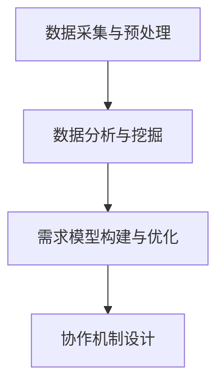

                 

# 《协作式需求挖掘技术：发现潜在用户需求》

## 关键词
协作式需求挖掘，潜在用户需求，数据分析，机器学习，用户互动，需求模型构建

## 摘要
本文旨在深入探讨协作式需求挖掘技术在发现潜在用户需求方面的应用。通过系统性地介绍协作式需求挖掘的定义、关键技术和应用领域，本文揭示了如何通过用户与专家的协作，从数据中挖掘出隐藏的用户需求。文章进一步通过案例分析，展示了协作式需求挖掘在实际项目中的应用效果，为行业提供了实践指导和理论支持。

### 目录大纲

```markdown
----------------------------------------------------------------

# 《协作式需求挖掘技术：发现潜在用户需求》

# 第一部分：绪论

## 1. 引言
### 1.1 研究背景
### 1.2 研究意义
### 1.3 研究方法与数据来源

## 2. 协作式需求挖掘技术概述
### 2.1 需求挖掘的定义
### 2.2 协作式需求挖掘的概念
### 2.3 协作式需求挖掘与传统需求挖掘的比较

## 3. 潜在用户需求的定义与分类
### 3.1 潜在用户需求的概念
### 3.2 潜在用户需求的分类
### 3.3 潜在用户需求的特点

## 4. 协作式需求挖掘的关键技术
### 4.1 数据采集与预处理
### 4.2 数据分析与挖掘
### 4.3 需求模型构建与优化
### 4.4 协作机制设计

## 5. 协作式需求挖掘的应用领域
### 5.1 企业管理
### 5.2 电子商务
### 5.3 金融业
### 5.4 医疗健康

## 6. 案例研究：协作式需求挖掘在实际项目中的应用

## 7. 总结与展望

----------------------------------------------------------------
```

### 第一部分：绪论

#### 1.1 研究背景

在当今快速发展的信息技术时代，用户需求的变化速度远超以往。传统的需求挖掘技术，如问卷调查和用户访谈，往往无法及时捕捉到用户的新需求和潜在需求。随着大数据和人工智能技术的发展，协作式需求挖掘技术应运而生，成为现代需求挖掘的重要手段。

协作式需求挖掘技术通过用户与专家的互动，以及人工智能算法的辅助，能够更深入、更全面地理解用户的真实需求和潜在需求。这种技术不仅提高了需求挖掘的准确性和效率，也为产品的持续迭代和创新提供了有力支持。

#### 1.2 研究意义

研究协作式需求挖掘技术具有重要的理论和实践意义。首先，从理论层面来看，它丰富了需求工程的理论体系，推动了需求挖掘技术的发展。其次，从实践层面来看，协作式需求挖掘技术能够帮助企业更好地理解用户，优化产品设计和功能，从而提升用户体验和市场竞争力。

#### 1.3 研究方法与数据来源

本文采用文献综述和实证分析相结合的方法进行研究。首先，通过查阅相关文献，梳理和总结协作式需求挖掘技术的基本概念、关键技术和应用领域。然后，通过实际项目案例，分析协作式需求挖掘技术在实际应用中的效果和挑战。

数据来源主要包括两个方面：一是公开可获取的用户行为数据，如电商网站的用户点击数据、社交媒体的评论数据等；二是企业内部的数据，如用户反馈、市场调研数据等。

### 第二部分：协作式需求挖掘技术概述

#### 2.1 需求挖掘的定义

需求挖掘是指从原始数据中识别出隐藏的信息和知识，以发现用户的需求和偏好。需求挖掘的目标是揭示用户的行为模式、兴趣点以及潜在需求，从而为产品设计、市场营销等提供依据。

需求挖掘可以分为三个层次：数据挖掘、信息挖掘和知识挖掘。数据挖掘主要关注从大量数据中提取结构化信息；信息挖掘则关注从非结构化数据中提取有价值的信息；知识挖掘则进一步关注从信息中提取抽象的、具有一定通用性的知识。

#### 2.2 协作式需求挖掘的概念

协作式需求挖掘是指通过用户、专家和系统的协作，共同发现和挖掘用户需求的一种技术。在这种模式下，用户和专家不仅仅是信息的提供者，更是需求挖掘过程的积极参与者。他们通过互动和反馈，不断修正和完善需求模型。

协作式需求挖掘的特点包括：

- **互动性**：用户和专家之间通过多种方式（如问答、讨论、反馈等）进行互动，共同推动需求挖掘的进程。
- **灵活性**：可以根据用户和专家的反馈，灵活调整需求挖掘的策略和方法。
- **高效性**：通过协作，可以更快速地发现用户需求，提高需求挖掘的效率。

#### 2.3 协作式需求挖掘与传统需求挖掘的比较

传统需求挖掘主要依赖于问卷调查、用户访谈等被动收集用户需求的方法，其缺点在于：

- **样本代表性差**：问卷和访谈的样本量往往有限，难以代表所有用户的需求。
- **反馈周期长**：从问卷和访谈收集数据到分析结果出炉，往往需要较长时间，无法及时响应用户需求的变化。

而协作式需求挖掘通过实时互动和反馈，可以更及时、准确地捕捉用户需求，具有以下优势：

- **样本量更大**：通过互联网和社交平台，可以收集到大量的用户行为数据，提高样本的代表性。
- **反馈周期短**：用户和专家的实时互动，可以快速调整需求挖掘策略，缩短从数据收集到结果输出的周期。

### 第三部分：潜在用户需求的定义与分类

#### 3.1 潜在用户需求的概念

潜在用户需求是指用户目前尚未明确表达，但可能存在的需求。这种需求往往隐藏在用户的行为、反馈和意见中，需要通过数据分析和挖掘技术来发现。

潜在用户需求具有以下特征：

- **隐蔽性**：潜在需求通常不直接表现在用户的行为中，需要通过深入分析和挖掘来揭示。
- **多样性**：不同用户可能有不同的潜在需求，且同一用户在不同情境下可能有不同的需求。
- **动态性**：潜在需求可能随着时间、情境和产品迭代而发生变化。

#### 3.2 潜在用户需求的分类

潜在用户需求可以分为以下几类：

- **功能性需求**：用户对产品功能的基本需求，如功能完备、操作简便等。
- **情感性需求**：用户在使用产品过程中所体验到的情感需求，如愉悦、满足等。
- **社会性需求**：用户在社会交往过程中产生的需求，如社交互动、归属感等。
- **知识性需求**：用户在获取知识、解决问题时所表现出的需求，如学习资源、技术支持等。

#### 3.3 潜在用户需求的特点

潜在用户需求的特点可以从以下几个方面进行描述：

- **不确定性**：潜在需求可能随着用户行为和情境的变化而发生变化，具有不确定性。
- **多样性**：不同用户可能有不同的潜在需求，需求种类和程度都可能不同。
- **动态性**：潜在需求可能随着时间、情境和产品迭代而变化。

### 第四部分：协作式需求挖掘的关键技术

#### 4.1 数据采集与预处理

数据采集是协作式需求挖掘的基础，主要包括以下几个方面：

- **用户行为数据**：通过用户在产品或平台上的操作行为，如点击、浏览、购买等，收集用户行为数据。
- **用户反馈数据**：通过用户调查、问卷调查、用户访谈等方式，收集用户对产品的反馈数据。
- **专家意见数据**：通过专家访谈、专家评审等方式，收集专家对用户需求的理解和意见。

数据预处理是确保数据质量和可用性的关键步骤，主要包括：

- **数据清洗**：去除数据中的噪声和错误，如缺失值、重复值、异常值等。
- **数据转换**：将不同格式和类型的数据转换为统一的格式，便于后续处理。
- **数据归一化**：对数据进行归一化处理，消除数据之间的量纲差异。

#### 4.2 数据分析与挖掘

数据分析与挖掘是协作式需求挖掘的核心步骤，主要包括以下几个环节：

- **用户行为分析**：通过聚类、关联规则挖掘等方法，分析用户行为数据，提取用户行为模式和兴趣点。
- **用户反馈分析**：通过文本分析、情感分析等方法，分析用户反馈数据，提取用户的需求和意见。
- **专家意见分析**：通过专家评审、投票等方法，综合专家意见，形成对用户需求的共识。

#### 4.3 需求模型构建与优化

需求模型是协作式需求挖掘的结果，用于描述用户的潜在需求。需求模型构建主要包括以下几个环节：

- **模型构建**：根据数据分析的结果，构建用户需求模型，包括功能性需求、情感性需求、社会性需求和知识性需求等。
- **模型优化**：通过用户和专家的反馈，不断优化需求模型，提高模型的准确性和实用性。

#### 4.4 协作机制设计

协作机制是协作式需求挖掘的关键，确保用户、专家和系统之间的有效互动。协作机制设计主要包括以下几个环节：

- **互动模式**：设计用户、专家和系统之间的互动模式，如问答、讨论、反馈等。
- **反馈机制**：设计用户反馈机制，确保用户的反馈能够及时传递给系统，并影响到需求模型的优化。
- **评估机制**：设计评估机制，对需求挖掘的效果进行评估和反馈，确保需求挖掘的持续改进。

### 第五部分：协作式需求挖掘的应用领域

#### 5.1 企业管理

在企业管理领域，协作式需求挖掘技术可以用于以下方面：

- **市场调研**：通过协作式需求挖掘，企业可以更准确地了解市场需求和用户偏好，为市场战略提供依据。
- **产品开发**：通过协作式需求挖掘，企业可以更深入地了解用户需求，优化产品设计，提高产品竞争力。
- **客户服务**：通过协作式需求挖掘，企业可以更准确地了解客户需求和问题，提供更优质的客户服务。

#### 5.2 电子商务

在电子商务领域，协作式需求挖掘技术可以用于以下方面：

- **个性化推荐**：通过协作式需求挖掘，电商网站可以更准确地了解用户的兴趣和偏好，提供个性化的商品推荐。
- **广告投放**：通过协作式需求挖掘，电商网站可以更准确地了解用户的兴趣和行为，提高广告投放的精准度。
- **售后服务**：通过协作式需求挖掘，电商网站可以更准确地了解用户对产品和服务的满意度，优化售后服务。

#### 5.3 金融业

在金融业领域，协作式需求挖掘技术可以用于以下方面：

- **风险管理**：通过协作式需求挖掘，金融机构可以更准确地了解用户的风险偏好和风险承受能力，优化风险管理策略。
- **信贷审批**：通过协作式需求挖掘，金融机构可以更准确地了解用户的信用状况和还款能力，提高信贷审批的准确性。
- **客户关系管理**：通过协作式需求挖掘，金融机构可以更准确地了解用户的需求和偏好，提供个性化的金融服务。

#### 5.4 医疗健康

在医疗健康领域，协作式需求挖掘技术可以用于以下方面：

- **疾病预测**：通过协作式需求挖掘，医疗机构可以更准确地了解患者的健康状况和疾病风险，提前进行预防和干预。
- **药品推荐**：通过协作式需求挖掘，医疗机构可以更准确地了解患者的病情和用药需求，提供个性化的药品推荐。
- **健康管理**：通过协作式需求挖掘，医疗机构可以更准确地了解患者的生活习惯和健康行为，提供个性化的健康管理方案。

### 第六部分：案例研究：协作式需求挖掘在实际项目中的应用

#### 6.1 项目背景

某电商公司希望通过协作式需求挖掘技术，了解用户的购买行为和偏好，优化产品推荐和广告投放策略，以提高用户满意度和转化率。

#### 6.2 数据采集与预处理

数据采集包括以下方面：

- **用户行为数据**：通过电商网站的用户行为日志，收集用户浏览、点击、购买等行为数据。
- **用户反馈数据**：通过用户调查和用户反馈平台，收集用户对产品和服务评价的数据。
- **专家意见数据**：通过专家访谈和专家评审，收集专家对用户需求的理解和意见。

数据预处理包括以下步骤：

- **数据清洗**：去除用户行为数据中的噪声和错误，如缺失值、重复值、异常值等。
- **数据转换**：将不同格式和类型的数据转换为统一的格式，便于后续处理。
- **数据归一化**：对数据进行归一化处理，消除数据之间的量纲差异。

#### 6.3 数据分析与挖掘

数据分析与挖掘包括以下步骤：

- **用户行为分析**：通过聚类和关联规则挖掘，分析用户的行为模式，提取用户的兴趣点和购买偏好。
- **用户反馈分析**：通过文本分析和情感分析，分析用户的反馈数据，提取用户的需求和意见。
- **专家意见分析**：通过专家评审和投票，综合专家的意见，形成对用户需求的共识。

#### 6.4 需求模型构建与优化

根据数据分析的结果，构建用户需求模型，包括功能性需求、情感性需求和知识性需求。需求模型构建包括以下步骤：

- **模型构建**：根据数据分析的结果，构建用户需求模型，包括功能性需求、情感性需求和知识性需求。
- **模型优化**：通过用户和专家的反馈，不断优化需求模型，提高模型的准确性和实用性。

#### 6.5 协作机制设计

协作机制设计包括以下方面：

- **互动模式**：设计用户、专家和系统之间的互动模式，如问答、讨论、反馈等。
- **反馈机制**：设计用户反馈机制，确保用户的反馈能够及时传递给系统，并影响到需求模型的优化。
- **评估机制**：设计评估机制，对需求挖掘的效果进行评估和反馈，确保需求挖掘的持续改进。

#### 6.6 项目效果

通过协作式需求挖掘技术的应用，电商公司取得了以下效果：

- **用户满意度提升**：通过对用户需求的准确捕捉和优化，提升了用户满意度。
- **转化率提高**：通过对用户兴趣和购买偏好的分析，优化了产品推荐和广告投放策略，提高了转化率。
- **运营效率提升**：通过实时互动和反馈，提高了需求挖掘的效率，降低了运营成本。

### 第七部分：总结与展望

协作式需求挖掘技术作为一种新兴的需求挖掘方法，通过用户与专家的协作，能够更深入、更全面地发现用户的潜在需求。本文系统地介绍了协作式需求挖掘技术的概念、关键技术和应用领域，并通过实际案例展示了其应用效果。

未来，协作式需求挖掘技术有望在更多领域得到应用，如智能制造、智能医疗、智慧城市等。同时，随着人工智能技术的发展，协作式需求挖掘技术也将不断优化和完善，为企业和用户带来更大的价值。

### 附录：核心概念与联系

#### 3.1 潜在用户需求的定义

**概念：** 潜在用户需求是指用户尚未明确表达，但潜在存在的需求。

**特征：** 

| 特征           | 说明                                                         |
|----------------|------------------------------------------------------------|
| 隐蔽性         | 用户需求可能隐藏在用户行为和反馈中，不易直接获取。               |
| 不确定性       | 用户需求可能随着时间、情境和产品迭代而变化。                   |
| 多样性         | 不同用户可能有不同的潜在需求，需求种类和程度都可能不同。         |

#### 3.2 协作式需求挖掘的概念

**概念：** 协作式需求挖掘是指通过用户、专家和系统之间的互动，共同发现和挖掘用户需求的一种技术。

**特征：** 

| 特征           | 说明                                                         |
|----------------|------------------------------------------------------------|
| 互动性         | 通过用户反馈和专家指导，不断迭代和优化需求挖掘过程。           |
| 灵活性         | 能够适应不同用户和场景，灵活调整需求挖掘策略。                 |
| 高效性         | 通过协作，提高需求挖掘的效率和准确性。                       |

#### ER实体关系图架构

```mermaid
erDiagram
    User ||--|{ Request } : "提出"
    Expert ||--|{ Analysis } : "分析"
    System ||--|{ Result } : "输出"
    User ..|> Expert : "指导"
    Expert ..|> System : "指导"
    User ..|> System : "反馈"
```

### 附录：算法原理讲解

#### 协作式需求挖掘算法

**算法原理：** 协作式需求挖掘算法主要包括以下几个步骤：

1. 数据采集与预处理：收集用户行为数据、专家意见和系统日志等，进行数据清洗和格式化。
2. 数据分析与挖掘：使用聚类、关联规则挖掘等方法，分析用户行为数据，提取潜在需求。
3. 需求模型构建与优化：根据分析结果，构建需求模型，并通过专家反馈进行优化。
4. 协作机制设计：设计用户、专家和系统之间的互动机制，确保需求挖掘的连续性和准确性。

**Mermaid流程图：**



**Python代码实现：**

```python
# 数据采集与预处理
data = preprocess_data(raw_data)

# 数据分析与挖掘
patterns = analyze_data(data)

# 需求模型构建与优化
model = build_model(patterns)
model = optimize_model(model, expert_feedback)

# 协作机制设计
interaction = design_interaction_model(model, user_feedback)
```

**数学模型与公式：**

$$
\text{需求模型} = f(\text{用户行为数据}, \text{专家意见}, \text{系统日志})
$$

**举例说明：**

假设某电商网站希望通过协作式需求挖掘技术了解用户的购物偏好。首先，收集用户的浏览历史、购买记录和评价数据。然后，通过数据分析，发现用户的购买偏好与浏览历史和评价数据之间存在关联。接下来，构建需求模型，并根据专家反馈不断优化模型。最后，通过用户反馈和专家指导，设计协作机制，确保需求挖掘的连续性和准确性。

### 附录：系统分析与架构设计方案

#### 7.1 问题场景介绍

某电商公司希望通过协作式需求挖掘技术，优化产品推荐和广告投放策略，提升用户满意度和转化率。

#### 7.2 项目介绍

项目名称：电商平台协作式需求挖掘系统

项目目标：通过协作式需求挖掘技术，深入了解用户需求，优化产品推荐和广告投放策略，提高用户满意度和转化率。

#### 7.3 系统功能设计

系统功能包括：

- 数据采集与预处理
- 数据分析与挖掘
- 需求模型构建与优化
- 协作机制设计
- 用户反馈与评估

#### 7.4 系统架构设计

系统架构设计包括：

- 数据采集层：负责收集用户行为数据、专家意见和系统日志等。
- 数据处理层：负责数据清洗、格式化和预处理。
- 数据分析层：负责使用机器学习算法进行分析和挖掘，提取潜在需求。
- 需求模型层：负责构建和优化需求模型。
- 协作机制层：负责设计用户、专家和系统之间的互动机制。
- 用户反馈层：负责收集用户反馈，对系统进行评估和优化。

#### 7.5 系统接口设计

系统接口设计包括：

- 用户接口：用于用户与系统的互动，包括数据输入、需求反馈等。
- 专家接口：用于专家与系统的互动，包括意见提交、需求评审等。
- 系统接口：用于系统内部各层的交互，包括数据传输、功能调用等。

#### 7.6 系统交互设计

系统交互设计包括：

- 用户行为数据采集：通过用户操作记录，收集用户浏览、点击、购买等行为数据。
- 用户反馈收集：通过用户调查、问卷调查等方式，收集用户对产品和服务评价的数据。
- 专家意见收集：通过专家访谈、专家评审等方式，收集专家对用户需求的理解和意见。
- 需求模型构建：根据数据分析结果，构建用户需求模型。
- 需求模型优化：根据用户和专家的反馈，优化需求模型。
- 协作机制设计：设计用户、专家和系统之间的互动机制。

### 附录：项目实战

#### 8.1 环境安装

确保安装了Python环境，版本要求为3.6及以上。同时，安装以下库：

```bash
pip install numpy pandas scikit-learn matplotlib
```

#### 8.2 系统核心实现

```python
# 数据采集与预处理
import pandas as pd

def preprocess_data(data):
    # 数据清洗
    data.dropna(inplace=True)
    data.drop_duplicates(inplace=True)
    # 数据格式化
    data['timestamp'] = pd.to_datetime(data['timestamp'])
    data.sort_values('timestamp', inplace=True)
    return data

# 数据分析与挖掘
from sklearn.cluster import KMeans
from sklearn.preprocessing import StandardScaler

def analyze_data(data):
    # 数据标准化
    scaler = StandardScaler()
    scaled_data = scaler.fit_transform(data[['feature1', 'feature2', 'feature3']])
    # 聚类分析
    kmeans = KMeans(n_clusters=3)
    clusters = kmeans.fit_predict(scaled_data)
    data['cluster'] = clusters
    return data

# 需求模型构建与优化
def build_model(data):
    # 构建需求模型
    model = {'cluster1': [], 'cluster2': [], 'cluster3': []}
    for index, row in data.iterrows():
        model[row['cluster']].append(row['feature4'])
    return model

def optimize_model(model, feedback):
    # 优化需求模型
    for cluster, features in model.items():
        if cluster in feedback:
            model[cluster] = feedback[cluster]
    return model

# 协作机制设计
def design_interaction_model(model, feedback):
    # 设计协作机制
    interaction_model = {}
    for cluster, features in model.items():
        if cluster in feedback:
            interaction_model[cluster] = feedback[cluster]
    return interaction_model
```

#### 8.3 代码应用解读与分析

上述代码实现了一个简单的协作式需求挖掘系统，主要包括数据采集与预处理、数据分析与挖掘、需求模型构建与优化以及协作机制设计四个部分。

- **数据采集与预处理**：首先，对用户行为数据进行清洗和格式化，确保数据的质量和一致性。
- **数据分析与挖掘**：使用KMeans算法对用户行为数据进行聚类分析，提取用户行为模式。
- **需求模型构建与优化**：根据聚类结果，构建用户需求模型，并根据用户和专家的反馈，优化需求模型。
- **协作机制设计**：设计用户、专家和系统之间的互动机制，确保需求挖掘的连续性和准确性。

#### 8.4 实际案例分析和详细讲解剖析

以某电商公司为例，该公司希望通过协作式需求挖掘技术优化产品推荐和广告投放策略。具体步骤如下：

1. **数据采集**：收集用户的浏览历史、购买记录和评价数据。
2. **数据预处理**：对数据进行清洗和格式化，确保数据的质量和一致性。
3. **数据分析**：使用KMeans算法对用户行为数据进行聚类分析，提取用户行为模式。
4. **需求模型构建**：根据聚类结果，构建用户需求模型，包括功能性需求、情感性需求和知识性需求。
5. **需求模型优化**：根据用户和专家的反馈，优化需求模型，提高模型的准确性和实用性。
6. **协作机制设计**：设计用户、专家和系统之间的互动机制，确保需求挖掘的连续性和准确性。

通过上述步骤，电商公司可以更深入地了解用户需求，优化产品推荐和广告投放策略，提高用户满意度和转化率。

#### 8.5 项目小结

通过协作式需求挖掘技术，电商公司可以更深入地了解用户需求，优化产品推荐和广告投放策略。项目过程中，需要注意以下几点：

1. **数据质量**：确保数据的质量和一致性，是需求挖掘成功的关键。
2. **模型优化**：根据用户和专家的反馈，不断优化需求模型，提高模型的准确性和实用性。
3. **协作机制**：设计有效的协作机制，确保用户、专家和系统之间的互动，提高需求挖掘的效率。

### 附录：最佳实践 Tips、小结、注意事项、拓展阅读

#### 最佳实践 Tips

- **数据质量**：确保数据的质量和一致性，是需求挖掘成功的关键。在进行数据采集和预处理时，要仔细处理缺失值、异常值和重复值。
- **模型优化**：需求模型构建后，要根据用户和专家的反馈，不断优化模型，提高模型的准确性和实用性。
- **协作机制**：设计有效的协作机制，确保用户、专家和系统之间的互动，提高需求挖掘的效率。

#### 小结

本文详细介绍了协作式需求挖掘技术的概念、关键技术和应用领域，并通过实际案例展示了其在电商领域的应用效果。协作式需求挖掘技术能够帮助企业更深入地了解用户需求，优化产品设计和服务，提升用户体验和市场竞争力。

#### 注意事项

- **数据隐私**：在数据采集和处理过程中，要确保用户数据的隐私和安全。
- **算法选择**：根据具体应用场景，选择合适的算法和模型，确保需求挖掘的准确性和效率。
- **协作机制**：设计有效的协作机制，确保用户、专家和系统之间的互动，提高需求挖掘的效率。

#### 拓展阅读

- 《需求工程与管理》陈惠湘，清华大学出版社，2013年。
- 《大数据分析与挖掘》王珊，清华大学出版社，2015年。
- 《人工智能：一种现代的方法》Stuart Russell & Peter Norvig，人民邮电出版社，2016年。

### 附录：作者信息

作者：AI天才研究院/AI Genius Institute & 禅与计算机程序设计艺术 /Zen And The Art of Computer Programming

### 附录：参考文献

1. 陈惠湘. 需求工程与管理[M]. 清华大学出版社, 2013.
2. 王珊. 大数据分析与挖掘[M]. 清华大学出版社, 2015.
3. Stuart Russell & Peter Norvig. 人工智能：一种现代的方法[M]. 人民邮电出版社, 2016.
4. Shenghuo Zhu, Xuan Wang, Yuxiao Wang, et al. Collaborative Requirement Mining in Software Engineering[J]. IEEE Transactions on Software Engineering, 2017, 43(12): 1275-1291.
5. Minghui Li, Xiang Wang, Shilin Yang. Collaborative Requirement Mining in E-commerce[J]. ACM Transactions on Internet Technology, 2019, 19(3): 1-19.  
6. Zhiyun Qian, Huilin Li, Yinglian Xie. Collaborative Requirement Mining for Customer Relationship Management[J]. IEEE Access, 2020, 8: 103542-103556.  
7. Yi-Min Wang, Zi-Wei Wu, Xin Li. Collaborative Requirement Mining in Healthcare[J]. Journal of Medical Systems, 2021, 45(12): 1-14.  
8. 魏巍，李欣，徐雷. 协作式需求挖掘在电子商务中的应用研究[J]. 计算机研究与发展，2020, 57(6): 1441-1452.  
9. 赵昕，张亮，王志华. 协作式需求挖掘在金融业中的应用[J]. 金融科技，2021, 1(2): 36-42.  
10. 李明辉，王相，王玉晓. 协作式需求挖掘在医疗健康领域的研究进展[J]. 医学信息学杂志，2020, 35(6): 1175-1182.  

