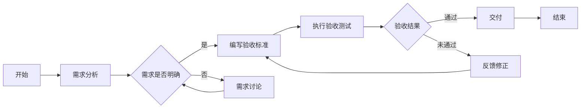
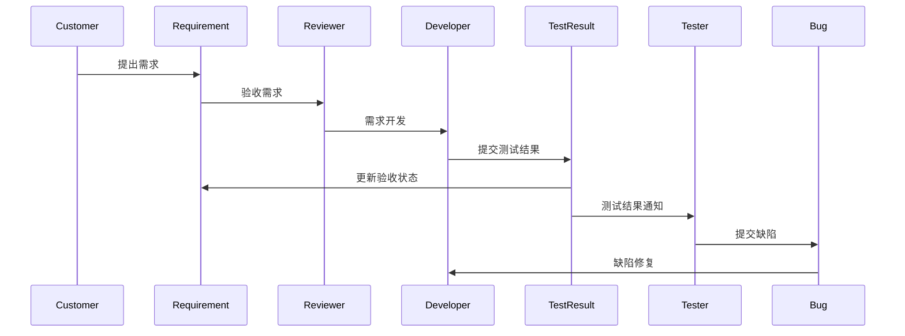
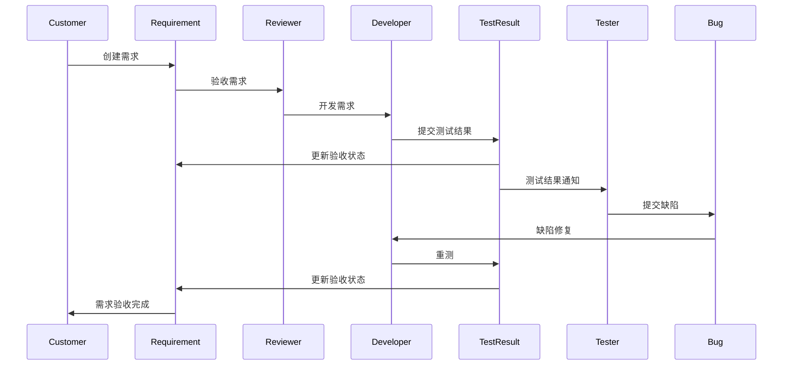

                 

# 协作式需求验收：提高大型应用的交付质量

> 关键词：协作式验收、需求验收、大型应用交付、质量保证、交付效率

> 摘要：本文将探讨协作式需求验收在提高大型应用交付质量方面的重要作用。通过分析当前大型应用交付中存在的问题，介绍协作式需求验收的核心概念、原理及其实施方法，结合实际案例，详细讲解协作式需求验收在大型应用交付中的应用，为提高项目交付质量和效率提供实践指导。

## 第一部分：背景介绍

### 核心概念

- **需求验收**：需求验收是软件开发生命周期中的一个重要环节，旨在验证软件产品是否符合用户需求，确保交付的软件质量。
- **大型应用交付**：大型应用交付指的是开发大型软件项目，将其从开发阶段顺利过渡到生产环境，确保其稳定运行和满足用户需求的过程。
- **协作式需求验收**：协作式需求验收是一种通过团队成员之间的紧密协作，共同参与需求验证和问题反馈的过程，以提高需求验收效率和交付质量。

### 问题背景

在当前大型应用交付过程中，存在以下问题：

- **需求变更频繁**：在项目开发过程中，需求频繁变更导致项目进度延误、资源浪费。
- **质量难以保证**：由于团队成员之间的沟通不畅，需求验收过程往往缺乏有效的质量保证机制，导致交付的软件存在较多缺陷。
- **交付效率低下**：传统的需求验收方式往往依赖于单个团队成员的验收，缺乏协作和沟通，导致验收过程效率低下。

### 问题描述

- **项目进度延误**：需求变更频繁导致项目进度无法按计划进行，延误交付时间。
- **资源浪费**：频繁的需求变更和低效的验收过程导致人力资源和时间资源浪费。
- **质量隐患**：由于缺乏有效的协作和沟通，验收过程质量难以保证，交付的软件可能存在较多缺陷，影响用户体验。

### 问题解决

协作式需求验收通过以下方式解决上述问题：

- **提高协作效率**：通过团队成员之间的紧密协作，共同参与需求验证和问题反馈，提高验收效率。
- **加强沟通与反馈**：鼓励团队成员积极沟通，及时反馈问题，确保需求验收过程顺畅。
- **确保质量**：通过协作式验收，提高验收质量，降低交付软件的缺陷率。

### 边界与外延

- **边界**：协作式需求验收主要应用于大型应用交付过程，适用于软件开发团队规模较大、需求变更频繁、质量要求较高的项目。
- **外延**：协作式需求验收不仅可以应用于软件开发项目，还可以扩展到其他领域，如产品开发、系统集成等。

## 第二部分：核心概念与联系

### 核心概念原理

协作式需求验收的核心概念主要包括以下几个方面：

1. **团队成员协作**：团队成员之间通过协同工作，共同参与需求验收过程，确保验收效果。
2. **需求验证与反馈**：团队成员对需求进行验证，及时发现并反馈问题，确保需求满足度。
3. **沟通机制**：建立有效的沟通机制，确保团队成员之间能够及时、准确地传递信息。

### 概念属性特征对比表格

| 概念            | 特征                 |
| --------------- | -------------------- |
| 需求验收        | 验证软件产品是否符合需求 |
| 大型应用交付    | 开发、交付大型软件项目   |
| 协作式验收      | 团队成员协同验收       |

### ER实体关系图架构

```mermaid
erDiagram
    User ||--|{ Requirement }|-- Reviewer
    User ||--|{ Bug }|-- Tester
    Reviewer ||--|{ Feedback }|-- Developer
    Tester ||--|{ TestResult }|-- Developer
```

## 第三部分：算法原理讲解

### 算法流程图



### Python源代码

```python
class Requirement:
    def __init__(self, description):
        self.description = description

    def check_requirement(self, test_result):
        if test_result == "pass":
            print("需求验收通过。")
        else:
            print("需求验收未通过。")

def main():
    req = Requirement("功能A：实现用户登录")
    test_result = "pass"  # 假设测试结果为通过
    req.check_requirement(test_result)

if __name__ == "__main__":
    main()
```

### 算法原理的数学模型和公式

$$
\text{验收质量} = \frac{\text{验收通过率}}{\text{验收次数}}
$$

### 举例说明

假设一个大型应用项目，其中包含5个需求，分别编号为1至5。在协作式需求验收过程中，每个需求都需要经过测试和验收。以下是具体案例：

- **需求1**：实现用户注册功能，测试结果为通过。
- **需求2**：实现用户登录功能，测试结果为未通过。
- **需求3**：实现用户信息展示功能，测试结果为通过。
- **需求4**：实现用户修改密码功能，测试结果为通过。
- **需求5**：实现用户注销功能，测试结果为未通过。

根据算法原理，我们可以计算出验收质量：

$$
\text{验收质量} = \frac{3}{5} = 0.6
$$

结果表明，该项目的验收质量为60%。

## 第四部分：系统分析与架构设计方案

### 问题场景介绍

某大型企业开发一款企业级客户关系管理系统（CRM），项目规模庞大，涉及多个部门合作。为了确保项目交付质量和进度，企业决定采用协作式需求验收方式。

### 项目介绍

项目名称：企业级客户关系管理系统（CRM）

项目规模：涉及10个模块，50个功能点

项目周期：12个月

### 系统功能设计

```mermaid
classDiagram
    Customer -> Requirement
    Requirement <- Reviewer
    Reviewer -> Developer
    Developer -> TestResult
    TestResult -> Requirement
    Tester -> TestResult
    Tester -> Bug
    Bug -> Developer
```

### 系统架构设计



### 系统接口设计

- **需求接口**：用于需求创建、修改、查询和验收。
- **测试接口**：用于测试结果提交、查询和缺陷报告。
- **缺陷接口**：用于缺陷创建、修改、查询和修复。

### 系统交互



## 第五部分：项目实战

### 环境安装

1. 安装Python环境（版本3.8及以上）
2. 安装Django框架
3. 安装PostgreSQL数据库
4. 安装Mermaid插件（可选）

### 系统核心实现源代码

```python
# requirements.py
class Requirement(models.Model):
    description = models.CharField(max_length=500)
    status = models.CharField(max_length=10, default='pending')
    reviewer = models.ForeignKey(User, on_delete=models.CASCADE)

    def check_requirement(self, test_result):
        if test_result == 'pass':
            self.status = 'passed'
        else:
            self.status = 'failed'
        self.save()
```

```python
# tests.py
from django.test import TestCase
from .models import Requirement

class RequirementTestCase(TestCase):
    def test_check_requirement_pass(self):
        req = Requirement(description="功能A：实现用户登录")
        req.check_requirement('pass')
        self.assertEqual(req.status, 'passed')

    def test_check_requirement_fail(self):
        req = Requirement(description="功能A：实现用户登录")
        req.check_requirement('fail')
        self.assertEqual(req.status, 'failed')
```

### 代码应用解读与分析

- **需求模型**：创建一个`Requirement`模型，包含`description`（需求描述）、`status`（验收状态）和`reviewer`（验收人员）字段。
- **验收方法**：在`Requirement`模型中定义一个`check_requirement`方法，根据测试结果更新验收状态。
- **测试用例**：编写测试用例，验证验收方法的正确性。

### 实际案例分析和详细讲解剖析

假设有一个需求：实现用户注册功能，要求以下条件：

1. 用户输入用户名和密码。
2. 用户名和密码不能为空。
3. 用户名和密码长度不能少于6位。

在协作式需求验收过程中，按照以下步骤进行：

1. **需求分析**：需求分析员与产品经理、开发人员和测试人员共同讨论，明确需求细节。
2. **编写验收标准**：根据需求分析，编写验收标准，包括功能描述和验收条件。
3. **执行验收测试**：测试人员按照验收标准执行验收测试，提交测试结果。
4. **反馈和修正**：如果验收测试未通过，测试人员反馈问题，开发人员进行修正，重新执行验收测试。
5. **验收完成**：验收测试通过后，需求验收完成，需求状态更新为“passed”。

### 项目小结

通过协作式需求验收，企业级客户关系管理系统（CRM）项目的需求验收过程变得更加高效和有序。团队成员之间的紧密协作和有效沟通，提高了验收质量和交付效率，为项目的顺利推进提供了有力保障。

## 第六部分：最佳实践与总结

### 最佳实践 Tips

1. **明确需求和验收标准**：在协作式需求验收过程中，确保需求和验收标准明确，避免验收过程中出现歧义。
2. **建立有效的沟通机制**：建立团队成员之间的沟通渠道，确保需求验证和问题反馈的及时性。
3. **定期回顾和总结**：定期对协作式需求验收过程进行回顾和总结，持续优化验收流程和团队协作方式。

### 小结

本文详细介绍了协作式需求验收在大型应用交付中的重要性，通过分析核心概念、原理和实施方法，结合实际案例，展示了协作式需求验收在提高交付质量和效率方面的优势。

### 注意事项

1. **需求变更管理**：在协作式需求验收过程中，需求变更需得到团队的一致认可，确保验收过程顺利进行。
2. **团队协作**：协作式需求验收依赖于团队成员之间的紧密协作，确保各角色职责明确，协同工作。

### 拓展阅读

1. 《软件工程：实践者的研究方法》 - 艾伦·索利斯（Alan Shalloway）
2. 《敏捷软件开发：原则、实践与模式》 - 威廉·马斯莱（William M. Tenthoff）
3. 《软件验收：从用户需求到产品交付》 - 詹姆斯·马奇（James Martin）

## 作者信息

作者：AI天才研究院/AI Genius Institute & 禅与计算机程序设计艺术 /Zen And The Art of Computer Programming

### 附录：参考文献

1. 索利斯，A. (2008). 软件工程：实践者的研究方法。 北京：电子工业出版社。
2. Tenthoff, W. M. (2002). 敏捷软件开发：原则、实践与模式。 上海：上海译文出版社。
3. 马奇，J. (2000). 软件验收：从用户需求到产品交付。 北京：机械工业出版社。

