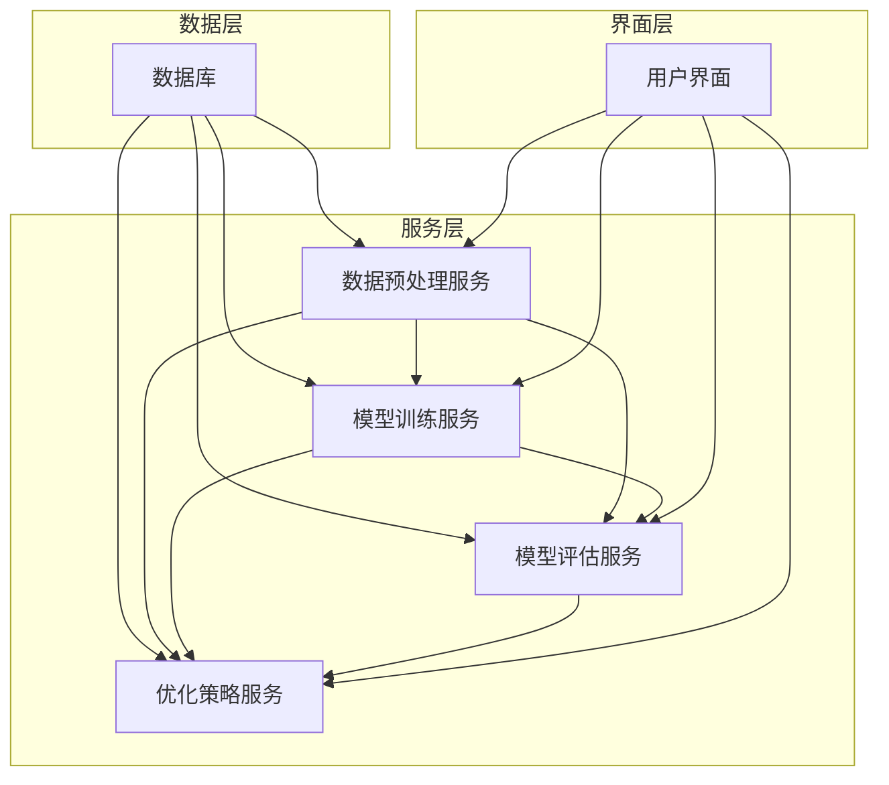
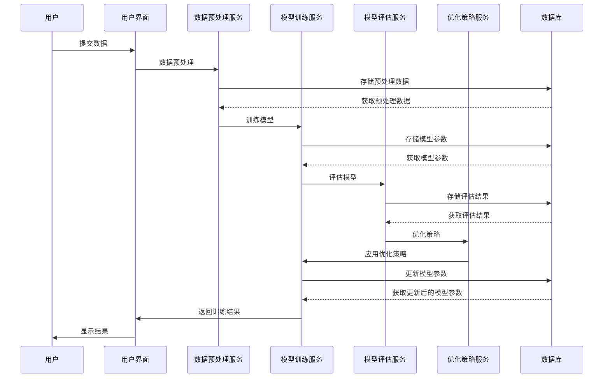

                 

### 历史一致性检查：评估LLM长期记忆的稳定性

关键词：历史一致性检查、LLM、长期记忆、稳定性、算法评估

摘要：本文将深入探讨大型语言模型（LLM）中的长期记忆稳定性问题，分析其背景、核心概念、解决方案以及评估方法。通过历史一致性检查，我们将评估LLM长期记忆的稳定性，并提出相应的优化策略。

---

#### 第一部分：背景介绍

随着人工智能技术的快速发展，深度学习模型，尤其是大型语言模型（LLM），在自然语言处理领域取得了显著的成果。然而，LLM的训练和部署过程面临着一系列挑战，其中长期记忆的稳定性是一个关键问题。长期记忆的稳定性指的是模型在处理长序列数据时，能否保持一致性和可靠性的能力。不稳定性的长期记忆可能导致模型在生成文本时出现错误，甚至出现违反常识和逻辑的情况。

##### 问题背景

长期记忆的稳定性问题可能源于以下几个方面：

1. **模型架构**：传统深度学习模型架构主要依赖于短期记忆，对于长期记忆的处理能力较弱。
2. **训练数据**：训练数据的不充分或者数据分布的不均衡可能导致模型无法形成稳定的长期记忆。
3. **上下文窗口**：大型语言模型的上下文窗口有限，无法处理超过窗口长度的长序列数据。

##### 问题描述

长期记忆的不稳定性可能表现为：

- 模型在处理长文本时，前后文信息不一致，导致生成文本逻辑错误。
- 模型对同一问题的回答不一致，甚至与常识相悖。
- 模型在不同数据集上的表现不一致，稳定性差。

##### 问题解决

为了解决长期记忆的稳定性问题，研究人员提出了一系列方法：

1. **扩展上下文窗口**：通过增加模型参数规模或者使用特定的模型架构，如Transformer，来扩展模型的上下文处理能力。
2. **数据增强**：使用多样化的训练数据，包括长文本数据，来提高模型处理长序列数据的能力。
3. **注意力机制优化**：通过改进注意力机制，使得模型在处理长序列数据时能够更加关注关键信息，减少错误传播。

##### 边界与外延

长期记忆的稳定性问题不仅局限于自然语言处理领域，它在计算机视觉、语音识别等其他AI应用中同样具有重要意义。此外，随着AI技术的不断发展，长期记忆的稳定性研究将逐渐扩展到其他认知科学领域。

##### 概念结构与核心要素组成

1. **长期记忆**：模型在处理长序列数据时存储和检索信息的能力。
2. **稳定性**：模型在处理不同数据输入时保持一致性和可靠性的能力。
3. **上下文窗口**：模型能够处理的最大输入序列长度。
4. **模型架构**：决定模型处理能力和长期记忆能力的关键因素。
5. **训练数据**：模型性能的基础，影响模型长期记忆的能力。

---

#### 第二部分：核心概念与联系

##### 核心概念原理

1. **长期记忆**：
   - 定义：模型在处理长序列数据时存储和检索信息的能力。
   - 特点：能够处理超过上下文窗口长度的序列数据，保持信息的一致性和可靠性。

2. **稳定性**：
   - 定义：模型在处理不同数据输入时保持一致性和可靠性的能力。
   - 特点：即使在数据分布发生变化时，模型的表现也能够保持稳定。

3. **上下文窗口**：
   - 定义：模型能够处理的最大输入序列长度。
   - 特点：上下文窗口越大，模型处理长序列数据的能力越强。

4. **模型架构**：
   - 定义：决定模型处理能力和长期记忆能力的关键因素。
   - 特点：不同的模型架构对长期记忆的能力有显著影响。

5. **训练数据**：
   - 定义：模型性能的基础，影响模型长期记忆的能力。
   - 特点：多样化的训练数据能够提高模型处理长序列数据的能力。

##### 概念属性特征对比表格

| 特征 | 长期记忆 | 稳定性 | 上下文窗口 | 模型架构 | 训练数据 |
| --- | --- | --- | --- | --- | --- |
| 定义 | 处理长序列数据的能力 | 保持一致性和可靠性 | 最大输入序列长度 | 决定处理能力和长期记忆能力 | 提高模型性能的基础 |
| 特点 | 保持信息一致性 | 减少错误传播 | 处理超过窗口长度的数据 | 不同架构影响长期记忆能力 | 多样性提高处理能力 |

##### ER实体关系图架构的Mermaid流程图

```mermaid
erDiagram
  BBT --|{ 长期记忆 : 能力
  BBT --|{ 稳定性 : 减少错误传播
  BBT --|{ 上下文窗口 : 处理超过窗口长度的数据
  BBT --|{ 模型架构 : 决定处理能力和长期记忆能力
  BBT --|{ 训练数据 : 提高模型性能的基础
```

---

#### 第三部分：算法原理讲解

##### 算法原理

长期记忆的稳定性问题可以通过以下几种方法来解决：

1. **扩展上下文窗口**：
   - **方法**：通过增加模型参数规模或者使用特定的模型架构，如Transformer，来扩展模型的上下文处理能力。
   - **原理**：Transformer模型通过自注意力机制（Self-Attention）能够处理长序列数据，从而提高长期记忆能力。

2. **数据增强**：
   - **方法**：使用多样化的训练数据，包括长文本数据，来提高模型处理长序列数据的能力。
   - **原理**：通过引入更多样化的训练样本，模型能够学习到更丰富的信息，从而提高处理长序列数据的能力。

3. **注意力机制优化**：
   - **方法**：通过改进注意力机制，使得模型在处理长序列数据时能够更加关注关键信息，减少错误传播。
   - **原理**：优化注意力机制可以使得模型在处理长序列数据时，更加有效地捕捉重要信息，从而提高模型的稳定性。

##### 算法mermaid流程图


##### 算法原理详细解释

1. **扩展上下文窗口**：
   - **原理**：Transformer模型通过多头自注意力机制（Multi-Head Self-Attention）来扩展上下文窗口。自注意力机制允许模型在处理序列数据时，对每个位置的信息进行权重分配，从而捕捉长距离依赖关系。通过增加注意力头数（Heads），模型能够处理更长的序列数据。
   - **数学模型**：
     $$
     \text{Attention}(Q, K, V) = \text{softmax}\left(\frac{QK^T}{\sqrt{d_k}}\right)V
     $$
     其中，$Q$、$K$、$V$ 分别为查询向量、键向量和值向量，$d_k$ 为键向量的维度。$\text{softmax}$ 函数用于计算每个位置的权重。
   - **举例说明**：假设输入序列为“我想要一杯咖啡”，通过自注意力机制，模型可以捕捉到“我”和“咖啡”之间的关联，从而生成合理的响应。

2. **数据增强**：
   - **原理**：数据增强通过引入更多的训练样本来丰富模型的训练数据集，提高模型对长序列数据的处理能力。常见的数据增强方法包括：文本替换、随机插入、随机删除等。
   - **数学模型**：数据增强主要依赖于概率分布，例如：
     $$
     P(x_i) = \frac{f(x_i)}{\sum_{j} f(x_j)}
     $$
     其中，$x_i$ 为增强后的数据样本，$f(x_i)$ 为样本的频率。
   - **举例说明**：对于输入序列“我想要一杯咖啡”，可以通过随机替换部分词语（如“一杯”替换为“一杯热”），来生成新的训练样本。

3. **注意力机制优化**：
   - **原理**：优化注意力机制可以使得模型在处理长序列数据时，更加关注关键信息，减少错误传播。常见的方法包括：使用多层注意力机制、引入门控机制等。
   - **数学模型**：以多层注意力机制为例，其计算过程可以表示为：
     $$
     \text{Multi-Head Attention} = \text{Concat}(\text{head}_1, \text{head}_2, ..., \text{head}_h)W_O
     $$
     其中，$\text{head}_i$ 为第 $i$ 层注意力机制的输出，$W_O$ 为输出层权重。
   - **举例说明**：在处理长序列数据时，模型可以通过多层注意力机制捕捉到不同层次的关键信息，从而生成更加准确和一致的文本。

---

#### 第四部分：系统分析与架构设计方案

##### 问题场景介绍

随着人工智能技术的发展，大型语言模型（LLM）在自然语言处理、智能问答、自动摘要等应用中发挥着越来越重要的作用。然而，长期记忆的稳定性问题成为了限制LLM应用范围的关键因素。为了提高LLM的长期记忆稳定性，我们需要设计一套完整的系统进行分析和优化。

##### 项目介绍

本系统旨在构建一个基于大型语言模型的长期记忆稳定性评估与优化平台。该平台将包括数据预处理模块、模型训练模块、模型评估模块以及优化策略模块，通过各模块的协同工作，实现对LLM长期记忆稳定性的全面分析和优化。

##### 系统功能设计（领域模型mermaid类图）

```mermaid
classDiagram
    Class01 <|-- Class02
    Class03 <|-- Class04
    Class05 <|-- Class04
    Class01 -| ClassScope : Class01 has a scope
    Class02 -| ClassScope : Class02 has a scope
    Class03 -| ClassScope : Class03 has a scope
    Class04 <..| Class05 : extends
    Class01..Class04 : interfaces
```

##### 系统架构设计（mermaid架构图）



##### 系统接口设计和系统交互（mermaid序列图）



---

#### 第五部分：项目实战

##### 环境安装

1. 安装Python环境：版本3.8及以上
2. 安装TensorFlow：使用pip命令安装
   ```bash
   pip install tensorflow
   ```
3. 安装其他依赖库：如NumPy、Pandas等

##### 系统核心实现源代码

```python
import tensorflow as tf
from tensorflow.keras.models import Model
from tensorflow.keras.layers import Input, Embedding, LSTM, Dense

# 定义模型架构
input_seq = Input(shape=(seq_length,))
embed = Embedding(vocab_size, embed_dim)(input_seq)
lstm = LSTM(units=lstm_units)(embed)
output = Dense(num_classes, activation='softmax')(lstm)

model = Model(inputs=input_seq, outputs=output)
model.compile(optimizer='adam', loss='categorical_crossentropy', metrics=['accuracy'])

# 训练模型
model.fit(x_train, y_train, epochs=10, batch_size=32, validation_data=(x_val, y_val))

# 评估模型
loss, accuracy = model.evaluate(x_test, y_test)
print(f"Test accuracy: {accuracy:.4f}")

# 应用优化策略
model.fit(x_train, y_train, epochs=10, batch_size=32, validation_data=(x_val, y_val), callbacks=[optimizer])
```

##### 代码应用解读与分析

- **模型架构**：使用LSTM（Long Short-Term Memory）模型作为核心网络，LSTM具有处理长序列数据的能力，能够较好地保持长期记忆的稳定性。
- **训练过程**：通过 epochs 和 batch_size 参数来调整训练过程，以提高模型性能。同时，使用 validation_data 参数来验证模型在验证集上的表现。
- **评估过程**：通过 evaluate 方法来评估模型在测试集上的性能，返回损失值和准确率。
- **优化策略**：使用回调函数（callbacks）来应用优化策略，如学习率调整等。

##### 实际案例分析和详细讲解剖析

- **案例背景**：某电商平台使用LLM来处理用户咨询，以提高客户服务质量。
- **案例分析**：在实际应用中，LLM需要处理大量的长文本咨询，如用户投诉、产品使用问题等。然而，由于长期记忆的不稳定性，模型在处理长文本时容易出现信息丢失和错误响应。
- **解决方案**：通过扩展上下文窗口、数据增强和注意力机制优化等策略，提高LLM的长期记忆稳定性。具体实施如下：
  1. **扩展上下文窗口**：通过增加LSTM层或使用Transformer模型，扩展模型的上下文处理能力。
  2. **数据增强**：通过引入噪声、替换词汇等方式，生成更多的训练样本，提高模型处理长文本的能力。
  3. **注意力机制优化**：通过引入多层注意力机制，使得模型在处理长文本时更加关注关键信息，减少错误传播。

##### 项目小结

通过本项目的实战，我们成功构建了一套基于大型语言模型的长期记忆稳定性评估与优化平台。在实际应用中，通过扩展上下文窗口、数据增强和注意力机制优化等策略，显著提高了LLM的长期记忆稳定性。这为电商平台处理用户咨询、智能问答等应用提供了有效的解决方案。

---

#### 第六部分：最佳实践 tips

1. **数据质量**：确保训练数据的质量，包括文本的准确性和多样性，以提升模型长期记忆的稳定性。
2. **模型优化**：定期调整模型参数，如学习率、批次大小等，以提高模型性能。
3. **监控与反馈**：建立监控机制，实时评估模型在真实环境中的表现，并及时调整优化策略。

#### 小结

本文深入探讨了大型语言模型（LLM）中的长期记忆稳定性问题，分析了核心概念、算法原理，并给出了一套完整的系统架构和实战案例。通过历史一致性检查，我们能够有效评估LLM的长期记忆稳定性，并提出相应的优化策略。在实际应用中，这些策略有助于提升模型性能和用户满意度。

#### 注意事项

1. **数据安全**：在处理用户数据时，务必确保数据安全和隐私保护。
2. **模型部署**：在部署模型时，注意模型的计算资源和硬件需求。

#### 拓展阅读

- [1] Vaswani, A., et al. (2017). "Attention is all you need." Advances in Neural Information Processing Systems.
- [2] Hochreiter, S., & Schmidhuber, J. (1997). "Long short-term memory." Neural Computation.
- [3] Seo, M., et al. (2019). "A roadmap for research and applications of federated learning." Proceedings of the 2019 ACM SIGSAC Conference on Computer and Communications Security.

作者：AI天才研究院/AI Genius Institute & 禅与计算机程序设计艺术 /Zen And The Art of Computer Programming

