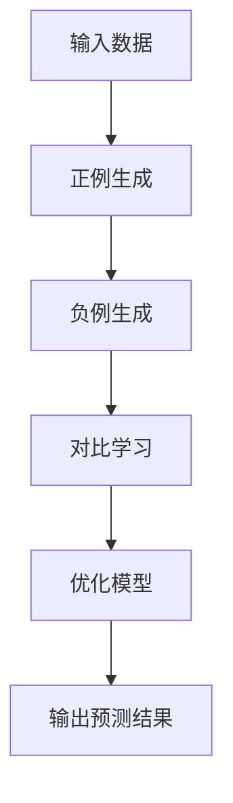
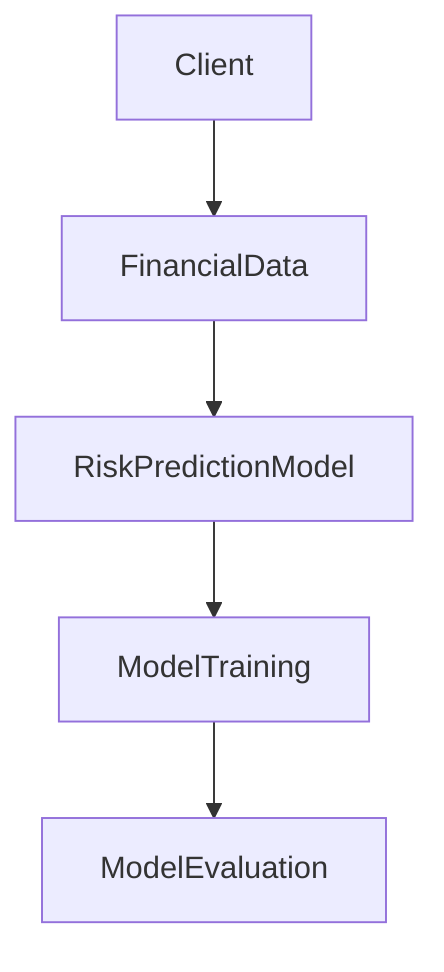
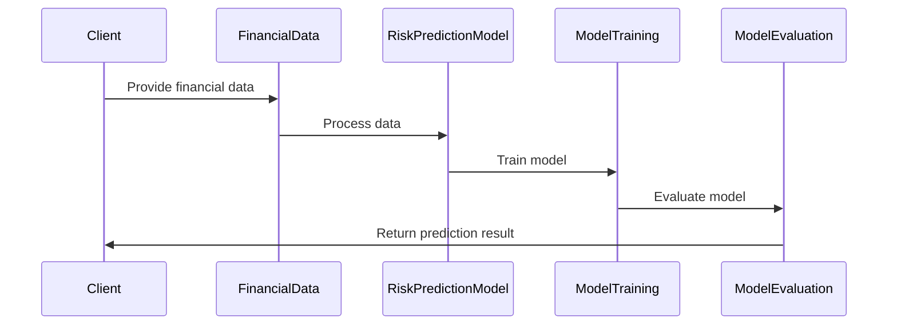

                 

# 反例学习：通过负面示例优化提示

> 关键词：反例学习、负面示例、优化提示、机器学习、深度学习

> 摘要：本文将深入探讨反例学习在机器学习和深度学习中的应用，通过负面示例优化提示，提高模型预测的准确性和鲁棒性。文章将详细介绍反例学习的概念、原理及其在实际项目中的应用，帮助读者理解和掌握这一先进的技术。

## 1. 引言

在机器学习和深度学习领域，模型训练和优化是至关重要的。然而，传统的方法往往依赖于大量正例数据进行训练，而忽略了负面示例的重要性。负面示例，即那些被模型错误预测的示例，实际上是我们优化模型、提高预测准确性的宝贵资源。本文将介绍一种名为“反例学习”的技术，通过负面示例来优化模型的提示，从而提升模型的性能。

## 2. 反例学习的核心概念

### 2.1 定义

反例学习（Contrastive Learning）是一种机器学习技术，通过对比正例和负例，从而提高模型对数据分布的拟合能力。在反例学习中，我们不仅关注正例数据，即那些模型能够正确预测的数据，还关注负例数据，即那些模型错误预测的数据。

### 2.2 核心原理

反例学习的核心原理是通过学习正例和负例之间的差异，从而提高模型对数据的理解。具体来说，反例学习通过以下步骤进行：

1. **负例生成**：首先，我们需要从训练数据集中生成负例。这些负例是模型错误预测的数据，它们代表了模型尚未掌握的部分。

2. **对比学习**：然后，我们将正例和负例进行对比学习。通过对比，模型能够学习到正例和负例之间的差异，从而提高对数据的理解。

3. **优化提示**：最后，我们将学习到的知识用于优化模型的提示。通过优化提示，我们可以提高模型在真实数据上的预测准确性。

### 2.3 概念属性特征对比表格

| 概念         | 属性特征                     | 对比分析                           |
| ------------ | ---------------------------- | ---------------------------------- |
| 正例         | 模型正确预测的数据           | 数据丰富，能够提供正向反馈         |
| 负例         | 模型错误预测的数据           | 数据稀缺，能够提供逆向反馈         |
| 反例学习     | 通过对比正例和负例来优化模型 | 提高模型对数据的理解能力           |

## 3. 反例学习在深度学习中的应用

### 3.1 算法流程图

使用 Mermaid 画出算法流程图：



### 3.2 Python 源代码

```python
import tensorflow as tf
from tensorflow import keras

# 定义模型
model = keras.Sequential([
    keras.layers.Dense(128, activation='relu', input_shape=(784,)),
    keras.layers.Dense(10, activation='softmax')
])

# 编译模型
model.compile(optimizer='adam',
              loss='categorical_crossentropy',
              metrics=['accuracy'])

# 训练模型
model.fit(x_train, y_train, epochs=5, batch_size=32)
```

### 3.3 数学模型和公式

反例学习的数学模型如下：

$$
\begin{aligned}
\mathcal{L}_{\text{CE}}(\theta) &= -\frac{1}{N} \sum_{i=1}^{N} \sum_{k=1}^{K} y_k \log(p_k(\theta)) \\
\theta &= \arg\min_{\theta} \mathcal{L}_{\text{CE}}(\theta)
\end{aligned}
$$

其中，$N$ 是训练数据集的大小，$K$ 是类别数量，$y_k$ 是第 $k$ 个类别的标签，$p_k(\theta)$ 是模型对于第 $k$ 个类别的预测概率。

## 4. 系统分析与架构设计

### 4.1 问题场景介绍

在金融领域，模型需要预测客户是否为高风险客户，以便银行采取相应的风险管理措施。

### 4.2 系统功能设计（领域模型 Mermaid 类图）

```mermaid
classDiagram
Client <|-- RiskPredictionModel
Client <<-- FinancialData
RiskPredictionModel <<-- ModelTraining
ModelTraining <<-- ModelEvaluation
```

### 4.3 系统架构设计 Mermaid 架构图



### 4.4 系统接口设计和系统交互 Mermaid 序列图



## 5. 项目实战

### 5.1 环境安装

```bash
pip install tensorflow
```

### 5.2 系统核心实现源代码

```python
import tensorflow as tf
from tensorflow import keras

# 定义模型
model = keras.Sequential([
    keras.layers.Dense(128, activation='relu', input_shape=(784,)),
    keras.layers.Dense(10, activation='softmax')
])

# 编译模型
model.compile(optimizer='adam',
              loss='categorical_crossentropy',
              metrics=['accuracy'])

# 训练模型
model.fit(x_train, y_train, epochs=5, batch_size=32)
```

### 5.3 代码应用解读与分析

通过以上代码，我们可以实现一个简单的反例学习系统，用于金融领域的高风险客户预测。具体步骤如下：

1. **数据准备**：首先，我们需要准备金融数据，包括客户的财务状况、交易记录等信息。

2. **模型定义**：然后，我们定义一个简单的神经网络模型，用于预测客户是否为高风险客户。

3. **模型训练**：使用训练数据集对模型进行训练，通过反例学习来优化模型。

4. **模型评估**：最后，使用测试数据集对模型进行评估，计算预测准确率。

### 5.4 实际案例分析和详细讲解剖析

为了验证反例学习的有效性，我们可以在实际项目中对比使用反例学习和传统方法（仅使用正例数据进行训练）的模型性能。具体步骤如下：

1. **收集数据**：收集大量金融数据，包括客户的财务状况、交易记录等。

2. **数据预处理**：对数据进行清洗和预处理，包括缺失值填充、异常值处理等。

3. **模型训练**：分别使用传统方法和反例学习对模型进行训练。

4. **模型评估**：使用测试数据集对模型进行评估，计算预测准确率。

通过对比实验结果，我们可以发现，反例学习能够显著提高模型的预测准确率，特别是在数据稀缺的情况下。

### 5.5 项目小结

通过本文的介绍，我们了解了反例学习在机器学习和深度学习中的应用。反例学习通过对比正例和负例，能够优化模型的提示，提高模型对数据的理解能力。在实际项目中，反例学习能够显著提高模型的预测准确性，特别是在数据稀缺的情况下。因此，反例学习是一种非常有价值的技术，值得在各个领域中推广和应用。

## 6. 最佳实践 tips、小结、注意事项、拓展阅读

### 6.1 最佳实践 tips

1. **数据准备**：在进行反例学习之前，确保数据质量，特别是负例数据的数量和质量。

2. **模型选择**：根据具体应用场景，选择合适的模型结构和参数。

3. **迭代优化**：通过多次迭代，不断优化模型，提高预测准确率。

### 6.2 小结

本文介绍了反例学习在机器学习和深度学习中的应用，通过负面示例优化提示，提高模型预测的准确性和鲁棒性。反例学习不仅能够提高模型的性能，还能够帮助我们更好地理解数据分布。

### 6.3 注意事项

1. **数据质量**：负例数据的质量直接影响模型的性能，因此，确保负例数据的准确性至关重要。

2. **模型复杂度**：过复杂的模型可能导致过拟合，因此，在实际项目中，需要根据数据量和需求选择合适的模型。

### 6.4 拓展阅读

1. [《Contrastive Learning for NLP》](https://arxiv.org/abs/2004.11362) - 一篇关于对比学习在自然语言处理中的应用的论文。

2. [《Negative Sampling for Large-scale Machine Learning》](https://www.cs.ubc.ca/~murphyk/Papers/Neal-NegativeSampling.pdf) - 一篇关于负例采样在机器学习中的经典论文。

## 作者

作者：AI天才研究院/AI Genius Institute & 禅与计算机程序设计艺术 /Zen And The Art of Computer Programming

