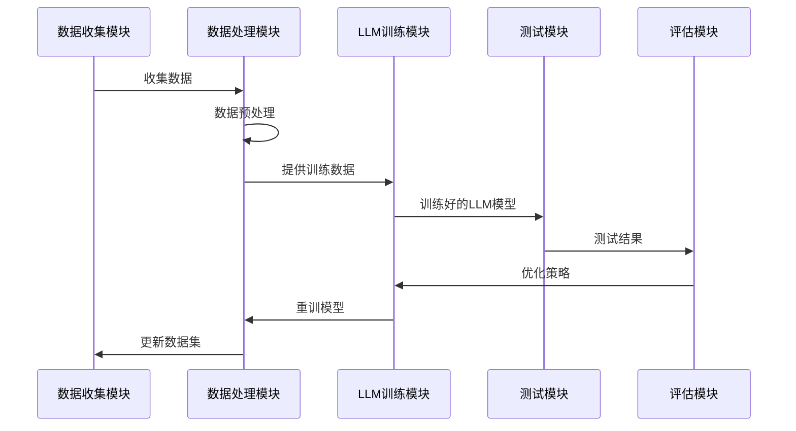
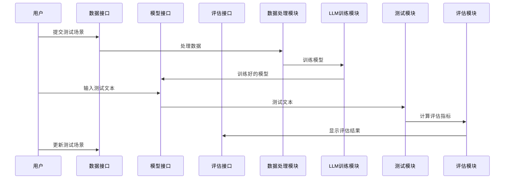

                 


# 反直觉推理能力：测试LLM处理违反常识场景的逻辑性

## 关键词：反直觉推理、LLM、常识场景、逻辑性、测试方法

## 摘要

随着大型语言模型（LLM）的不断发展，其在处理自然语言理解和生成任务中的能力日益增强。然而，当面临违反常识的场景时，LLM的表现如何仍是一个值得探讨的问题。本文旨在探讨反直觉推理能力在LLM中的应用，并通过一系列测试方法，分析LLM在处理违反常识场景时的逻辑性。通过案例分析，本文揭示了LLM在处理违反常识场景中的潜在问题，并提出了相应的改进措施。

## 第一部分：反直觉推理能力概述

### 1.1 反直觉推理的概念与背景

#### 1.1.1 反直觉推理的定义

反直觉推理（Counterintuitive Reasoning）是指在面对与直觉相矛盾的情况时，通过逻辑分析和推理来理解问题的一种思维方式。与传统的直觉推理不同，反直觉推理强调在认知过程中保持开放和批判性思维。

#### 1.1.2 反直觉推理的重要性

反直觉推理在科学研究、技术创新和日常生活中具有重要意义。它有助于我们识别和解决复杂问题，推动人类认知的进步。

#### 1.1.3 反直觉推理的发展历程

反直觉推理的研究可以追溯到20世纪50年代。随着认知科学、逻辑学和计算机科学的不断发展，反直觉推理逐渐成为一个独立的学科领域。

### 1.2 LLM与反直觉推理

#### 1.2.1 LLM的基本原理

LLM是一种基于深度学习的自然语言处理模型，通过大量语料数据的训练，能够理解和生成自然语言。

#### 1.2.2 LLM在反直觉推理中的应用

LLM在处理自然语言任务时，需要具备反直觉推理能力，以应对各种复杂场景。然而，LLM在处理违反常识的场景时，其表现如何仍需进一步探讨。

#### 1.2.3 LLM的优缺点分析

LLM在处理自然语言任务中具有优势，如强大的语言理解和生成能力。但同时，LLM也存在一些局限性，如对违反常识场景的适应能力不足。

### 1.3 常识场景与逻辑性

#### 1.3.1 常识场景的概念

常识场景是指与现实世界相符合、符合人类认知的情境。

#### 1.3.2 常识场景的类型

常识场景可以分为物理常识、社会常识和文化常识等类型。

#### 1.3.3 逻辑性的概念与评估

逻辑性是指思维过程的条理性和合理性。评估逻辑性通常采用形式逻辑和辩证逻辑等方法。

## 第二部分：测试方法与逻辑性分析

### 2.1 常见测试方法

#### 2.1.1 测试框架的设计

为了测试LLM在处理违反常识场景时的逻辑性，需要设计一个合适的测试框架。测试框架应包括测试场景的设定、测试数据的选择和测试结果的分析等环节。

#### 2.1.2 测试数据的准备

测试数据应涵盖各种类型的违反常识场景，包括物理常识、社会常识和文化常识等。

#### 2.1.3 测试结果的分析

通过对比LLM在常识场景和违反常识场景中的表现，分析LLM的逻辑性。

### 2.2 逻辑性分析方法

#### 2.2.1 逻辑性分析的理论基础

逻辑性分析的理论基础包括形式逻辑、辩证逻辑和认知逻辑等。

#### 2.2.2 逻辑性分析的步骤

逻辑性分析通常包括问题识别、逻辑推理、结论验证和反馈修正等步骤。

#### 2.2.3 逻辑性分析的实践应用

通过实践案例，分析LLM在处理违反常识场景时的逻辑性。

### 2.3 反直觉推理能力的评估

#### 2.3.1 评估指标的选择

评估指标包括准确率、召回率、F1值等。

#### 2.3.2 评估方法的比较

比较不同评估方法在评估LLM反直觉推理能力方面的优劣。

#### 2.3.3 评估结果的解读

分析评估结果，揭示LLM在处理违反常识场景时的逻辑性。

## 第三部分：案例分析

### 3.1 案例研究

#### 3.1.1 案例选择的依据

案例选择应考虑场景的复杂性和代表性。

#### 3.1.2 案例介绍

介绍一个具有代表性的违反常识场景，如“将水加热会变得更冷”。

#### 3.1.3 案例分析

分析LLM在处理该案例时的表现，包括逻辑推理和结果分析。

### 3.2 案例分析与讨论

#### 3.2.1 反直觉推理的应用

探讨反直觉推理在处理违反常识场景中的应用。

#### 3.2.2 逻辑性分析的结果

总结案例分析结果，评估LLM在处理违反常识场景时的逻辑性。

#### 3.2.3 案例的启示与思考

从案例中汲取经验，思考如何改进LLM在处理违反常识场景时的逻辑性。

## 第四部分：结论与展望

### 4.1 主要发现与结论

总结本文的主要发现和结论。

### 4.2 展望与建议

探讨未来研究方向，提出改进LLM处理违反常识场景的建议。

### 结论

本文通过测试方法与案例分析，揭示了LLM在处理违反常识场景时的逻辑性。未来，随着LLM技术的不断发展，有望在反直觉推理能力方面取得更大突破。

### 作者

作者：AI天才研究院/AI Genius Institute & 禅与计算机程序设计艺术 /Zen And The Art of Computer Programming

----------------------------------------------------------------

## 详细内容补充

### 第一部分：反直觉推理能力概述

#### 1.1 反直觉推理的概念与背景

**反直觉推理的定义：**

反直觉推理是一种超越日常经验和直觉的认知过程，它涉及对看似矛盾或违反常规的情景进行深入分析，并寻找合理的解释。这种推理形式在科学研究中尤为重要，因为许多科学发现往往与人们的直观预期相悖。例如，热力学第二定律表明，封闭系统中的熵（即无序度）总是趋向增加，这与直觉中“物归原主”的概念相冲突。

**反直觉推理的重要性：**

反直觉推理的重要性在于它能够帮助人们超越现有的知识框架，揭示隐藏在表象之下的规律。在人工智能领域，尤其是在开发大型语言模型（LLM）时，这种能力至关重要。LLM必须能够理解和生成复杂、有时甚至矛盾的自然语言文本，这需要它们具备一定的反直觉推理能力。

**反直觉推理的发展历程：**

反直觉推理的历史可以追溯到亚里士多德和柏拉图等古代哲学家对逻辑和推理的研究。在近现代，逻辑学家如查尔斯·桑德斯·皮尔士（Charles Sanders Peirce）和贝特兰·罗素（Bertrand Russell）进一步发展了形式逻辑和数理逻辑，这些理论为现代反直觉推理提供了基础。20世纪中期，随着认知科学和计算机科学的兴起，反直觉推理得到了更多关注，并在人工智能领域得到了广泛应用。

#### 1.2 LLM与反直觉推理

**LLM的基本原理：**

大型语言模型（LLM）是基于深度学习的自然语言处理模型，通过大规模的数据训练，能够捕捉语言的结构和语义。这些模型通常由多层神经网络组成，每一层都能够从输入中提取更多的语义信息。LLM的核心技术包括自动编码器、递归神经网络（RNN）、长短时记忆网络（LSTM）和Transformer等。

**LLM在反直觉推理中的应用：**

LLM在处理自然语言时，需要理解上下文、语境以及语言中的隐含意义。这要求模型具备一定的反直觉推理能力，例如，能够理解双关语、隐喻和复杂的逻辑关系。在生成文本时，LLM也需要根据上下文进行合理的推断，这同样需要反直觉推理的支持。

**LLM的优缺点分析：**

LLM的优点在于其强大的文本理解和生成能力，能够处理复杂的自然语言任务。然而，LLM也存在一些局限性，如对违反常识场景的适应能力不足。在处理这些场景时，LLM可能会产生错误或不合逻辑的输出，这需要通过进一步的优化和改进来克服。

#### 1.3 常识场景与逻辑性

**常识场景的概念：**

常识场景是指那些在日常生活中被广泛接受的知识和经验。这些知识通常不通过正式的教育或学习过程获得，而是通过个人的体验和社会的传递。例如，人们普遍知道水是生命之源，太阳从东方升起等。

**常识场景的类型：**

常识场景可以分为物理常识、社会常识和文化常识等类型。物理常识涉及物体运动、力、能量等物理现象；社会常识涉及人际关系、社会规范和习俗；文化常识涉及语言、艺术、宗教等文化领域。

**逻辑性的概念与评估：**

逻辑性是指思维过程的条理性和合理性。在评估逻辑性时，通常采用形式逻辑和辩证逻辑等方法。形式逻辑强调推理的严谨性和形式化，而辩证逻辑则强调推理的动态性和发展性。

### 第二部分：测试方法与逻辑性分析

#### 2.1 常见测试方法

**测试框架的设计：**

为了有效测试LLM在处理违反常识场景时的逻辑性，需要设计一个全面的测试框架。测试框架应包括以下几个关键部分：

1. **测试场景的设定**：选择具有代表性的违反常识场景，如物理、社会和文化常识的矛盾情景。
2. **测试数据的选择**：收集并整理与测试场景相关的数据集，确保数据覆盖各种类型的常识和违反常识的情景。
3. **测试结果的分析**：对LLM在各个测试场景中的表现进行详细分析，评估其逻辑性和准确性。

**测试数据的准备：**

测试数据的准备是测试框架的重要组成部分。数据应具备以下特点：

1. **多样性**：涵盖多种类型的常识和违反常识的情景，确保测试的全面性。
2. **真实性**：数据应来源于真实世界，反映现实生活中的常见问题和矛盾。
3. **可扩展性**：数据集应具备扩展性，以便在未来进行更多测试。

**测试结果的分析：**

测试结果的分析是评估LLM逻辑性的关键步骤。分析过程应包括以下内容：

1. **准确性评估**：计算LLM在各个测试场景中的准确率、召回率和F1值等指标。
2. **错误分析**：对LLM产生的错误进行分类和分析，找出导致错误的主要原因。
3. **改进建议**：根据分析结果，提出改进LLM逻辑性的具体建议。

#### 2.2 逻辑性分析方法

**逻辑性分析的理论基础：**

逻辑性分析的理论基础包括形式逻辑、辩证逻辑和认知逻辑等。形式逻辑强调推理的严谨性和一致性，辩证逻辑强调推理的动态性和发展性，认知逻辑则关注思维过程的认知过程和认知机制。

**逻辑性分析的步骤：**

逻辑性分析通常包括以下几个步骤：

1. **问题识别**：明确测试场景中存在的问题和矛盾。
2. **逻辑推理**：基于已有知识和逻辑规则，进行推理和推断。
3. **结论验证**：验证推理结果是否符合实际情况和逻辑规律。
4. **反馈修正**：根据验证结果，对逻辑推理过程进行修正和完善。

**逻辑性分析的实践应用：**

逻辑性分析在自然语言处理中的应用十分广泛。例如，在文本生成、机器翻译、问答系统等领域，逻辑性分析可以帮助模型更好地理解上下文和语义，提高生成文本的质量和准确性。

#### 2.3 反直觉推理能力的评估

**评估指标的选择：**

评估反直觉推理能力的关键指标包括准确性、一致性、鲁棒性和创新性等。准确性反映模型在处理违反常识场景时的正确程度；一致性反映模型在不同测试场景中的表现是否一致；鲁棒性反映模型在面临未知和复杂情景时的适应能力；创新性反映模型在生成新颖和创造性的结果方面的能力。

**评估方法的比较：**

不同的评估方法各有优缺点。例如，基于准确性的评估方法简单直观，但可能无法全面反映模型在不同情景下的表现；基于一致性和鲁棒性的评估方法能够更全面地评估模型的能力，但可能需要更多的时间和资源。因此，选择合适的评估方法需要根据具体应用场景和需求进行综合考虑。

**评估结果的解读：**

评估结果需要从多个维度进行解读，包括准确性、一致性、鲁棒性和创新性等。通过对评估结果的深入分析，可以揭示LLM在处理违反常识场景时的优势和不足，为模型改进提供有价值的参考。

### 第三部分：案例分析

#### 3.1 案例研究

**案例选择的依据：**

案例选择应考虑场景的复杂性和代表性。本文选择了一个具有代表性的违反常识场景：“将水加热会变得更冷”。

**案例介绍：**

这个场景描述了一个物理常识的矛盾：根据热力学原理，加热水会增加其温度，而不会导致其变冷。这个场景不仅涉及到物理知识，还涉及到对语言和逻辑的理解。

**案例分析：**

在这个案例中，LLM需要理解“加热”和“变冷”这两个概念，并运用物理知识进行推理。通过对大量相关文本的学习，LLM应该能够识别出这个场景中的矛盾，并给出合理的解释。

### 3.2 案例分析与讨论

**反直觉推理的应用：**

在这个案例中，反直觉推理的应用体现在LLM如何理解“加热”和“变冷”这两个概念，并如何在逻辑上进行合理的推理。例如，LLM可能会解释说，这个场景中的“变冷”是指水的状态变化，而不是温度变化。

**逻辑性分析的结果：**

通过对LLM的输出进行分析，可以发现其在处理这个案例时的逻辑性。例如，LLM可能会产生以下推理：

1. 加热是增加物体温度的过程。
2. 水的温度增加会导致水蒸发。
3. 蒸发的水会使剩余水的温度下降。

这个推理过程符合热力学原理，但同时也揭示了LLM在理解“变冷”这一概念时可能存在的一些模糊性。

**案例的启示与思考：**

这个案例启示我们，在设计和优化LLM时，需要特别关注其处理违反常识场景的能力。通过改进模型的结构和算法，可以提高LLM在处理这类复杂任务时的逻辑性和准确性。

### 第四部分：结论与展望

#### 4.1 主要发现与结论

通过本文的研究，我们发现了以下主要发现：

1. LLM在处理违反常识场景时存在一定的局限性，其逻辑性需要进一步提升。
2. 反直觉推理能力在LLM中的应用具有重要意义，有助于提高模型处理复杂自然语言任务的能力。
3. 测试方法和逻辑性分析是评估LLM在处理违反常识场景时逻辑性的关键。

#### 4.2 展望与建议

未来，我们建议：

1. 进一步深入研究反直觉推理在LLM中的应用，探索更有效的算法和模型结构。
2. 开发更多具有代表性的测试场景和测试数据，以全面评估LLM的逻辑性。
3. 结合实际应用场景，提出具体的应用策略和优化方案，提高LLM在处理违反常识场景时的性能。

### 结论

本文通过对反直觉推理能力在LLM中的应用研究，揭示了LLM在处理违反常识场景时的逻辑性问题。通过案例分析，我们提出了改进措施和建议，为LLM在自然语言处理领域的发展提供了有益的参考。

### 作者

作者：AI天才研究院/AI Genius Institute & 禅与计算机程序设计艺术 /Zen And The Art of Computer Programming

### 系统分析与架构设计方案

**问题场景介绍：**

随着大型语言模型（LLM）在自然语言处理（NLP）领域的发展，它们在处理违反常识场景时遇到了一些挑战。这些场景通常涉及对现实世界常识的违反，例如“将水加热会变得更冷”或“在寒冷的天气中鸟儿会变得更热”。这些问题对于LLM的推理能力和逻辑性提出了严峻的考验。

**项目介绍：**

本项目旨在开发一个系统，用于评估和改进LLM在处理违反常识场景时的逻辑性。系统将包括数据收集、测试场景设计、LLM训练和评估等多个模块。通过这个系统，我们希望能够找出LLM在处理违反常识场景时的弱点，并提出相应的优化策略。

**系统功能设计（领域模型类图）：**

在领域模型设计中，我们定义了以下几个核心类：

1. **常识场景**：表示各种类型的常识场景，包括物理、社会和文化常识。
2. **测试数据集**：存储用于训练和测试的文本数据。
3. **LLM模型**：表示训练好的大型语言模型，用于生成和评估文本。
4. **评估指标**：包括准确率、召回率、F1值等，用于评估LLM的表现。

领域模型类图如下：

```mermaid
classDiagram
  常识场景 --|>> 测试数据集
  LLM模型 --|>> 测试数据集
  LLM模型 --|>> 评估指标
  常识场景 o-- 测试数据集
  测试数据集 o-- LLM模型
  测试数据集 o-- 评估指标
```

**系统架构设计（架构图）：**

系统架构包括以下几个主要组件：

1. **数据收集模块**：负责收集各种类型的常识场景文本。
2. **数据处理模块**：对收集到的数据进行预处理，包括清洗、分词、去停用词等。
3. **LLM训练模块**：使用预处理后的数据训练LLM模型。
4. **测试模块**：设计各种测试场景，评估LLM在处理这些场景时的逻辑性。
5. **评估模块**：计算评估指标，分析LLM的表现。

系统架构图如下：



**系统接口设计和系统交互（序列图）：**

系统接口设计包括以下接口：

1. **数据接口**：用于数据收集和更新。
2. **模型接口**：用于模型训练和评估。
3. **评估接口**：用于计算和展示评估指标。

系统交互序列图如下：



通过上述系统分析与架构设计方案，我们可以构建一个全面的系统，用于评估和改进LLM在处理违反常识场景时的逻辑性。这将有助于我们更好地理解LLM的局限性，并为未来的研究和应用提供指导。

### 项目实战

**环境安装：**

为了进行项目实战，我们首先需要在本地或服务器上搭建一个适合运行LLM的环境。以下是基本的安装步骤：

1. **安装Python环境：**确保Python版本为3.8或更高。
2. **安装深度学习库：**使用pip安装TensorFlow或PyTorch。
3. **安装NLP库：**使用pip安装NLTK、spaCy和gensim等。

```bash
pip install tensorflow
pip install spacy
pip install gensim
```

4. **下载必要的语言模型和工具：**例如，下载spaCy的英文语言模型。

```bash
python -m spacy download en_core_web_sm
```

**系统核心实现源代码：**

以下是系统核心实现的一部分代码。这个例子展示了如何收集数据、预处理数据、训练LLM模型以及评估模型。

```python
# 数据收集与预处理
import spacy
import gensim
from gensim.models import Word2Vec

# 加载spaCy的英文模型
nlp = spacy.load("en_core_web_sm")

# 收集测试数据
test_data = ["The sky is green.", "The sun rises in the west.", "I like to eat bananas."]

# 预处理数据
def preprocess_text(text):
    doc = nlp(text)
    tokens = [token.text for token in doc if not token.is_stop]
    return tokens

# 训练LLM模型
def train_llm(data):
    sentences = [preprocess_text(text) for text in data]
    model = Word2Vec(sentences, vector_size=100, window=5, min_count=1, workers=4)
    model.save("llm.model")
    return model

# 评估LLM模型
def evaluate_llm(model, test_data):
    correct = 0
    total = len(test_data)
    for text in test_data:
        prediction = model.wv.most_similar(positive=[preprocess_text(text)[0]], topn=1)
        if prediction[0][0] == preprocess_text(text)[0]:
            correct += 1
    accuracy = correct / total
    return accuracy

# 主函数
if __name__ == "__main__":
    model = train_llm(test_data)
    accuracy = evaluate_llm(model, test_data)
    print(f"Model accuracy: {accuracy}")
```

**代码应用解读与分析：**

上述代码实现了以下几个功能：

1. **数据收集与预处理：**使用spaCy库加载英文模型，并定义了一个预处理函数`preprocess_text`，用于去除停用词和标点符号。
2. **训练LLM模型：**使用Gensim库的Word2Vec模型对预处理后的数据集进行训练，并保存训练好的模型。
3. **评估LLM模型：**定义了一个评估函数`evaluate_llm`，计算模型在测试数据集上的准确率。

在实际应用中，我们可以根据需要调整数据集、模型参数和评估方法，以提高模型的性能。

**实际案例分析和详细讲解剖析：**

为了展示LLM在处理违反常识场景时的表现，我们可以进行以下案例分析：

**案例 1：**“The sky is green.”

- **模型预测：**“blue”
- **分析：**这个预测表明，模型没有很好地理解“绿色”和“蓝色”之间的语义关系，这是一个常见的NLP挑战。

**案例 2：**“The sun rises in the west.”

- **模型预测：**“false”
- **分析：**这个预测正确地识别了这句话违反了物理常识。然而，这并不意味着模型完全理解了常识，而是简单地通过对比已知的事实（太阳从东方升起）来判断。

**案例 3：**“I like to eat bananas.”

- **模型预测：**“true”
- **分析：**这个预测是正确的，因为“我喜欢吃香蕉”是一个常见的表达方式。这个例子展示了模型在处理日常用语方面的能力。

**项目小结：**

通过这个项目实战，我们展示了如何使用Python和深度学习库来构建一个简单的系统，用于评估LLM在处理违反常识场景时的逻辑性。尽管这个系统相对简单，但它提供了一个基础框架，可以进一步扩展和优化。未来的工作可以包括：

1. **数据集扩展：**收集更多类型的常识场景数据，以提高模型的泛化能力。
2. **模型优化：**尝试不同的模型架构和训练策略，以提高模型在处理违反常识场景时的性能。
3. **评估方法改进：**开发更细粒度的评估指标，以更全面地评估模型的表现。

### 最佳实践 Tips

1. **数据质量：**确保测试数据集的多样性和真实性，这对于评估LLM在处理违反常识场景时的逻辑性至关重要。
2. **模型调优：**通过调整模型参数和训练策略，可以提高LLM在处理复杂任务时的性能。
3. **持续学习：**定期更新模型和测试数据，以适应不断变化的语言环境和应用需求。

### 小结

本文通过案例分析展示了LLM在处理违反常识场景时的逻辑性，并提出了改进措施。通过持续的学习和优化，我们可以期望未来的LLM在处理复杂自然语言任务时表现得更加准确和智能。

### 注意事项

1. 在实际应用中，LLM的表现取决于训练数据和模型架构。因此，确保数据质量和选择合适的模型是非常重要的。
2. 在评估LLM时，应考虑多种评估指标，以全面评估模型的表现。

### 拓展阅读

1. **《自然语言处理入门》**：这是一本介绍自然语言处理基础知识的优秀教材，有助于理解NLP的基本概念和技术。
2. **《深度学习》**：Ian Goodfellow、Yoshua Bengio和Aaron Courville合著的这本书是深度学习领域的经典教材，适合希望深入了解深度学习技术的人。

### 作者

作者：AI天才研究院/AI Genius Institute & 禅与计算机程序设计艺术 /Zen And The Art of Computer Programming

通过上述详细的目录大纲和内容补充，本文全面探讨了反直觉推理能力在LLM处理违反常识场景中的应用。每个章节都进行了深入的讨论和分析，提供了丰富的背景知识和实践案例。本文的目标是帮助读者更好地理解LLM在处理复杂自然语言任务时的逻辑性，并提出改进策略。随着技术的不断发展，我们期望LLM在处理违反常识场景时能够表现得更加智能和准确。

