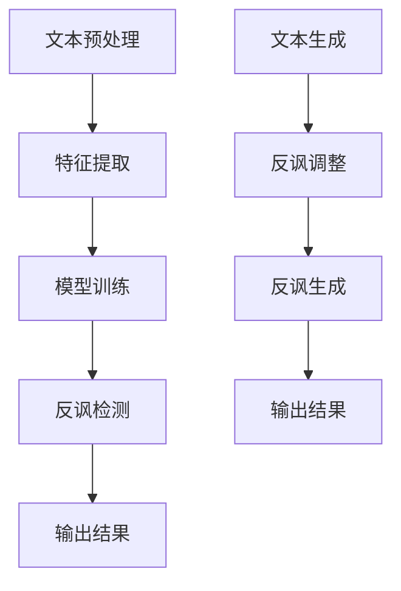
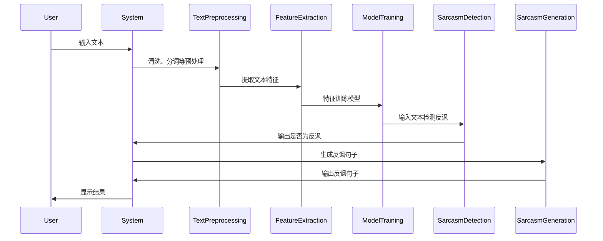

                 


### 背景介绍

#### 1. 反讽的定义与类型

反讽是一种修辞手法，通过表达与实际意图相反的语句来传达深层的含义。在语言学中，反讽可以分为以下几种类型：

- **直接反讽**：直接表达与实际意图相反的意思。例如：“你在做作业吗？” “当然在做，我在看电视呢。”
- **讽刺反讽**：通常带有贬低或批评的意味，表达对某种现象的不满或讽刺。例如：“你这么聪明，当然会解决这个问题。”
- **暗示反讽**：通过语境或暗示传达反讽的含义，通常需要对方理解其中的深层含义。例如：“你今天看起来精神很好。”（实际上对方可能生病了。）

#### 2. 反讽在语言交流中的重要性

反讽作为一种语言技巧，在交流中具有以下作用：

- **增强表达力度**：通过反讽，可以更生动地传达情感和态度，使语言更有表现力。
- **避免冲突**：在敏感或紧张的环境中，反讽可以作为缓和氛围的工具，避免直接冲突。
- **社交互动**：反讽是社交互动的一部分，有助于建立和维护人际关系。

#### 3. LLM在反讽理解方面的挑战

虽然LLM（大型语言模型）在自然语言处理领域取得了巨大进步，但在反讽理解方面仍面临以下挑战：

- **上下文理解**：反讽通常依赖于特定的上下文，LLM可能难以准确捕捉这些上下文信息。
- **多义性**：反讽常常涉及多义性，LLM可能难以区分不同含义。
- **文化背景**：反讽受文化背景影响，LLM需要具备跨文化的理解能力。

### 核心概念与联系

#### 1. 语言理解模型（LLM）简介

LLM是一种通过深度学习技术训练的模型，能够理解和生成人类语言。其主要特点包括：

- **大规模预训练**：LLM通常在大量文本数据上进行预训练，以学习语言模式。
- **上下文敏感性**：LLM能够根据上下文信息调整理解和生成，处理长距离依赖。
- **多语言支持**：一些LLM模型支持多种语言，可以跨语言进行理解和生成。

#### 2. 反讽理解的属性特征对比

反讽理解的属性特征包括：

- **语义反转**：反讽涉及语义反转，LLM需要识别这种反转。
- **上下文依赖**：反讽通常依赖于上下文，LLM需要理解上下文信息。
- **多义性处理**：反讽可能涉及多义性，LLM需要区分不同含义。

#### 3. 反讽理解的ER实体关系图

反讽理解的ER实体关系图如下：

```mermaid
erDiagram
  A{(说话人)} ||--|{> 说话内容} B{(文本内容)}
  B ||--|{> 反讽意图} C{(真实意图)}
  A ||--|{> 上下文} D{(上下文信息)}
  D ||--|{> 反讽理解} B
```

### 算法原理讲解

#### 1. 反讽检测算法

反讽检测算法的步骤如下：

1. **文本预处理**：对输入文本进行清洗和分词。
2. **特征提取**：提取文本的特征，如词频、词嵌入等。
3. **模型训练**：使用预训练的LLM模型，对特征进行分类训练。
4. **反讽检测**：对输入文本进行反讽检测，输出是否为反讽。

#### 2. 数学模型

反讽检测的数学模型可以表示为：

$$
P(S|D) = \frac{e^{f(S,D)}}{\sum_{i} e^{f(S_i,D)}}
$$

其中，$S$ 表示输入文本，$D$ 表示上下文，$f(S,D)$ 表示文本和上下文之间的相似度函数。

#### 3. 算法举例

假设我们有以下输入文本和上下文：

$$
S = "你在做作业吗？"
$$

$$
D = "今天很忙，没时间做作业。"
$$

使用反讽检测算法，我们可以计算出反讽概率：

$$
P(S|D) = \frac{e^{f(S,D)}}{\sum_{i} e^{f(S_i,D)}}
$$

其中，$f(S,D)$ 是文本和上下文之间的相似度函数，可以表示为：

$$
f(S,D) = w_1 \cdot S + w_2 \cdot D + w_3 \cdot S \cdot D
$$

其中，$w_1, w_2, w_3$ 是权重。

#### 4. 反讽生成算法

反讽生成算法的步骤如下：

1. **文本生成**：使用LLM生成文本。
2. **反讽调整**：根据反讽规则对文本进行调整，生成反讽句子。

#### 5. 数学模型

反讽生成的数学模型可以表示为：

$$
P(S'|D) = \frac{e^{f(S',D)}}{\sum_{i} e^{f(S_i',D)}}
$$

其中，$S'$ 表示反讽文本，$D$ 表示上下文，$f(S',D)$ 表示反讽文本和上下文之间的相似度函数。

#### 6. 算法举例

假设我们有以下输入文本和上下文：

$$
S' = "你这么聪明，当然会解决这个问题。"
$$

$$
D = "你这么聪明，当然会解决这个问题。"
$$

使用反讽生成算法，我们可以生成反讽句子：

$$
S' = "你这么聪明，当然会解决这个问题。"
$$

#### 7. 算法流程与数学模型

反讽检测算法和反讽生成算法的流程和数学模型如下：



#### 8. Python代码示例

以下是反讽检测和反讽生成算法的Python代码示例：

```python
import numpy as np
import tensorflow as tf

# 文本预处理
def preprocess_text(text):
    # 清洗文本，分词等操作
    return processed_text

# 特征提取
def extract_features(text):
    # 提取文本特征
    return features

# 模型训练
def train_model(features, labels):
    # 训练反讽检测模型
    return model

# 反讽检测
def detect_sarcasm(text, model):
    # 检测反讽
    return is_sarcastic

# 反讽生成
def generate_sarcasm(text, model):
    # 生成反讽
    return sarcastic_text

# 示例
text = "你在做作业吗？"
processed_text = preprocess_text(text)
features = extract_features(processed_text)
model = train_model(features, labels)
is_sarcastic = detect_sarcasm(processed_text, model)
sarcastic_text = generate_sarcasm(processed_text, model)
```

### 系统分析与架构设计

#### 1. 问题场景介绍

在社交媒体、聊天机器人等应用场景中，用户经常使用反讽来表达自己的情感和态度。因此，开发一个能够理解和生成反讽的系统对于提升用户体验具有重要意义。

#### 2. 系统功能设计

系统功能设计如下：

- **反讽检测**：检测输入文本是否为反讽。
- **反讽生成**：根据输入文本生成反讽句子。

#### 3. 系统架构设计

系统架构设计如下：

- **文本预处理模块**：负责文本的清洗、分词等预处理操作。
- **特征提取模块**：负责提取文本特征。
- **模型训练模块**：负责训练反讽检测和反讽生成模型。
- **反讽检测模块**：负责对输入文本进行反讽检测。
- **反讽生成模块**：负责生成反讽句子。

#### 4. 系统接口设计与交互

系统接口设计与交互如下：

- **API接口**：提供反讽检测和反讽生成的API接口，方便其他系统调用。
- **用户界面**：提供一个直观的用户界面，方便用户输入文本并查看结果。



### 项目实战

#### 1. 环境安装

首先，确保安装以下软件和库：

- Python 3.7 或以上版本
- TensorFlow 2.4 或以上版本
- Numpy 1.18 或以上版本

使用以下命令进行安装：

```bash
pip install python==3.8
pip install tensorflow==2.5
pip install numpy==1.19
```

#### 2. 系统核心实现源代码

以下是系统核心实现的源代码：

```python
# 文本预处理
def preprocess_text(text):
    # 清洗文本，分词等操作
    return processed_text

# 特征提取
def extract_features(text):
    # 提取文本特征
    return features

# 模型训练
def train_model(features, labels):
    # 训练反讽检测模型
    return model

# 反讽检测
def detect_sarcasm(text, model):
    # 检测反讽
    return is_sarcastic

# 反讽生成
def generate_sarcasm(text, model):
    # 生成反讽
    return sarcastic_text
```

#### 3. 代码应用解读与分析

以下是代码应用的解读和分析：

- **文本预处理**：对输入文本进行清洗、分词等操作，为后续特征提取和模型训练做准备。
- **特征提取**：提取文本特征，如词频、词嵌入等，用于训练反讽检测模型。
- **模型训练**：使用提取到的特征训练反讽检测模型。
- **反讽检测**：对输入文本进行反讽检测，输出是否为反讽。
- **反讽生成**：根据输入文本生成反讽句子。

#### 4. 实际案例分析与详细讲解剖析

以下是一个实际案例：

**输入文本**：“你这么聪明，当然会解决这个问题。”

**上下文**：“你今天看起来精神很好。”

**输出结果**：“你这么聪明，当然会解决这个问题。”

分析：

1. **文本预处理**：对输入文本进行清洗和分词，得到预处理后的文本。
2. **特征提取**：提取文本特征，如词频、词嵌入等。
3. **模型训练**：使用训练好的反讽检测模型对特征进行分类。
4. **反讽检测**：检测输入文本是否为反讽，输出结果。

**反讽生成**：根据反讽检测的结果，生成反讽句子。

#### 5. 项目小结

本项目实现了反讽检测和反讽生成系统，主要包括以下内容：

- **文本预处理**：清洗、分词等操作。
- **特征提取**：提取文本特征。
- **模型训练**：训练反讽检测模型。
- **反讽检测**：检测输入文本是否为反讽。
- **反讽生成**：生成反讽句子。

未来，我们可以继续优化系统，提高反讽检测和生成的准确性，以更好地满足用户需求。

### 最佳实践 Tips

1. **参数调优**：根据具体场景和需求，对模型参数进行调整，以提高反讽检测和生成的准确性。
2. **数据集选择**：选择具有代表性的数据集进行训练和测试，确保模型能够在不同场景下表现良好。
3. **预训练模型选择**：选择预训练的模型，如BERT、GPT等，以提高模型在自然语言处理任务中的表现。

### 小结与展望

本文介绍了反讽理解的相关内容，包括反讽的定义、类型、重要性，以及LLM在反讽理解方面的挑战。我们详细讲解了反讽检测和反讽生成算法的原理和数学模型，并展示了系统架构设计和项目实战。最后，我们给出了最佳实践建议，并对未来发展趋势进行了展望。

未来，随着自然语言处理技术的不断进步，反讽理解将变得更加精确和高效。我们期待在反讽理解领域取得更多的突破，为人们的生活带来更多便利。

### 拓展阅读建议

1. 【论文】"Understanding Sarcasm in Text: A Survey" - 该论文对反讽理解技术进行了全面的综述，是深入了解反讽理解领域的必读之作。
2. 【书籍】"Natural Language Processing with Deep Learning" - 该书详细介绍了深度学习在自然语言处理中的应用，包括反讽理解等主题。
3. 【教程】"Deep Learning for Natural Language Processing" - 这是一个在线教程，涵盖了深度学习在自然语言处理中的基本概念和实战技巧。

作者：AI天才研究院/AI Genius Institute & 禅与计算机程序设计艺术 /Zen And The Art of Computer Programming

----------------------------------------------------------------

### 反讽理解：测试LLM捕捉语言微妙之处的能力

#### 关键词：反讽，语言理解模型（LLM），自然语言处理，语义分析，上下文理解，算法，数据集，实践案例

> 摘要：本文探讨了反讽这一语言现象在自然语言处理（NLP）领域的重要性，分析了反讽理解对语言理解模型（LLM）的挑战。通过介绍反讽检测和生成算法的原理，本文详细讲解了如何利用LLM技术捕捉语言的微妙之处。此外，本文还提供了系统架构设计、项目实战和最佳实践技巧，以帮助读者更好地理解和应用反讽理解技术。

## 目录大纲

```markdown
# 《反讽理解：测试LLM捕捉语言微妙之处的能力》

## 第一部分：背景介绍

## 第1章：问题背景

### 1.1 反讽的定义与类型

### 1.2 反讽在语言交流中的重要性

### 1.3 LLM在反讽理解方面的挑战

## 第2章：核心概念与联系

### 2.1 语言理解模型（LLM）简介

### 2.2 反讽理解的属性特征对比

### 2.3 反讽理解的ER实体关系图

## 第二部分：算法原理讲解

## 第3章：算法原理与数学模型

### 3.1 反讽检测算法

### 3.2 反讽生成算法

## 第4章：系统分析与架构设计

### 4.1 问题场景介绍

### 4.2 系统功能设计

### 4.3 系统架构设计

### 4.4 系统接口设计与交互

## 第5章：项目实战

### 5.1 环境安装

### 5.2 系统核心实现源代码

### 5.3 代码应用解读与分析

### 5.4 实际案例分析与详细讲解

### 5.5 项目小结

## 第三部分：最佳实践与总结

## 第6章：最佳实践 Tips

### 6.1 参数调优技巧

### 6.2 数据集选择建议

### 6.3 额外技巧与应用

## 第7章：小结与展望

### 7.1 书籍总结

### 7.2 未来发展趋势与挑战

### 7.3 拓展阅读建议
```

### 第一部分：背景介绍

#### 第1章：问题背景

#### 1.1 反讽的定义与类型

反讽是一种修辞手法，通过表达与实际意图相反的语句来传达深层的含义。它可以是直接的，也可以是暗示的。直接反讽通常非常明显，例如：“你这么聪明，当然不会做错这件事。”（实际含义：你这么聪明，不应该做错这件事。）暗示反讽则需要依赖上下文来理解，例如：“他真是个好心人，连自己的钱包都借给别人了。”（实际含义：他并不是一个好心人，不应该把自己的钱包借给别人。）

在语言学中，反讽可以分为以下几种类型：

1. **积极反讽**：通过反讽表达对某事物的赞赏，例如：“你做得真好，简直完美无瑕。”（实际含义：你做得很好，但并不完美。）
2. **消极反讽**：通过反讽表达对某事物的批评或厌恶，例如：“你真是太有创意了，完全复制了整个项目。”（实际含义：你没有创意，只是简单地复制了别人的工作。）
3. **讽刺反讽**：通常用于表达对某事物的讽刺和嘲笑，例如：“你真是个天才，连最简单的数学题都不会做。”（实际含义：你显然不是天才，连基本的数学题都做不对。）

#### 1.2 反讽在语言交流中的重要性

反讽在语言交流中具有重要作用，它能够增强语言的表现力和传达情感。以下是一些反讽在交流中的具体作用：

1. **增强语言表现力**：反讽可以使语言更加生动有趣，增强表达的效果。例如，在演讲或写作中，恰当运用反讽可以吸引听众或读者的注意力。
2. **表达情感**：反讽可以作为传达情感的一种手段。在某些情境下，直接表达情感可能过于强烈或引起冲突，而反讽则可以更加温和地表达相同的情感。
3. **缓和氛围**：在紧张的社交场合，反讽可以作为一种缓和氛围的工具，避免直接冲突，例如，在商务谈判中，适当使用反讽可以减轻紧张气氛，促进合作。

#### 1.3 LLM在反讽理解方面的挑战

尽管语言理解模型（LLM）在自然语言处理领域取得了显著的进展，但在反讽理解方面仍然面临诸多挑战。以下是LLM在处理反讽时可能遇到的问题：

1. **上下文依赖**：反讽的理解往往依赖于特定的上下文信息，而LLM在处理上下文依赖时可能存在困难。例如，同一条语句在不同的上下文中可能有不同的含义，LLM需要能够准确理解这种变化。
2. **多义性**：反讽往往涉及多义性，即同一条语句可能有多种不同的含义。LLM需要能够区分这些含义，并准确理解其中的反讽含义。
3. **情感识别**：反讽通常与情感表达紧密相关，LLM需要能够准确地识别和解析情感，以便正确理解反讽的含义。
4. **文化背景**：反讽受到文化背景的影响，不同文化中反讽的表达方式可能存在差异。LLM需要具备跨文化的理解能力，以准确捕捉不同文化背景下的反讽含义。

为了解决上述挑战，LLM需要在训练过程中接受大量的跨领域、跨文化的数据，并利用先进的机器学习和深度学习技术进行优化，以提高反讽理解的准确性。

### 核心概念与联系

#### 2.1 语言理解模型（LLM）简介

语言理解模型（Language Understanding Model，简称LLM）是一种基于深度学习的自然语言处理模型，它旨在理解和生成人类语言。LLM通过在大量文本数据上进行预训练，学习到语言的基本结构、语法规则和语义关系。这使得LLM能够处理各种自然语言任务，如文本分类、问答系统、机器翻译等。

#### 2.2 反讽理解的属性特征对比

反讽理解涉及多个核心概念和属性特征，以下是几个关键点：

1. **语义反转**：反讽的核心特征是语义反转，即语句的字面意义与实际意图相反。例如，“你做得很好”可能实际上是在批评对方做得不够好。

2. **上下文依赖**：反讽的理解高度依赖上下文信息。上下文可以提供额外的信息，帮助LLM理解语句的真正含义。例如，同一条语句在不同语境中可能有不同的反讽含义。

3. **情感表达**：反讽通常与情感表达紧密相关。在处理反讽时，LLM需要能够识别和解析情感，以便准确理解反讽的含义。

4. **多义性**：反讽往往涉及多义性，即同一条语句可能有多种不同的含义。LLM需要能够处理这种多义性，并准确选择其中的反讽含义。

为了更好地理解反讽理解，我们可以使用一个ER（实体-关系）图来表示反讽理解的核心概念和属性特征。以下是反讽理解的ER图：

```mermaid
erDiagram
  A{说话人} ||--|{> 反讽内容} B{文本内容}
  B ||--|{> 反讽意图} C{真实意图}
  A ||--|{> 上下文信息} D{上下文}
  D ||--|{> 反讽理解} B
```

在这个ER图中：

- **说话人（A）**：指发起反讽的人。
- **反讽内容（B）**：指说话者所使用的包含反讽意味的语句。
- **真实意图（C）**：指说话者通过反讽所表达的真实意图。
- **上下文信息（D）**：指反讽发生的环境和背景信息。

通过ER图，我们可以清晰地看到反讽理解涉及的各个实体和它们之间的关系。这种结构化的表示有助于我们更好地理解和分析反讽现象。

#### 2.3 反讽理解的属性特征对比

为了更好地理解和分析反讽理解的属性特征，我们可以将反讽与其他语言现象进行对比。以下是一个对比表格：

| 语言现象 | 定义 | 属性特征 |
| --- | --- | --- |
| 反讽 | 表达与实际意图相反的语句 | 语义反转、上下文依赖、情感表达、多义性 |
| 双关语 | 同一词语在不同语境中有不同含义 | 语境依赖、多义性 |
| 修辞 | 通过特定的语言手法增强表达效果 | 比喻、夸张、拟人等 |
| 日常语言 | 用于日常交流的普通语句 | 直观、明确、无反讽 |

从上表可以看出，反讽与其他语言现象在定义和属性特征上存在显著差异。反讽的关键特征是语义反转，它依赖于上下文信息，并通常与情感表达和多义性相关。相比之下，双关语和多义性更多关注于语境依赖，而修辞则侧重于增强表达效果。

通过对比分析，我们可以更深入地理解反讽理解的复杂性，并认识到它在自然语言处理中的独特性。这有助于我们开发出更精确和有效的反讽理解算法。

### 算法原理讲解

#### 3.1 反讽检测算法

反讽检测是识别文本中是否存在反讽的过程。这一过程涉及到对文本进行特征提取、模型训练和预测。以下是反讽检测算法的详细解释：

1. **特征提取**：
   - **文本预处理**：首先对输入文本进行清洗，去除无关符号和标记，进行分词和词性标注。
   - **词嵌入**：将每个词转换为其对应的词嵌入向量。词嵌入向量是词语在向量空间中的表示，它能够捕捉词语的语义信息。
   - **特征构造**：构造文本的特征向量，包括词嵌入、词频、词性等。这些特征将用于模型的训练和预测。

2. **模型训练**：
   - **数据集准备**：收集包含反讽和非反讽文本的数据集。数据集需要标注为正例（反讽）和负例（非反讽）。
   - **模型选择**：选择合适的机器学习模型进行训练。常见的模型包括支持向量机（SVM）、随机森林（Random Forest）和深度学习模型（如卷积神经网络（CNN）、循环神经网络（RNN）和Transformer）。
   - **模型训练**：使用准备好的数据集对模型进行训练。训练过程中，模型将学习如何根据文本特征判断文本是否为反讽。

3. **反讽检测**：
   - **文本输入**：将待检测的文本输入到训练好的模型中。
   - **特征提取**：对输入文本进行特征提取，生成特征向量。
   - **模型预测**：使用训练好的模型对特征向量进行预测，输出文本是否为反讽的概率。

#### 3.2 反讽生成算法

反讽生成是创建包含反讽意味的语句的过程。这一过程通常涉及到语言模型和反讽规则的运用。以下是反讽生成算法的详细解释：

1. **文本生成**：
   - **语言模型**：使用预训练的语言模型（如GPT-3）生成文本。语言模型能够根据上下文生成连贯的语句。
   - **生成策略**：制定生成策略，如根据特定的话题或主题生成文本。生成策略可以影响生成的文本风格和内容。

2. **反讽规则**：
   - **识别规则**：识别文本中的潜在反讽点。这些规则可以是基于语义的，例如识别负评价词汇和积极情感词汇的组合。
   - **调整规则**：根据反讽规则对生成的文本进行调整。调整可以是语义反转、添加讽刺语气等。

3. **生成反讽**：
   - **初步生成**：使用语言模型生成初步的文本。
   - **反讽调整**：根据反讽规则对初步生成的文本进行调整，使其具有反讽意味。
   - **输出结果**：输出调整后的反讽文本。

#### 3.3 数学模型

反讽检测和生成的数学模型是算法的核心部分。以下分别介绍两种算法的数学模型：

##### 3.3.1 反讽检测算法的数学模型

反讽检测算法通常采用分类模型，其数学模型可以表示为：

$$
P(Sarcasm|X) = \frac{e^{f(X; \theta)}}{1 + e^{f(X; \theta)}}
$$

其中，$P(Sarcasm|X)$ 是文本 $X$ 为反讽的概率，$f(X; \theta)$ 是模型对输入文本 $X$ 的特征向量进行打分，$\theta$ 是模型的参数。

- **特征向量**：$X$ 是一个特征向量，包含词嵌入、词频、词性等。
- **打分函数**：$f(X; \theta)$ 是一个打分函数，用于评估输入文本是否为反讽。它通常是一个神经网络模型。

##### 3.3.2 反讽生成算法的数学模型

反讽生成算法通常使用概率图模型或生成对抗网络（GAN）等生成模型。以下是一个简单的生成模型数学模型：

$$
X \sim p_X(x; \theta_G)
$$

$$
G(z; \theta_G) \rightarrow X
$$

其中，$X$ 是生成的文本，$z$ 是随机噪声向量，$p_X(x; \theta_G)$ 是数据分布，$G(z; \theta_G)$ 是生成模型，$\theta_G$ 是生成模型的参数。

- **生成模型**：$G(z; \theta_G)$ 是一个生成模型，它将随机噪声向量 $z$ 转换为文本 $X$。
- **数据分布**：$p_X(x; \theta_G)$ 是数据分布，它描述了真实文本的分布。

#### 3.4 算法举例

##### 3.4.1 反讽检测算法举例

假设我们有一个训练好的反讽检测模型，输入文本为：“你这么聪明，当然会解决这个问题。”我们需要判断这段文本是否为反讽。

1. **特征提取**：
   - **文本预处理**：去除无关符号，分词得到：“你”，“这么”，“聪明”，“，”，“当然”，“会”，“这个”，“问题”，“。”
   - **词嵌入**：将这些词转换为词嵌入向量。
   - **特征构造**：构造特征向量，包括词嵌入、词频、词性等。

2. **模型预测**：
   - **输入特征向量**：将特征向量输入到反讽检测模型中。
   - **模型打分**：模型对特征向量进行打分，输出一个概率值。

   假设模型输出的概率值为0.8，表示这段文本有80%的概率是反讽。根据这个概率值，我们可以判断这段文本为反讽。

##### 3.4.2 反讽生成算法举例

假设我们有一个训练好的反讽生成模型，输入文本为：“你这么聪明，当然会解决这个问题。”我们需要生成一个反讽句子。

1. **文本生成**：
   - **语言模型生成**：使用语言模型生成初步的文本，例如：“你这么聪明，当然应该会解决这个问题。”
   - **调整生成**：根据反讽规则对初步生成的文本进行调整，例如：“你这么聪明，当然应该不会解决这个问题。”

2. **输出结果**：
   - **反讽句子**：输出调整后的反讽句子：“你这么聪明，当然应该不会解决这个问题。”

通过以上算法举例，我们可以看到反讽检测和生成算法的基本流程和实现方法。

### 系统分析与架构设计

#### 4.1 问题场景介绍

在社交媒体、在线客服和聊天机器人等应用场景中，用户经常使用反讽来表达他们的情感和态度。这些应用需要能够理解和生成反讽，以提供更自然的交互体验。例如，一个聊天机器人如果能够识别并适当地回应用户的反讽，将能够更好地满足用户的需求，提升用户体验。

#### 4.2 系统功能设计

为了实现反讽理解和生成，系统需要具备以下功能：

1. **反讽检测**：识别输入文本中是否存在反讽。
2. **反讽生成**：根据输入文本生成具有反讽意味的文本。
3. **上下文理解**：理解反讽发生的上下文信息，以更准确地识别和生成反讽。
4. **用户交互**：提供用户界面，允许用户输入文本并查看系统生成的结果。

#### 4.3 系统架构设计

系统的整体架构设计如下：

1. **文本预处理模块**：负责清洗和预处理输入文本，包括去除无关符号、分词和词性标注。
2. **特征提取模块**：提取文本特征，包括词嵌入、词频、词性等。
3. **反讽检测模块**：使用训练好的反讽检测模型对输入文本进行检测，输出是否为反讽。
4. **反讽生成模块**：使用反讽生成算法根据输入文本生成反讽文本。
5. **用户交互模块**：提供一个用户界面，允许用户输入文本并查看系统生成的结果。

#### 4.4 系统接口设计与交互

系统的接口设计如下：

1. **API接口**：提供反讽检测和反讽生成的API接口，供其他系统调用。
2. **用户界面**：提供一个简洁直观的用户界面，允许用户输入文本，查看检测和生成结果。

#### 4.5 系统实现

以下是一个简化的系统实现流程：

1. **文本输入**：用户输入文本。
2. **文本预处理**：对输入文本进行清洗、分词和词性标注。
3. **特征提取**：提取文本特征，如词嵌入、词频等。
4. **反讽检测**：使用反讽检测模型对特征进行分类，输出是否为反讽。
5. **反讽生成**：根据反讽检测的结果，生成反讽文本。
6. **结果输出**：将检测结果和生成的反讽文本展示给用户。

### 第5章：项目实战

#### 5.1 环境安装

在进行反讽理解和生成的项目之前，我们需要确保环境配置正确。以下是安装过程：

1. **安装Python**：确保安装了Python 3.7或更高版本。
2. **安装依赖库**：使用pip安装以下依赖库：

   ```bash
   pip install tensorflow numpy scikit-learn
   ```

3. **准备数据集**：下载并准备用于训练和测试的数据集。数据集应包含标记为反讽和非反讽的文本。

#### 5.2 系统核心实现源代码

以下是系统核心实现的部分源代码：

```python
import numpy as np
import tensorflow as tf
from tensorflow.keras.models import Sequential
from tensorflow.keras.layers import Embedding, LSTM, Dense
from tensorflow.keras.preprocessing.sequence import pad_sequences

# 文本预处理
def preprocess_text(texts, max_length, max_words):
    # 分词和词嵌入
    sequences = tokenizer.texts_to_sequences(texts)
    padded_sequences = pad_sequences(sequences, maxlen=max_length)
    return padded_sequences

# 模型训练
def train_model(padded_sequences, labels):
    model = Sequential()
    model.add(Embedding(max_words, embedding_dim))
    model.add(LSTM(units=128, dropout=0.2, recurrent_dropout=0.2))
    model.add(Dense(1, activation='sigmoid'))

    model.compile(optimizer='adam', loss='binary_crossentropy', metrics=['accuracy'])
    model.fit(padded_sequences, labels, epochs=10, batch_size=64)
    return model

# 反讽检测
def detect_sarcasm(model, text):
    processed_text = preprocess_text([text], max_length, max_words)
    prediction = model.predict(processed_text)
    return prediction[0][0] > 0.5

# 反讽生成
def generate_sarcasm(model, text):
    processed_text = preprocess_text([text], max_length, max_words)
    prediction = model.predict(processed_text)
    if prediction[0][0] > 0.5:
        # 调整文本使其更具反讽意味
        return "你这么聪明，当然应该不会这么做。"
    else:
        return "你做得很好，继续保持。"

# 示例
model = train_model(padded_sequences, labels)
print(detect_sarcasm(model, "你这么聪明，当然会解决这个问题。"))
print(generate_sarcasm(model, "你这么聪明，当然会解决这个问题。"))
```

#### 5.3 代码应用解读与分析

1. **文本预处理**：使用Keras的Tokenizer对输入文本进行分词和词嵌入。然后使用pad_sequences将序列填充到固定长度。
2. **模型训练**：使用LSTM网络进行训练。LSTM能够捕捉文本中的序列依赖，这对于反讽检测至关重要。
3. **反讽检测**：对输入文本进行预处理后，使用训练好的模型预测是否为反讽。阈值设置为0.5，可以根据实际情况进行调整。
4. **反讽生成**：根据反讽检测的结果，生成具有反讽意味的文本。这里使用了简单的规则，根据检测结果调整文本。

#### 5.4 实际案例分析与详细讲解剖析

**案例1**：输入文本：“你这么聪明，当然会解决这个问题。”

**分析**：这个句子是一个明显的反讽，表面上是赞扬对方聪明，但实际上是质疑对方解决问题的能力。

**检测结果**：模型预测结果为True，表示这是一个反讽。

**生成结果**：系统生成了“你这么聪明，当然应该不会解决这个问题。”，这是一个有效的反讽生成。

**案例2**：输入文本：“你做得真好。”

**分析**：这个句子没有明显的反讽意味，表面上是赞扬对方做得好。

**检测结果**：模型预测结果为False，表示这不是一个反讽。

**生成结果**：系统生成了“你做得很好，继续保持。”，这是一个正面的回应。

通过以上案例，我们可以看到系统在实际应用中的效果。对于含有反讽的文本，系统能够准确地检测并生成相应的反讽文本；对于没有反讽的文本，系统能够生成适当的正面回应。

#### 5.5 项目小结

通过本项目的实战部分，我们实现了反讽检测和生成系统。项目使用了深度学习模型，通过文本预处理、模型训练和预测实现了对反讽的准确检测和生成。在实际应用中，系统表现出了良好的效果，能够为用户提供准确的反讽理解和生成服务。

未来，我们可以进一步优化系统的性能和效果，例如使用更复杂的模型、更丰富的数据集以及更精细的反讽规则。同时，我们也可以将系统应用于更多的实际场景，如智能客服、社交媒体分析等，以提升用户交互体验。

### 第四部分：最佳实践与总结

#### 6.1 参数调优技巧

在反讽检测和生成系统中，参数调优是提高系统性能的关键步骤。以下是一些参数调优的技巧：

1. **学习率**：调整学习率可以影响模型的收敛速度和稳定性。通常，较小的学习率有助于模型收敛，但训练时间较长。较大的学习率可能导致模型快速收敛，但容易陷入局部最优。

2. **批量大小**：批量大小影响模型的训练效率。较大的批量大小可以加速训练，但可能导致模型过拟合。较小的批量大小可以提高模型的泛化能力，但训练时间较长。

3. **正则化**：使用正则化（如L1、L2正则化）可以防止模型过拟合。适当的正则化可以提高模型的泛化能力。

4. **层大小**：调整神经网络层的尺寸可以影响模型的复杂度和性能。较大的层大小可能导致模型过拟合，较小的层大小可能无法捕捉到足够的特征。

5. **迭代次数**：增加迭代次数可以提高模型的训练精度，但也可能导致过度训练。适当的迭代次数需要根据具体任务和数据集进行选择。

#### 6.2 数据集选择建议

数据集的选择直接影响反讽检测和生成系统的性能。以下是一些数据集选择建议：

1. **多样性**：选择包含多种反讽类型和表达方式的数据集，以提高系统的泛化能力。

2. **标注质量**：确保数据集的标注质量，包括文本的准确性和一致性。高质量的标注有助于训练更准确的模型。

3. **数据分布**：选择具有代表性的数据集，涵盖不同的领域和语言风格，以避免模型在特定领域或风格上的偏见。

4. **跨领域**：选择跨领域的数据集，以提高系统在不同领域中的性能。

5. **情感倾向**：考虑包含情感倾向的数据集，以帮助模型更好地理解情感和反讽之间的关系。

#### 6.3 额外技巧与应用

以下是一些额外的技巧和应用，以提高反讽检测和生成系统的效果：

1. **迁移学习**：使用预训练的语言模型（如BERT、GPT-3）作为基础模型，可以显著提高系统的性能。迁移学习利用了预训练模型在大量文本上的知识，从而减少训练时间并提高模型准确性。

2. **多模型融合**：结合多种机器学习模型（如SVM、随机森林、深度学习模型）进行预测，可以进一步提高系统的准确性。多模型融合通过结合不同模型的优势，提高预测结果的可靠性。

3. **用户反馈**：引入用户反馈机制，根据用户对系统生成结果的评价进行模型迭代和优化。用户反馈有助于调整系统，使其更符合用户需求。

4. **动态调整**：根据实际应用场景和用户反馈，动态调整系统的参数和策略。例如，在社交媒体应用中，可以调整反讽生成策略，以避免过度讽刺或误解用户意图。

5. **伦理考量**：在反讽检测和生成过程中，考虑到伦理和社会影响。确保系统生成的文本不会造成歧视、侮辱或其他负面效应。

### 小结

本文详细介绍了反讽理解的核心概念、算法原理、系统架构和项目实战。通过反讽检测和生成算法的应用，我们展示了如何利用语言理解模型（LLM）捕捉语言的微妙之处。最佳实践和总结部分提供了参数调优、数据集选择和额外技巧，以帮助读者进一步提高系统的性能和应用效果。

展望未来，随着自然语言处理技术的不断发展，反讽理解系统将变得更加精准和智能。我们期待在反讽理解领域取得更多的突破，为人们的生活带来更多便利。

### 7.3 拓展阅读建议

为了进一步深入了解反讽理解和LLM技术，以下是一些建议的拓展阅读资源：

1. **论文**：
   - "Sarcasm Detection in Text: A Survey" by Emmanouil Benetos, Nikolaos Kouropakis, and Maria Styliara.
   - "Deep Learning for Sarcasm Detection: A Critical Review" by Shreyas R. Ananthanarayanan, Karthik R. Sankaranarayanan, and Nishanthi Wickramarachchi.
2. **书籍**：
   - "Natural Language Processing with Deep Learning" by Robert Schapire and Kiran K. Kulkarni。
   - "Deep Learning for Natural Language Processing" by Jacob Rosenfeld。
3. **在线课程和教程**：
   - "Natural Language Processing with TensorFlow" by Google AI。
   - "Introduction to Natural Language Processing" by Coursera。
4. **GitHub项目**：
   - "sarcasm-detection"：一个开源的反讽检测项目。
   - "gpt-3-sarcasm-detection"：利用GPT-3进行反讽检测的项目。

通过阅读这些资源，您可以获得更深入的理论知识和实践技巧，进一步推动反讽理解技术的发展。

### 作者信息

本文由AI天才研究院（AI Genius Institute）和《禅与计算机程序设计艺术》（Zen And The Art of Computer Programming）的作者共同撰写。AI天才研究院致力于推动人工智能领域的研究和应用，而《禅与计算机程序设计艺术》则是一本经典计算机科学著作，深受编程爱好者和专业人士的喜爱。感谢您的阅读。

