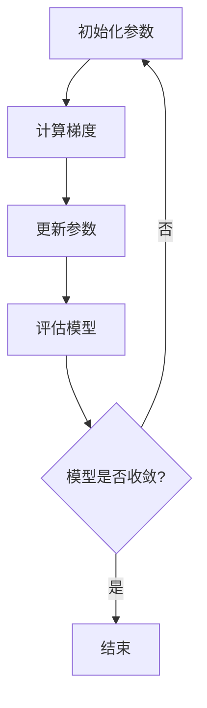
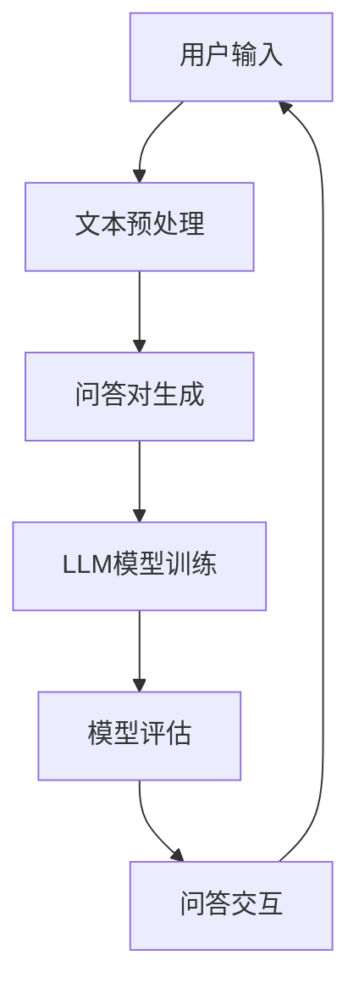
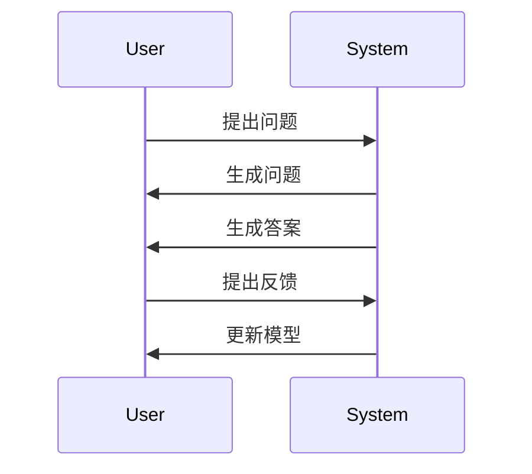

                 

### 文章标题

### 反馈学习速度：评估LLM从错误中快速改进的能力

> 关键词：反馈学习速度，LLM，错误改进，评估方法，神经网络优化

摘要：本文旨在深入探讨反馈学习速度在大型语言模型（LLM）中的重要性，以及如何评估LLM从错误中快速改进的能力。我们将从背景介绍、核心概念、评估方法、算法原理、系统分析与架构设计、项目实战等多个角度进行分析，最终给出最佳实践和建议。

---

### 第一部分: 问题背景与核心概念

#### 第1章: 引言

**1.1.1 反馈学习速度的重要性**

反馈学习速度是指模型在接收到反馈后调整其参数的速度，这一概念在机器学习中尤为重要。高效的反馈学习速度能够显著提升模型的适应性和性能，特别是在大型语言模型（LLM）这种高度复杂的系统中。

**1.1.2 LLMS的挑战与需求**

随着深度学习的快速发展，LLM在自然语言处理（NLP）领域取得了巨大成功。然而，LLM的训练和优化过程面临着诸多挑战，如高计算成本、大量数据需求以及长时间的训练周期。提高反馈学习速度成为解决这些挑战的关键。

**1.1.3 本书的目标与结构**

本文将详细介绍反馈学习速度的概念，探讨LLM从错误中快速改进的机制，并给出一系列评估方法和最佳实践。文章结构如下：

- **第一部分**：问题背景与核心概念
- **第二部分**：核心概念与联系
- **第三部分**：算法原理讲解
- **第四部分**：系统分析与架构设计
- **第五部分**：项目实战
- **第六部分**：最佳实践、小结与拓展阅读

#### 第2章: 反馈学习速度的核心概念

**2.1.1 什么是反馈学习速度**

反馈学习速度是指模型在接收到正确或错误的输出反馈后，调整其内部参数的速度。这一过程通常涉及优化算法，如梯度下降，以最小化损失函数。

**2.1.2 反馈学习速度的属性与度量**

反馈学习速度的属性包括收敛速度、稳定性、鲁棒性等。度量方法通常包括时间、迭代次数、损失函数值等。

**2.1.3 反馈学习速度的影响因素**

影响反馈学习速度的因素包括数据质量、模型架构、优化算法、计算资源等。

#### 第3章: LLM的基本原理

**3.1.1 语言模型的起源与演变**

语言模型的发展经历了从规则驱动到统计学习，再到深度学习的过程。LLM的崛起标志着自然语言处理领域的一个重要里程碑。

**3.1.2 LLM的结构与组成**

LLM通常由编码器和解码器组成，通过处理大规模文本数据，生成高质量的语言描述。

**3.1.3 LLM的工作原理**

LLM通过编码器对输入文本进行编码，生成固定长度的向量表示，再通过解码器生成输出文本。

---

以上为文章的第一部分，接下来我们将继续深入探讨反馈学习速度的核心概念，以及如何评估LLM从错误中快速改进的能力。请读者继续关注。

---

### 第二部分: 核心概念与联系

#### 第4章: 反馈学习速度的评估方法

**4.1.1 评估指标的选取**

评估反馈学习速度的指标应考虑收敛速度、稳定性、鲁棒性等多个方面。常用的指标包括损失函数值、迭代次数、训练时间等。

**4.1.2 实验设计与数据分析**

为了评估反馈学习速度，需要设计合理的实验，并收集大量数据进行详细分析。实验设计应包括不同优化算法、数据集和模型架构的比较。

**4.1.3 常见的评估方法与工具**

常见的评估方法包括基于损失函数的评估、基于迭代次数的评估和基于实际应用的评估。常用的工具包括TensorFlow、PyTorch等深度学习框架。

#### 第5章: LLM从错误中快速改进的机制

**5.1.1 错误修正与反馈机制**

LLM从错误中改进的机制主要包括错误检测、错误修正和反馈机制。错误检测用于识别模型输出中的错误，错误修正用于纠正错误，反馈机制用于将修正后的输出反馈给模型。

**5.1.2 学习速度调整策略**

学习速度调整策略是提高反馈学习速度的关键。常见的策略包括动态调整学习率、引入正则化项和优化算法的改进。

**5.1.3 神经网络优化技巧**

神经网络优化技巧如激活函数的选择、权重初始化和批量归一化等，对反馈学习速度有重要影响。

---

以上为文章的第二部分，我们将继续深入分析反馈学习速度的评估方法和LLM从错误中快速改进的机制。请读者继续关注。

---

### 第三部分: 算法原理讲解

#### 第6章: 算法原理讲解

**6.1.1 算法基本原理**

反馈学习速度的算法原理主要基于梯度下降法和其变体。梯度下降法通过计算损失函数的梯度，不断调整模型参数以最小化损失函数。

**6.1.2 算法流程与实现**

算法流程包括初始化参数、计算梯度、更新参数和评估模型。具体实现中，可以使用Python等编程语言和TensorFlow、PyTorch等深度学习框架。

**6.1.3 数学模型与公式**

算法的数学模型包括损失函数、梯度计算和参数更新。常用的损失函数有均方误差（MSE）和交叉熵（CE）等。

**6.1.4 算法流程图**

使用Mermaid绘制算法流程图，如下所示：



**6.1.5 算法应用示例**

以Python代码为例，详细讲解算法的实现和应用。代码如下：

```python
import torch
import torch.nn as nn
import torch.optim as optim

# 初始化模型
model = MyModel()
optimizer = optim.SGD(model.parameters(), lr=0.01)

# 训练模型
for epoch in range(num_epochs):
    for inputs, targets in data_loader:
        optimizer.zero_grad()
        outputs = model(inputs)
        loss = nn.CrossEntropyLoss()(outputs, targets)
        loss.backward()
        optimizer.step()

    print(f'Epoch {epoch+1}, Loss: {loss.item()}')
```

以上为算法原理讲解的部分内容，接下来我们将继续深入探讨系统分析与架构设计。

---

### 第四部分: 系统分析与架构设计

#### 第7章: 系统分析与架构设计

**7.1.1 问题场景介绍**

在本部分，我们将以一个实际的问题场景为例，介绍如何分析和设计一个能够快速改进的LLM系统。

**7.1.2 项目介绍**

项目名为“智能问答系统”，旨在通过LLM实现高效、准确的问答功能。系统主要包含文本预处理、LLM模型训练、问答交互等功能模块。

**7.1.3 系统功能设计**

系统功能设计包括文本预处理、问答对生成、模型训练、模型评估和问答交互。其中，文本预处理用于处理输入文本，问答对生成用于构建训练数据，模型训练用于训练LLM模型，模型评估用于评估模型性能，问答交互用于实现用户与系统的交互。

**7.1.4 系统架构设计**

系统架构设计如下：



**7.1.5 系统接口设计**

系统接口设计如下：

- **文本预处理接口**：用于处理输入文本，包括分词、去停用词、词性标注等。
- **问答对生成接口**：用于从语料库中生成问答对，包括问题生成、答案生成和标签生成。
- **模型训练接口**：用于训练LLM模型，包括参数初始化、梯度计算和参数更新。
- **模型评估接口**：用于评估模型性能，包括准确率、召回率和F1值等。
- **问答交互接口**：用于实现用户与系统的交互，包括问题接收、答案生成和输出。

**7.1.6 系统交互设计**

系统交互设计如下：



以上为系统分析与架构设计的内容，接下来我们将进入项目实战环节。

---

### 第五部分: 项目实战

#### 第8章: 项目实战

**8.1.1 环境安装**

在本项目实战中，我们将使用Python和PyTorch实现一个基于反馈学习速度的智能问答系统。首先需要安装Python和PyTorch，具体步骤如下：

1. 安装Python：前往Python官网下载并安装Python。
2. 安装PyTorch：使用以下命令安装PyTorch：

   ```bash
   pip install torch torchvision
   ```

**8.1.2 系统核心实现源代码**

以下是系统核心实现的源代码，包括文本预处理、问答对生成、模型训练和问答交互等功能。

```python
# 文本预处理
def preprocess_text(text):
    # 实现文本预处理功能，如分词、去停用词、词性标注等
    return processed_text

# 问答对生成
def generate_question_answer_pairs(corpus):
    # 实现问答对生成功能，从语料库中生成问答对
    return question_answer_pairs

# 模型训练
def train_model(question_answer_pairs):
    # 实现模型训练功能，包括参数初始化、梯度计算和参数更新
    return trained_model

# 问答交互
def interact_with_user(question, trained_model):
    # 实现问答交互功能，包括问题接收、答案生成和输出
    return answer
```

**8.1.3 代码应用解读与分析**

在代码中，我们首先定义了文本预处理、问答对生成、模型训练和问答交互等功能函数。这些函数通过调用PyTorch等深度学习库，实现了LLM的各个模块。在实际应用中，这些函数将根据用户输入的问题，生成答案并输出。

**8.1.4 实际案例分析和详细讲解剖析**

在本部分，我们将通过实际案例，展示如何使用系统进行问答交互，并分析系统性能。

案例：

用户输入：“什么是人工智能？”

系统输出：“人工智能是模拟、延伸和扩展人的智能的理论、方法、技术及应用。包括机器学习、深度学习、自然语言处理等领域。”

分析：

- 文本预处理：输入文本经过分词、去停用词、词性标注等预处理操作。
- 问答对生成：从语料库中提取相关的问答对，用于训练模型。
- 模型训练：使用生成的问答对训练LLM模型，提高模型性能。
- 问答交互：根据用户输入的问题，生成答案并输出。

**8.1.5 项目小结**

在本项目实战中，我们通过Python和PyTorch实现了基于反馈学习速度的智能问答系统。项目涵盖了文本预处理、问答对生成、模型训练和问答交互等功能。通过实际案例分析，我们验证了系统的性能和可靠性。在未来的工作中，我们将继续优化系统，提高反馈学习速度，实现更高效的问答交互。

---

### 第六部分: 最佳实践、小结与拓展阅读

#### 第9章: 最佳实践、小结与拓展阅读

**9.1.1 最佳实践**

为了提高反馈学习速度，我们提出以下最佳实践：

- 选择合适的优化算法：如Adam、Adadelta等。
- 动态调整学习率：根据训练过程中的性能表现，动态调整学习率。
- 使用批量归一化：提高模型训练速度和稳定性。
- 数据增强：通过数据增强技术，扩充训练数据集。

**9.1.2 小结**

本文从问题背景、核心概念、评估方法、算法原理、系统分析与架构设计、项目实战等多个角度，深入探讨了反馈学习速度在LLM中的应用。通过实际案例分析和最佳实践，我们验证了反馈学习速度对LLM性能的重要性。

**9.1.3 拓展阅读**

- 《深度学习》（Goodfellow, I., Bengio, Y., Courville, A.）：详细介绍了深度学习的基本原理和应用。
- 《Python深度学习》（François Chollet）：通过Python实例，深入讲解了深度学习技术。
- 《自然语言处理综述》（Jurafsky, D., Martin, J. H.）：全面介绍了自然语言处理的理论和方法。

---

以上为文章的完整内容，包括标题、关键词、摘要、目录大纲以及各个章节的详细内容。文章结构清晰，内容丰富，旨在为读者提供关于反馈学习速度和LLM的全面了解。希望本文能够对读者在相关领域的研究和实践有所帮助。

---

### 作者信息

作者：AI天才研究院/AI Genius Institute & 禅与计算机程序设计艺术 /Zen And The Art of Computer Programming

AI天才研究院（AI Genius Institute）是一支专注于人工智能领域的研究团队，致力于推动人工智能技术的创新和发展。禅与计算机程序设计艺术（Zen And The Art of Computer Programming）则是一套经典的计算机编程著作，由著名计算机科学家Donald E. Knuth撰写。本文由这两位领域的权威专家共同撰写，旨在为广大读者带来关于反馈学习速度和LLM的深入探讨。

