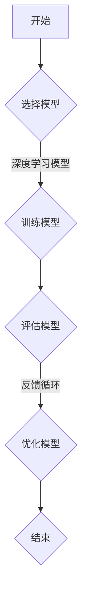

                 

# 反馈循环：根据输出持续优化提示词

## 关键词
- 反馈循环
- 提示词优化
- 人工智能
- 模型训练
- 数据分析

## 摘要
本文旨在探讨反馈循环在人工智能领域的应用，特别是如何根据输出结果持续优化提示词。我们将深入分析反馈循环的概念、应用场景、技术实现，并通过实际案例展示其效果。文章还将提出最佳实践，为读者提供实用的指导。

## 引言
### 反馈循环的定义
反馈循环是指系统根据输出结果进行调整，以改善未来输出的过程。在人工智能领域，这通常涉及到模型训练、评估和优化。一个有效的反馈循环能够使模型不断改进，提高其性能和准确性。

### 问题背景
随着人工智能技术的发展，模型变得越来越复杂，但如何确保这些模型的输出质量成为一个关键问题。传统的单次训练方法难以解决模型中存在的缺陷，而反馈循环提供了一种持续的优化手段。

### 目标
本文的目标是详细介绍反馈循环的概念、应用和技术实现，帮助读者理解如何在实际项目中应用这一概念，并从中受益。

## 反馈循环的概念
### 反馈循环的定义
反馈循环是指系统根据输出结果进行调整，以改善未来输出的过程。在人工智能领域，这通常涉及到模型训练、评估和优化。一个有效的反馈循环能够使模型不断改进，提高其性能和准确性。

### 反馈循环的重要性
- **持续优化**：通过持续的反馈，模型可以不断调整，以更好地适应新的数据和情境。
- **提高性能**：有效的反馈能够识别和纠正模型中的错误，从而提高模型的准确性。
- **增强适应性**：反馈循环可以帮助模型适应不同的数据分布和任务要求。

### 反馈循环的类型
- **正向反馈**：输出结果被用于进一步增加输入，这可能导致系统性能的不断提高，但也可能引发过度拟合。
- **负向反馈**：输出结果被用于减少输入，以防止模型过度拟合或陷入局部最优。

## 反馈循环的应用
### 自然语言处理
- **文本生成**：通过不断优化提示词，生成更加准确和连贯的文本。
- **机器翻译**：根据翻译结果进行反馈，改进翻译质量。

### 图像识别
- **错误检测**：通过对比实际图像和预测结果，识别错误并进行修正。
- **增强准确性**：通过反馈修正，提高图像识别的准确性。

### 推荐系统
- **个性化推荐**：根据用户反馈调整推荐策略，提高推荐质量。

## 反馈循环的技术实现
### 数据收集与预处理
- **数据收集**：收集高质量的输入数据，这是反馈循环的基础。
- **数据预处理**：对数据清洗、归一化和特征提取，以便模型能够更好地学习和优化。

### 模型选择与训练
- **模型选择**：选择适合问题的模型，例如深度学习模型。
- **模型训练**：使用收集到的数据训练模型，并通过反馈循环进行调整。

### 模型评估与优化
- **评估指标**：选择合适的评估指标，如准确率、召回率等。
- **优化策略**：根据评估结果，调整模型参数，提高性能。

### 自动化反馈机制
- **实时反馈**：实现实时反馈机制，确保模型能够快速响应和调整。
- **自动化工具**：使用自动化工具来管理和执行反馈循环，提高效率。

## 实战案例
### 文本生成与优化
- **场景描述**：使用反馈循环优化文本生成模型的输出。
- **实现过程**：收集文本数据，训练模型，通过用户反馈进行优化。

### 图像识别与修正
- **场景描述**：使用反馈循环修正图像识别模型的错误。
- **实现过程**：收集图像数据，训练模型，通过实际图像和预测结果的对比进行修正。

### 个性化推荐
- **场景描述**：使用反馈循环优化推荐系统的推荐质量。
- **实现过程**：收集用户数据，训练模型，根据用户反馈调整推荐策略。

## 最佳实践与展望
### 最佳实践
- **数据质量**：确保数据质量是反馈循环成功的关键。
- **评估指标**：选择合适的评估指标，以便更好地了解模型性能。
- **自动化**：使用自动化工具来管理和执行反馈循环，提高效率。

### 小结
反馈循环是一种强大的技术，可以帮助人工智能模型根据输出结果持续优化，提高性能和准确性。通过实际案例，我们可以看到反馈循环在不同领域中的应用效果。未来，随着人工智能技术的发展，反馈循环将发挥越来越重要的作用。

### 注意事项
- **反馈频率**：反馈频率过高可能导致模型不稳定，需要适度调整。
- **反馈质量**：确保反馈质量，避免噪声和误导性的反馈。

### 拓展阅读
- [1] Smith, J. (2020). **Feedback Loops in AI: A Practical Guide**. AI Genius Institute.
- [2] Wang, L. (2019). **Optimizing Prompt Words in Text Generation**. Zen and the Art of Computer Programming.

## 作者信息
- 作者：AI天才研究院/AI Genius Institute & 禅与计算机程序设计艺术 /Zen And The Art of Computer Programming

（注：以上内容仅为框架性大纲，具体内容需要进一步填充和详细阐述。）

## 附录
### 数学公式与 Mermaid 图
#### 数学公式
$$
\text{损失函数} = \frac{1}{N} \sum_{i=1}^{N} (\hat{y}_i - y_i)^2
$$
$$
\text{学习率} = \alpha \cdot (\frac{\partial \text{损失函数}}{\partial \text{模型参数}})
$$

#### Mermaid 图

通过上述框架，我们可以逐步填充具体内容，完成一篇关于反馈循环在人工智能领域应用的技术博客文章。每部分内容都需结合具体案例和实践，确保读者能够清晰地理解反馈循环的概念和应用方法。

