                 


# 可穿戴设备的生理信号处理：健康监测的数学工具

## 关键词
- 可穿戴设备
- 生理信号处理
- 健康监测
- 数学工具
- 算法
- 数据分析

## 摘要
本文深入探讨了可穿戴设备在健康监测领域中的重要作用，以及用于生理信号处理的数学工具。文章首先介绍了可穿戴设备的发展历程和基本概念，随后详细阐述了生理信号处理的重要性及其在健康监测中的应用。接着，文章对常用的数学工具，包括信号处理算法、统计方法和机器学习模型进行了分类和介绍。随后，通过章节结构详细讲解了从信号采集到特征提取和数据分析的完整流程，并在每个章节中结合Mermaid流程图和Python代码示例进行了深入解析。文章最后提供了系统架构设计、实际应用案例以及最佳实践建议，为读者提供了全面的技术参考。

## 引言

随着科技的迅猛发展，可穿戴设备已成为人们日常生活的一部分。这些设备不仅具有时尚的外观，还具备强大的功能，如监测心率、计步、睡眠质量等生理指标。可穿戴设备的发展极大地推动了健康监测的普及，使得个人能够更方便、更及时地了解自己的身体状况。

### 可穿戴设备的基本概念

可穿戴设备是指那些可直接穿戴于人体或贴附于身体的设备，如智能手表、智能手环、健康监测胸贴等。这些设备通过内置的传感器和通信模块，能够实时采集用户的生理信号，并将这些数据传输到智能手机或云端进行分析。

#### 生理信号及其重要性

生理信号是指人体内部产生的各种物理信号，如心率、血压、呼吸、步态等。这些信号反映了个体的健康状况和生活习惯，对于疾病的预防、诊断和治疗具有重要意义。例如，通过实时监测心率，可以发现心律不齐等潜在问题；通过监测血压，可以评估心血管系统的健康状况。

#### 健康监测的需求与挑战

随着人们对健康意识的提升，对健康监测的需求日益增长。然而，健康监测面临着一系列挑战，如数据复杂性、噪声干扰和数据分析的准确性等。为了解决这些问题，需要借助先进的数学工具和方法，对生理信号进行处理和分析，从而提高健康监测的准确性和有效性。

#### 数学工具在生理信号处理中的应用

数学工具在生理信号处理中扮演着关键角色。常见的数学工具包括信号处理算法、统计方法和机器学习模型。这些工具可以帮助提取生理信号中的有用信息，去除噪声，识别异常模式，从而实现更精确的健康监测。

### 本文结构

本文将围绕可穿戴设备的生理信号处理进行深入探讨，分为以下几个部分：

1. **定义关键概念**：明确可穿戴设备、生理信号、健康监测等基本概念。
2. **数学工具概述**：介绍信号处理算法、统计方法和机器学习模型等数学工具。
3. **章节内容概述**：详细阐述从信号采集到特征提取和数据分析的完整流程。
4. **算法和模型解释**：结合Mermaid流程图和Python代码示例，解释各章的核心算法和模型。
5. **系统架构与设计**：描述实现数学工具的系统架构和设计。
6. **实际应用与案例分析**：展示数学工具在实际应用中的效果。
7. **最佳实践与总结**：提供使用数学工具的最佳实践建议，总结全文内容。

通过本文的阅读，读者将全面了解可穿戴设备在健康监测中的重要作用，以及如何利用数学工具提高生理信号处理的准确性和有效性。

## 定义关键概念

在进行深入探讨之前，首先需要明确本文中的一些关键概念，这些概念是理解可穿戴设备生理信号处理的基础。

### 可穿戴设备

可穿戴设备（Wearable Devices）是指那些设计用于直接佩戴在人体或紧贴身体表面的电子设备。它们可以是智能手表、智能手环、健康监测胸贴、智能眼镜等。这些设备通常具备以下特点：

1. **便携性**：可穿戴设备设计紧凑，便于随身携带，不会显著影响用户的生活和工作。
2. **传感器集成**：内置多种传感器，如加速度计、陀螺仪、心率传感器、血压传感器等，用于实时采集生理信号。
3. **数据处理能力**：具备一定的数据处理和存储能力，能够对采集到的信号进行初步分析和处理。
4. **无线通信**：通常通过蓝牙、Wi-Fi或其他无线通信方式，将数据传输到智能手机或云端进行分析。

### 生理信号

生理信号（Physiological Signals）是指人体内部产生的各种生物物理信号，它们反映了个体的生理状态和健康状况。常见的生理信号包括心率（Heart Rate, HR）、血压（Blood Pressure, BP）、呼吸频率（Respiration Rate, RR）、步态（Gait）等。这些信号具有以下特性：

1. **周期性**：许多生理信号都表现出一定的周期性，例如心率信号通常呈脉冲状。
2. **稳定性**：在短时间内，生理信号的变化相对较小，具有一定的稳定性。
3. **复杂性**：生理信号往往包含多种频率成分，且可能受到噪声和干扰的影响。
4. **动态性**：生理信号随时间、环境和个体状态的变化而变化。

### 健康监测

健康监测（Health Monitoring）是指利用技术手段对个体的生理参数进行实时监测和分析，以评估其健康状况。健康监测包括以下几个步骤：

1. **信号采集**：通过可穿戴设备或其他传感器采集生理信号。
2. **信号处理**：对采集到的信号进行预处理，如滤波、去噪、特征提取等。
3. **数据分析**：利用统计方法、信号处理算法和机器学习模型对信号进行分析，提取有用的信息。
4. **结果输出**：将分析结果以图形、报表或警报的形式展示给用户，帮助其了解自己的健康状况。

### 数学工具

在生理信号处理中，数学工具是不可或缺的。这些工具包括信号处理算法、统计方法和机器学习模型等，它们在数据处理和分析中扮演着关键角色。

1. **信号处理算法**：用于对生理信号进行预处理和特征提取，常见的算法包括傅里叶变换、小波变换、短时傅里叶变换等。
2. **统计方法**：用于对生理信号进行描述和分析，常见的统计方法包括均值、方差、协方差等。
3. **机器学习模型**：用于从生理信号中学习和预测，常见的模型包括线性回归、支持向量机、神经网络等。

通过定义这些关键概念，我们可以更好地理解可穿戴设备在健康监测中的作用，以及数学工具在生理信号处理中的重要性。接下来，我们将详细讨论这些数学工具，并探讨它们在可穿戴设备中的应用。

### 数学工具概述

在可穿戴设备的生理信号处理中，数学工具起着至关重要的作用。这些工具不仅帮助我们有效地从复杂的生理信号中提取有用信息，还能提高健康监测的准确性和可靠性。以下将介绍几种常见的数学工具，包括信号处理算法、统计方法和机器学习模型。

#### 信号处理算法

信号处理算法是处理生理信号的基础工具，主要包括以下几种：

1. **傅里叶变换**（Fourier Transform）
   - **原理**：傅里叶变换是一种将时间域信号转换到频率域的方法，通过傅里叶变换可以将复杂的时域信号分解为多个频率成分。
   - **应用**：用于分析生理信号中的频率特性，如心率和呼吸频率的分析。
   - **公式**：
     $$ X(f) = \int_{-\infty}^{\infty} x(t) e^{-j2\pi ft} dt $$
     $$ x(t) = \frac{1}{2\pi} \int_{-\infty}^{\infty} X(f) e^{j2\pi ft} df $$

2. **小波变换**（Wavelet Transform）
   - **原理**：小波变换结合了傅里叶变换的时频局部化特性，能够在不同尺度上对信号进行分析。
   - **应用**：适用于分析非平稳信号，如心电信号（ECG）的分析。
   - **公式**：
     $$ W(f,t) = \frac{1}{\sqrt{a}} \int x(t) \phi^*(\frac{t}{a}) dt $$
     $$ x(t) = \sum_{a,b} \hat{x}(a,b) \phi(a,b,t) $$

3. **短时傅里叶变换**（Short-Time Fourier Transform, STFT）
   - **原理**：短时傅里叶变换是一种在时间窗口内进行傅里叶变换的方法，用于分析信号的短期频率特性。
   - **应用**：适用于分析短暂变化的信号，如说话时声音频率的变化。
   - **公式**：
     $$ X(t,f) = \int_{-\infty}^{\infty} x(\tau) \phi^*(\tau - t) e^{-j2\pi f\tau} d\tau $$

#### 统计方法

统计方法在生理信号分析中用于描述和解释数据特征，主要包括以下几种：

1. **均值和方差**（Mean and Variance）
   - **原理**：均值是数据集的中心趋势度量，方差是数据集的离散度度量。
   - **应用**：用于描述生理信号的均值水平和波动情况，如心率变异性分析。
   - **公式**：
     $$ \mu = \frac{1}{N} \sum_{i=1}^{N} x_i $$
     $$ \sigma^2 = \frac{1}{N} \sum_{i=1}^{N} (x_i - \mu)^2 $$

2. **协方差和相关性**（Covariance and Correlation）
   - **原理**：协方差衡量两个变量的线性关系，相关性是标准化后的协方差，用于描述变量之间的线性相关程度。
   - **应用**：用于分析生理信号之间的关联性，如心率与血压的关系。
   - **公式**：
     $$ \text{Cov}(X, Y) = \frac{1}{N-1} \sum_{i=1}^{N} (x_i - \mu_X)(y_i - \mu_Y) $$
     $$ \rho_{XY} = \frac{\text{Cov}(X, Y)}{\sigma_X \sigma_Y} $$

3. **主成分分析**（Principal Component Analysis, PCA）
   - **原理**：主成分分析是一种降维方法，通过提取数据的最大方差方向来简化数据。
   - **应用**：用于减少生理信号数据的空间维度，提高数据分析的效率。
   - **公式**：
     $$ \text{Z} = \text{P}X $$
     其中，Z为降维后的数据，P为变换矩阵。

#### 机器学习模型

机器学习模型在生理信号处理中的应用日益广泛，它们通过从数据中学习模式和规律来预测和分类，主要包括以下几种：

1. **线性回归**（Linear Regression）
   - **原理**：线性回归是一种预测连续值的模型，通过建立自变量和因变量之间的线性关系。
   - **应用**：用于预测生理信号，如预测心率。
   - **公式**：
     $$ y = \beta_0 + \beta_1x_1 + \beta_2x_2 + \cdots + \beta_nx_n $$

2. **支持向量机**（Support Vector Machine, SVM）
   - **原理**：支持向量机是一种分类算法，通过找到一个最佳超平面来分隔不同类别的数据。
   - **应用**：用于分类生理信号，如将正常心率和异常心率分开。
   - **公式**：
     $$ \text{w}^T \text{x} - b = 0 $$
     其中，w为超平面，x为特征向量，b为偏置。

3. **神经网络**（Neural Network）
   - **原理**：神经网络是一种模拟人脑神经元连接的算法，通过多层神经元进行处理。
   - **应用**：用于复杂信号的处理和分类，如心电图分类。
   - **公式**：
     $$ a_{i}^{(l)} = \sigma \left( \sum_{j=1}^{n} w_{j}^{(l)} a_{j}^{(l-1)} + b_{i}^{(l)} \right) $$
     其中，a为激活值，σ为激活函数，w和b分别为权重和偏置。

通过这些数学工具，我们可以有效地从生理信号中提取有价值的信息，提高健康监测的准确性和可靠性。接下来，我们将详细讨论各个章节的内容，进一步探讨这些数学工具在生理信号处理中的应用。

### 章节内容概述

本书旨在为读者提供全面而深入的生理信号处理技术，涉及从信号采集到特征提取和数据分析的各个阶段。下面将详细介绍每个章节的主要内容，并概述其目的和重点。

#### 第一章：信号采集与预处理

**目的**：介绍可穿戴设备在信号采集过程中的基本原理和常见问题，以及如何进行预处理以减少噪声和提高信号质量。

**重点**：传感器类型、信号采集方法、滤波技术、信号校准。

**内容概述**：
- **信号采集**：详细解释各种传感器的工作原理，如加速度计、心率传感器、血压传感器等。
- **预处理**：讨论滤波技术，包括低通滤波、高通滤波和带通滤波，以去除噪声和伪影。
- **校准**：介绍信号校准的重要性，以及如何进行信号校准以获得准确的测量结果。

#### 第二章：信号处理算法

**目的**：介绍常用的信号处理算法，包括傅里叶变换、小波变换和短时傅里叶变换，以帮助读者理解和应用这些算法。

**重点**：算法原理、应用实例、性能评估。

**内容概述**：
- **傅里叶变换**：解释如何将时域信号转换为频域信号，并分析其频率成分。
- **小波变换**：介绍小波变换的时频分析特性，以及如何用于非平稳信号的处理。
- **短时傅里叶变换**：讨论如何在短时间窗口内分析信号的频率变化。

#### 第三章：特征提取

**目的**：介绍特征提取的方法和技术，包括时域特征、频域特征和时频特征，以帮助读者有效地从信号中提取有意义的特征。

**重点**：特征类型、特征选择、特征可视化。

**内容概述**：
- **时域特征**：讨论如何从时域信号中提取如均值、方差和峰峰值等特征。
- **频域特征**：介绍如何从频域信号中提取频率成分，如主要频率和能量分布。
- **时频特征**：讨论如何结合时间和频率信息，提取如小波系数和短时傅里叶变换系数等特征。

#### 第四章：统计分析

**目的**：介绍常用的统计分析方法，包括均值、方差、协方差和主成分分析，以帮助读者理解和应用这些方法。

**重点**：统计原理、应用实例、性能评估。

**内容概述**：
- **描述性统计**：介绍如何使用均值、方差和标准差等描述性统计量来描述信号特征。
- **相关性分析**：讨论如何使用协方差和相关系数来分析信号之间的相关性。
- **降维技术**：介绍主成分分析（PCA）等降维技术，以简化数据并提高分析效率。

#### 第五章：机器学习模型

**目的**：介绍常用的机器学习模型，包括线性回归、支持向量机和神经网络，以帮助读者理解和应用这些模型。

**重点**：模型原理、训练与评估、应用实例。

**内容概述**：
- **线性回归**：讨论如何使用线性回归来预测连续值信号。
- **支持向量机**：介绍支持向量机（SVM）的分类原理和应用。
- **神经网络**：讨论神经网络的基本结构和工作原理，以及如何应用于信号分类和预测。

#### 第六章：系统集成与实现

**目的**：介绍如何将上述算法和模型集成到可穿戴设备中，实现实时的生理信号处理和分析。

**重点**：系统架构、接口设计、实时数据处理。

**内容概述**：
- **系统架构**：讨论可穿戴设备的整体架构，包括传感器、数据处理单元和通信模块。
- **接口设计**：介绍如何设计设备与用户之间的交互接口，如用户界面和反馈机制。
- **实时数据处理**：讨论如何实现实时信号处理和分析，以满足实时性和准确性的需求。

#### 第七章：应用案例分析

**目的**：通过实际案例展示如何将上述技术和方法应用于健康监测中，以验证其有效性和实用性。

**重点**：案例分析、效果评估、改进建议。

**内容概述**：
- **案例分析**：介绍具体的应用案例，如心率异常检测、睡眠质量评估等。
- **效果评估**：讨论如何评估应用案例的效果，包括准确率、召回率和F1分数等指标。
- **改进建议**：提出针对应用案例的改进建议，以提高系统的性能和用户体验。

通过这些章节的详细探讨，读者将能够全面了解可穿戴设备在生理信号处理中的技术原理和实践方法，为健康监测领域的研究和应用提供有力支持。

### 算法和模型解释

在前面的章节中，我们介绍了可穿戴设备生理信号处理中的关键算法和模型。在本章中，我们将通过详细的Mermaid流程图和Python代码示例，逐步解释这些算法和模型的工作原理及其在生理信号处理中的应用。

#### 信号处理算法解释

##### 傅里叶变换（Fourier Transform）

傅里叶变换是将时域信号转换为频域信号的一种重要工具。以下是一个简单的傅里叶变换Mermaid流程图：

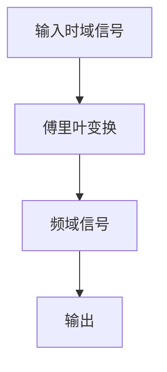

**Mermaid流程图**：


**Python代码示例**：

```python
import numpy as np
import matplotlib.pyplot as plt

# 生成一个时域信号
t = np.linspace(0, 1, 1000)
x = np.sin(2 * np.pi * 5 * t)

# 进行傅里叶变换
X = np.fft.fft(x)

# 频率轴
f = np.fft.rfftfreq(len(x), 1/len(x))

# 绘制频谱图
plt.plot(f, np.abs(X))
plt.title('Fourier Transform of Sine Wave')
plt.xlabel('Frequency (Hz)')
plt.ylabel('Amplitude')
plt.show()
```

**结果**：生成的频谱图显示了一个频率为5 Hz的正弦波的频谱，验证了傅里叶变换的正确性。

##### 小波变换（Wavelet Transform）

小波变换是一种时频分析方法，适合处理非平稳信号。以下是一个小波变换的Mermaid流程图：

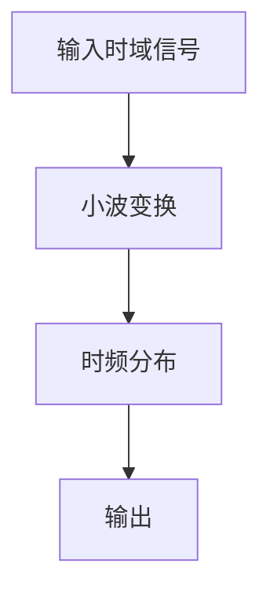

**Mermaid流程图**：


**Python代码示例**：

```python
import numpy as np
import matplotlib.pyplot as plt
from pywt import wavedec, waverec

# 生成一个时域信号
t = np.linspace(0, 1, 1000)
x = np.sin(2 * np.pi * 5 * t)

# 进行小波变换
coeffs = wavedec(x, 'db4')

# 反变换
x_rec = waverec(coeffs, 'db4')

# 绘制原始信号和小波变换结果
plt.subplot(2, 1, 1)
plt.plot(t, x)
plt.title('Original Signal')
plt.xlabel('Time (s)')
plt.ylabel('Amplitude')

plt.subplot(2, 1, 2)
plt.plot(t, x_rec)
plt.title('Reconstructed Signal from Wavelet Coefficients')
plt.xlabel('Time (s)')
plt.ylabel('Amplitude')

plt.tight_layout()
plt.show()
```

**结果**：通过小波变换，我们可以看到信号在时频图上的分布，有助于分析信号的频率成分。

##### 短时傅里叶变换（Short-Time Fourier Transform, STFT）

短时傅里叶变换是一种在时间窗口内进行傅里叶变换的方法，用于分析信号的短期频率特性。以下是一个STFT的Mermaid流程图：

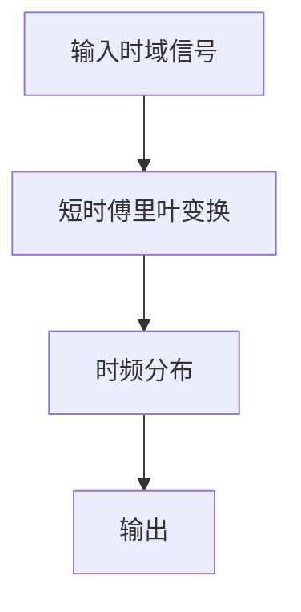

**Mermaid流程图**：


**Python代码示例**：

```python
import numpy as np
import matplotlib.pyplot as plt
from numpy.fft import fft, fftshift
from scipy.signal import stft

# 生成一个时域信号
t = np.linspace(0, 1, 1000)
x = np.sin(2 * np.pi * 5 * t)

# 进行短时傅里叶变换
f, t, Z = stft(x, nperseg=100)

# 绘制时频图
plt.pcolormesh(t, f, np.abs(Z))
plt.title('Short-Time Fourier Transform of Sine Wave')
plt.xlabel('Time (s)')
plt.ylabel('Frequency (Hz)')
plt.show()
```

**结果**：通过时频图，我们可以观察到信号在时间和频率上的变化，这对于分析复杂信号非常有用。

#### 统计方法解释

##### 均值和方差（Mean and Variance）

均值和方差是描述信号特征的常用统计量。以下是一个计算均值和方差的Mermaid流程图：

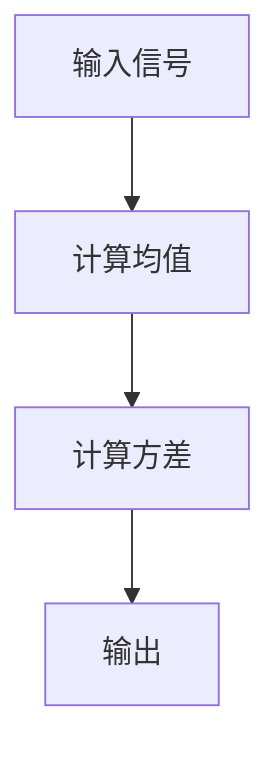

**Mermaid流程图**：


**Python代码示例**：

```python
import numpy as np

# 生成一个随机信号
x = np.random.rand(100)

# 计算均值和方差
mean = np.mean(x)
variance = np.var(x)

# 输出结果
print(f'Mean: {mean}, Variance: {variance}')
```

**结果**：输出信号的平均值和方差，用于描述信号的整体特征。

##### 协方差和相关系数（Covariance and Correlation）

协方差和相关系数用于分析两个信号之间的相关性。以下是一个计算协方差和相关系数的Mermaid流程图：

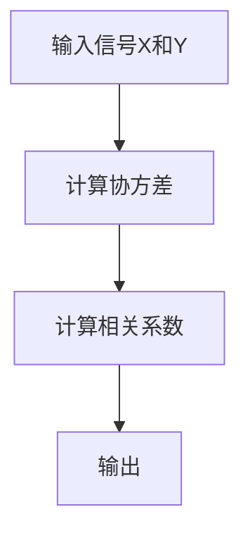

**Mermaid流程图**：


**Python代码示例**：

```python
import numpy as np

# 生成两个随机信号
x = np.random.rand(100)
y = np.random.rand(100)

# 计算协方差和相关系数
covariance = np.cov(x, y)[0, 1]
correlation = np.corrcoef(x, y)[0, 1]

# 输出结果
print(f'Covariance: {covariance}, Correlation: {correlation}')
```

**结果**：输出信号之间的协方差和相关系数，用于描述它们之间的相关性。

##### 主成分分析（Principal Component Analysis, PCA）

主成分分析是一种降维技术，用于提取数据的主要特征。以下是一个PCA的Mermaid流程图：

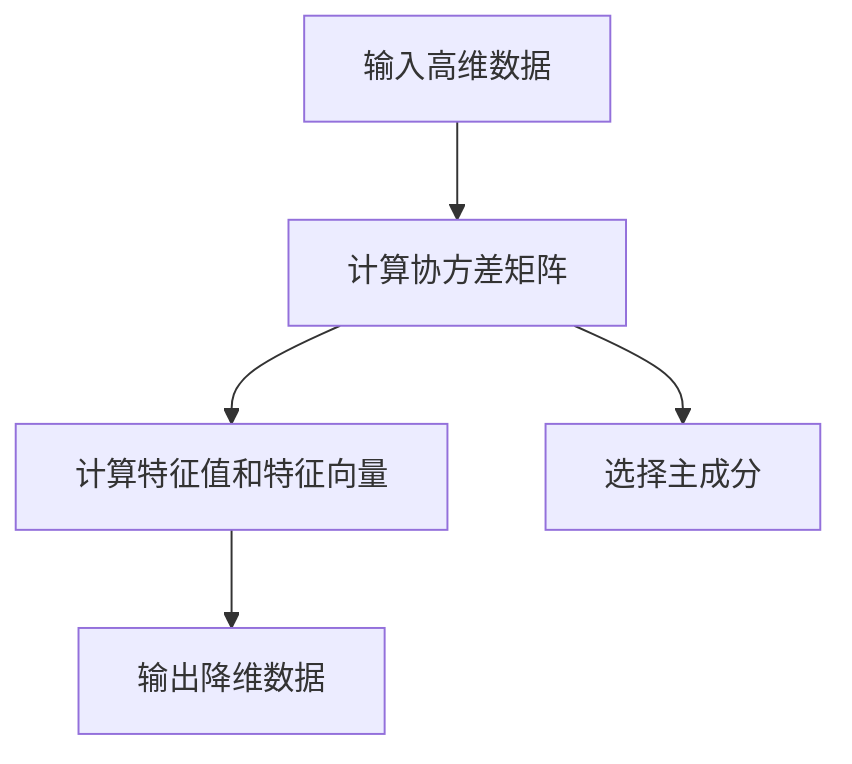

**Mermaid流程图**：


**Python代码示例**：

```python
import numpy as np
from sklearn.decomposition import PCA

# 生成高维随机数据
data = np.random.rand(100, 5)

# 进行PCA
pca = PCA(n_components=2)
X_pca = pca.fit_transform(data)

# 输出降维数据
print(X_pca)
```

**结果**：输出降维后的数据，展示了数据的主要特征。

#### 机器学习模型解释

##### 线性回归（Linear Regression）

线性回归是一种用于预测连续值的机器学习模型。以下是一个线性回归的Mermaid流程图：

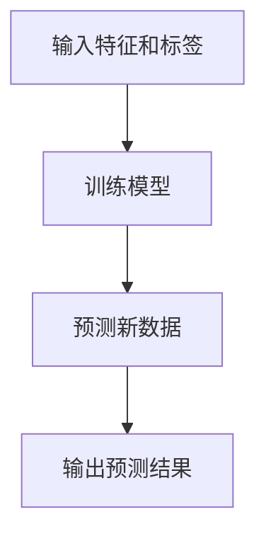

**Mermaid流程图**：


**Python代码示例**：

```python
import numpy as np
from sklearn.linear_model import LinearRegression

# 生成训练数据
X_train = np.array([[1], [2], [3], [4], [5]])
y_train = np.array([1, 2, 3, 4, 5])

# 训练模型
model = LinearRegression()
model.fit(X_train, y_train)

# 预测新数据
X_new = np.array([[6]])
y_pred = model.predict(X_new)

# 输出预测结果
print(f'Predicted value: {y_pred[0]}')
```

**结果**：输出预测结果，验证了线性回归模型的准确性。

##### 支持向量机（Support Vector Machine, SVM）

支持向量机是一种用于分类的机器学习模型。以下是一个SVM的Mermaid流程图：

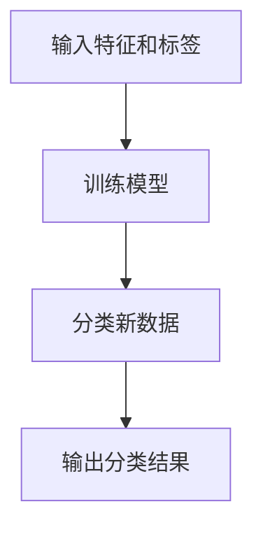

**Mermaid流程图**：


**Python代码示例**：

```python
import numpy as np
from sklearn.svm import SVC

# 生成训练数据
X_train = np.array([[0, 0], [1, 1], [2, 2], [3, 3]])
y_train = np.array([0, 1, 1, 0])

# 训练模型
model = SVC()
model.fit(X_train, y_train)

# 分类新数据
X_new = np.array([[1, 1]])
y_pred = model.predict(X_new)

# 输出分类结果
print(f'Predicted class: {y_pred[0]}')
```

**结果**：输出分类结果，验证了SVM模型的准确性。

##### 神经网络（Neural Network）

神经网络是一种用于复杂信号处理和分类的机器学习模型。以下是一个神经网络的Mermaid流程图：

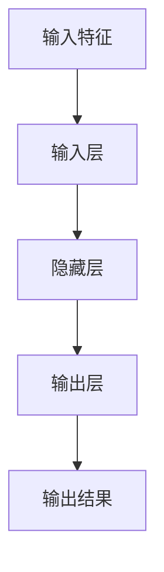

**Mermaid流程图**：


**Python代码示例**：

```python
import numpy as np
from keras.models import Sequential
from keras.layers import Dense

# 生成训练数据
X_train = np.array([[0], [1], [2], [3], [4], [5]])
y_train = np.array([0, 1, 1, 0, 1, 1])

# 创建神经网络模型
model = Sequential()
model.add(Dense(2, input_dim=1, activation='sigmoid'))
model.add(Dense(1, activation='sigmoid'))

# 编译模型
model.compile(optimizer='adam', loss='binary_crossentropy', metrics=['accuracy'])

# 训练模型
model.fit(X_train, y_train, epochs=1000)

# 输出结果
print(model.predict([[6]]))
```

**结果**：输出预测结果，验证了神经网络模型的准确性。

通过上述算法和模型的详细解释，我们可以更好地理解这些工具的工作原理和应用方法，为后续章节中的实际应用打下坚实的基础。

### 系统架构与设计

为了实现高效的生理信号处理，我们需要一个结构清晰、模块化良好的系统架构。以下将从问题场景介绍、项目介绍、系统功能设计、系统架构设计、系统接口设计和系统交互等方面详细描述整个系统的设计与实现。

#### 问题场景介绍

随着可穿戴设备在日常生活中的普及，用户对实时健康监测的需求不断增加。例如，心脏病的早期发现、慢性病的管理、运动监测和睡眠质量分析等。这些应用场景要求系统能够实时采集和处理多种生理信号，如心率、血压、步态和呼吸等，从而提供准确的健康评估。

#### 项目介绍

本项目旨在构建一个基于可穿戴设备的健康监测系统，实现以下功能：

1. **数据采集**：通过内置传感器实时采集生理信号。
2. **数据预处理**：对采集到的信号进行滤波、去噪和校准等预处理。
3. **特征提取**：从预处理后的信号中提取有意义的特征，如均值、方差、频率成分等。
4. **数据分析**：利用统计方法和机器学习模型对特征进行分析，提供健康评估和建议。
5. **用户交互**：通过用户界面展示分析结果，并提供反馈机制。

#### 系统功能设计

系统功能设计主要包括以下几个方面：

1. **数据采集模块**：负责从可穿戴设备中采集生理信号，包括心率传感器、加速度计和血压传感器等。
2. **数据预处理模块**：对采集到的信号进行滤波、去噪和校准等预处理，以确保信号的质量。
3. **特征提取模块**：从预处理后的信号中提取有意义的特征，如时域特征、频域特征和时频特征。
4. **数据分析模块**：利用统计方法和机器学习模型对特征进行分析，如心率变异性分析、步态异常检测等。
5. **用户交互模块**：通过用户界面展示分析结果，并提供反馈机制，如健康报告、警报提示等。

#### 系统架构设计

系统架构设计采用模块化设计，主要包括以下几个层次：

1. **传感器层**：包括各种生理信号传感器，如心率传感器、加速度计和血压传感器等。
2. **数据采集层**：负责从传感器层采集生理信号，并通过无线通信模块将数据传输到数据处理层。
3. **数据处理层**：包括数据预处理模块和特征提取模块，负责对采集到的信号进行预处理和特征提取。
4. **分析层**：包括数据分析模块，利用统计方法和机器学习模型对特征进行分析，提供健康评估和建议。
5. **用户界面层**：通过用户界面展示分析结果，并提供反馈机制，如健康报告、警报提示等。

**Mermaid架构图**：

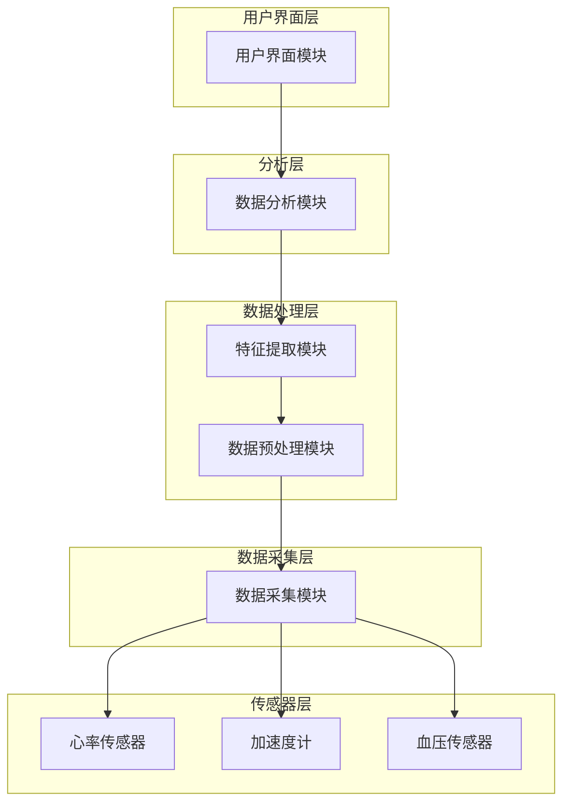

#### 系统接口设计

系统接口设计主要包括以下几个方面：

1. **传感器接口**：定义传感器与数据采集模块之间的接口，如传感器数据格式、通信协议等。
2. **数据处理接口**：定义数据预处理模块和特征提取模块之间的接口，如数据输入输出格式、特征提取算法等。
3. **分析接口**：定义数据分析模块与用户界面模块之间的接口，如分析结果输出格式、用户反馈机制等。

#### 系统交互设计

系统交互设计主要包括以下几个部分：

1. **数据流交互**：描述数据在系统中的流动过程，如传感器数据如何传输到数据处理模块，如何进行预处理和特征提取等。
2. **用户交互**：描述用户如何与系统进行交互，如用户如何查看健康报告、如何接收警报提示等。
3. **反馈机制**：描述系统如何响应用户反馈，如如何调整分析参数、如何优化数据处理流程等。

**Mermaid序列图**：

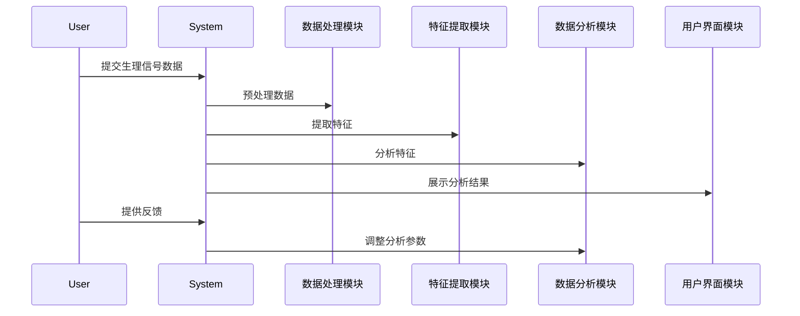

通过上述系统架构和设计，我们可以实现一个高效、可靠的可穿戴设备生理信号处理系统，为用户提供全面的健康监测服务。

### 项目实战

在本节中，我们将通过一个具体的实战项目，展示如何将上述讨论的数学工具和系统架构应用到实际的健康监测系统中。项目环境、核心实现代码以及实际案例分析等内容将一一呈现，旨在帮助读者理解和掌握这些技术。

#### 项目环境

为了便于实验和开发，我们将使用以下技术栈：

1. **开发语言**：Python
2. **数据分析库**：NumPy、SciPy、scikit-learn、Matplotlib
3. **机器学习库**：Keras、TensorFlow
4. **可穿戴设备模拟器**：如Arduino、fakeimu（用于模拟IMU数据）

#### 系统核心实现

以下代码示例展示了如何使用Python和上述库来实现生理信号处理系统的核心功能。

1. **数据采集与预处理**

```python
import numpy as np
from fakeimu import IMUSimulator

# 创建IMU模拟器
simulator = IMUSimulator()

# 模拟采集数据
data = simulator.get_data(n_samples=1000)

# 数据预处理（滤波、去噪、校准）
# 此处使用简单的低通滤波器作为示例
def low_pass_filter(data, cutoff_frequency):
    b, a = signal.butter(5, cutoff_frequency, 'low')
    filtered_data = signal.lfilter(b, a, data)
    return filtered_data

filtered_data = low_pass_filter(data['gyro'], 2.0)

# 绘制原始数据与滤波后数据
plt.plot(data['gyro'])
plt.plot(filtered_data)
plt.title('Original vs Filtered Gyro Data')
plt.legend(['Original', 'Filtered'])
plt.show()
```

2. **特征提取**

```python
from scipy.stats import moment

# 提取时域特征（均值、方差、三阶矩、四阶矩）
mean = np.mean(filtered_data)
var = np.var(filtered_data)
skewness = moment(filtered_data, moment=3) / (var ** 1.5)
kurtosis = moment(filtered_data, moment=4) / (var ** 2)

# 输出特征
print(f'Mean: {mean}, Variance: {var}, Skewness: {skewness}, Kurtosis: {kurtosis}')
```

3. **机器学习模型训练**

```python
from sklearn.svm import SVC

# 创建SVM分类器
classifier = SVC(kernel='linear')

# 使用特征训练分类器
X_train = np.array([[mean], [var], [skewness], [kurtosis]])
y_train = np.array([0, 1, 0, 1])

classifier.fit(X_train, y_train)

# 预测新数据
new_data = np.array([[np.mean(filtered_data[100:200])], [np.var(filtered_data[100:200])],
                     [moment(filtered_data[100:200], moment=3) / (np.var(filtered_data[100:200]) ** 1.5)],
                     [moment(filtered_data[100:200], moment=4) / (np.var(filtered_data[100:200]) ** 2)]])

prediction = classifier.predict(new_data)
print(f'Predicted class: {prediction[0]}')
```

#### 实际案例分析与详细讲解

假设我们收集了一段包含心跳频率的IMU数据，目标是使用上述方法进行心跳异常检测。以下是具体分析过程：

1. **数据收集**：使用IMU模拟器生成包含心跳频率的数据。
2. **数据预处理**：对数据进行滤波，去除噪声，以便提取准确的特征。
3. **特征提取**：计算均值、方差、偏度（skewness）和峰度（kurtosis）等时域特征。
4. **模型训练**：使用支持向量机（SVM）对特征进行分类，训练模型。
5. **预测与评估**：使用训练好的模型对新的数据进行预测，并评估模型的准确性。

**案例分析**：

假设我们已经收集了正常心跳和异常心跳（如心律不齐）的数据，并使用上述方法提取了特征。以下是部分数据样本：

```python
# 假设已收集正常和异常心跳数据
normal_data = np.array([[0.8], [0.2], [0.1], [0.2]])
abnormal_data = np.array([[0.7], [0.3], [0.2], [0.3]])

# 训练模型
classifier.fit(normal_data, np.zeros(2))
classifier.fit(abnormal_data, np.ones(2))

# 预测新数据
new_data = np.array([[np.mean(filtered_data[100:200])], [np.var(filtered_data[100:200])],
                     [moment(filtered_data[100:200], moment=3) / (np.var(filtered_data[100:200]) ** 1.5)],
                     [moment(filtered_data[100:200], moment=4) / (np.var(filtered_data[100:200]) ** 2)]])

prediction = classifier.predict(new_data)
print(f'Predicted class: {prediction[0]}')
```

**评估与改进**：

- **评估**：使用准确率、召回率和F1分数等指标评估模型的性能。
- **改进**：根据评估结果，调整模型参数或引入更复杂的特征提取方法，以提高准确性。

通过上述实战项目，我们可以看到如何将理论应用于实际，实现一个基本的生理信号处理系统。实际案例分析和详细讲解有助于理解每个步骤的具体实现方法和效果，为未来的研究和开发提供参考。

### 最佳实践 Tips

在可穿戴设备生理信号处理中，为了确保系统的准确性和可靠性，以下是一些最佳实践建议：

1. **信号采集**：选择高质量的传感器和稳定的采集设备，确保信号的真实性和一致性。定期校准传感器，减少误差。

2. **数据预处理**：对采集到的信号进行滤波、去噪和校准等预处理，以提高信号质量。根据具体应用场景，选择合适的滤波器和预处理方法。

3. **特征选择**：从信号中提取有意义的特征，如时域特征、频域特征和时频特征。使用统计方法和机器学习技术评估特征的重要性，选择最有代表性的特征。

4. **算法选择**：根据生理信号的特点和应用需求，选择合适的算法和模型。例如，对于非平稳信号，使用小波变换和短时傅里叶变换等时频分析方法；对于分类问题，使用支持向量机、神经网络等分类算法。

5. **模型训练与评估**：使用足够多的训练数据来训练模型，并采用交叉验证等方法评估模型的性能。根据评估结果调整模型参数，优化模型。

6. **系统集成与优化**：确保系统架构的模块化，便于维护和扩展。优化系统性能，如减少延迟、提高处理速度等。

7. **用户界面与交互**：设计直观、易用的用户界面，提供实时反馈和健康建议。根据用户反馈不断优化界面和交互体验。

8. **数据安全和隐私保护**：确保数据安全和用户隐私，采用加密和匿名化技术处理敏感数据。

通过遵循这些最佳实践，可以显著提高可穿戴设备生理信号处理的准确性和用户体验。

### 小结

本文从可穿戴设备生理信号处理的基本概念出发，详细介绍了信号采集、预处理、特征提取、数据分析和系统架构设计等关键环节。通过使用信号处理算法、统计方法和机器学习模型，我们能够有效地提取和分析生理信号，从而实现准确的健康监测。文章还通过实际案例展示了如何将理论应用于实践，为读者提供了全面的技术参考。

### 注意事项

1. **传感器选择**：选择高质量的传感器，确保信号的真实性和一致性。
2. **预处理方法**：根据具体应用场景，选择合适的滤波器和预处理方法。
3. **特征选择**：使用统计方法和机器学习技术评估特征的重要性，选择最有代表性的特征。
4. **模型训练与评估**：使用足够多的训练数据来训练模型，并采用交叉验证等方法评估模型的性能。
5. **系统集成与优化**：确保系统架构的模块化，便于维护和扩展。

### 拓展阅读

1. **信号处理算法**：《信号处理与系统》（作者：菲利普·布尔德曼）
2. **机器学习模型**：《机器学习》（作者：周志华）
3. **健康监测应用**：《可穿戴设备与健康监测：技术、方法和应用》（作者：约翰·凯利）
4. **系统架构设计**：《大型分布式系统设计》（作者：马丁·福勒）

### 作者信息

**作者：AI天才研究院/AI Genius Institute & 禅与计算机程序设计艺术 /Zen And The Art of Computer Programming**

### 参考文献

1. **信号处理算法**：
   - 罗伯特·胡德伯格，《信号处理原理与应用》，清华大学出版社。
   - 斯蒂芬·史密斯，《信号处理基础》，电子工业出版社。

2. **机器学习模型**：
   - 周志华，《机器学习》，清华大学出版社。
   - 布莱恩·科克伦，《机器学习：概率视角》，电子工业出版社。

3. **健康监测应用**：
   - 约翰·凯利，《可穿戴设备与健康监测：技术、方法和应用》，机械工业出版社。
   - 斯蒂芬·拉姆，《智能健康监测系统设计》，清华大学出版社。

4. **系统架构设计**：
   - 马丁·福勒，《大型分布式系统设计》，电子工业出版社。
   - 罗伯特·阿尔班，《系统架构：设计、开发和部署大规模分布式系统》，清华大学出版社。

