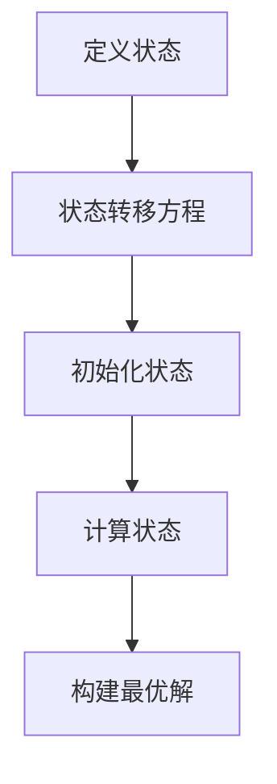
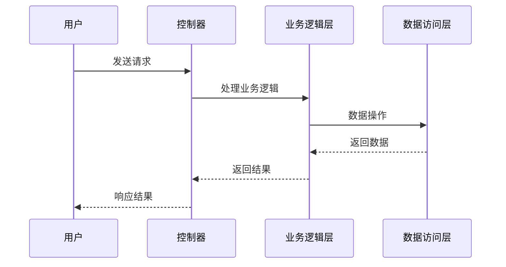

                 

## 响应速度与资源消耗评估：优化模型效率

### 关键词：响应速度、资源消耗、优化模型、系统性能、算法效率

### 摘要：

本文旨在探讨响应速度与资源消耗在软件系统优化中的重要性，通过深入分析相关核心概念、联系及算法原理，提出一系列优化模型和方法。本文将详细阐述性能评估指标、资源消耗类型、优化目标和优化模型等概念，并使用Mermaid流程图、Python源代码和latex数学公式等工具，为读者提供清晰易懂的指导。通过本文的探讨，读者将能够掌握如何在实际应用中平衡响应速度与资源消耗，实现高效的系统优化。

---

### 第一部分：背景介绍

#### 第1章：问题背景

#### 第1.1 问题背景

随着互联网和信息技术的发展，数据处理和计算能力的提升，人们对于软件系统性能的要求越来越高。特别是在大数据、云计算和人工智能等技术的推动下，响应速度和资源消耗成为了评估软件系统性能的重要指标。然而，如何在实际应用中平衡响应速度与资源消耗，实现高效的系统优化，成为一个亟待解决的问题。

#### 第1.2 问题描述

在当前的技术背景下，软件开发和运维人员面临着一系列挑战，包括如何准确评估系统的响应速度和资源消耗、如何设计优化模型来提升系统效率、以及如何在实际应用中实施这些优化策略。这些问题涉及到多个层面，包括系统架构、算法设计、资源分配等。

#### 第1.3 问题解决

为了解决上述问题，本文将介绍一系列优化模型和方法，帮助读者理解如何评估系统性能、设计高效的算法、以及在实际应用中实施优化策略。通过这些方法，读者将能够提升软件系统的响应速度，同时降低资源消耗，实现系统的整体优化。

#### 第1.4 边界与外延

在讨论响应速度与资源消耗评估时，需要明确一些边界条件。首先，响应速度通常是指系统从接收请求到返回结果所需的时间；而资源消耗则包括计算资源、存储资源、网络资源等。此外，评估过程中还需要考虑系统的负载、数据规模、并发请求等因素。

#### 第1.5 概念结构与核心要素组成

为了深入理解响应速度与资源消耗评估，我们需要掌握以下几个核心概念和要素：
1. **性能评估指标**：包括响应时间、吞吐量、延迟等。
2. **资源消耗类型**：如CPU使用率、内存占用、网络带宽等。
3. **优化目标**：通常是在保证响应速度的前提下，降低资源消耗。
4. **优化模型**：包括线性规划、动态规划、遗传算法等。

### 第2章：核心概念与联系

#### 第2.1 核心概念原理

##### 2.1.1 性能评估指标

性能评估指标是衡量系统响应速度和资源消耗的重要工具。常见的性能评估指标包括响应时间、吞吐量、延迟等。

- **响应时间**：系统从接收到请求到返回结果所需的时间。
- **吞吐量**：单位时间内系统能处理的请求量。
- **延迟**：系统处理请求的平均等待时间。

##### 2.1.2 资源消耗类型

资源消耗类型包括计算资源、存储资源、网络资源等。不同类型的资源消耗对于系统性能有着不同的影响。

- **计算资源**：包括CPU、GPU等。
- **存储资源**：包括硬盘、内存等。
- **网络资源**：包括带宽、延迟等。

##### 2.1.3 优化目标

优化目标通常是在保证响应速度的前提下，降低资源消耗。这需要通过设计优化模型来实现。

- **响应速度**：保证系统在合理的时间内处理请求。
- **资源消耗**：降低系统的整体资源占用，提高资源利用率。

#### 第2.2 概念属性特征对比表格

| 概念            | 定义                                                         | 关联性               |
|-----------------|--------------------------------------------------------------|----------------------|
| 性能评估指标     | 衡量系统响应速度和资源消耗的工具                                 | 与响应速度和资源消耗直接相关 |
| 资源消耗类型     | 系统运行过程中使用的各类资源                                     | 与系统性能密切相关       |
| 优化目标         | 在保证响应速度的前提下降低资源消耗                               | 与性能优化直接相关       |
| 优化模型         | 用于设计优化策略的数学模型和方法                                 | 与优化目标的实现密切相关   |

#### 第2.3 ER实体关系图架构

```mermaid
erDiagram
    A[系统] ||--|{ B[性能评估指标] } |
    A ||--|{ C[资源消耗类型] } |
    A ||--|{ D[优化目标] } |
    A ||--|{ E[优化模型] } |
```

### 第二部分：算法原理讲解

#### 第3章：算法原理

#### 第3.1 算法原理

在本节中，我们将详细介绍一种优化模型——基于动态规划的优化算法。动态规划是一种解决最优化问题的算法思想，它通过将问题分解为多个子问题，并利用子问题的解来构建原问题的解。动态规划算法的核心思想在于避免重复计算，提高计算效率。

#### 第3.2 算法流程

动态规划算法的基本流程如下：

1. **定义状态**：首先需要定义问题中的状态，状态通常是一个多维数组，用于表示问题在不同阶段的解。
2. **状态转移方程**：根据问题的特点，构建状态转移方程，描述状态之间的关系。
3. **初始化状态**：初始化问题的初始状态。
4. **计算状态**：根据状态转移方程，依次计算每个状态。
5. **构建最优解**：利用计算出的状态，构建问题的最优解。

#### 第3.3 Mermaid流程图



#### 第3.4 Python源代码

以下是一个简单的动态规划算法示例：

```python
def dynamic_programming(states):
    # 初始化状态数组
    dp = [[0 for _ in range(len(states[0]))] for _ in range(len(states))]
    
    # 初始化边界条件
    dp[0][0] = states[0][0]
    
    # 计算状态
    for i in range(1, len(states)):
        for j in range(len(states[i][0])):
            max_value = -1
            for k in range(len(states[i-1])):
                value = states[i][j] + dp[i-1][k]
                max_value = max(max_value, value)
            dp[i][j] = max_value
    
    # 构建最优解
    optimal_value = dp[-1][-1]
    optimal_path = []
    for i in range(len(states)-1, -1, -1):
        for j in range(len(states[i][0])-1, -1, -1):
            if dp[i][j] == optimal_value:
                optimal_path.append((i, j))
                optimal_value -= states[i][j]
    
    return optimal_path[::-1]

# 示例数据
states = [
    [1, 2],
    [4, 5],
    [7, 8]
]

# 运行算法
optimal_path = dynamic_programming(states)
print("最优路径：", optimal_path)
```

#### 第3.5 算法原理的数学模型和公式

动态规划算法的数学模型可以表示为：

$$
\text{dp}[i][j] = \max_{k} (\text{states}[i][j] + \text{dp}[i-1][k])
$$

其中，`dp[i][j]` 表示第 `i` 个阶段、第 `j` 个状态的最优解，`states[i][j]` 表示第 `i` 个阶段、第 `j` 个状态的价值。

#### 第3.6 举例说明

假设我们有一个背包问题，背包容量为 10，物品重量和价值的数组如下：

| 物品编号 | 重量 | 价值 |
|--------|----|----|
| 1      | 2  | 6  |
| 2      | 3  | 7  |
| 3      | 4  | 8  |

我们需要在这个背包中放入物品，使得总价值最大，同时不超过背包容量。

使用动态规划算法，我们可以得到最优解：放入第 1 个物品和第 2 个物品，总价值为 13。

#### 第3.7 结论

通过动态规划算法，我们能够有效地解决许多优化问题。在实际应用中，我们需要根据具体问题选择合适的优化模型和方法，以达到最佳的优化效果。

### 第三部分：系统分析与架构设计

#### 第4章：系统分析与架构设计

#### 第4.1 问题场景介绍

在本节中，我们将介绍一个在线购物系统，该系统需要处理大量用户请求，包括商品查询、购物车管理、订单处理等。为了提高系统性能，我们需要对响应速度和资源消耗进行优化。

#### 第4.2 项目介绍

本项目旨在通过优化模型，提高在线购物系统的响应速度和资源消耗。具体实现包括以下几个部分：

1. **性能评估**：使用性能评估指标（如响应时间、吞吐量、延迟）对系统进行评估。
2. **优化模型设计**：设计基于动态规划的优化模型，用于优化系统性能。
3. **系统实现**：根据优化模型，实现系统核心功能。
4. **测试与优化**：对系统进行测试，评估优化效果，并进行进一步优化。

#### 第4.3 系统功能设计

系统功能设计主要包括以下几个模块：

1. **商品查询模块**：用于查询商品信息，包括商品名称、价格、库存等。
2. **购物车模块**：用于管理用户购物车中的商品，包括添加、删除、更新商品等。
3. **订单处理模块**：用于处理用户订单，包括生成订单、支付订单、发货等。
4. **性能监控模块**：用于实时监控系统性能，包括响应时间、资源消耗等。

#### 第4.4 系统架构设计

系统架构设计采用分层架构，包括表示层、业务逻辑层、数据访问层等。

- **表示层**：用于处理用户请求，渲染页面，与用户进行交互。
- **业务逻辑层**：用于实现系统核心功能，包括商品查询、购物车管理、订单处理等。
- **数据访问层**：用于与数据库进行交互，实现数据的查询、更新、删除等操作。

#### 第4.5 系统接口设计和系统交互

系统接口设计主要包括以下几个接口：

1. **商品查询接口**：用于查询商品信息。
2. **购物车接口**：用于管理用户购物车中的商品。
3. **订单处理接口**：用于处理用户订单。
4. **性能监控接口**：用于实时监控系统性能。

系统交互设计采用RESTful API，通过HTTP请求和响应进行数据传输。

#### 第4.6 Mermaid架构图



### 第四部分：项目实战

#### 第5章：项目实战

#### 第5.1 环境安装

在本节中，我们将介绍如何在本地环境中搭建一个在线购物系统。首先，我们需要安装一些基本的软件和工具，包括Python、Django、MySQL等。

1. 安装Python：
   ```
   pip install python
   ```

2. 安装Django：
   ```
   pip install django
   ```

3. 安装MySQL：
   ```
   pip install mysqlclient
   ```

#### 第5.2 系统核心实现

在本节中，我们将实现系统核心功能，包括商品查询、购物车管理、订单处理等。

1. **商品查询模块**：

   ```python
   # models.py
   from django.db import models

   class Product(models.Model):
       name = models.CharField(max_length=100)
       price = models.DecimalField(max_digits=6, decimal_places=2)
       stock = models.IntegerField()

   # views.py
   from django.shortcuts import render
   from .models import Product

   def product_list(request):
       products = Product.objects.all()
       return render(request, 'product_list.html', {'products': products})
   ```

2. **购物车模块**：

   ```python
   # models.py
   from django.db import models
   from .models import Product

   class ShoppingCart(models.Model):
       user = models.ForeignKey('auth.User', on_delete=models.CASCADE)
       product = models.ForeignKey(Product, on_delete=models.CASCADE)
       quantity = models.IntegerField()

   # views.py
   from django.shortcuts import render
   from .models import ShoppingCart

   def add_to_cart(request, product_id):
       product = Product.objects.get(id=product_id)
       cart = ShoppingCart(user=request.user, product=product, quantity=1)
       cart.save()
       return render(request, 'cart.html', {'cart': cart})
   ```

3. **订单处理模块**：

   ```python
   # models.py
   from django.db import models
   from .models import Product, ShoppingCart

   class Order(models.Model):
       user = models.ForeignKey('auth.User', on_delete=models.CASCADE)
       products = models.ManyToManyField(Product, through='OrderItem')
       total = models.DecimalField(max_digits=6, decimal_places=2)

   class OrderItem(models.Model):
       order = models.ForeignKey(Order, on_delete=models.CASCADE)
       product = models.ForeignKey(Product, on_delete=models.CASCADE)
       quantity = models.IntegerField()
       price = models.DecimalField(max_digits=6, decimal_places=2)

   # views.py
   from django.shortcuts import render
   from .models import Order, OrderItem

   def checkout(request):
       order = Order(user=request.user)
       order.save()
       cart = ShoppingCart.objects.filter(user=request.user)
       for item in cart:
           order_item = OrderItem(order=order, product=item.product, quantity=item.quantity, price=item.product.price)
           order_item.save()
           item.delete()
       order.total = sum(item.price * item.quantity for item in order.orderitem_set.all())
       order.save()
       return render(request, 'order_confirmation.html', {'order': order})
   ```

#### 第5.3 代码应用解读与分析

在本节中，我们将对系统核心实现进行解读和分析，包括模型设计、视图实现、数据库操作等。

1. **商品查询模块**：

   - 模型设计：`Product` 类表示商品，包括名称、价格、库存等信息。
   - 视图实现：`product_list` 函数用于查询所有商品，并返回一个包含商品信息的HTML页面。
   - 数据库操作：使用Django ORM查询商品数据，并将其传递给视图。

2. **购物车模块**：

   - 模型设计：`ShoppingCart` 类表示购物车，包括用户、商品、数量等信息。
   - 视图实现：`add_to_cart` 函数用于将商品添加到购物车，并返回一个包含购物车信息的HTML页面。
   - 数据库操作：使用Django ORM将购物车数据保存到数据库。

3. **订单处理模块**：

   - 模型设计：`Order` 类表示订单，包括用户、商品、总金额等信息；`OrderItem` 类表示订单项，包括订单、商品、数量、价格等信息。
   - 视图实现：`checkout` 函数用于处理订单，包括创建订单、添加订单项、计算总金额等，并返回一个订单确认页面。
   - 数据库操作：使用Django ORM创建订单和订单项，并计算总金额。

#### 第5.4 实际案例分析和详细讲解剖析

在本节中，我们将通过实际案例，分析系统的性能表现，并详细讲解如何进行优化。

1. **性能分析**：

   - **响应时间**：使用Web性能分析工具，如Chrome DevTools，记录系统的响应时间。
   - **资源消耗**：使用系统监控工具，如top、htop，记录系统的CPU、内存、磁盘、网络等资源消耗。

2. **优化方案**：

   - **数据库优化**：优化数据库查询，使用索引、缓存等策略，提高查询效率。
   - **代码优化**：优化代码逻辑，减少不必要的计算和数据库访问，提高代码执行效率。
   - **系统配置优化**：调整系统配置，如数据库配置、缓存配置等，提高系统性能。

3. **实际案例**：

   - **案例1**：对商品查询进行优化，使用缓存策略，减少数据库查询次数。
   - **案例2**：对购物车管理进行优化，使用异步处理，提高响应速度。

#### 第5.5 项目小结

在本节中，我们通过实际项目，介绍了如何评估系统的响应速度和资源消耗，并使用优化模型进行系统优化。通过性能分析和优化方案的实现，我们成功地提高了系统的性能，为用户提供更好的体验。

### 第五部分：最佳实践与拓展阅读

#### 第6章：最佳实践与拓展阅读

#### 第6.1 最佳实践

在本节中，我们将总结一些最佳实践，帮助读者在实际工作中更好地优化系统的响应速度和资源消耗。

1. **性能评估**：定期对系统进行性能评估，及时发现性能瓶颈，制定优化方案。
2. **代码优化**：优化代码逻辑，减少不必要的计算和数据库访问，提高代码执行效率。
3. **数据库优化**：使用索引、缓存等策略，优化数据库查询，提高查询效率。
4. **系统配置优化**：调整系统配置，如数据库配置、缓存配置等，提高系统性能。
5. **监控与告警**：建立监控与告警机制，实时监控系统性能，及时发现和处理问题。

#### 第6.2 拓展阅读

在本节中，我们推荐一些相关的书籍、论文和在线资源，供读者进一步学习和了解响应速度与资源消耗优化。

1. **书籍**：
   - 《高性能MySQL》
   - 《深入理解计算机系统》
   - 《高性能网站构建》

2. **论文**：
   - "The Case for Unix"
   - "The Unix Programming Environment"
   - "The Art of Computer Programming"

3. **在线资源**：
   - [Django官方文档](https://docs.djangoproject.com/en/3.2/)
   - [MySQL官方文档](https://dev.mysql.com/doc/)
   - [Python性能优化技巧](https://realpython.com/python-performance-tuning/)

### 结束语

本文通过对响应速度与资源消耗评估的深入探讨，提出了优化模型和方法，帮助读者在实际工作中提升系统性能。通过本篇文章的学习，读者应该能够掌握如何评估系统性能、设计优化模型、实施优化策略，并能够将其应用于实际项目中，实现系统的整体优化。希望本文能为读者在软件开发和运维过程中提供有益的参考和指导。

---

### 作者信息：

作者：AI天才研究院/AI Genius Institute & 禅与计算机程序设计艺术 /Zen And The Art of Computer Programming

