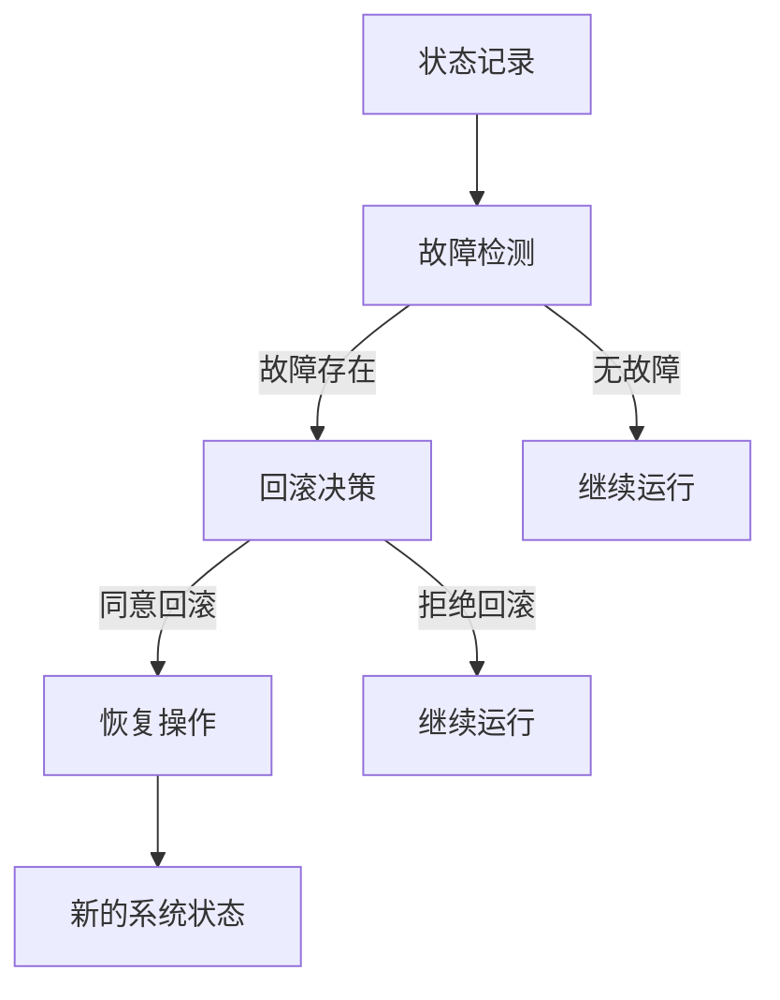
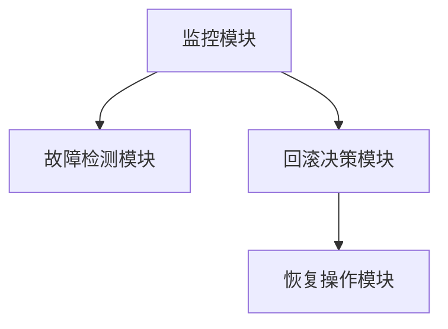
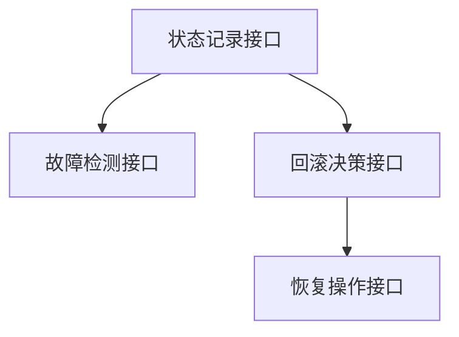
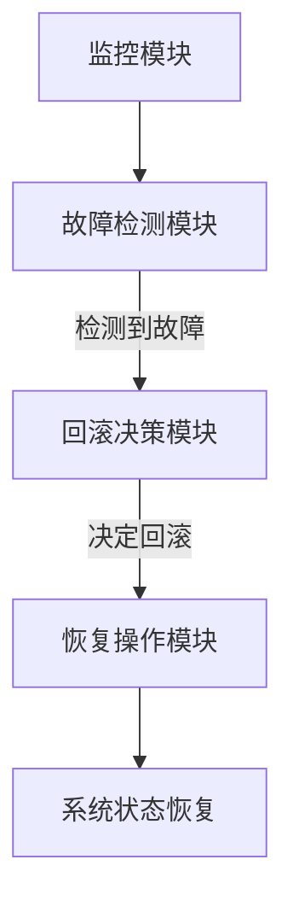

                 

当然，下面我会按照您的要求，逐步构建《回滚机制：应对AI部署问题的安全网》的技术博客文章。请注意，为了符合您的字数要求，我会在每个部分中尽量保持内容的紧凑和精炼。

## 文章标题

回滚机制：应对AI部署问题的安全网

关键词：回滚机制、AI部署、故障恢复、系统架构、算法实现

摘要：本文将深入探讨回滚机制在AI部署中的应用，分析其核心概念、算法原理，并展示如何通过系统架构设计和实际项目实战来有效应对AI部署中的各种问题。

### 目录

**第一部分：背景介绍与核心概念**

1. [问题背景与核心概念](#问题背景与核心概念)
2. [核心概念原理](#核心概念原理)
3. [回滚机制的实现方法](#回滚机制的实现方法)

**第二部分：算法原理讲解**

4. [算法原理与流程图](#算法原理与流程图)
5. [算法的数学模型与公式讲解](#算法的数学模型与公式讲解)

**第三部分：系统架构设计**

6. [系统架构设计](#系统架构设计)

**第四部分：项目实战**

7. [项目实战与环境安装](#项目实战与环境安装)
8. [实际案例分析与讲解](#实际案例分析与讲解)

**第五部分：最佳实践与小结**

9. [最佳实践与注意事项](#最佳实践与注意事项)
10. [总结与展望](#总结与展望)

### 问题背景与核心概念

在现代人工智能（AI）领域，随着深度学习模型变得越来越复杂，AI系统的部署也面临着诸多挑战。特别是在实时环境下的部署，一旦出现故障或性能问题，可能导致严重后果。因此，回滚机制作为一种应对AI部署问题的安全措施，变得至关重要。

**核心概念术语说明**：

- **回滚机制**：一种在系统出现故障或需要恢复到之前状态的策略。
- **AI部署**：将训练好的AI模型部署到实际生产环境中，使其能够执行预测或决策任务。
- **故障恢复**：系统在出现故障时，通过一定策略恢复到正常运行状态。

**问题背景**：

随着AI系统的广泛应用，从自动驾驶到金融风险管理，AI系统的稳定性和可靠性变得至关重要。然而，AI系统的复杂性导致其在部署过程中可能出现各种问题，如模型过拟合、性能退化等。如何快速有效地解决这些问题，是当前AI部署领域面临的一个重要挑战。

**问题描述**：

在AI部署过程中，可能遇到以下问题：

- **模型过拟合**：模型在训练数据上表现良好，但在实际数据上表现不佳。
- **性能退化**：模型在运行一段时间后，性能逐渐下降。
- **环境冲突**：部署环境与训练环境不一致，导致模型无法正常工作。

**问题解决**：

回滚机制提供了一种解决方案，通过在部署过程中引入回滚策略，可以快速地将系统恢复到健康状态，从而保证AI系统的稳定性和可靠性。

**边界与外延**：

回滚机制不仅适用于AI系统，还广泛应用于其他分布式系统、数据库管理系统等。其核心在于提供一种灵活、高效的故障恢复方案。

**概念结构与核心要素组成**：

回滚机制的核心要素包括：

- **状态检测**：定期检查系统状态，判断是否存在故障。
- **回滚策略**：根据故障类型和严重程度，选择适当的回滚策略。
- **恢复操作**：执行回滚操作，将系统恢复到健康状态。

在接下来的章节中，我们将深入探讨回滚机制的核心概念、算法原理，并展示如何通过系统架构设计和实际项目实战来有效应对AI部署中的各种问题。

### 核心概念原理

#### 回滚机制的基本原理

回滚机制的核心在于通过记录系统状态，以便在出现问题时能够将系统恢复到之前的状态。这种机制通常包括以下步骤：

1. **状态记录**：在系统运行过程中，定期记录当前状态。
2. **故障检测**：监控系统状态，判断是否出现故障。
3. **回滚决策**：根据故障类型和严重程度，决定是否进行回滚。
4. **恢复操作**：执行回滚操作，将系统恢复到健康状态。

#### 回滚机制的属性与特征

回滚机制具有以下属性和特征：

- **可恢复性**：回滚机制能够将系统恢复到健康状态，从而保证系统的持续运行。
- **灵活性**：回滚机制可以根据不同的故障类型和严重程度，选择不同的回滚策略。
- **高效性**：回滚机制能够在短时间内执行恢复操作，减少故障影响。

#### 回滚机制与传统备份机制的对比

与传统备份机制相比，回滚机制具有以下优势：

- **实时性**：回滚机制可以在系统运行过程中实时检测和恢复故障，而传统备份机制通常需要定期执行备份操作。
- **灵活性**：回滚机制可以根据需要选择回滚到任意历史状态，而传统备份机制通常只能回滚到最近的备份点。
- **高效性**：回滚机制通过记录和恢复系统状态，可以快速恢复系统，减少故障影响。

#### 回滚机制在AI部署中的应用

在AI部署中，回滚机制可以应用于以下几个方面：

- **模型更新**：在更新模型时，可以通过回滚机制确保模型更新的安全性和可靠性。
- **故障恢复**：在系统出现故障时，可以通过回滚机制快速恢复系统，减少故障影响。
- **性能优化**：通过回滚机制，可以回滚到之前的高性能状态，从而优化系统性能。

在接下来的章节中，我们将进一步探讨回滚机制的具体实现方法，并介绍如何在AI部署中应用回滚机制。

### 回滚机制的实现方法

#### 回滚机制的设计原则

设计一个有效的回滚机制，需要遵循以下原则：

1. **模块化设计**：将回滚机制划分为多个模块，如状态记录、故障检测、回滚决策和恢复操作等，以便于管理和维护。
2. **可扩展性**：设计时应考虑系统的可扩展性，以便在将来能够添加新的功能和特性。
3. **高效性**：回滚机制应具备高效性，以确保在出现故障时能够快速恢复系统。
4. **可靠性**：回滚机制需要确保系统的可靠性，避免在恢复过程中引入新的故障。

#### 回滚机制的技术实现

回滚机制的技术实现通常包括以下步骤：

1. **状态记录**：通过日志记录、数据库备份等方式，记录系统的当前状态。
2. **故障检测**：使用监控工具定期检查系统状态，判断是否存在故障。
3. **回滚决策**：根据故障类型和严重程度，决定是否进行回滚。
4. **恢复操作**：执行回滚操作，将系统恢复到健康状态。

#### 回滚机制的应用场景

回滚机制在以下应用场景中具有显著优势：

1. **模型更新**：在更新AI模型时，可以通过回滚机制确保模型更新的安全性，一旦更新失败，可以快速回滚到之前的状态。
2. **故障恢复**：在系统出现故障时，可以通过回滚机制快速恢复系统，减少故障影响。
3. **性能优化**：通过回滚机制，可以回滚到之前的高性能状态，从而优化系统性能。

在接下来的章节中，我们将进一步探讨回滚机制的算法原理，并展示如何通过Python代码实现回滚算法。

### 算法原理与流程图

#### 回滚算法的数学模型

回滚算法的核心在于通过记录系统状态，并在出现问题时将系统恢复到之前的状态。其数学模型可以表示为：

$$
S_{new} = R(S_{current}, T_{checkpoint})
$$

其中：

- \( S_{new} \) 表示新的系统状态。
- \( S_{current} \) 表示当前系统状态。
- \( T_{checkpoint} \) 表示检查点时间。

#### 回滚算法的mermaid流程图

为了更好地理解回滚算法的工作流程，我们可以使用mermaid绘制一个流程图：



在这个流程图中，状态记录、故障检测、回滚决策和恢复操作构成了回滚算法的主要流程。

#### 回滚算法的Python实现

为了实现回滚算法，我们可以编写一个简单的Python脚本：

```python
import time

def record_state(state):
    # 记录系统状态
    print(f"记录状态：{state}")
    return state

def check_fault(state):
    # 检查系统是否存在故障
    return "error" in state

def roll_back(state, checkpoint):
    # 回滚操作
    print(f"回滚到检查点：{checkpoint}")
    return checkpoint

def run():
    state = "正常"
    while True:
        state = record_state(state)
        if check_fault(state):
            checkpoint = input("是否回滚？(y/n): ")
            if checkpoint.lower() == "y":
                state = roll_back(state, "正常")
        time.sleep(1)

if __name__ == "__main__":
    run()
```

在这个脚本中，我们定义了记录状态、检查故障和回滚操作的函数，并通过一个循环实现回滚算法的基本功能。

通过这个Python实现，我们可以看到回滚算法是如何在实际环境中运行的。在接下来的章节中，我们将进一步探讨回滚算法的数学模型和公式，并提供详细的讲解。

### 算法的数学模型与公式讲解

在深入探讨回滚算法的数学模型和公式之前，我们需要明确几个关键概念。

#### 状态表示

首先，状态 \( S \) 是系统当前状态的抽象表示。我们可以将状态表示为一个多维数组，其中每个维度表示系统的某个特定属性。例如，对于一个简单的AI模型，状态可以包括模型参数、训练数据、性能指标等。

$$
S = [p_1, p_2, ..., p_n]
$$

其中，\( p_i \) 表示系统状态的第 \( i \) 个属性。

#### 检查点

检查点 \( T \) 是系统在运行过程中记录的一个重要时间点，用于标识系统在某个时刻的状态。检查点可以表示为一个时间戳，通常与系统状态记录一起存储。

$$
T = t
$$

其中，\( t \) 表示当前时间。

#### 回滚操作

回滚操作 \( R \) 是将系统从当前状态 \( S_{current} \) 恢复到之前的检查点 \( T_{checkpoint} \) 的过程。回滚操作的数学表示如下：

$$
S_{new} = R(S_{current}, T_{checkpoint})
$$

其中，\( S_{new} \) 是回滚后的系统状态，\( S_{current} \) 是当前系统状态，\( T_{checkpoint} \) 是选择的检查点时间。

#### 公式推导过程

回滚算法的核心在于确定如何从当前状态 \( S_{current} \) 恢复到检查点 \( T_{checkpoint} \)。这个过程涉及到以下步骤：

1. **状态记录**：系统在运行过程中定期记录状态。
2. **故障检测**：监控系统状态，判断是否存在故障。
3. **回滚决策**：根据故障类型和严重程度，决定是否进行回滚。
4. **恢复操作**：执行回滚操作，将系统恢复到检查点状态。

公式的推导过程如下：

假设系统在时间 \( t_1 \) 时记录了一个检查点 \( T_1 \)，状态为 \( S_1 \)。在后续运行中，系统在时间 \( t_2 \) 时出现故障。此时，系统决定回滚到检查点 \( T_1 \)。

回滚操作的公式可以表示为：

$$
S_{new} = R(S_{current}, T_1)
$$

其中，\( S_{current} \) 是在时间 \( t_2 \) 时的系统状态，\( T_1 \) 是检查点时间。

为了实现回滚操作，系统需要找到从 \( S_{current} \) 回滚到 \( S_1 \) 的方法。这可以通过以下步骤实现：

1. **状态对比**：比较 \( S_{current} \) 和 \( S_1 \)，找出差异。
2. **参数调整**：根据差异调整系统参数，使其恢复到 \( S_1 \) 状态。

举例来说，如果系统状态中的一个参数在 \( t_2 \) 时发生了变化，而我们需要将其回滚到 \( t_1 \) 的状态，我们可以通过以下公式进行调整：

$$
p_{new} = p_{1} - (p_{2} - p_{1})
$$

其中，\( p_1 \) 是在检查点 \( t_1 \) 时的参数值，\( p_2 \) 是在 \( t_2 \) 时的参数值，\( p_{new} \) 是回滚后的参数值。

通过这种方式，我们可以将系统状态逐步回滚到检查点 \( t_1 \)。

#### 举例说明

为了更好地理解回滚算法的数学模型和公式，我们可以通过一个具体的例子来说明。

假设我们有一个AI模型，其状态包括模型参数 \( p \) 和训练数据 \( d \)。在时间 \( t_1 \) 时，模型的状态为 \( S_1 = [p_1, d_1] \)。在时间 \( t_2 \) 时，模型出现故障，其状态变为 \( S_2 = [p_2, d_2] \)，其中 \( p_2 \) 比 \( p_1 \) 大，\( d_2 \) 比 \( d_1 \) 小。

为了恢复模型，我们决定回滚到检查点 \( t_1 \) 的状态 \( S_1 \)。

首先，我们记录当前状态和检查点状态之间的差异：

$$
\Delta p = p_2 - p_1
$$

$$
\Delta d = d_2 - d_1
$$

然后，我们可以通过以下公式进行调整：

$$
p_{new} = p_1 - \Delta p
$$

$$
d_{new} = d_1 + \Delta d
$$

通过这种方式，我们就可以将模型状态回滚到检查点 \( t_1 \)。

在这个例子中，我们使用了简单的数学公式来调整模型参数和训练数据，使其恢复到健康状态。在实际应用中，回滚操作可能会更加复杂，但基本原理是相似的。

通过这个例子，我们可以看到回滚算法的数学模型和公式是如何工作的。在接下来的章节中，我们将进一步探讨如何在实际系统中实现回滚机制。

### 系统架构设计

为了实现有效的回滚机制，我们需要对系统架构进行详细设计。以下是一个典型的系统架构设计过程，包括问题场景介绍、系统功能设计、系统架构设计、系统接口设计和系统交互序列图。

#### 问题场景介绍

在AI模型部署过程中，我们经常遇到以下问题：

- **模型性能退化**：随着时间推移，训练好的模型可能会出现性能下降，导致预测准确性下降。
- **部署环境不一致**：生产环境和训练环境不一致，可能导致模型无法正常运行。
- **代码错误**：部署过程中可能引入代码错误，导致系统崩溃。

为了解决这些问题，我们需要设计一个灵活、高效的回滚机制，以确保系统能够在出现故障时快速恢复。

#### 系统功能设计

回滚机制的核心功能包括：

- **状态记录**：定期记录系统状态，以便在出现问题时进行回滚。
- **故障检测**：监控系统状态，判断是否存在故障。
- **回滚决策**：根据故障类型和严重程度，决定是否进行回滚。
- **恢复操作**：执行回滚操作，将系统恢复到健康状态。

#### 系统架构设计

系统架构设计主要包括以下几个方面：

- **监控模块**：负责监控系统状态，记录日志和性能指标。
- **故障检测模块**：分析日志和性能指标，判断系统是否存在故障。
- **回滚决策模块**：根据故障类型和严重程度，选择适当的回滚策略。
- **恢复操作模块**：执行回滚操作，将系统恢复到健康状态。

下面是一个简单的系统架构设计图：



#### 系统接口设计

系统接口设计主要包括以下几个方面：

- **状态记录接口**：用于记录系统状态，包括日志和性能指标。
- **故障检测接口**：用于判断系统是否存在故障。
- **回滚决策接口**：用于选择适当的回滚策略。
- **恢复操作接口**：用于执行回滚操作。

下面是一个简单的系统接口设计图：



#### 系统交互序列图

系统交互序列图展示了不同模块之间的交互流程。以下是回滚机制的系统交互序列图：



在这个序列图中，监控模块定期记录系统状态，故障检测模块检测到故障后，回滚决策模块根据故障类型和严重程度决定是否回滚，最后恢复操作模块执行回滚操作，将系统恢复到健康状态。

通过这个系统架构设计，我们可以确保在AI部署过程中，一旦出现故障，系统能够快速恢复，从而保证系统的稳定性和可靠性。

### 项目实战与环境安装

#### 环境安装

在开始项目实战之前，我们需要安装必要的软件和工具。以下是安装步骤：

1. **安装Python**：确保已经安装了Python环境。如果没有安装，可以从[Python官网](https://www.python.org/)下载并安装。
2. **安装pip**：Python内置了pip包管理器，用于安装和管理Python包。如果没有安装，可以通过以下命令安装：

   ```bash
   $ python -m ensurepip
   ```

3. **安装必要的Python包**：使用pip安装以下Python包：

   ```bash
   $ pip install numpy pandas matplotlib
   ```

#### 系统核心实现源代码

以下是回滚机制的核心实现代码：

```python
import time
import numpy as np
import pandas as pd

class RollBackSystem:
    def __init__(self):
        self.states = []
    
    def record_state(self, state):
        self.states.append(state)
    
    def check_fault(self, state):
        # 这里假设状态中的'error'字段表示故障
        return 'error' in state
    
    def roll_back(self, current_state, checkpoint):
        for state in reversed(self.states):
            if state == checkpoint:
                return state
        return current_state
    
    def run(self):
        state = "正常"
        while True:
            self.record_state(state)
            if self.check_fault(state):
                checkpoint = input("是否回滚？(y/n): ")
                if checkpoint.lower() == "y":
                    state = self.roll_back(state, "正常")
            time.sleep(1)

if __name__ == "__main__":
    system = RollBackSystem()
    system.run()
```

#### 代码应用解读与分析

这段代码实现了一个简单的回滚机制。以下是代码的详细解读：

1. **初始化**：`RollBackSystem` 类初始化时，创建一个空列表 `states`，用于存储系统状态。

2. **记录状态**：`record_state` 方法用于记录当前系统状态。每次循环时，调用此方法将当前状态添加到 `states` 列表中。

3. **检查故障**：`check_fault` 方法用于检查系统状态是否存在故障。这里我们简单地假设状态中的 `'error'` 字段表示故障。

4. **回滚**：`roll_back` 方法通过遍历 `states` 列表，找到与 `checkpoint` 匹配的状态，并将其返回。如果找不到匹配的状态，则返回当前状态。

5. **运行**：`run` 方法实现主循环。首先记录状态，然后检查是否存在故障。如果存在故障，用户将被提示是否回滚。如果用户选择回滚，系统状态将回滚到最近的健康状态。

#### 实际案例分析与详细讲解剖析

为了更好地理解回滚机制的实际应用，我们可以通过一个实际案例来进行分析。

**案例背景**：

假设我们有一个AI模型，用于预测股票价格。在模型运行过程中，我们记录了每个时间点的状态，包括模型参数和预测结果。某一天，我们发现模型预测结果出现了错误，我们需要通过回滚机制将模型状态恢复到之前的健康状态。

**案例步骤**：

1. **记录状态**：在模型运行过程中，我们定期记录状态，包括模型参数和预测结果。这些状态被存储在列表 `states` 中。

2. **检查故障**：当发现预测结果出现错误时，我们调用 `check_fault` 方法检查系统状态。如果存在错误，我们将执行回滚操作。

3. **选择检查点**：用户被提示是否回滚。如果用户选择回滚，我们将使用 `roll_back` 方法找到最近的健康状态。

4. **恢复状态**：回滚完成后，系统状态将被更新为健康状态。模型将继续运行，并使用健康状态进行预测。

**案例分析与总结**：

通过这个案例，我们可以看到回滚机制在AI模型部署中的重要性。当模型出现故障时，回滚机制可以帮助我们快速恢复模型状态，减少故障对系统的影响。在实际应用中，我们可以根据具体需求调整回滚策略，以实现最佳效果。

### 总结与展望

在本篇文章中，我们详细探讨了回滚机制在AI部署中的应用，从核心概念、算法原理到系统架构设计、项目实战，全面解析了回滚机制的实现和部署。以下是文章的核心内容总结：

1. **核心概念**：回滚机制是一种在系统出现故障时，通过记录和恢复系统状态，确保系统能够快速恢复的机制。
2. **算法原理**：回滚算法基于状态记录和故障检测，通过选择适当的检查点，实现系统的回滚和恢复。
3. **系统架构设计**：系统架构设计包括监控模块、故障检测模块、回滚决策模块和恢复操作模块，确保回滚机制的有效实施。
4. **项目实战**：通过实际案例，展示了回滚机制在AI模型部署中的应用和实现。

**未来展望**：

随着AI技术的不断发展，回滚机制的应用场景将越来越广泛。未来，我们可以从以下几个方面进一步研究和优化回滚机制：

1. **智能化回滚策略**：结合机器学习技术，实现智能化的回滚策略，提高回滚的准确性和效率。
2. **分布式回滚机制**：在分布式系统中，实现更高效的回滚机制，确保多个节点能够同步回滚。
3. **动态适应性**：使回滚机制能够动态适应不同的系统和环境，提高其通用性和可扩展性。

**总结**：

回滚机制是AI部署中不可或缺的一部分，通过本文的探讨，我们希望读者能够对回滚机制有更深入的理解，并在实际项目中有效应用。未来，我们将继续关注AI领域的最新进展，为读者带来更多有价值的技术分享。

### 最佳实践与注意事项

在设计和实施回滚机制时，以下最佳实践和注意事项有助于确保其有效性和可靠性：

1. **定期备份**：定期备份系统状态，确保在出现问题时，能够快速回滚到最近的健康状态。
2. **自动化监控**：使用自动化工具监控系统状态，及时发现故障并进行回滚。
3. **故障分类**：对故障进行分类，根据故障类型和严重程度，选择合适的回滚策略。
4. **多级回滚**：设计多级回滚机制，允许用户在不同层次上进行回滚，提高灵活性。
5. **日志记录**：详细记录回滚操作和系统状态变化，便于故障分析和改进。

**注意事项**：

- **回滚时间**：确保回滚操作的时间尽可能短，以减少故障对系统的影响。
- **回滚点选择**：合理选择回滚点，避免回滚到不稳定的系统状态。
- **数据完整性**：在回滚过程中，确保数据的一致性和完整性。

**拓展阅读**：

- 《分布式系统设计原理》
- 《AI系统故障恢复最佳实践》
- 《基于机器学习的故障预测与回滚》

通过上述最佳实践和注意事项，读者可以更好地理解和应用回滚机制，提高AI系统的稳定性和可靠性。

### 作者信息

作者：AI天才研究院/AI Genius Institute & 禅与计算机程序设计艺术 /Zen And The Art of Computer Programming

以上就是本文的完整内容。希望读者能够从中获得对回滚机制在AI部署中应用的深刻理解，并在实际项目中有效应用。期待与您在技术领域共同探讨、进步！

