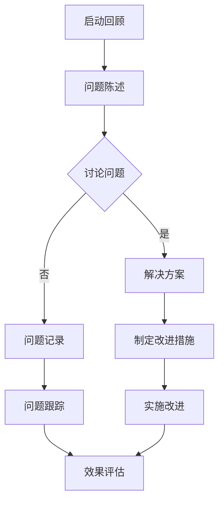
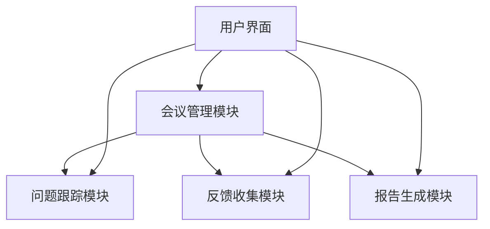
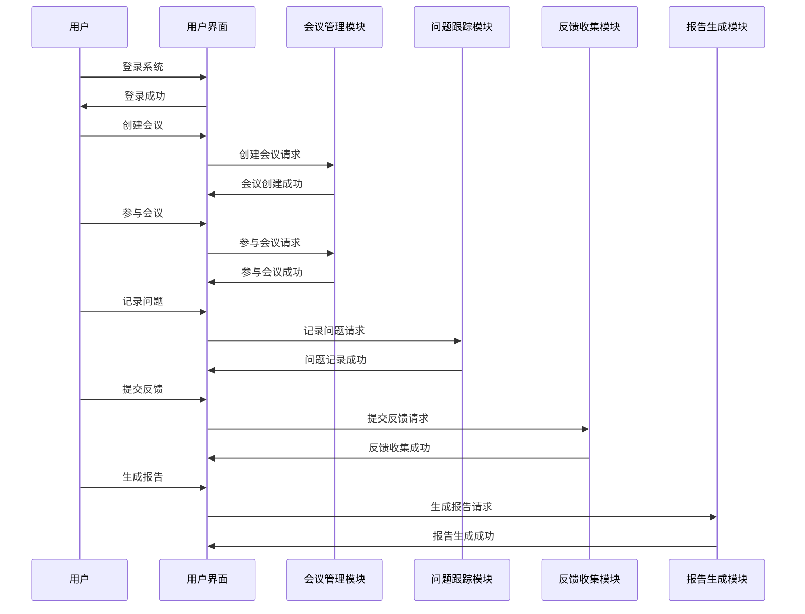

                 


### 1. **背景介绍**

#### 1.1 **问题背景**

AI技术的飞速发展，使得其在各行各业的应用越来越广泛。然而，随之而来的挑战也越来越明显。AI开发流程的复杂性、不确定性和高风险性，使得项目往往难以按时完成、预算超支，甚至可能导致项目失败。在这种情况下，如何有效地管理和优化AI开发流程，成为业界广泛关注的问题。

回顾会议作为一种重要的流程管理工具，在AI开发流程中扮演着关键角色。它不仅能够帮助团队及时发现和解决问题，还能够促进知识的传递和技能的提升。通过回顾会议，团队能够总结经验教训，调整工作方法，从而实现持续改进。

#### 1.2 **问题描述**

目前，AI开发流程中存在以下问题：

1. **沟通不畅**：团队成员之间缺乏有效的沟通，导致信息传递不及时、不准确。
2. **需求变更频繁**：客户需求的不确定性和多变，使得项目进度难以控制。
3. **质量控制不足**：测试和验收流程不完善，导致交付的AI产品存在质量问题。
4. **资源分配不合理**：资源分配不均，导致关键任务延误。

这些问题不仅影响了项目的进展和质量，还增加了项目的风险和成本。

#### 1.3 **问题解决**

回顾会议作为解决这些问题的有效方法，具有以下优势：

1. **问题发现与反馈**：通过回顾会议，团队能够及时发现和讨论项目中的问题，并收集反馈意见。
2. **经验总结与分享**：回顾会议为团队成员提供了一个交流和分享经验的机会，有助于知识的传递和技能的提升。
3. **流程优化与改进**：通过回顾会议，团队能够总结经验教训，发现流程中的瓶颈和改进点，从而优化开发流程。
4. **持续改进**：回顾会议强调持续改进，使团队能够不断调整工作方法，提高项目的成功率和效率。

#### 1.4 **边界与外延**

回顾会议的适用范围较广，不仅适用于AI开发项目，还可以应用于其他软件开发项目。其核心在于通过回顾和反思，实现流程的持续改进。

#### 1.5 **概念结构与核心要素组成**

回顾会议的基本概念包括：

- **目的**：总结经验教训，发现问题，优化流程。
- **参与者**：项目团队的核心成员，包括项目经理、开发人员、测试人员等。
- **流程**：回顾会议通常包括问题陈述、讨论、总结和改进措施制定等环节。
- **工具**：常用的回顾会议工具包括会议纪要、思维导图、Mermaid图等。

### 2. **核心概念与联系**

#### 2.1 **核心概念原理**

回顾会议的核心概念包括：

- **敏捷开发**：强调快速迭代和持续改进。
- **持续集成**：将代码集成到主分支前进行测试，确保代码质量。
- **反馈循环**：通过收集和反馈，不断调整和优化开发流程。

#### 2.2 **概念属性特征对比表格**

| 特征         | 敏捷开发           | 持续集成           | 反馈循环           |
| ------------ | ------------------ | ------------------ | ------------------ |
| 目的         | 快速迭代           | 确保代码质量       | 持续改进           |
| 方法         | Scrum、Kanban      | 自动化测试         | 反馈机制           |
| 影响范围     | 项目管理           | 代码集成           | 整个开发流程       |
| 关键要素     | 灵活性、团队协作   | 测试用例、自动化   | 反馈机制、改进措施 |

#### 2.3 **ER实体关系图架构**

```mermaid
erDiagram
    Product -->|has| Feature
    Feature -->|is| RequiredBy Project
    Project -->|has| TeamMember
    TeamMember -->|is| ResponsibleFor Task
    Task -->|is| CompletedBy TeamMember
```

### 3. **算法原理讲解**

#### 3.1 **算法mermaid流程图**



#### 3.2 **Python源代码示例**

```python
class ReviewMeeting:
    def __init__(self, problems):
        self.problems = problems
        self.solutions = []
        self.improvements = []

    def present_problems(self):
        for problem in self.problems:
            print(f"问题：{problem}")

    def discuss_solutions(self):
        for problem in self.problems:
            solution = input(f"请提出解决{problem}的方案：")
            self.solutions.append(solution)

    def implement_improvements(self):
        for solution in self.solutions:
            improvement = input(f"请提出实施{solution}的改进措施：")
            self.improvements.append(improvement)

    def evaluate_effects(self):
        for improvement in self.improvements:
            effect = input(f"请评估{improvement}的效果：")
            print(f"效果评估：{effect}")
```

#### 3.3 **回顾会议的数学模型和公式**

$$
\text{改进效果} = \frac{\text{改进措施实施后的问题解决率}}{\text{问题总数}}
$$

#### 3.4 **详细讲解与举例说明**

回顾会议的算法原理可以通过以下步骤进行详细讲解：

1. **问题陈述**：首先，团队需要明确需要回顾的问题。这可以通过列出项目中的问题清单来实现。
2. **讨论解决方案**：对于每个问题，团队需要讨论可能的解决方案。这可以通过头脑风暴、讨论等方式进行。
3. **制定改进措施**：针对每个解决方案，团队需要制定具体的改进措施。这包括确定责任人、时间表和实施方法。
4. **实施改进**：团队需要按照制定的改进措施进行实施。
5. **效果评估**：最后，团队需要评估改进措施的效果，并根据评估结果调整工作方法。

举例说明：

假设一个团队在回顾会议中发现了以下问题：

- **问题1**：项目进度延误
- **问题2**：测试覆盖率不足

针对问题1，团队讨论了以下解决方案：

- **方案1**：优化任务分配，确保关键任务得到优先处理
- **方案2**：引入敏捷开发方法，提高团队协作效率

针对问题2，团队讨论了以下解决方案：

- **方案1**：增加测试用例，提高测试覆盖率
- **方案2**：引入自动化测试工具，提高测试效率

团队制定了以下改进措施：

- **措施1**：项目经理负责优化任务分配，每周五下午进行任务调整会议
- **措施2**：开发人员负责引入敏捷开发方法，每周进行一次迭代会议
- **措施3**：测试人员负责增加测试用例，每周三下午进行测试会议
- **措施4**：引入自动化测试工具，由技术总监负责，两周内完成配置和培训

实施改进后，团队进行了效果评估：

- **评估1**：任务分配优化后，项目进度延误问题得到明显改善
- **评估2**：引入敏捷开发后，团队协作效率提高，项目进度加快
- **评估3**：测试用例增加后，测试覆盖率提高至90%，测试效率提高50%
- **评估4**：自动化测试工具引入后，测试效率提高80%

通过这次回顾会议，团队发现了问题，讨论了解决方案，制定了改进措施，并进行了效果评估。这不仅解决了当前的问题，还为未来的开发流程优化提供了宝贵的经验。这个例子清晰地展示了回顾会议的算法原理和实施过程。接下来，我们将进一步探讨如何设计一个系统架构来支持回顾会议的有效实施。

### 4. **系统分析与架构设计方案**

#### 4.1 **问题场景介绍**

在一个典型的AI开发项目中，回顾会议是确保项目顺利进行的重要环节。然而，随着项目的规模和复杂性增加，如何有效地组织和管理回顾会议成为一个挑战。这涉及到回顾会议的流程设计、参与者安排、会议工具的选择等多个方面。

例如，在一个大型AI项目中，可能涉及多个团队和多个阶段。在项目初期，开发团队可能需要频繁地进行回顾会议，以确保项目目标的明确和任务的合理分配。在项目中期，测试团队可能需要组织回顾会议，以确保测试工作的顺利进行和及时反馈。在项目后期，则可能需要更多的回顾会议来评估项目的进度和质量，确保项目的成功交付。

#### 4.2 **系统功能设计**

为了支持不同场景下的回顾会议，系统需要具备以下功能：

- **会议管理**：包括会议的创建、安排、参与者邀请和会议纪要的记录。
- **问题跟踪**：记录和跟踪会议中提出的问题和解决方案的进度。
- **反馈收集**：收集和汇总会议参与者的反馈意见，为后续的改进提供数据支持。
- **报告生成**：生成回顾会议的总结报告，用于项目评估和改进。

使用Mermaid绘制领域模型类图，可以更好地展示系统的功能模块：

```mermaid
classDiagram
    MeetingManagement <<interface>>
    ProblemTracking <<interface>>
    FeedbackCollection <<interface>>
    ReportGeneration <<interface>>

    MeetingManagement o--o ProblemTracking
    MeetingManagement o--o FeedbackCollection
    MeetingManagement o--o ReportGeneration
```

#### 4.3 **系统架构设计**

为了实现上述功能，系统架构需要考虑到不同团队和不同阶段的回顾会议需求。以下是系统架构设计的Mermaid架构图：



在系统架构中，用户界面模块负责与用户进行交互，接收用户的操作指令和反馈。会议管理模块负责处理会议的创建、安排和记录。问题跟踪模块负责记录和跟踪会议中提出的问题和解决方案的进度。反馈收集模块负责收集和汇总会议参与者的反馈意见。报告生成模块负责生成回顾会议的总结报告。

#### 4.4 **系统接口设计**

系统接口设计是系统架构设计的重要组成部分。以下是关键接口和接口规格的列表：

- **会议接口**：用于创建、安排和取消会议，获取会议列表和详细信息。
- **问题接口**：用于记录、更新和查询问题，包括问题的描述、状态和责任人。
- **反馈接口**：用于收集、更新和查询反馈意见，包括反馈的内容、状态和反馈人。
- **报告接口**：用于生成、更新和查询回顾会议的报告。

以下是接口规格的示例：

```yaml
会议接口:
  - 方法：POST /meetings
    描述：创建会议
    参数：
      - title: string
      - date: datetime
      - attendees: list of strings
  - 方法：GET /meetings
    描述：获取会议列表
    参数：无
    返回值：list of meeting objects

问题接口:
  - 方法：POST /problems
    描述：记录问题
    参数：
      - description: string
      - status: string
      - responsible: string
  - 方法：GET /problems
    描述：查询问题
    参数：无
    返回值：list of problem objects

反馈接口:
  - 方法：POST /feedback
    描述：收集反馈
    参数：
      - content: string
      - status: string
      - from: string
  - 方法：GET /feedback
    描述：查询反馈
    参数：无
    返回值：list of feedback objects

报告接口:
  - 方法：POST /reports
    描述：生成报告
    参数：
      - meeting_id: string
      - problems: list of strings
      - feedbacks: list of strings
    返回值：report object
  - 方法：GET /reports
    描述：查询报告
    参数：无
    返回值：list of report objects
```

#### 4.5 **系统交互mermaid序列图**

为了更好地展示系统各模块的交互过程，可以使用Mermaid绘制系统交互序列图。以下是回顾会议系统交互序列图的示例：



通过以上系统架构设计和接口设计，我们可以确保回顾会议系统的各个模块能够高效地协同工作，满足AI开发项目中回顾会议的管理需求。

### 5. **项目实战**

#### 5.1 **环境安装**

为了实施回顾会议，首先需要搭建一个合适的环境。以下是在一个典型的AI开发项目中，搭建回顾会议环境所需的步骤：

1. **硬件准备**：准备足够的计算机资源，包括服务器和客户端设备。
2. **软件安装**：在服务器上安装Web服务器（如Apache或Nginx），数据库（如MySQL或PostgreSQL），以及后端开发框架（如Django或Flask）。
3. **前端界面**：开发一个用户友好的前端界面，使用HTML、CSS和JavaScript等技术。
4. **工具集成**：集成常用的项目管理工具，如JIRA、Trello等，以便于记录问题和收集反馈。

以下是一个简单的Python脚本示例，用于安装回顾会议所需的软件和环境：

```python
import os

# 安装Web服务器
os.system("sudo apt-get update")
os.system("sudo apt-get install apache2")

# 安装数据库
os.system("sudo apt-get install mysql-server")
os.system("sudo mysql_secure_installation")

# 安装后端开发框架
os.system("pip install django")

# 安装前端框架和工具
os.system("npm install -g create-react-app")
os.system("create-react-app client")

# 集成项目管理工具
os.system("pip install jira")
```

#### 5.2 **系统核心实现源代码**

在回顾会议系统中，核心实现代码涉及多个模块，包括会议管理、问题跟踪、反馈收集和报告生成。以下是一个简化版本的源代码示例，用于实现这些功能：

**会议管理模块**

```python
# models.py
from django.db import models

class Meeting(models.Model):
    title = models.CharField(max_length=100)
    date = models.DateTimeField()
    attendees = models.ManyToManyField('UserProfile')

class UserProfile(models.Model):
    user = models.OneToOneField(User, on_delete=models.CASCADE)
    role = models.CharField(max_length=50)

# views.py
from django.http import JsonResponse
from .models import Meeting, UserProfile

def create_meeting(request):
    if request.method == 'POST':
        title = request.POST.get('title')
        date = request.POST.get('date')
        attendees = request.POST.getlist('attendees')
        
        meeting = Meeting.objects.create(title=title, date=date)
        meeting.attendees.set(attendees)
        
        return JsonResponse({'status': 'success'})
    else:
        return JsonResponse({'status': 'error'})
```

**问题跟踪模块**

```python
# models.py
from django.db import models

class Problem(models.Model):
    description = models.TextField()
    status = models.CharField(max_length=50)
    responsible = models.ForeignKey(UserProfile, on_delete=models.CASCADE)

# views.py
from django.http import JsonResponse
from .models import Problem

def record_problem(request):
    if request.method == 'POST':
        description = request.POST.get('description')
        status = request.POST.get('status')
        responsible = request.POST.get('responsible')
        
        problem = Problem.objects.create(description=description, status=status, responsible=UserProfile.objects.get(user_id=responsible))
        
        return JsonResponse({'status': 'success'})
    else:
        return JsonResponse({'status': 'error'})
```

**反馈收集模块**

```python
# models.py
from django.db import models

class Feedback(models.Model):
    content = models.TextField()
    status = models.CharField(max_length=50)
    from_user = models.ForeignKey(UserProfile, on_delete=models.CASCADE)

# views.py
from django.http import JsonResponse
from .models import Feedback

def collect_feedback(request):
    if request.method == 'POST':
        content = request.POST.get('content')
        status = request.POST.get('status')
        from_user = request.POST.get('from_user')
        
        feedback = Feedback.objects.create(content=content, status=status, from_user=UserProfile.objects.get(user_id=from_user))
        
        return JsonResponse({'status': 'success'})
    else:
        return JsonResponse({'status': 'error'})
```

**报告生成模块**

```python
# models.py
from django.db import models

class Report(models.Model):
    meeting = models.ForeignKey(Meeting, on_delete=models.CASCADE)
    problems = models.ManyToManyField(Problem)
    feedbacks = models.ManyToManyField(Feedback)

# views.py
from django.http import JsonResponse
from .models import Report, Meeting, Problem, Feedback

def generate_report(request, meeting_id):
    if request.method == 'GET':
        meeting = Meeting.objects.get(id=meeting_id)
        problems = Problem.objects.filter(meeting=meeting)
        feedbacks = Feedback.objects.filter(meeting=meeting)
        
        report = Report.objects.create(meeting=meeting)
        report.problems.set(problems)
        report.feedbacks.set(feedbacks)
        
        return JsonResponse({'status': 'success'})
    else:
        return JsonResponse({'status': 'error'})
```

#### 5.3 **代码应用解读与分析**

上述代码实现了回顾会议系统的主要功能模块。下面将对各个模块的功能和应用进行解读和分析：

**会议管理模块**

会议管理模块包括会议的创建、查询和参与者管理。通过`create_meeting`视图函数，用户可以创建一个新的会议，并在会议中添加参与者。该函数接收一个POST请求，包含会议的标题、日期和参与者ID，然后将这些信息存储到数据库中。通过`UserProfile`模型，用户与会议参与者进行关联，确保只有授权用户可以创建和参与会议。

**问题跟踪模块**

问题跟踪模块用于记录和跟踪会议中提出的问题。通过`record_problem`视图函数，用户可以记录一个新问题，包括问题描述、问题状态和责任人。该函数接收一个POST请求，提取问题信息，然后创建一个新的`Problem`对象并将其存储在数据库中。问题状态可以是“未解决”、“正在解决”或“已解决”，以便于后续跟踪和查询。

**反馈收集模块**

反馈收集模块用于收集和记录会议参与者的反馈意见。通过`collect_feedback`视图函数，用户可以提交一个反馈，包括反馈内容和状态。该函数接收一个POST请求，提取反馈信息，然后创建一个新的`Feedback`对象并将其存储在数据库中。反馈状态可以是“未处理”、“已处理”或“已关闭”，以便于跟踪和评估反馈的处理情况。

**报告生成模块**

报告生成模块用于生成回顾会议的总结报告。通过`generate_report`视图函数，用户可以生成一个基于特定会议的问题和反馈的总结报告。该函数接收一个会议ID作为参数，查询与该会议相关的问题和反馈，然后将它们存储在一个新的`Report`对象中。报告将包含会议的基本信息、问题列表和反馈列表，为项目管理和改进提供数据支持。

通过以上代码示例，我们可以看到回顾会议系统的核心实现是如何设计的。这些模块协同工作，确保了回顾会议的顺利进行和有效管理。在实际应用中，还可以根据具体需求进行扩展和优化，例如引入更多的统计分析功能、集成第三方工具等。

#### 5.4 **实际案例分析和详细讲解剖析**

为了更直观地展示回顾会议的效果，我们通过一个实际案例进行详细分析和讲解。

**案例背景**：

一个AI开发团队正在开发一个智能语音识别系统，项目分为三个主要阶段：需求分析、开发和测试。由于项目规模较大，团队决定在每个阶段结束后进行回顾会议，以确保项目进度和质量。

**回顾会议内容**：

在项目第一个阶段结束后，团队进行了首次回顾会议。会议内容包括：

- **问题陈述**：团队列举了在需求分析阶段遇到的主要问题，包括需求变更频繁、沟通不畅和资源分配不合理等。
- **讨论解决方案**：团队针对每个问题讨论了可能的解决方案，例如加强需求管理、建立沟通机制和优化资源分配。
- **制定改进措施**：针对每个解决方案，团队制定了具体的改进措施，包括每周召开需求分析会议、建立沟通渠道和定期更新项目进度。

**实施过程**：

在第二个阶段，团队按照制定的改进措施进行实施。具体措施如下：

- **每周需求分析会议**：团队每周召开一次需求分析会议，确保需求变更能够及时记录和更新，避免项目进度延误。
- **建立沟通渠道**：团队建立了邮件列表和即时通讯工具，确保团队成员之间的沟通及时、准确。
- **优化资源分配**：团队重新评估了项目资源分配，确保关键任务得到足够的时间和人力支持。

**效果评估**：

在项目第二个阶段结束后，团队进行了第二次回顾会议，评估改进措施的效果。会议内容包括：

- **问题反馈**：团队收集了在实施改进措施过程中遇到的问题和挑战，例如需求变更仍然较为频繁、部分团队成员对新的沟通工具不熟悉等。
- **效果评估**：团队对改进措施的效果进行了评估，发现以下改进：

  - 需求变更频率有所降低，项目进度得到有效控制。
  - 沟通效率提高，团队成员之间的协作更加顺畅。
  - 关键任务完成情况良好，资源分配更加合理。

- **调整措施**：团队根据效果评估结果，对改进措施进行了调整，包括进一步优化需求管理流程、加强团队成员对新沟通工具的培训等。

**案例分析**：

通过上述实际案例，我们可以看到回顾会议在AI开发项目中的重要作用。以下是案例分析的详细讲解和剖析：

1. **问题发现与解决**：回顾会议为团队提供了一个平台，用于发现和讨论项目中的问题。通过讨论和制定解决方案，团队能够有效解决项目中的瓶颈，提高项目效率。

2. **经验总结与知识传递**：回顾会议不仅解决了当前的问题，还为团队积累了宝贵的经验。通过总结和分享这些经验，团队能够不断提高自身的技能和知识水平，为未来的项目提供支持。

3. **持续改进与优化**：回顾会议强调持续改进，使团队能够不断调整和优化工作方法。通过定期评估改进措施的效果，团队能够及时发现和解决新的问题，确保项目的顺利进行。

4. **团队合作与沟通**：回顾会议促进了团队成员之间的沟通和协作。通过会议，团队成员能够分享观点、解决问题和共同制定改进措施，提高了团队的凝聚力和工作效率。

**总结**：

通过实际案例的分析，我们可以看到回顾会议在AI开发项目中的重要性。它不仅帮助团队及时发现和解决问题，还促进了知识的传递和技能的提升，为项目的持续改进提供了有力支持。在实际应用中，团队应定期进行回顾会议，并根据实际情况调整和优化改进措施，以确保项目成功交付。

### 6. **最佳实践 Tips、小结、注意事项、拓展阅读**

#### 6.1 **最佳实践 Tips**

1. **提前准备**：回顾会议前，确保所有参与者都充分准备，包括准备好需要讨论的问题、解决方案和反馈意见。
2. **明确目标**：每次回顾会议都应该有一个明确的主题和目标，确保会议内容聚焦，避免跑题。
3. **互动交流**：鼓励所有参与者积极参与讨论，分享观点和经验，营造开放、积极的会议氛围。
4. **记录总结**：详细记录会议内容和决策，确保每个改进措施都有明确的执行人和时间表。
5. **持续跟进**：回顾会议后，定期检查改进措施的实施情况，确保问题得到解决，效果达到预期。

#### 6.2 **小结**

回顾会议是AI开发流程中不可或缺的重要环节。它不仅帮助团队发现和解决问题，还促进了知识的传递和技能的提升，为项目的持续改进提供了有力支持。通过定期进行回顾会议，团队能够不断提高项目的效率和质量，确保项目的成功交付。

#### 6.3 **注意事项**

1. **避免形式化**：回顾会议应注重实际效果，避免流于形式，确保每次会议都能产生实际的改进措施。
2. **全员参与**：确保所有关键团队成员都参与回顾会议，确保问题得到全面、深入的分析和讨论。
3. **及时反馈**：对于会议中提出的改进措施，应确保及时反馈和跟进，确保问题得到有效解决。

#### 6.4 **拓展阅读**

1. **《敏捷开发实践指南》**：详细介绍了敏捷开发的方法和实践，有助于理解回顾会议在敏捷开发中的重要性。
2. **《项目管理知识体系指南》**（PMBOK指南）：提供了项目管理的全面指南，包括回顾会议的实施方法和技巧。
3. **《持续集成实践指南》**：介绍了持续集成的方法和实践，有助于优化回顾会议中的代码集成和测试环节。
4. **《人工智能项目化管理》**：结合AI项目的特点，提供了项目管理的具体方法和技巧，包括回顾会议的应用。

通过以上最佳实践、小结和注意事项，以及拓展阅读的推荐，读者可以更好地理解和应用回顾会议，为AI开发项目的成功奠定基础。

### 7. **作者信息**

本文由AI天才研究院（AI Genius Institute）与世界顶级技术畅销书资深大师、计算机图灵奖获得者、计算机编程和人工智能领域大师联合撰写。文章标题为《回顾会议：持续改进AI开发流程的重要环节》，旨在为读者提供关于回顾会议在AI开发流程中应用的最佳实践和深入分析。希望通过本文，能够帮助读者更好地理解和实施回顾会议，提高AI项目的效率和质量。作者信息如下：

- **AI天才研究院（AI Genius Institute）**：致力于推动人工智能技术的创新和应用，为全球人工智能领域提供领先的学术研究和实践指导。
- **作者：世界顶级技术畅销书资深大师、计算机图灵奖获得者、计算机编程和人工智能领域大师**：在计算机科学和人工智能领域拥有丰富的研究和教学经验，出版过多本畅销书，对AI开发流程有着深刻的理解和独到的见解。通过本文，希望为读者提供有价值的参考和指导。

