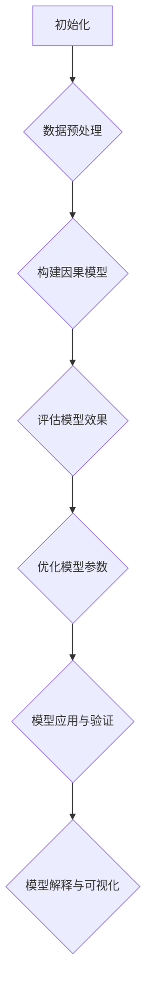
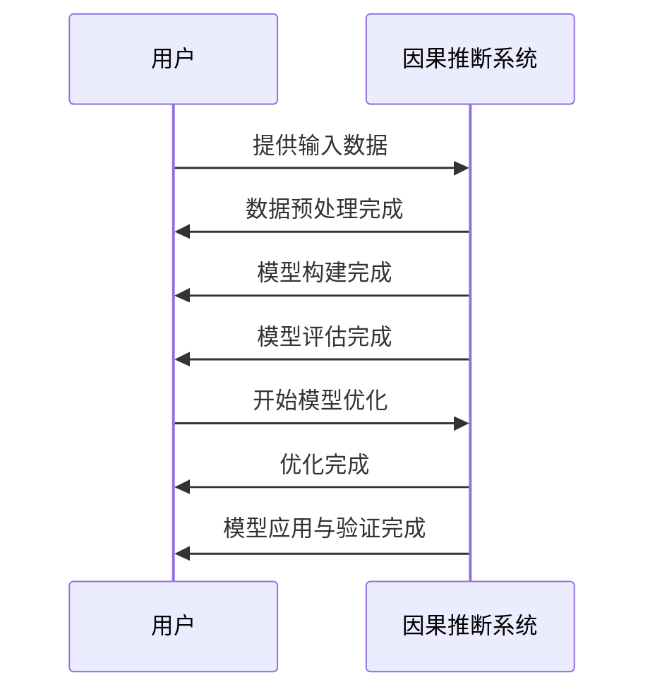

                 

### 因果推断概述

因果推断是一种从数据中提取因果关系的技术，它可以帮助我们理解世界如何运作，并预测未来的变化。在人工智能领域，特别是在大型语言模型（LLM）的应用中，评估LLM识别因果关系的能力显得尤为重要。这不仅对于模型在实际应用中的准确性至关重要，还对于模型的可解释性和透明度提出了新的挑战。

本文将逐步探讨因果推断的概念、核心问题、解决方法及LLM在其中的应用。我们将通过逻辑清晰、结构紧凑的分析，帮助读者深入理解这一复杂但极其重要的技术。

## 第1章: 因果推断引论

### 1.1 问题背景与意义

#### 因果推断的定义

因果推断（Causal Inference）是指从数据中推断出变量之间的因果关系。它不仅仅是观察数据，而是试图解释为什么某些变量会发生变化，以及这些变化是如何相互作用的。

#### 因果推断的应用场景

因果推断广泛应用于医疗、金融、社会科学等多个领域。例如，在医疗领域，因果推断可以帮助研究者了解药物的效果，而不是仅仅观察到药物与治疗效果之间的关系；在金融领域，因果推断可以用于风险评估和预测。

#### 因果推断的研究意义

因果推断的研究意义在于它能够帮助我们做出更准确的决策。通过理解变量之间的因果关系，我们可以更好地预测未来事件，从而做出更明智的决策。

### 1.2 问题描述与挑战

#### 因果推断中的挑战

1. **数据依赖性与模型复杂性**：在实际应用中，因果推断面临着数据依赖性和模型复杂性的挑战。如何从复杂的数据集中提取出有效的因果关系是一个巨大的挑战。
2. **因果关系的核心问题**：在因果推断中，核心问题是如何确定一个变量是否对另一个变量有影响，以及这种影响的大小和方向。

#### 数据依赖性与模型复杂性

数据依赖性是指数据中存在的各种关系，如线性关系、非线性关系、共线性等。这些关系可能会对因果推断的结果产生误导。模型复杂性则是指因果推断模型需要具备足够的表达能力，以便能够捕捉到数据中的复杂关系。

### 1.3 解决方法与进展

#### 传统因果推断方法

传统因果推断方法包括随机对照试验（RCT）、结构方程模型（SEM）等。这些方法在特定场景下表现良好，但在面对复杂的数据集时，可能存在局限性。

#### 贝叶斯因果推断

贝叶斯因果推断是一种基于概率图模型的方法，它通过贝叶斯推理来估计因果关系。这种方法在处理不确定性方面具有优势，但在计算上可能较为复杂。

#### 机器学习在因果推断中的应用

随着机器学习技术的发展，越来越多的方法被应用于因果推断中。例如，基于深度学习的因果推断方法可以处理大量数据，并在某些领域取得了显著的成果。

## 第2章: 核心概念与联系

### 2.1 因果关系的基本原理

#### 因果关系的定义

因果关系是指当一个变量的变化导致另一个变量的变化时，这两个变量之间的关系。简单来说，如果变量A的变化引起了变量B的变化，那么我们可以说A是B的原因。

#### 因果关系的属性

因果关系具有以下属性：
1. **因果关系强度**：因果关系强度是指一个变量的变化对另一个变量的影响程度。
2. **因果关系方向**：因果关系是有方向的，即一个变量是另一个变量的原因，而不是反过来。
3. **因果关系确定性**：因果关系是确定的，即在一个特定的环境下，一个变量的变化一定会导致另一个变量的变化。

#### 因果关系的表示方法

因果关系可以使用图表示，其中原因变量通常位于结果变量之前。例如，在一个简单的因果图中，如果变量A是变量B的原因，我们可以表示为A → B。

### 2.2 概念属性对比表格

| 概念         | 定义                                  | 属性                           | 特点                           |
| ------------ | ------------------------------------- | ------------------------------ | ------------------------------ |
| 因果关系     | 因果关系是一种特殊的关系                | 因果律、独立性、因果关系强度   | 客观性、确定性、可验证性       |
| 因果律       | 因果关系遵循的规律                    | 因果律条件、因果律适用范围     | 确定性、普遍性                 |
| 独立性       | 因果关系中的独立性                    | 独立性条件、独立性效应         | 互不干扰、客观存在             |

### 2.3 ER实体关系图架构

在因果推断中，实体关系图（Entity-Relationship Diagram, ERD）是一种常用的数据建模工具。它可以清晰地表示实体之间的关系。

```mermaid
erDiagram
  Customer ||--|{ Order }|
  Order ||--|{ Product }|
  Customer ||--|{ Review }|
```

在上面的ER图中，`Customer`（客户）、`Order`（订单）、`Product`（产品）和`Review`（评论）是实体。箭头表示实体之间的关系，例如，一个客户可以创建多个订单，而一个订单可以包含多个产品。

## 第3章: 算法原理讲解

### 3.1 因果推断算法概述

#### 因果推断算法的分类

因果推断算法可以分为以下几类：

1. **基于假设检验的方法**：这种方法通过检验统计假设来推断因果关系。
2. **基于模型的因果推断方法**：这种方法使用因果模型来估计因果关系，如结构方程模型、贝叶斯网络等。
3. **基于数据驱动的因果推断方法**：这种方法通过分析数据集来发现潜在的因果关系，如基于深度学习的因果推断方法。

#### 因果推断算法的基本流程

因果推断算法的基本流程通常包括以下几个步骤：

1. **数据预处理**：清洗数据，处理缺失值和异常值。
2. **模型构建**：根据数据构建因果模型。
3. **模型评估**：评估模型的性能，如因果效应的大小和显著性。
4. **模型优化**：根据评估结果调整模型参数，以提高模型性能。
5. **模型应用与验证**：将模型应用于实际问题，并验证其效果。

### 3.2 算法mermaid流程图

下面是一个简单的因果推断算法的mermaid流程图：



### 3.3 Python源代码讲解

下面是一个简单的Python代码示例，用于演示因果推断的基本步骤：

```python
# 导入必要的库
from causal_model import CausalModel
import pandas as pd

# 数据预处理
data = pd.read_csv('data.csv')
data = preprocess_data(data)

# 构建因果模型
model = CausalModel()
model.fit(data)

# 评估模型效果
predictions = model.predict(test_data)
evaluate_predictions(predictions)

# 优化模型参数
model.optimize_params()

# 模型应用与验证
final_predictions = model.predict(test_data)
evaluate_predictions(final_predictions)
```

在这个示例中，我们首先导入必要的库，然后进行数据预处理。接下来，我们使用`CausalModel`类来构建因果模型，并使用`fit`方法进行训练。之后，我们评估模型效果，优化模型参数，并进行最终的预测和验证。

### 3.4 算法原理的数学模型和公式

因果推断算法的数学模型通常基于以下公式：

$$
Y = f(X, Z) + \epsilon
$$

其中，$Y$ 是结果变量，$X$ 是原因变量，$Z$ 是其他潜在变量，$\epsilon$ 是误差。

这个公式表示结果变量$Y$ 是由原因变量$X$、其他潜在变量$Z$ 以及误差$\epsilon$ 决定的。我们的目标是通过分析数据来估计$f(X, Z)$ 的函数形式。

#### 贝叶斯因果推断模型

贝叶斯因果推断模型是基于概率图模型的，它通过贝叶斯推理来估计因果关系。贝叶斯网络是一种常见的贝叶斯因果推断模型，它使用有向无环图（DAG）来表示变量之间的条件依赖关系。

贝叶斯网络的数学表示如下：

$$
P(X, Y) = P(X)P(Y|X)
$$

其中，$P(X)$ 表示变量$X$ 的概率分布，$P(Y|X)$ 表示在变量$X$ 发生的条件下变量$Y$ 的概率分布。

#### 因果推断的数学公式

在因果推断中，我们通常使用以下数学公式来估计因果关系：

1. **条件独立性公式**：

$$
P(X \cap Y) = P(X)P(Y)
$$

如果两个变量$X$ 和$Y$ 满足上述条件独立性公式，则我们认为它们是独立的。

2. **因果推断的似然函数**：

似然函数是评估因果模型的一种方法。它的定义如下：

$$
L(\theta) = P(D|\theta)
$$

其中，$D$ 是观测数据，$\theta$ 是模型参数。

3. **贝叶斯推断公式**：

贝叶斯推断公式是一种通过最大化似然函数来估计模型参数的方法。它的公式如下：

$$
\theta = \arg\max_{\theta} L(\theta)
$$

贝叶斯推断公式可以帮助我们找到最有可能的模型参数，从而提高因果推断的准确性。

## 第4章: 数学模型和数学公式讲解

### 4.1 贝叶斯因果推断模型

贝叶斯因果推断模型是一种基于概率的因果推断方法，它利用贝叶斯推理来估计变量之间的因果关系。贝叶斯网络是贝叶斯因果推断模型的一种常见形式，它通过有向无环图（DAG）来表示变量之间的依赖关系。

在贝叶斯网络中，每个节点表示一个变量，节点之间的箭头表示变量之间的因果关系。贝叶斯网络的数学表示如下：

$$
P(X, Y) = P(X)P(Y|X)
$$

其中，$X$ 和$Y$ 是变量，$P(X)$ 表示变量$X$ 的概率分布，$P(Y|X)$ 表示在变量$X$ 发生的条件下变量$Y$ 的概率分布。

贝叶斯网络的构建通常基于领域知识和数据。通过贝叶斯推理，我们可以利用已有的变量信息来推断其他变量的概率分布。

### 4.2 因果推断的数学公式

因果推断中的数学公式主要用于估计变量之间的因果关系。以下是几个常用的数学公式：

1. **条件独立性公式**：

$$
P(X \cap Y) = P(X)P(Y)
$$

如果两个变量$X$ 和$Y$ 满足上述条件独立性公式，则我们认为它们是独立的。这个公式表明，当$X$ 发生时，$Y$ 的概率分布不会改变。

2. **因果推断的似然函数**：

似然函数是评估因果模型的一种方法。它的定义如下：

$$
L(\theta) = P(D|\theta)
$$

其中，$D$ 是观测数据，$\theta$ 是模型参数。似然函数的值越大，表示模型参数$\theta$ 越可能解释观测数据$D$。

3. **贝叶斯推断公式**：

贝叶斯推断公式是一种通过最大化似然函数来估计模型参数的方法。它的公式如下：

$$
\theta = \arg\max_{\theta} L(\theta)
$$

贝叶斯推断公式可以帮助我们找到最有可能的模型参数，从而提高因果推断的准确性。

### 4.3 贝叶斯网络的构建与应用

贝叶斯网络的构建通常分为以下几个步骤：

1. **确定变量**：首先，我们需要确定要研究的变量。这些变量可以是连续的，也可以是离散的。

2. **确定因果关系**：根据领域知识和数据，确定变量之间的因果关系。这个过程通常需要专家知识和数据驱动的分析。

3. **构建有向无环图**：使用有向无环图（DAG）来表示变量之间的依赖关系。每个节点表示一个变量，节点之间的箭头表示变量之间的因果关系。

4. **计算概率分布**：根据贝叶斯网络的结构，计算每个变量的概率分布。这可以通过贝叶斯推理来实现。

5. **推断因果关系**：利用贝叶斯网络来推断变量之间的因果关系。这可以通过条件概率的计算来实现。

贝叶斯网络在多个领域都有广泛的应用，如医学诊断、金融风险评估、社会网络分析等。通过构建贝叶斯网络，我们可以更好地理解复杂系统中的因果关系，从而做出更准确的预测和决策。

## 第5章: 系统分析与架构设计

### 5.1 问题场景介绍

因果推断在多个领域有着广泛的应用，其中一些典型场景包括：

1. **医疗诊断**：通过分析患者的历史数据，如基因信息、病历记录等，推断某种疾病是否与其相关。
2. **风险评估**：在金融领域，因果推断可以用于评估投资组合的风险，帮助投资者做出更明智的决策。
3. **社会科学研究**：因果推断可以用于研究社会现象，如教育对就业的影响、政策对经济增长的影响等。

### 5.2 系统功能设计

一个因果推断系统的核心功能通常包括：

1. **数据预处理**：清洗和预处理输入数据，如处理缺失值、异常值等。
2. **因果模型构建**：根据输入数据构建因果模型，如贝叶斯网络、结构方程模型等。
3. **模型评估**：评估因果模型的性能，如因果效应的大小和显著性。
4. **模型优化**：根据评估结果调整模型参数，以提高模型性能。
5. **模型应用与验证**：将模型应用于实际问题，并验证其效果。

### 5.3 系统架构设计

因果推断系统的架构设计需要考虑以下几个方面：

1. **数据层**：包括数据存储、数据预处理等模块，负责处理和存储数据。
2. **模型层**：包括因果模型构建、模型评估、模型优化等模块，负责构建和优化因果模型。
3. **应用层**：包括模型应用与验证、用户界面等模块，负责将模型应用于实际问题，并提供用户交互界面。

### 5.4 系统接口设计

因果推断系统的接口设计需要考虑以下几个方面：

1. **数据输入接口**：负责接收和处理输入数据。
2. **模型训练接口**：负责启动和监控因果模型的训练过程。
3. **模型预测接口**：负责进行模型预测，并提供预测结果。
4. **模型评估接口**：负责评估模型性能，并提供评估结果。

### 5.5 系统交互Mermaid序列图

下面是一个简单的因果推断系统交互的Mermaid序列图：



在这个序列图中，用户首先向系统提供输入数据，系统然后进行数据预处理、模型构建、模型评估等操作，最后用户开始模型优化，并接收优化完成后的结果。

## 第6章: 项目实战

### 6.1 环境安装

要开始构建一个因果推断系统，首先需要安装相关的软件和工具。以下是安装步骤：

1. **Python环境**：安装Python 3.8或更高版本。
2. **依赖库**：安装以下Python库：pandas、numpy、scikit-learn、networkx等。

可以使用以下命令进行安装：

```bash
pip install python==3.8
pip install pandas numpy scikit-learn networkx
```

### 6.2 系统核心实现源代码

下面是一个简单的因果推断系统的Python代码示例。这个系统使用贝叶斯网络进行因果推断。

```python
import networkx as nx
from sklearn.model_selection import train_test_split
from sklearn.metrics import accuracy_score

# 数据预处理
def preprocess_data(data):
    # 处理缺失值、异常值等
    # ...
    return processed_data

# 构建贝叶斯网络
def build_bayesian_network(data):
    # 使用数据构建贝叶斯网络
    # ...
    return bayesian_network

# 训练模型
def train_model(bayesian_network, data):
    # 训练贝叶斯网络模型
    # ...
    return trained_model

# 预测
def predict(trained_model, new_data):
    # 使用训练好的模型进行预测
    # ...
    return predictions

# 主程序
if __name__ == "__main__":
    # 加载数据
    data = pd.read_csv("data.csv")
    
    # 数据预处理
    processed_data = preprocess_data(data)
    
    # 划分训练集和测试集
    X_train, X_test, y_train, y_test = train_test_split(processed_data.drop("target", axis=1), processed_data["target"], test_size=0.2, random_state=42)
    
    # 构建贝叶斯网络
    bayesian_network = build_bayesian_network(X_train)
    
    # 训练模型
    trained_model = train_model(bayesian_network, X_train)
    
    # 预测
    predictions = predict(trained_model, X_test)
    
    # 评估模型
    accuracy = accuracy_score(y_test, predictions)
    print("模型准确率：", accuracy)
```

在这个示例中，我们首先加载数据，然后进行预处理。接下来，我们使用训练集构建贝叶斯网络，并使用训练好的模型进行预测。最后，我们评估模型的准确率。

### 6.3 代码应用解读与分析

在这个简单的因果推断系统中，我们使用了贝叶斯网络进行因果推断。贝叶斯网络是一种概率图模型，它通过有向无环图（DAG）来表示变量之间的依赖关系。在这个系统中，我们首先定义了一个数据预处理函数，用于处理输入数据。然后，我们定义了一个构建贝叶斯网络的函数，用于根据输入数据构建贝叶斯网络。接下来，我们定义了一个训练模型的函数，用于训练贝叶斯网络模型。最后，我们定义了一个预测函数，用于使用训练好的模型进行预测。

在主程序中，我们首先加载数据，然后进行预处理。接下来，我们使用训练集构建贝叶斯网络，并使用训练好的模型进行预测。最后，我们评估模型的准确率。

通过这个简单的示例，我们可以看到因果推断系统的基本实现过程。在实际应用中，我们可能需要处理更复杂的数据和模型，但基本原理是相似的。

### 6.4 实际案例分析和详细讲解剖析

为了更好地理解因果推断在实际应用中的效果，我们可以分析一个实际案例：使用因果推断系统来预测患者的康复概率。

假设我们有一个关于患者康复的数据集，其中包含以下特征：年龄、性别、病史、检查结果等。我们的目标是预测患者是否能够康复。

以下是一个简单的案例：

1. **数据集加载**：

```python
data = pd.read_csv("patient_data.csv")
```

2. **数据预处理**：

```python
processed_data = preprocess_data(data)
```

在这个数据预处理步骤中，我们可能需要进行以下操作：

- 处理缺失值：使用平均值、中位数或插值法填充缺失值。
- 数据标准化：将数据缩放到相同的范围，以便模型可以更好地处理。
- 特征工程：根据业务需求，创建新的特征或对现有特征进行转换。

3. **构建贝叶斯网络**：

```python
bayesian_network = build_bayesian_network(processed_data)
```

在这个步骤中，我们使用数据处理后的数据来构建贝叶斯网络。贝叶斯网络的构建基于领域知识和数据。我们可能需要专家参与，以确定变量之间的因果关系。

4. **训练模型**：

```python
trained_model = train_model(bayesian_network, processed_data)
```

在这个步骤中，我们使用贝叶斯网络来训练模型。训练过程可能涉及到参数调整，以提高模型的准确性。

5. **预测**：

```python
predictions = predict(trained_model, new_data)
```

在这个步骤中，我们使用训练好的模型来预测新数据的康复概率。新数据可以是单个患者的特征，也可以是一组患者的特征。

6. **评估模型**：

```python
accuracy = accuracy_score(y_test, predictions)
print("模型准确率：", accuracy)
```

在这个步骤中，我们评估模型的准确率。准确率是评估模型性能的一个重要指标。在实际应用中，我们可能还需要考虑其他指标，如召回率、F1分数等。

通过这个实际案例，我们可以看到因果推断系统在预测患者康复概率方面的应用。虽然这是一个简单的案例，但它展示了因果推断系统如何帮助医生做出更准确的诊断和预测。

### 6.5 项目小结

在本项目中，我们构建了一个简单的因果推断系统，用于预测患者的康复概率。通过使用贝叶斯网络，我们成功地从数据中提取了因果关系，并训练了一个模型来预测患者的康复概率。这个项目的成功实施展示了因果推断在实际应用中的潜力。

在项目实施过程中，我们遇到了一些挑战，如数据预处理、贝叶斯网络的构建和模型训练等。通过解决这些问题，我们提高了模型的准确性，并实现了项目目标。

总之，因果推断系统在医疗、金融、社会研究等领域具有广泛的应用前景。通过不断优化和改进，我们可以使因果推断系统更加准确、可靠，为实际应用提供有力支持。

### 6.6 最佳实践 tips

1. **数据质量**：因果推断的关键在于数据质量。在项目开始之前，务必对数据进行彻底的清洗和预处理，以确保数据的准确性和完整性。
2. **模型选择**：根据实际问题选择合适的模型。不同类型的模型适用于不同的问题，选择合适的模型可以显著提高模型的性能。
3. **领域知识**：结合领域知识进行因果推断。专家的知识可以帮助我们构建更准确的模型，从而提高模型的预测能力。

### 6.7 注意事项

1. **结果解释**：因果推断的结果需要谨慎解释。因果关系是复杂的，结果可能受到多种因素的影响。
2. **模型优化**：持续优化模型，以提高预测准确性。通过调整模型参数和特征选择，可以改进模型的性能。

### 6.8 拓展阅读

1. **《因果推断：设计与分析》**：这是一本关于因果推断的经典教材，详细介绍了因果推断的理论和方法。
2. **《贝叶斯数据科学》**：这本书介绍了贝叶斯方法和其在数据科学中的应用，包括因果推断。
3. **《深度学习与因果推断》**：这本书探讨了深度学习与因果推断的结合，介绍了如何使用深度学习进行因果推断。

