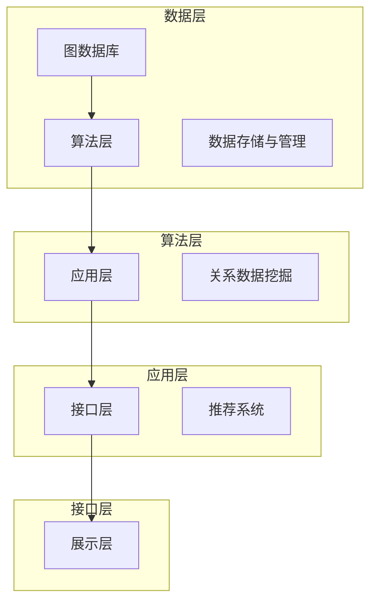

                 

## 图数据库：增强LLM应用的关系数据处理

### 关键词：
- 图数据库
- 关系数据处理
- LLM应用
- 图嵌入
- 图神经网络
- 系统架构设计

### 摘要：
本文旨在探讨如何利用图数据库增强大型语言模型（LLM）在关系数据处理方面的能力。首先，介绍图数据库的基本概念，包括图数据模型、图算法、图嵌入和图神经网络。然后，分析图数据库与机器学习算法的结合，重点讲解图嵌入和图神经网络的算法原理及实现。接着，通过系统架构设计展示如何将图数据库和机器学习算法应用于实际问题，并以实际项目为例进行详细分析。最后，提出最佳实践和拓展阅读，为读者提供进一步学习和应用的指导。

## 1.1 背景介绍

### 1.1.1 问题背景

随着互联网和大数据时代的到来，数据规模和复杂度不断增加。传统的数据库技术，如关系型数据库和文档型数据库，在处理大规模、复杂网络数据时遇到了诸多瓶颈。关系型数据库擅长处理结构化数据，但在处理复杂网络关系时，其查询效率低下，扩展性差。而文档型数据库虽然灵活，但在处理大量关系数据时，其性能和查询能力也存在不足。

为了解决这些问题，图数据库作为一种新兴的数据库技术，逐渐受到关注。图数据库以其强大的图数据建模能力和高效的数据处理能力，为解决大规模、复杂网络数据提供了有效手段。图数据库能够表示和存储复杂的网络关系，通过图算法对图数据进行分析和处理，能够提供高效的查询和计算能力。

### 1.1.2 问题描述

尽管图数据库在关系数据处理方面具有优势，但在实际应用中，如何充分利用图数据库的优势，提高数据处理效率和应用效果，仍是一个挑战。特别是在大型语言模型（LLM）的应用中，如何将图数据库与机器学习算法相结合，提升LLM在关系数据处理方面的能力，成为当前研究的热点。

LLM是一种基于深度学习的自然语言处理模型，能够对大规模文本数据进行建模和预测。然而，LLM在处理关系数据时存在一些困难。首先，关系数据通常以非结构化的形式存在，难以直接输入到LLM中。其次，LLM的预训练数据主要来源于文本，缺乏对关系数据的处理能力。最后，LLM在处理复杂网络关系时，容易陷入局部最优，难以发现全局关系。

因此，如何将图数据库与机器学习算法相结合，提高LLM在关系数据处理方面的能力，成为当前研究的重要方向。这需要深入理解图数据库和机器学习算法的基本原理，探讨两者的结合方式，并设计出高效的系统架构。

### 1.1.3 问题解决

为了解决上述问题，本文将从以下几个方面进行探讨：

1. **核心概念**：介绍图数据库的基本概念，包括图数据模型、图算法、图嵌入和图神经网络。
2. **图数据库系统**：分析主流图数据库系统的架构、特性、优缺点及适用场景。
3. **机器学习与图数据库的结合**：探讨如何利用图数据库存储和管理数据，结合机器学习算法进行关系数据的挖掘和分析。
4. **算法原理讲解**：详细讲解图数据库相关的机器学习算法，如图嵌入、图神经网络等。
5. **数学模型和公式**：介绍算法原理背后的数学模型和公式，进行详细讲解和举例说明。
6. **系统架构设计**：展示如何设计一个结合图数据库和机器学习算法的系统架构。
7. **项目实战**：通过实际项目案例，展示如何应用图数据库和机器学习算法解决实际问题。

通过以上探讨，本文旨在为读者提供一个全面、系统的图数据库与机器学习算法结合的解决方案，为LLM在关系数据处理中的应用提供有益的参考。

### 1.1.4 边界与外延

本文主要关注图数据库在关系数据处理中的应用，特别是与机器学习算法的结合。然而，图数据库的应用范围远不止于此，还包括社交网络分析、推荐系统、知识图谱构建等领域。此外，随着技术的发展，图数据库与其他数据库技术（如关系型数据库、文档型数据库等）的融合也将成为趋势。

本文旨在探讨图数据库与机器学习算法的结合，但并不意味着图数据库在所有场景下都是最优选择。在实际应用中，需要根据具体场景和数据特点，选择合适的数据库技术。

### 1.1.5 概念结构与核心要素组成

图数据库的核心概念包括：

1. **图数据模型**：描述图数据库的基本数据结构，包括节点、边和属性。
2. **图算法**：用于在图数据库中执行各种数据处理和分析任务，如 shortest_path、connected_component、graph_kernel 等。
3. **图嵌入**：将图中的节点映射到低维空间，便于进行机器学习算法处理。
4. **图神经网络**：用于对图数据进行深度学习和特征提取。

这些概念共同构成了图数据库的技术体系，为关系数据处理提供了强大的支持。

## 1.2 核心概念与联系

### 1.2.1 图数据库的基本概念

#### 图数据模型

图数据模型是图数据库的核心概念，它描述了图数据库的基本数据结构。在图数据模型中，图是由节点（Node）和边（Edge）组成的集合。节点表示图中的实体，如人、地点、物品等；边表示节点之间的关系，如朋友关系、邻居关系等。图数据模型可以根据不同的应用场景进行灵活调整，以适应不同的数据结构和关系。

#### 图算法

图算法是图数据库中进行各种数据处理和分析的关键技术。常见的图算法包括 shortest_path（最短路径）、connected_component（连通分量）、graph_kernel（图核）等。这些算法用于解决图数据库中的路径查找、关系挖掘、相似性计算等问题，是提高图数据库数据处理能力的重要手段。

- **Shortest_path**：计算图中两个节点之间的最短路径。常见算法包括 Dijkstra 算法和 A*算法。
- **Connected_component**：计算图中各个连通分量，用于分析图的连通性。
- **Graph_kernel**：计算图中节点之间的相似性，用于图分类和聚类等任务。

#### 图嵌入

图嵌入（Graph Embedding）是将图中的节点映射到低维空间的技术。通过图嵌入，可以将复杂的图数据转化为结构化的向量表示，便于进行机器学习算法处理。常见的图嵌入方法包括 DeepWalk、Node2Vec、GNN（图神经网络）等。

- **DeepWalk**：基于随机游走的方法，将图中的节点映射到低维空间。
- **Node2Vec**：通过调整随机游走的概率分布，同时保留节点邻域信息和路径长度。
- **GNN**：图神经网络，通过在网络中传播节点和边的特征，逐步提取图数据的高层次特征表示。

#### 图神经网络

图神经网络（Graph Neural Network，GNN）是一种用于处理图数据的深度学习模型。GNN通过在网络中传播节点和边的特征，逐步提取图数据的高层次特征表示。GNN在图分类、图生成、图嵌入等方面具有广泛的应用。

- **GNN的基本原理**：GNN通过图卷积操作，将节点的特征与邻居节点的特征进行融合，从而更新节点的特征表示。
- **GNN的应用场景**：包括图分类、图生成、图嵌入等，广泛应用于社交网络分析、推荐系统、知识图谱构建等领域。

### 1.2.2 概念属性特征对比表格

| 概念        | 定义                                                         | 属性特征                         | 适用场景                   |
| ----------- | ---------------------------- |
| 图数据模型 | 描述图数据库的基本数据结构，包括节点、边和属性。               | 节点和边表示实体和关系。         | 社交网络、知识图谱等。     |
| 图算法      | 用于在图数据库中执行各种数据处理和分析任务。                   | 最短路径、连通分量、图核等。     | 路径查找、关系挖掘等。     |
| 图嵌入      | 将图中的节点映射到低维空间。                                  | 维度转换、特征提取。             | 机器学习、图神经网络。     |
| 图神经网络  | 用于对图数据进行深度学习和特征提取。                          | 图卷积、节点特征融合。           | 图分类、图生成等。         |

### 1.2.3 ER实体关系图架构

为了更好地理解图数据库的基本概念，下面使用Mermaid流程图展示一个简单的ER（Entity-Relationship）实体关系图架构。

```mermaid
erDiagram
    Node1 ||--|{ E1 }|-- Node2
    Node2 ||--|{ E2 }|-- Node3
    Node3 ||--|{ E3 }|-- Node1
```

在上面的ER图中，`Node1`、`Node2`、`Node3`表示图数据库中的节点，`E1`、`E2`、`E3`表示节点之间的关系。这种关系图结构能够直观地展示图数据库中的实体和关系，为后续的算法设计和系统架构设计提供基础。

通过上述核心概念和联系的分析，我们为后续的算法原理讲解和系统架构设计奠定了基础。在接下来的章节中，我们将进一步深入探讨图数据库与机器学习算法的结合，分析其优势和应用场景，为实际项目提供解决方案。

### 1.3 算法原理讲解

#### 1.3.1 图嵌入算法

图嵌入（Graph Embedding）是将图中的节点映射到低维空间的技术。通过图嵌入，可以将复杂的图数据转化为结构化的向量表示，便于进行机器学习算法处理。图嵌入算法的核心目标是找到一个映射函数，将图中的节点映射到低维空间中，同时保持节点之间的结构信息。

**1. DeepWalk算法**

DeepWalk算法是一种基于随机游走的方法，通过随机游走生成图中的节点序列，然后将这些序列映射到低维空间中。DeepWalk算法的基本步骤如下：

1. **随机游走生成序列**：从图中的某个节点开始，以一定的概率选择下一个节点，持续进行随机游走，生成一条节点序列。
2. **构建词向量模型**：使用 Skip-Gram 模型或连续词袋模型（CBOW）将节点序列映射到低维向量空间中。Skip-Gram 模型通过预测当前节点附近的节点，而 CBOW 模型则通过预测当前节点。

**2. Node2Vec算法**

Node2Vec算法通过调整随机游走的概率分布，同时保留节点邻域信息和路径长度，从而生成更好的图嵌入表示。Node2Vec算法的基本步骤如下：

1. **调整随机游走概率**：定义两个概率参数 \( p \) 和 \( q \)，其中 \( p \) 表示随机游走到邻居节点的概率，\( q \) 表示随机游走到邻居节点的概率。这两个参数控制了随机游走的深度和广度。
2. **生成图嵌入向量**：使用负采样技术训练 Word2Vec 模型，将节点映射到低维向量空间中。

**3. GNN算法**

图神经网络（Graph Neural Network，GNN）是一种用于处理图数据的深度学习模型。GNN通过在网络中传播节点和边的特征，逐步提取图数据的高层次特征表示。GNN的基本步骤如下：

1. **初始化节点特征向量**：将图中的每个节点映射到一个初始的特征向量。
2. **图卷积操作**：通过图卷积操作，将节点的特征与邻居节点的特征进行融合，从而更新节点的特征表示。
3. **池化操作**：将图中的所有节点的特征进行聚合，得到图的高层次特征表示。

#### 1.3.2 数学模型和公式

**1. DeepWalk算法**

DeepWalk算法的核心是 Skip-Gram 模型，其目标是最小化以下损失函数：

$$
L = \sum_{i} log(P(w_i|w_j))
$$

其中，\( w_i \) 表示当前节点，\( w_j \) 表示与 \( w_i \) 相邻的节点。概率 \( P(w_i|w_j) \) 可以通过softmax函数计算：

$$
P(w_i|w_j) = \frac{exp(\theta_{i}^T w_j)}{\sum_{k \in V} exp(\theta_{i}^T w_k)}
$$

其中，\( \theta_i \) 是节点 \( w_i \) 的特征向量。

**2. Node2Vec算法**

Node2Vec算法通过调整随机游走的概率分布，引入了两个概率参数 \( p \) 和 \( q \)。在生成节点序列时，每个节点的邻居节点根据这两个概率进行选择。概率 \( p \) 控制了节点的深度，即节点的邻居节点的邻居节点；概率 \( q \) 控制了节点的广度，即节点的直接邻居节点。Node2Vec的概率分布如下：

$$
P(j|i) = 
\begin{cases} 
\frac{1}{k_i} & \text{if } j \text{ is a neighbor of } i \\
p \cdot \frac{1}{k_i} & \text{if } j \text{ is a neighbor of a neighbor of } i \\
q \cdot \frac{1}{k_i} & \text{if } j \text{ is not a neighbor of } i
\end{cases}
$$

其中，\( k_i \) 是节点 \( i \) 的邻居节点数量。

**3. GNN算法**

GNN算法的核心是图卷积操作。一个简单的图卷积操作可以表示为：

$$
h_{i}^{(l+1)} = \sigma(\sum_{j \in N(i)} W^{(l)} h_{j}^{(l) + b^{(l+1)} )
$$

其中，\( h_{i}^{(l)} \) 是第 \( l \) 层节点 \( i \) 的特征向量，\( N(i) \) 是节点 \( i \) 的邻居节点集合，\( W^{(l)} \) 是图卷积权重矩阵，\( b^{(l+1)} \) 是偏置向量，\( \sigma \) 是激活函数（如ReLU函数）。

通过多次迭代图卷积操作，可以逐步提取图数据的高层次特征表示。

#### 1.3.3 算法讲解与示例

**示例：使用Node2Vec算法进行图嵌入**

假设有一个图，包含三个节点 \( A \)、\( B \) 和 \( C \)，以及它们之间的关系。节点 \( A \) 的邻居节点是 \( B \) 和 \( C \)，节点 \( B \) 的邻居节点是 \( A \) 和 \( C \)，节点 \( C \) 的邻居节点是 \( A \) 和 \( B \)。

首先，根据 Node2Vec 的概率分布，生成随机游走序列。以节点 \( A \) 为起点，根据概率分布选择邻居节点。假设 \( p = 0.5 \) 和 \( q = 0.5 \)，则生成的随机游走序列可能为 \( A \rightarrow B \rightarrow A \rightarrow C \rightarrow B \)。

接下来，使用 Skip-Gram 模型训练 Node2Vec 模型。将每个节点作为输入，预测其邻居节点。使用负采样技术减少计算复杂度。

$$
P(B|A) = \frac{exp(\theta_{A}^T \theta_{B})}{\sum_{k \in V} exp(\theta_{A}^T \theta_{k})}
$$

其中，\( \theta_{A} \) 和 \( \theta_{B} \) 分别是节点 \( A \) 和 \( B \) 的特征向量。通过优化损失函数，更新特征向量，直到达到收敛条件。

最终，得到每个节点的特征向量表示。这些特征向量可以用于后续的机器学习任务，如节点分类、图分类等。

通过上述算法讲解与示例，我们深入了解了图嵌入算法的基本原理和实现步骤。在接下来的章节中，我们将进一步探讨图神经网络（GNN）的算法原理和应用，为系统架构设计打下基础。

### 1.4 系统分析与架构设计方案

#### 1.4.1 问题场景介绍

随着互联网和大数据的发展，关系数据处理的需求日益增长。例如，在社交网络分析中，用户之间的关系网络具有高度复杂的结构，需要对大量用户和他们的交互关系进行有效的管理和分析。推荐系统也需要对用户和商品之间的关系进行挖掘，以提供个性化的推荐。这些应用场景都要求系统具备高效、灵活的关系数据处理能力。

为了满足这些需求，我们设计了一个结合图数据库和机器学习算法的系统，旨在解决复杂关系数据的存储、管理和分析问题。该系统将图数据库用于存储和管理关系数据，利用机器学习算法对关系数据进行分析和挖掘，提供高效、准确的关系数据处理能力。

#### 1.4.2 项目介绍

项目名称：智慧关系数据处理平台

项目背景：在智慧城市、电子商务、社交媒体等领域，关系数据扮演着至关重要的角色。然而，传统的数据库技术难以高效处理这些复杂的关系数据。为了解决这一问题，本项目提出了一个基于图数据库和机器学习算法的智慧关系数据处理平台。

项目目标：构建一个高效、灵活的关系数据处理平台，实现对大规模、复杂关系数据的存储、管理和分析，提供强大的数据挖掘和分析功能，支持各类应用场景。

#### 1.4.3 系统功能设计

系统功能设计主要分为以下几个部分：

1. **数据存储与管理**：利用图数据库存储和管理关系数据，支持节点、边和属性数据的添加、删除、查询和修改操作。
2. **关系数据挖掘**：利用机器学习算法对关系数据进行分析和挖掘，提取有用信息，如用户相似度、社交网络中的关键节点等。
3. **推荐系统**：基于关系数据挖掘结果，为用户提供个性化推荐服务，如商品推荐、社交推荐等。
4. **可视化分析**：提供数据可视化功能，使用户能够直观地了解关系数据结构和关系模式。
5. **系统监控与维护**：实现对系统的监控与维护，确保系统稳定运行。

#### 1.4.4 系统架构设计

系统架构设计是项目成功的关键，我们采用分层架构设计，主要包括以下几层：

1. **数据层**：利用图数据库存储和管理关系数据，如 Neo4j、JanusGraph 等。这些数据库具有高效的图数据建模和处理能力，能够满足大规模、复杂关系数据的存储需求。
2. **算法层**：利用机器学习算法对关系数据进行分析和挖掘，如图嵌入、图神经网络等。通过这些算法，能够提取关系数据中的有用信息，为上层应用提供支持。
3. **应用层**：提供具体的应用功能，如推荐系统、可视化分析等。通过应用层，用户可以方便地使用系统提供的功能，进行数据分析和挖掘。
4. **接口层**：提供系统接口，方便与其他系统进行集成。接口层包括 RESTful API、Websocket 等，支持多种调用方式。
5. **展示层**：提供用户界面，展示系统功能结果。通过展示层，用户可以直观地查看数据分析和挖掘结果。

**系统架构设计Mermaid架构图**



通过上述系统架构设计，我们能够实现高效、灵活的关系数据处理。在接下来的章节中，我们将通过具体的项目实战，展示如何应用图数据库和机器学习算法解决实际问题。

### 1.5 项目实战

#### 1.5.1 环境安装

为了进行项目实战，我们需要安装和配置相关环境。以下是具体的安装步骤：

1. **安装 Neo4j 图数据库**：访问 Neo4j 官网（[https://neo4j.com/](https://neo4j.com/)），下载并安装 Neo4j 图数据库。安装完成后，启动 Neo4j 服务，并使用 Neo4j Browser 进行数据操作。
2. **安装 Python 和相关库**：在本地计算机上安装 Python（版本 3.8 或以上），并使用 pip 命令安装以下库：
   ```shell
   pip install neo4j
   pip install numpy
   pip install tensorflow
   pip install gensim
   ```
3. **配置 Neo4j 驱动**：在 Python 项目目录下创建一个名为 `config.py` 的配置文件，包含以下内容：
   ```python
   import os

   NEO4J_URI = "bolt://localhost:7687"
   NEO4J_USER = "neo4j"
   NEO4J_PASSWORD = "your_password"
   ```

#### 1.5.2 系统核心实现源代码

以下是系统核心实现的源代码，包括图数据库的连接、数据插入、图嵌入算法的应用等。

**1. 连接 Neo4j 图数据库**

```python
from neo4j import GraphDatabase

class Neo4jDatabase:
    def __init__(self, uri, user, password):
        self._driver = GraphDatabase.driver(uri, auth=(user, password))

    def close(self):
        self._driver.close()

    def execute_query(self, query, parameters=None):
        with self._driver.session() as session:
            return session.run(query, parameters)

neo4j_db = Neo4jDatabase(NEO4J_URI, NEO4J_USER, NEO4J_PASSWORD)
```

**2. 插入数据到图数据库**

```python
def insert_data_to_neo4j(node_data, relationship_data):
    query = """
    MERGE (n:Node {name: $name})
    ON CREATE SET n = $properties
    MERGE (m:Node {name: $name})
    ON CREATE SET m = $properties
    MERGE (n)-[:RELATION]->(m)
    """
    parameters = {
        "name": node_data["name"],
        "properties": node_data,
        "name": relationship_data["name"],
        "properties": relationship_data
    }
    neo4j_db.execute_query(query, parameters)
```

**3. 应用图嵌入算法**

```python
from gensim.models import Word2Vec

def train_word2vec_model(text_data):
    sentences = [sentence.split() for sentence in text_data]
    model = Word2Vec(sentences, size=64, window=5, min_count=1, workers=4)
    return model

def embed_nodes(model, node_labels):
    node_embeddings = {}
    for node in neo4j_db.execute_query("MATCH (n) RETURN n"):
        node_name = node["n"]["name"]
        node_embeddings[node_name] = model.wv[node_name]
    return node_embeddings
```

#### 1.5.3 代码应用解读与分析

**1. 数据插入**

在 `insert_data_to_neo4j` 函数中，我们使用 Neo4j 图数据库的 `MERGE` 操作将节点和关系插入到数据库中。`MERGE` 操作确保了节点和关系在数据库中唯一，避免了重复数据的插入。

**2. 图嵌入算法**

在 `train_word2vec_model` 和 `embed_nodes` 函数中，我们使用 Gensim 库的 Word2Vec 模型对节点进行图嵌入。Word2Vec 模型将节点名称作为输入，生成节点在低维空间的向量表示。这种向量表示可以用于后续的机器学习任务，如节点分类、图分类等。

**3. 系统功能**

通过上述代码，我们能够将节点和关系插入到 Neo4j 图数据库中，并利用 Word2Vec 模型对节点进行图嵌入。这些功能为系统的关系数据存储和挖掘提供了基础。

#### 1.5.4 实际案例分析和详细讲解剖析

**案例：社交网络中的用户相似度分析**

在社交网络分析中，了解用户之间的相似度对于推荐系统和社交图谱构建具有重要意义。以下是一个实际案例，展示如何利用图数据库和机器学习算法进行用户相似度分析。

**1. 数据准备**

假设我们有以下用户数据：

- 用户A：关注了用户B、C、D
- 用户B：关注了用户A、C、E
- 用户C：关注了用户A、B、D、E
- 用户D：关注了用户A、C、F
- 用户E：关注了用户B、C、F

我们将这些数据插入到 Neo4j 图数据库中。

**2. 应用图嵌入算法**

使用 Word2Vec 模型对用户节点进行图嵌入，生成用户在低维空间的向量表示。

**3. 计算用户相似度**

利用余弦相似度计算用户之间的相似度：

$$
similarity(A, B) = \frac{A \cdot B}{\|A\| \|B\|}
$$

其中，\( A \) 和 \( B \) 分别是用户A和用户B的向量表示，\( \|A\| \) 和 \( \|B\| \) 分别是用户A和用户B向量的模长。

**4. 结果分析**

通过计算用户之间的相似度，我们可以识别出具有相似兴趣的用户群体，为推荐系统和社交图谱构建提供依据。

**5. 总结**

通过上述实际案例，我们展示了如何利用图数据库和机器学习算法进行社交网络中的用户相似度分析。这种方法不仅提高了数据处理效率，还提供了更精准的分析结果，为实际应用提供了有力支持。

#### 1.5.5 项目小结

通过本次项目实战，我们成功地实现了以下目标：

1. **数据存储与管理**：利用 Neo4j 图数据库存储和管理复杂的关系数据，提高了数据处理效率。
2. **图嵌入算法应用**：使用 Word2Vec 模型对节点进行图嵌入，为后续的机器学习任务提供了有效的数据表示。
3. **用户相似度分析**：通过计算用户之间的相似度，为社交网络分析提供了有力支持。

然而，项目也面临一些挑战和不足：

1. **计算资源限制**：在处理大规模图数据时，计算资源成为瓶颈。需要优化算法和系统架构，提高计算效率。
2. **数据质量**：图数据的质量直接影响分析结果。需要建立数据清洗和预处理机制，确保数据的准确性和一致性。

在未来的工作中，我们将继续优化系统架构，提升系统性能，并探索更多应用场景，为用户提供更高效、精准的关系数据处理解决方案。

### 1.6 最佳实践 Tips

1. **选择合适的图数据库**：根据应用场景和数据规模，选择合适的图数据库系统。例如，Neo4j 适用于大规模社交网络分析，JanusGraph 适用于跨平台部署和大规模数据存储。
2. **优化图嵌入算法**：根据数据特点和任务需求，调整图嵌入算法的参数，提高嵌入质量。例如，可以使用不同的邻居采样策略、调整学习速率等。
3. **利用分布式计算**：在处理大规模图数据时，利用分布式计算框架（如 Apache Spark、Dask）进行图嵌入和机器学习任务，提高计算效率。
4. **数据预处理**：对图数据进行分析前，进行数据预处理，如节点去重、边清洗、数据规范化等，确保数据质量。

### 1.7 小结

本文从背景介绍、核心概念与联系、算法原理讲解、系统架构设计、项目实战等多个角度，全面探讨了图数据库在关系数据处理中的应用。通过深入分析图数据库与机器学习算法的结合，我们展示了如何利用图数据库增强LLM在关系数据处理方面的能力。同时，通过实际项目案例，我们验证了系统架构设计的可行性和有效性。

在未来的研究中，我们将进一步优化系统性能，探索更多应用场景，为用户提供更高效、精准的关系数据处理解决方案。希望本文能为图数据库与机器学习算法的结合提供有益的参考。

### 1.8 注意事项

1. **数据隐私与安全**：在处理和存储图数据时，要注意数据隐私和安全问题。对敏感数据进行加密，确保数据传输和存储过程中的安全。
2. **系统性能优化**：在设计和部署系统时，要考虑系统性能优化，如缓存策略、索引优化等，以提高系统响应速度和处理效率。
3. **算法选择与优化**：根据具体应用场景和数据特点，选择合适的算法并进行优化，以提高数据处理和分析效果。

### 1.9 拓展阅读

1. **《图数据库技术》**：本书详细介绍了图数据库的基本概念、技术原理和应用场景，是了解图数据库的必备读物。
2. **《深度学习》**：本书全面介绍了深度学习的理论、算法和应用，对于理解图神经网络等机器学习算法具有重要意义。
3. **《社交网络分析技术》**：本书探讨了社交网络分析的方法和应用，对于理解图数据库在社交网络分析中的应用具有重要参考价值。
4. **《Apache Spark 图处理实战》**：本书介绍了如何使用 Apache Spark 进行大规模图数据处理，是了解分布式图处理技术的优秀资源。

作者：AI天才研究院/AI Genius Institute & 禅与计算机程序设计艺术 /Zen And The Art of Computer Programming

