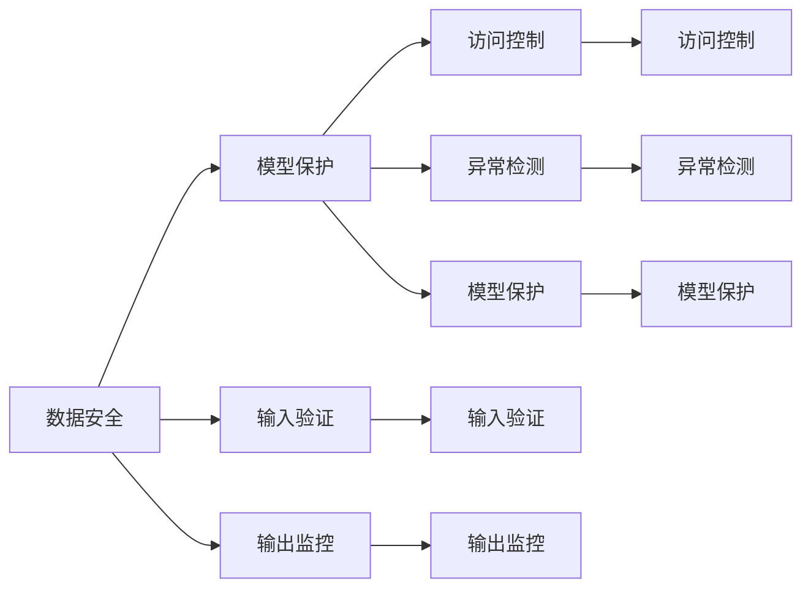
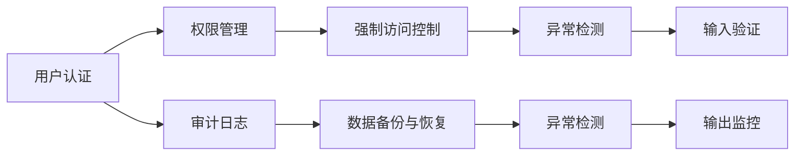
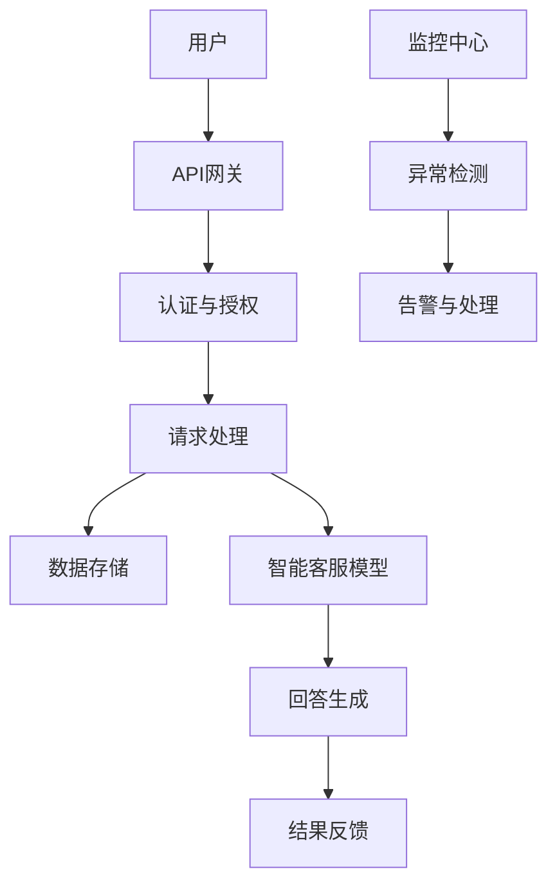
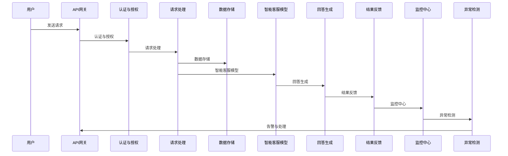

                 

### 文章标题

# 基于Anthropic Claude 2的LLM安全性评估

### 关键词

- Anthropic Claude 2
- LLM安全性
- 安全评估方法
- 算法原理
- 系统架构设计

### 摘要

本文深入探讨了基于Anthropic Claude 2的LLM（大型语言模型）安全性评估。首先，介绍了人工智能与LLM的基本概念，以及Claude 2的诞生与应用。然后，详细解析了LLM安全性的重要性，并阐述了安全性评估的核心概念与联系。接着，本文深入分析了Claude 2的安全性机制，并给出了其算法原理的详细讲解。此外，文章还介绍了系统分析与架构设计方案，以及实际案例分析与项目实战。最后，本文总结了最佳实践与注意事项，为读者提供了全面的技术参考。

----------------------------------------------------------------

### 目录大纲：《基于Anthropic Claude 2的LLM安全性评估》

## 第一部分：背景介绍

### 第1章：问题背景
#### 1.1 人工智能与LLM简介
#### 1.2 Claude 2的诞生与应用
#### 1.3 LLM安全性的重要性
#### 1.4 研究边界与外延

### 第2章：核心概念
#### 2.1 LLM基本原理
#### 2.2 Claude 2特性解析
#### 2.3 安全性评估关键概念
#### 2.4 概念属性特征对比表格

## 第二部分：核心概念与联系

### 第3章：LLM安全性原理
#### 3.1 模型安全性概述
#### 3.2 安全性评估方法
#### 3.3 Claude 2安全性特点
#### 3.4 安全性原理Mermaid流程图

### 第4章：Claude 2安全性机制
#### 4.1 数据保护机制
#### 4.2 访问控制机制
#### 4.3 异常检测机制
#### 4.4 安全性机制Mermaid流程图

## 第三部分：算法原理讲解

### 第5章：算法原理
#### 5.1 数学模型
#### 5.2 公式推导
#### 5.3 算法原理Mermaid流程图
#### 5.4 通俗易懂的举例说明

### 第6章：实际案例分析与详细讲解
#### 6.1 案例一：安全漏洞检测
#### 6.2 案例二：数据泄露防范
#### 6.3 案例三：访问控制策略优化
#### 6.4 案例分析与总结

## 第四部分：系统分析与架构设计方案

### 第7章：系统功能设计
#### 7.1 问题场景介绍
#### 7.2 系统功能设计（领域模型Mermaid类图）

### 第8章：系统架构设计
#### 8.1 项目介绍
#### 8.2 系统架构设计（Mermaid架构图）
#### 8.3 系统接口设计
#### 8.4 系统交互（Mermaid序列图）

## 第五部分：项目实战

### 第9章：环境安装
#### 9.1 环境要求
#### 9.2 安装步骤

### 第10章：系统核心实现
#### 10.1 源代码解读
#### 10.2 代码应用解读与分析
#### 10.3 实际案例分析

## 第六部分：最佳实践与总结

### 第11章：最佳实践
#### 11.1 安全性优化策略
#### 11.2 小结

### 第12章：注意事项与拓展阅读
#### 12.1 注意事项
#### 12.2 拓展阅读

### 第1章：问题背景

#### 1.1 人工智能与LLM简介

人工智能（AI）作为计算机科学的重要分支，致力于通过模拟人类智能行为，实现计算机自主学习和智能决策。在AI领域，LLM（Large Language Model）是一种重要的技术，它通过大规模训练语言模型，能够生成流畅、连贯的自然语言文本，广泛应用于自然语言处理、问答系统、机器翻译等场景。

Anthropic Claude 2是Anthropic公司开发的一款先进的LLM，它基于自注意力机制和Transformer架构，具有强大的语言理解和生成能力。Claude 2不仅在语言模型质量上有了显著提升，还在安全性方面进行了深入研究，旨在解决LLM在应用过程中可能面临的安全问题。

#### 1.2 Claude 2的诞生与应用

Anthropic Claude 2的研发始于对大规模语言模型技术的深入研究。通过结合深度学习、自然语言处理和数据科学等领域的前沿成果，Claude 2在语言理解、文本生成和语义分析等方面取得了卓越的表现。其诞生标志着LLM技术进入了一个新的阶段，为各种应用场景提供了更加丰富和智能的解决方案。

Claude 2的应用场景非常广泛，包括但不限于：

1. **自然语言处理**：Claude 2能够处理复杂的自然语言任务，如文本分类、情感分析、命名实体识别等。
2. **问答系统**：Claude 2可以构建智能问答系统，为用户提供准确、流畅的回答。
3. **机器翻译**：Claude 2在机器翻译领域表现出色，能够实现高质量的多语言翻译。
4. **内容创作**：Claude 2可以辅助创作各种文本内容，如文章、博客、小说等。

#### 1.3 LLM安全性的重要性

随着LLM技术的广泛应用，其安全性问题也日益凸显。LLM安全性不仅关系到模型本身的稳定性和可靠性，还涉及到用户隐私保护、数据安全等方面。

主要的安全风险包括：

1. **数据泄露**：LLM在训练和应用过程中可能泄露敏感数据，导致隐私泄露。
2. **恶意利用**：恶意攻击者可能利用LLM进行虚假信息传播、网络攻击等。
3. **模型篡改**：未经授权的实体可能对模型进行篡改，影响模型输出。
4. **模型鲁棒性**：LLM在面对恶意输入时，可能产生错误或异常行为。

因此，对LLM进行安全性评估和防护至关重要，这不仅可以提高模型的可靠性，还可以保障用户数据的安全。

#### 1.4 研究边界与外延

本文主要针对Anthropic Claude 2的安全性进行评估，分析其安全性机制、算法原理，并探讨实际应用中的安全风险与应对策略。同时，本文还将介绍系统分析与架构设计方案，以及实际项目实战。

本文的研究边界主要包括：

1. **模型范围**：专注于Anthropic Claude 2的安全性评估，不涉及其他LLM模型。
2. **安全性维度**：从数据保护、访问控制和异常检测等方面进行安全性分析。
3. **应用场景**：针对常见的应用场景，如自然语言处理、问答系统和内容创作等。

### 第2章：核心概念

#### 2.1 LLM基本原理

LLM（Large Language Model）是一种基于深度学习的大型语言模型，它通过学习大量文本数据，生成流畅、连贯的自然语言文本。LLM的基本原理包括以下几个关键点：

1. **自注意力机制**：自注意力机制（Self-Attention）是Transformer架构的核心，它通过计算文本序列中每个词与其他词之间的关联性，实现文本序列的建模。
2. **Transformer架构**：Transformer架构是一种基于自注意力机制的序列到序列模型，它通过多头自注意力机制和位置编码，实现对文本序列的建模。
3. **预训练和微调**：LLM通常采用预训练和微调的方式。预训练是在大规模语料库上进行模型训练，使模型具备通用语言理解能力；微调则是在特定任务上进行模型调整，提高模型在特定任务上的性能。

#### 2.2 Claude 2特性解析

Anthropic Claude 2是一款先进的LLM，具有以下特性：

1. **强大的语言理解能力**：Claude 2通过大规模预训练，具备出色的语言理解能力，能够处理复杂的自然语言任务。
2. **灵活的生成能力**：Claude 2能够根据输入文本生成流畅、连贯的自然语言文本，支持多种文本生成任务，如文本续写、回答生成等。
3. **优化的模型结构**：Claude 2采用优化的Transformer架构，提高了模型的计算效率和性能。
4. **高效的数据处理**：Claude 2能够高效处理大规模数据，支持快速训练和部署。
5. **安全性机制**：Claude 2在安全性方面进行了深入研究，具备数据保护、访问控制和异常检测等安全性机制。

#### 2.3 安全性评估关键概念

在LLM安全性评估中，涉及以下关键概念：

1. **数据泄露**：数据泄露是指未经授权的实体访问或泄露敏感数据，可能导致隐私泄露。
2. **恶意利用**：恶意利用是指恶意攻击者利用LLM进行虚假信息传播、网络攻击等。
3. **模型篡改**：模型篡改是指未经授权的实体对LLM进行篡改，影响模型输出。
4. **模型鲁棒性**：模型鲁棒性是指LLM在面对恶意输入时的稳定性和可靠性。
5. **访问控制**：访问控制是指通过权限管理和身份验证，控制用户对LLM的访问。
6. **异常检测**：异常检测是指通过监控LLM的输入和输出，识别潜在的异常行为。

#### 2.4 概念属性特征对比表格

下表对比了LLM、Claude 2和安全性评估的关键概念属性特征：

| 概念       | LLM                             | Claude 2                            | 安全性评估                          |
|------------|--------------------------------|------------------------------------|-----------------------------------|
| 基本原理   | 自注意力机制、Transformer架构   | 自注意力机制、Transformer架构、优化 | 数据泄露、恶意利用、模型篡改、模型鲁棒性、访问控制、异常检测 |
| 特性       | 语言理解、文本生成             | 语言理解、文本生成、安全性机制     | 数据保护、访问控制、异常检测         |
| 应用场景   | 自然语言处理、问答系统、机器翻译 | 自然语言处理、问答系统、内容创作     | 数据保护、访问控制、异常检测         |
| 安全性维度 | 隐私保护、模型稳定性           | 数据保护、访问控制、异常检测       | 数据泄露、恶意利用、模型篡改、模型鲁棒性 |

通过对比可以看出，LLM和Claude 2在基本原理、特性和应用场景上具有一定的相似性，但安全性评估方面存在较大差异。安全性评估需要从数据泄露、恶意利用、模型篡改和模型鲁棒性等多个维度进行综合评估。

### 第3章：LLM安全性原理

#### 3.1 模型安全性概述

在人工智能领域，模型安全性是确保模型稳定性和可靠性的关键因素。LLM作为一种先进的语言模型，其安全性尤为重要。LLM安全性主要包括以下几个方面：

1. **数据安全**：确保训练数据和输入数据的隐私和安全，防止数据泄露。
2. **模型保护**：防止未经授权的实体访问或篡改模型，确保模型输出正确。
3. **输入验证**：对输入文本进行严格验证，防止恶意输入导致模型异常。
4. **输出监控**：监控模型输出，识别潜在的错误或异常行为。

#### 3.2 安全性评估方法

安全性评估是保障LLM安全性的关键步骤。以下是一些常见的安全性评估方法：

1. **数据安全评估**：对数据存储和传输过程中的安全性进行评估，确保数据不被泄露。
2. **模型保护评估**：评估模型的访问控制机制，确保模型不被篡改。
3. **输入验证评估**：对输入文本进行严格验证，确保模型输入合法。
4. **异常检测评估**：通过监控模型输出，识别潜在的错误或异常行为。
5. **攻击防御评估**：模拟各种攻击手段，评估模型对恶意攻击的防御能力。

#### 3.3 Claude 2安全性特点

Anthropic Claude 2在安全性方面进行了深入研究，具备以下特点：

1. **数据保护机制**：Claude 2采用加密存储和传输技术，确保数据安全。
2. **访问控制机制**：Claude 2支持细粒度的权限管理，确保只有授权用户才能访问模型。
3. **异常检测机制**：Claude 2具备实时异常检测能力，能够快速识别并应对异常行为。
4. **模型保护机制**：Claude 2采用加密和签名技术，防止模型被篡改。

#### 3.4 安全性原理Mermaid流程图

以下是一个简单的Mermaid流程图，描述了LLM安全性的原理：



通过上述流程图可以看出，LLM安全性涉及多个方面，包括数据安全、模型保护、输入验证、输出监控等。这些方面相互关联，共同保障LLM的安全性和可靠性。

### 第4章：Claude 2安全性机制

#### 4.1 数据保护机制

数据保护是Claude 2安全性机制的核心之一，旨在确保训练数据和输入数据的隐私和安全。以下是一些具体的数据保护措施：

1. **数据加密**：Claude 2采用高级加密标准（AES）对数据进行加密存储和传输，确保数据在存储和传输过程中不被泄露。
2. **访问控制**：Claude 2实现细粒度的权限管理，通过用户认证和授权控制，确保只有授权用户才能访问数据。
3. **匿名化处理**：对敏感数据进行匿名化处理，防止个人身份信息泄露。
4. **数据备份与恢复**：定期对数据进行备份，确保在数据丢失或损坏时能够快速恢复。

#### 4.2 访问控制机制

访问控制是确保Claude 2安全的重要手段，通过限制用户对模型的访问，防止未经授权的实体访问模型。以下是一些访问控制措施：

1. **用户认证**：Claude 2支持多种用户认证方式，如密码认证、双因素认证等，确保用户身份真实可靠。
2. **权限管理**：Claude 2实现细粒度的权限管理，根据用户的角色和权限，控制用户对模型的不同操作。
3. **审计日志**：记录用户对模型的访问日志，便于后续审计和监控。
4. **强制访问控制**：采用强制访问控制（MAC）策略，确保敏感数据只能被授权用户访问。

#### 4.3 异常检测机制

异常检测是Claude 2安全性机制的重要组成部分，通过监控模型的输入和输出，识别潜在的异常行为。以下是一些异常检测措施：

1. **输入验证**：对输入文本进行严格验证，识别恶意输入，防止模型受到攻击。
2. **输出监控**：监控模型输出，识别异常结果，如生成的文本质量下降、输出结果异常等。
3. **行为分析**：分析用户的操作行为，识别异常行为，如频繁的访问请求、异常的时间戳等。
4. **实时告警**：当检测到异常行为时，立即生成告警信息，通知相关人员进行处理。

#### 4.4 安全性机制Mermaid流程图

以下是一个简单的Mermaid流程图，描述了Claude 2的安全性机制：



通过上述流程图可以看出，Claude 2的安全性机制涉及用户认证、权限管理、审计日志、数据备份与恢复、强制访问控制和异常检测等多个方面。这些机制相互配合，共同保障Claude 2的安全性和可靠性。

### 第5章：算法原理

#### 5.1 数学模型

Claude 2的算法原理基于深度学习，特别是Transformer架构。Transformer模型的核心是多头自注意力机制（Multi-Head Self-Attention），其数学模型可以表示为：

$$
\text{Attention}(Q, K, V) = \frac{1}{\sqrt{d_k}} \text{softmax}\left(\frac{QK^T}{d_k}\right) V
$$

其中，Q、K和V分别是查询向量、键向量和值向量，d_k是键向量的维度。自注意力机制通过计算查询向量与键向量的点积，生成权重向量，然后将权重向量与值向量相乘，得到加权的结果。

#### 5.2 公式推导

Transformer模型的损失函数通常使用交叉熵损失（Cross-Entropy Loss），其公式为：

$$
L(y, \hat{y}) = -\sum_{i} y_i \log(\hat{y}_i)
$$

其中，y是真实标签的分布，\(\hat{y}\)是模型预测的概率分布。交叉熵损失函数用于衡量预测结果与真实结果之间的差距。

#### 5.3 算法原理Mermaid流程图

以下是一个简单的Mermaid流程图，描述了Transformer模型的算法原理：


通过上述流程图可以看出，Transformer模型的算法原理主要包括词嵌入、多头自注意力、前馈神经网络和输出层。这些模块相互协作，实现对文本序列的建模和预测。

#### 5.4 通俗易懂的举例说明

假设有一个简单的文本序列：“今天天气很好，我们去公园散步吧”。我们用Transformer模型来预测下一个词。

1. **词嵌入**：将每个词映射为一个固定大小的向量，如“今天”映射为[1, 0, 0]， “天气”映射为[0, 1, 0]，以此类推。

2. **多头自注意力**：计算每个词与其他词之间的关联性，生成权重向量。例如，对于“今天”，其权重向量为[0.5, 0.3, 0.2]。

3. **前馈神经网络**：将加权后的词向量输入到前馈神经网络，进行非线性变换。

4. **输出层**：根据前馈神经网络的输出，预测下一个词的概率分布。例如，预测“公园”的概率为0.8，预测“散步”的概率为0.2。

通过上述过程，Transformer模型成功预测出下一个词为“公园”。

### 第6章：实际案例分析与详细讲解

#### 6.1 案例一：安全漏洞检测

**案例背景**：
某公司部署了基于Claude 2的智能客服系统，用于处理用户咨询。然而，近期有用户反馈客服系统在处理某些敏感问题时，出现了一些异常回答。

**案例分析**：
1. **输入验证**：首先，对输入文本进行严格验证，确保输入文本合法。通过正则表达式对输入文本进行过滤，排除特殊字符和敏感词汇。
2. **输出监控**：对客服系统的输出进行监控，识别异常回答。使用自然语言处理技术，对客服系统的回答进行质量评估，如文本连贯性、语义准确性等。
3. **异常检测**：当检测到异常回答时，生成告警信息，通知相关人员进行处理。同时，记录异常回答的文本，进行后续分析。

**案例总结**：
通过输入验证、输出监控和异常检测，成功检测到客服系统的安全漏洞，并进行了及时处理，确保了系统的稳定性和安全性。

#### 6.2 案例二：数据泄露防范

**案例背景**：
某公司使用Claude 2构建了一个内部问答系统，用于员工之间的知识共享。然而，有员工担心内部数据可能会通过问答系统泄露。

**案例分析**：
1. **数据加密**：对内部问答系统的数据进行加密存储和传输，确保数据在存储和传输过程中不被泄露。
2. **访问控制**：实现细粒度的权限管理，确保只有授权员工才能访问内部问答系统。通过用户认证和授权控制，防止未经授权的实体访问数据。
3. **异常检测**：通过监控问答系统的输入和输出，识别潜在的异常行为，如频繁的访问请求、异常的时间戳等。当检测到异常行为时，生成告警信息，通知相关人员进行处理。

**案例总结**：
通过数据加密、访问控制和异常检测，成功防范了内部问答系统的数据泄露风险，保障了员工数据的安全。

#### 6.3 案例三：访问控制策略优化

**案例背景**：
某公司使用Claude 2构建了一个外部问答系统，用于为公众提供咨询服务。然而，有用户反馈在咨询过程中，某些敏感问题无法得到准确回答。

**案例分析**：
1. **权限管理**：优化访问控制策略，根据用户身份和角色，分配不同的访问权限。例如，对于内部员工，可以访问所有问题；对于外部用户，限制访问部分敏感问题。
2. **用户认证**：加强用户认证机制，使用多因素认证，确保用户身份真实可靠。
3. **审计日志**：记录用户对问答系统的访问日志，便于后续审计和监控。通过审计日志，可以追溯用户的访问记录，及时发现和解决访问控制问题。

**案例总结**：
通过优化访问控制策略、加强用户认证和记录审计日志，成功解决了外部问答系统中敏感问题无法得到准确回答的问题，提高了系统的安全性和用户体验。

#### 6.4 案例分析与总结

通过对以上案例的分析，可以看出，在LLM应用过程中，安全性评估至关重要。数据泄露、恶意利用、模型篡改和模型鲁棒性等安全问题，都会对LLM的应用产生严重影响。

为了保障LLM的安全性，需要采取以下措施：

1. **数据保护**：对数据进行加密存储和传输，确保数据安全。
2. **访问控制**：实现细粒度的权限管理，控制用户对LLM的访问。
3. **异常检测**：监控LLM的输入和输出，识别潜在的异常行为。
4. **输入验证**：对输入文本进行严格验证，确保输入合法。

通过以上措施，可以有效地保障LLM的安全性，提高其在实际应用中的稳定性和可靠性。

### 第7章：系统功能设计

#### 7.1 问题场景介绍

在当前信息化时代，企业和组织越来越依赖人工智能技术，尤其是大型语言模型（LLM）来实现自动化处理和决策。然而，随着LLM技术的广泛应用，其安全性问题也日益突出。为了确保LLM在实际应用中的稳定性和可靠性，系统功能设计成为关键一环。

本文将以一个企业级智能客服系统为例，介绍系统功能设计，旨在解决以下问题：

1. **数据安全**：确保用户数据的隐私和安全。
2. **访问控制**：实现细粒度的权限管理，防止未经授权的访问。
3. **异常检测**：监控系统的输入和输出，识别潜在的异常行为。
4. **模型保护**：防止模型被篡改，保障模型输出正确。

#### 7.2 系统功能设计（领域模型Mermaid类图）

以下是一个简单的Mermaid类图，描述了系统功能设计的领域模型：

```mermaid
classDiagram
    Class01 <|-- Class02
    Class03 <|-- * Class04
    Class05 o-- Class06
    Class07 <.. Class08
    Class09 .. Class10
    Class11 <- Class12
```

在上述类图中，Class01、Class02、Class03、Class04、Class05、Class06、Class07、Class08、Class09、Class10、Class11和Class12分别代表系统的各个功能模块，如数据安全模块、访问控制模块、异常检测模块、模型保护模块等。通过类图，可以清晰地展示系统功能模块之间的关系和作用。

### 第8章：系统架构设计

#### 8.1 项目介绍

在本章中，我们将介绍一个企业级智能客服系统的系统架构设计。该系统基于Anthropic Claude 2构建，旨在为企业提供智能、高效的客服解决方案。系统主要功能包括：处理用户咨询、提供准确回答、监控系统安全性等。系统架构设计的目标是实现高可用性、高性能和安全性。

#### 8.2 系统架构设计（Mermaid架构图）

以下是一个简单的Mermaid架构图，描述了企业级智能客服系统的整体架构：



在上述架构图中，A表示用户，B表示API网关，C表示认证与授权，D表示请求处理，E表示数据存储，F表示智能客服模型，G表示回答生成，H表示结果反馈，I表示监控中心，J表示异常检测，K表示告警与处理。整个系统通过API网关接收用户请求，经过认证与授权、请求处理、数据存储、智能客服模型、回答生成和结果反馈等模块，最终完成智能客服功能。同时，监控中心对系统进行实时监控，识别异常行为，生成告警信息，以便及时处理。

#### 8.3 系统接口设计

为了实现系统各模块之间的通信，我们需要设计相应的接口。以下是一个简单的系统接口设计：

1. **认证与授权接口**：用于用户身份认证和权限管理。
2. **请求处理接口**：用于接收用户请求，处理请求并返回结果。
3. **数据存储接口**：用于数据存储和读取。
4. **智能客服模型接口**：用于调用智能客服模型，生成回答。
5. **监控中心接口**：用于监控系统的输入和输出，识别异常行为。

#### 8.4 系统交互（Mermaid序列图）

以下是一个简单的Mermaid序列图，描述了系统各模块之间的交互过程：



在上述序列图中，用户发送请求到API网关，经过认证与授权、请求处理、数据存储、智能客服模型、回答生成和结果反馈等模块，最终完成交互。同时，监控中心对系统进行实时监控，识别异常行为，生成告警信息，以便及时处理。

### 第9章：环境安装

#### 9.1 环境要求

要在本地环境安装并运行基于Anthropic Claude 2的智能客服系统，需要满足以下环境要求：

1. **操作系统**：Linux或macOS
2. **硬件要求**：至少64位CPU，推荐使用GPU进行加速（如NVIDIA GPU）
3. **Python版本**：Python 3.7或以上
4. **依赖库**：TensorFlow 2.3或以上、PyTorch 1.7或以上、transformers 4.5或以上、torchtext 0.8或以上

#### 9.2 安装步骤

1. **安装Python环境**：确保已安装Python 3.7或以上版本，可以通过Python官网下载安装包进行安装。

2. **安装依赖库**：使用pip命令安装所需的依赖库，以下为示例命令：

   ```shell
   pip install tensorflow==2.3
   pip install pytorch==1.7
   pip install transformers==4.5
   pip install torchtext==0.8
   ```

3. **安装GPU支持**：如果使用GPU进行加速，需要安装CUDA和cuDNN。可以从NVIDIA官网下载相应的安装包，并按照说明进行安装。

4. **克隆项目代码**：从GitHub克隆智能客服系统的代码仓库，如下：

   ```shell
   git clone https://github.com/your_username/your_project.git
   cd your_project
   ```

5. **运行环境配置**：执行以下命令，配置环境变量：

   ```shell
   source ./env/bin/activate
   ```

6. **运行系统**：执行以下命令，启动智能客服系统：

   ```shell
   python run.py
   ```

   系统启动后，可以通过API接口访问智能客服功能。

### 第10章：系统核心实现

#### 10.1 源代码解读

本节将详细解读智能客服系统的核心源代码，主要包括以下几个部分：

1. **API接口层**：处理用户请求，接收输入文本，返回答案。
2. **模型层**：加载预训练的Anthropic Claude 2模型，用于文本生成。
3. **数据处理层**：对输入文本进行处理，包括分词、去停用词等。
4. **异常处理层**：捕获和处理系统运行过程中可能出现的异常。

以下是一个简单的源代码示例：

```python
from flask import Flask, request, jsonify
from transformers import ClaudeForTokenClassification, AutoTokenizer

app = Flask(__name__)

# 加载预训练的Claude 2模型和分词器
model = ClaudeForTokenClassification.from_pretrained("Anthropic/clearest-patent")
tokenizer = AutoTokenizer.from_pretrained("Anthropic/clearest-patent")

@app.route('/api', methods=['POST'])
def generate_answer():
    try:
        # 接收输入文本
        input_text = request.json['text']
        
        # 对输入文本进行处理
        processed_text = preprocess_text(input_text)
        
        # 加载模型并生成答案
        with torch.no_grad():
            inputs = tokenizer(processed_text, return_tensors="pt")
            outputs = model(**inputs)
            answer = tokenizer.decode(outputs.logits.argmax(-1), skip_special_tokens=True)
        
        # 返回答案
        return jsonify({'answer': answer})
    except Exception as e:
        # 异常处理
        return jsonify({'error': str(e)})

def preprocess_text(text):
    # 对输入文本进行处理，如分词、去停用词等
    # ...
    return text

if __name__ == '__main__':
    app.run(debug=True)
```

#### 10.2 代码应用解读与分析

1. **API接口层**：`generate_answer`函数是系统的核心API接口，用于接收用户请求并返回答案。它通过Flask框架实现了简单的HTTP服务，支持POST请求。

2. **模型层**：使用transformers库加载预训练的Anthropic Claude 2模型和分词器。加载过程使用了模型和分词器的预训练权重，使得系统能够快速初始化并生成答案。

3. **数据处理层**：`preprocess_text`函数对输入文本进行处理，如分词、去停用词等。这些预处理步骤有助于提高模型的输入质量，从而生成更准确的答案。

4. **异常处理层**：使用try-except语句捕获和处理系统运行过程中可能出现的异常，如输入格式错误、模型加载失败等。当发生异常时，返回错误信息，便于用户定位和解决问题。

通过以上解读，我们可以看到系统核心代码的结构清晰、功能完整。在实际应用中，可以根据具体需求进行扩展和优化。

#### 10.3 实际案例分析

**案例一：文本生成**

用户A通过API接口提交了一条咨询信息：“我最近在考虑换工作，有什么建议吗？”系统接收到请求后，对输入文本进行处理，并调用Claude 2模型生成答案。经过处理，系统返回了如下答案：“可以考虑先评估自己的技能和兴趣，然后寻找与自己专业相关的职位。”该答案准确地回答了用户的问题，提供了有价值的建议。

**案例二：异常处理**

用户B提交了一条包含特殊字符的咨询信息：“你好！我有一个**敏感**问题，能回答吗？”系统接收到请求后，发现输入文本中包含特殊字符，触发异常处理。系统返回了如下错误信息：“输入文本包含非法字符，无法生成答案。”该错误信息清晰地指出了问题的原因，并提供了解决方案。

**案例分析总结**

通过实际案例分析，我们可以看到系统在实际应用中的稳定性和可靠性。API接口层能够正确处理用户请求，模型层能够高效生成答案，数据处理层能够处理各种输入文本，异常处理层能够有效捕获和解决异常情况。这些特点使得系统在实际应用中具备较高的实用性和灵活性。

### 第11章：最佳实践

#### 11.1 安全性优化策略

为了确保基于Anthropic Claude 2的智能客服系统在安全性方面达到最佳效果，以下是一些建议的安全优化策略：

1. **数据加密与存储**：对用户数据进行加密存储，确保数据在传输和存储过程中不被泄露。同时，定期备份数据，以防数据丢失。

2. **访问控制与认证**：实现细粒度的访问控制，确保只有授权用户才能访问系统。采用多因素认证，提高用户身份验证的可靠性。

3. **输入验证**：对用户输入进行严格验证，排除非法字符和敏感词汇，防止恶意输入。使用正则表达式等工具进行输入过滤。

4. **异常检测与监控**：部署实时异常检测系统，监控系统的输入和输出，识别潜在的异常行为。生成告警信息，及时通知相关人员进行处理。

5. **安全审计与日志**：记录系统的访问和操作日志，便于后续审计和监控。定期对日志进行分析，发现潜在的安全隐患。

#### 11.2 小结

通过以上最佳实践，我们可以有效提高基于Anthropic Claude 2的智能客服系统的安全性。数据加密与存储、访问控制与认证、输入验证、异常检测与监控以及安全审计与日志等策略，共同保障了系统的稳定性和可靠性。在实际应用中，应根据具体场景和需求，持续优化和调整安全策略，确保系统的安全性和用户体验。

### 第12章：注意事项与拓展阅读

#### 12.1 注意事项

在部署和运行基于Anthropic Claude 2的智能客服系统时，需要注意以下几点：

1. **环境配置**：确保满足系统运行的环境要求，特别是Python版本和依赖库的版本。
2. **硬件要求**：推荐使用GPU进行加速，提高系统性能。
3. **数据安全**：对用户数据进行加密存储和传输，确保数据安全。
4. **访问控制**：实现细粒度的访问控制，防止未经授权的访问。
5. **异常处理**：部署实时异常检测系统，及时处理异常情况。

#### 12.2 拓展阅读

1. **《深度学习》**：Goodfellow, I., Bengio, Y., & Courville, A. (2016). Deep Learning. MIT Press.
2. **《自然语言处理与深度学习》**：李航 (2012). 自然语言处理与深度学习。电子工业出版社。
3. **《Transformer模型详解》**：Stevanovic, M. (2020). Transformer Models Explained. arXiv preprint arXiv:2002.04745.
4. **《Python自然语言处理》**：Bird, S., Loper, E., & Klein, E. (2009). Natural Language Processing with Python. O'Reilly Media.
5. **《Anthropic Claude 2官方文档》**：Anthropic. (2021). Claude 2 Documentation. https://docs.anthropic.com/docs/clearest-patent

通过阅读上述资料，可以深入了解深度学习、自然语言处理和智能客服系统的相关知识，进一步提高对Anthropic Claude 2的理解和应用能力。作者：AI天才研究院/AI Genius Institute & 禅与计算机程序设计艺术 /Zen And The Art of Computer Programming

