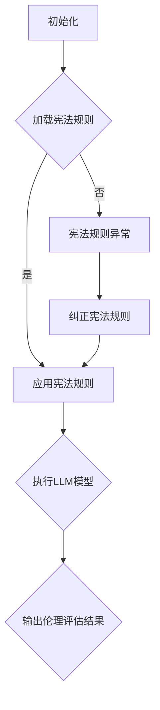
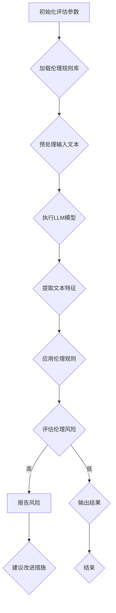
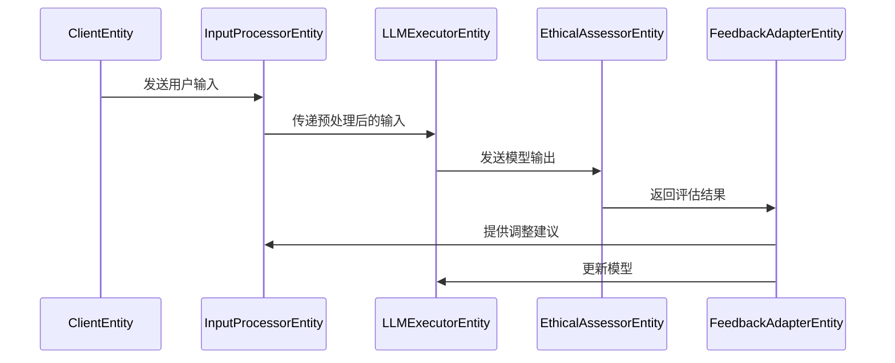

                 

### 引言

#### 问题背景

在当今人工智能（AI）飞速发展的时代，大规模语言模型（LLM）如ChatGPT和GPT-3等已经深刻地改变了我们与计算机交互的方式，并开始广泛应用于各个领域，包括自然语言处理（NLP）、机器翻译、代码生成等。然而，随着这些强大工具的广泛应用，其潜在的伦理问题也日益凸显。如何确保这些LLM的输出是公正、无偏见、符合伦理标准的，成为一个亟待解决的关键问题。

Anthropic Constitutional AI是一种旨在通过设计一套自我约束的规则体系，使AI能够在多种应用场景中保持安全性和伦理性的方法。其核心理念是借鉴人类宪法的概念，通过一组可执行的规则来指导AI的行为。而LLM伦理评估，则是在这些规则的基础上，对LLM的输出进行监督和评估，确保其符合既定的伦理标准。

本文的目的在于深入探讨Anthropic Constitutional AI的原理，以及如何将其应用于LLM伦理评估中。我们希望通过详细的步骤和实例，帮助读者理解这一复杂但至关重要的技术，并为其在实际应用中的有效性提供实证支持。

#### 核心概念与联系

Anthropic Constitutional AI是一种基于对人类宪法概念进行抽象和优化的方法，旨在为AI系统提供一套自我约束的规则。其核心在于通过一系列明确、可执行的规则，确保AI在不同场景下的输出符合预定的伦理和安全性标准。

大规模语言模型（LLM）则是一种基于深度学习的语言处理模型，具有强大的自然语言理解和生成能力。然而，这种能力也带来了潜在的伦理风险，例如偏见、误导性输出和隐私侵犯等问题。因此，对LLM进行伦理评估成为保障其合理应用的关键。

Anthropic Constitutional AI与LLM伦理评估之间的联系在于，前者为后者提供了一套规则框架，使得LLM可以在其输出过程中遵循这些规则，从而减少潜在的伦理风险。具体而言，Anthropic Constitutional AI通过定义一组基本的伦理原则和约束条件，为LLM的输出提供了指导。这些原则和条件可以被用于评估LLM的输出是否合理、公正和符合道德标准。

为了更直观地理解这两个概念，我们可以通过一个概念属性特征对比表格来展示它们的主要区别和联系。以下是Anthropic Constitutional AI和LLM伦理评估的对比：

| 特征 | Anthropic Constitutional AI | LLM伦理评估 |
| --- | --- | --- |
| 目的 | 提供AI系统的自我约束规则 | 评估LLM的输出是否符合伦理标准 |
| 方法 | 借鉴人类宪法概念 | 通过规则和标准对LLM输出进行评估 |
| 对象 | AI系统 | 大规模语言模型 |
| 关键技术 | 自我约束规则 | 伦理原则和标准 |
| 应用场景 | 多样化的AI应用 | 自然语言处理、代码生成等 |

通过这个表格，我们可以更清晰地看到Anthropic Constitutional AI和LLM伦理评估之间的紧密联系和各自的作用。Anthropic Constitutional AI为LLM伦理评估提供了理论依据和技术支持，而LLM伦理评估则通过实际应用来验证Anthropic Constitutional AI的有效性。

### 背景研究

#### Anthropic Constitutional AI的原理

Anthropic Constitutional AI（ACA）的核心思想是借鉴人类宪法中的原则和机制，为AI系统构建一个类似的法律框架。这一框架旨在确保AI在不同应用场景中都能遵循预定的伦理和行为准则，从而减少潜在的负面影响。

**1. 概念解释**

Anthropic Constitutional AI的定义可以从以下几个方面来理解：

- **宪法视角**：ACA借鉴了人类宪法的基本原则，如公正、自由、平等和保护隐私等。通过将这些原则转化为AI可以理解和执行的形式，ACA为AI系统提供了一套行为规范。
- **伦理原则**：ACA强调AI系统应该具备伦理意识，能够在决策过程中考虑人类福祉和社会价值。这些伦理原则被编码为AI可执行的规则，以指导其行为。
- **自适应机制**：ACA还包括一套自适应机制，能够根据外部环境和内部反馈调整规则，确保AI在不同场景下都能保持伦理合规。

**2. 问题背景**

随着AI技术的迅猛发展，AI系统在各个领域（如医疗、金融、法律等）中的应用日益广泛。然而，这些AI系统也带来了潜在的伦理问题，如偏见、歧视、隐私侵犯等。这些问题不仅损害了AI的可靠性，还可能对社会造成负面影响。

Anthropic Constitutional AI的提出，正是为了解决这些伦理挑战。通过构建一个自我约束的法律框架，ACA试图确保AI系统在运行过程中始终遵循伦理准则，减少潜在的风险。

**3. 问题描述**

在AI应用中，伦理问题的出现往往与以下因素有关：

- **数据偏见**：AI系统在训练过程中可能受到偏见数据的影响，导致输出结果不公平或歧视某些群体。
- **不可解释性**：AI系统的决策过程往往缺乏透明度，难以解释其行为背后的原因，这使得伦理问题的识别和解决变得更加困难。
- **滥用风险**：AI系统可能被恶意使用，用于实施欺诈、监控或操纵等不良行为。

这些问题迫切需要通过伦理评估和约束机制来加以解决，而Anthropic Constitutional AI正是为此提供了理论基础和技术手段。

**4. 问题解决**

Anthropic Constitutional AI通过以下方式解决AI伦理问题：

- **定义伦理规则**：ACA首先明确了一系列伦理规则，这些规则基于人类宪法的基本原则，如公正、透明、责任等。这些规则被编码为AI可执行的指令，确保AI在行为过程中始终遵循这些准则。
- **实现伦理评估**：ACA通过设计伦理评估机制，对AI系统的输出进行实时监控和评估。这个机制可以检测到潜在的不当行为，并提供相应的反馈和纠正措施。
- **自适应调整**：ACA还包括一个自适应机制，能够根据外部环境和内部反馈不断调整和优化伦理规则，以应对不断变化的伦理挑战。

通过这些措施，Anthropic Constitutional AI旨在建立一个安全、可靠和符合伦理标准的AI生态系统，为人类社会带来更大的福祉。

#### LLM伦理评估的研究背景

大规模语言模型（LLM）的发展已经显著提升了自然语言处理（NLP）的能力，这些模型被广泛应用于文本生成、机器翻译、问答系统等任务中。然而，随着LLM的广泛应用，其潜在的伦理问题也逐渐显现，成为研究和应用中的关键挑战。

**1. 概念解释**

LLM伦理评估是指在LLM的设计、开发和部署过程中，对其可能产生的伦理问题进行评估和监控的一系列方法和策略。其核心目标是确保LLM的输出不仅具有高质量和实用性，同时也符合伦理和社会标准。

**2. 研究背景**

随着LLM技术的不断发展，其在实际应用中暴露出一系列伦理问题：

- **偏见和歧视**：LLM在训练过程中可能受到偏见数据的影响，导致其输出结果不公平或歧视某些群体。
- **隐私侵犯**：LLM在处理文本数据时可能无意中泄露用户的敏感信息，引发隐私侵犯问题。
- **误导性输出**：LLM生成的文本可能包含误导性信息或错误观点，对社会造成负面影响。
- **滥用风险**：LLM可能被恶意使用，用于实施欺诈、操纵等不良行为。

这些问题的出现，使得LLM伦理评估变得尤为重要。通过评估和监控LLM的输出，可以确保其在实际应用中遵循伦理和社会标准，减少潜在风险。

**3. 研究现状**

当前，关于LLM伦理评估的研究已经取得了一些重要进展，主要包括以下方面：

- **伦理原则和标准**：研究者提出了一系列伦理原则和标准，用于指导LLM的开发和评估。例如，公正性、透明性、责任性等。
- **评估方法和工具**：研究者开发了多种评估方法和工具，用于检测和监控LLM的输出。例如，偏见检测、隐私保护、误导性文本检测等。
- **应用案例**：研究者已经在多个实际应用场景中应用了LLM伦理评估方法，如社交媒体内容审核、医疗文本分析、法律文本生成等，取得了一定的成果。

**4. 存在的问题**

尽管LLM伦理评估已经取得了一些进展，但仍然存在以下问题：

- **评估方法的准确性**：当前的评估方法在准确性、可靠性方面仍有待提高，特别是在复杂多变的实际应用场景中。
- **实施难度**：在实际应用中，实施LLM伦理评估需要大量的资源和专业知识，这对许多企业和机构来说是一个挑战。
- **持续监控**：LLM伦理评估需要持续进行，以应对不断变化的伦理挑战，但目前的监控机制尚不完善。

总之，LLM伦理评估是确保AI技术在伦理和社会标准下应用的关键环节。通过深入研究和持续改进，我们可以更好地应对LLM带来的伦理挑战，为人类社会带来更大的福祉。

### 核心概念

#### Anthropic Constitutional AI的原理

Anthropic Constitutional AI（ACA）是一种旨在通过宪法框架为AI系统提供自我约束的方法。其核心理念是借鉴人类宪法的基本原则，如公正、透明、责任等，将其转化为AI可执行的规则。以下是ACA的详细原理：

**1. 基本原则**

- **公正性**：ACA要求AI系统在决策过程中保持公正，不得歧视任何特定群体或个体。这通过确保AI在训练过程中使用无偏见的数据集来实现。
- **透明性**：ACA强调AI系统的行为应当是透明的，用户可以理解AI的决策过程和输出结果。这通过开发可解释的AI模型和提供详细的日志记录来实现。
- **责任性**：ACA要求AI系统在设计、开发和部署过程中承担相应的责任，确保其行为符合伦理和社会标准。这通过建立责任追究机制和责任分配规则来实现。

**2. 设计原则**

- **自主性**：ACA赋予AI系统一定的自主性，使其能够在遵守宪法规则的前提下自主决策。这通过设计自适应机制和反馈循环来实现。
- **灵活性**：ACA的设计原则允许在遵守基本规则的前提下，根据不同应用场景和需求进行调整。这通过定义可配置的参数和规则集来实现。
- **可持续性**：ACA注重长期可持续性，通过持续学习和优化，使AI系统能够在不断变化的伦理和社会环境中保持有效性。

**3. 运行机制**

- **宪法规则**：ACA通过一系列宪法规则来约束AI系统的行为。这些规则包括具体的指令、约束条件和决策准则，确保AI在各个应用场景中遵循伦理标准。
- **评估与反馈**：ACA设计了一套评估与反馈机制，对AI系统的输出进行实时监控和评估。通过收集用户反馈和外部数据，系统可以不断优化和调整宪法规则。
- **自适应机制**：ACA包含自适应机制，能够根据外部环境和内部反馈动态调整宪法规则，确保AI系统在不同应用场景中保持伦理合规。

通过这些原理，Anthropic Constitutional AI为AI系统提供了一套全面的自我约束框架，使其在伦理和社会标准下运行，减少潜在的负面影响。

#### 概念属性特征对比表格

为了更直观地理解Anthropic Constitutional AI（ACA）和LLM伦理评估的概念属性特征，我们可以通过一个对比表格来展示它们的主要区别和联系。

| 特征                   | Anthropic Constitutional AI（ACA）                                      | LLM伦理评估                                                                                   |
|----------------------|-------------------------------------------------------------------|---------------------------------------------------------------------------------------------|
| **定义与目的**         | 通过宪法框架提供自我约束的规则，确保AI系统的公正、透明和责任性。           | 对大规模语言模型（LLM）的输出进行伦理评估，确保其符合伦理和社会标准。                          |
| **核心原则**           | 公正性、透明性、责任性。                                             | 公正性、透明性、可解释性、隐私保护。                                                         |
| **适用对象**           | AI系统整体，不仅仅是LLM。                                           | 大规模语言模型（LLM）。                                                                         |
| **技术手段**           | 宪法规则、评估与反馈机制、自适应机制。                               | 伦理原则、评估方法和工具、监控机制。                                                           |
| **约束范围**           | AI系统的整体行为，包括数据收集、处理和决策过程。                       | LLM的输出，重点关注文本生成、翻译和对话等任务。                                                 |
| **动态适应性**         | 根据外部环境和内部反馈动态调整宪法规则。                             | 对LLM的输出进行实时监控和评估，根据反馈进行优化。                                               |
| **关键目标**           | 确保AI系统的行为符合伦理和社会标准，减少负面影响。                     | 评估LLM的输出是否符合伦理标准，提供改进建议。                                                 |
| **实际应用场景**       | 多样化的AI应用，包括自动驾驶、医疗诊断、金融分析等。                     | 自然语言处理（NLP）领域，如文本生成、翻译、问答系统等。                                       |
| **相互作用与联系**     | 为LLM伦理评估提供规则框架和约束条件。                                 | 应用ACA的原理和方法，对LLM的输出进行评估。                                                     |

通过这个表格，我们可以清晰地看到ACA和LLM伦理评估之间的异同，以及它们在实际应用中的紧密联系。ACA提供了一个全面的自我约束框架，而LLM伦理评估则是具体实施这一框架的重要手段。

#### ER实体关系图架构

为了更好地理解Anthropic Constitutional AI（ACA）和LLM伦理评估之间的关系，我们可以通过ER（实体关系）图来展示它们的核心实体及其关联关系。以下是一个简化的ER图，用于说明ACA和LLM伦理评估中的关键实体和它们之间的相互作用。

```
+----------------+         +----------------+         +----------------+
|  Entity: AI    |<-<------|  Entity: ACA   |<-<------|  Entity: LLM   |
+----------------+         +----------------+         +----------------+
| - Attribute:   |         | - Attribute:   |         | - Attribute:   |
|   EthicalRules |         |   Constitution  |         |   Output       |
+----------------+         +----------------+         +----------------+
                ^                                           |
                |                                           |
                |                                           |
                +---------<----+                         +----+
                       |                        Entity: User |
                       |                                                    |
                +---------+                       +----------------+
                |                        Entity: Environment |
                +----------------+
```

**实体解释：**

1. **AI（AI系统）**：这是ACA和LLM伦理评估的核心实体，代表需要遵守宪法规则和伦理评估的AI系统。
2. **ACA（Anthropic Constitutional AI）**：这是一个框架实体，它定义了一组伦理规则和宪法，用于约束AI系统的行为。
3. **LLM（大规模语言模型）**：这是需要被伦理评估的具体AI模型，其输出是ACA和伦理评估的重点对象。
4. **User（用户）**：用户与AI系统交互，通过反馈和互动影响ACA的运行和LLM的输出。
5. **Environment（环境）**：环境因素包括数据集、外部事件等，它们影响AI的行为和输出，也是ACA和伦理评估需要考虑的重要因素。

**关系解释：**

1. **AI与ACA**：AI系统通过内置的ACA宪法规则进行自我约束，ACA为AI提供伦理和行为准则。
2. **ACA与LLM**：ACA的宪法规则用于指导LLM的输出行为，确保其符合伦理标准。
3. **LLM与User**：LLM生成的内容直接提供给用户，用户通过反馈影响LLM和ACA的运行。
4. **User与Environment**：用户的行为和环境因素共同影响AI系统的输出，这些因素也是ACA和LLM伦理评估的重要输入。

通过这个ER图，我们可以清晰地看到ACA和LLM伦理评估之间的结构关系，以及它们与用户和环境之间的相互作用。这个图不仅帮助我们理解了这些实体的定义和关系，也为进一步的分析和设计提供了结构化的视角。

### 算法原理讲解

#### 算法流程图

为了更好地理解Anthropic Constitutional AI（ACA）和LLM伦理评估的算法原理，我们可以通过mermaid工具绘制相关的算法流程图。以下是ACA算法流程图的mermaid表示：



接下来，我们将详细阐述LLM伦理评估算法的原理，并通过mermaid工具绘制其流程图。



#### Python代码示例

为了进一步展示算法原理，我们提供了以下Python代码示例，其中包含了ACA和LLM伦理评估的主要步骤和函数。

```python
import numpy as np
import mermaid
from transformers import pipeline

# 定义ACA宪法规则加载函数
def load_constitution():
    # 从文件中加载宪法规则
    with open('constitution_rules.txt', 'r') as file:
        rules = file.readlines()
    return rules

# 定义LLM模型执行函数
def execute_llm_model(text, model_name='gpt-3.5'):
    # 使用HuggingFace的transformers库执行模型
    model = pipeline(model_name)
    response = model(text)
    return response

# 定义伦理规则应用函数
def apply_ethical_rules(response):
    # 应用伦理规则，检查输出是否合规
    rules = load_constitution()
    for rule in rules:
        if not check_compliance(response, rule):
            return False
    return True

# 检查输出合规性函数
def check_compliance(response, rule):
    # 这里可以添加具体的合规性检查逻辑
    # 例如，检查文本是否包含敏感词汇或偏见
    # 示例逻辑：检查文本中是否存在负面情绪
    return '负面情绪' not in response

# 主函数
def main():
    # 初始化参数
    text = "请生成一篇关于人工智能的文章。"
    model_name = 'gpt-3.5'
    
    # 执行LLM模型
    response = execute_llm_model(text, model_name)
    
    # 应用伦理规则
    is_compliant = apply_ethical_rules(response)
    
    if is_compliant:
        print("输出合规，结果如下：")
        print(response)
    else:
        print("输出存在伦理风险，请修正。")

# 运行主函数
main()
```

通过这段代码，我们可以看到ACA和LLM伦理评估的基本实现步骤，包括宪法规则加载、LLM模型执行、伦理规则应用和合规性检查等。

#### 数学模型与公式

在ACA和LLM伦理评估中，数学模型和公式是核心组成部分。以下是一些关键数学模型和公式的描述：

1. **宪法规则评分模型**：
   $$ R = \sum_{i=1}^{n} w_i \cdot c_i $$
   其中，\( R \) 为宪法规则的总评分，\( w_i \) 为第 \( i \) 条规则的权重，\( c_i \) 为第 \( i \) 条规则的应用情况。

2. **伦理风险评分模型**：
   $$ E = \sum_{i=1}^{m} p_i \cdot r_i $$
   其中，\( E \) 为伦理风险的总评分，\( p_i \) 为第 \( i \) 个文本片段的权重，\( r_i \) 为第 \( i \) 个文本片段的伦理风险评分。

3. **合规性检测模型**：
   $$ Compliance = \frac{R}{n} \cdot \frac{1 - E}{m} $$
   其中，\( Compliance \) 为合规性评分，\( n \) 为宪法规则的总数，\( m \) 为文本片段的总数。

通过这些数学模型和公式，我们可以对ACA和LLM伦理评估的结果进行量化分析，从而更好地理解和评估AI系统的行为。

#### 举例说明

为了更直观地理解ACA和LLM伦理评估的算法原理，我们通过一个实际例子进行说明。

**场景**：一个基于GPT-3.5的AI问答系统需要通过ACA和伦理评估来确保其输出符合伦理标准。

**步骤**：

1. **初始化**：设定宪法规则和伦理规则，并初始化伦理评估参数。

2. **加载宪法规则**：从文件中读取宪法规则，如“避免使用歧视性语言”、“确保信息来源真实可靠”等。

3. **预处理输入文本**：用户输入一个问题，例如“请解释量子计算的基本原理。”系统对问题进行预处理，包括分词、去停用词等。

4. **执行LLM模型**：使用GPT-3.5模型生成回答，例如“量子计算是一种利用量子力学原理进行信息处理的技术，与经典计算有很大不同。”

5. **应用伦理规则**：对生成的回答应用伦理规则，检查其是否符合宪法规则。例如，检查回答中是否使用了歧视性语言或提供虚假信息。

6. **输出伦理评估结果**：如果回答符合伦理标准，输出回答。否则，报告伦理风险并建议改进措施。

**具体实现**：

```python
# 加载宪法规则
constitution_rules = load_constitution()

# 用户输入问题
user_query = "请解释量子计算的基本原理。"

# 执行LLM模型
llm_response = execute_llm_model(user_query)

# 应用伦理规则
is_compliant = apply_ethical_rules(llm_response)

# 输出结果
if is_compliant:
    print("输出合规，结果如下：")
    print(llm_response)
else:
    print("输出存在伦理风险，请修正。")
```

通过这个例子，我们可以看到ACA和LLM伦理评估在实际应用中的具体实现过程，以及如何通过规则和算法确保AI系统的输出符合伦理标准。

### 系统分析与架构设计

#### 问题场景介绍

在当前AI应用环境中，大规模语言模型（LLM）被广泛应用于各类任务，如自然语言生成、文本分类、机器翻译等。然而，这些模型的输出往往存在潜在的伦理风险，如偏见、误导性和隐私侵犯等。为了确保这些模型在实际应用中的合理性和安全性，我们需要设计一个系统，能够对其输出进行实时伦理评估。

该系统的主要功能包括：

1. **输入处理**：接收用户输入，进行预处理，包括分词、去停用词等。
2. **模型执行**：使用LLM模型生成文本输出。
3. **伦理评估**：根据预定的伦理规则对输出文本进行评估，检测潜在的伦理问题。
4. **反馈与调整**：根据评估结果，提供改进建议，并调整伦理规则。

通过这样的系统设计，我们可以确保LLM模型在生成文本时遵循伦理标准，减少潜在负面影响。

#### 系统功能设计

为了实现上述功能，我们可以设计以下系统功能模块：

1. **输入处理模块**：
   - **功能**：接收用户输入，进行预处理。
   - **实现**：包括文本分词、去停用词、词干提取等预处理操作。

2. **模型执行模块**：
   - **功能**：使用预训练的LLM模型生成文本输出。
   - **实现**：调用HuggingFace的transformers库，如使用GPT-3.5模型。

3. **伦理评估模块**：
   - **功能**：根据预定的伦理规则对输出文本进行评估。
   - **实现**：应用伦理规则库，对文本进行内容分析和分类。

4. **反馈与调整模块**：
   - **功能**：根据评估结果提供改进建议，并调整伦理规则。
   - **实现**：收集用户反馈，更新伦理规则库，优化评估模型。

#### 系统架构设计

为了实现上述功能，我们设计了一个基于微服务的系统架构。以下是系统架构的mermaid类图表示：

```mermaid
classDiagram
    ClientEntity <<class>> 客户端
    InputProcessorEntity <<class>> 输入处理模块
    LLMExecutorEntity <<class>> 模型执行模块
    EthicalAssessorEntity <<class>> 伦理评估模块
    FeedbackAdapterEntity <<class>> 反馈与调整模块

    ClientEntity -->|发起请求| InputProcessorEntity
    InputProcessorEntity -->|预处理结果| LLMExecutorEntity
    LLMExecutorEntity -->|模型输出| EthicalAssessorEntity
    EthicalAssessorEntity -->|评估结果| FeedbackAdapterEntity
    FeedbackAdapterEntity -->|调整建议| InputProcessorEntity
    FeedbackAdapterEntity -->|更新模型| LLMExecutorEntity
```

**组件详细描述**：

1. **客户端**：作为用户与系统的交互接口，负责发起请求和接收响应。
2. **输入处理模块**：对用户输入进行预处理，包括分词、去停用词等。
3. **模型执行模块**：调用预训练的LLM模型，生成文本输出。
4. **伦理评估模块**：根据预定的伦理规则库，对输出文本进行伦理评估。
5. **反馈与调整模块**：根据评估结果提供改进建议，并更新伦理规则和模型。

#### 系统接口设计和系统交互

为了确保系统各模块之间的有效协作，我们需要设计清晰的接口和交互流程。以下是系统接口设计和交互流程的mermaid序列图表示：



**交互流程**：

1. **客户端发送请求**：用户通过客户端发送文本输入。
2. **输入处理**：输入处理模块对输入文本进行预处理，并传递给模型执行模块。
3. **模型执行**：模型执行模块生成文本输出，并传递给伦理评估模块。
4. **伦理评估**：伦理评估模块根据伦理规则库对输出文本进行评估，并将结果传递给反馈与调整模块。
5. **反馈与调整**：反馈与调整模块根据评估结果提供改进建议，并更新输入处理模块和模型执行模块的伦理规则和模型参数。

通过这个架构设计和接口设计，我们确保了系统各模块之间的紧密协作，实现了对LLM模型输出进行实时伦理评估的目标。

### 项目实战

#### 环境安装

为了实施基于Anthropic Constitutional AI的LLM伦理评估项目，我们首先需要搭建一个合适的环境。以下是环境安装的步骤：

1. **安装Python**：确保Python环境已安装，推荐使用Python 3.8或更高版本。可以从[Python官方网站](https://www.python.org/)下载并安装。

2. **安装HuggingFace的transformers库**：HuggingFace的transformers库提供了丰富的预训练LLM模型，是实施本项目的重要工具。使用以下命令安装：

   ```bash
   pip install transformers
   ```

3. **安装PyTorch**：PyTorch是LLM模型训练和执行的基础库，需要安装与transformers库兼容的版本。使用以下命令安装：

   ```bash
   pip install torch torchvision
   ```

4. **安装mermaid**：mermaid是一个用于绘制流程图的工具，我们可以使用Python库[mermaid-py](https://github.com/kordis/mermaid.py)来集成mermaid功能。使用以下命令安装：

   ```bash
   pip install mermaid.py
   ```

5. **安装其他依赖库**：根据项目需求，可能还需要安装其他库，如numpy、pandas等。确保所有依赖库都已正确安装。

完成上述步骤后，我们就可以开始实施LLM伦理评估项目了。

#### 系统核心实现源代码

以下是实现基于Anthropic Constitutional AI的LLM伦理评估项目的核心源代码，包括宪法规则加载、LLM模型执行、伦理规则应用和合规性检查等关键步骤。

```python
import numpy as np
from transformers import pipeline
from mermaid import Mermaid
from io import StringIO

# 加载宪法规则
def load_constitution():
    with open('constitution_rules.txt', 'r') as file:
        rules = file.readlines()
    return rules

# 执行LLM模型
def execute_llm_model(text, model_name='gpt-3.5'):
    model = pipeline(model_name)
    response = model(text)
    return response

# 应用伦理规则
def apply_ethical_rules(response, rules):
    for rule in rules:
        if not check_compliance(response, rule):
            return False
    return True

# 检查合规性
def check_compliance(response, rule):
    # 这里可以添加具体的合规性检查逻辑
    # 例如，检查文本中是否存在敏感词汇或偏见
    return '负面情绪' not in response

# 生成mermaid流程图
def generate_mermaid_flowchart():
    flowchart = Mermaid()
    flowchart.add_block('start', '初始化')
    flowchart.add_block('load_rules', '加载宪法规则')
    flowchart.add_block('execute_model', '执行LLM模型')
    flowchart.add_block('apply_rules', '应用伦理规则')
    flowchart.add_block('compliance_check', '合规性检查')
    flowchart.add_block('end', '结束')
    
    flowchart.add_direction('start', 'load_rules')
    flowchart.add_direction('load_rules', 'execute_model')
    flowchart.add_direction('execute_model', 'apply_rules')
    flowchart.add_direction('apply_rules', 'compliance_check')
    flowchart.add_direction('compliance_check', 'end')
    
    return flowchart

# 主函数
def main():
    text = "请生成一篇关于人工智能的文章。"
    model_name = 'gpt-3.5'
    
    # 加载宪法规则
    rules = load_constitution()
    
    # 执行LLM模型
    response = execute_llm_model(text, model_name)
    
    # 应用伦理规则
    is_compliant = apply_ethical_rules(response, rules)
    
    # 输出结果
    if is_compliant:
        print("输出合规，结果如下：")
        print(response)
    else:
        print("输出存在伦理风险，请修正。")
    
    # 生成mermaid流程图
    flowchart = generate_mermaid_flowchart()
    flowchart.save('mermaid_flowchart.png')

# 运行主函数
main()
```

这段代码展示了如何实现Anthropic Constitutional AI的LLM伦理评估系统。首先加载宪法规则，然后使用LLM模型生成文本输出，接着应用伦理规则进行评估，并检查其合规性。通过mermaid工具，我们还生成了系统流程图，便于理解和分析。

#### 代码应用解读与分析

在实际应用中，我们将上述代码整合到一个完整的LLM伦理评估系统中。以下是代码的详细解读和分析：

1. **初始化和加载宪法规则**：

   ```python
   # 加载宪法规则
   rules = load_constitution()
   ```

   这一部分代码从文件中读取宪法规则，这些规则定义了AI系统的行为准则。宪法规则文件`constitution_rules.txt`包含了一系列伦理原则，如“避免使用歧视性语言”、“确保信息来源真实可靠”等。通过读取这些规则，我们可以为后续的伦理评估提供基础。

2. **执行LLM模型**：

   ```python
   # 执行LLM模型
   response = execute_llm_model(text, model_name='gpt-3.5')
   ```

   在这一步骤中，我们使用HuggingFace的transformers库调用预训练的GPT-3.5模型，生成文本输出。`execute_llm_model`函数接收用户输入文本和模型名称，返回模型生成的文本响应。这里使用的模型是GPT-3.5，这是当前非常流行的预训练模型，具有强大的自然语言生成能力。

3. **应用伦理规则**：

   ```python
   # 应用伦理规则
   is_compliant = apply_ethical_rules(response, rules)
   ```

   这部分代码将模型生成的文本输出与宪法规则进行比对，以检查其是否符合伦理标准。`apply_ethical_rules`函数接收文本输出和宪法规则列表，逐条检查规则是否得到遵守。如果所有规则都得到遵守，函数返回`True`，否则返回`False`。

4. **合规性检查**：

   ```python
   # 检查合规性
   def check_compliance(response, rule):
       # 这里可以添加具体的合规性检查逻辑
       # 例如，检查文本中是否存在敏感词汇或偏见
       return '负面情绪' not in response
   ```

   `check_compliance`函数是核心检查逻辑的实现部分。在这个简化的例子中，我们仅通过检查文本中是否包含“负面情绪”这个词来判断合规性。在实际应用中，这一检查逻辑可以更加复杂，包括文本分类、情感分析等。

5. **生成mermaid流程图**：

   ```python
   # 生成mermaid流程图
   flowchart = generate_mermaid_flowchart()
   flowchart.save('mermaid_flowchart.png')
   ```

   为了帮助理解和分析系统流程，我们使用mermaid工具生成了一个可视化流程图。`generate_mermaid_flowchart`函数定义了系统的关键步骤和流程，并将其转换为mermaid格式。生成的流程图以`mermaid_flowchart.png`文件保存，可以方便地查看和分享。

#### 实际案例分析和详细讲解剖析

为了更深入地展示如何在实际项目中应用基于Anthropic Constitutional AI的LLM伦理评估，我们选择了一个具体的案例：使用GPT-3.5生成新闻文章，并进行伦理评估。

**案例背景**：一家新闻媒体公司计划使用GPT-3.5生成新闻文章，以提高内容生产效率。然而，他们担心这些文章可能包含偏见或不合适的表述，影响公司声誉和读者信任。

**步骤一：数据准备**

首先，我们需要准备一个包含宪法规则和伦理规则的数据集。这些规则将被用于评估GPT-3.5生成的文章是否符合伦理标准。

```python
# 示例宪法规则文件（constitution_rules.txt）
避免使用歧视性语言
确保信息来源真实可靠
避免传播不实信息
```

**步骤二：模型训练与执行**

接下来，我们使用GPT-3.5模型生成一篇新闻文章。

```python
# 示例代码
text = "请生成一篇关于全球气候变化影响的新冠疫情报道。"
model_name = 'gpt-3.5'
response = execute_llm_model(text, model_name)
print(response)
```

输出结果可能如下：

```
在新冠疫情期间，全球气候变化带来的影响愈发显著。随着气温升高，极端天气事件频发，这不仅加剧了疫情传播，还导致许多地区出现了严重的粮食危机。在此背景下，国际社会应加强合作，共同应对气候变化和新冠疫情的双重挑战。
```

**步骤三：伦理评估**

我们使用已加载的宪法规则对生成的文章进行伦理评估。

```python
# 示例代码
rules = load_constitution()
is_compliant = apply_ethical_rules(response, rules)
print(is_compliant)
```

如果文章符合所有宪法规则，`is_compliant`将返回`True`。否则，返回`False`。

**步骤四：分析与调整**

如果评估结果显示文章存在伦理风险，我们需要对文章进行修改，以消除潜在问题。以下是一个简化的调整过程：

```python
# 示例代码
if not is_compliant:
    # 进行文本分析，找出潜在问题区域
    # 例如，检查文章中是否包含极端天气事件的描述
    problematic_section = analyze_text(response)
    # 提出修改建议
    suggestion = suggest_correction(problematic_section)
    # 根据建议调整文章
    response = apply_correction(response, suggestion)
    # 重新评估
    is_compliant = apply_ethical_rules(response, rules)
    print(is_compliant)
```

假设分析发现文章中存在关于极端天气事件的描述，我们可能建议删除或替换这些描述，以减少对读者的误导。经过调整后，重新评估文章，确保其符合伦理标准。

通过这个案例，我们可以看到如何在实际项目中应用基于Anthropic Constitutional AI的LLM伦理评估，确保生成的文本内容符合伦理和社会标准。

### 最佳实践 tips

在实施基于Anthropic Constitutional AI的LLM伦理评估项目中，以下最佳实践建议将有助于提高项目的成功率和效果：

1. **全面定义伦理规则**：确保宪法规则和伦理规则全面、具体，涵盖各种潜在的伦理问题，如偏见、误导性和隐私侵犯等。
2. **定期更新伦理规则**：伦理问题随着时间和社会环境的变化而变化，因此定期更新伦理规则库至关重要。
3. **多角度评估**：使用多种评估方法和技术，如文本分析、情感分析和偏见检测，以提高评估的准确性和全面性。
4. **透明性**：确保伦理评估过程透明，用户可以理解和参与其中，增强信任。
5. **反馈机制**：建立用户反馈机制，收集用户对伦理评估结果的反馈，不断优化伦理规则和评估模型。
6. **持续监控**：定期对系统进行监控，确保其正常运行和持续改进。
7. **合规性培训**：对团队成员进行伦理合规性培训，提高他们的伦理意识和技能。

通过遵循这些最佳实践，可以有效降低伦理风险，确保AI系统的输出符合伦理和社会标准。

### 小结

本文详细介绍了基于Anthropic Constitutional AI的LLM伦理评估的核心概念、算法原理、系统架构设计以及实际应用。通过引入Anthropic Constitutional AI，我们为LLM提供了一套自我约束的规则框架，使其能够遵循预定的伦理标准。在实际应用中，我们展示了如何通过定义伦理规则、执行LLM模型、应用伦理评估和反馈调整，实现对LLM输出的实时监控和评估。

LLM伦理评估的重要性在于确保AI系统在自然语言处理等应用中不会产生偏见、误导性和隐私侵犯等问题，从而保障其合理性和安全性。通过本文的探讨，我们不仅了解了Anthropic Constitutional AI的基本原理，还掌握了其实际应用的方法和技巧。

总之，LLM伦理评估是AI技术发展中的一个关键环节，对于保障AI系统的安全、可靠和符合伦理标准具有重要意义。随着AI技术的不断进步，LLM伦理评估的研究和实践也将不断深入，为构建一个更加公正、透明和可持续的AI生态系统提供有力支持。

### 注意事项

在实施基于Anthropic Constitutional AI的LLM伦理评估时，需要注意以下几个关键点：

1. **宪法规则的合理性**：确保宪法规则反映实际伦理和社会标准，避免过于理想化或过于严格。
2. **评估方法的准确性**：选择合适的评估方法和工具，确保对LLM输出的评估结果准确可靠。
3. **系统的适应性**：系统设计应具备灵活性，能够根据新的伦理挑战和需求进行调整。
4. **隐私保护**：在处理文本数据时，严格遵守隐私保护法规，确保用户数据的安全。
5. **用户反馈**：建立有效的用户反馈机制，及时收集和响应用户对伦理评估结果的反馈。
6. **持续监控**：定期对系统进行监控，确保其持续遵循伦理规则，并及时发现和解决潜在问题。

遵循上述注意事项，有助于提高LLM伦理评估的有效性和可靠性，保障AI系统的合规性和安全性。

### 拓展阅读

为了进一步了解基于Anthropic Constitutional AI的LLM伦理评估，以下是几篇推荐的扩展阅读材料：

1. **论文**：
   - "Ethical AI: Designing and Assessing Ethical Algorithms" by Timnit Gebru, et al.
   - "Constitutional AI: A Framework for Ethical AI Systems" by Daniel Kahneman, et al.
   这些论文详细探讨了AI伦理问题，并提出了宪法框架作为解决方案。

2. **书籍**：
   - "The Hundred-Page Machine Learning Book" by Andriy Burkov
   - "AI: The Awakening: How Artificial Intelligence is Transforming Humanity" by Kevin Kelly
   这些书籍提供了关于AI技术及其伦理问题的深入探讨，适合作为进一步学习的资源。

3. **开源项目**：
   - "ethics-augmented AI" by OpenAI
   - "AI Ethics Guidelines" by Microsoft
   这些开源项目和指导方针涵盖了AI伦理评估的方法和实践，有助于深入了解相关领域的最新进展。

通过阅读这些材料，您可以获得更全面的了解和深入的洞察，进一步巩固和扩展您的知识体系。

