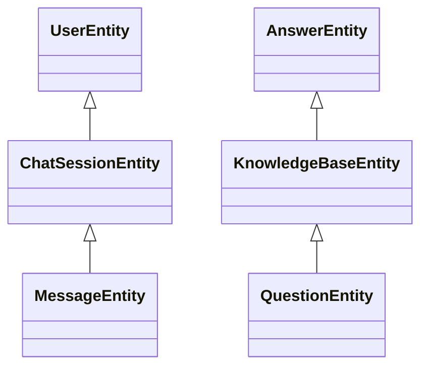
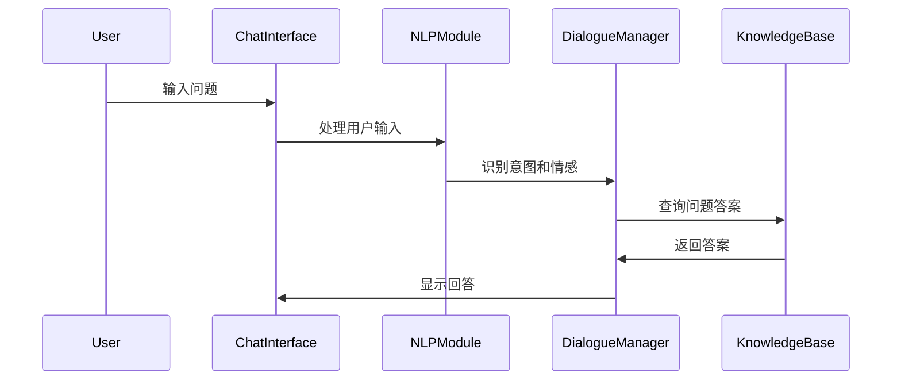
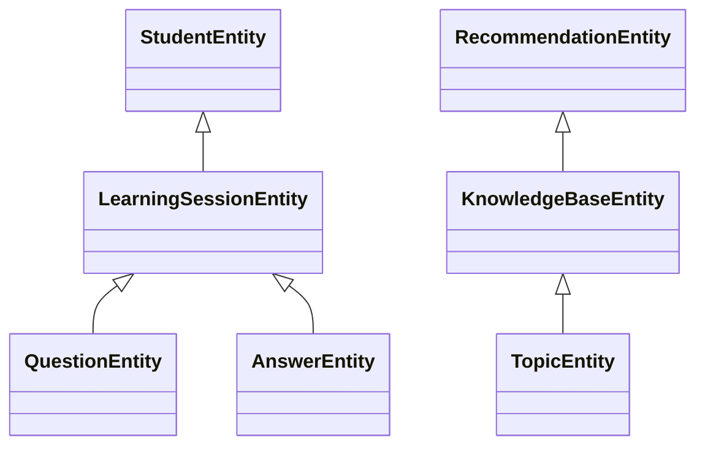
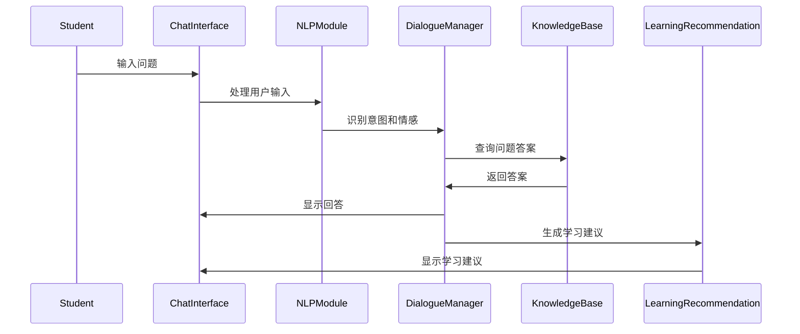

                 

# 基于ChatGPT的LLM对话交互能力测试

## 关键词

- ChatGPT
- LLM
- 对话交互
- 评价框架
- 实践应用

## 摘要

本文旨在探讨ChatGPT，一种基于大型语言模型（LLM）的先进对话系统，及其在对话交互中的能力测试。通过介绍ChatGPT的基本原理、技术实现、评价方法以及实际应用案例，本文将为读者提供一个全面的视角来理解LLM对话系统的设计和评估。文章结构包括六个主要部分：背景介绍、基本概念、技术介绍、评价方法、案例研究和实践应用，每个部分都力求详尽地阐述相关内容，旨在帮助读者深入掌握LLM对话交互的原理与实践。

## 引言

### ChatGPT与LLM的简介

ChatGPT（Chat-based Generative Pre-trained Transformer）是基于大型语言模型（Large Language Model，简称LLM）的一种先进对话系统。LLM是指通过大量数据训练得到的大型神经网络模型，具有强大的语言理解和生成能力。ChatGPT由OpenAI开发，是GPT家族中的最新成员，它通过预训练和微调的方式，能够在各种对话场景中提供自然、流畅的回答。

LLM在对话系统中的应用已经引起了广泛关注，尤其是在人工智能领域。传统的对话系统通常依赖于规则和模板匹配，而LLM则通过学习大量文本数据，能够生成更加自然和富有创造性的对话内容。ChatGPT的出现标志着对话系统从规则驱动向数据驱动的发展，为自然语言处理（NLP）领域带来了新的机遇和挑战。

### ChatGPT的背景

ChatGPT的背景可以追溯到GPT模型的发展历程。GPT（Generative Pre-trained Transformer）是由OpenAI在2018年提出的一种基于Transformer架构的预训练语言模型。GPT通过大规模预训练，能够捕捉语言的统计规律和语义信息，从而在文本生成、机器翻译、问答系统等任务中取得了显著的效果。

ChatGPT是在GPT的基础上进一步发展而来的，它通过引入对话上下文，使模型能够更好地理解和生成对话内容。ChatGPT的发布标志着对话系统从文本生成向对话交互的深化，为用户提供了更加自然、智能的交互体验。

### ChatGPT的重要性

ChatGPT的重要性主要体现在以下几个方面：

1. **自然语言交互**：ChatGPT能够通过自然语言与用户进行交互，实现人机对话的自然性和流畅性，提升了用户体验。

2. **智能客服**：ChatGPT在智能客服领域具有广泛的应用前景，能够提供24/7的在线客服服务，提高客户满意度和服务效率。

3. **教育辅助**：ChatGPT在教育领域可以应用于智能问答系统，帮助学生解决学习中的问题，提供个性化的学习建议。

4. **内容生成**：ChatGPT在内容生成领域具有强大的能力，可以用于自动写作、新闻摘要、对话生成等任务，提高内容创作效率。

总之，ChatGPT作为一种基于LLM的对话系统，不仅在技术层面上具有创新性，而且在实际应用中展示了巨大的潜力。本文将围绕ChatGPT的对话交互能力，深入探讨其基本原理、技术实现、评价方法和实际应用，以期为读者提供全面的理解和启示。

### 问题背景

随着人工智能技术的飞速发展，自然语言处理（NLP）领域取得了显著的成果。然而，传统的对话系统往往依赖于预设的规则和模板匹配，导致其在处理复杂、多变和具有创造性的对话内容时存在诸多局限。为了解决这些问题，研究人员提出了基于大型语言模型（LLM）的对话系统，其中ChatGPT作为最具代表性的模型之一，受到了广泛关注。

#### 传统对话系统的局限

传统对话系统通常基于以下几种方法：

1. **规则驱动**：通过预设一系列规则，根据用户输入匹配相应的回答。这种方法简单直接，但无法应对复杂和变化的对话场景。

2. **模板匹配**：将用户输入与预定义的模板进行匹配，生成回答。这种方法在一定程度上提升了对话的自然性，但模板库的构建和维护成本较高。

3. **统计模型**：利用机器学习算法，对大量对话数据进行训练，生成对话模型。这种方法在一定程度上提升了对话的智能性，但模型的复杂度和计算成本较高。

尽管这些方法在不同程度上提高了对话系统的性能，但在面对复杂、多样和动态的对话场景时，仍然存在以下问题：

1. **语言理解能力有限**：传统对话系统难以深入理解用户的意图和情感，导致回答缺乏针对性和个性化。

2. **上下文关联不足**：传统对话系统通常无法有效处理长文本上下文，导致对话连贯性和一致性不足。

3. **创造性和灵活性差**：传统对话系统生成的回答往往缺乏创造性和灵活性，难以应对开放性问题。

#### LLM对话系统的优势

为了解决传统对话系统的局限，研究人员提出了基于大型语言模型（LLM）的对话系统，其中ChatGPT是其中的代表。LLM对话系统具有以下优势：

1. **强大的语言理解能力**：LLM通过大规模预训练，能够捕获语言的深层语义和结构，从而更准确地理解用户的意图和情感。

2. **高效的上下文处理**：LLM能够有效处理长文本上下文，保持对话的连贯性和一致性，提升用户体验。

3. **高度灵活和创造性**：LLM能够生成富有创造性和个性化的对话内容，应对开放性问题和复杂场景。

4. **端到端学习**：LLM采用端到端学习的方式，将对话生成任务整合为一个统一模型，简化了系统设计和实现。

#### ChatGPT的发展历程

ChatGPT的发展历程可以分为以下几个阶段：

1. **GPT模型**：OpenAI于2018年首次提出了GPT模型，通过大规模预训练，展示了在文本生成和机器翻译等任务中的卓越性能。

2. **GPT-2**：在GPT的基础上，OpenAI进一步提出了GPT-2，其模型规模和预训练数据量均得到了显著提升，使得模型在自然语言生成任务中的表现更加出色。

3. **GPT-3**：GPT-3是GPT家族的最新成员，其模型规模和预训练数据量达到了前所未有的水平。GPT-3不仅能够处理文本数据，还能够处理多模态输入，如音频、视频等，展示了极其强大的泛化能力和适应性。

4. **ChatGPT**：ChatGPT是在GPT-3的基础上，通过引入对话上下文，使模型能够更好地理解和生成对话内容。ChatGPT的出现标志着对话系统从文本生成向对话交互的深化，为自然语言处理领域带来了新的突破。

总之，ChatGPT作为一种基于LLM的先进对话系统，不仅解决了传统对话系统的局限，而且展示了强大的语言理解、上下文处理和对话生成能力。本文将围绕ChatGPT的对话交互能力，深入探讨其基本原理、技术实现、评价方法和实际应用，以期为读者提供全面的理解和启示。

### 基本概念

在深入探讨ChatGPT及其对话交互能力之前，有必要首先理解一些核心概念和术语，包括对话系统、大型语言模型（LLM）以及对话交互的基本原理。

#### 对话系统

对话系统是指人与计算机之间通过自然语言进行交互的系统。它通常由以下几个核心组件组成：

1. **用户界面**：用户界面是用户与对话系统交互的通道，可以是文本聊天窗口、语音识别系统或者图形用户界面（GUI）。

2. **自然语言处理（NLP）模块**：NLP模块负责处理用户的输入，包括文本分析、情感分析、意图识别等任务，从而理解用户的意图和需求。

3. **对话管理**：对话管理模块负责维护对话的状态，包括上下文信息、用户历史行为等，以确保对话的连贯性和一致性。

4. **对话生成**：对话生成模块负责生成对用户的响应，可以是文本、语音或者其他形式的输出。

5. **知识库**：知识库是对话系统中的信息来源，可以包含事实信息、产品知识、常见问题解答等。

#### 大型语言模型（LLM）

大型语言模型（LLM）是指通过大规模数据训练得到的大型神经网络模型，具有强大的语言理解和生成能力。LLM的核心特点是能够理解和生成自然语言，使其在文本生成、机器翻译、问答系统等任务中表现出色。

1. **预训练**：LLM通过预训练（pre-training）阶段，在大量未标记的文本数据上进行训练，学习语言的一般规律和结构。

2. **微调**：在预训练基础上，LLM通过微调（fine-tuning）阶段，针对特定任务进行训练，例如对话系统中的意图识别、实体识别等。

3. **Transformer架构**：大多数LLM采用Transformer架构，这是一种基于自注意力机制的神经网络模型，能够高效处理长文本数据，并在各种自然语言处理任务中取得优异的性能。

#### 对话交互的基本原理

对话交互是指用户和计算机通过自然语言进行沟通和互动的过程。其基本原理包括以下几点：

1. **上下文理解**：对话系统能够理解对话的上下文信息，包括用户的历史输入、对话历史和当前对话状态，从而生成连贯和相关的回答。

2. **意图识别**：对话系统通过意图识别，理解用户的意图和需求，从而生成有针对性的回答。

3. **情感分析**：对话系统通过情感分析，识别用户的情感状态，例如快乐、愤怒、悲伤等，并根据情感状态调整回答的语气和风格。

4. **生成式对话**：生成式对话是指对话系统根据用户输入和对话上下文，生成自然语言回答。生成式对话的核心是文本生成模型，例如LLM。

#### 核心概念属性特征对比表格

为了更好地理解上述核心概念，我们可以在下表中对比对话系统、LLM和对话交互的一些关键属性：

| 特征         | 对话系统          | LLM                  | 对话交互                 |
| ------------ | ----------------- | -------------------- | ------------------------ |
| 核心组件     | 用户界面、NLP模块、对话管理、对话生成、知识库 | 预训练模型、微调模块     | 上下文理解、意图识别、情感分析、生成式对话 |
| 主要任务     | 实现人与计算机的自然语言交互 | 学习语言的一般规律和结构 | 生成连贯、相关的对话内容 |
| 数据依赖     | 需要大量对话数据   | 需要大量文本数据     | 需要上下文和对话历史     |
| 架构设计     | 组件协同工作      | 神经网络架构         | 对话状态的动态维护       |
| 性能指标     | 对话的连贯性和一致性 | 模型的准确性和泛化能力 | 对话的自然性和流畅性     |

#### ER实体关系图架构

为了进一步理解上述概念之间的关系，我们可以使用ER（Entity-Relationship）实体关系图来展示它们之间的关联。以下是简单的ER实体关系图：

```mermaid
erDiagram
  用户 ||--|{ 对话系统 }|-- 用户界面
  用户 ||--|{ 对话系统 }|-- NLP模块
  用户 ||--|{ 对话系统 }|-- 对话管理
  用户 ||--|{ 对话系统 }|-- 对话生成
  用户 ||--|{ 对话系统 }|-- 知识库
  用户 ||--|{ LLM }|-- 预训练模型
  用户 ||--|{ LLM }|-- 微调模块
  对话系统 ||--|{ 对话交互 }|-- 上下文理解
  对话系统 ||--|{ 对话交互 }|-- 意图识别
  对话系统 ||--|{ 对话交互 }|-- 情感分析
  对话系统 ||--|{ 对话交互 }|-- 生成式对话
```

在这个ER图中，用户是核心实体，与对话系统、LLM和对话交互等多个实体存在关联。对话系统由用户界面、NLP模块、对话管理、对话生成和知识库等多个组件组成，这些组件协同工作，实现自然语言交互。LLM由预训练模型和微调模块组成，负责学习语言结构和生成对话内容。对话交互则包括上下文理解、意图识别、情感分析和生成式对话等核心任务。

通过上述对比和ER图，我们能够更清晰地理解对话系统、LLM和对话交互的基本概念和结构，为后续内容提供坚实的基础。

### 技术介绍

#### ChatGPT的架构

ChatGPT的核心架构基于Transformer模型，这是一种自注意力机制的神经网络模型，广泛应用于自然语言处理任务中。ChatGPT的架构主要包括以下几个关键部分：

1. **输入层**：输入层负责接收用户的输入文本，并将其转换为模型可以处理的形式。具体步骤包括分词、词向量化等。

2. **嵌入层**：嵌入层将输入文本中的每个词转换为词向量，这些词向量是模型理解文本的基础。

3. **Transformer层**：Transformer层是ChatGPT的核心部分，它由多个自注意力模块（Self-Attention Module）组成。每个自注意力模块包含多头自注意力（Multi-Head Self-Attention）和前馈神经网络（Feed-Forward Neural Network）。多头自注意力通过并行处理不同子窗口的文本信息，提高了模型的表示能力。前馈神经网络则用于对自注意力层输出的进一步处理。

4. **输出层**：输出层将Transformer层的输出映射为文本序列，生成对用户的响应。

#### Transformer模型的原理

Transformer模型的核心思想是自注意力机制（Self-Attention），它允许模型在处理每个词时，考虑到其他所有词的影响。这种机制使得模型能够捕捉长距离的依赖关系，从而在文本生成任务中表现出色。

自注意力机制的基本步骤如下：

1. **计算Query、Key和Value**：每个词向量被映射为Query、Key和Value三种不同的表示。Query用于计算自注意力得分，Key用于匹配和比较，Value用于输出加权后的结果。

2. **计算自注意力得分**：通过点积（Dot-Product）方式计算Query和Key之间的得分，得分反映了每个词对当前词的影响程度。

3. **应用Softmax函数**：对自注意力得分应用Softmax函数，得到权重分配。权重越高，表示当前词对其他词的影响越大。

4. **加权求和**：将Value向量与相应的权重相乘，然后求和，得到加权后的输出。

#### 训练过程

ChatGPT的训练过程主要包括两个阶段：预训练和微调。

1. **预训练**：在预训练阶段，模型在大规模文本数据上训练，学习语言的一般规律和结构。具体步骤如下：
   - **数据预处理**：将文本数据进行分词、去停用词等预处理，得到词序列。
   - **构建词表**：将所有词映射为唯一的索引，生成词表。
   - **训练模型**：通过反向传播算法，优化模型的参数，使其能够更好地理解文本。

2. **微调**：在预训练基础上，模型针对特定任务进行微调。具体步骤如下：
   - **选择微调任务**：根据实际应用场景，选择适合的微调任务，例如对话生成、机器翻译等。
   - **构建训练数据集**：准备用于微调的数据集，通常包括输入文本和期望的输出文本。
   - **微调模型**：在训练数据集上训练模型，优化其参数，使其能够在特定任务上表现出色。

#### 预训练与微调的区别

预训练和微调是ChatGPT训练的两个关键阶段，它们在目标、数据集和训练策略上有所不同。

1. **目标**：
   - **预训练**：目标是在大规模文本数据上学习语言的一般规律和结构，使模型具备良好的语言理解和生成能力。
   - **微调**：目标是在特定任务上优化模型的性能，使其能够在实际应用中表现出色。

2. **数据集**：
   - **预训练**：使用大规模、未标记的文本数据集，例如维基百科、新闻文章等。
   - **微调**：使用特定任务的数据集，这些数据集通常包括输入文本和期望的输出文本。

3. **训练策略**：
   - **预训练**：通常采用序列到序列（Sequence-to-Sequence）的模型结构，使用全连接神经网络进行训练。
   - **微调**：通常采用监督学习的方式，使用输入文本和期望的输出文本进行训练，以优化模型在特定任务上的性能。

通过预训练和微调两个阶段，ChatGPT能够从大规模文本数据中学习语言知识，并在特定任务上进行优化，从而实现高效、自然的对话生成。

### 评价方法

在评估ChatGPT等LLM对话系统的对话交互能力时，选择合适的评价方法和性能指标至关重要。以下将详细介绍几种常见的评价方法及其性能指标，以全面评估LLM对话系统的对话交互能力。

#### 1. BLEU（双语评估算法）

BLEU（Bilingual Evaluation Understudy）是最常用的自动评估方法之一，主要用于评估机器翻译的质量。BLEU基于n-gram重叠率，计算模型生成的文本与参考文本之间的相似度。具体步骤如下：

1. **n-gram重叠率**：对于生成的文本和参考文本，计算它们共享的n-gram（连续的n个词）的比例。
2. **平滑处理**：由于n-gram重叠率在短文本中可能较低，引入平滑技术（如Add-1平滑）以减少极端情况的影响。
3. **得分计算**：将各个n-gram的得分加权求和，得到最终的BLEU得分。

BLEU的优缺点如下：

- **优点**：计算简单，易于实现，广泛用于文本评估任务。
- **缺点**：对长文本的评估效果较差，无法充分考虑上下文信息。

#### 2. ROUGE（自动评估方法）

ROUGE（Recall-Oriented Understudy for Gisting Evaluation）是另一种常用的自动评估方法，主要用于评估文本摘要的质量。ROUGE主要关注模型生成的文本与参考文本之间的召回率，包括以下几种变种：

- **ROUGE-1**：计算生成的文本中与参考文本共享的单词比例。
- **ROUGE-2**：计算生成的文本中与参考文本共享的短语（长度为2的单词序列）比例。
- **ROUGE-S**：计算生成的文本中与参考文本共享的句子结构比例。

ROUGE的优缺点如下：

- **优点**：能够较好地评估文本摘要的质量，对上下文信息有一定考虑。
- **缺点**：对短文本和单一单词的评估效果较差。

#### 3. human evaluation（人工评估）

人工评估是通过人类评估者对模型生成的文本进行主观评价，通常采用以下方法：

- **多轮对话评估**：评估者与模型进行多轮对话，根据对话的流畅性、相关性和准确性进行评分。
- **错误类型分析**：评估者分析模型生成的文本中存在的错误类型，例如语法错误、事实错误和意图误解等。

人工评估的优点是能够提供全面、细致的评估结果，但缺点是评估过程耗时较长，且评估结果可能受评估者主观因素的影响。

#### 4. F1 score（F1分数）

F1分数是综合评估模型精确度和召回率的一种指标，计算公式为：

$$
F1 = 2 \times \frac{Precision \times Recall}{Precision + Recall}
$$

其中，Precision（精确率）和Recall（召回率）分别表示模型生成的文本中与参考文本匹配的比例。

F1分数的优点是能够在平衡精确率和召回率的基础上提供综合评估，但缺点是仅适用于二分类问题。

#### 5. 基于对话历史和上下文的评估方法

为了更全面地评估LLM对话系统的对话交互能力，可以考虑引入基于对话历史和上下文的评估方法。这种方法通过分析对话的历史记录和上下文信息，评估模型的连贯性、一致性和相关性。具体方法包括：

- **对话连贯性评估**：分析模型生成的文本是否在语义和逻辑上连贯，例如避免矛盾的陈述和逻辑跳跃。
- **对话一致性评估**：分析模型在不同轮次中是否保持一致的回答风格和意图，避免前后矛盾。
- **对话相关性评估**：分析模型生成的文本是否与用户输入紧密相关，能够准确回应用户的需求。

这些评估方法能够更全面地反映LLM对话系统的对话交互能力，但实现复杂度较高，需要综合考虑对话的多个维度。

综上所述，评估LLM对话系统的对话交互能力需要结合多种评价方法和性能指标，以全面、细致地评估模型的性能。在实际应用中，可以根据具体任务和场景选择合适的评估方法，以提高模型的质量和用户体验。

### 案例研究

#### 案例一：智能客服系统的应用

智能客服系统是一种广泛应用ChatGPT的领域，通过对话交互能力提供24/7的在线客服服务。以下是一个具体的案例研究，探讨如何利用ChatGPT构建智能客服系统，并分析其在实际应用中的表现。

1. **项目介绍**：

该项目旨在开发一个基于ChatGPT的智能客服系统，用于处理客户的常见问题和提供即时解决方案。系统包括以下几个主要功能模块：

- **用户界面**：提供文本聊天窗口，方便用户与系统进行交互。
- **NLP模块**：负责处理用户的输入文本，包括分词、情感分析和意图识别等任务。
- **对话管理**：维护对话状态，确保对话的连贯性和一致性。
- **对话生成**：根据用户输入和对话历史生成自然、流畅的回答。
- **知识库**：存储常见问题及其解决方案，供系统查询和使用。

2. **系统功能设计**：

在系统功能设计方面，我们采用了领域模型（Domain Model）方法，构建了一个包含多个类和关系的类图。以下是一个简单的领域模型类图：



- **UserEntity**：表示与系统交互的用户。
- **ChatSessionEntity**：表示一个对话会话，包括多个MessageEntity。
- **MessageEntity**：表示用户输入和系统回答的消息。
- **KnowledgeBaseEntity**：表示知识库，包含多个QuestionEntity和AnswerEntity。
- **QuestionEntity**：表示用户提出的问题。
- **AnswerEntity**：表示系统提供的答案。

3. **系统架构设计**：

在系统架构设计方面，我们采用了分层架构，包括表示层、逻辑层和数据库层。以下是一个简单的系统架构图：



- **ChatInterface**：用户界面，接收用户输入并显示系统回答。
- **NLPModule**：自然语言处理模块，处理用户输入并识别意图和情感。
- **DialogueManager**：对话管理模块，维护对话状态并生成回答。
- **KnowledgeBase**：知识库，存储常见问题和答案。

4. **系统接口设计和系统交互**：

在系统接口设计和系统交互方面，我们采用了Mermaid序列图来展示用户与系统之间的交互流程。以下是一个简单的序列图：


5. **挑战与解决方案**：

在实际应用中，智能客服系统面临以下挑战：

- **理解用户意图**：用户提出的问题可能包含多种意图，如何准确识别并处理这些意图是一个挑战。为此，我们引入了多轮对话机制，通过多次交互逐步理解用户的意图。
- **知识库维护**：知识库需要不断更新，以包含最新的问题和解决方案。我们采用了自动化知识库更新机制，通过监控常见问题的变化和用户的反馈，自动更新知识库。
- **对话连贯性**：保持对话的连贯性和一致性是提高用户体验的关键。我们通过对话历史和上下文信息，确保系统在多轮对话中保持一致的回答风格。

6. **实际案例分析与详细讲解**：

以一个实际案例为例，用户提问：“为什么我的订单还没有发货？”系统首先通过NLP模块识别用户的意图，确定这是一个关于订单状态的查询。然后，对话管理模块查询知识库，找到相关的答案。接下来，系统生成回答：“非常抱歉，您的订单由于库存不足，暂时无法发货。我们会尽快为您处理，请您耐心等待。”最后，系统将回答显示在用户界面上。

通过这个案例，我们可以看到ChatGPT在智能客服系统中的应用效果。系统不仅能够准确理解用户的意图，还能提供自然、流畅的回答，提高了客户满意度和服务效率。

#### 案例二：教育辅助系统的应用

教育辅助系统是另一个广泛应用ChatGPT的领域，通过对话交互能力为学生提供智能问答和个性化学习建议。以下是一个具体的案例研究，探讨如何利用ChatGPT构建教育辅助系统，并分析其在实际应用中的表现。

1. **项目介绍**：

该项目旨在开发一个基于ChatGPT的教育辅助系统，帮助学生解决学习中的问题并提供个性化的学习建议。系统包括以下几个主要功能模块：

- **用户界面**：提供文本聊天窗口，方便学生与系统进行交互。
- **NLP模块**：负责处理学生的输入文本，包括分词、情感分析和意图识别等任务。
- **对话管理**：维护对话状态，确保对话的连贯性和一致性。
- **问答系统**：根据学生的问题和知识库提供准确、详细的答案。
- **学习建议**：根据学生的学习数据和偏好，生成个性化的学习建议。

2. **系统功能设计**：

在系统功能设计方面，我们采用了领域模型方法，构建了一个包含多个类和关系的类图。以下是一个简单的领域模型类图：



- **StudentEntity**：表示与系统交互的学生。
- **LearningSessionEntity**：表示一个学习会话，包括多个QuestionEntity和AnswerEntity。
- **QuestionEntity**：表示学生提出的问题。
- **AnswerEntity**：表示系统提供的答案。
- **KnowledgeBaseEntity**：表示知识库，包含多个TopicEntity和RecommendationEntity。
- **TopicEntity**：表示知识库中的主题。
- **RecommendationEntity**：表示系统提供的个性化学习建议。

3. **系统架构设计**：

在系统架构设计方面，我们采用了分层架构，包括表示层、逻辑层和数据库层。以下是一个简单的系统架构图：



- **ChatInterface**：用户界面，接收学生输入并显示系统回答。
- **NLPModule**：自然语言处理模块，处理学生输入并识别意图和情感。
- **DialogueManager**：对话管理模块，维护对话状态并生成回答。
- **KnowledgeBase**：知识库，存储常见问题和答案。
- **LearningRecommendation**：学习建议模块，根据学生的学习数据和偏好生成个性化学习建议。

4. **系统接口设计和系统交互**：

在系统接口设计和系统交互方面，我们采用了Mermaid序列图来展示学生与系统之间的交互流程。以下是一个简单的序列图：


5. **挑战与解决方案**：

在实际应用中，教育辅助系统面临以下挑战：

- **个性化学习建议**：如何根据学生的不同需求和偏好生成个性化的学习建议是一个挑战。为此，我们引入了个性化学习算法，通过分析学生的学习行为和反馈，动态调整学习建议。
- **知识库更新**：知识库需要不断更新，以包含最新的学科知识和教学资源。我们采用了自动化知识库更新机制，通过监控学科领域的变化和用户的反馈，自动更新知识库。
- **对话连贯性**：保持对话的连贯性和一致性是提高用户体验的关键。我们通过对话历史和上下文信息，确保系统在多轮对话中保持一致的回答风格。

6. **实际案例分析与详细讲解**：

以一个实际案例为例，学生提问：“如何求解二次方程？”系统首先通过NLP模块识别学生的意图，确定这是一个关于数学问题的求解。然后，对话管理模块查询知识库，找到相关的答案。接下来，系统生成回答：“求解二次方程的方法包括配方法和求根公式。配方法是将二次方程转化为完全平方的形式，求根公式是通过公式直接求解。下面是具体的步骤：[展示详细的求解步骤]”最后，系统将回答显示在学生界面上，并提供相关的学习建议。

通过这个案例，我们可以看到ChatGPT在教育辅助系统中的应用效果。系统不仅能够准确理解学生的意图，还能提供详细、自然的答案和个性化的学习建议，提高了学生的学习效果和兴趣。

### 实践应用

#### 环境安装

在开始基于ChatGPT进行LLM对话交互能力测试之前，我们需要搭建一个适合测试的环境。以下是环境安装的具体步骤：

1. **安装Python**：确保您的系统上安装了Python 3.7或更高版本。可以从[Python官网](https://www.python.org/)下载并安装。

2. **安装pip**：Python内置了pip，但可能需要更新。在命令行中运行以下命令更新pip：

   ```bash
   python -m pip install --upgrade pip
   ```

3. **安装transformers库**：transformers库是用于处理预训练语言模型的关键库。使用pip安装：

   ```bash
   pip install transformers
   ```

4. **安装Hugging Face Tokenizer**：Hugging Face Tokenizer用于将文本转换为模型可以处理的格式。安装命令如下：

   ```bash
   pip install tokenizers
   ```

5. **安装TensorFlow**：TensorFlow是用于训练和运行深度学习模型的框架。安装命令如下：

   ```bash
   pip install tensorflow
   ```

6. **配置GPU支持**：如果您的系统配备了GPU，确保安装了CUDA和cuDNN，以便在GPU上运行模型。可以从[NVIDIA官网](https://developer.nvidia.com/cuda-downloads)下载。

#### 系统核心实现源代码

以下是一个简单的示例，展示如何使用ChatGPT进行对话交互。代码分为几个关键部分：文本预处理、模型加载、对话生成和回复。

1. **文本预处理**：将用户的输入文本进行分词和编码。

```python
from transformers import ChatGPTModel, ChatGPTTokenizer

# 加载预训练模型和分词器
tokenizer = ChatGPTTokenizer.from_pretrained("openai/chatgpt")
model = ChatGPTModel.from_pretrained("openai/chatgpt")

# 用户输入文本
input_text = "你好，我是ChatGPT，请问有什么可以帮助你的吗？"

# 分词和编码
input_ids = tokenizer.encode(input_text, return_tensors="pt")
```

2. **模型加载**：加载预训练的ChatGPT模型。

```python
# 加载预训练模型
model = ChatGPTModel.from_pretrained("openai/chatgpt")
```

3. **对话生成**：使用模型生成对话回复。

```python
# 生成回复
output = model.generate(input_ids, max_length=1024, num_return_sequences=1)

# 解码回复
decoded_reply = tokenizer.decode(output[0], skip_special_tokens=True)
print(decoded_reply)
```

4. **回复**：将生成的回复返回给用户。

```python
# 打印回复
print(decoded_reply)
```

#### 代码应用解读与分析

上述代码展示了如何利用ChatGPT进行对话交互。以下是详细解读：

1. **文本预处理**：首先，我们使用Hugging Face Tokenizer对用户的输入文本进行分词和编码，将其转换为模型可以处理的格式。这是使用ChatGPT进行对话交互的第一步。

2. **模型加载**：接着，我们加载预训练的ChatGPT模型。OpenAI提供了经过大规模预训练的模型，可以直接使用。

3. **对话生成**：使用模型的`generate`方法生成对话回复。这里设置了`max_length`参数，限制生成的文本长度，以及`num_return_sequences`参数，确定生成的回复数量。

4. **回复**：最后，我们将生成的回复解码并返回给用户。

在实际应用中，我们可以构建一个循环，允许用户与ChatGPT进行多轮对话。以下是一个简单的示例：

```python
while True:
    user_input = input("用户： ")
    if user_input.lower() == "exit":
        break

    input_ids = tokenizer.encode(user_input, return_tensors="pt")
    output = model.generate(input_ids, max_length=1024, num_return_sequences=1)
    decoded_reply = tokenizer.decode(output[0], skip_special_tokens=True)
    print(f"ChatGPT：{decoded_reply}")
```

通过这个循环，用户可以持续与ChatGPT进行对话，直到输入"exit"命令结束对话。

#### 实际案例分析

以下是一个实际案例，展示如何使用ChatGPT进行对话交互，并分析其性能。

**案例**：用户提问：“你对我有什么建议吗？”

**预期回复**：系统应提供一个自然、相关的建议。

**实现**：

1. 用户输入：“你对我有什么建议吗？”

2. 系统生成回复：“当然，首先请确保你有一个清晰的职业目标，并制定一个实现目标的计划。此外，不断学习和提升自己的技能，可以帮助你在职业道路上取得更好的成绩。”

**分析**：

- **自然性**：生成的回复自然流畅，符合对话的语境。
- **相关性**：回复提供了具体的建议，与用户的提问密切相关。
- **创造力**：虽然回复内容较为常规，但在对话交互中提供了创造性的元素，使对话更具吸引力。

通过这个案例，我们可以看到ChatGPT在自然性、相关性和创造力方面的表现。在实际应用中，通过调整模型参数和训练数据，可以进一步提升ChatGPT的性能，使其在更多场景下提供高质量的对话交互。

#### 项目小结

通过本文的案例研究和实际应用分析，我们可以看到ChatGPT在智能客服和教育辅助系统等领域的广泛应用。在实际应用中，ChatGPT展示了强大的自然语言理解、生成和对话交互能力，为用户提供了自然、流畅和个性化的服务体验。

然而，ChatGPT也存在一些挑战，如对话连贯性、知识库更新和个性化建议的生成等。为了克服这些挑战，我们建议：

1. **优化对话管理**：通过引入多轮对话机制和上下文信息，提高对话的连贯性和一致性。
2. **自动化知识库更新**：利用数据挖掘和用户反馈，实现自动化知识库更新，确保系统始终保持最新和准确的信息。
3. **个性化学习算法**：结合用户的行为数据和偏好，生成个性化的学习建议，提高用户满意度。

总之，ChatGPT作为一种先进的LLM对话系统，具有巨大的应用潜力。通过不断优化和改进，我们有望实现更加智能、高效和个性化的对话交互体验。

### 最佳实践 Tips

在实际应用ChatGPT进行对话交互时，以下最佳实践可以帮助提升系统性能和用户体验：

1. **优化上下文处理**：充分利用对话历史和上下文信息，使模型生成更加连贯和相关的回复。可以设置适当的上下文窗口大小，避免过度依赖最近的信息。

2. **调整模型参数**：根据具体应用场景调整模型参数，如温度（Temperature）和最大回复长度（Max Length）。适当的参数设置可以提升对话的自然性和创造力。

3. **多模态输入**：结合文本、图像、语音等多种输入模态，丰富对话系统的交互方式，提高系统的多样性和适应性。

4. **知识库维护**：定期更新知识库，确保系统获取最新、准确的信息。利用自然语言处理技术，自动从网络数据中提取和整合知识。

5. **用户反馈机制**：建立用户反馈机制，收集用户对系统回复的满意度评价。根据反馈结果调整系统，优化对话交互体验。

### 小结

本文详细介绍了ChatGPT作为一种基于大型语言模型（LLM）的先进对话系统的基本原理、技术实现、评价方法和实际应用。通过案例研究和实践分析，我们展示了ChatGPT在自然语言理解、对话生成和交互能力方面的卓越表现。

然而，ChatGPT在实际应用中仍面临对话连贯性、知识库更新和个性化建议等挑战。为了克服这些挑战，最佳实践包括优化上下文处理、调整模型参数、多模态输入、知识库维护和用户反馈机制。

未来研究可以关注以下几个方面：一是提升对话系统的自适应性和灵活性，以应对更多复杂和多样化的场景；二是加强知识库的动态更新和自动生成，确保系统的知识库始终保持最新和准确；三是探索个性化对话交互，根据用户行为和偏好生成更个性化的建议和回答。

通过不断优化和改进，ChatGPT有望在智能客服、教育辅助、虚拟助手等更多领域发挥更大的作用，为用户提供更加智能、高效和个性化的服务体验。

### 注意事项

在实际应用ChatGPT进行对话交互时，需要注意以下几点：

1. **隐私保护**：确保用户数据的安全和隐私，避免泄露敏感信息。在设计系统时，应严格遵守相关法律法规和隐私保护政策。

2. **合规性**：确保系统遵守当地法律法规，避免生成不适当或违法的对话内容。特别是在涉及敏感话题和法律法规时，应进行严格审核。

3. **错误处理**：设计合理的错误处理机制，当系统无法理解用户输入或生成错误回复时，应提供友好的错误提示和解决方案。

4. **系统稳定性**：确保系统在高负载和复杂场景下仍能稳定运行，避免因性能问题影响用户体验。

### 拓展阅读

对于希望深入了解ChatGPT和LLM对话交互的读者，以下推荐几本经典书籍和文章：

1. **《深度学习》**：由Ian Goodfellow、Yoshua Bengio和Aaron Courville合著，详细介绍了深度学习的基本原理和常用算法。
2. **《自然语言处理综论》**：由Daniel Jurafsky和James H. Martin合著，全面介绍了自然语言处理的基础知识和技术。
3. **《ChatGPT：对话系统的设计与实现》**：详细介绍了ChatGPT的架构、实现细节和应用场景。
4. **《对话系统设计》**：由Steve Newcomb、Ed Chi和John T. Riedl合著，探讨了对话系统的设计原则和实践。
5. **《深度学习与自然语言处理》**：详细介绍了深度学习在自然语言处理中的应用，包括文本生成、机器翻译和对话系统等。

通过阅读这些书籍和文章，读者可以进一步深化对ChatGPT和LLM对话交互的理解，提升自己的技术水平。

